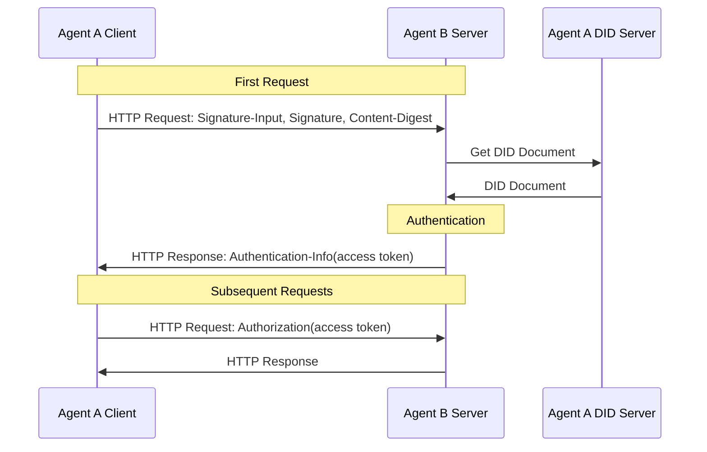
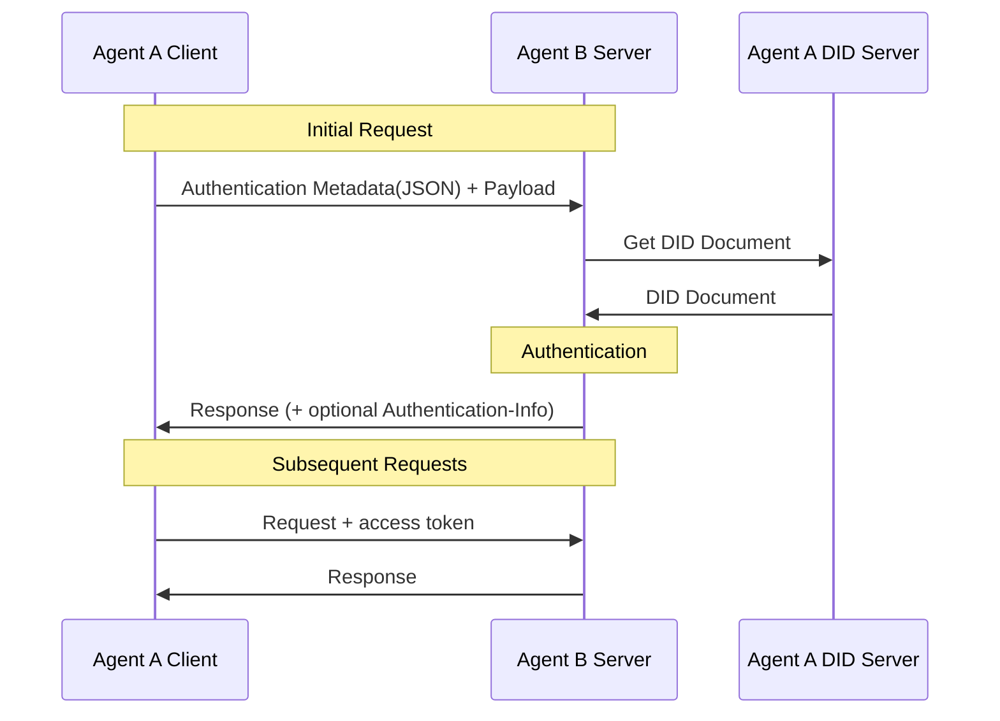

# ANP DID Authentication Protocol

- Document ID: ANP-02
- Status: Released
- Version: 1.2
- Language: English
- Chinese mirror: [ANP 基于 DID 的身份认证协议](chinese/02-ANP-基于DID的身份认证协议.md)

<a id="scope"></a>
## 1. Scope

This specification defines DID-based cross-platform authentication, including HTTP request signatures, JSON authentication metadata carriage, server verification, challenges and errors, and optional access tokens.

The authentication flow is independent of the DID method. `did:wba` and native `did:web` resolve and validate DID Documents under their respective method rules, then use the common request-authentication flow in this specification. The method governs how identity material is obtained and validated; this specification governs request signatures, digests, and authentication-key authorization.

Ordinary HTTP APIs may adopt this authentication without implementing ANP Messaging, WNS, or a device Manifest. There is no normative dependency on Messaging P1–P9 or WNS. Business permissions, human authorization, message origin proof, and E2EE object proof are defined by their owning application or Profile; authentication alone does not imply business authority.

MUST, MUST NOT, SHOULD, SHOULD NOT, and MAY express normative requirements as defined by BCP 14.

<a id="identity-input"></a>
## 2. DID methods and identity material

| DID method | Identity-material validation | Request authentication |
|---|---|---|
| `did:wba` | ANP-03 syntax, Documents, keys, resolution, updates, deactivation, and continuity; see Appendix A | Chapters 3 and 4 |
| `did:web` | Native did:web resolution and the identity-verification requirements in Appendix B | Chapters 3 and 4 |

Document authenticity, identity binding, and lifecycle rules belong to each DID method. After method validation, this specification checks authentication-key authorization, request signatures, and digests; it does not define method-specific proofs or state mechanisms.

Algorithms and key representations follow the selected verification method and applicable method rules. Appendix D describes other-method adaptation, and Appendix C describes WebVH integration. DID Core conformance alone does not mean an implementation supports the method.

<a id="common-model"></a>
<a id="http-binding"></a>
## 3. HTTP Request Authentication

When a client initiates a request to a server on a different platform, the client can use the domain name combined with TLS to authenticate the server, and the server verifies the client's identity based on the verification method in the client's DID document.

When the client makes the first HTTP request, it uses the `Signature-Input` and `Signature` headers defined by [RFC 9421](https://www.rfc-editor.org/rfc/rfc9421) for signature; if the request carries a message body, it uses the `Content-Digest` header defined by [RFC 9530](https://www.rfc-editor.org/rfc/rfc9530) to bind the integrity of the message body. After the first verification is passed, the server can return the access token, and the client will carry the access token in subsequent requests. The server does not need to verify the client's identity every time, but only needs to verify the access token.



### 3.1 Initial request

When the current client initiates an HTTP request to the server for the first time, it needs to perform identity authentication according to the following method.

#### 3.1.1 Request header format

Clients MUST send authentication information using the `Signature-Input` and `Signature` header fields defined in [RFC 9421](https://www.rfc-editor.org/rfc/rfc9421). When a request includes a message body, the client MUST also send the `Content-Digest` header field defined in [RFC 9530](https://www.rfc-editor.org/rfc/rfc9530).

The minimum signature coverage set is as follows:

- `@method`
- `@target-uri`
- `content-digest` (when the request contains a message body)

Recommended additional components for coverage are as follows:

- `@authority`
- `content-type`
- `content-length`

The key parameter requirements in `Signature-Input` are as follows:

- `keyid`: MUST be a complete DID URL, pointing to a verification method in the DID document, for example:
  `did:web:identity.example:alice#key-1`
- `created`: MUST, indicating the signature creation time
- `expires`: SHOULD, indicating the signature expiration time
- `nonce`: MAY be carried; if `nonce` is given in the server challenge, the client MUST use that `nonce`
- `alg`: Non-required field. This specification does not mandate the use of the `alg` parameter, the verifier can determine the algorithm based on the DID verification method type pointed to by `keyid`

Authentication-key selection follows the applicable DID method and local authorization policy; the selected verification method must be authorized by the subject Document's `authentication` relationship.

Client request example:

```plaintext
POST /orders HTTP/1.1
Host: api.example.com
Content-Type: application/json
Content-Digest: sha-256=:BASE64_SHA256_DIGEST:
Signature-Input: sig1=("@method" "@target-uri" "@authority" "content-digest");created=1733402096;expires=1733402156;nonce="abc123";keyid="did:web:identity.example:alice#key-1"
Signature: sig1=:BASE64_SIGNATURE:
```

Signature-generation requirements specific to a DID method are defined by that method specification; see Section 2.

#### 3.1.2 Signature generation process

1. If the HTTP request contains a message body, the client first calculates the `Content-Digest` value of the message body according to [RFC 9530](https://www.rfc-editor.org/rfc/rfc9530).

2. Select the signing verification method under the applicable DID method and local authorization policy.
   - If the selected verification method uses an Ed25519 key represented by `Multikey`, it should be signed using the Ed25519 algorithm;
   - Other algorithms are defined by corresponding verification method types.

3. Construct `Signature-Input`, covering at least `@method` and `@target-uri`; if a message body exists, `content-digest` must also be covered.

4. Generate a signature base string (signature base) according to the rules defined in [RFC 9421](https://www.rfc-editor.org/rfc/rfc9421).

5. Use the client private key to sign the signature base, obtain the signature byte string, and write it into the `Signature` header field.

6. Send `Signature-Input`, `Signature`, and (if applicable) `Content-Digest` to the server.

### 3.2 Server-side verification

#### 3.2.1 Verification request header

After receiving the client request, the server performs the following verification:

1. **Verify request format**: Check whether `Signature-Input` and `Signature` exist; when the request contains a message body, check whether `Content-Digest` exists.

2. **Verify message body integrity**: When the request contains a message body, verify whether `Content-Digest` is consistent with the actual message body according to [RFC 9530](https://www.rfc-editor.org/rfc/rfc9530).

3. **Extract `keyid` and parse DID**: Extract `keyid` from `Signature-Input` to obtain the corresponding DID and verification method.

4. **Resolve and validate the DID Document**: Resolve and validate the Document under the applicable DID method. Its specification governs identity state and restrictions on new authentication; method-specific responses are addressed in Section 3.2.4.3.

5. **Verify DID binding relationship**:
   - Verify that the verification method pointed to by `keyid` exists;
   - Verify that the verification method is authorized by the `authentication` relationship of the DID document;
   - Method-specific identity-binding verification follows the corresponding DID method specification; see Section 2 and its method binding.

6. **Verify signature coverage**: Rebuild the signature base based on `Signature-Input`, and verify that the HTTP components covered by the signature are consistent with the actual request.

7. **Verification time window**: Check whether `created` / `expires` is within a reasonable time range. The recommended time window is 1 minute to 5 minutes, which is configurable by the implementer.

8. **Verification Replay Protection**:
   - For direct connection proof profile, the server should establish a short-term replay cache for `(keyid, nonce)` or equivalent keys;
   - For challenge profile, if `nonce` comes from a server challenge, then `nonce` MUST be used one at a time.

9. **Verify DID permission**: After successful authentication, independently verify whether the DID in the request has the permission to access server resources. If there is no permission, `403 Forbidden` is returned.

10. **Verification result**: If the signature verification is successful, the request passes the authentication; otherwise, `401 Unauthorized` is returned with challenge information attached.

Identity-verification requirements specific to a DID method are defined by that method specification; see Section 2.

#### 3.2.2 Signature verification process

1. Parse the signature tag, coverage component, `created`, `expires`, `nonce`, `keyid` and other parameters from `Signature-Input`, and extract the corresponding signature value from `Signature`.

2. According to [RFC 9421](https://www.rfc-editor.org/rfc/rfc9421) rules, the signature base is reconstructed based on the actual HTTP request.

3. Obtain the corresponding verification method and public key from the DID document according to `keyid`.

4. Select the verification algorithm based on the verification method type:
   - For the Ed25519 verification method represented by `Multikey`, verify according to the 64-byte signature format of Ed25519;
   - Other algorithms are defined according to the corresponding verification method type.

5. Use the obtained public key to verify the signature to ensure that the signature is generated by the corresponding private key.

6. If the request contains a message body, the `Content-Digest` verification results should also be included in the overall certification conclusion.

<a id="access-tokens"></a>
#### 3.2.3 Successful authentication returns access_token

After the server-side verification is successful, the access token can be returned in the response. The access token is recommended to use JWT (JSON Web Token) format. The client's subsequent requests carry the access token. The server does not need to verify the client's DID identity every time, but only needs to verify the access token. The following generation process is not required by the specification and is for reference only. Implementers can define and implement it as needed.

JWT generation method reference [RFC7519](https://www.rfc-editor.org/rfc/rfc7519).

1. **Generate Access Token**

Assuming that the server uses **JWT (JSON Web Token)** as the Access Token format, JWT usually contains the following fields:

- **header**: Specify signature algorithm
- **payload**: stores user related information
- **signature**: Sign `header` and `payload` to ensure their integrity

The payload can contain the following fields (other fields are added as needed):

```json
{
  "sub": "did:web:identity.example:alice",
  "iat": "2024-12-05T12:34:56Z",
  "exp": "2024-12-06T12:34:56Z",
  "scope": "orders.read orders.write"
}
```

2. **Return Access Token**

The server MUST return the access token via the `Authentication-Info` response header, not the `Authorization` response header.

Example:

```plaintext
Authentication-Info: access_token="eyJhbGciOi...", token_type="Bearer", expires_in=3600, scope="orders.read orders.write"
```

3. **Suggestions on sender-constrained token**

In order to reduce the risk of the token being directly reused after being leaked, it is recommended to use **sender-constrained** access token to bind the token to the key held by the client.

This version of the specification retains this extension capability, but does not yet fully define the specific profile of sender-constrained token. Implementers can reserve the following capabilities for future expansion:

- Add a statement bound to the client's public key in the token (such as `cnf` or equivalent field);
- Require the client to continue to provide proof bound to the token in subsequent requests;
- Differentiate different token profiles through the `token_type` field.

Before the sender-constrained profile is unified, for the sake of compatibility, you can use `Bearer` as the default `token_type`.

4. **Client sends Access Token**

The client usually sends the Access Token via the `Authorization` header field in subsequent requests:

```plaintext
Authorization: Bearer <access_token>
```

If the `token_type` returned by the server is not `Bearer`, the client MUST send the token according to the corresponding extension specification.

5. **Server-side verification Access Token**

After receiving the client's request, the server extracts the Access Token from the `Authorization` header and performs verification, including verifying the signature, verifying the expiration time, verifying the fields in the payload, etc. The verification method refers to [RFC7519](https://www.rfc-editor.org/rfc/rfc7519).

<a id="challenge-errors"></a>
#### 3.2.4 Error handling

##### 3.2.4.1 401 response

When the server fails to verify the signature, `Content-Digest` fails to verify, the signature expires, there is a risk of replay, or the server requires the client to re-sign according to the challenge information, it can return a `401 Unauthorized` response.

If the server requires that the client must use the `nonce` issued by the server for signature, it can return `401` when the client makes the first request and append the challenge information to the response. This adds an interaction that implementers can choose to use or not if needed.

Error information is returned through the `WWW-Authenticate` header field, and the server can also indicate the components it expects to cover in the next request through `Accept-Signature`. Examples are as follows:

```plaintext
WWW-Authenticate: DIDWba realm="api.example.com", error="invalid_signature", error_description="Signature verification failed.", nonce="xyz987"
Accept-Signature: sig1=("@method" "@target-uri" "@authority" "content-digest");created;expires;nonce;keyid
Cache-Control: no-store
```

Contains the following fields:

- **realm**: optional field, indicating the domain to which the protected resource belongs
- **error**: required field, error type, containing the following string values:
  - `invalid_request`: The request is malformed, missing required fields, or contains unsupported parameters
  - `invalid_nonce`: Nonce is used, is invalid, or does not match the server challenge
  - `invalid_timestamp`: timestamp out of range
  - `invalid_did`: The DID format is wrong, or the corresponding DID document cannot be found based on the DID.
  - `invalid_signature`: Signature verification failed
  - `invalid_verification_method`: Unable to find the corresponding public key based on `keyid`
  - `invalid_content_digest`: `Content-Digest` does not match the message body
  - `invalid_access_token`: access token verification failed
  - `forbidden_did`: DID does not have permission to access server resources
- **error_description**: optional field, error description
- **nonce**: Optional field, a random string generated by the server. If carried, the client needs to use the `nonce` to regenerate the signature and reinitiate the request

After the client receives the `401` response, if the response carries `nonce`, it needs to use the server's `nonce` to regenerate the signature and reinitiate the request. If the response does not carry `nonce`, the client can regenerate the local `nonce` and try again.

It should be noted that the client and server need to limit the number of retries in their respective implementations to prevent an infinite loop.

##### 3.2.4.2 403 response

When server-side authentication is successful, but the DID does not have the permission to access server-side resources, a `403 Forbidden` response can be returned.

##### 3.2.4.3 Method-specific responses

Identity-state errors and subsequent handling are defined by the applicable DID method; see its method binding. Common authentication errors use Sections 3.2.4.1 and 3.2.4.2.

<a id="json-carriage"></a>
## 4. JSON Authentication Metadata Carriage

The preceding chapter defines DID-based HTTP authentication. Other transports can carry authentication metadata using component mappings defined by their application-layer protocols. This section only defines the method for carrying the authentication information in Section 3 as JSON metadata, and does not redefine the new set of fields to be signed.

This section applies to scenarios where request metadata and business payload can be separated at the application layer, for example:

- HTTP body encapsulation
- WebSocket first package
- Message bus envelope
- Custom RPC request wrapping layer

For pure JSON-only transmission that cannot separate the "authentication metadata" and "business payload" boundaries, this section is not directly applicable, and subsequent versions can define specialized transport profiles.

Protocols based on other data formats can also adopt this authentication mechanism.

The overall process is as follows:



### 4.1 Initial request

When the current client initiates a request to the server for the first time, it needs to perform identity authentication according to the following method.

#### 4.1.1 Authentication information data format

When authentication information cannot be placed in an HTTP header, the authentication fields from Section 3 can be put into a separate JSON metadata object, such as the `auth` field.

The recommended format is as follows:

```json
{
  "auth": {
    "contentDigest": "sha-256=:BASE64_SHA256_DIGEST:",
    "signatureInput": "sig1=(\"@method\" \"@target-uri\" \"@authority\" \"content-digest\");created=1733402096;expires=1733402156;nonce=\"abc123\";keyid=\"did:web:identity.example:alice#key-1\"",
    "signature": "sig1=:BASE64_SIGNATURE:"
  },
  "payload": {
    "orderId": "12345",
    "action": "create"
  }
}
```

Field description:

- **auth.contentDigest**: Corresponds to `Content-Digest` in the HTTP header. If there is a business load, it is used to bind `payload`
- **auth.signatureInput**: corresponds to `Signature-Input` in the HTTP header
- **auth.signature**: corresponds to `Signature` in the HTTP header
- **payload**: business data ontology

In JSON bearer mode, `contentDigest` binds the **payload part** instead of the entire encapsulated object including `auth`. `auth` is outer authentication metadata and does not participate in the business load summary.

If `payload` is a JSON object rather than a raw byte sequence, the implementer should fix its serialization rules locally; it is recommended to use the JCS (JSON Canonicalization Scheme) of [RFC8785](https://www.rfc-editor.org/rfc/rfc8785) to stably serialize `payload` before calculating `contentDigest`.

Authentication information can be sent in a separate request or together with business request data.

#### 4.1.2 Signature generation process

The signature generation process is the same as 3.1.2 Signature generation process. The difference is:

1. `Content-Digest`, `Signature-Input` and `Signature` are no longer sent through HTTP headers, but through JSON metadata objects (such as `auth`);
2. `contentDigest` is bound by default to the byte representation of `payload`, not the entire encapsulated object;
3. If the underlying protocol is still HTTP, the meaning of `@method` and `@target-uri` remains unchanged; if the underlying protocol is not HTTP, the equivalent components of the target message should be clearly defined by the corresponding application layer protocol.

### 4.2 Server-side verification

#### 4.2.1 Identity verification request

The verification process is the same as 3.2.1 Verification request header. The difference is that the `contentDigest`, `signatureInput`, and `signature` fields need to be extracted from the `auth` object in the request data.

At the same time, when verifying `contentDigest`, the server should only perform digest verification on the `payload` part.

After passing the verification, if the underlying transmission is still HTTP, the server returns the access token in the same way as 3.2.3, that is, through the `Authentication-Info` response header.

If the underlying transport does not support the response header, this specification does not standardize the alternative return method of the access token, which is defined by the upper layer protocol.

#### 4.2.2 Error handling

Error handling is the same as 3.2.4 Error handling.

If the underlying transport is HTTP, the `WWW-Authenticate` and `Accept-Signature` headers are still the source of authority challenge information. The application layer can also mirror these error fields in the JSON response body to facilitate caller processing.

Example of returning a 401 response using JSON format:

```json
{
  "code": 401,
  "error": "invalid_nonce",
  "error_description": "Nonce has already been used. Please provide a new nonce.",
  "nonce": "1234567890"
}
```

Example of returning a 403 response using JSON format:

```json
{
  "code": 403,
  "error": "forbidden_did",
  "error_description": "did not have permission to access the resource."
}
```

## 5. Authentication and Application Authorization

For requests that are not very important, the user agent can automatically authorize, such as accessing a hotel's agent and reading hotel information. At this time, manual confirmation by humans is not required. The user agent can initiate the request on its own behalf.

For important requests, such as booking a hotel room, the hotel agent may require manual confirmation from a human. However, the semantics of "whether human confirmation is required" belong to an upper-layer authorization policy, not to an independent field in the DID Document. A DID Document declares authentication verification methods through `authentication`; this authentication specification does not define a `humanAuthorization` field.

The agent can define the authorization type of the document or interface in the agent description document. By default, all ordinary authorizations are sufficient. If a request requires manual authorization by a human, this should be clearly defined in the documentation, for example:

- `authorizationLevel: normal`
- `authorizationLevel: user-presence-required`

When a request requires manual human authorization, the user agent should first complete the corresponding confirmation process locally (such as click confirmation, biometrics, secure hardware approval, etc.), and then use the `authentication` key allowed by the policy to sign and initiate the request.

What the server verifies is: whether the request meets the agreed high-level authorization policy; rather than simply inferring from the DID document that "this signature must have been completed by a human being".

Agent developers need to securely keep private keys used for high-level operations and isolate permissions. For example, relevant keys can only be called after passing the local security confirmation process.

## 6. Privacy Considerations

Privacy protection is very important in a decentralized network. For example, illegal software may record and track the user's behavior through the user's DID, causing the leakage of user privacy.

In this regard, we suggest that DID providers can adopt a multi-DID strategy, that is, generate multiple DIDs for one user, each DID has different roles and permissions, and uses different key pairs to achieve privacy protection and fine-grained permission control.

For example, a master DID is generated for the user. This DID generally does not change and is used in scenarios such as maintaining social relationships. Then a series of sub-DIDs are generated for the user, which can be used for shopping, ordering takeout, booking tickets and other scenarios. These sub-DIDs are subordinate to the main DID, and expired DIDs can be periodically deactivated and new DIDs applied to improve privacy and security protection.

A name service (such as WNS/Handle) can provide a stable human-readable name; naming bindings and DID lifecycles are governed by their corresponding specifications.

<a id="security-privacy"></a>
## 7. Security Considerations

Implementers need to consider the following security issues when implementing:

1. **Key Management**

- The private key corresponding to DID must be kept properly and must not be leaked. In addition, a mechanism for regularly refreshing the private key should be established.
   - Users should generate multiple DIDs, each with different roles and permissions, and use different key pairs to achieve fine-grained permission control.

2. **Anti-attack measures**

- The server **must** implement replay protection. For direct connection proof profile, a short-term replay cache should be established for `(keyid, nonce)`, `(keyid, jti)` or equivalent keys; for challenge profile, `nonce` issued by the server must be used one at a time.
   - The server must determine the `created` / `expires` time window in the request to prevent time rollback attacks. Generally speaking, the cache time of the server's replay cache should be longer than the signature expiration time.
   - When generating `nonce`, you **must** use a secure random number generator provided by the operating system, complying with modern cryptographic security specifications and standards. For example, you can use a module like Python's `secrets` to generate secure random numbers.
   - When the request contains a message body, the server must verify `Content-Digest` to prevent the message body from being tampered with.
   - Successful authentication does not equal successful authorization. The server must handle authorization judgment and identity authentication separately.

3. **Transmission Security**

- When obtaining DID documents, the server should use the DNS-over-HTTPS (DoH) protocol to improve security.
   - The transmission protocol **must** use HTTPS, and the client **must** strictly determine whether the other party's CA certificate is trustworthy.
   - When performing TLS service identity verification, the client **must** match according to `dNSName` in `subjectAltName` and should not rely on Common Name.
   - Unconditional following of untrusted cross-origin redirects should be avoided during DID resolution.

4. **Token Security**

- The client and server **must** properly keep the Access Token, and **must** set a reasonable expiration time.
   - **should** be preferred over sender-constrained access tokens. This specification has reserved expansion capabilities, but the specific profile has not yet been fully defined.
   - IP address, User-Agent and other information can only be used as auxiliary risk signals and should not be used as the only binding mechanism for Access Token.
   - The access token **SHOULD** only be returned on HTTPS connections and sent via the `Authentication-Info` response header.

<a id="wba-binding"></a>
## Appendix A. did:wba Method Binding

WBA identity material and method constraints for request authentication are defined by [ANP-03](03-did-wba-method-design-specification.md#wba-auth-binding). Implementations complete that method's validation and key selection before using the common authentication flow in Chapters 3 and 4; ANP-03 also defines its method-specific responses.

<a id="web-binding"></a>
## Appendix B. did:web Method Binding

Native `did:web` uses this specification's HTTP/JSON request authentication without conversion to `did:wba`. Resolve identity Documents under the [did:web method specification](https://w3c-ccg.github.io/did-method-web/) and apply the following verification rules.

For example, with `keyid` set to `did:web:identity.example:alice#auth`, the server resolves `did:web:identity.example:alice` under did:web, checks the authentication authorization of `#auth`, then verifies the request under Chapters 3 and 4. Its identity material is validated under the native Web method.

### B.1 Parsing and verification rules

When an implementation receives a native `did:web`, it MUST perform parsing according to the `did:web` method specification and complete at least the following checks:

1. Parse DID Document according to `did:web` rules;
2. Check whether the `id` of the DID Document is completely consistent with the requested `did:web`;
3. Check according to DID Core rules whether the relevant verification method exists and is in the correct verification relationship.

Implementations MUST NOT make identifier-binding, document-proof, or lifecycle rules specific to another DID method prerequisites for successful native `did:web` validation.

If the native `did:web` DID Document itself carries a standard proof (such as Data Integrity proof), the implementation MAY perform verification according to the proof's declaration profile and local policy; other methods' document-proof requirements do not apply to native `did:web`.

### B.2 Compatibility with cross-platform authentication

Native `did:web` is compatible with the cross-platform identity authentication process defined in Chapters 3 and 4 of this specification.

When the client uses `did:web` to participate in cross-platform authentication:

1. `keyid` still MUST be a complete DID URL;
2. The server must still parse the DID Document;
3. The server must still verify that the verification method pointed to by `keyid` exists;
4. The server must still (MUST) verify that the verification method is located in the `authentication` relationship of the DID Document;
5. Subsequent HTTP Message Signatures / `Content-Digest` verification follows the common authentication flow in Chapters 3 and 4.

The identity-binding semantics of `did:web` follow its own method-resolution and verification rules.

<a id="webvh-design"></a>
## Appendix C. WebVH Integration (Informative)

`did:webvh` can supply authentication-key material after its document history and state are validated under its method specification, then reuse the common request-authentication flow. The exact version, history/state verification, and adaptation implementation remain unspecified; this document does not define an immediately enabled WebVH binding.

<a id="method-template"></a>
## Appendix D. Other DID Methods (Informative)

Other W3C DID Core methods may supply identity and authentication-key material through their own resolution and verification rules. Their adaptation specifications should identify the method revision, verification method types, signature algorithms, and supported scope before using this specification's common request-authentication flow.

<a id="references"></a>
## References

- [DID Core v1.0](https://www.w3.org/TR/2022/REC-did-core-20220719/)
- [RFC 2119: Normative requirement keywords](https://www.rfc-editor.org/rfc/rfc2119)
- [RFC 8174: Uppercase and lowercase normative keywords](https://www.rfc-editor.org/rfc/rfc8174)
- [RFC 9421: HTTP Message Signatures](https://www.rfc-editor.org/rfc/rfc9421)
- [RFC 9530: Digest Fields](https://www.rfc-editor.org/rfc/rfc9530)
- [RFC 8785: JSON Canonicalization Scheme](https://www.rfc-editor.org/rfc/rfc8785)
- [RFC 7519: JSON Web Token](https://www.rfc-editor.org/rfc/rfc7519)
- [ANP-03: did:wba Method Specification](03-did-wba-method-design-specification.md)
- [did:web Method Specification](https://w3c-ccg.github.io/did-method-web/)

## Copyright Notice

Copyright (c) 2024 ANP Open Source Community
This file is released under the [Apache License 2.0](LICENSE). You are free to use and modify it, but you must retain this copyright notice.
