# Two programs meet for the first time. How does either know the other is not an impostor?

This guide starts from that one question and takes ANP apart piece by piece. **No cryptography or networking background required.**

> [!TIP]
> This is the **static version**; its 47 collapsible cards open and close.
> For the full interactive version — sliders, toggles, live computation — **[open it here](https://htmlpreview.github.io/?https://gist.githubusercontent.com/SeaOceanO/5b4d58cba66502d3dbf599ec050612b1/raw/ANP-guide-interactive-en.html)**

## Contents

**Groundwork**

- [§00 · Glossary](#00--first-the-vocabulary)
- [§01 · The problem](#01--what-the-problem-looks-like)
- [§02 · Why the old way falls short](#02--the-old-way-every-service-hands-you-a-key)

**Where identity comes from**

- [§03 · Identity is a URL](#03--the-new-idea-the-identity-is-itself-an-address-you-can-open)
- [§04 · From identity to URL](#04--how-the-other-side-knows-where-to-look-you-up)
- [§05 · What is inside the ID](#05--open-that-address--what-is-inside)

**Proving it is really you**

- [§06 · The five steps of signing](#06--proving-i-am-who-i-say-i-am-five-steps)
- [§07 · That one header line](#07--the-product-one-scary-looking-line-of-text)
- [§08 · The server's five gates](#08--what-the-server-does-five-gates-in-a-row)
- [§09 · Three attackers](#09--how-three-attackers-each-come-up-short)
- [§10 · e1: key bound to identity](#10--binding-the-key-to-the-identity-e1)

**After the introduction**

- [§11 · The ad.json introduction](#11--identity-confirmed--now-what-can-you-do)
- [§12 · Finding other programs](#12--how-do-you-know-which-programs-are-out-there)
- [§13 · When formats do not match](#13--when-the-two-sides-do-not-share-a-format-negotiate-first)
- [§14 · Keeping content private](#14--last-piece-can-the-relay-server-see-the-content)

**The big picture**

- [§15 · The four layers](#15--step-back-the-whole-thing-in-four-blocks)

---

## §00 · First, the vocabulary


Every technical word that shows up later is explained here in plain language — come back any time. Each entry only uses ideas defined above it, so you never get a new term explained by another new term.

**Identity**


<details>
<summary><b>Agent</b> <code>agent</code></summary>
<p>A program that can send requests on its own and answer requests on its own. Think of it as software that runs errands for you.</p>
</details>
<details>
<summary><b>DID</b> <code>identifier</code></summary>
<p>A string that stands for an identity. It works like an ID number, except it carries its own lookup address.</p>
</details>
<details>
<summary><b>did:wba</b> <code>the flavour ANP uses</code></summary>
<p>The second half is just a domain name. <b>Whoever owns the domain owns the identity</b> — no application to any authority.</p>
</details>
<details>
<summary><b>DID document</b> <code>did.json</code></summary>
<p>A small file hosted under that domain, containing the identity's public key. Like the front of an ID card: anyone may look.</p>
</details>
<details>
<summary><b>verification method</b> <code>verificationMethod</code></summary>
<p>One public-key entry inside a DID document. A document can hold several, each for a different purpose.</p>
</details>
<details>
<summary><b>fingerprint</b> <code>fingerprint</code></summary>
<p>A short string squeezed out of a public key. Change one character of the key and the fingerprint looks completely different.</p>
</details>
<details>
<summary><b>e1</b> <code>the e1 form</code></summary>
<p>Writing the fingerprint into the tail of the identity string. Like stamping the key's serial number onto the ID number itself.</p>
</details>

**Security**


<details>
<summary><b>public / private key</b> <code>key pair</code></summary>
<p>Two matching strings of numbers. Keep the private one; publish the public one freely. Only the matching public key can check what the private key did.</p>
</details>
<details>
<summary><b>signature</b> <code>signature</code></summary>
<p>A short string computed from some content using a private key. Checking it with the public key proves two things: <b>this private key signed it</b>, and <b>not one character of the content was altered</b>.</p>
</details>
<details>
<summary><b>hash / SHA-256</b> <code>hash</code></summary>
<p>Squeezes content of any length into a fixed-length string. Change the content a little and the result is unrecognisable.</p>
</details>
<details>
<summary><b>JCS</b> <code>canonicalisation</code></summary>
<p>Rules for writing JSON exactly one way: keys in alphabetical order, no stray whitespace. That is the only way the signer and the verifier end up with <b>the same bytes</b>.</p>
</details>
<details>
<summary><b>nonce</b> <code>one-time random string</code></summary>
<p>Void after a single use. Stops anyone from replaying a request you already sent.</p>
</details>
<details>
<summary><b>timestamp</b> <code>timestamp</code></summary>
<p>The moment the request was sent. The server only accepts recent ones.</p>
</details>
<details>
<summary><b>end-to-end encryption</b> <code>E2EE</code></summary>
<p>Only the two ends can read the content — not even the relay server in the middle.</p>
</details>

**Communication**


<details>
<summary><b>HTTP header</b> <code>header</code></summary>
<p>The few lines of explanation at the front of a network request, before the body. A postscript that comes first.</p>
</details>
<details>
<summary><b>Authorization header</b></summary>
<p>The one header line reserved for identity information. ANP packs the identity, the random string, the time and the signature into this single line.</p>
</details>
<details>
<summary><b>access token</b> <code>temporary pass</code></summary>
<p>A credential the server issues after verifying you once. Later requests just carry it, with no re-verification.</p>
</details>
<details>
<summary><b>ad.json</b> <code>agent description</code></summary>
<p>A program's self-introduction file: who I am, what I can do, where my interfaces are. Like the menu board outside a restaurant.</p>
</details>
<details>
<summary><b>meta-protocol</b> <code>meta-protocol</code></summary>
<p>The round where two programs, before getting down to business, agree in plain language on what format to speak in.</p>
</details>


---

## §01 · What the problem looks like


Say there's an assistant program on your phone. You tell it "order me a coffee." It has to go talk to the coffee shop's program. **These two programs have never dealt with each other before**, and they share no account system.

Each side has its own worry — expand the two panels below.

<details>
<summary><b>What the assistant worries about</b></summary>
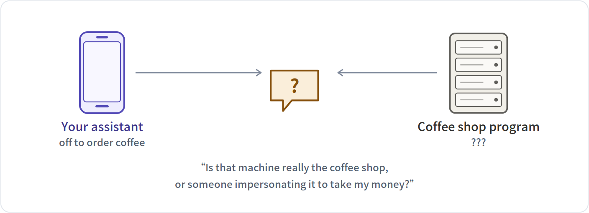<p><b>Browsers solved this one long ago</b>: the little padlock in the address bar (HTTPS) does exactly this. Certificates are issued by recognised authorities and cannot be faked. ANP simply reuses it rather than reinventing it.</p>
</details>

<details>
<summary><b>What the coffee shop worries about</b></summary>
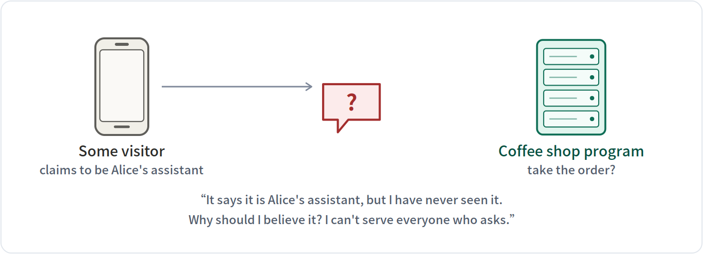<p><b>This is the one ANP is for.</b> The hard part is that the two sides have no prior relationship — no shared account system, no password exchanged in advance.</p>
</details>

The first worry was solved long ago by browsers — that's exactly what the little padlock (HTTPS) in the address bar is for. **ANP is about the second one**: how the server confirms that whoever sent the request is genuine.


---

## §02 · The old way: every service hands you a key


Today you register an account with each service you want to use and get a password string (the industry calls it an API key). Here is what happens as the number of services grows.

Three services:
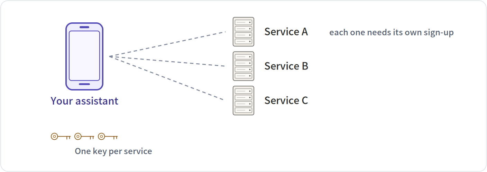

Six services:
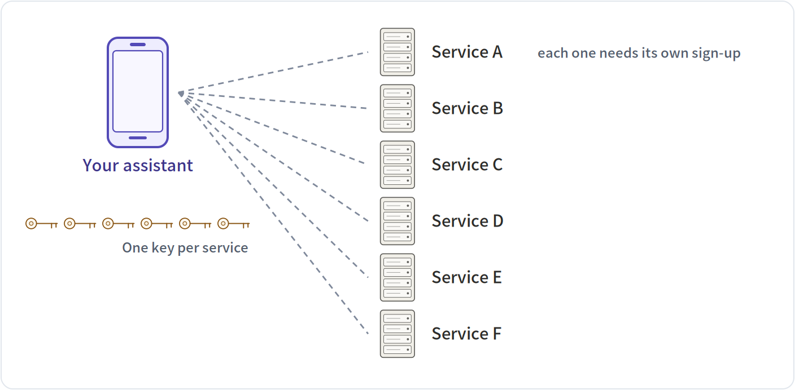


| | 3 services | 6 services |
|---|---|---|
| Secrets you must keep | 3 | 6 |
| Sign-ups needed first | 3 | 6 |
| Parties who also know your secret | 3 | 6 |

Three problems: **the count grows with every party you connect to**; **you must register before you can say a single word**; and worst of all, **both sides know the secret** — so when something leaks, nobody can say who leaked it.

> [!NOTE]
> **In one line** A shared secret means "we both know the same thing." ANP flips it: **I know something only I know, and you can verify that I know it.**


---

## §03 · The new idea: the identity is itself an address you can open


An ANP identity looks like this. It reads like gibberish, but it splits into segments and each one has a job. The table below takes all five apart.


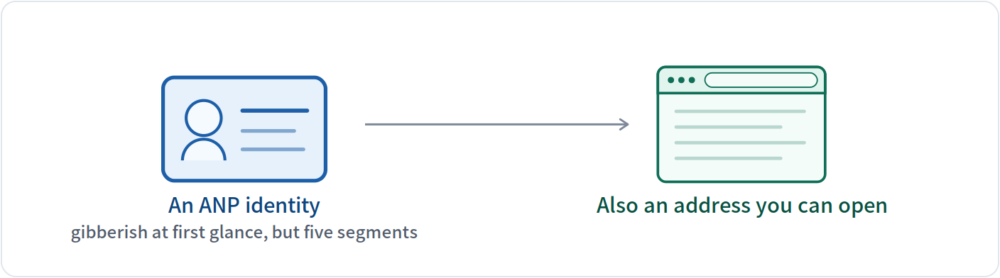


```
did:wba:example.com%3A8800:user:alice:e1_CfnI4TulguySDoAXRS1fm8zhAIDTxP9IByHouGTGfUY
```

| Segment | What it is | Detail |
|---|---|---|
| `did` | fixed prefix | Every identifier of this kind starts with did, meaning “this is a decentralised identifier.” Like the country code in front of every phone number. |
| `:wba` | which rulebook | wba is the rulebook ANP picked. It defines how the following segments are read and where to look them up. A different method name means completely different rules. |
| `:example.com%3A8800` | domain (and port) | This segment decides who owns the identity: whoever controls this domain controls this identity. %3A is an escaped colon, because the colon is already taken as the separator here, so a port number has to be written this way. |
| `:user:alice` | path | One domain can host many identities, told apart by path. user / alice later becomes two directory levels in the URL. |
| `:e1_CfnI4TulguySDoAXRS1fm8zhAIDTxP9IByHouGTGfUY` | public-key fingerprint | The last segment is a hardening measure: e1_ followed by the fingerprint of this identity's public key. That locks the key to the identity string itself, so nobody can swap it. See §10. |

The point is that no central authority is involved anywhere: **if you own a domain, you can issue your own identity**, without applying to anybody.


---

## §04 · How the other side knows where to look you up


When the server receives that identity string, it first turns it into an address it can open, then fetches the public key from there. There are four rules; below they run one at a time, with the resulting URL at the bottom.


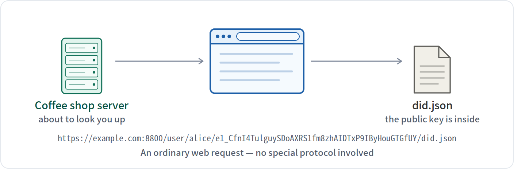


| Rule | What it does | Why |
|---|---|---|
| 1 | Split on colons | segment 3 is the domain; every segment after it is one path level |
| 2 | Turn %3A back into a colon | the port's colon was escaped inside the identity; restore it or it collides with the separator |
| 3 | Prepend https:// | identities of this kind only travel over HTTPS — that padlock is where the trust comes from |
| 4 | Append the path, then did.json | with no path it uses /.well-known/did.json instead |

The resulting URL:

```
https://example.com:8800/user/alice/e1_CfnI4TulguySDoAXRS1fm8zhAIDTxP9IByHouGTGfUY/did.json
```

These four rules are fixed and every implementation follows them — so the URL you work out anywhere else will be identical to this one.


---

## §05 · Open that address — what is inside


What comes back is the file below. This is a real one generated with the SDK, with a few minor fields removed. The table below explains each field.

```jsonc
{
  "id": "did:wba:example.com%3A8800:user:…GTGfUY",
  "verificationMethod": [
    { "id": "…#key-1", "type": "Multikey",
      "publicKeyMultibase": "z6Mkt7CwZUzDo3dF4VKvmmXbmbZdvyvUirDfZ1jQVKemkXv7" },
    { "id": "…#key-2", "type": "EcdsaSecp256r1VerificationKey2019", … },
    { "id": "…#key-3", "type": "X25519KeyAgreementKey2019", … }
  ],
  "authentication": [ "…#key-1" ],
  "keyAgreement":   [ "…#key-3" ],
  "service": [
    { "type": "AgentDescription",
      "serviceEndpoint": "https://example.com/agents/alice/ad.json" }
  ],
  "proof": {
    "type": "DataIntegrityProof", "cryptosuite": "eddsa-jcs-2022",
    "proofValue": "KbDvKOJ4oqVxHhlNkcxMimQumPfIPgsgG0P9s-aKc0Lm…"
  }
}
```

| Field | What it is | Detail |
|---|---|---|
| `id` | the identity's own number | Must match the string in your request exactly. The first thing the server does after fetching the file is compare this; a mismatch means it fetched the wrong file. |
| `verificationMethod` | the key list | The heart of the file. Each entry is one public key with its own purpose. There are three here, so this identity has three keys. |
| `publicKeyMultibase` | the key itself | The actual public-key value in a compact text encoding. This is what gets used to check a signature. |
| `authentication` | which key proves identity | Picks one key from the list above and designates it for “proving I am me.” Here it points at #key-1. |
| `keyAgreement` | which key is for encryption | Picks another one, used to negotiate encryption keys — the one that locks content. Here it points at #key-3. |
| `service` | where else to find me | Optional. It records the URL of the self-introduction file (the ad.json of §11), so others can follow it. |
| `proof` | the file's own signature | The whole document is signed by its own private key. Change a single character and this signature stops matching. |

Notice there is **only a public key in here, never a private one**. This file is public — anyone can download it — but downloading it does not let anyone impersonate you, because signing needs the private key, and the private key never leaves your device.


---

## §06 · Proving “I am who I say I am”: five steps


With the public key posted online, the next job is to prove on the spot that you hold the matching private key. That takes five steps, like an assembly line.

Five cards below — **click a title to expand it**. Each one contains real output.

<details>
<summary><b>1. Pick four items</b> random string, time, the other side's domain, who I am</summary>
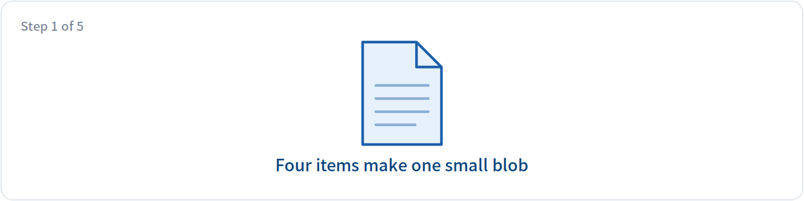<p><b>Why</b> What gets signed is not the whole request, only these four. One more or one fewer and the two sides compute different results.</p><pre><code>random string   7f3a91c25d0e46b8a1c47e29f0b3d85c
time            2026-07-27T04:00:00Z
for whom        example.com          ← the other side's domain
who I am        did:wba:example.com%3A8800:user:alice:e1…</code></pre><p><b>Note</b> “For whom” is the critical one: it <b>pins this proof to that one server</b>, so a different server will not accept it.</p>
</details>
<details>
<summary><b>2. Arrange in one canonical form</b> strict ordering, so both sides get the same bytes</summary>
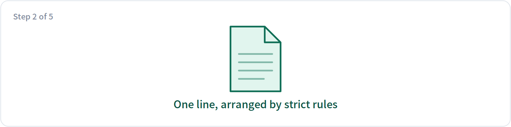<p><b>Why</b> The same content can be written countless ways (different order, different spacing). Arranging it by one strict rule first is the only way the signer and the verifier end up with the same bytes.</p><pre><code>{"aud":"example.com","did":"did:wba:example.com%3A8800:user:alice:e1_CfnI4TulguySDoAXRS1fm8zhAIDTxP9IByHouGTGfUY","nonce":"7f3a91c25d0e46b8a1c47e29f0b3d85c","timestamp":"2026-07-27T04:00:00Z"}</code></pre><p><b>Note</b> Notice the four items were re-sorted alphabetically: <code>aud → did → nonce → timestamp</code>. As long as both sides follow the same strict rule, programs written in any language can verify each other's signatures.</p>
</details>
<details>
<summary><b>3. Squeeze to a fixed length</b> any-length content becomes one fixed short string</summary>
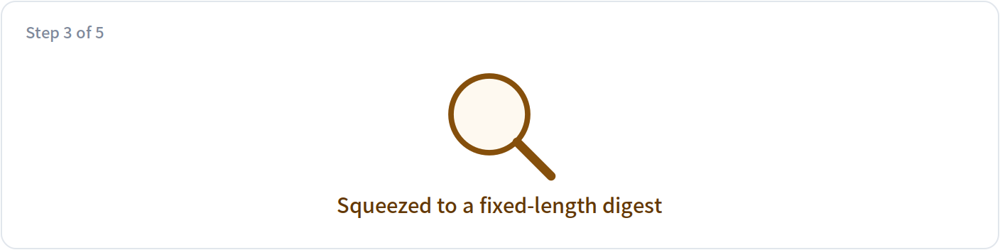<p><b>Why</b> That line has no fixed length. Squeezing it into a short fixed string first makes the signing algorithm faster and more predictable.</p><pre><code>2d403a0c8b772eeb176787b96f7f885488899ca4d1d33421437bd48abe8398af</code></pre><p><b>Note</b> Change one character of the content and these 64 digits become unrecognisable — which is exactly where a signature's power to prove “nothing was altered” comes from.</p>
</details>
<details>
<summary><b>4. Sign it with the private key</b> the only step in the whole process that uses the private key</summary>
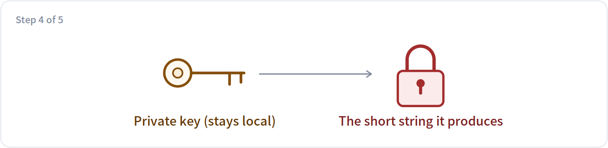<p><b>Why</b> This is the one place the private key is used. The result is visible to everyone, and forgeable by nobody.</p><pre><code>-b_gSKP85w3YOIr4cL9twlNTZF1XQbSJCdMBA4l8jyW45N-OEYzjZTRVcBPFBYUIeRX5f-EBOnqFfgQMXq-jDA</code></pre><p><b>Note</b> The private key <b>was never sent anywhere</b>. That is the fundamental difference from a shared password.</p>
</details>
<details>
<summary><b>5. Pack it into the request header</b> the finished product is that first line of the request</summary>
<p><b>Why</b> The identity, the random string, the time, which key was used and the signature all go into one line at the very front of the request.</p><pre><code>Authorization: DIDWba v="1.1", did="did:wba:example.com%3A8800:user:alice:e1_CfnI4TulguySDoAXRS1fm8zhAIDTxP9IByHouGTGfUY", nonce="7f3a91c25d0e46b8a1c47e29f0b3d85c", timestamp="2026-07-27T04:00:00Z", verification_method="key-1", signature="-b_gSKP85w3YOIr4cL9twlNTZF1XQbSJCdMBA4l8jyW45N-OEYzjZTRVcBPFBYUIeRX5f-EBOnqFfgQMXq-jDA"</code></pre><p><b>Note</b> This is what lets the server finish verification <b>on the very first request it receives</b>, with no preliminary “send me a challenge and I'll sign it” round.</p>
</details>


---

## §07 · The product: one scary-looking line of text


What those five steps produce is this single line, stuck at the very front of the request. The table below takes each piece apart: who wrote it, what it is, what it blocks, and what happens without it.

```http
Authorization: DIDWba v="1.1",
  did="did:wba:example.com%3A8800:user:alice:e1_CfnI4TulguySDoAXRS1fm8zhAIDTxP9IByHouGTGfUY",
  nonce="7f3a91c25d0e46b8a1c47e29f0b3d85c",
  timestamp="2026-07-27T04:00:00Z",
  verification_method="key-1",
  signature="-b_gSKP85w3YOIr4cL9twlNTZF1XQbSJCdMBA4l8jyW45N-OEYzjZTRVcBPFBYUIeRX5f-EBOnqFfgQMXq-jDA"
```

| Piece | Who wrote it | What it is | What it blocks | Without it |
|---|---|---|---|---|
| `DIDWba` | written by the assistant | The scheme name. It tells the server: read what follows by ANP's rules. | Stops it being confused with other authentication schemes. Checking these six characters is the first thing the server's parser does. | The server would not know which rules to read the rest by, and would simply error out. |
| `v="1.1"` | written by the assistant | The protocol version. It decides what the “for whom” slot from the previous section is called. | In principle it stops old and new versions signing different content. | Once the two sides disagree about the version, the content signed and the content verified no longer match, and verification is bound to fail. |
| `did=…` | written by the assistant | Who I am. The server uses it to work out where to fetch the public key (§04). | It is part of the signed content too, so altering it destroys the signature. | The server would have no idea which domain to fetch the key from. |
| `nonce=…` | rolled fresh by the assistant | A one-time random string. The server remembers the ones it has seen, so the same one coming back is a replay. | Stops anyone copying the whole line and sending it again. | The line becomes a pass usable an unlimited number of times — whoever copies it can keep impersonating you. |
| `timestamp=…` | written by the assistant | The moment it was sent. The server only accepts recent ones. | Stops stockpiling: signing a pile of lines and using them months later. It also determines how often the record of random strings can be cleaned out. | The record of random strings would have to be kept forever, or old requests become replayable again after a cleanup. |
| `verification_method=…` | written by the assistant | Which of the three keys was used. | Stops the server picking the wrong public key — this identity has three keys with different purposes. | The server could only try each one in turn, or hard-code “always the first”, which rules out ever rotating keys. |
| `signature=…` | computed by the assistant with the private key | The signature over the four items above. | Stops forgery and tampering: it cannot be produced without the private key, and altering any signed field invalidates it. | Every field above becomes plain text anyone can fill in, and the whole scheme amounts to nothing. |


---

## §08 · What the server does: five gates in a row


The server does not verify the signature first — verifying means fetching the public key over the network, which is expensive. So it runs a few cheap checks first. The five cards below each tamper with this request in a different way; **click a title to expand** and see which gate catches it.

All five passed:
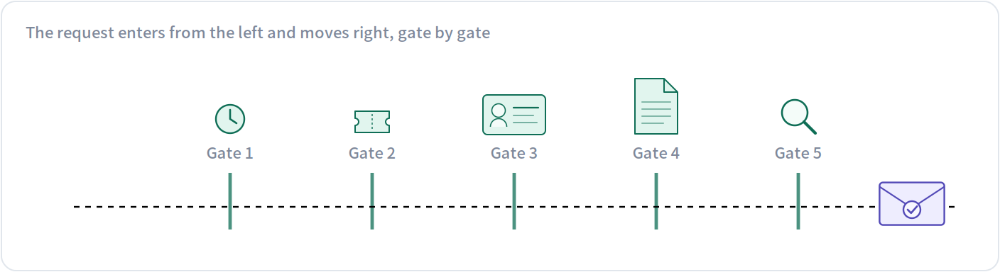


| Gate | Checks | How |
|---|---|---|
| 1 | Is the timestamp fresh | Look at the time in the header; accept only the last few minutes and drop anything older. |
| 2 | Has this random string been used | Check the recently seen random strings. A repeat is a replay. |
| 3 | Does this identity have permission | Is it a customer of this shop, may it touch this resource? Recognising you is not the same as letting you in. |
| 4 | Fetch the public key | Turn the identity into a URL by §04's rules and fetch did.json. This step goes over the network and is the slowest. |
| 5 | Verify the signature | Redo the four steps of §06 and check the signature against the public key. The most expensive step, so it goes last. |


**Tamper with the request and see which gate catches it:**


<details>
<summary><b>Set the time to an hour ago</b> → stopped at gate 1</summary>
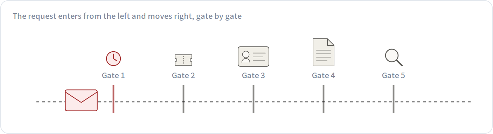<p>Gate 1 stopped it: <b>Is the timestamp fresh</b>. The gates after it never ran — in particular the expensive key fetch and signature check, saving a network round trip entirely.</p>
</details>
<details>
<summary><b>Reuse a random string from before</b> → stopped at gate 2</summary>
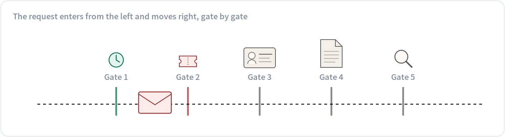<p>Gate 2 stopped it: <b>Has this random string been used</b>. The gates after it never ran — in particular the expensive key fetch and signature check, saving a network round trip entirely.</p>
</details>
<details>
<summary><b>Switch to an unauthorised identity</b> → stopped at gate 3</summary>
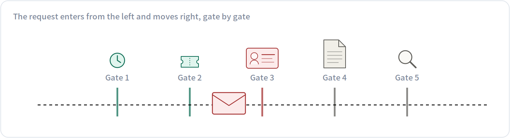<p>Gate 3 stopped it: <b>Does this identity have permission</b>. The gates after it never ran — in particular the expensive key fetch and signature check, saving a network round trip entirely.</p>
</details>
<details>
<summary><b>Delete did.json from the domain</b> → stopped at gate 4</summary>
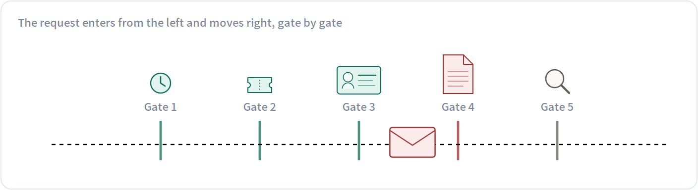<p>Gate 4 stopped it: <b>Fetch the public key</b>. The gates after it never ran — in particular the expensive key fetch and signature check, saving a network round trip entirely.</p>
</details>
<details>
<summary><b>Quietly alter one character of the signature</b> → stopped at gate 5</summary>
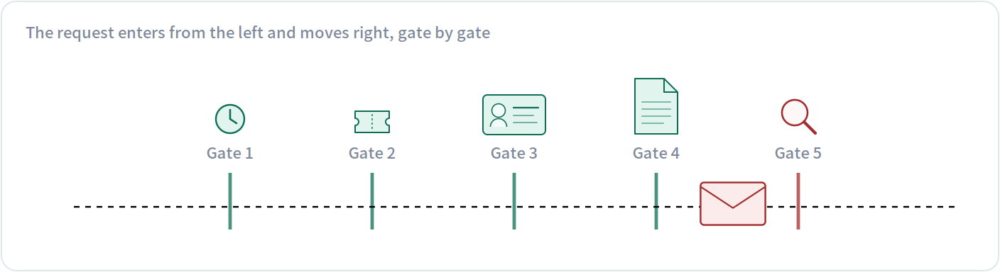<p>Gate 5 stopped it: <b>Verify the signature</b>. The gates after it never ran — in particular the expensive key fetch and signature check, saving a network round trip entirely.</p>
</details>

The order is deliberate: the early gates are cheap local checks that throw out the vast majority of junk, and **the expensive signature check comes last**.


---

## §09 · How three attackers each come up short


The easiest way to see what those fields are for is to turn it around: **what could an attacker do without them.** Three attackers, one card each.

<details>
<summary><b>1. Copy the whole line and send it again</b></summary>
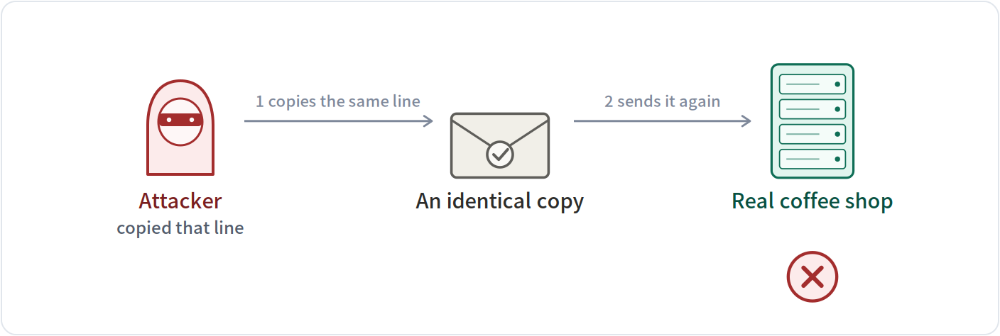<p><b>The plan</b> <b>The attacker</b> intercepts the line your assistant sent to the shop and sends it again unchanged, hoping to place another order on your tab.</p><p><b>What stops it</b> the one-time random string plus the timestamp</p><p><b>How</b> <b>The shop</b> remembers the random strings it has seen in the last few minutes. It has seen this one, so it drops the request. And by the time that record is cleared, the timestamp is long expired.</p>
</details>
<details>
<summary><b>2. Relay your proof to somebody else</b></summary>
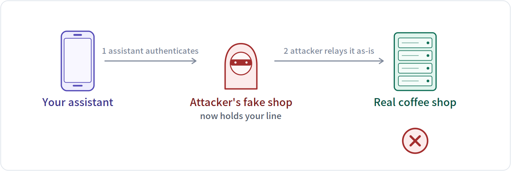<p><b>The plan</b> <b>Your assistant</b> is lured to a fake coffee shop run by <b>the attacker</b> and authenticates there as usual — so that line lands in his hands. He has no private key of yours and can sign nothing himself, so all he can do is relay the line unchanged to <b>the real shop</b> and order in your name.</p><p><b>What stops it</b> the “which domain is this proof for” item</p><p><b>How</b> That item <b>is not in the line at all</b>. Your assistant signs using the domain it is actually dialling (the attacker's); the real shop verifies using its own domain. The two sides compute different bytes and the signature does not match. The attacker <b>cannot see it, cannot change it and cannot supply it</b>.</p>
</details>
<details>
<summary><b>3. Swap the public key on your domain</b></summary>
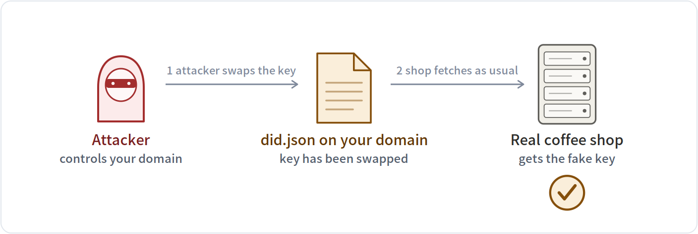<p><b>The plan</b> <b>The attacker</b> gains control of your domain, replaces the public key inside did.json with his own, and then impersonates you using his own private key.</p><p><b>What stops it</b> — neither of the first two defences stops this one</p><p><b>How</b> <b>Not stopped.</b> The shop simply fetches the file from the URL and believes whatever it gets — <b>this is the biggest soft spot of identity schemes of this kind.</b> The e1 layer covered in §10 is what addresses this.</p>
</details>


---

## §10 · Binding the key to the identity: e1


Everything so far rests on one assumption: **only you can change the file under that domain**. But domains change hands — a registration lapses, a company is sold, a server is migrated — and that file ends up with whoever holds the domain next.

The SDK adds a layer called `e1` by default: it binds the public key to the identity string, so the identity cannot be mistaken for someone else's when that happens. It does one thing at each of **two moments**. Here is the first.

### 1 &middot; At issue time: the identity is computed from the public key, once and only once

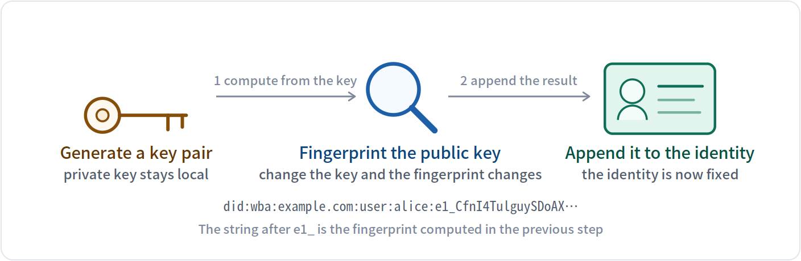


So this identity **is not an arbitrary name** — it is a product of the public key. Swap the key and the fingerprint changes, which means the whole identity string is no longer the same string.

Now the crucial part: **you handed that string out**. It rides along in every request you send, and the other side wrote it down. When the domain later changes hands, the new holder can change the file on the domain, but **cannot change the string that already went out and is sitting in other people's records**.

### 2 &middot; At every verification: one extra comparison, between gate 4 and gate 5 of §08


<details>
<summary><b>With e1 &middot; domain changed hands</b> → caught on the spot</summary>
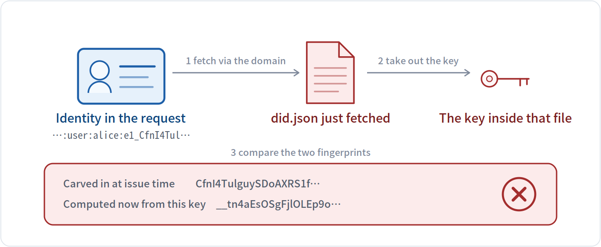<p>The two fingerprints do not match, so <b>this gate does not pass and gate 5 never runs</b>. The file on the domain can be changed, but the identity string you handed out long ago — already recorded by others — cannot; and the tail of that string carries the fingerprint of the original key.</p>
</details>

<details>
<summary><b>Without e1 &middot; domain changed hands</b> → indistinguishable</summary>
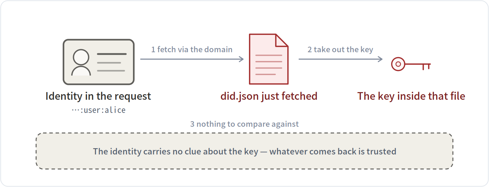<p>Verification <b>passes as usual</b>. The verifier cannot tell the key was replaced — the identity string holds nothing to compare against. This is what the third attacker in §09 relies on.</p>
</details>

<details>
<summary><b>With e1 &middot; domain still yours</b> → normal pass</summary>
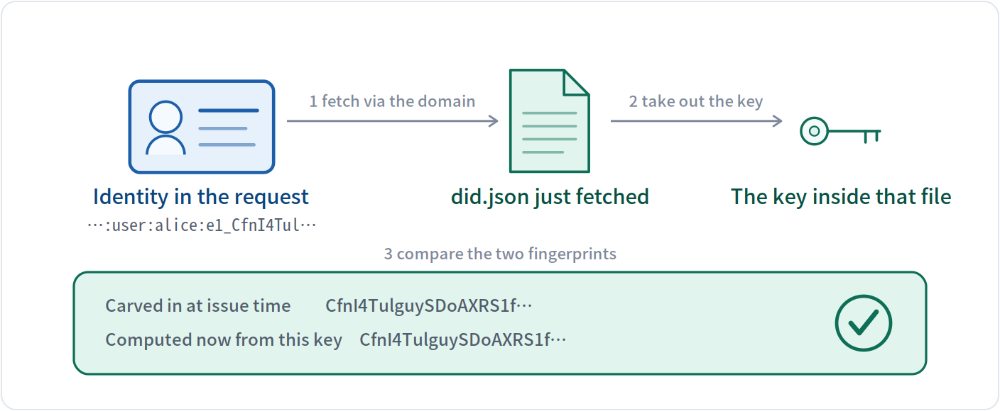<p>The two fingerprints match, so this gate passes and gate 5's signature check follows.</p>
</details>

Put the two moments together: **the fingerprint is carved in at issue time; the comparison happens on every request**. The file on the domain can change; the identity string cannot — so comparing the two tells you whether they still belong together.

Which raises a fair question: **can the domain's new holder still change that file?** Yes. **e1 does not prevent the file from being changed, but once it is, the verifying side can always tell.**

### 3 &middot; When a domain changes hands: what follows the domain and what does not


| Follows the domain | |
|---|---|
| The public key inside did.json | the new holder can replace it |
| Whether the file exists at all | it can also be removed entirely |
| Which document is served there | it can be swapped for another identity's |

| Does not follow the domain | |
|---|---|
| The identity string you already handed out | it lives in other people's records, not on the domain |
| The link between fingerprint and key | a different key means a different fingerprint |
| Your private key | it has never left your device |

So the verifier sees a different result:
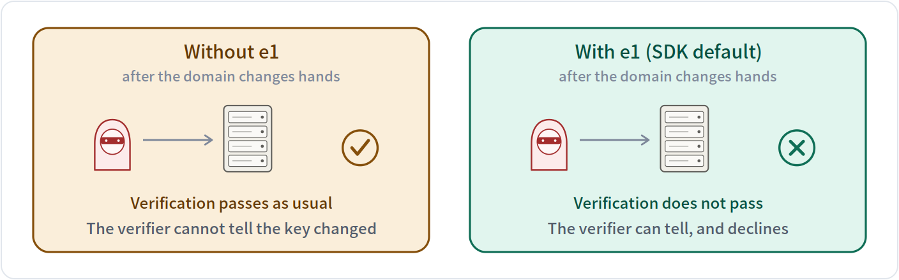


> [!NOTE]
> **What e1 guarantees** There are only two possible verification results: **“confirmed as you”** or **“cannot confirm”**. There is never **“confirmed as someone else”**.

The cost is that this identity's availability is tied to the domain: lose the domain and you have to issue a fresh identity under a new one.

This check runs automatically, and a little earlier than the diagram suggests: the moment the file comes back, two things are checked on the spot — whether the identity written in the document matches the one you asked for, and whether the fingerprint binding holds. Either failure means **rejected outright, never reaching the signature check**.


---

## §11 · Identity confirmed — now: what can you do?


Knowing who the other side is is not enough; you also need to know what it can do and how to call it. ANP has every program publish a self-introduction file, usually at `/ad.json` — think of it as the menu board outside a restaurant.


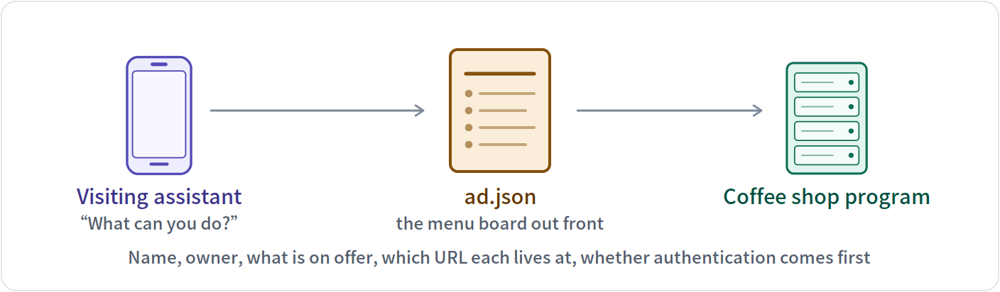


That menu typically lists: its name, who owns it, what it can do, which URL each capability lives at, and whether authentication is required first. Another program reads it once and knows how to deal with it.


---

## §12 · How do you know which programs are out there


The spec defines a directory: knowing only a domain, you visit one fixed path under it and get back every publicly listed program on that domain.


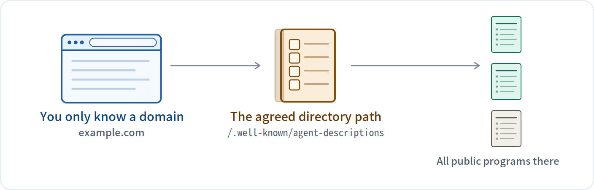


By this design, finding a program is the same as finding a website: the domain is enough. No prior registration on some platform, no introduction from a middleman.


---

## §13 · When the two sides do not share a format: negotiate first


The traditional answer is manual integration: you send me an interface doc, I write code against it, and we go back and forth for weeks. ANP's idea is to **let the two programs work it out in plain language, then each generate its own handling code**.

The negotiation runs in four steps, one card each.

<details>
<summary><b>1. A opens in plain language</b> <i>the initiator</i></summary>
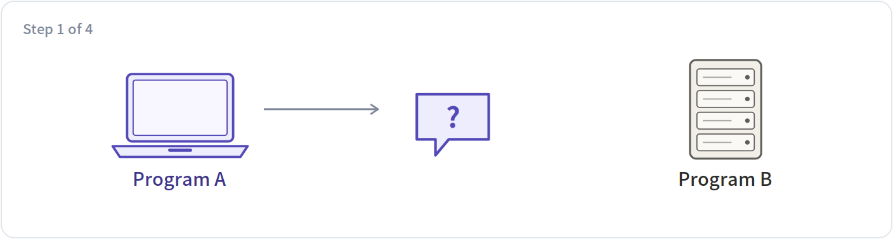<p>“I want hotel prices. I can take JSON, and I'd like fields for room type, date and price. What do you support?” — note that this round is <b>natural language</b>, because at this moment there is no shared format to use yet.</p>
</details>
<details>
<summary><b>2. B answers in plain language</b> <i>the responder</i></summary>
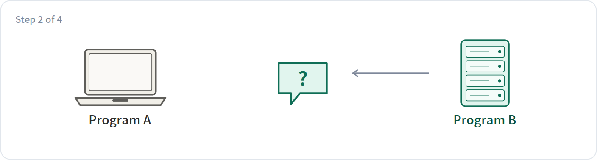<p>“Fine. My dates are ISO format, prices come in two columns for with and without tax, and you also need to include the branch code.” The two may go back and forth several rounds until the format is settled.</p>
</details>
<details>
<summary><b>3. Each side generates its own code</b> <i>done separately</i></summary>
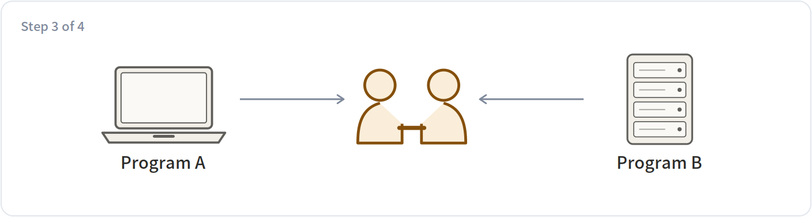<p>Once settled, each side has a language model generate handling code from the agreement. <b>This step needs no participation from the other side</b>, and no human writing interface documents.</p>
</details>
<details>
<summary><b>4. Test each other, then get to work</b> <i>both sides</i></summary>
<p>Optionally they exchange a few test messages to confirm they understood the same thing. After that they communicate efficiently in the agreed format and drop the natural language.</p>
</details>

This layer is still at a very early stage and plenty of details are unsettled. It is here so you know that in ANP's design, even "what format shall we speak in" is something that can be negotiated on the spot.


---

## §14 · Last piece: can the relay server see the content


Everything so far has been about "who are you." One question remains: messages pass through a relay server — **can that server read them**. Expand the two panels below to see what the server sees in each case.

<details>
<summary><b>End-to-end encryption on</b> → the server sees only ciphertext</summary>
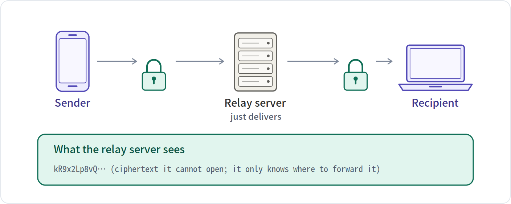
</details>

<details>
<summary><b>End-to-end encryption off</b> → the server sees the text</summary>
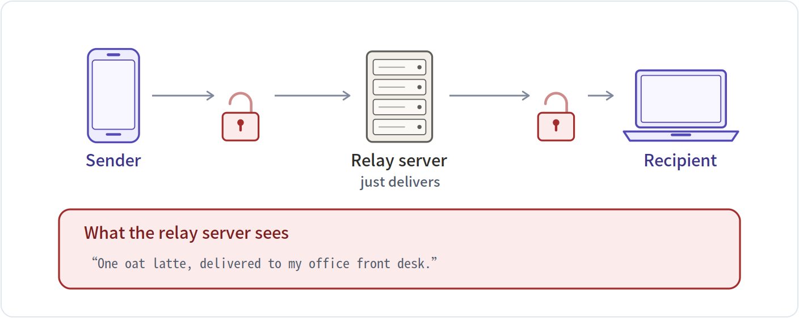
</details>


---

## §15 · Step back: the whole thing in four blocks


The fourteen sections above were really moving between four different layers. Expand each one to see what it covers and what it deliberately leaves alone.

<details>
<summary><b>Identity and encrypted transport</b> answers “who are you” and “can the content be read”</summary>
<table><tr><td><b>Covers</b></td><td>identity format, key files, signing and verification, end-to-end encryption</td></tr><tr><td><b>Leaves alone</b></td><td>does not tell you what a program can do</td></tr></table>
</details>
<details>
<summary><b>Meta-protocol layer</b> answers “our formats do not match”</summary>
<table><tr><td><b>Covers</b></td><td>negotiating a format in natural language, then each side generating code</td></tr><tr><td><b>Leaves alone</b></td><td>does not carry the actual data</td></tr></table>
</details>
<details>
<summary><b>Application layer · introduction</b> answers “what can you do”</summary>
<table><tr><td><b>Covers</b></td><td>ad.json, the capability list, the call addresses</td></tr><tr><td><b>Leaves alone</b></td><td>does not verify identity; that is layer one's job</td></tr></table>
</details>
<details>
<summary><b>Application layer · discovery</b> answers “which programs are out there”</summary>
<table><tr><td><b>Covers</b></td><td>listing every public program under one domain</td></tr><tr><td><b>Leaves alone</b></td><td>does not search across domains</td></tr></table>
</details>