# 两个素不相识的程序，第一次见面，怎么确认对方不是冒充的？

这份讲解从这一个问题出发，一路拆到 ANP 的每一块零件。**不需要任何密码学或网络协议基础**。

> [!TIP]
> 这是**静态版**，47 个折叠块可以点开收起。
> 想要滑块、开关、实时计算的**完整交互版** → **[点这里打开](https://htmlpreview.github.io/?https://gist.githubusercontent.com/SeaOceanO/80bba223eefa8ba73964419729c21468/raw/ANP-guide-interactive.html)**

## 目录

**打基础**

- [§00 · 术语速查](#00--先摊开词表)
- [§01 · 要解决的问题](#01--问题长什么样)
- [§02 · 老办法为什么不够](#02--老办法每家给你发一把钥匙)

**身份是怎么来的**

- [§03 · 身份就是一个网址](#03--新思路身份本身就是一个可以打开的地址)
- [§04 · 从身份变成网址](#04--对方怎么知道去哪里查你)
- [§05 · 身份证里有什么](#05--打开那个网址里面是什么)

**怎么证明是本人**

- [§06 · 签名的五道工序](#06--证明我就是我五道工序)
- [§07 · 那一行请求头](#07--成品一行看着吓人的文字)
- [§08 · 服务器的五道关卡](#08--服务器收到之后连过五道关)
- [§09 · 三个坏人](#09--三个坏人分别怎么失手)
- [§10 · e1：钥匙绑进身份](#10--把钥匙和身份绑在一起e1)

**认识之后干什么**

- [§11 · 自我介绍 ad.json](#11--确认了身份接下来问你会干什么)
- [§12 · 怎么找到别人](#12--你怎么知道有哪些程序可以找)
- [§13 · 语言不通怎么办](#13--两边格式对不上时先商量一轮)
- [§14 · 内容怎么保密](#14--最后一块中间的服务器能不能看见内容)

**全局**

- [§15 · 四层全景](#15--退一步整套东西分成四块)

---

## §00 · 先摊开词表


后面出现的每一个专业词，这里都有一句大白话解释，随时回来查。每条只用前面已经说过的概念，不会拿新词解释旧词。

**身份相关**


<details>
<summary><b>智能体</b>　<code>agent</code></summary>
<p>一个能自己发请求、也能自己回请求的程序。可以想成一个替你办事的软件。</p>
</details>
<details>
<summary><b>DID</b>　<code>身份标识符</code></summary>
<p>一串代表身份的字符串。作用像身份证号，但它自带一个能打开的查询地址。</p>
</details>
<details>
<summary><b>did:wba</b>　<code>ANP 用的那一种</code></summary>
<p>后半截就是一个域名。<b>域名归谁，这个身份就归谁</b>，不用向任何机构申请。</p>
</details>
<details>
<summary><b>DID 文档</b>　<code>did.json</code></summary>
<p>挂在那个域名下的一个小文件，写着这个身份的公钥。相当于身份证的正面，谁都能看。</p>
</details>
<details>
<summary><b>验证方法</b>　<code>verificationMethod</code></summary>
<p>DID 文档里的一条公钥记录。一份文档可以放好几条，各管各的用途。</p>
</details>
<details>
<summary><b>指纹</b>　<code>fingerprint</code></summary>
<p>把公钥揉成的一小串字符。公钥改一个字，指纹就完全变样。</p>
</details>
<details>
<summary><b>e1</b>　<code>e1 写法</code></summary>
<p>把指纹直接写进身份字符串的结尾。相当于把钥匙编号刻进身份证号里。</p>
</details>

**安全相关**


<details>
<summary><b>公钥 / 私钥</b>　<code>key pair</code></summary>
<p>成对的两串数。私钥自己藏好，公钥随便公开。私钥做的事，只有配套的公钥能验。</p>
</details>
<details>
<summary><b>签名</b>　<code>signature</code></summary>
<p>用私钥对一段内容算出的一小串字符。别人用公钥一验就知道两件事：<b>是这把私钥签的</b>，而且<b>内容一个字都没被改过</b>。</p>
</details>
<details>
<summary><b>哈希 / SHA-256</b>　<code>hash</code></summary>
<p>把任意长的内容压成固定长度的一串字符。内容变一点点，结果就面目全非。</p>
</details>
<details>
<summary><b>JCS</b>　<code>规范化</code></summary>
<p>把 JSON 排成唯一写法的规矩：键按字母排、不留多余空格。签的人和验的人这样才会算出<b>同一串字节</b>。</p>
</details>
<details>
<summary><b>nonce</b>　<code>一次性随机串</code></summary>
<p>用过就作废。防止别人把你发过的请求原样再发一遍。</p>
</details>
<details>
<summary><b>时间戳</b>　<code>timestamp</code></summary>
<p>请求发出的时刻。服务端只收最近几分钟内的。</p>
</details>
<details>
<summary><b>端到端加密</b>　<code>E2EE</code></summary>
<p>只有收发双方能看懂内容，中间负责转发的服务器也看不懂。</p>
</details>

**通信相关**


<details>
<summary><b>HTTP 请求头</b>　<code>header</code></summary>
<p>一次网络请求最前面那几行说明文字，正文之前的附言。</p>
</details>
<details>
<summary><b>Authorization 头</b></summary>
<p>专门放身份信息的那一行附言。ANP 把身份、随机串、时间、签名全塞进这一行。</p>
</details>
<details>
<summary><b>access token</b>　<code>临时通行证</code></summary>
<p>验过一次身份之后服务端发的凭据。之后带着它就行，不用每次重新验。</p>
</details>
<details>
<summary><b>ad.json</b>　<code>智能体描述</code></summary>
<p>一个程序的自我介绍文件：我是谁、我会做什么、接口在哪。像餐厅门口的菜单牌。</p>
</details>
<details>
<summary><b>元协议</b>　<code>meta-protocol</code></summary>
<p>两个程序正式说事之前，先用大白话商量「接下来我们用什么格式说话」的那一轮。</p>
</details>


---

## §01 · 问题长什么样


假设你手机里有个助理程序，你说一句「帮我订杯咖啡」。它得去找咖啡店那边的程序谈。**这两个程序此前从没打过交道**，也没有共同的账号系统。

两边各自在担心什么，展开下面两块看。

<details>
<summary><b>助理程序担心什么</b></summary>
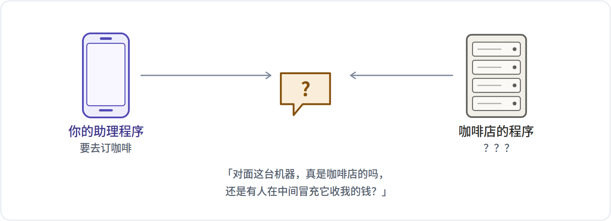<p>这个问题<b>浏览器早就解决了</b>：网址栏那把小锁（HTTPS）就是干这个的。证书由公认的机构签发，冒充不了。ANP 直接沿用，不重新发明。</p>
</details>

<details>
<summary><b>咖啡店程序担心什么</b></summary>
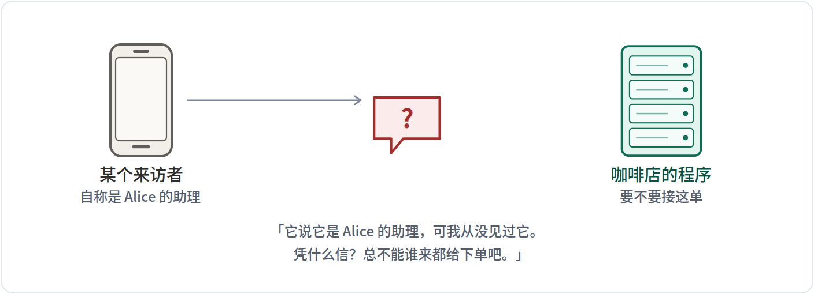<p><b>这个才是 ANP 要解决的。</b>难点在于两边此前毫无关系——没有共同的账号系统，没有事先交换过任何密码。</p>
</details>

第一个担心，浏览器早就解决了——网址前面那把小锁（HTTPS）就是干这个的。**ANP 要解决的是第二个**：服务器怎么确认发请求的这一方是真的。


---

## §02 · 老办法：每家给你发一把钥匙


今天的做法是：你想用哪家的服务，就去哪家注册一个账号，拿一串密码（业内叫 API key）。对接的服务变多会怎样，看下面两张图。

对接 3 家：
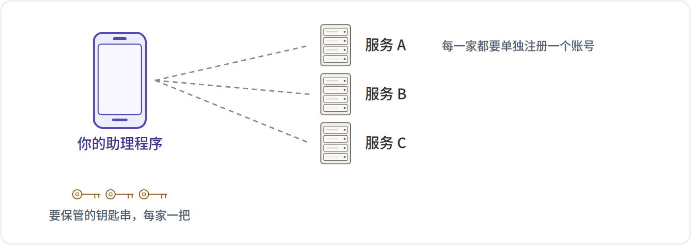

对接 6 家：
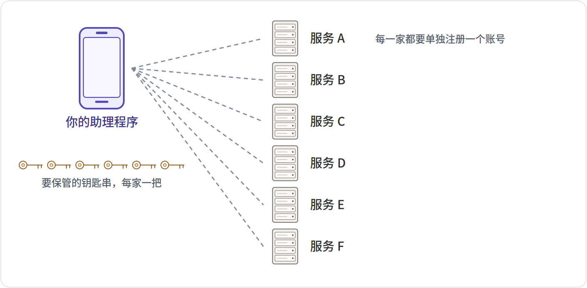


| | 对接 3 家 | 对接 6 家 |
|---|---|---|
| 要保管的密码串 | 3 | 6 |
| 事先要走的注册流程 | 3 | 6 |
| 对方也知道你密码的家数 | 3 | 6 |

三个毛病：**数量随对接方线性增长**；**必须先注册才能说第一句话**；最要命的是**密码两边都知道**——出了事说不清是谁泄的。

> [!NOTE]
> **一句话**　共享秘密的本质是「我们俩都知道同一件事」。ANP 换了个思路：**我知道一件只有我知道的事，但你能验证我知道它。**


---

## §03 · 新思路：身份本身就是一个可以打开的地址


ANP 的身份长这样。它看着像乱码，其实分成几段，每段都有含义。下面这张表把五段逐个拆开。


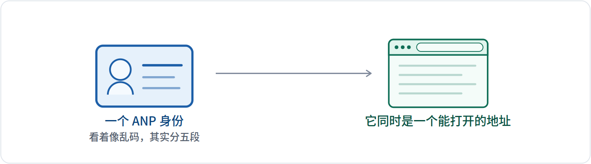


```
did:wba:example.com%3A8800:user:alice:e1_CfnI4TulguySDoAXRS1fm8zhAIDTxP9IByHouGTGfUY
```

| 这一段 | 是什么 | 说明 |
|---|---|---|
| `did` | 固定开头 | 所有这类身份都以 did 开头，表示「这是一个去中心化身份标识符」。就像所有手机号前面的国家码。 |
| `:wba` | 用哪一套规矩 | wba 是 ANP 选的那一套。它规定了后面几段怎么读、去哪里查。换成别的方法名，读法就完全不同。 |
| `:example.com%3A8800` | 域名（和端口） | 这段决定了身份归谁：谁控制这个域名，谁就控制这个身份。%3A 是冒号的转义写法，因为冒号在这里已经被拿来当分隔符了，端口号只能这么写。 |
| `:user:alice` | 路径 | 同一个域名下可以放很多身份，用路径区分。user / alice 之后会变成网址里的两级目录。 |
| `:e1_CfnI4TulguySDoAXRS1fm8zhAIDTxP9IByHouGTGfUY` | 公钥指纹 | 最后这段是一道加固：e1_ 后面跟着这个身份公钥的指纹。这样身份字符串本身就把公钥锁死了，别人换不掉。详见 §10。 |

关键在于最后没有任何中心机构参与：**只要你有一个域名，你就能自己发身份**，不用向谁申请。


---

## §04 · 对方怎么知道去哪里查你


服务器收到这串身份后，要先把它变成一个能打开的网址，去取公钥。规矩一共四条，下面逐条走给你看。最下面是算出来的结果。


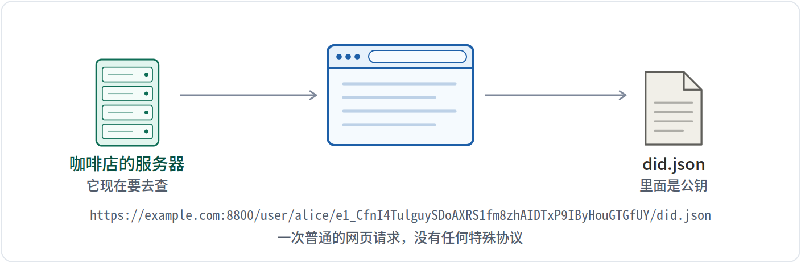


| 第几条规矩 | 做什么 | 为什么 |
|---|---|---|
| 1 | 按冒号拆开 | 第 3 段是域名，之后每一段是路径的一级 |
| 2 | 把 %3A 换回冒号 | 端口的冒号在身份里被转义过，这里还原，否则会和分隔符混淆 |
| 3 | 前面加 https:// | 这类身份只走 HTTPS——那把小锁是整套方案的信任来源 |
| 4 | 路径拼上去，末尾补 did.json | 没有路径时改走 /.well-known/did.json |

最终结果：

```
https://example.com:8800/user/alice/e1_CfnI4TulguySDoAXRS1fm8zhAIDTxP9IByHouGTGfUY/did.json
```

这四条规矩是固定的，任何实现都照它算——所以你在别处看到的解析结果，会和这里一模一样。


---

## §05 · 打开那个网址，里面是什么


取回来的就是下面这份文件。这是用 SDK 真实生成的一份，删掉了几个次要字段。下面这张表逐个字段解释。

```jsonc
{
  "id": "did:wba:example.com%3A8800:user:…GTGfUY",
  "verificationMethod": [
    { "id": "…#key-1", "type": "Multikey",
      "publicKeyMultibase": "z6Mkt7CwZUzDo3dF4VKvmmXbmbZdvyvUirDfZ1jQVKemkXv7" },
    { "id": "…#key-2", "type": "EcdsaSecp256r1VerificationKey2019", … },
    { "id": "…#key-3", "type": "X25519KeyAgreementKey2019", … }
  ],
  "authentication": [ "…#key-1" ],
  "keyAgreement":   [ "…#key-3" ],
  "service": [
    { "type": "AgentDescription",
      "serviceEndpoint": "https://example.com/agents/alice/ad.json" }
  ],
  "proof": {
    "type": "DataIntegrityProof", "cryptosuite": "eddsa-jcs-2022",
    "proofValue": "KbDvKOJ4oqVxHhlNkcxMimQumPfIPgsgG0P9s-aKc0Lm…"
  }
}
```

| 字段 | 是什么 | 说明 |
|---|---|---|
| `id` | 这个身份自己的编号 | 和你请求里写的那串必须一模一样。服务器取回文件后第一件事就是核对这个，不一致就说明拿错了文件。 |
| `verificationMethod` | 公钥清单 | 这份文件的正题。每一条是一把公钥，各有用途。这里有三条，所以这个身份有三把钥匙。 |
| `publicKeyMultibase` | 公钥本体 | 真正的公钥值，一种紧凑的文本编码。验签名时用的就是它。 |
| `authentication` | 哪把钥匙用来证明身份 | 从上面的清单里挑一把，指定它专门用于「证明我是我」。这里指向 #key-1。 |
| `keyAgreement` | 哪把钥匙用来加密 | 另挑一把，专门用于协商加密密钥，也就是给内容上锁用的。这里指向 #key-3。 |
| `service` | 还能在哪儿找到我 | 可选。这里写着自我介绍文件（§11 的 ad.json）挂在哪个网址，别人顺着就能找过去。 |
| `proof` | 这份文件自己的签名 | 整份文件被它自己的私钥签了一遍。任何人改动其中一个字符，这个签名都会失效。 |

注意这里面**只有公钥，没有私钥**。这份文件是公开的，谁都能下载，但下载了也冒充不了你——因为签名要用私钥，而私钥从没离开过你的设备。


---

## §06 · 证明「我就是我」：五道工序


有了公钥挂在网上，接下来就是当场证明「我手里有配套的私钥」。这件事分五步，像流水线一样。

五步各占一张折叠卡片，**点标题展开**，每张里都是真实的输出。

<details>
<summary><b>1. 挑出四样东西</b>　随机串、时刻、对方域名、我是谁</summary>
<p><b>为什么</b>　要签的不是整个请求，只是这四样。多一样少一样，两边算出的结果就对不上。</p><pre><code>随机串   7f3a91c25d0e46b8a1c47e29f0b3d85c
时刻     2026-07-27T04:00:00Z
给谁的   example.com          ← 对方的域名
我是谁   did:wba:example.com%3A8800:user:alice:e1…</code></pre><p><b>留意</b>　「给谁的」这一栏很关键：它把这次证明<b>钉死在这一个服务器上</b>，换个服务器就不认了。</p>
</details>
<details>
<summary><b>2. 排成唯一写法</b>　按死规矩排整齐，两边才算得出同一串字节</summary>
<p><b>为什么</b>　同一份内容有无数种写法（顺序不同、空格不同）。先按一套死规矩排整齐，签的人和验的人才会算出同一串字节。</p><pre><code>{"aud":"example.com","did":"did:wba:example.com%3A8800:user:alice:e1_CfnI4TulguySDoAXRS1fm8zhAIDTxP9IByHouGTGfUY","nonce":"7f3a91c25d0e46b8a1c47e29f0b3d85c","timestamp":"2026-07-27T04:00:00Z"}</code></pre><p><b>留意</b>　注意四样东西被按字母重排了：<code>aud → did → nonce → timestamp</code>。只要两边都照这套死规矩排，用什么语言写的程序都能互相验签。</p>
</details>
<details>
<summary><b>3. 压成固定长度</b>　任意长的内容压成固定的一小串</summary>
<p><b>为什么</b>　上一步那行长度不定。先压成固定的一小串，后面签名算法处理起来又快又稳。</p><pre><code>2d403a0c8b772eeb176787b96f7f885488899ca4d1d33421437bd48abe8398af</code></pre><p><b>留意</b>　内容改一个字符，这 64 位就会面目全非——这正是签名能证明「内容没被改过」的来源。</p>
</details>
<details>
<summary><b>4. 用私钥签一下</b>　全程唯一用到私钥的一步</summary>
<p><b>为什么</b>　这是全过程唯一用到私钥的地方。签完的结果谁都能看，但谁也造不出来。</p><pre><code>-b_gSKP85w3YOIr4cL9twlNTZF1XQbSJCdMBA4l8jyW45N-OEYzjZTRVcBPFBYUIeRX5f-EBOnqFfgQMXq-jDA</code></pre><p><b>留意</b>　私钥<b>从头到尾没有发出去过</b>。这也是它和「共享密码」最根本的区别。</p>
</details>
<details>
<summary><b>5. 塞进请求头</b>　成品就是请求最前面的那一行</summary>
<p><b>为什么</b>　把身份、随机串、时刻、用了哪把钥匙、签名，一起写进请求最前面的一行。</p><pre><code>Authorization: DIDWba v="1.1", did="did:wba:example.com%3A8800:user:alice:e1_CfnI4TulguySDoAXRS1fm8zhAIDTxP9IByHouGTGfUY", nonce="7f3a91c25d0e46b8a1c47e29f0b3d85c", timestamp="2026-07-27T04:00:00Z", verification_method="key-1", signature="-b_gSKP85w3YOIr4cL9twlNTZF1XQbSJCdMBA4l8jyW45N-OEYzjZTRVcBPFBYUIeRX5f-EBOnqFfgQMXq-jDA"</code></pre><p><b>留意</b>　这样一来，服务器<b>在收到的第一个请求里</b>就能完成验证，不用先来一轮「你给我个挑战值我再签」。</p>
</details>


---

## §07 · 成品：一行看着吓人的文字


五道工序的产物，就是塞进请求最前面的这一行。下面这张表把每一段拆开：谁写的、是什么、挡住了什么、去掉会怎样。

```http
Authorization: DIDWba v="1.1",
  did="did:wba:example.com%3A8800:user:alice:e1_CfnI4TulguySDoAXRS1fm8zhAIDTxP9IByHouGTGfUY",
  nonce="7f3a91c25d0e46b8a1c47e29f0b3d85c",
  timestamp="2026-07-27T04:00:00Z",
  verification_method="key-1",
  signature="-b_gSKP85w3YOIr4cL9twlNTZF1XQbSJCdMBA4l8jyW45N-OEYzjZTRVcBPFBYUIeRX5f-EBOnqFfgQMXq-jDA"
```

| 这一段 | 谁写的 | 是什么 | 挡住什么 | 去掉会怎样 |
|---|---|---|---|---|
| `DIDWba` | 助理程序写的 | 方案名。告诉服务器：下面这些按 ANP 的规矩读。 | 挡住把它和别的认证方式搞混。服务器解析时第一件事就是核这六个字符。 | 服务器不知道该用哪套规则读后面的东西，直接报错。 |
| `v="1.1"` | 助理程序写的 | 协议版本。它决定上一节第一步里「给谁的」那一栏叫什么名字。 | 理论上挡住新旧两版签的内容对不上。 | 两边对版本的理解一旦不一致，签的内容和验的内容就对不上，验证必然失败。 |
| `did=…` | 助理程序写的 | 我是谁。服务器靠它推算出去哪里取公钥（§04）。 | 它本身也在被签的内容里，改了签名就废。 | 服务器根本不知道该去哪个域名取公钥。 |
| `nonce=…` | 助理程序当场摇出来的 | 一次性随机串。服务器记住收过的，同一个再来就是重放。 | 挡住有人抄走整行原样再发一遍。 | 这行就成了一张能无限次使用的通行证，谁抄到谁就能一直冒充。 |
| `timestamp=…` | 助理程序写的 | 发出的时刻。服务器只收最近几分钟的。 | 挡住囤积：把一堆签好的行存起来几个月后再用。它还顺带决定了随机串记录能多久清理一次。 | 随机串就得永久保存，不然清理之后旧请求又能重放。 |
| `verification_method=…` | 助理程序写的 | 用了三把钥匙里的哪一把。 | 挡住服务器拿错公钥——这个身份有三把钥匙，用途各不相同。 | 服务器只能挨个试，或者写死「永远用第一把」，那就没法换钥匙了。 |
| `signature=…` | 助理程序用私钥算的 | 前面四样东西的签名。 | 挡住伪造和篡改：没有私钥造不出来，改动任何一个被签的字段都会让它失效。 | 前面所有字段都成了任人填写的明文，整套认证等于没有。 |


---

## §08 · 服务器收到之后，连过五道关


服务器不会一上来就验签名——验签要联网去取公钥，很贵。所以先做几道便宜的检查。下面五张折叠卡片各是一种「做手脚」的方式，**点标题展开**，看是哪一道关把它拦下来。

五关全过：
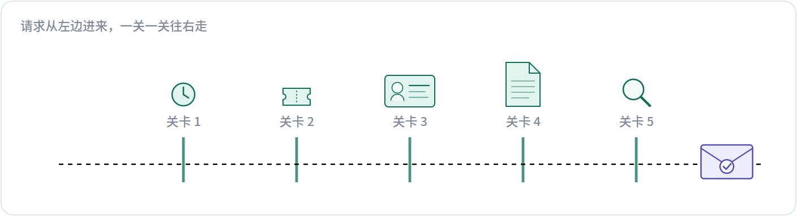


| 第几关 | 查什么 | 怎么查 |
|---|---|---|
| 1 | 时刻还新鲜吗 | 看请求头里的时刻，只收最近几分钟内的，太旧就丢。 |
| 2 | 这个随机串用过吗 | 查一下最近收过的随机串。见过就是重放。 |
| 3 | 这个身份有权限吗 | 是本店的客人吗、能访问这个资源吗。认得出你不等于该让你进。 |
| 4 | 去取公钥 | 照 §04 的规矩把身份变成网址，把 did.json 取回来。这一步要联网，最慢。 |
| 5 | 验签名 | 照 §06 的四步重算一遍，拿公钥核对签名。这一步最贵，所以放最后。 |


**给这次请求做手脚，看是哪一关拦下它：**


<details>
<summary><b>把时刻改成一小时前</b> → 第 1 关拦下</summary>
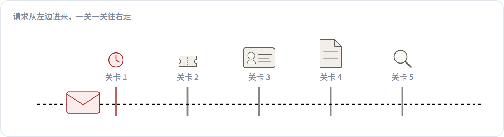<p>第 1 关把它拦下了：<b>时刻还新鲜吗</b>。后面几关根本没跑——尤其是最贵的取公钥和验签，一次网络请求都省下了。</p>
</details>
<details>
<summary><b>用一个刚才用过的随机串</b> → 第 2 关拦下</summary>
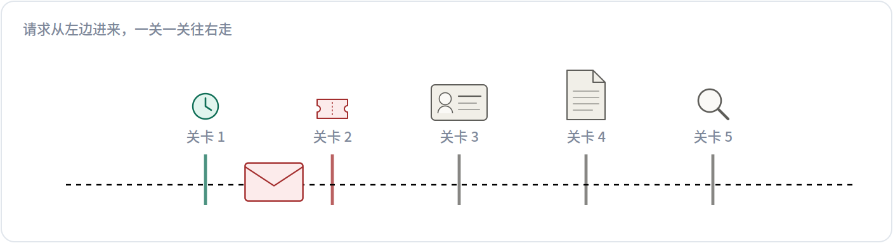<p>第 2 关把它拦下了：<b>这个随机串用过吗</b>。后面几关根本没跑——尤其是最贵的取公钥和验签，一次网络请求都省下了。</p>
</details>
<details>
<summary><b>换一个没被授权的身份</b> → 第 3 关拦下</summary>
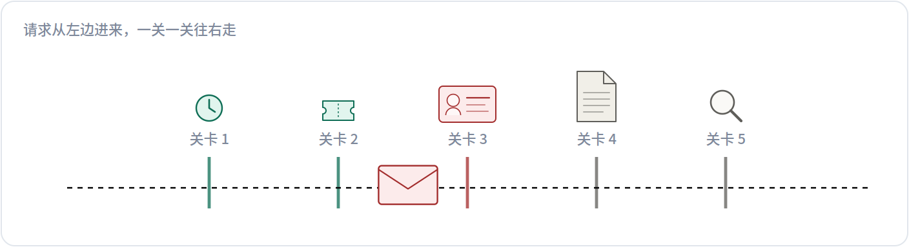<p>第 3 关把它拦下了：<b>这个身份有权限吗</b>。后面几关根本没跑——尤其是最贵的取公钥和验签，一次网络请求都省下了。</p>
</details>
<details>
<summary><b>把 did.json 从域名上删掉</b> → 第 4 关拦下</summary>
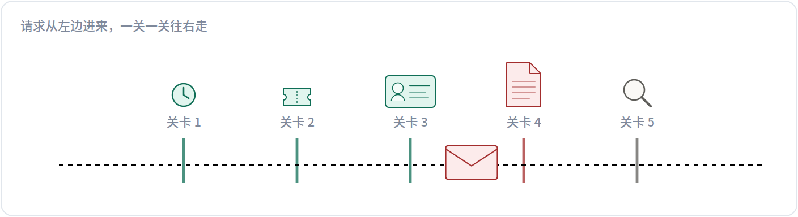<p>第 4 关把它拦下了：<b>去取公钥</b>。后面几关根本没跑——尤其是最贵的取公钥和验签，一次网络请求都省下了。</p>
</details>
<details>
<summary><b>偷偷改掉签名里的一个字符</b> → 第 5 关拦下</summary>
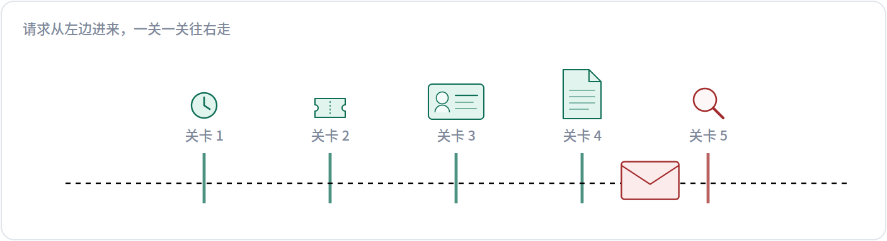<p>第 5 关把它拦下了：<b>验签名</b>。后面几关根本没跑——尤其是最贵的取公钥和验签，一次网络请求都省下了。</p>
</details>

顺序是有讲究的：前面几道都是本地就能做完的廉价检查，能挡掉绝大多数垃圾请求；**最贵的验签放在最后**。


---

## §09 · 三个坏人分别怎么失手


把上面那些字段的作用反过来看最容易懂：**如果没有它，坏人能干什么。**三个坏人各占一张折叠卡片。

<details>
<summary><b>1. 抄走整行再发一遍</b></summary>
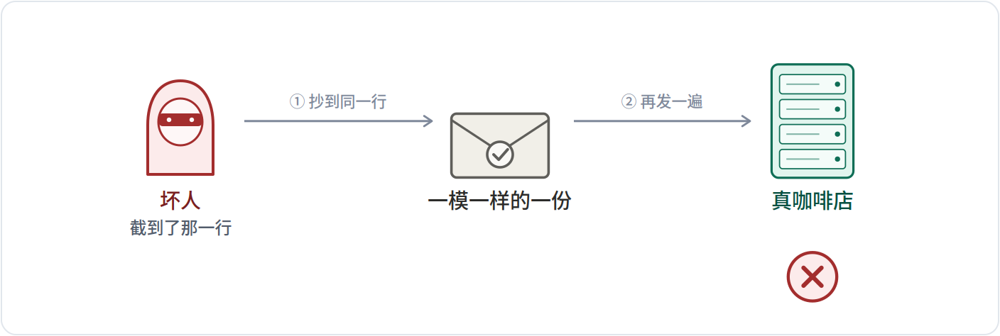<p><b>他想干嘛</b>　<b>坏人</b>截到你的助理发给咖啡店的那一行，原样再发一次，想替你多下一单。</p><p><b>谁挡住的</b>　一次性随机串 ＋ 时刻</p><p><b>怎么挡的</b>　<b>咖啡店</b>记着最近几分钟收过的随机串。这一份见过了，直接丢。等记录被清理时，时刻也早过期了。</p>
</details>
<details>
<summary><b>2. 把你的证明转给别人用</b></summary>
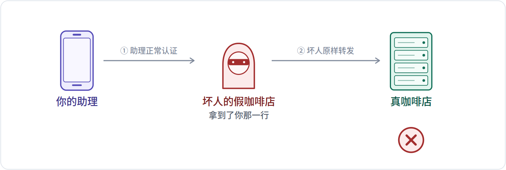<p><b>他想干嘛</b>　<b>你的助理</b>被引到坏人开的假咖啡店，照常做了一次认证——那一行就落到<b>坏人</b>手里。坏人没有你的私钥，自己签不出东西，只能把这一行原样转发给<b>真咖啡店</b>，冒充你下单。</p><p><b>谁挡住的</b>　「这份证明是给哪个域名的」这一项</p><p><b>怎么挡的</b>　这一项<b>根本不在那行字里</b>。你的助理签名时，按自己正在拨的域名算（坏人的）；真咖啡店验签时，按自己的域名算。两边算出的字节不同，签名就对不上。坏人<b>看不见它、改不了它、也补不上它</b>。</p>
</details>
<details>
<summary><b>3. 把你域名上的公钥换掉</b></summary>
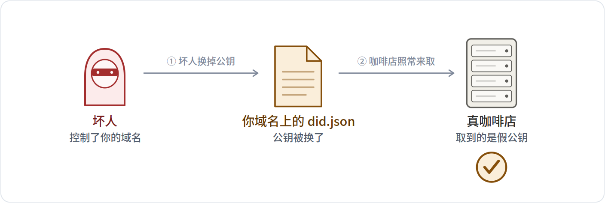<p><b>他想干嘛</b>　<b>坏人</b>拿到了你域名的控制权，把 did.json 里的公钥换成自己的，再用自己的私钥冒充你。</p><p><b>谁挡住的</b>　—— 前面两招都挡不住这一招</p><p><b>怎么挡的</b>　<b>没挡住。</b>咖啡店只会照网址去取文件，取到什么信什么——<b>这是这类身份方案最大的软肋。</b>下一节 §10 讲的 e1，就是用来处理这件事的。</p>
</details>


---

## §10 · 把钥匙和身份绑在一起：e1


前面整套都建立在一个前提上：**那个域名下的文件只有你能改**。但域名是会易主的——到期没续、公司转让、服务器迁移，那份文件就落到了新持有者手里。

SDK 默认加了一层叫 `e1` 的做法：把公钥和身份字符串绑在一起，让身份在这种时候也不会被张冠李戴。它在**两个时刻**各做一件事，先看第一个。

### ① 出厂时：这串身份是从公钥算出来的，一辈子只算这一次

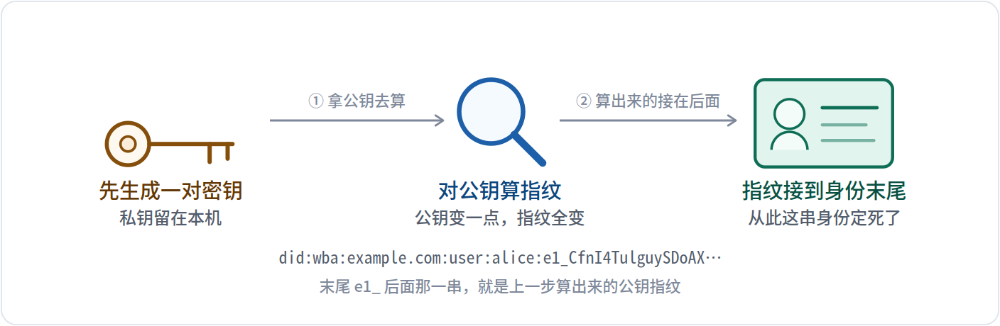


所以这串身份**不是随便起的名字**——它是公钥的产物。公钥换一把，指纹就变，整串身份也就不是原来那串了。

接下来关键的一步：**你把这串身份发出去了**。它写在你每一次请求里，对方记了下来。域名日后易主，新持有者改得了域名上的文件，**改不了早已发出去、存在别人手里的这串字符**。

### ② 每次验证时：在 §08 的第 4 关和第 5 关之间，多插一道比对


<details>
<summary><b>用 e1（SDK 默认）· 域名被坏人占了</b> → 当场识破</summary>
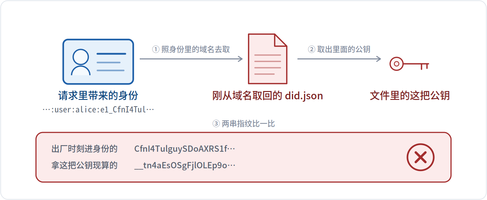<p>两串指纹对不上，<b>当场拒掉，第 5 关都不用跑</b>。坏人改得了域名上那份文件，却改不了你早就发出去、别人已经存下的那串身份——而那串身份的末尾，写着原来公钥的指纹。</p>
</details>

<details>
<summary><b>不用 e1（规范原版）· 域名被坏人占了</b> → 坏人得手</summary>
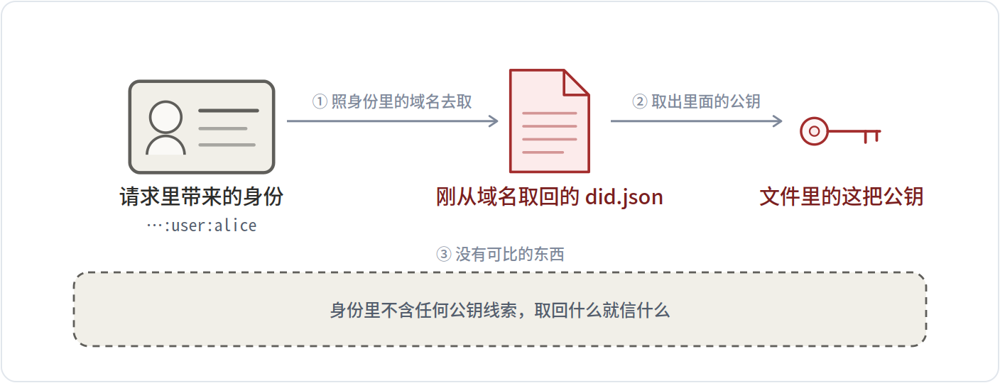<p>验证<b>通过</b>了 —— 但通过的是坏人。服务器看不出公钥被换过，因为身份字符串里没有任何东西可以拿来对照。这正是 §09 第三个坏人得手的原因。</p>
</details>

<details>
<summary><b>用 e1 · 域名一切正常</b> → 正常放行</summary>
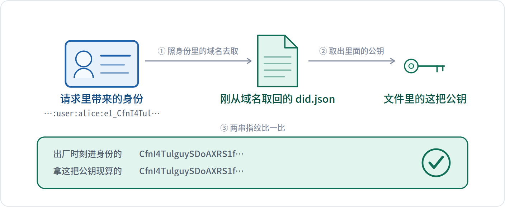<p>两串指纹一致，这一关过，接着去做第 5 关的验签。</p>
</details>

把两个时刻连起来看就清楚了：**指纹是出厂时刻进身份里的，比对是每次请求时做的**。域名上那份文件是可以变的，身份字符串不会变，所以两边一比就知道对不对得上。

那自然会问一句：**域名的新持有者还能不能改那份文件？**能。**e1 不阻止文件被改，但只要改了，验证的一方一定分辨得出来。**

### ③ 域名落到坏人手里之后，他能做什么、做不到什么


| 他能做到的 | 结果 |
|---|---|
| 把 did.json 里的公钥换成自己的 | 改得成，但一验就露 |
| 干脆把 did.json 删掉 | 删得掉，别人就取不到文件 |
| 换一份别人的 DID 文档上去 | 换得上，但文档里的 id 和请求里的身份对不上，直接报错 |

| 他做不到的 | 为什么 |
|---|---|
| 让改过的文件通过检查 | 指纹是旧公钥算的，新公钥算出来的对不上 |
| 改掉别人手里已经存下的那串身份 | 那串字符早就发出去了，不在他的服务器上 |
| 用你的身份签出任何东西 | 私钥从没离开过你的设备 |

于是结果分成两种，差别很大：
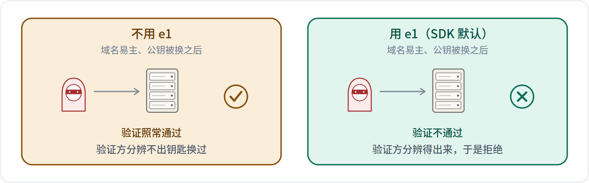


> [!NOTE]
> **e1 给的保证**　验证结果只有两种：**「确认是你」**或者**「确认不了」**，不会出现**「确认成了别人」**。

代价是这个身份的可用性绑在域名上：域名不在了，就得换一个域名重新发一个身份。

这道检查是自动做的，而且比上图画的还早一点：文件一取回来就当场核两样——文档里写的身份对不对得上你请求的那串、指纹绑定成不成立。任一不过**直接拒掉，根本轮不到验签**。


---

## §11 · 确认了身份，接下来问：你会干什么


光知道对方是谁没用，还得知道它能做什么、怎么调。ANP 让每个程序挂一份自我介绍文件，路径通常是 `/ad.json`——可以想成餐厅门口的菜单牌。


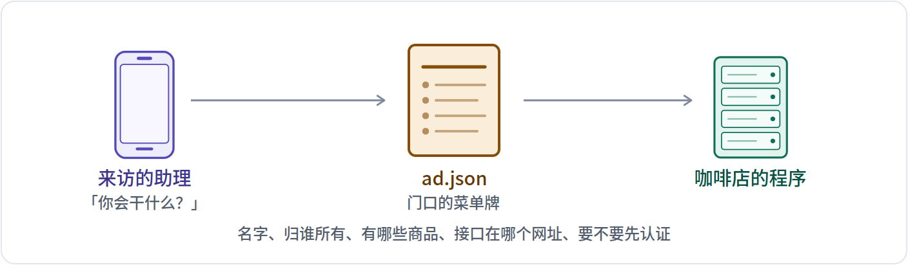


这份菜单里通常写着：它叫什么名字、归谁所有、能做哪些事、每件事对应哪个网址、要不要先认证。别的程序把它读一遍，就知道该怎么跟它打交道了。


---

## §12 · 你怎么知道有哪些程序可以找


规范定义了一个「黄页」：只要知道一个域名，访问它下面的一个固定路径，就能列出这个域名下所有公开的程序。


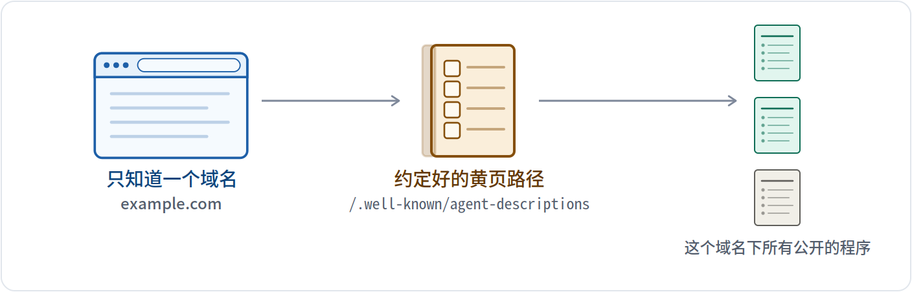


按这个设计，找一个程序就跟找一个网站一样：知道域名就够了，不需要事先在哪个平台上注册过、也不需要谁来牵线。


---

## §13 · 两边格式对不上时：先商量一轮


传统做法是人工对接：你发我一份接口文档，我照着写代码，来回沟通几周。ANP 的设想是**让两个程序自己用大白话商量，然后各自生成处理代码**。

这轮商量分四步，各占一张折叠卡片。

<details>
<summary><b>1. A 用大白话开口</b>　<i>发起方</i></summary>
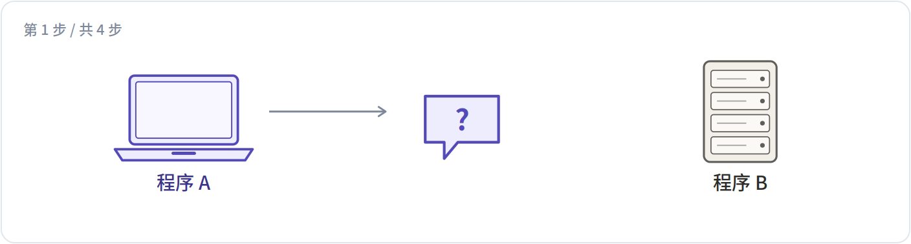<p>「我要查酒店房价，我这边能收 JSON，字段希望有房型、日期、价格。你那边支持什么？」——注意这一轮是<b>自然语言</b>，因为此刻还没有共同格式可用。</p>
</details>
<details>
<summary><b>2. B 用大白话回</b>　<i>接收方</i></summary>
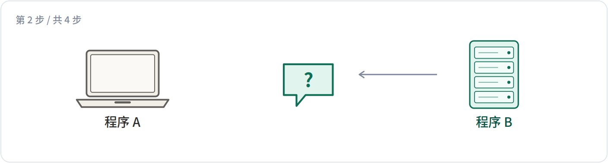<p>「可以。我这边的日期用 ISO 格式，价格分含税不含税两栏，另外要带上门店编号。」双方可能来回好几轮，直到把格式谈定。</p>
</details>
<details>
<summary><b>3. 两边各自生成代码</b>　<i>双方分别做</i></summary>
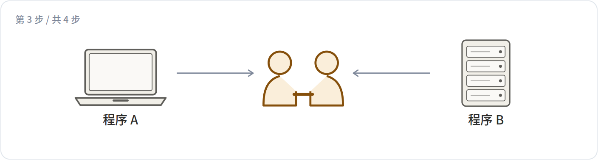<p>谈定之后，各自让大模型按这份约定生成一段处理代码。<b>这一步不需要对方参与</b>，也不需要人类写接口文档。</p>
</details>
<details>
<summary><b>4. 互测，然后正式开聊</b>　<i>双方</i></summary>
<p>可选地互相发几条测试数据，确认两边理解一致。之后就换成谈定的那个格式高效通信，不再走自然语言。</p>
</details>

这一层还处在很早的阶段，真要用还有不少细节没定。放在这里是为了让你知道：ANP 的设想里，连「用什么格式说话」都是可以现场商量的。


---

## §14 · 最后一块：中间的服务器能不能看见内容


前面解决的都是「你是谁」。还剩一个问题：消息要经过中转服务器，**服务器能不能读到内容**。两种情况下服务器眼里的样子，展开下面两块看。

<details>
<summary><b>开着端到端加密</b> → 服务器只看到密文</summary>
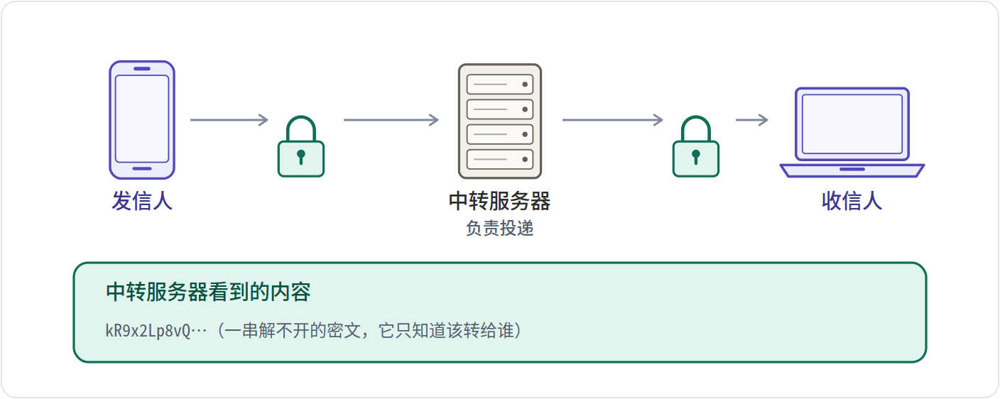
</details>

<details>
<summary><b>关掉端到端加密</b> → 服务器看得到正文</summary>
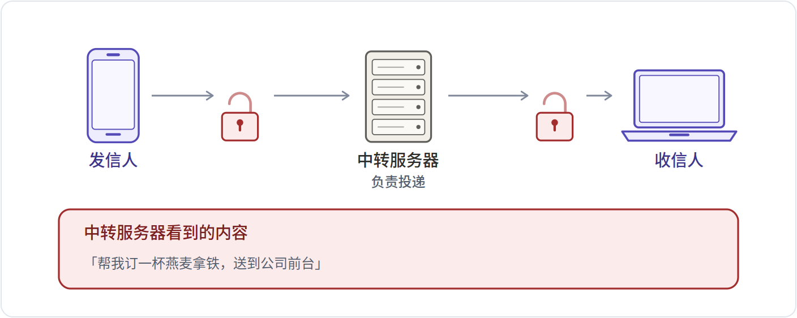
</details>


---

## §15 · 退一步：整套东西分成四块


前面十四节其实是在四个不同的层里打转。每一层展开看它管什么、规范文件在哪、代码在哪、两者差多远。

<details>
<summary><b>身份与加密通信层</b>　解决「你是谁」和「内容能不能被偷看」</summary>
<table><tr><td><b>管</b></td><td>身份格式、公钥文件、签名与验签、端到端加密</td></tr><tr><td><b>不管</b></td><td>不负责告诉你这个程序会干什么</td></tr></table>
</details>
<details>
<summary><b>元协议层</b>　解决「两边格式对不上」</summary>
<table><tr><td><b>管</b></td><td>用自然语言协商格式，然后各自生成代码</td></tr><tr><td><b>不管</b></td><td>不负责传输具体数据</td></tr></table>
</details>
<details>
<summary><b>应用层 · 自我介绍</b>　解决「你会干什么」</summary>
<table><tr><td><b>管</b></td><td>ad.json、接口清单、调用地址</td></tr><tr><td><b>不管</b></td><td>不负责验证身份，那是第一层的事</td></tr></table>
</details>
<details>
<summary><b>应用层 · 找得到</b>　解决「有哪些程序可以找」</summary>
<table><tr><td><b>管</b></td><td>从一个域名列出它下面所有公开的程序</td></tr><tr><td><b>不管</b></td><td>不负责跨域名的全网搜索</td></tr></table>
</details>