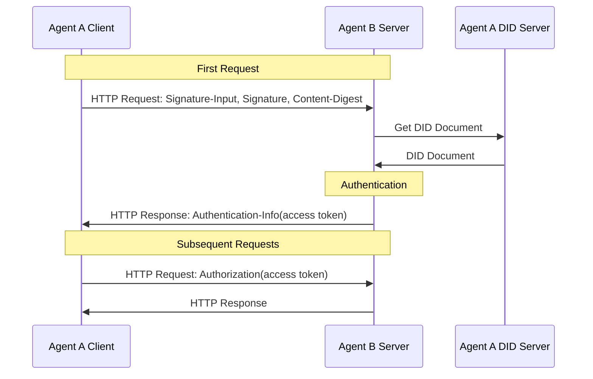
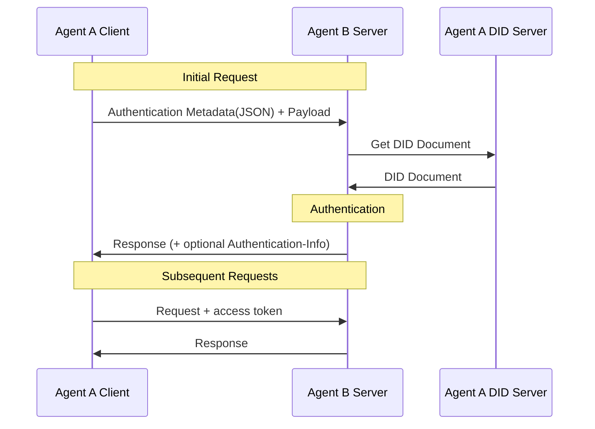

# ANP 基于 DID 的身份认证协议

- 文档编号：ANP-02
- 状态：已发布
- 版本：1.2
- 语言：中文
- 英文镜像：[ANP DID Authentication Protocol](../02-anp-did-authentication-protocol-specification.md)

<a id="scope"></a>
## 1. 范围

本规范定义基于 DID 的跨平台身份认证，包括 HTTP 请求签名、JSON 认证信息承载、服务端验证、挑战与错误处理，以及可选 Access Token。

认证流程独立于具体 DID 方法。`did:wba` 和原生 `did:web` 分别按其方法规则解析、验证 DID Document，再使用本规范的共同请求认证流程。DID 方法规定身份材料的获取和验证方式；请求签名、摘要与认证密钥用途遵循本规范。

本规范可用于普通 HTTP API，不要求实现 ANP 消息协议、WNS 或设备 Manifest。业务权限、人工授权、消息 origin proof 和 E2EE 对象证明由相应应用或 Profile 定义，不能仅凭身份认证成功推定业务权限。

本文中的 MUST、MUST NOT、SHOULD、SHOULD NOT 和 MAY 表示规范性要求，其含义遵循 BCP 14。

<a id="identity-input"></a>
## 2. DID 方法与身份材料

| DID 方法 | 身份材料的验证依据 | 请求认证 |
|---|---|---|
| `did:wba` | ANP-03 的 DID 格式、文档、密钥、解析、更新、停用及连续性规则；见附录 A | 第 3、4 章 |
| `did:web` | 原生 did:web 的解析规则及附录 B 的身份验证要求 | 第 3、4 章 |

文档真实性、身份绑定及生命周期规则由各 DID 方法定义。本规范在方法验证通过后检查认证密钥授权、请求签名和摘要，不自行定义方法特有的证明或状态机制。

算法与密钥表示按所选验证方法及适用方法规则确定。其他 DID 方法的适配方向见附录 D；WebVH 的接入说明见附录 C。仅符合 DID Core 不表示某个实现已经支持该方法。

<a id="common-model"></a>
<a id="http-binding"></a>
## 3. HTTP 请求认证

当客户端向不同平台的服务端发起请求时，客户端可以使用域名结合TLS对服务端进行身份认证，而服务端则根据客户端DID文档中的验证方法验证客户端的身份。

客户端在首次HTTP请求时，使用 [RFC 9421](https://www.rfc-editor.org/rfc/rfc9421) 定义的 `Signature-Input` 和 `Signature` 头进行签名；如果请求携带消息体，则使用 [RFC 9530](https://www.rfc-editor.org/rfc/rfc9530) 定义的 `Content-Digest` 头绑定消息体完整性。首次验证通过后，服务端可以返回 access token，客户端后续请求中携带 access token，服务端不用每次验证客户端的身份，而只要验证 access token 即可。



### 3.1 初始请求

当前客户端首次向服务端发起HTTP请求时，需要按照以下方法进行身份认证。

#### 3.1.1 请求头部格式

客户端必须（MUST）使用 [RFC 9421](https://www.rfc-editor.org/rfc/rfc9421) 定义的 `Signature-Input` 和 `Signature` 头字段发送身份认证信息。当请求包含消息体时，客户端还必须（MUST）发送 [RFC 9530](https://www.rfc-editor.org/rfc/rfc9530) 定义的 `Content-Digest` 头字段。

最低签名覆盖集合如下：

- `@method`
- `@target-uri`
- `content-digest`（当请求包含消息体时）

推荐额外覆盖的组件如下：

- `@authority`
- `content-type`
- `content-length`

`Signature-Input` 中的关键参数要求如下：

- `keyid`：必须（MUST）为完整 DID URL，指向 DID 文档中的一个验证方法，例如：  
  `did:web:identity.example:alice#key-1`
- `created`：必须（MUST），表示签名创建时间
- `expires`：应当（SHOULD），表示签名过期时间
- `nonce`：可以（MAY）携带；如果服务端挑战中给出了 `nonce`，则客户端必须（MUST）使用该 `nonce`
- `alg`：非必需字段。本规范不强制使用 `alg` 参数，验证者可以根据 `keyid` 指向的 DID 验证方法类型来确定算法

认证密钥的选择遵循适用 DID 方法及本地授权策略；所选验证方法须由主体 DID Document 的 `authentication` 关系授权。

客户端请求示例：

```plaintext
POST /orders HTTP/1.1
Host: api.example.com
Content-Type: application/json
Content-Digest: sha-256=:BASE64_SHA256_DIGEST:
Signature-Input: sig1=("@method" "@target-uri" "@authority" "content-digest");created=1733402096;expires=1733402156;nonce="abc123";keyid="did:web:identity.example:alice#key-1"
Signature: sig1=:BASE64_SIGNATURE:
```

方法特有的签名生成要求由对应 DID 方法规范定义，见第 2 节。

#### 3.1.2 签名生成流程

1. 如果 HTTP 请求包含消息体，客户端先按照 [RFC 9530](https://www.rfc-editor.org/rfc/rfc9530) 计算消息体的 `Content-Digest` 值。

2. 根据适用 DID 方法及本地授权策略选择用于签名的验证方法。
   - 如果所选验证方法使用 `Multikey` 表示的 Ed25519 密钥，应使用 Ed25519 算法进行签名；
   - 其他算法由对应验证方法类型定义。

3. 构造 `Signature-Input`，至少覆盖 `@method` 与 `@target-uri`；若存在消息体，还必须覆盖 `content-digest`。

4. 按 [RFC 9421](https://www.rfc-editor.org/rfc/rfc9421) 定义的规则生成签名基字符串（signature base）。

5. 使用客户端私钥对 signature base 进行签名，得到签名字节串，并将其写入 `Signature` 头字段。

6. 将 `Signature-Input`、`Signature` 和（如适用）`Content-Digest` 一同发送到服务端。

### 3.2 服务端验证

#### 3.2.1 验证请求头部

服务端收到客户端请求后，进行以下验证：

1. **验证请求格式**：检查 `Signature-Input` 和 `Signature` 是否存在；当请求包含消息体时，检查 `Content-Digest` 是否存在。

2. **验证消息体完整性**：当请求包含消息体时，按照 [RFC 9530](https://www.rfc-editor.org/rfc/rfc9530) 验证 `Content-Digest` 是否与实际消息体一致。

3. **提取 `keyid` 并解析 DID**：从 `Signature-Input` 中提取 `keyid`，获得对应 DID 与验证方法。

4. **读取并验证 DID 文档**：按适用 DID 方法解析和验证 DID Document。方法定义的身份状态及其对新认证的限制由对应方法规范处理；方法特有响应见第 3.2.4.3 节。

5. **验证 DID 绑定关系**：
   - 验证 `keyid` 指向的验证方法存在；
   - 验证该验证方法被 DID 文档的 `authentication` 关系授权；
   - 方法特有的身份绑定验证按对应 DID 方法规范执行，见第 2 节和相应方法绑定。

6. **验证签名覆盖范围**：根据 `Signature-Input` 重建 signature base，验证签名覆盖的 HTTP 组件与实际请求一致。

7. **验证时间窗口**：检查 `created` / `expires` 是否在合理时间范围内。建议时间窗口为 1 分钟到 5 分钟，具体由实现者自行配置。

8. **验证重放防护**：
   - 对于直连 proof profile，服务端应对 `(keyid, nonce)` 或等价键建立短期 replay cache；
   - 对于 challenge profile，如果 `nonce` 来自服务端挑战，则该 `nonce` 必须（MUST）一次一用。

9. **验证DID权限**：认证成功后，独立验证请求中的 DID 是否具备访问服务端资源的权限。如果没有权限，则返回 `403 Forbidden`。

10. **验证结果**：如果签名验证成功，则请求通过认证；否则，返回 `401 Unauthorized`，并附加挑战信息。

方法特有的身份验证要求由对应 DID 方法规范定义，见第 2 节。

#### 3.2.2 验证签名过程

1. 从 `Signature-Input` 中解析签名标签、覆盖组件、`created`、`expires`、`nonce`、`keyid` 等参数，并从 `Signature` 中提取对应签名值。

2. 按 [RFC 9421](https://www.rfc-editor.org/rfc/rfc9421) 规则，根据实际 HTTP 请求重建 signature base。

3. 根据 `keyid` 从 DID 文档中获得对应验证方法及公钥。

4. 根据验证方法类型选择验证算法：
   - 对于 `Multikey` 表示的 Ed25519 验证方法，按 Ed25519 的 64 字节签名格式进行验证；
   - 其他算法按对应验证方法类型定义。

5. 使用获取的公钥对签名进行验证，确保签名是由对应私钥生成的。

6. 若请求包含消息体，还应将 `Content-Digest` 验证结果纳入整体认证结论。

<a id="access-tokens"></a>
#### 3.2.3 认证成功返回 access_token

服务端验证成功后，可以在响应中返回 access token。access token 建议采用 JWT（JSON Web Token）格式。客户端后续请求中携带 access token，服务端不用每次验证客户端的 DID 身份，而只需要验证 access token 即可。以下的生成过程非规范必需，仅供参考，实现者可以根据需要自行定义并实现。

JWT 生成方法参考 [RFC7519](https://www.rfc-editor.org/rfc/rfc7519)。

1. **生成 Access Token**

假设服务端采用 **JWT (JSON Web Token)** 作为 Access Token 格式，JWT 通常包含以下字段：

- **header**：指定签名算法
- **payload**：存放用户的相关信息
- **signature**：对 `header` 和 `payload` 进行签名，确保其完整性

payload 中可以包含以下字段（其他字段根据需要添加）：

```json
{
  "sub": "did:web:identity.example:alice",
  "iat": "2024-12-05T12:34:56Z",
  "exp": "2024-12-06T12:34:56Z",
  "scope": "orders.read orders.write"
}
```

2. **返回 Access Token**

服务端必须（MUST）通过 `Authentication-Info` 响应头返回 access token，而不是通过响应 `Authorization` 头返回。

示例：

```plaintext
Authentication-Info: access_token="eyJhbGciOi...", token_type="Bearer", expires_in=3600, scope="orders.read orders.write"
```

3. **关于 sender-constrained token 的建议**

为了降低 token 泄露后被直接复用的风险，更推荐使用 **sender-constrained** access token，使 token 与客户端持有的密钥形成绑定。

本版本规范保留该扩展能力，但暂不完整定义 sender-constrained token 的具体 profile。实现者可以为未来扩展预留以下能力：

- 在 token 中加入与客户端公钥绑定的声明（例如 `cnf` 或等价字段）；
- 要求客户端在后续请求中继续提供与 token 绑定的 proof；
- 通过 `token_type` 字段区分不同 token profile。

在 sender-constrained profile 尚未统一之前，为兼容性起见，可以先使用 `Bearer` 作为默认 `token_type`。

4. **客户端发送 Access Token**

客户端在后续请求中通常通过 `Authorization` 头字段发送 Access Token：

```plaintext
Authorization: Bearer <access_token>
```

如果服务端返回的 `token_type` 不是 `Bearer`，则客户端必须（MUST）按照对应扩展规范发送 token。

5. **服务端验证 Access Token**

服务端收到客户端请求后，从 `Authorization` 头中提取 Access Token，进行验证，包括验证签名、验证过期时间、验证 payload 中的字段等。验证方法参考 [RFC7519](https://www.rfc-editor.org/rfc/rfc7519)。

<a id="challenge-errors"></a>
#### 3.2.4 错误处理

##### 3.2.4.1 401响应

当服务端验证签名失败、`Content-Digest` 验证失败、签名过期、出现重放风险，或者服务端要求客户端按挑战信息重新签名时，可以返回 `401 Unauthorized` 响应。

如果服务端要求客户端必须使用服务端下发的 `nonce` 进行签名，则可以在客户端首次请求时先返回 `401`，并在响应中附加挑战信息。这会增加一次交互，实现者可以根据需要选择是否使用。

错误信息通过 `WWW-Authenticate` 头字段返回，服务端还可以通过 `Accept-Signature` 指示下一次请求期望覆盖的组件。示例如下：

```plaintext
WWW-Authenticate: DIDWba realm="api.example.com", error="invalid_signature", error_description="Signature verification failed.", nonce="xyz987"
Accept-Signature: sig1=("@method" "@target-uri" "@authority" "content-digest");created;expires;nonce;keyid
Cache-Control: no-store
```

包含以下字段：

- **realm**：可选字段，表示受保护资源所属域
- **error**：必须字段，错误类型，包含以下字符串值：
  - `invalid_request`：请求格式错误，缺少必需字段，或者包含不支持的参数
  - `invalid_nonce`：Nonce 已使用、无效或与服务端挑战不匹配
  - `invalid_timestamp`：时间戳超出范围
  - `invalid_did`：DID 格式错误，或者无法根据 DID 找到对应的 DID 文档
  - `invalid_signature`：签名验证失败
  - `invalid_verification_method`：无法根据 `keyid` 找到对应的公钥
  - `invalid_content_digest`：`Content-Digest` 与消息体不匹配
  - `invalid_access_token`：access token 验证失败
  - `forbidden_did`：DID 不具备访问服务端资源的权限
- **error_description**：可选字段，错误描述
- **nonce**：可选字段，服务端生成的随机字符串。如果携带，则客户端需要使用该 `nonce` 重新生成签名并重新发起请求

客户端收到 `401` 响应后，如果响应中携带 `nonce`，则需要使用服务端的 `nonce` 重新生成签名，并重新发起请求。如果响应中不携带 `nonce`，则客户端可以重新生成本地 `nonce` 后重试。

需要注意的是，客户端和服务端在各自实现上，需要对重试次数进行限制，防止进入死循环。

##### 3.2.4.2 403响应

当服务端身份验证成功，但是 DID 不具备访问服务端资源的权限时，可以返回 `403 Forbidden` 响应。

##### 3.2.4.3 方法特有响应

身份状态相关的错误与后续处理由适用 DID 方法定义，参见相应方法绑定。通用认证错误使用第 3.2.4.1、3.2.4.2 节的规则。

<a id="json-carriage"></a>
## 4. JSON 认证信息承载

上一章定义了基于 DID 和 HTTP 的身份认证流程。认证信息可以由其他传输承载，其组件映射由相应应用层协议确定。本节仅定义将第 3 节中的认证信息以 JSON 元数据方式承载的方法，不重新定义新的待签名字段集合。

本节适用于请求元数据与业务载荷可以在应用层分离的场景，例如：

- HTTP body 封装
- WebSocket 首包
- 消息总线 envelope
- 自定义 RPC 请求包装层

对于无法分离“认证元数据”和“业务载荷”边界的纯 JSON-only 传输，本节不直接适用，后续版本可以定义专门的 transport profile。

基于其他数据格式的协议也可以采用本认证机制。

整体流程如下：



### 4.1 初始请求

当前客户端首次向服务端发起请求时，需要按照以下方法进行身份认证。

#### 4.1.1 身份验证信息数据格式

当认证信息不能放在 HTTP 头中时，可以将第 3 节中的认证字段放入一个单独的 JSON 元数据对象中，例如 `auth` 字段。

推荐格式如下：

```json
{
  "auth": {
    "contentDigest": "sha-256=:BASE64_SHA256_DIGEST:",
    "signatureInput": "sig1=(\"@method\" \"@target-uri\" \"@authority\" \"content-digest\");created=1733402096;expires=1733402156;nonce=\"abc123\";keyid=\"did:web:identity.example:alice#key-1\"",
    "signature": "sig1=:BASE64_SIGNATURE:"
  },
  "payload": {
    "orderId": "12345",
    "action": "create"
  }
}
```

字段说明：

- **auth.contentDigest**：对应 HTTP 头中的 `Content-Digest`。如果有业务载荷，则用于绑定 `payload`
- **auth.signatureInput**：对应 HTTP 头中的 `Signature-Input`
- **auth.signature**：对应 HTTP 头中的 `Signature`
- **payload**：业务数据本体

在 JSON 承载模式下，`contentDigest` 绑定的是 **payload 部分**，而不是包含 `auth` 在内的整个封装对象。`auth` 是外层认证元数据，不参与业务载荷摘要。

如果 `payload` 是 JSON 对象而不是原始字节序列，实现者应在本地固定其序列化规则；推荐使用 [RFC8785](https://www.rfc-editor.org/rfc/rfc8785) 的 JCS（JSON Canonicalization Scheme）对 `payload` 进行稳定序列化后再计算 `contentDigest`。

身份验证信息可以放到单独的请求中发送，也可以和业务请求数据一起发送。

#### 4.1.2 签名生成流程

签名生成流程同 3.1.2 签名生成流程。不一样的是：

1. `Content-Digest`、`Signature-Input` 和 `Signature` 不再通过 HTTP 头发送，而是通过 JSON 元数据对象（如 `auth`）发送；
2. `contentDigest` 默认绑定的是 `payload` 的字节表示，而不是整个封装对象；
3. 如果底层协议仍然是 HTTP，`@method` 和 `@target-uri` 的含义保持不变；如果底层协议不是 HTTP，则应由相应的应用层协议明确定义目标消息的等价组件。

### 4.2 服务端验证

#### 4.2.1 验证身份请求

验证过程同 3.2.1 验证请求头部。不一样的是，`contentDigest`、`signatureInput`、`signature` 字段需要从请求数据中的 `auth` 对象提取。

同时，服务端在验证 `contentDigest` 时，应只针对 `payload` 部分进行摘要校验。

验证通过后，如果底层传输仍然是 HTTP，服务端返回 access token 的方式同 3.2.3，即通过 `Authentication-Info` 响应头返回。

如果底层传输不支持响应头，则本规范不标准化 access token 的替代返回方式，具体由上层协议自行定义。

#### 4.2.2 错误处理

错误处理同 3.2.4 错误处理。

如果底层传输是 HTTP，`WWW-Authenticate` 和 `Accept-Signature` 头仍然是权威挑战信息来源。应用层也可以在 JSON 响应体中镜像这些错误字段，便于调用方处理。

使用 JSON 格式返回 401 响应示例：

```json
{
  "code": 401,
  "error": "invalid_nonce",
  "error_description": "Nonce has already been used. Please provide a new nonce.",
  "nonce": "1234567890"
}
```

使用 JSON 格式返回 403 响应示例：

```json
{
  "code": 403,
  "error": "forbidden_did",
  "error_description": "did not have permission to access the resource."
}
```

## 5. 身份认证与应用授权

对于不是很重要的请求，用户智能体可以自动授权，比如访问一个酒店的智能体并且读取酒店信息，这个时候不需要人类的手动确认，用户智能体可以自行代替人类发起请求。

对于重要的请求，比如要预定酒店房间，这个时候酒店智能体可能需要人类的手动确认。但“是否需要人类确认”的语义属于上层授权策略，而不是 DID Document 的独立字段。DID Document 通过 `authentication` 声明认证验证方法；本认证规范不定义 `humanAuthorization` 字段。

智能体可以在智能体描述文档中，定义文档或接口的授权类型，默认情况下所有普通授权即可。如果请求需要人类手动授权，应在文档中明确定义，例如：

- `authorizationLevel: normal`
- `authorizationLevel: user-presence-required`

当请求需要人类手动授权时，用户智能体应先在本地完成相应的确认流程（如点击确认、生物识别、安全硬件批准等），然后再使用被该策略允许的 `authentication` 密钥进行签名并发起请求。

服务端验证的是：请求是否满足约定的高等级授权策略；而不是单纯从 DID 文档中推断“这个签名一定是人类本人完成的”。

智能体开发者需要安全地保管用于高等级操作的私钥，并进行权限隔离，比如只有通过本地的安全确认流程后，相关密钥才能被调用。

## 6. 隐私保护

隐私保护在去中心化的网络中非常的重要，比如，非法软件可能会通过用户的DID，对用户的行为进行记录和追踪，造成用户隐私的泄漏。

对此，我们建议DID的提供者可以采用多DID的策略，即为一个用户生成多个DID，每个DID具有不同的角色和权限，使用不同的密钥对，从而实现隐私保护与细粒度的权限控制。

比如，为用户生成一个主DID，这个DID一般不会更改，用于保持社交关系等场景。再为用户生成一系列的子DID，可以分别用于购物、预订外卖、预订门票等场景。这些子DID从属于主DID，并且可以周期性地停用过期的DID，申请新的DID，提高隐私安全防护。

名称服务（如 WNS/Handle）可提供稳定的人类可读名称；名称绑定和 DID 生命周期分别由对应规范处理。

<a id="security-privacy"></a>
## 7. 安全考虑

实现者在实现的时候，需要考虑以下几个方面的安全性问题：

1. **密钥管理**

   - DID对应的私钥**必须**妥善保管，绝对不能泄露。另外，**应该**建立私钥定期刷新机制。
   - 用户**应该**生成多个DID，每个DID具有不同的角色和权限，使用不同的密钥对，实现细粒度的权限控制。

2. **防攻击措施**

   - 服务端**必须**实现重放防护。对于直连 proof profile，应针对 `(keyid, nonce)`、`(keyid, jti)` 或等价键建立短期 replay cache；对于 challenge profile，服务端下发的 `nonce` **必须**一次一用。
   - 服务端**必须**判断请求中的 `created` / `expires` 时间窗口，防止时间回滚攻击。一般情况下，服务端对 replay cache 的缓存时间长度**应该**大于签名过期时间长度。
   - 生成 `nonce` 时，**必须**使用操作系统提供的安全随机数生成器，要符合现代密码学安全规范和标准。比如可以使用类似 Python `secrets` 模块生成安全随机数。
   - 当请求存在消息体时，服务端**必须**验证 `Content-Digest`，防止消息体被篡改。
   - 认证成功不等于授权成功。服务端**必须**将授权判断与身份认证分开处理。

3. **传输安全**

   - 服务端在获取DID文档时，**应该**使用 DNS-over-HTTPS（DoH）协议，以提高安全性。
   - 传输协议**必须**使用 HTTPS，并且客户端**必须**严格判断对方 CA 证书是否可信。
   - 客户端在进行 TLS 服务身份校验时，**必须**按 `subjectAltName` 中的 `dNSName` 进行匹配，不应依赖 Common Name。
   - 在 DID 解析过程中，**应该**避免无条件跟随不受信任的跨源重定向。

4. **令牌安全**

   - 客户端和服务端**必须**对 Access Token 进行妥善保管，并且**必须**设置合理的过期时间。
   - **应该**优先采用 sender-constrained access token。本规范已经预留扩展能力，但尚未完整定义具体 profile。
   - IP 地址、User-Agent 等信息只能作为辅助风险信号，**不应**作为 Access Token 唯一绑定机制。
   - access token **应该**只在 HTTPS 连接上返回，并通过 `Authentication-Info` 响应头发送。

<a id="wba-binding"></a>
## 附录 A. did:wba 方法绑定

WBA 身份材料和请求认证的方法约束由 [ANP-03](03-did-wba方法规范.md#wba-auth-binding)定义。实现先完成该方法的验证与密钥选择，再使用本规范第 3、4 章的共同认证流程；方法特有响应同样由 ANP-03 定义。

<a id="web-binding"></a>
## 附录 B. did:web 方法绑定

原生 `did:web` 使用本规范的 HTTP/JSON 请求认证，无需转换为 `did:wba`。身份文档按 [did:web 方法规范](https://w3c-ccg.github.io/did-method-web/)解析，并按以下规则验证。

例如，`keyid` 为 `did:web:identity.example:alice#auth` 时，服务端按 did:web 解析 `did:web:identity.example:alice` 的文档，检查 `#auth` 的认证授权，再按第 3、4 章验证请求。其身份材料按原生 Web 方法验证。

### B.1 解析与验证规则

当实现接收到一个原生 `did:web` 时，必须（MUST）按 `did:web` 方法规范执行解析，并至少完成以下检查：

1. 按 `did:web` 规则解析 DID Document；
2. 检查 DID Document 的 `id` 是否与请求的 `did:web` 完全一致；
3. 按 DID Core 规则检查相关验证方法是否存在，并且是否位于正确的 verification relationship 中。

实现**不得（MUST NOT）**将其他 DID 方法特有的标识符绑定、文档证明或生命周期规则作为原生 `did:web` 验证成功的前提。

如果原生 `did:web` DID Document 自身携带了标准 proof（例如 Data Integrity proof），实现可以（MAY）按照该 proof 的声明 profile 和本地策略执行验证；其他方法的文档证明要求不适用于原生 `did:web`。

### B.2 与跨平台身份认证的兼容

原生 `did:web` 可以兼容本规范第 3 章和第 4 章定义的跨平台身份认证流程。

当客户端使用 `did:web` 参与跨平台身份认证时：

1. `keyid` 仍然必须（MUST）为完整 DID URL；
2. 服务端仍然必须（MUST）解析 DID Document；
3. 服务端仍然必须（MUST）验证 `keyid` 指向的验证方法存在；
4. 服务端仍然必须（MUST）验证该验证方法位于 DID Document 的 `authentication` 关系中；
5. 随后的 HTTP Message Signatures / `Content-Digest` 验证逻辑遵循第 3、4 章的共同认证流程。

`did:web` 的身份绑定语义由其自身的方法解析与验证规则确定。

<a id="webvh-design"></a>
## 附录 C. WebVH 接入说明（资料性）

`did:webvh` 可在按其方法规范验证文档历史与状态后提供认证密钥材料，复用共同请求认证流程。具体版本、历史/状态验证和适配实现尚未确定，本规范不定义可直接启用的 WebVH 绑定。

<a id="method-template"></a>
## 附录 D. 其他 DID 方法（资料性）

其他符合 W3C DID Core 的方法可通过各自的解析和验证规则提供身份与认证密钥材料。其适配说明应明确方法版本、验证方法类型、签名算法及支持范围，再使用本规范的共同请求认证流程。

<a id="references"></a>
## 参考文献

- [DID Core v1.0](https://www.w3.org/TR/2022/REC-did-core-20220719/)
- [RFC 2119：规范性要求关键字](https://www.rfc-editor.org/rfc/rfc2119)
- [RFC 8174：规范性关键字的大小写](https://www.rfc-editor.org/rfc/rfc8174)
- [RFC 9421：HTTP Message Signatures](https://www.rfc-editor.org/rfc/rfc9421)
- [RFC 9530：Digest Fields](https://www.rfc-editor.org/rfc/rfc9530)
- [RFC 8785：JSON Canonicalization Scheme](https://www.rfc-editor.org/rfc/rfc8785)
- [RFC 7519：JSON Web Token](https://www.rfc-editor.org/rfc/rfc7519)
- [ANP-03：did:wba 方法规范](03-did-wba方法规范.md)
- [did:web 方法规范](https://w3c-ccg.github.io/did-method-web/)

## 版权声明

Copyright (c) 2024 ANP 开源社区
本文件依据 [Apache License 2.0](../LICENSE) 发布，您可以自由使用和修改，但必须保留本版权声明。
