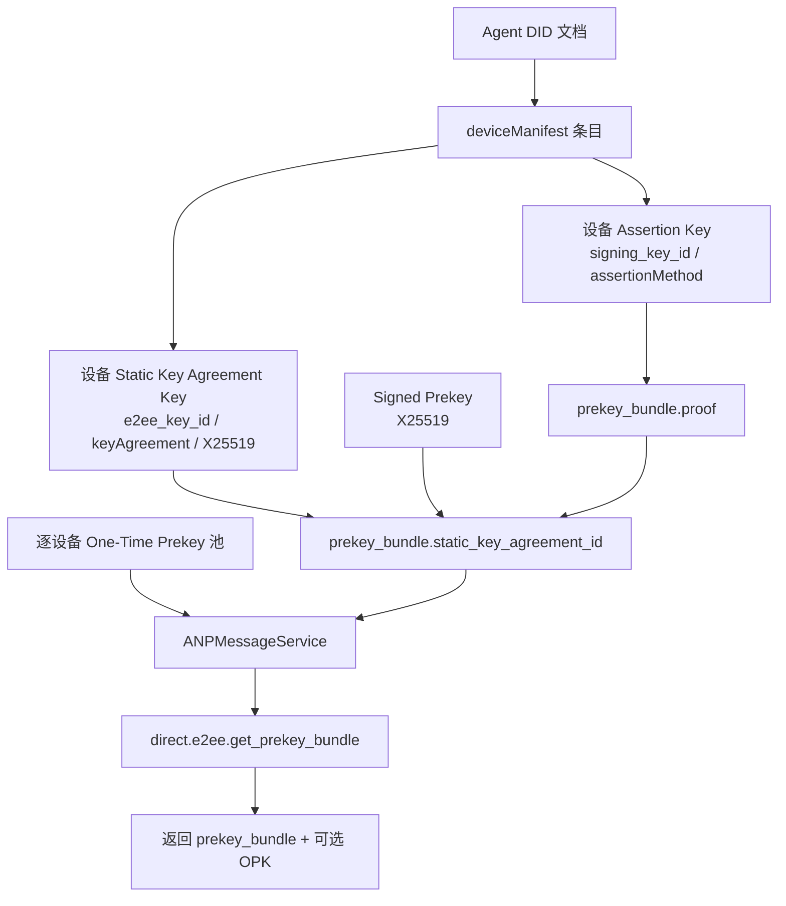
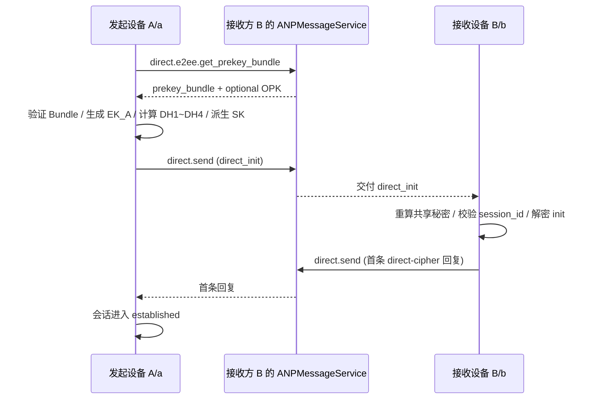
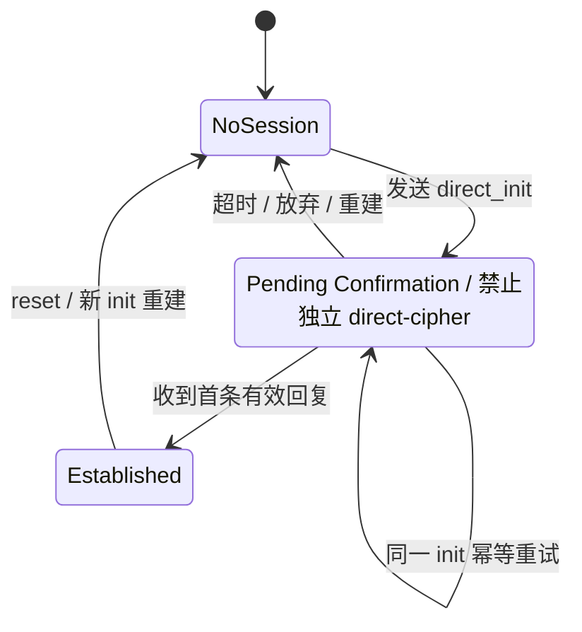

# ANP Profile 5：私聊端到端加密

- 文档编号：ANP-P5
- 标题：私聊端到端加密
- 状态：已发布
- 版本：1.2
- 规范集版本：ANP Messaging 1.2
- 语言：中文
- Profile：`anp.direct.e2ee.v2`
- 适用范围：本 Profile 适用于两个 Agent DID 下具体密码学设备之间的私聊 E2EE。
- 依赖关系：
  - `anp.core.binding.v1`
  - `anp.identity.discovery.v1`
  - `anp.direct.base.v1`
  - [ANP-02 身份输入](../02-ANP-基于DID的身份认证协议.md#identity-input)及适用 DID 方法绑定（规范依赖，不新增 wire Profile）

---

## 1. 目标与范围

本 Profile 定义 ANP 私聊端到端加密的完整可实现方案，规定：

1. 如何把经方法验证的 DID 身份、P2 `deviceManifest` 与服务发现接入私聊 E2EE；
2. 每个当前合格设备如何发布、发现和验证自己的 Prekey Bundle；
3. 精确的发送设备与接收设备对如何执行基于 `X3DH-like` 的异步建链；
4. 每个设备对如何维护独立的 `Double Ratchet-like` 状态；
5. 设备绑定的 AAD、重放防护、乱序处理、会话重建、Mailbox 投递与错误如何工作；
6. 如何让 Agent DID 继续作为业务身份，而显式设备选择器只用于选择密码学端点。

因此，一条逻辑 DID-to-DID 消息可以产生多个独立的逐设备密文操作。本 Profile 不会把设备变成联系人、会话参与方或新的 `target.kind`。

本 Profile **不**定义：

- 设备准入或产品本地设备管理流程；
- 历史消息拉取；
- 已读状态；
- Presence；
- 群组端到端加密；
- 跨设备复制设备私钥、Ratchet 状态或历史明文；
- DID 方法本身的解析、更新和停用机制。

---

## 2. 规范性关键字与术语

### 2.1 规范性关键字

本文中的 **MUST**、**MUST NOT**、**REQUIRED**、**SHALL**、**SHALL NOT**、**SHOULD**、**SHOULD NOT**、**RECOMMENDED**、**NOT RECOMMENDED**、**MAY**、**OPTIONAL** 按照其大写形式解释为规范性要求。

### 2.2 术语

- **Agent DID**：对外互通的 Agent 标识。在本 Profile 中，它既是外层 `direct.send` 的业务主体标识，也是 AAD、Bundle 校验和会话绑定的身份锚点。
- **设备端点**：Agent DID 下的密码学端点，由该 DID 当前 P2 `deviceManifest` 中的不透明 `device_id` 选择。它不是 DID 或业务参与方。
- **设备对**：一条 Direct E2EE 操作绑定的有序四元组 `(sender_did, sender_device_id, recipient_did, recipient_device_id)`。
- **Assertion Key**：由所选 Manifest 条目的 `signing_key_id` 引用、且被 `assertionMethod` 授权的签名密钥。它用于签署该设备的 Bundle 或 Binding Proof，不参与 DH 计算。
- **Static Key Agreement Key**：由所选 Manifest 条目的 `e2ee_key_id` 引用，并在 DID 文档 `keyAgreement` 中声明的长期 X25519 公钥。
- **Signed Prekey (SPK)**：由一个设备生成、并由该设备 Assertion Key 签名绑定的中期 X25519 公钥。
- **One-Time Prekey (OPK)**：属于一个设备的一次性 X25519 公钥。若被成功使用，必须消费且不可重用。
- **Prekey Bundle**：精确绑定一个 `(owner_did, owner_device_id)` 的建链公开材料。它描述该设备的长期静态协商密钥和当前 SPK，但不直接内嵌 OPK。
- **Direct Session**：一个有序设备对的 E2EE 会话，由 `session_id` 标识。它的 Double Ratchet、乱序和重放状态不得与其他设备对共享。
- **Application Plaintext**：被加密前的私聊应用层明文对象。它是 Direct Base 应用负载的归一化内层表示，用于进入 AEAD 加密。
- **Ratchet Header**：后续消息所需的最小公开头字段。接收方依赖它定位接收链、判断是否需要推进 DH ratchet，并处理乱序消息。
- **Mailbox**：范围为 `(recipient_did, recipient_device_id)` 的不透明密文队列。它可以承载多个 Session，但不拥有 Ratchet 状态。
- **Replay Cache**：用于识别重复初始消息或重复后续消息的状态集合。它是本地状态，不是标准线协议字段。

`device_id` **MUST** 是不透明标识，且在移除后 **MUST NOT** 被复用。它不是密钥、硬件标识或用户可见名称。

---

## 3. 设计总则

### 3.1 业务身份与密码学设备端点

业务发送方与接收方仍由 `meta.sender_did` 和 `meta.target.did` 表达。本 Profile 额外要求 `meta.sender_device_id` 与 `meta.recipient_device_id` 以选择一个精确密码学设备对。这些字段只属于 P5，不改变 DID 级联系人或会话语义。

如果发送方定向同一接收 DID 下的多个合格设备，它 **MUST** 为每个接收设备创建一条独立加密的 `direct.send` 操作。服务 **MUST NOT** 共享 Ratchet 状态或执行隐藏的密码学 fan-out。

### 3.2 安全 Overlay 与业务语义分离

本 Profile 不重新定义私聊业务语义；它复用 `anp.direct.base.v1` 的：

- `direct.send` 方法；
- `sender_did` / `target.did` 语义；
- `message_id` / `operation_id` 语义；
- 私聊成功语义（目标 Agent 入口服务已接受）；
- 应用层内容类型语义。

对每条设备密文，P5 拥有双方设备选择器、设备对密码学绑定与逐设备 accepted 结果。使用传输保护的 P3 消息仍只按 DID 寻址，且不携带设备选择器。

### 3.3 不变的 MTI 基线

本 v2 Profile 的强制互通基线继续采用：

- 初始建链：`X3DH-like`（面向 DID 适配）
- 长期静态协商密钥：`X25519`
- KDF：`HKDF-SHA-256`
- 消息 AEAD：`ChaCha20-Poly1305`
- 后续消息：`Double Ratchet-like`

### 3.4 未来升级路径

本 Profile 保留向 `PQXDH-like` 升级的空间。本 v2 Profile 不改变现有 MTI 密码套件；任何未来套件都需要独立、明确的 suite 标识和协商。

`anp.direct.e2ee.v1` 仍是独立的单端点合约。实现 **MUST NOT** 为 v1 对端推断设备，不得把 v1 Session 或 Ratchet 状态作为 v2 设备状态复用，也不得将失败的 v2 设备操作静默降级为 v1 或使用传输保护的 P3。

### 3.5 默认不强制对 init 消息做长期签名

本 Profile 默认 **不强制** 对 `direct_init` 对象整体再做一次长期 DID 身份签名。

原因是：

1. X3DH-like 的认证本身来自长期静态协商密钥与接收方 SPK 的组合；
2. 接收方 SPK 已由 Assertion Key 绑定；
3. 若再要求对整个 init 消息做长期签名，会显著偏向“可归责控制消息”模型，削弱 Signal 风格的可否认性。

若部署需要更强的可审计性，可额外启用 `Direct Init Accountability Extension`；该扩展不是本 Profile 的默认必选项。

### 3.6 `anp.direct.e2ee.v2` 的 MTI wire object 集合

当 `method = "direct.send"` 且 `meta.profile = "anp.direct.e2ee.v2"` 时，不变的 MTI 路径中的 `meta.content_type` 仅允许以下两个值：

- `application/anp-direct-init+json`
- `application/anp-direct-cipher+json`

发送方 **MUST NOT** 在不变的 MTI 路径中使用其它 wire object type。
接收方若收到其它 `content_type`，**MUST** 拒绝，除非该能力已通过扩展协商显式启用。

### 3.7 `anp.direct.e2ee.v2` 下 `direct.send` 的消息标识约束

对于 `meta.profile = "anp.direct.e2ee.v2"` 的 `direct.send`：

- `meta.message_id` **MUST** 存在；
- `meta.operation_id` **MUST** 存在；
- `meta.operation_id` **MUST** 与 `meta.message_id` 完全相等。

每条接收设备密文 **MUST** 使用自己唯一的 `message_id` / `operation_id` 对。即使不同设备密文的加密 Application Plaintext 包含相同的可选 `logical_message_id`，也不得共享该标识对。

### 3.8 `anp.direct.e2ee.v2` 下 `direct.send` 的 `auth` 约束

对于 `meta.profile = "anp.direct.e2ee.v2"` 的 `direct.send`，`params.auth` **MUST** 缺省。

若部署显式协商启用了 `Direct Init Accountability Extension`，则 **MAY** 引入额外证明对象；未协商该扩展时，接收方收到 `params.auth` **MUST** 拒绝。

---


### 3.9 与 P3 原发者绑定要求的关系

对于 P3 第 9.7 节中“`auth.origin_proof.contentDigest` 或等价的原发者证明摘要”要求，本 Profile 通过以下对象共同满足等价绑定：

- `AD_init`
- `AD_msg`
- AEAD 保护下的 `Application Plaintext`

未协商 `Direct Init Accountability Extension` 时，本 Profile 的 MTI **不要求** 额外携带 P3 形式的 `params.auth.origin_proof`。

## 4. 方法无关的 DID 集成规则

### 4.1 DID 文档最小要求

支持本 Profile 的 Agent DID 文档 **MUST** 满足：

1. 至少有一个可用于身份认证的Authentication Key和断言签名的 Assertion Key；
2. 至少有一个 `keyAgreement` 验证方法；
3. 至少有一个 `ANPMessageService` 或等价服务入口；
4. 当前 P2 `deviceManifest` 声明每个可以使用 P5 的设备，并映射其 `device_id`、`signing_key_id`、`e2ee_key_id` 以及完整的 P1/P2/P3/P5 Profile 依赖集；
5. 该 `ANPMessageService` **MUST** 可被调用方解析和访问，并提供本 Profile 所需的逐设备密钥材料方法。

#### 4.1.1 当前设备资格

在为 `(D, d)` 发布、返回或使用 P5 材料前，实现 **MUST** 针对当前 DID 文档验证：

1. `d` 在 Agent DID `D` 下精确选择一个当前 P2 Manifest 条目；
2. 该条目声明 `anp.direct.e2ee.v2` 及其所需的 P1/P2/P3 依赖；
3. `signing_key_id` 引用 Bundle proof 所需的签名方法，`e2ee_key_id` 引用 `keyAgreement` 中的 X25519 方法；且
4. Bundle、Session、AAD、重放状态与 Mailbox 操作使用相同的 DID/设备和密钥引用。

如果任一所选设备不再满足上述规则，实现 **MUST** 拒绝新材料和密文，**MUST** 停止使用受影响的缓存与 Session，且调用方 **MUST** 重新解析 DID。其他仍合格设备对的未变 Session 不受影响。

### 4.2 密钥角色分离

本 Profile **MUST** 采用密钥角色分离：

1. `assertionMethod` 所列密钥用于：
   - 签署 Prekey Bundle；
   - 签署需要强身份归属的控制对象（若某扩展启用）；
2. `keyAgreement` 所列密钥用于：
   - 长期静态协商；
   - 初始共享密钥推导；
3. Assertion Key 与 Static Key Agreement Key **MUST NOT** 混用。

每个 Manifest 设备都拥有分离的签名与 X25519 私钥、SPK/OPK 私钥、Direct Session、Ratchet 状态、skipped key 和重放状态。两个设备 **MUST NOT** 共享这些私有状态或发布相同的活跃密钥引用。

补充说明：在线协议里，前者通常通过 `proof.verificationMethod` 被引用，后者通常通过 Bundle 中的 `static_key_agreement_id` 或 init 中的 `sender_static_key_agreement_id` 被引用；实现方不应让同一把密钥同时承担这两类语义。

### 4.3 DID 方法验证

DID 文档按 [P2 方法验证](02-身份与发现.md#method-validation)及对应方法规范验证；设备资格与 Bundle Object Proof 继续分别遵循第 4.1.1 节和第 6.2 节。

### 4.4 `ANPMessageService` 的密钥材料能力

对每个精确 `(owner_did, owner_device_id)`，`ANPMessageService` **MUST** 承担本 Profile 所需的以下密钥材料能力：

- 发布 Prekey Bundle；
- 补充或轮换 OPK 池；
- 查询 Prekey Bundle；
- 按次发放一个可用 OPK（若存在且策略允许）；
- 标记 OPK 已分配、已消费或不可再用；
- 返回 Bundle 撤销或失效状态（若实现支持）；
- 当该设备失去 P5 资格时停止提供 Bundle 和 OPK。

---


P5 的理解门槛首先不在算法，而在于“谁负责签、谁负责做 DH、谁负责发布 Bundle / OPK”。下图把 DID 文档中的不同密钥角色与对外公开材料放进同一视图，便于后续阅读建链流程。



*图 P5-1：密钥角色与公开材料关系（非规范性）。*

本图强调的是职责分离：Assertion Key 负责身份绑定，长期 `keyAgreement` 与 SPK / OPK 负责 DH 计算；实现方不应让同一把密钥同时承担这两类语义。
## 5. 强制互通套件（MTI）

### 5.1 MTI 套件名称

v2 Profile 继续使用以下不变的 MTI 密码套件：

`ANP-DIRECT-E2EE-X3DH-25519-CHACHA20POLY1305-SHA256-V1`

末尾的 `V1` 是密码套件版本，不是 P5 Profile 版本。实现 **MUST NOT** 将其替换为 `V2`，且本文中的所有 HKDF `info` 字符串与算法参数都与已发布套件保持不变。

### 5.2 MTI 套件参数

该套件参数固定如下：

- 静态协商曲线：`X25519`
- 临时协商曲线：`X25519`
- HKDF：`HKDF-SHA-256`
- AEAD：`ChaCha20-Poly1305`
- Bundle object proof profile：`prekey_bundle.proof` **MUST** 复用 P1 附录 B 定义的共享 `Object Proof Profile`


本要求至少适用于：

- `prekey_bundle` 的被保护文档（本文中亦称 `Signed Bundle Object`）
- `AD_init`
- `AD_msg`
- `Application Plaintext`


### 5.3 推荐可选套件

实现 **MAY** 额外支持：

- `ANP-DIRECT-E2EE-X3DH-25519-AES256GCM-SHA256-V1`
- `ANP-DIRECT-E2EE-PQXDH-HYBRID-V1`（预留）

但任何 `anp.direct.e2ee.v2` 互通实现 **MUST** 支持该不变的 MTI 套件。

---

## 6. 公开材料与 Bundle 结构

### 6.1 长期静态协商密钥

每个声明本 Profile 的当前设备 **MUST** 通过其 Manifest `e2ee_key_id` 引用 Agent DID 文档 `keyAgreement` 中自己的长期静态 X25519 公钥。

推荐字段：

- `id`：例如 `did:wba:example.com:agent:alice:e1_xxx#ka-1`
- `type`：实现自选，但必须明确表示 X25519
- `publicKeyMultibase` 或等价公钥表示


字段使用说明：

- `id`：用于在 Bundle、Init 消息和 AAD 中精确指明“本次用了哪一个长期 DH 键”。
- `type`：用于声明该验证方法的算法与编码方式，便于对端正确解码并校验它确实是 X25519。
- `publicKeyMultibase` 或等价表示：承载实际的公开密钥字节，是对端执行 DH 的输入来源。

### 6.2 `prekey_bundle` 结构

`prekey_bundle` 表示由接收方长期发布、并由所选设备的 P1 附录 B Object Proof 绑定的**静态建链材料**。为与 Signal 风格的 OPK 按次发放模型保持一致，`prekey_bundle` **MUST NOT** 直接内嵌 `one_time_prekey`；OPK 由服务端在查询时按次返回。

`prekey_bundle` 推荐定义如下：

```json
{
  "bundle_id": "bundle-20260329-001",
  "owner_did": "did:wba:example.com:agent:alice:e1_xxx",
  "owner_device_id": "dev-a-7N3KQ2",
  "suite": "ANP-DIRECT-E2EE-X3DH-25519-CHACHA20POLY1305-SHA256-V1",
  "static_key_agreement_id": "did:wba:example.com:agent:alice:e1_xxx#ka-1",
  "signed_prekey": {
    "key_id": "spk-001",
    "public_key_b64u": "BASE64URL_X25519_SPK",
    "expires_at": "2026-04-05T00:00:00Z"
  },
  "proof": {
    "type": "DataIntegrityProof",
    "cryptosuite": "eddsa-jcs-2022",
    "verificationMethod": "did:wba:example.com:agent:alice:e1_xxx#assert-1",
    "proofPurpose": "assertionMethod",
    "created": "2026-03-29T00:00:00Z",
    "proofValue": "zBASE58MULTIBASE_PROOF"
  }
}
```

字段使用说明：

- `bundle_id`：该静态 Bundle 版本的稳定标识。发送方会把它带入 `direct_init` 和 `AD_init`，接收方也可用它做审计、缓存命中和重放范围区分。
- `owner_did`：Bundle 所属 Agent DID。发送方依据它解析 DID 文档、验证 `proof` 并确认该 Bundle 的身份归属。
- `owner_device_id`：Bundle 所属的精确设备端点；它 **MUST** 在 `owner_did` 下选择一个当前 P5 合格的 Manifest 条目。
- `suite`：该 Bundle 适用的密码套件名称。发送方应先判断本地是否支持，再决定是否使用该 Bundle 建链。
- `static_key_agreement_id`：指向 `owner_did` DID 文档中长期静态 X25519 密钥的 DID URL。它告诉对端“本 Bundle 对应哪把长期 DH 键”。
- `signed_prekey.key_id`：当前 SPK 的稳定标识。发送方在 `direct_init` 中引用它，接收方据此定位正确的 SPK 私钥。
- `signed_prekey.public_key_b64u`：SPK 的公开密钥字节，使用无填充 base64url 表示，是初始 DH 的输入之一。
- `signed_prekey.expires_at`：SPK 的失效时间。发送方在使用 Bundle 前必须校验它尚未过期。
- `proof.type`：证明对象的类型；本 Profile 的 MTI 继续固定为 `DataIntegrityProof`。
- `proof.cryptosuite`：具体的 proof cryptosuite 名称；本 Profile 的 MTI 继续固定为 `eddsa-jcs-2022`。
- `proof.verificationMethod`：用于签署 Bundle 的验证方法 DID URL。发送方应检查它是否属于 `owner_did` 文档允许的 `assertionMethod` 关系。
- `proof.proofPurpose`：声明签名所使用的授权关系，用于与 DID 文档中的授权关系对应。
- `proof.created`：该证明生成时间，用于审计和策略检查。
- `proof.proofValue`：对 Bundle 规范化表示签出的证明值。

### 6.2.1 `prekey_bundle.proof` 与共享 Object Proof Profile

`prekey_bundle.proof` **MUST** 复用 P1 附录 B 定义的共享 **Object Proof Profile**。

对 `prekey_bundle` 而言：

- issuer DID **MUST** 为 `owner_did`
- owner device **MUST** 为 `owner_device_id`，并选择一个当前 P5 合格的 Manifest 条目
- 被保护文档 **MUST** 是移除 `proof` 后的整个 `prekey_bundle` 对象
- 本文将该被保护文档简称为 `Signed Bundle Object`
- `proof.verificationMethod` **MUST** 指向 `owner_did` DID 文档中被 `assertionMethod` 授权的验证方法
- `proofPurpose` **MUST** 固定为 `assertionMethod`


### 6.2.2 `bundle_id` 的不可重定义语义

在本地接受窗口内，同一 `bundle_id` **MUST** 唯一映射到且仅映射到以下字段组合：

- `owner_did`
- `owner_device_id`
- `suite`
- `static_key_agreement_id`
- `signed_prekey.key_id`
- `signed_prekey.public_key_b64u`

服务端 **MAY** 在短暂 grace period 内同时接受多个不同 `bundle_id`，但 **MUST NOT** 重定义同一 `bundle_id`。

当某 `bundle_id` 仍在接受窗口内时，接收方 **MUST** 保留其对应的 SPK 私钥、Bundle 元数据和必要查找索引，直到该接受窗口结束。

### 6.2.3 Bundle proof 的对象特定约束

除 P1 附录 B 的共享规则外，本 Profile 的 MTI 中，`prekey_bundle` 还 **MUST** 满足：

- `proof` **MUST** 存在
- `proof.verificationMethod` 所属 DID **MUST** 等于 `owner_did`
- 若 `prekey_bundle.proof` 不满足 P1 附录 B，或其 issuer DID 与 `owner_did` 不一致，接收方 **MUST** 以 `anp.direct.e2ee.bundle_invalid` 拒绝该 Bundle

### 6.3 Bundle 字段要求

`prekey_bundle` **MUST** 包含：

- `bundle_id`
- `owner_did`
- `owner_device_id`
- `suite`
- `static_key_agreement_id`
- `signed_prekey`
- `proof`

`prekey_bundle` **MUST NOT** 直接包含：

- `one_time_prekey`

### 6.4 Bundle proof 的对象特定字段约束

除 P1 附录 B 对“移除 `proof` 后的整个对象”这一统一保护范围要求外，`prekey_bundle` 仍 **MUST** 至少包含并因此整体受 `proof` 保护以下安全关键字段：

- `bundle_id`
- `owner_did`
- `owner_device_id`
- `suite`
- `static_key_agreement_id`
- `signed_prekey`

`proof` 绑定的是静态 Bundle；运行时按次发放的 OPK **MUST NOT** 作为静态 Bundle proof 的覆盖内容。

### 6.5 Bundle 校验要求

发送方在使用 Bundle 前 **MUST**：

1. 解析 `owner_did` 的当前 DID 文档，并按第 4.1.1 节验证 `owner_device_id`；
2. 验证 `proof.verificationMethod` 等于该 Manifest 条目的 `signing_key_id`，且在 `owner_did` DID 文档中被 `assertionMethod` 授权；
3. 按 P1 附录 B 定义的共享 Object Proof Profile 验证 `prekey_bundle.proof`（其被保护文档即 `Signed Bundle Object`）；
4. 校验 `static_key_agreement_id` 等于该 Manifest 条目的 `e2ee_key_id`，且存在于 DID 文档 `keyAgreement`；
5. 校验 `suite` 是否为本地支持的套件；
6. 校验 `signed_prekey.expires_at` 未过期；
7. 若 `direct.e2ee.get_prekey_bundle` 的成功响应附带 `one_time_prekey`，发送方 **MUST** 校验其字段格式合法，并记录其 `key_id` 以供后续建链、消费与审计。
8. 发送方后续构造 `direct_init` 时，`recipient_signed_prekey_id` **MUST** 等于所选 `prekey_bundle.signed_prekey.key_id`。

### 6.6 OPK 策略

在本 Profile 不变的 MTI 中，`one_time_prekey` 仍 **SHOULD** 使用，但 **MAY** 缺省。

为与 Signal 风格的一次性预密钥发放方式保持一致，每个接收设备 **SHOULD** 预先向其 `ANPMessageService` 上传一批可供发放的 OPK，由服务端在 `direct.e2ee.get_prekey_bundle` 的成功响应中按次从该设备的池中返回一个可用 OPK。

当成功响应附带 OPK 时，其对象格式推荐如下：

```json
{
  "key_id": "opk-001",
  "public_key_b64u": "BASE64URL_X25519_OPK"
}
```

字段使用说明：

- `key_id`：该 OPK 记录的稳定标识。发送方在 `direct_init` 中通过 `recipient_one_time_prekey_id` 引用它，接收方用它定位并消费相应私钥。
- `public_key_b64u`：该 OPK 的公开密钥字节，使用无填充 base64url 表示，是可选 `DH4` 的输入。

规则如下：

- 服务端 **SHOULD** 在返回 OPK 时立即将其标记为已分配；
- 同一 OPK **MUST NOT** 被并发分配给多个发送方或设备对；
- 若某 OPK 已完成一次成功的初始建链，服务端 **MUST** 将其标记为已消费，接收方 **MUST** 删除对应 OPK 私钥；
- 若分配后建链未完成，是否允许回收由部署策略决定；但任何被确认用于成功建链的 OPK **MUST NOT** 再次发放；
- 若 `direct.e2ee.get_prekey_bundle` 的成功响应未附带 OPK，发起方仍可继续建链，但初始共享秘密的前向安全性将更多依赖 SPK 生命周期。

---

## 7. Key Service 方法

### 7.1 `direct.e2ee.publish_prekey_bundle`

此方法用于把新的静态 Prekey Bundle 发布到发送方自己公开的 `ANPMessageService`，并可选补充一批 OPK。

#### 请求要求

- `meta.profile = anp.direct.e2ee.v2`
- `meta.security_profile = transport-protected`
- `meta.target.kind = "service"`
- `meta.target.did` **MUST** 等于发布方自己公开的 `ANPMessageService.serviceDid`
- `meta.sender_did` **MUST** 存在
- `meta.sender_device_id` **MUST** 存在
- `meta.operation_id` **MUST** 存在
- 未协商扩展时，`params.auth` **MUST** 缺省
- `body.prekey_bundle` **MUST** 存在
- `body.prekey_bundle.owner_did` **MUST** 等于 `meta.sender_did`
- `body.prekey_bundle.owner_device_id` **MUST** 等于 `meta.sender_device_id`
- `body.one_time_prekeys` **MAY** 存在；若存在，**MUST** 为非空数组，且每个元素 **MUST** 至少包含 `key_id` 与 `public_key_b64u`

认证约束：

- 该方法属于 **service-scoped** 控制面方法；
- 已认证上下文 **MUST** 识别精确的 `(meta.sender_did, meta.sender_device_id)`，且该设备 **MUST** 当前按第 4.1.1 节具备 P5 资格；
- 标准路径下，调用方 **MUST** 运行在已认证的本域会话或等价的 hop / service 认证上下文中；
- 本 Profile **不要求** 为该方法额外定义新的业务层 `origin_proof`；
- 服务端在接受该请求前，除验证 hop / service 级认证外，还 **MUST** 验证当前已认证 caller 有权代表 `meta.sender_did` 发布 `body.prekey_bundle.owner_did` 对应的材料。


幂等要求：

- 服务端 **MUST** 以 `(meta.sender_did, meta.sender_device_id, meta.target.did, method, meta.operation_id)` 作为幂等键；
- 同一幂等键的重复请求，若 `body.prekey_bundle` 与 `body.one_time_prekeys` 语义等价，则 **MUST** 返回原结果或等价结果；
- 若同一幂等键对应的请求体语义冲突，则 **MUST** 返回 `anp.idempotency_conflict` 或等价错误。

字段使用说明：

- `meta.security_profile = transport-protected` 表示这里是密钥控制面调用，而不是已经建立会话后的 E2EE 密文传输。
- `body.prekey_bundle` 用于发布或替换当前可供他人获取的静态建链材料。
- `body.one_time_prekeys` 用于一次性补充 OPK 池；它是可选批量上传项，不会进入静态 Bundle proof。

#### 成功响应

成功响应 **MUST** 至少包含：

- `published = true`
- `owner_did`
- `owner_device_id`
- `bundle_id`
- `published_at`

成功响应 **MAY** 包含：

- `published_opk_count`


### 7.2 `direct.e2ee.get_prekey_bundle`

此方法用于通过目标 Agent 公开的 `ANPMessageService` 获取一个可用静态 Bundle，并按需附带一个可用 OPK。

#### 请求要求

- `meta.profile = anp.direct.e2ee.v2`
- `meta.security_profile = transport-protected`
- `meta.target.kind = "service"`
- `meta.target.did` **MUST** 等于目标 Agent 公开的 `ANPMessageService.serviceDid`
- `meta.sender_did` **MUST** 存在
- `meta.sender_device_id` **MUST** 存在
- `meta.operation_id` **MUST** 存在
- 未协商扩展时，`params.auth` **MUST** 缺省

`body` **MUST** 包含：

- `target_did`
- `target_device_id`

`body` **MAY** 包含：

- `preferred_suite`
- `require_opk`

认证约束：

- 该方法属于 **service-scoped** 控制面方法；
- 已认证上下文 **MUST** 识别当前 P5 合格的 `(meta.sender_did, meta.sender_device_id)`；
- 在返回材料前，服务 **MUST** 按第 4.1.1 节验证精确的 `(target_did, target_device_id)`；
- 最小互通基线至少要求 hop / service 级认证；
- 标准路径下，未协商扩展时，`params.auth` **MUST** 缺省；
- **匿名获取 Bundle 或 OPK 不属于本 Profile 的 MTI**；若某部署开放匿名访问，属于额外部署策略。

字段使用说明：

- `target_did`：表示希望获取谁的建链材料；服务端应返回与该 DID 绑定的 Bundle，而不是其它主体的缓存结果。
- `target_device_id`：选择 `target_did` 下一个当前接收设备；服务 **MUST NOT** 返回缓存的其他设备材料。
- `preferred_suite`：在服务端同时维护多个套件时，用于表达调用方希望优先拿到哪一个套件的材料。
- `require_opk`：表示“没有可用 OPK 就不要退化建链”；若为 `true`，调用方期望拿到可直接用于 `DH4` 的一次性预密钥。


#### 成功响应

成功响应 **MUST** 至少包含：

- `target_did`
- `target_device_id`
- `prekey_bundle`

成功响应 **MAY** 包含：

- `one_time_prekey`


成功响应字段的使用方式如下：

- `target_did`：回显本次返回材料实际归属的目标 DID，便于调用方核对缓存与请求目标是否一致。
- `target_device_id`：回显返回材料所属的精确设备；它 **MUST** 等于请求值与 `prekey_bundle.owner_device_id`。
- `prekey_bundle`：返回目标主体当前可用的静态建链材料；发送方在真正建链前仍需按第 6.5 节完成验证。
- `one_time_prekey`：若存在，表示服务端已为本次查询分配了一个可用 OPK；发送方应将其视为与随后的 init 尝试绑定的材料，而不是长期缓存的公共信息。

若 `require_opk = true` 且服务端当前无可发放 OPK，则服务端 **SHOULD** 返回显式错误，而不是伪造或复用旧 OPK。


幂等与 OPK 分配要求：

- 服务端 **MUST** 以 `(meta.sender_did, meta.sender_device_id, target_did, target_device_id, meta.target.did, method, meta.operation_id)` 作为幂等键；
- 若某次成功响应已为该幂等键分配 `one_time_prekey`，则在重新验证当前设备资格后，同一幂等键的重试 **MUST** 返回同一个 `prekey_bundle` 与同一个 `one_time_prekey`；
- 服务端 **MUST** 以原子方式完成“幂等记录写入 + OPK 分配/保留状态写入”；
- 服务端 **MUST NOT** 因同一幂等键的重试而重新分配另一个 OPK。


### 7.3 服务端 Bundle 发放规则

`ANPMessageService` 在返回 Bundle 时：

- **SHOULD** 优先返回仍在有效期内的最新静态 `prekey_bundle`；
- 若存在可用 OPK 且策略允许，**SHOULD** 额外附带一个 `one_time_prekey`；
- 返回的 `one_time_prekey` **MUST** 来自 `(owner_did, owner_device_id)` 当前可用的 OPK 池，且 **MUST NOT** 被静态 Bundle proof 冒充为其签名组成部分；
- 返回 OPK 后 **SHOULD** 将其标记为已分配；
- 当本次返回附带 OPK 时，服务端 **MUST** 以原子方式完成“本次响应的幂等记录写入 + OPK 分配/保留状态写入”；
- **MUST NOT** 将同一 OPK 并发分配给多个发送方；
- 目标接收方成功处理 init 后，服务端 **MUST** 将对应 OPK 标记为已消费，接收方 **MUST** 删除对应 OPK 私钥；
- 若目标服务拒绝或处理失败，是否允许 OPK 回收由部署策略决定；但任何被确认用于成功建链的 OPK **MUST NOT** 再次发放；
- caller identity、限流与防滥用策略 **MUST** 基于 hop / service 级认证实施。

---

## 8. 初始建链：X3DH-like（DID 适配版）

## 8.1 设计说明

本 Profile 的初始建链 **不是** 原样照搬 Signal X3DH，而是一个 **X3DH-like** 适配版：

- X3DH 原始设计中的长期身份 DH 密钥，在本 Profile 中由 DID 文档 `keyAgreement` 的长期静态 X25519 密钥承担；
- DID 的 Assertion Key 不参与 DH，而只负责签署 Bundle；
- 因为签名密钥与 DH 密钥已分离，所以原始 X3DH 为 XEdDSA 同钥用途而引入的某些域分离细节不再需要原样照搬。

## 8.2 参与密钥

### 发送设备 `(A, a)`

- `A` 是发送方 Agent DID，`a` 是其当前 `sender_device_id`；
- `KA_A`：发送设备长期静态 X25519 `keyAgreement` 公钥 / 私钥对。在线协议中它通常由 `sender_static_key_agreement_id` 指明。
- `EK_A`：发送方一次性临时 X25519 公钥 / 私钥对。它为每次新的 init 重新生成，并通过 `sender_ephemeral_pub_b64u` 暴露其公钥部分。

### 接收设备 `(B, b)`

- `B` 是接收方 Agent DID，`b` 是其当前 `recipient_device_id`；
- `KA_B`：接收设备长期静态 X25519 `keyAgreement` 公钥 / 私钥对。发送方通过 `recipient_bundle_id` 选定的 Bundle 版本以及其中的 `static_key_agreement_id` 间接确定它。
- `SPK_B`：接收方带签名的中期 X25519 预密钥。在线协议中它由 `recipient_signed_prekey_id` 指明，并由 Bundle proof 绑定到 DID 身份。
- `OPK_B`：接收方一次性 X25519 预密钥（可选）。若服务端返回它，则在线协议中由 `recipient_one_time_prekey_id` 指明，并在成功建链后消费。

## 8.3 建链前置条件

本节中的 `recipient_did` 是对外层 `direct.send.params.meta.target.did` 的简写，不新增独立线协议字段。`sender_device_id` 与 `recipient_device_id` 来自外层 P5 `meta`，并共同选择一个精确设备对。

发送方在发起建链前 **MUST**：

1. 解析并验证目标 `recipient_did`；
2. 按第 4.1.1 节验证双方所选 Manifest 条目；
3. 获取并验证目标设备的 `prekey_bundle`；若响应附带 `one_time_prekey`，则一并记录该 OPK；
4. 获取发送设备 Manifest `e2ee_key_id` 所对应的本地长期静态私钥；
5. 生成新的临时 X25519 密钥对 `EK_A`。

## 8.4 DH 计算

若 `direct.e2ee.get_prekey_bundle` 的成功响应中 **没有** OPK，则发送方 **MUST** 计算：

```text
DH1 = DH(KA_A, SPK_B)
DH2 = DH(EK_A, KA_B)
DH3 = DH(EK_A, SPK_B)
IKM = DH1 || DH2 || DH3
```

若 `direct.e2ee.get_prekey_bundle` 的成功响应中 **有** OPK，则发送方 **MUST** 额外计算：

```text
DH4 = DH(EK_A, OPK_B)
IKM = DH1 || DH2 || DH3 || DH4
```

## 8.5 初始共享秘密派生

发送方和接收方 **MUST** 使用：

```text
PRK = HKDF-Extract(salt = 0x00...00(32 bytes), IKM)
SK  = HKDF-Expand(PRK, info = "ANP Direct E2EE v1 Initial Secret", L = 32)
```

然后从 `SK` 派生：

```text
RK0 = HKDF-Expand(SK, info = "ANP Direct E2EE v1 Root Key", L = 32)
CK0 = HKDF-Expand(SK, info = "ANP Direct E2EE v1 Chain Key", L = 32)
SID = HKDF-Expand(SK, info = "ANP Direct E2EE v1 Session ID", L = 16)
```

其中：

- `RK0`：初始 Root Key
- `CK0`：首条 init 密文消耗前的初始链起点
- `SID`：16 字节会话标识，编码为 Base64URL 后作为 `session_id`


### 8.5.1 首条消息密钥与 nonce

`SK` 派生出 `RK0` 与 `CK0` 后，发送方和接收方 **MUST** 立即对 `CK0` 执行一次 `kdf_ck`：

```text
CK1, MK0, NONCE0 = kdf_ck(CK0)
```

其中：

- `MK0` 仅用于加密或解密 `direct_init.ciphertext_b64u`
- `NONCE0` 仅用于该首条 init 密文的 AEAD nonce
- `CK1` 是 init 成功后后续链状态的唯一起点

不变的 MTI 规则是：init 消息消耗链上的第 0 条消息。换言之，`CK0` 只用于派生 `MK0`、`NONCE0` 与 `CK1`；init 成功后双方 **MUST** 从 `CK1` 继续，而 **MUST NOT** 再把 `CK0` 作为后续发送链或接收链的起点。

此外，`ciphertext_b64u` **只包含 AEAD ciphertext（含认证标签）本体**，不额外拼接或前置 nonce；nonce 一律按本 Profile 的 KDF 规则派生。


## 8.6 初始 Associated Data

建链时的初始 AEAD AAD，记为 `AD_init`。其规范性 JSON 结构与唯一字节序列由第 9.4.2 节定义，并 **MUST** 使用 UTF-8 + RFC 8785 JCS 编码。

`AD_init` **MUST** 至少绑定以下字段：

- `content_type = application/anp-direct-init+json`
- `sender_did`
- `sender_device_id`
- `recipient_did`
- `recipient_device_id`
- `suite`
- `recipient_bundle_id`
- `sender_static_key_agreement_id`
- `recipient_signed_prekey_id`
- `recipient_one_time_prekey_id`（若存在）
- `session_id`
- `message_id`
- `operation_id`
- `profile = anp.direct.e2ee.v2`
- `security_profile = direct-e2ee`

这些字段的作用如下：

- `content_type`：绑定当前 wire object type，防止同一密文被当作其它对象类型解释。
- `sender_did` / `recipient_did`：绑定建链双方的业务身份，降低身份错绑风险。
- `sender_device_id` / `recipient_device_id`：绑定精确的密码学端点，防止把 init 密文搬运到其他设备或 Session。
- `suite`：绑定所用密码套件，防止同一密文被跨套件误解释。
- `recipient_bundle_id`：绑定接收方所使用的具体 Bundle 版本，防止不同 Bundle 间的材料混用。
- `sender_static_key_agreement_id`：绑定发送方实际参与 DH 的长期静态密钥。
- `recipient_signed_prekey_id`：绑定接收方此次使用的 SPK 版本。
- `recipient_one_time_prekey_id`：若存在，绑定此次建链所消费的 OPK 记录。
- `session_id`：绑定本次推导出的会话标识，防止同一密文被挪用到其它会话。
- `message_id` / `operation_id`：这里指外层 `direct.send.meta` 中的两个标识。即使本 Profile 要求两者相等，AAD 仍显式认证两者。
- `profile` / `security_profile`：绑定协议解释上下文，防止跨 Profile 或跨安全模式替换。


## 8.7 初始应用消息

本 Profile 不变的 MTI 中，`direct_init.ciphertext_b64u` **MUST** 承载一个完整的内层 `Application Plaintext` 对象。

也就是说，本 Profile 的 MTI 不定义“空 init”对象；发送方在成功推导 `SK` 后，**MUST** 使用由 `CK0` 经 `kdf_ck` 派生得到的 `MK0` / `NONCE0` 对首个 `Application Plaintext` 进行加密，并将其写入 `ciphertext_b64u`。


---


下面的时序图把获取 Bundle、选择可选 OPK、发送 `direct_init`、接收方 bootstrap 与首条回复连成一条完整链路。这样读者在阅读后面的公式时，可以同时看到消息与状态是怎样一起推进的。



*图 P5-2：X3DH-like 初始建链时序（非规范性）。*

此处的“建立成功”不是 Bundle 获取成功，而是双方都已经依据同一套派生结果完成 bootstrap，并且发起方收到了同一 `session_id` 下的首条有效回复。
## 9. `application/anp-direct-init+json` 对象

### 9.1 顶层结构

当 `meta.content_type = application/anp-direct-init+json` 时，`body` **MUST** 采用如下结构：

```json
{
  "session_id": "BASE64URL_16_BYTES",
  "suite": "ANP-DIRECT-E2EE-X3DH-25519-CHACHA20POLY1305-SHA256-V1",
  "sender_static_key_agreement_id": "did:wba:example.com:agent:alice:e1_xxx#ka-1",
  "recipient_bundle_id": "bundle-20260329-001",
  "recipient_signed_prekey_id": "spk-001",
  "recipient_one_time_prekey_id": "opk-001",
  "sender_ephemeral_pub_b64u": "BASE64URL_X25519_EK_A",
  "ciphertext_b64u": "BASE64URL_INIT_CIPHERTEXT"
}
```

### 9.2 字段要求

`direct_init` **MUST** 包含：

- `session_id`
- `suite`
- `sender_static_key_agreement_id`
- `recipient_bundle_id`
- `recipient_signed_prekey_id`
- `sender_ephemeral_pub_b64u`
- `ciphertext_b64u`

`direct_init` **MAY** 包含：

- `recipient_one_time_prekey_id`

字段使用说明：

- `session_id`：本次新建会话的标识。它由初始共享秘密派生并在后续 `application/anp-direct-cipher+json` 消息中复用，用于索引 ratchet 状态。
- `suite`：声明本次 init 使用的密码套件，接收方应先据此选择正确的 KDF、AEAD 和报文解释规则。
- `sender_static_key_agreement_id`：指向发送方 DID 文档中实际参与 DH 的长期静态 `keyAgreement` 键。
- `recipient_bundle_id`：表示本次 init 使用了接收方哪一个静态 Bundle 版本；接收方可据此定位对应的 SPK 生命周期、本地接受窗口与重放范围。
- `recipient_signed_prekey_id`：指向接收方本次使用的 SPK 记录，接收方需据此找到正确的 SPK 私钥。发送方构造 `direct_init` 时，其值 **MUST** 等于所选 `prekey_bundle.signed_prekey.key_id`。
- `recipient_one_time_prekey_id`：若存在，表示本次 init 还消费了一个 OPK；接收方应据此定位并在成功建链后消费对应私钥。
- `sender_ephemeral_pub_b64u`：发送方为本次 init 新生成的临时 X25519 公钥，接收方会把它与本地长期/预密钥一起参与 DH 计算。
- `ciphertext_b64u`：使用 init 派生的首个消息密钥加密得到的 AEAD 密文字节；在该不变的套件中 nonce 不单独传输，而是按本 Profile 的 `kdf_ck` 规则派生，因此 `ciphertext_b64u` **只包含密文本体，不拼接 nonce**。


### 9.3 外层方法要求

`direct_init` **MUST** 通过 `direct.send` 承载，并满足：

- `meta.profile = anp.direct.e2ee.v2`
- `meta.security_profile = direct-e2ee`
- `meta.sender_device_id` **MUST** 存在
- `meta.recipient_device_id` **MUST** 存在
- `meta.content_type = application/anp-direct-init+json`
- `meta.operation_id` **MUST** 与 `meta.message_id` 完全相等
- 未协商扩展时，`params.auth` **MUST** 缺省

补充说明：这里的外层 `meta.content_type` 描述的是 `body` 采用哪一种 E2EE 承载对象格式；首条应用明文的真实业务类型位于被 `ciphertext_b64u` 加密的内层 `Application Plaintext` 中。

### 9.4 唯一建链与状态初始化算法（规范性）

本节统一定义 init 密文生成、init 后本地状态建立、响应方首条回复以及发起方收到首条回复前后的状态推进规则。实现 **MUST NOT** 在其它章节另外定义与本节冲突的 bootstrap 语义。

#### 9.4.1 输入与前置条件

发送方 A 在发起 `direct_init` 前 **MUST** 已完成：

1. 解析并验证目标 `recipient_did` 与双方所选当前 Manifest 条目
2. 获取并验证精确接收设备的 `prekey_bundle`
3. 若响应附带 `one_time_prekey`，则记录该 OPK
4. 获取并验证发送方自己的长期静态 `keyAgreement` 密钥
5. 生成新的临时 X25519 密钥对 `EK_A`

在派生共享秘密或改变 OPK 或 Session 状态前，接收方 B **MUST** 验证：

1. 外层 `(sender_did, sender_device_id)` 与 `(recipient_did, recipient_device_id)` 都是当前 P5 合格的设备端点；
2. `body.sender_static_key_agreement_id` 等于发送方 Manifest 条目的 `e2ee_key_id`；
3. `body.recipient_bundle_id` 属于外层接收设备，且 `recipient_signed_prekey_id` 属于该 Bundle；且
4. 任何 `recipient_one_time_prekey_id` 都属于同一接收设备的 OPK 池。

发送方和接收方按第 8.4、8.5 节推导出：

- `SK`
- `RK0`
- `CK0`
- `SID`

并令：

- `session_id = base64url(SID)`

本地 Session 索引 **MUST** 包含 `(local_did, local_device_id, peer_did, peer_device_id, session_id, suite, local_e2ee_key_id, peer_e2ee_key_id)`。Session **MUST NOT** 在不同设备对之间被选择或合并。

接收方在处理 `direct_init` 时，**MUST** 验证收到的 `body.session_id` 与本地推导出的 `session_id` 完全一致。

#### 9.4.2 `AD_init` 的唯一字节序列

`AD_init` **MUST** 是以下 JSON 对象经 UTF-8 + RFC 8785 JCS 编码后的字节串：

```json
{
  "content_type": "application/anp-direct-init+json",
  "message_id": "<outer meta.message_id>",
  "operation_id": "<outer meta.operation_id>",
  "profile": "anp.direct.e2ee.v2",
  "security_profile": "direct-e2ee",
  "sender_did": "<outer meta.sender_did>",
  "sender_device_id": "<outer meta.sender_device_id>",
  "recipient_did": "<outer meta.target.did>",
  "recipient_device_id": "<outer meta.recipient_device_id>",
  "suite": "<body.suite>",
  "recipient_bundle_id": "<body.recipient_bundle_id>",
  "sender_static_key_agreement_id": "<body.sender_static_key_agreement_id>",
  "recipient_signed_prekey_id": "<body.recipient_signed_prekey_id>",
  "recipient_one_time_prekey_id": "<body.recipient_one_time_prekey_id>",
  "session_id": "<body.session_id>"
}
```

其中：

- `recipient_one_time_prekey_id` 缺省时 **MUST** 直接省略；
- 所有缺省可选字段 **MUST** 直接省略；
- **MUST NOT** 使用 `null`、空字符串或其它占位值代替省略字段。

#### 9.4.3 init 内层明文字节

init 中被加密的 `Application Plaintext` **MUST** 先构造成第 10.4 节定义的内层明文对象，再使用 UTF-8 + RFC 8785 JCS 编码为字节串。

#### 9.4.4 init 密文生成

发送方和接收方 **MUST** 先执行：

```text
CK1, MK0, NONCE0 = kdf_ck(CK0)
```

然后：

- 发送方 **MUST** 使用 `MK0`、`NONCE0` 和 `AD_init` 加密 init 内层明文；
- 生成的 AEAD ciphertext（含 tag）写入 `ciphertext_b64u`；
- `ciphertext_b64u` **MUST NOT** 拼接 nonce。

#### 9.4.5 init 消耗链上的第 0 条消息

不变的 MTI 规则是：init 密文是“初始 A -> B 链”的第 0 条消息。

因此，发送方 A 在成功发出 `direct_init` 后，本地状态 **MUST** 设为：

- `RK = RK0`
- `DHs = EK_A`
- `DHr = null`
- `CKs = CK1`
- `CKr = null`
- `Ns = 1`
- `Nr = 0`
- `PN = 0`
- `MKSKIPPED = empty`
- `status = "pending-confirmation"`

其中：

- `Ns = 1` 表示第 0 条消息已被 init 消耗；
- `status` 是本地状态字段，不是线协议字段。

#### 9.4.6 发起方首个回复前的发送限制

当本地会话 `status = "pending-confirmation"` 时，发起方 **MUST NOT** 发送独立的 `application/anp-direct-cipher+json`。

允许对同一 `direct_init` 做幂等重试；但额外应用消息 **MUST** 在本地缓冲，直到收到并成功解密对端在同一 `session_id` 下的首条有效回复。

#### 9.4.7 接收方成功处理 init 后的本地状态

接收方 B 在成功解密 `direct_init` 后，**MUST**：

1. 若 `recipient_one_time_prekey_id` 存在，则消费对应 OPK
2. 建立以下本地状态：

- `RK = RK0`
- `DHr = EK_A`
- `CKr = CK1`
- `Nr = 1`
- `DHs = GenerateRatchetKeyPair()`
- `(RK, CKs) = kdf_rk(RK, DH(DHs, DHr))`
- `Ns = 0`
- `PN = 0`
- `MKSKIPPED = empty`
- `status = "established"`

#### 9.4.8 接收方首条回复

接收方 B 的首条回复 **MUST** 使用 `application/anp-direct-cipher+json`。

该条消息的 `ratchet_header` **MUST** 满足：

- `dh_pub_b64u = DHs.public`
- `pn = "0"`
- `n = "0"`

其消息密钥与 nonce **MUST** 通过一次 `kdf_ck(CKs)` 派生。发送完成后，接收方 **MUST** 以派生得到的 `CKs'` 更新本地 `CKs`，并令 `Ns = 1`。

#### 9.4.9 发起方收到首条回复

发起方 A 在收到同一 `session_id` 下的首条有效回复时，若当前会话 `status = "pending-confirmation"`，则收到的 `ratchet_header` **MUST** 先满足：

- `pn = "0"`
- `n = "0"`

若不满足，发起方 **MUST** 以 `anp.direct.e2ee.bad_init_message` 或 `anp.direct.e2ee.invalid_security_binding` 拒绝，且 **MUST NOT** 推进本地状态。

在通过上述校验后，发起方 **MUST** 按以下顺序处理：

1. 设 `DHr_new = ratchet_header.dh_pub_b64u`
2. 计算：
   - `(RK, CKr) = kdf_rk(RK, DH(DHs, DHr_new))`
3. 令 `DHr = DHr_new`
4. 令 `PN = Ns`
5. 令 `Ns = 0`
6. 令 `Nr = 0`
7. 生成新的本地发送 DH 密钥对 `DHs_new`
8. 计算：
   - `(RK, CKs) = kdf_rk(RK, DH(DHs_new, DHr))`
9. 令 `DHs = DHs_new`
10. 执行：
    - `CKr_next, MK_reply0, NONCE_reply0 = kdf_ck(CKr)`
11. 使用 `MK_reply0`、`NONCE_reply0` 和第 10.5 节定义的 `AD_msg` 解密该首条回复
12. 若解密成功，令：
    - `CKr = CKr_next`
    - `Nr = 1`
    - `status = "established"`

若步骤 11 解密失败，实现 **MUST** 丢弃本次 tentative 状态推进，并保持收到该消息前的会话状态不变。

本节定义完成后，后续消息进入第 10 章的 steady-state Double Ratchet 处理。


仅靠文字描述，`pending-confirmation` 与 `established` 的边界很容易被实现者理解错。下图把 bootstrap 状态压缩成一张状态图，突出发起方在收到首条有效回复前不能发送独立后续密文这一约束。



*图 P5-3：会话 bootstrap 状态（非规范性）。*

实现方在处理发起方本地缓冲、重发和错误恢复时，应以这张状态图为准，而不是把 `direct_init` 发出后立即视为一个完全可用的 steady-state 会话。
### 9.5 Init 消息不强制签名

本 Profile 默认 **不要求** 对整个 `direct_init` 对象再做一层长期 DID 签名。

若某部署需要更强可审计性，可以额外启用 `Direct Init Accountability Extension`；该扩展 **MAY** 在 `params.auth` 中引入 `origin_proof` 或等价证明对象。未协商该扩展时，`params.auth` **MUST** 缺省。

该扩展不是本 Profile MTI 的组成部分。


---

## 10. 后续消息：Double Ratchet-like

## 10.1 初始化状态

init bootstrap、首条 init 密文、接收方首条回复以及发起方收到首条回复前后的状态初始化，统一由第 9.4 节定义。本节只列出 steady-state 会话至少需要保存的字段。

每个会话 **MUST** 至少保存：

- `session_id`
- `suite`
- `local_agent_did`
- `local_device_id`
- `peer_did`
- `peer_device_id`
- `local_e2ee_key_id`
- `peer_e2ee_key_id`
- `RK`：Root Key
- `DHs`：本地发送 DH 私钥 / 公钥对
- `DHr`：对端最近一次 DH 公钥
- `CKs`：发送链 Chain Key
- `CKr`：接收链 Chain Key
- `Ns`：发送链消息号
- `Nr`：接收链消息号
- `PN`：前一发送链长度
- `MKSKIPPED`：跳过消息密钥缓存
- `status`：本地会话状态，推荐值：`pending-confirmation`、`established`

各状态字段的作用如下：

- `session_id`：索引该会话对应的 ratchet 状态。
- `suite`：指明该会话应使用的密码套件，便于后续消息按同一规则处理。
- `local_agent_did` / `peer_did`：绑定业务 DID 对。
- `local_device_id` / `peer_device_id`：把 Ratchet 及所有 skipped/重放状态绑定到一个精确设备对。
- `local_e2ee_key_id` / `peer_e2ee_key_id`：记录建立该 Session 时实际使用的 Manifest E2EE 密钥引用。
- `RK`：Root Key，用于每次 DH ratchet 推进后继续派生新的链密钥。
- `DHs`：本地当前发送 ratchet 的 DH 密钥对；当本端切换 ratchet 时会更新。
- `DHr`：对端最近一次被接受的 ratchet 公钥；用于判断何时需要推进接收侧 DH ratchet。
- `CKs` / `CKr`：分别表示发送链和接收链的 Chain Key，用于逐条派生消息密钥。
- `Ns` / `Nr`：分别表示当前发送链和接收链中的消息计数器。
- `PN`：上一条发送链的长度，用于通过 `ratchet_header.pn` 帮助对端处理 ratchet 切换前的跳号消息。
- `MKSKIPPED`：用于缓存乱序消息对应的已派生消息密钥，以便在合理窗口内恢复解密。
- `status`：本地会话阶段；发起方在 init 发出后进入 `pending-confirmation`，收到并解密对端首条有效回复后进入 `established`。

## 10.2 Ratchet Header

当 `meta.content_type = application/anp-direct-cipher+json` 时，`body` **MUST** 包含 `ratchet_header`：

```json
{
  "dh_pub_b64u": "BASE64URL_DH_PUB",
  "pn": "12",
  "n": "3"
}
```

字段要求：

- `dh_pub_b64u`：**MUST**
- `pn`：**MUST**
- `n`：**MUST**

字段使用说明：

- `dh_pub_b64u`：当前发送方 ratchet 公钥，接收方据此判断是否需要推进 DH ratchet。
- `pn`：上一发送链的消息总数，用于告诉接收方在 ratchet 切换前最多可能还有多少旧链消息需要处理。
- `n`：当前发送链中的消息序号；接收方结合 `dh_pub_b64u` 和 `n` 确定应派生或查找哪一个消息密钥。

### 10.2.1 KDF 规则（规范性）

为保证跨实现互通，本 Profile **MUST** 固定使用以下派生规则：

**`kdf_rk(RK, dh_out) -> (RK', CK)`**

```text
PRK = HKDF-Extract(salt = RK, IKM = dh_out)
OUT = HKDF-Expand(PRK, info = "ANP Direct E2EE v1 KDF_RK", L = 64)
RK' = OUT[0:32]
CK  = OUT[32:64]
```

**`kdf_ck(CK) -> (CK', MK, NONCE)`**

```text
PRK = HKDF-Extract(salt = 0x00...00(32 bytes), IKM = CK)
OUT = HKDF-Expand(PRK, info = "ANP Direct E2EE v1 KDF_CK", L = 76)
CK'   = OUT[0:32]
MK    = OUT[32:64]
NONCE = OUT[64:76]
```

规则说明：

- `MK` 作为 AEAD 密钥；
- `NONCE` 固定为 12 字节，直接作为 ChaCha20-Poly1305 nonce；
- 在不变的套件中 **不单独传输 nonce**，也 **不**把 nonce 拼接进 `ciphertext_b64u`。

### 10.2.2 DH Ratchet 推进（规范性）

本节只定义已建立会话的 steady-state DH Ratchet 推进。init 引导、首条 init 密文、接收方首条回复以及发起方首条回复前后的状态初始化，统一由第 9.4 节定义。

若当前会话仍处于 `pending-confirmation`，或者当前 `DHr` 尚未建立，则实现 **MUST** 按第 9.4.9 节处理，而 **MUST NOT** 直接套用本节。

当接收方收到的 `ratchet_header.dh_pub_b64u` 与当前记录的 `DHr` 不一致时，**MUST** 执行一次 steady-state DH ratchet：

1. 先按 `ratchet_header.pn` 处理旧接收链上可能仍需保留的 skipped message keys
2. 设 `DHr_new = ratchet_header.dh_pub_b64u`
3. 计算：
   - `(RK, CKr) = kdf_rk(RK, DH(DHs, DHr_new))`
4. 令 `DHr = DHr_new`
5. 令 `PN = Ns`
6. 令 `Ns = 0`
7. 令 `Nr = 0`
8. 生成新的本地发送 DH 密钥对 `DHs_new`
9. 计算：
   - `(RK, CKs) = kdf_rk(RK, DH(DHs_new, DHr))`
10. 令 `DHs = DHs_new`


### 10.2.3 消息密钥派生与解密处理（规范性）

本节定义 steady-state 下的最小互通处理算法。

#### 10.2.3.1 `RatchetEncrypt()`

发送方发送一条后续消息时 **MUST**：

1. 执行 `CKs_next, MK, NONCE = kdf_ck(CKs)`
2. 构造 `ratchet_header = { dh_pub_b64u = DHs.public, pn = decimal(PN), n = decimal(Ns) }`
3. 按第 10.5 节构造 `AD_msg`
4. 使用 `MK`、`NONCE` 和 `AD_msg` 加密第 10.4 节的 `Application Plaintext`
5. 发送后令：
   - `CKs = CKs_next`
   - `Ns = Ns + 1`

#### 10.2.3.2 `TrySkippedMessageKeys()`

接收方在处理一条后续消息前 **MUST** 先检查 `MKSKIPPED[(dh_pub_b64u, n)]`。若命中，则：

1. 取出对应 `MK` 与 `NONCE`
2. 按第 10.5 节构造 `AD_msg`
3. 尝试解密
4. 无论成功与否，**MUST** 删除该条目
5. 若解密成功，则完成该消息处理；若失败，则 **MUST** 返回 `anp.direct.e2ee.decrypt_failed`

#### 10.2.3.3 `SkipMessageKeys(until_n)`

当 `until_n < Nr` 时，**MUST NOT** 生成新 skipped keys。
当 `until_n - Nr > MAX_SKIP` 时，**MUST** 返回 `anp.direct.e2ee.max_skip_exceeded`。

否则，接收方 **MUST** 在 `Nr < until_n` 循环中重复：

1. 执行 `CKr_next, MK, NONCE = kdf_ck(CKr)`
2. 以键 `(DHr, Nr)` 或等价键把 `(MK, NONCE)` 写入 `MKSKIPPED`
3. 令 `CKr = CKr_next`
4. 令 `Nr = Nr + 1`

#### 10.2.3.4 `RatchetDecrypt()`

接收方处理一条后续消息时 **MUST**：

1. 先执行 `TrySkippedMessageKeys()`
2. 若 `ratchet_header.dh_pub_b64u` 与当前 `DHr` 不一致，则先执行第 10.2.2 节的 steady-state DH ratchet
3. 若 `ratchet_header.n < Nr` 且未命中 `MKSKIPPED`，则 **MUST** 返回 `anp.direct.e2ee.decrypt_failed`
4. 执行 `SkipMessageKeys(ratchet_header.n)`
5. 执行 `CKr_next, MK, NONCE = kdf_ck(CKr)`
6. 按第 10.5 节构造 `AD_msg`
7. 使用 `MK`、`NONCE` 和 `AD_msg` 解密
8. 若解密成功，令：
   - `CKr = CKr_next`
   - `Nr = Nr + 1`

实现 **SHOULD** 以 tentative 状态或等价回滚机制执行步骤 5-8；若解密失败，**MUST NOT** 消耗 `CKr` 或增加 `Nr`，并 **MUST** 返回 `anp.direct.e2ee.decrypt_failed`。


进入 steady-state 之后，P5 的难点转移为：什么时候只是链上推进，什么时候需要执行一次新的 DH ratchet。下图把 `RK / DHs / DHr / CKs / CKr / Ns / Nr / PN` 的核心推进路径集中展示出来。

```mermaid
flowchart TD
Start[当前会话状态<br/>RK / DHs / DHr / CKs / CKr / Ns / Nr / PN]

Start --> Send[发送后续消息]
Send --> K1[kdf_ck(CKs)]
K1 --> MK1[得到 MK / NONCE / CKs']
MK1 --> SMsg[加密 Application Plaintext]
SMsg --> SUpd[更新 CKs = CKs' ; Ns++]

Start --> RecvSame[接收消息<br/>dh_pub 与当前 DHr 相同]
RecvSame --> K2[kdf_ck(CKr)]
K2 --> MK2[得到 MK / NONCE / CKr']
MK2 --> RMsg[解密并验证 AD_msg]
RMsg --> RUpd[更新 CKr = CKr' ; Nr++]

Start --> RecvNew[接收消息<br/>dh_pub 与当前 DHr 不同]
RecvNew --> RK1[kdf_rk(RK, DH(DHs, DHr_new))]
RK1 --> NewCKr[得到新的 CKr]
NewCKr --> Rotate[生成新的 DHs]
Rotate --> RK2[kdf_rk(RK, DH(DHs_new, DHr_new))]
RK2 --> NewCKs[得到新的 CKs]
NewCKs --> ResetCtr[PN = Ns ; Ns = 0 ; Nr = 0]
```

*图 P5-4：Double Ratchet 状态推进（非规范性）。*

阅读后面的 `RatchetEncrypt()`、`RatchetDecrypt()` 和 skipped message key 处理逻辑时，可以把它们理解为这张状态推进图在发送、接收和乱序恢复上的具体展开。
### 10.3 `application/anp-direct-cipher+json` 对象

推荐结构如下：

```json
{
  "session_id": "BASE64URL_16_BYTES",
  "ratchet_header": {
    "dh_pub_b64u": "BASE64URL_DH_PUB",
    "pn": "12",
    "n": "3"
  },
  "ciphertext_b64u": "BASE64URL_CIPHERTEXT"
}
```

字段要求：

- `session_id`：**MUST**
- `ratchet_header`：**MUST**
- `ciphertext_b64u`：**MUST**
- `suite`：**MAY**

字段使用说明：

- `session_id`：指出这条密文属于哪一个已建立的 Direct Session，接收方据此加载对应的 ratchet 状态。
- `suite`：若存在，则其值 **MUST** 与 `session_id` 绑定的会话套件完全一致；若缺省，接收方 **MUST** 使用本地会话状态中已绑定的套件。
- `ratchet_header`：承载后续消息公开可见但必须受认证绑定的 ratchet 坐标。
- `ciphertext_b64u`：对内层 `Application Plaintext` 加密后的 AEAD 密文字节串，使用无填充 base64url 表示；在不变的套件中其值 **只包含密文本体，不包含 nonce**。


### 10.4 内层 `Application Plaintext`

发送方在加密前 **MUST** 把 Direct Base 的应用负载归一化为：

```json
{
  "application_content_type": "text/plain | application/json | application/anp-attachment-manifest+json | ...",
  "logical_message_id": "logical-8c9651",
  "conversation_id": "conv-001",
  "reply_to_message_id": "msg-0001",
  "annotations": {},
  "text": "...",
  "payload": {},
  "payload_b64u": "..."
}
```

字段使用说明：

- `application_content_type`：内层原始应用负载类型。它相当于 Direct Base 中的 `meta.content_type` 在密文内部的对应字段。
- `logical_message_id`：可选的 DID 级应用关联标识，可由同一逻辑消息的多个独立加密副本共享。它只存在于 AEAD 保护的明文中，且 **MUST NOT** 影响外层路由、幂等或 accepted 结果。
- `conversation_id`：可选的应用会话上下文标识；它用于会话归并，而不是 E2EE 会话或 ratchet 状态标识。
- `reply_to_message_id`：可选的回复引用，表示这条内层应用消息正在回复哪一条业务消息。
- `annotations`：加密保护下的扩展应用元数据；它与 P3 的 `annotations` 字段保持同名同义，不应用于外层路由或幂等判定。
- `text` / `payload` / `payload_b64u`：分别对应明文文本、结构化 JSON 对象和二进制扩展负载三种互斥承载方式，语义与 Direct Base 保持一致，只是位置转移到了密文内部。
  当 `application_content_type = "application/json"` 时，`payload`
  **MUST** 直接承载 JSON 对象。本 Profile 不定义该对象内部字段的业务含义。

并满足：

- `application_content_type` **MUST** 存在；
- `logical_message_id` **MAY** 存在；若存在，**MUST** 为非空字符串；
- `text` / `payload` / `payload_b64u` **MUST** 恰好出现一个。

发送方在加密前 **MUST** 将整个 `Application Plaintext` 对象使用 UTF-8 + RFC 8785 JCS 序列化为字节串；接收方解密后 **MUST** 按相同规则解释该对象。

普通 JSON application plaintext 示例：

```json
{
  "application_content_type": "application/json",
  "logical_message_id": "logical-8c9651",
  "conversation_id": "conv-001",
  "payload": {
    "type": "example",
    "data": {
      "hello": "world"
    }
  }
}
```

缺省可选字段 **MUST** 直接省略；`conversation_id`、`reply_to_message_id` 缺省时 **MUST NOT** 使用 `null` 或空字符串占位。`annotations` 若缺省 **MUST** 省略；若存在，则 **MAY** 为 `{}`。除字段语义另有规定外，发送方 **MUST NOT** 使用空对象、空数组或其它占位值代替“字段不存在”。


### 10.5 消息 AAD

每条后续消息的 AEAD AAD，记为 `AD_msg`，**MUST** 是以下 JSON 对象经 UTF-8 + RFC 8785 JCS 编码后的字节串：

```text
{
  "content_type": "application/anp-direct-cipher+json",
  "message_id": "<outer meta.message_id>",
  "operation_id": "<outer meta.operation_id>",
  "profile": "anp.direct.e2ee.v2",
  "security_profile": "direct-e2ee",
  "sender_did": "<outer meta.sender_did>",
  "sender_device_id": "<outer meta.sender_device_id>",
  "recipient_did": "<outer meta.target.did>",
  "recipient_device_id": "<outer meta.recipient_device_id>",
  "session_id": "<body.session_id>",
  "ratchet_header": { ... }
}
```

这些字段的作用如下：

- `content_type`：绑定当前 wire object type，防止同一密文被解释成其它对象。
- `message_id` / `operation_id`：这里指外层 `direct.send.meta` 中的两个标识。即使本 Profile 要求两者相等，AAD 仍显式认证两者。
- `profile` / `security_profile`：防止密文被跨 Profile 或跨安全模式复用。
- `sender_did` / `recipient_did`：绑定后续密文所属的业务发送方与接收方。
- `sender_device_id` / `recipient_device_id`：把密文绑定到精确设备对，防止在其他设备的 Session 下投递。
- `session_id`：绑定到具体的 Direct Session，防止密文被搬运到其它会话状态中解释。
- `ratchet_header`：把公开头和密文作为一个整体认证，防止头密文字段被拆换或拼接。

说明：

- `ratchet_header` **MUST** 与 wire object 中实际发送的 `ratchet_header` 完全一致；
- `application_content_type` 继续只存在于内层 `Application Plaintext` 中，由 AEAD 本身保护完整性；
- 本 Profile **不要求** 把 `attachment_manifest_digest` 作为额外 AAD 字段；若部署自行增加该绑定，属于扩展能力而非 MTI。


### 10.6 Header Encryption

本 Profile 中，Header Encryption **不是** MTI 必选项。

实现 **MAY** 支持 Header Encryption 变体；但若支持，必须在能力协商中显式通告，并定义头部 AEAD 与 nonce 规则。

### 10.7 设备限定的 `direct.send` 与 Mailbox

P5 `direct.send` **MUST** 包含：

- `meta.profile = "anp.direct.e2ee.v2"` 且 `meta.security_profile = "direct-e2ee"`；
- `meta.target.kind = "agent"`，并在 `meta.target.did` 中携带接收方 Agent DID；
- 选择精确设备对的 `meta.sender_device_id` 与 `meta.recipient_device_id`；
- 唯一的逐设备 `meta.message_id` 与 `meta.operation_id`，且按第 3.7 节满足 `operation_id = message_id`；
- 一个 P5 init 或后续密文 body，以及对应的 `meta.content_type`。

目标服务在接受密文前 **MUST**：

1. 验证双方所选设备仍是各自 Agent DID 下当前 P5 合格的端点；
2. 验证 Bundle 或 Session 与 AAD 标识的设备对与外层 `meta` 一致；
3. 使用 `(sender_did, sender_device_id, recipient_did, recipient_device_id, method, operation_id)` 作为幂等键；
4. 只将不透明密文入队到 `(recipient_did, recipient_device_id)` 的 Mailbox；且
5. 不得解密、重加密或将密文 fan-out 给其他设备。

Successful Response 的 `result` **MUST** 包含 `accepted = true`、`message_id`、`operation_id`、`target_did`、`recipient_device_id` 和 `accepted_at`。回显标识 **MUST** 等于已接受请求。该结果只适用于这一条精确设备密文；其他设备的成功或失败独立，且 **MUST NOT** 作为设备结果数组返回。

Acceptance 只表示该精确密文已被接受或排队。一个 Mailbox 可以保存来自多个 Session 的密文，但其授权与投递键 **MUST** 包含接收 DID 与设备。它不拥有 Ratchet 状态，也不定义历史拉取、已读回执或设备同步方法。

对一条逻辑 DID-to-DID 消息，发送方可以在每个加密 Application Plaintext 中放入相同的可选 `logical_message_id`，但它 **MUST** 为每个接收设备创建并重试独立密文和外层标识对。

#### 10.7.1 P5 `direct.incoming`

P5 `direct.incoming` 是 JSON-RPC Notification，因此没有 `id` 或成功响应。它 **MUST** 使用 `meta.profile = "anp.direct.e2ee.v2"`，并 **MUST** 从已接受的 P5 `direct.send` 保留：

- `meta.profile`、`meta.security_profile`、双方 DID、双方设备选择器、`message_id`、`operation_id` 与 `content_type`；以及
- 未改变的 P5 init 或后续密文 `body`。

它 **MUST** 只投递给 `meta.recipient_device_id`。同域调度器或跨域中继 **MUST NOT** 添加、删除、推断或改写任一设备选择器，不得把 P5 Profile 改为 P3，也不得替换密文 body。目标服务在 Mailbox 入队或投递前 **MUST** 重新验证接收设备资格。与 P5 `direct.send` 一样，除非已显式协商 accountability extension，否则 `params.auth` 缺省。

---

## 11. 乱序处理、跳号与 Replay 防护

### 11.1 状态型防重放

对于 `anp.direct.e2ee.v2` 下的 `direct.send`，由于 `operation_id` **MUST** 与 `message_id` 完全相等，外层设备限定幂等键和消息标识绑定为同一值。幂等键包含双方 DID 和双方设备 ID。接收方 **MUST** 先完成该检查，再推进任何 Ratchet 状态。

接收方 **MUST** 至少基于以下维度做防重放：

- `session_id`
- `sender_device_id`
- `recipient_device_id`
- `message_id`
- `ratchet_header.dh_pub_b64u`
- `ratchet_header.n`
- 密文摘要（可选）

### 11.2 跳号支持

实现 **MUST** 支持一定范围内的跳号消息，并为此维护 `MKSKIPPED`。

### 11.3 `MAX_SKIP`

实现 **MUST** 定义 `MAX_SKIP`。

不变的 MTI 推荐值为：

- `MAX_SKIP = 1000`

实现 **MAY** 采用更小或更大的值，但必须通过能力协商对外暴露。

### 11.4 Skipped Key 删除

实现 **SHOULD** 为 `MKSKIPPED` 设定：

- 每会话最大条目数；
- 删除策略；
- 确定性触发条件。

推荐优先采用基于“消息接收数 / ratchet 步数”的确定性删除，而不是单纯基于墙钟时间。

`MKSKIPPED` 属于一个设备对 Session，**MUST NOT** 被其他设备对查找或复用。

### 11.5 初始消息重放与幂等

接收方 **MUST** 同时维护两类状态：

1. 外层幂等记录，键至少为：
   - `(sender_did, sender_device_id, recipient_did, recipient_device_id, method, operation_id)`

2. init replay 记录，键至少为：
   - `(recipient_did, recipient_device_id, recipient_bundle_id, sender_did, sender_device_id, sender_ephemeral_pub_b64u, session_id)`

处理规则如下：

- 若重复请求命中相同 `operation_id`，且其 init replay 键也相同，则 **MUST** 视为同一次 init 的幂等重试，并返回原结果或等价结果；
- 若 init replay 键相同，但 `operation_id` 或 `message_id` 不同，则 **MUST** 拒绝，并返回 `anp.direct.e2ee.replay_detected`；
- 对后续 `application/anp-direct-cipher+json`，ratchet 状态 **MUST NOT** 因重复投递而再次推进。


---

## 12. 会话重建与控制消息

### 12.1 重建原则

当出现以下情况时，会话 **SHOULD** 重建：

- 连续解密失败达到本地阈值；
- 收到明确的重建指令；
- 对端 suite 改变；
- 任一设备被移除、更改 Manifest E2EE 密钥或失去 P5 资格；
- 本地策略要求更新长期材料。

### 12.2 推荐重建方式

本 Profile 推荐直接通过新的 `application/anp-direct-init+json` 重新建链，而不是设计复杂的单独 rekey 协议。


### 12.2.1 会话并存与默认出站会话

同一 `(local_agent_did, local_device_id, peer_did, peer_device_id, suite)` 之间，实现 **MAY** 并存多个 `session_id`。默认出站 Session **MUST** 只在该精确设备对内选择。

当应用层未显式指定 `session_id` 时，默认出站会话 **SHOULD** 选择最近一个 `status = "established"` 的会话。若不存在任何 `established` 会话，则发送方 **SHOULD** 发起新的 `direct_init`，而 **MUST NOT** 把消息发送到 `pending-confirmation` 会话的独立 `application/anp-direct-cipher+json` 上。

接收方收到未知 `session_id` 的 `application/anp-direct-cipher+json` 时，**MUST** 返回 `anp.direct.e2ee.session_not_found`。

### 12.3 控制对象（非 MTI 扩展）

`application/anp-direct-control+json` 不属于本 Profile 的 MTI，也不是 `anp.direct.e2ee.v2` 下 `direct.send` 的标准 wire object。

若实现需要显式会话控制，**MAY** 通过扩展协商定义该对象。未协商该扩展时，发送方 **MUST NOT** 使用它，接收方 **MUST** 拒绝它。

推荐控制类型：

- `reset`
- `close`
- `error`

这些控制对象 **SHOULD** 由已建立的会话密钥保护；若会话已失效，则优先使用新的 init 重新建链。

### 12.4 设备集变化与历史

对一次逻辑发送，发送方解析当前接收方 Manifest，为每个所选设备对建立或复用一个 Session，并为每个接收设备独立加密、发送和重试一个 P5 操作。各加密副本 **MAY** 共享内层 `logical_message_id`，但它们的外层 `message_id` / `operation_id`、Ratchet 位置、密文、accepted 结果与重试状态均独立。

当设备被移除、更改 Manifest 密钥或失去 P5 Profile 时，实现 **MUST** 停止发布或返回其 PreKey 材料，停止后续 Mailbox 入队与投递，并停止使用其受影响 Session。其他设备的未变 Session 继续工作。重新准入的端点使用新设备 ID 与新密钥。

新增设备只接收应用在其获得资格后选择发送的消息。P5 不复制其他设备的 Ratchet 状态，也不自动授予历史明文。

### 12.5 Agent DID 迁移

即使业务系统把旧 DID 与新 DID 视为同一持续账户或联系人，被接受的 Agent DID 迁移仍然改变 P5 密码学身份。

接受 P2 返回的迁移 assurance 后，发送方 **MUST** 停止在绑定旧 DID 的 Session 下生成新密文，解析后继 DID 的当前 `deviceManifest`，获取并验证新的 PreKey 材料，为每个选定设备对建立新 Session，并重建所有绑定 DID 的 AAD、密文和外层请求字段。

业务系统决定 `provider_asserted` 是否足以继承联系人或会话关系。无论该决定如何，P5 **MUST NOT** 在后继 DID 下复制或复用旧 DID 的 Session、Ratchet state、私钥、skipped-message key 或 replay state。历史密文、header、签名和 DID 保持不变；保留的旧 Session 只能按本地保留策略处理其既有历史密文。


---

## 13. 错误模型

本 Profile 为私聊 E2EE 错误固定分配 `5000-5012` 码段。服务端返回本节错误时，`error.data.anp_code` **MUST** 存在。

| `code` | `anp_code` | 含义 |
|---|---|---|
| 4000 | `anp.direct.e2ee.bundle_not_found` | 未找到可用 Bundle |
| 4001 | `anp.direct.e2ee.bundle_invalid` | Bundle 无效或 proof 校验失败 |
| 4002 | `anp.direct.e2ee.bundle_expired` | Bundle 或 SPK 已过期 |
| 4003 | `anp.direct.e2ee.opk_unavailable` | 请求要求 OPK，但当前无可用 OPK |
| 4004 | `anp.direct.e2ee.missing_key_agreement` | 缺少可用 `keyAgreement` 材料 |
| 4005 | `anp.direct.e2ee.session_not_found` | 未找到会话状态 |
| 4006 | `anp.direct.e2ee.session_conflict` | 会话状态冲突或重复建链冲突 |
| 4007 | `anp.direct.e2ee.bad_init_message` | init 消息结构或绑定校验失败 |
| 4008 | `anp.direct.e2ee.replay_detected` | 检测到重放或与幂等不兼容的重复 init |
| 4009 | `anp.direct.e2ee.decrypt_failed` | 解密失败 |
| 4010 | `anp.direct.e2ee.max_skip_exceeded` | 超出 `MAX_SKIP` 上限 |
| 4011 | `anp.direct.e2ee.reset_required` | 本地策略要求重建会话 |
| 4012 | `anp.direct.e2ee.invalid_security_binding` | 外层绑定、AAD 绑定或安全模式绑定不一致 |

缺失或无效的设备选择器以及当前 Manifest 变化使用 Core 共享错误 `anp.device_binding_required`、`anp.device_binding_invalid`、`anp.device_not_eligible` 和 `anp.device_state_changed`。Core 资格验证通过后，P5 Bundle 所有者、密钥引用、Session 设备对、AAD 或 Mailbox 之间的不一致使用现有 `anp.direct.e2ee.invalid_security_binding` 错误。

设备错误 **MUST NOT** 泄露其他设备清单、私有 PreKey 状态、私钥、Ratchet 状态或内部拓扑。

错误响应 **SHOULD** 在 `error.data` 中尽量提供：

- `target_did`
- `bundle_id`
- `opk_id`
- `session_id`
- `required_security_profile`
- `retryable`


---

## 14. 安全要求与限制

### 14.1 身份错绑防护

实现 **MUST** 在初始消息的 AAD 中绑定：

- `sender_did`
- `sender_device_id`
- `recipient_did`
- `recipient_device_id`
- 相关 key id
- `bundle_id`
- `session_id`

以降低 identity misbinding / unknown key share 风险。

### 14.2 Bundle 签名不可省略

即使 DH 计算本身提供某些认证属性，接收方的 Signed Prekey 仍 **MUST** 由 DID 文档中被 `assertionMethod` 授权的验证方法绑定。省略这一步会让恶意服务器有机会提供伪造 prekey 并削弱前向安全。

`one_time_prekey` 不要求进入静态 Bundle proof；OPK 的一次性语义由服务端按次发放与消费状态管理保证。恶意服务端最多应导致拒绝发放、建链失败或退化为无 OPK 路径，而 **MUST NOT** 取代对 `signed_prekey` 绑定的验证。

### 14.3 服务器信任边界

恶意 Key Service 或中继服务依然可以：

- 拒绝转发；
- 拒绝发放 OPK；
- 诱导建链失败。

因此，长期部署 **SHOULD** 叠加透明目录、Bundle 可审计日志或等价机制。

### 14.4 不变的 X3DH-like 套件边界

使用该 X3DH-like 套件时必须明确以下边界：

- 它不是后量子方案；
- 它要求长期静态 `keyAgreement` 密钥与 Assertion Key 分离；
- 它默认不提供“所有控制对象都长期签名”的强归责语义；
- 若需要更强的抗未来量子攻击能力，应在后续版本切换到 PQXDH-like 套件。

---

## 15. 最小互通要求

一个符合本 Profile 的实现至少 **MUST** 支持：

1. 解析 DID 文档中的 `authentication`、`assertionMethod`、`keyAgreement`、`ANPMessageService`；
2. 发布与获取 `prekey_bundle`；若实现宣称支持 OPK，还 **MUST** 支持 OPK 池补充与按次发放；
3. 对 `direct.e2ee.publish_prekey_bundle` / `direct.e2ee.get_prekey_bundle` 明确采用 `target.kind = "service"` 的 service-scoped 目标模型；
4. 验证 `prekey_bundle.proof`，并支持 P1 附录 B 定义的共享 `Object Proof Profile`；
5. 使用 MTI 套件执行 X3DH-like 初始建链；
6. 在 `anp.direct.e2ee.v2` 下，`direct.send` 的不变 MTI 路径仅允许 `application/anp-direct-init+json` 与 `application/anp-direct-cipher+json`；
7. 在 `anp.direct.e2ee.v2` 下，`direct.send.meta.operation_id` **MUST** 与 `meta.message_id` 完全相等；
8. 在 `anp.direct.e2ee.v2` 下，未协商扩展时 `direct.send.params.auth` **MUST** 缺省；
9. 通过 `direct.send` 承载 `application/anp-direct-init+json`；
10. 通过 `direct.send` 承载 `application/anp-direct-cipher+json`；
11. 固定使用本 Profile 定义的 `kdf_rk`、`kdf_ck` 与派生 nonce 规则；
12. init 消息 **MUST** 消耗链上的第 0 条消息，init 成功后双方 **MUST** 从 `CK1` 继续；
13. `direct_init.ciphertext_b64u` **MUST** 承载一个完整的 `Application Plaintext`；
14. 发起方在收到对端第一条有效回复前 **MUST NOT** 发送独立的 `application/anp-direct-cipher+json`；
15. 维护 Double Ratchet-like 状态；
16. 实现 `RatchetEncrypt()`、`RatchetDecrypt()`、`SkipMessageKeys()`、`TrySkippedMessageKeys()` 的等价处理逻辑；
17. 实现 `MAX_SKIP` 与 `MKSKIPPED`；
18. 对 `direct.e2ee.publish_prekey_bundle` / `direct.e2ee.get_prekey_bundle` 实现幂等处理；若 `get_prekey_bundle` 已分配 OPK，则同一幂等键重试 **MUST** 返回同一个 OPK；
19. 防止初始消息重放导致的密钥灾难性复用；
20. 针对双方当前 P2 Manifest 条目验证所选设备，并将 Bundle 签名/E2EE 密钥引用绑定到所属设备；
21. 在 `AD_init`、`AD_msg`、设备对 Session 索引、重放键与 `direct.send` 幂等键中包含双方设备 ID，并在两种 AAD 中显式绑定 `message_id` 与 `operation_id`；
22. 对每个接收设备发送一条独立加密的 `direct.send`，使用独立的 `message_id = operation_id` 与 accepted 结果；
23. 将 Mailbox 授权与 `direct.incoming` 投递绑定到 `(recipient_did, recipient_device_id)`，并跨域保留选择器；
24. 将所有 PreKey 私有材料、Ratchet 状态、skipped key 和重放状态按设备对分离；
25. 只将可选的加密 `logical_message_id` 作为应用关联，绝不用于路由、幂等或 accepted 结果；
26. 设备 ID 只用于 P5 安全操作，不暴露设备名称、硬件标识、内部拓扑或副本状态。


## 16. 示例

### 16.1 发布 Bundle

```json
{
  "jsonrpc": "2.0",
  "id": "req-50001",
  "method": "direct.e2ee.publish_prekey_bundle",
  "params": {
    "meta": {
      "profile": "anp.direct.e2ee.v2",
      "security_profile": "transport-protected",
      "sender_did": "did:wba:example.com:agent:alice:e1_xxx",
      "sender_device_id": "dev-a-7N3KQ2",
      "target": {
        "kind": "service",
        "did": "did:wba:example.com"
      },
      "operation_id": "op-50001",
      "created_at": "2026-03-29T12:00:00Z"
    },
    "body": {
      "prekey_bundle": {
        "bundle_id": "bundle-20260329-001",
        "owner_did": "did:wba:example.com:agent:alice:e1_xxx",
        "owner_device_id": "dev-a-7N3KQ2",
        "suite": "ANP-DIRECT-E2EE-X3DH-25519-CHACHA20POLY1305-SHA256-V1",
        "static_key_agreement_id": "did:wba:example.com:agent:alice:e1_xxx#ka-1",
        "signed_prekey": {
          "key_id": "spk-001",
          "public_key_b64u": "BASE64URL_X25519_SPK",
          "expires_at": "2026-04-05T00:00:00Z"
        },
        "proof": {
          "type": "DataIntegrityProof",
          "cryptosuite": "eddsa-jcs-2022",
          "verificationMethod": "did:wba:example.com:agent:alice:e1_xxx#assert-1",
          "proofPurpose": "assertionMethod",
          "created": "2026-03-29T00:00:00Z",
          "proofValue": "zBASE58MULTIBASE_PROOF"
        }
      },
      "one_time_prekeys": [
        {
          "key_id": "opk-001",
          "public_key_b64u": "BASE64URL_X25519_OPK_001"
        },
        {
          "key_id": "opk-002",
          "public_key_b64u": "BASE64URL_X25519_OPK_002"
        }
      ]
    }
  }
}
```

### 16.2 初始建链消息

```json
{
  "jsonrpc": "2.0",
  "id": "req-50002",
  "method": "direct.send",
  "params": {
    "meta": {
      "profile": "anp.direct.e2ee.v2",
      "security_profile": "direct-e2ee",
      "sender_did": "did:wba:example.com:agent:alice:e1_xxx",
      "sender_device_id": "dev-a-7N3KQ2",
      "target": {
        "kind": "agent",
        "did": "did:wba:example.org:agent:bob:e1_yyy"
      },
      "recipient_device_id": "dev-b-4M8P1X",
      "operation_id": "msg-50002",
      "message_id": "msg-50002",
      "created_at": "2026-03-29T12:01:00Z",
      "content_type": "application/anp-direct-init+json"
    },
    "body": {
      "session_id": "BASE64URL_16_BYTES",
      "suite": "ANP-DIRECT-E2EE-X3DH-25519-CHACHA20POLY1305-SHA256-V1",
      "sender_static_key_agreement_id": "did:wba:example.com:agent:alice:e1_xxx#ka-1",
      "recipient_bundle_id": "bundle-bob-20260329-001",
      "recipient_signed_prekey_id": "spk-bob-001",
      "recipient_one_time_prekey_id": "opk-bob-007",
      "sender_ephemeral_pub_b64u": "BASE64URL_EK_A",
      "ciphertext_b64u": "BASE64URL_INIT_CIPHERTEXT"
    }
  }
}
```

### 16.3 后续加密消息

```json
{
  "jsonrpc": "2.0",
  "id": "req-50003",
  "method": "direct.send",
  "params": {
    "meta": {
      "profile": "anp.direct.e2ee.v2",
      "security_profile": "direct-e2ee",
      "sender_did": "did:wba:example.com:agent:alice:e1_xxx",
      "sender_device_id": "dev-a-7N3KQ2",
      "target": {
        "kind": "agent",
        "did": "did:wba:example.org:agent:bob:e1_yyy"
      },
      "recipient_device_id": "dev-b-4M8P1X",
      "operation_id": "msg-50003",
      "message_id": "msg-50003",
      "created_at": "2026-03-29T12:02:00Z",
      "content_type": "application/anp-direct-cipher+json"
    },
    "body": {
      "session_id": "BASE64URL_16_BYTES",
      "ratchet_header": {
        "dh_pub_b64u": "BASE64URL_DH_PUB",
        "pn": "4",
        "n": "1"
      },
      "ciphertext_b64u": "BASE64URL_CIPHERTEXT"
    }
  }
}
```

### 16.4 逐设备接受响应

```json
{
  "jsonrpc": "2.0",
  "id": "req-50003",
  "result": {
    "accepted": true,
    "message_id": "msg-50003",
    "operation_id": "msg-50003",
    "target_did": "did:wba:example.org:agent:bob:e1_yyy",
    "recipient_device_id": "dev-b-4M8P1X",
    "accepted_at": "2026-03-29T12:02:01Z"
  }
}
```

---

## 附录 A（信息性）：与原始 X3DH 的差异

本 Profile 与原始 Signal X3DH 的关键差异如下：

1. 长期 DH 身份由 DID 文档 `keyAgreement` 承担，而不是由签名身份键直接承担；
2. 静态 Bundle 绑定复用 P1 附录 B 的 Object Proof，而不是原始 XEdDSA 专用格式；OPK 不进入静态 Bundle proof，而由服务端按次发放；
3. Agent DID 仍是业务主体，而显式设备选择器将公开材料、Session、AAD 与密文投递绑定到密码学端点；
4. 本 Profile 默认不强制对 init 消息整体长期签名，以保留更接近 Signal 风格的安全属性；
5. 本 Profile 明确保留向 PQXDH-like 升级的路径。

## 附录 B（信息性）：后续建议

1. 建议将 `ANP-DIRECT-E2EE-PQXDH-HYBRID-V1` 作为未来显式协商的套件候选；
2. 建议为 Bundle 发布增加透明目录或审计日志；
3. 对象 proof 的规范化和算法引用 P1 附录 B，不复制方法特有证明规则；
4. 建议为可审计部署定义 `Direct Init Accountability Extension`，但不要把它做成 MTI。
