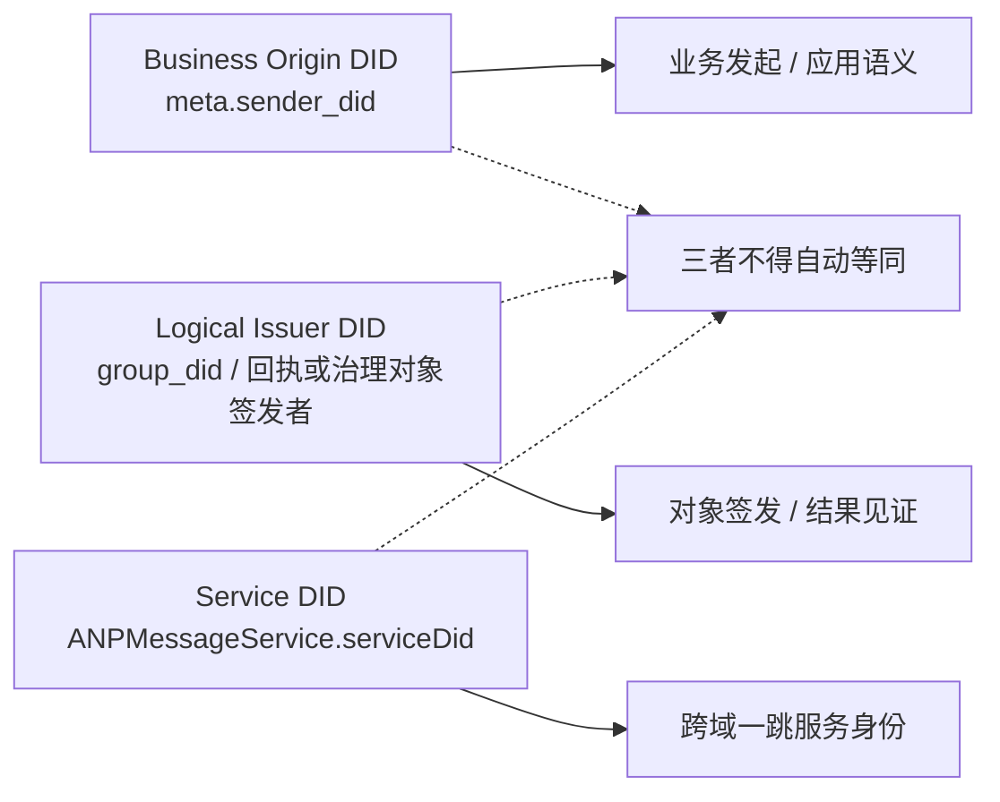
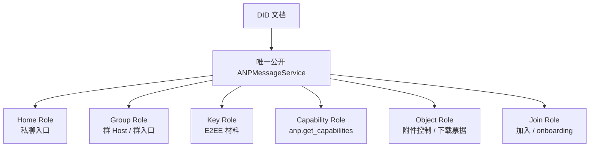
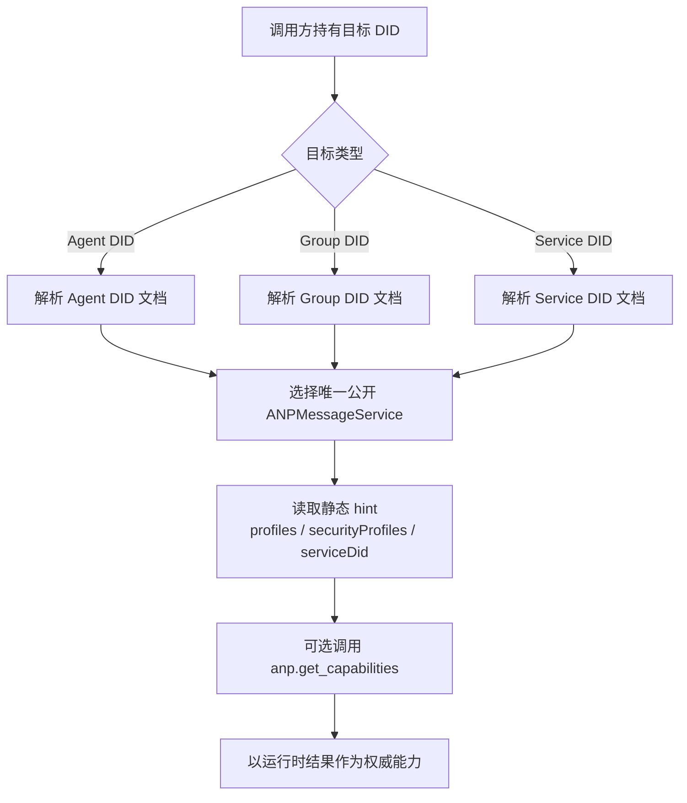

# ANP Profile 2：身份与发现

- 文档编号：ANP-P2-vNext
- 标题：身份与发现
- 状态：草案
- 规范集版本：ANP Messaging 1.2 草案
- 语言：中文
- Profile：`anp.identity.discovery.v1`
- 依赖：`anp.core.binding.v1`
- 适用范围：本 Profile 适用于 ANP 中 Agent 身份、Group 身份、服务发现与服务端点解释。

---

## 1. 目的

本 Profile 定义 ANP 的标识模型与发现模型，规定：

1. Agent 与 Group 如何使用 DID 表示；
2. DID 文档中哪些属性对 ANP 有规范性意义；
3. ANP 服务端点如何在 DID 文档中表达；
4. 调用方如何根据 DID 文档发现可交互的 ANP 服务；
5. 哪些动态状态不得放入 DID 文档；
6. 设备定址 E2EE Profile 如何在不改变 DID 级业务定址的前提下，发现最小密码学端点信息。

本 Profile 不定义：

- DID 方法本身；
- DID 解析协议本身；
- 硬件或设备身份、面向产品的设备名称、设备注册流程；
- 内部副本同步；
- 具体 E2EE 算法细节；
- 具体群状态机细节。

---

## 2. 术语与规范性约定

### 2.1 规范性关键字

本文中的 **MUST**、**MUST NOT**、**REQUIRED**、**SHALL**、**SHALL NOT**、**SHOULD**、**SHOULD NOT**、**RECOMMENDED**、**NOT RECOMMENDED**、**MAY**、**OPTIONAL** 按照其大写形式解释为规范性要求。

### 2.2 术语

- **Agent DID**：表示一个 Agent 协议主体的 DID。
- **Group DID**：表示一个群协议主体的 DID。
- **Controller**：能够更新 DID 文档或代表 DID 发起受控动作的实体。
- **ANPMessageService**：DID 文档对外公开的统一 ANP 服务入口。
- **联邦服务 DID**：部署方在跨域服务到服务 HTTP 身份认证中使用的服务 DID，通常由 `ANPMessageService.serviceDid` 声明。
- **Discovery**：根据一个 DID 解析其 DID 文档，并选择适当服务端点以完成后续交互的过程。
- **Device Endpoint（设备端点）**：Agent DID 下的密码学端点，仅为设备定址 E2EE Profile 通过不透明 `device_id` 标识。它不是 DID，也不是业务参与方。
- **Device Manifest（设备清单）**：Agent DID 文档中的可选 `deviceManifest` 结构。只有该 DID 宣告设备定址 E2EE Profile 时，它才成为必需结构。
- **Eligible Device（合格设备）**：其密钥引用与所声明 Profile 集在使用时满足所属 E2EE Profile 的 Device Manifest 条目。

---

## 3. 标识模型

### 3.1 基本原则

ANP 采用以下一等标识：

- **Agent DID**
- **Group DID**

ANP 协议层 **不**定义设备 DID、终端 DID、会话 DID 或副本 DID。业务定址、联系人、成员关系、授权角色与普通消息投递仍归属于 Agent DID 或 Group DID。

设备定址 E2EE Profile **MAY** 通过不透明 `device_id` 选择 Agent DID 下的密码学 Device Endpoint。该 selector 不是一等身份、成员或 `target.kind`，Base Profile **MUST NOT** 要求或携带它。多个运行副本与普通非 E2EE 设备 fan-out 仍属于实现内部。

### 3.2 Agent DID

每个能够作为 ANP 协议主体发送或接收消息的 Agent **MUST** 持有一个 `agent_did`。

`agent_did` 用于：

1. 标识直接消息的发送方与接收方；
2. 标识控制操作的发起方；
3. 解析可用服务端点；
4. 获取安全 Overlay 需要的公开材料；
5. 建立授权与审计上下文。

### 3.3 Group DID

每个可被跨域发现、被引用、被管理或被发送群消息的群 **MUST** 持有一个 `group_did`。

`group_did` 用于：

1. 作为群的全局应用层标识；
2. 作为群发现与治理的锚点；
3. 作为群管理与群消息的共同目标标识；
4. 作为群服务端点的发现入口；
5. 作为后续群加密 Profile 的绑定对象。

### 3.4 加密标识分离

若后续某安全 Overlay Profile 定义独立的密码学内部标识，例如 `crypto_group_id`、`session_id`、`channel_id`，则：

- 它们 **MAY** 与 `group_did` 或 `agent_did` 不同；
- 但对应 Profile **MUST** 明确规定如何将这些内部标识与 DID 进行密码学绑定；
- 这种绑定 **MUST** 可由接收方验证。

### 3.5 ANP 身份分层

为避免跨文档把不同层次的身份混用，ANP 中至少区分以下三类 DID：

1. **Business Origin DID**：业务发起者或业务逻辑发送主体，例如请求中的 `meta.sender_did`；
2. **Logical Issuer DID**：某些通知、回执或治理对象在逻辑上所代表的签发主体，例如 `group_did`；
3. **Service DID**：执行 hop-level 服务到服务调用时所使用的服务身份，即 `ANPMessageService.serviceDid`。

上述三类身份：

- **MUST NOT** 被自动视为同一个主体；
- **MUST** 由对应 Profile 明确说明谁负责签名、谁负责授权、谁负责路由；
- 在跨域场景中，`serviceDid` **MUST NOT** 替代业务主体 DID；
- `serviceDid` 只表示“哪个公开服务入口在执行一跳服务调用”，**MUST NOT** 被直接拿来参与群内 `owner/admin/member` 等业务角色判定。

---


ANP 中最容易被误读的地方之一，是把业务发送者、对象签发者和一跳服务身份混为一谈。下图把这三层 DID 放在同一视图中，以便后续各 Profile 分别引用。



*图 P2-1：ANP 身份分层关系（非规范性）。*

后续文档若要求签名、授权或路由，应明确指出自己使用的是哪一层 DID，而不是默认读者会自动把三者视为同一主体。
## 4. DID 文档的 ANP 解释规则

### 4.1 一般规则

对于 ANP 而言，DID 文档承担以下职责：

1. 提供稳定身份入口；
2. 声明验证关系与受信任密钥材料；
3. 暴露服务端点；
4. 提供服务发现线索；
5. 宣告设备定址 E2EE Profile 时，发布验证其密码学端点所需的最小当前 Device Manifest。

DID 文档 **MUST NOT** 被当作：

- 实时消息状态数据库；
- 群成员实时存储；
- 在线状态存储；
- 高频密钥轮换日志；
- Agent 内部副本列表。

### 4.2 DID 文档最小要求

对于被 ANP 使用的 DID 文档：

- `id` **MUST** 存在；
- 对于会被主动发现并交互的 DID，`service` **MUST** 存在；
- 对于仅用于验证或引用的 DID，`service` **MAY** 缺省；
- 对于会作为业务发起者 DID 出现在请求中的 DID，`authentication` **MUST** 存在；
- 若支持声明式签名对象，`assertionMethod` **SHOULD** 存在；
- 若支持加密 Overlay，`keyAgreement` **SHOULD** 存在；
- `capabilityInvocation` 属于可选扩展能力，**MAY** 存在，但不属于 v1 最小互通要求。
- 若 Agent DID 宣告设备定址 E2EE Profile，`deviceManifest` **MUST** 存在并满足 5.5 节；仅支持 Base Profile 的 DID 不要求该结构。

### 4.3 DID 文档最小化原则

DID 文档中的信息 **SHOULD** 保持：

- 低频变更；
- 低敏感度；
- 低可关联性；
- 与 DID 使用直接相关。

凡不满足上述要求的内容，**SHOULD** 转移到受控服务端点提供，而不是直接嵌入 DID 文档。

---

## 5. Agent DID 规范

### 5.1 Agent DID 文档必需语义

一个用于 ANP 的 Agent DID 文档 **MUST** 至少表达：

1. `id`
2. 至少一个可用于后续交互的 `service`

### 5.2 认证关系

若 Agent DID 会作为业务发起者身份出现在 `meta.sender_did`，或出现在任何声明使用 `anp-rfc9421-origin-proof-v1` 的业务 proof 的 `keyid` 验证链路中，则 DID 文档 **MUST** 提供 `authentication` 关系。

若某请求使用 `auth.origin_proof`，则验证方 **MUST** 检查 `keyid` 指向的验证方法是否被该 DID 文档的 `authentication` 关系授权。

若 Agent DID 仅用于被动引用、对象归属或离线验证上下文，而不会作为请求发起者参与 ANP 交互，则 `authentication` **MAY** 缺省。

若 Agent 需要对群管理对象、声明对象、签名控制对象进行断言，则 DID 文档 **SHOULD** 提供 `assertionMethod` 关系。

### 5.3 密钥协商关系

若 Agent 支持任何 E2EE Overlay，则 DID 文档 **SHOULD** 提供 `keyAgreement` 关系。  
供 `keyAgreement` 使用的验证方法 **MUST** 仅用于表示该 DID 在密钥协商或接收机密信息时可被使用的公钥材料。

### 5.4 服务端点

凡支持接收 Direct、Capability、Object 控制面或其它需要主动发现的 ANP 能力的 Agent DID 文档，**MUST** 至少包含一个 `ANPMessageService`。

该统一服务入口 **MAY** 同时承载以下能力：

- 直接消息主入口；
- 能力协商；
- 安全 Overlay 公开材料访问；
- 对象控制面与对象下载入口发现。

若部署方在内部将这些能力拆分为多个组件，这种拆分属于实现细节；DID 文档 **SHOULD NOT** 为这些能力分别暴露多个独立的 ANP 服务类型。

对外公开的附件控制面方法 **MUST** 仍通过 DID 文档中公开的统一 `ANPMessageService` 进入。部署方在内部是否再把请求路由到独立 Object Service、Key Service 或 Group Host 子组件，属于实现细节，不改变对外的标准服务发现模型。

### 5.5 面向设备定址 E2EE Profile 的 Device Manifest

`deviceManifest` 是 Agent DID 文档的顶层扩展，仅供 Direct E2EE、Group E2EE 等定址密码学设备端点的安全 Profile 使用。它不会把 Agent DID 变成多个业务身份的集合，普通 Base 消息也不使用它。

标准结构如下：

```json
{
  "deviceManifest": {
    "type": "ANPDeviceManifest",
    "devices": [
      {
        "device_id": "dev-a-7N3KQ2",
        "signing_key_id": "did:example:agent-a#dev-a-sign",
        "e2ee_key_id": "did:example:agent-a#dev-a-e2ee",
        "profiles": [
          "anp.core.binding.v1",
          "anp.identity.discovery.v1",
          "anp.direct.base.v1",
          "anp.direct.e2ee.v2"
        ]
      }
    ]
  }
}
```

适用以下规则：

1. 宣告或调用设备定址 E2EE Profile 的 Agent DID **MUST** 发布当前 `deviceManifest`；仅支持 Base Profile 的 Agent DID **MAY** 省略它。
2. `deviceManifest.type` **MUST** 等于 `ANPDeviceManifest`，`devices` **MUST** 为数组。每个标准设备条目 **MUST** 且只能包含 `device_id`、`signing_key_id`、`e2ee_key_id` 与 `profiles`。
3. `device_id` **MUST** 是不透明字符串，在当前 Agent DID Manifest 内唯一，移除后 **MUST NOT** 重用。它不是 DID、硬件序列号、显示名称或角色。
4. `signing_key_id` 与 `e2ee_key_id` **MUST** 是引用同一 Agent DID 文档中验证方法的 DID URL。`signing_key_id` **MUST** 由所属 E2EE Profile 所要求的验证关系授权：使用 Origin Proof 时为 `authentication`，使用 Object Proof 时为 `assertionMethod`。`e2ee_key_id` **MUST** 由 `keyAgreement` 授权。
5. `profiles` **MUST** 是非空字符串数组，包含该设备所支持的完整依赖集。因此 P5 条目包含 P1、P2、P3 与 P5，P6 条目包含 P1、P2、P4 与 P6。把 Base Profile 列为依赖不会使 Base 操作变成设备定址。
6. P3 Direct Base、P4 Group Base、P7 普通 Attachment 及其它非 E2EE 流程 **MUST NOT** 查阅 Manifest 来要求 selector、公开逐设备结果或改变 DID 级投递语义。
7. 移除设备意味着发布不再包含该条目及其活动设备密钥引用的更新 DID 文档。后续选择该设备的设备定址操作 **MUST** 被拒绝。重新注册必须使用新的 `device_id` 与新密钥。
8. Manifest 作为 DID 文档的一部分，按其 DID 方法受到保护并更新。本 Profile 不定义独立 Manifest endpoint、proof、epoch、hash、checkpoint 或 compare-and-swap 协议。
9. Manifest **MUST NOT** 包含私钥、产品域内角色或 token、可读设备名称、硬件标识、在线状态、恢复状态或内部副本拓扑。

---

## 6. Group DID 规范

### 6.1 Group DID 文档必需语义

一个用于 ANP 的 Group DID 文档 **MUST** 至少表达：

1. `id`
2. `controller`
3. 至少一个群服务端点（`ANPMessageService`）

### 6.2 群控制权

`controller` 可为单个 DID，也可为多个 DID。  
若存在多个控制者，它们之间的内部协作机制不由本 Profile 定义，但：

- DID 文档更新的合法性 **MUST** 由 DID 方法保证；
- 调用方 **MUST** 以解析所得 DID 文档为准；
- 群治理 Profile **MUST** 进一步定义群内角色与授权规则。

### 6.3 群治理验证关系

对支持 `anp.group.base.v2` 的 Group DID 文档：

- `assertionMethod` **MUST** 存在；
- `capabilityInvocation` **MAY** 作为额外治理能力委托关系存在，但不替代 `assertionMethod`。

当群管理对象、群策略对象、群状态对象需要被签名验证时，验证方 **MUST** 使用 DID 文档允许的验证关系。

### 6.4 Group DID 文档禁止内容

以下内容 **MUST NOT** 直接嵌入 Group DID 文档：

- 动态成员列表；
- 在线成员列表；
- 当前消息序号；
- 当前群 epoch；
- 逐消息状态；
- 一次性预密钥列表；
- MLS KeyPackage 实时集合；
- 高频变化的邀请 / 入群治理队列；
- Agent 内部副本列表。

### 6.5 Group DID 文档可选内容

以下内容 **MAY** 存在，但必须避免敏感泄露：

- 群显示名称；
- 群图标引用；
- 群公开描述；
- 群公开策略摘要；
- 文档版本信息；
- 服务能力摘要。

如果某可选字段可能带来明显隐私泄露或相关性风险，实现方 **SHOULD NOT** 将其写入 DID 文档，而应改由受限服务端点提供。

---

## 7. ANP 服务端点类型

### 7.1 总则

ANP 基于 DID 文档中的 `service` 进行服务发现。  
所有 ANP 服务端点对象 **MUST** 具有：

- `id`
- `type`
- `serviceEndpoint`

服务端点对象 **MAY** 携带少量静态 hint，但 v1 标准互通只要求：

- `profiles`
- `securityProfiles`
- `serviceDid`

当前版本中，DID 文档对外公开的 ANP 标准服务类型 **SHOULD** 仅使用 `ANPMessageService`。  
实现方若在内部将私聊、群、密钥、对象或跨域转发能力拆分为多个组件，这种拆分属于实现细节，而不是 DID 文档中的多个独立标准 `service type`。

为降低跨域调用时的服务选择歧义，每个 DID 文档 **MUST** 只暴露一个可跨域调用的 `ANPMessageService`。  
若实现内部确有多个服务组件，它们 **MUST** 被收敛到同一个对外公开的可跨域 `ANPMessageService` 之下。

### 7.2 `ANPMessageService`

#### 7.2.1 语义

`ANPMessageService` 表示 ANP 在 DID 文档中公开发现的统一消息与交互入口。

#### 7.2.2 用途

- 接收 `direct.send`
- 接收 `group.get_info`、`group.send`、`group.e2ee.send` 以及群管理 / 群 E2EE 相关动作
- 提供 `anp.get_capabilities`
- 提供 Direct / Group E2EE 所需公开材料访问
- 承载 `group.e2ee.notice` 的接收或分发（若部署支持群 E2EE）
- 提供 `attachment.create_slot`、`attachment.commit_object`、`attachment.abort_object`、`attachment.get_download_ticket`
- 作为对象 HTTP(S) 下载入口发现的服务锚点（若部署支持）

对外公开的附件控制面方法 **MUST** 仍通过该 DID 暴露的统一 `ANPMessageService` 进入。部署方在内部是否再把请求路由到独立 Object Service、Key Service 或 Group Host 子组件，属于实现细节，不改变对外的标准服务发现模型。

#### 7.2.3 要求

- 一个可被主动发现并交互的 Agent DID 文档 **MUST** 至少包含一个 `ANPMessageService`
- 一个 Group DID 文档 **MUST** 至少包含一个 `ANPMessageService`
- 若该 `ANPMessageService` 会参与跨域服务到服务调用，则其服务条目 **MUST** 声明 `serviceDid`
- 若实现内部存在多组件，DID 文档 **MUST** 只暴露一个统一入口，并通过运行时能力协商返回更细粒度能力边界
- 对外公开的 service-scoped 方法，包括密钥材料方法与附件控制面方法，**MUST** 以该统一入口的 `serviceDid` 作为目标服务身份锚点，除非对应 Profile 明确声明为 endpoint-local


为了降低跨域服务选择歧义，v1 只鼓励对外暴露一个统一的 `ANPMessageService`。下图把这个统一入口与常见内部逻辑角色之间的关系放在一起，帮助读者区分“公开服务类型”和“实现内部分工”。



*图 P2-2：统一 ANPMessageService 与内部角色关系（非规范性）。*

本图中的角色只是实现内部的能力边界示意，不构成新的 DID `service type`，也不应被拿来替代标准化的服务发现字段。
### 7.3 `ANPMessageService` 的逻辑角色

本节仅用于**非规范性说明**统一入口背后的常见能力边界；它们不是 DID 文档中的独立标准 service type，也不是 v1 的服务选择字段。

#### 7.3.1 Home Role

Home Role 表示 Agent 侧的主入口能力，用于接收 `direct.send`、返回能力信息并指示进一步的交互路径。

#### 7.3.2 Key Role

Key Role 表示安全 Overlay 所需公开材料的发布或发现能力，用于：

- 发现直接消息 E2EE 所需公开材料
- 发现群 E2EE 所需的引导材料
- 发现后续安全 Profile 定义的公开对象

#### 7.3.3 Group Role

Group Role 表示群的主入口或 Host 能力，用于：

- 处理 `group.create` 之后的群管理动作
- 接收 `group.send` 与 `group.e2ee.send`
- 暴露群策略、群 E2EE 能力或相关控制入口
- 作为群状态变化排序的权威入口

#### 7.3.4 Join Role

Join Role 表示加入与邀请相关的入口能力。

#### 7.3.5 Capability Role

Capability Role 表示能力协商入口能力。

#### 7.3.6 Object Role

Object Role 表示对象上传、对象访问控制、下载票据签发以及对象下载入口发现的能力。

#### 7.3.7 跨域转发功能

部署方 **MAY** 在 `ANPMessageService` 背后实现跨域转发或域网关功能，但当前版本 **不**为该功能定义独立的 DID service type。

若部署方启用跨域服务到服务调用，则该域网关或域服务在执行外层 HTTP 身份认证时，**SHOULD** 使用域名所有者保留的联邦服务 DID，而不是普通 Agent DID 或 Group DID。对应规则由 P8 定义。

#### 7.3.8 透明目录与审计索引

若部署方支持目录透明性、透明日志或审计索引，则 **MAY** 将其作为 `ANPMessageService` 的扩展能力提供；当前版本不单独定义独立的 DID service type。

---

## 8. ANP 服务端点扩展字段

为了便于跨实现发现，本 Profile 只把少量字段作为 v1 静态 hint；其余能力信息 **SHOULD** 下沉到 `anp.get_capabilities`。

### 8.1 `profiles`

- 类型：字符串数组
- 语义：服务端点直接支持的 ANP Profile 集合
- 要求：**SHOULD**
- 说明：该字段仅表达静态、可缓存的粗粒度 hint，不替代运行时能力协商。

### 8.2 `securityProfiles`

- 类型：字符串数组
- 语义：服务端点支持的安全模式集合
- 要求：**SHOULD**
- 说明：该字段表示端点级支持范围，不保证所有方法在所有安全模式下都可用。

### 8.3 `acceptedContentTypes`

- 类型：字符串数组
- 语义：服务端点可接受的消息内容类型集合
- 要求：**不作为 v1 标准 DID hint**
- 说明：
  - 若需要暴露此类信息，**SHOULD** 通过 `anp.get_capabilities` 返回；
  - DID 文档中若出现该字段，接收方 **MAY** 将其视为实现扩展。

### 8.4 `acceptedObjectTypes`

- 类型：字符串数组
- 语义：服务端点可接受的控制面对象类型集合
- 要求：**不作为 v1 标准 DID hint**
- 说明：建议作为运行时能力返回，而不是静态写入 DID 文档。

### 8.5 `priority`

- 类型：整数
- 语义：端点优先级
- 要求：**不作为 v1 标准 DID hint**
- 说明：
  - v1 规范不依赖 DID 文档中的 `priority` 做服务选择；
  - 若部署自定义了该字段，应视为私有扩展。

### 8.6 `authSchemes`

- 类型：字符串数组
- 语义：该端点支持的 caller → service 调用方认证方式
- 要求：**不作为 v1 标准 DID hint**
- 说明：
  - 该能力通常会随运行时网关配置变化；
  - 更适合通过 `anp.get_capabilities` 暴露；
  - 它也 **不** 描述业务层 `anp-rfc9421-origin-proof-v1` 的 proof 承载格式。

### 8.7 `serviceDid`

- 类型：字符串
- 语义：该 `ANPMessageService` 在跨域服务到服务 HTTP 身份认证中使用的 DID
- 要求：若该端点参与跨域服务到服务调用，则 **MUST**

规则：

1. `serviceDid` **MUST** 是 DID 字符串，而不是 DID URL；
2. 外层 HTTP Message Signatures 的 `keyid` **MUST** 指向该 `serviceDid` 文档中某个被 `authentication` 关系授权的验证方法；
3. 对于 `did:web` 与 `did:wba` 部署，`serviceDid` **SHOULD** 优先使用裸域名 DID；
4. `serviceDid` 表达的是“哪个服务身份在执行跨域调用”，而不是 `meta.sender_did` 所表达的业务主体身份；
5. `serviceDid` 的具体运行时校验流程由 P8 定义；
6. DID 文档中的 `serviceDid` 是发现 hint，真正的信任建立以 P8 运行时校验成功为准；
7. 对 service-scoped 方法，调用方 **SHOULD** 把 `meta.target.did` 绑定到目标公开 `ANPMessageService.serviceDid`；对象控制面、密钥材料方法与群加入材料方法均遵循这一原则，除非具体 Profile 明确声明为 endpoint-local。

---

## 9. 发现流程


本章后续各节分别描述了 Agent、Group 与 `serviceDid` 的发现细节。下图先给出统一总览，帮助读者看到三条路径最终都会收敛到公开 `ANPMessageService` 与运行时能力协商。



*图 P2-3：Agent / Group / Service 的统一发现流程（非规范性）。*

阅读后面的 9.1、9.2 与 9.3 时，可以把它们理解为这张统一发现图在三类目标上的具体化，而不是三套彼此独立的发现哲学。
### 9.1 Agent 发现

对 `agent_did` 的发现流程如下：

1. 解析 `agent_did`，获得 DID 文档；
2. 读取 `service` 列表；
3. 选择唯一的跨域 `ANPMessageService`；
4. 若后续涉及跨域服务到服务调用，读取该服务条目的 `serviceDid`；
5. 结合 `profiles`、`securityProfiles`、运行时能力协商结果与本地策略，确定该统一入口上可用的具体能力；
6. 对普通 Base 操作，直接使用 Agent DID 与所选服务；不要求 `deviceManifest`、不选择设备，也不合成默认设备；
7. 对设备定址 E2EE 操作，解析当前 `deviceManifest`，并仅按所属 E2EE Profile 选择 Eligible Device；
8. 如需显式协商能力，调用同一入口上的 `anp.get_capabilities`。

### 9.2 Group 发现

对 `group_did` 的发现流程如下：

1. 解析 `group_did`，获得 DID 文档；
2. 读取唯一的 `ANPMessageService`；
3. 若后续涉及跨域服务到服务调用，读取该服务条目的 `serviceDid`；
4. 结合 `profiles`、`securityProfiles`、运行时能力协商结果与本地策略，确定该统一入口上可用的群管理、群消息、加入或群 E2EE 相关能力；
5. 若启用群 E2EE，则通过同一入口发现与该群加密 Profile 绑定的群端公开材料、密码学结果交付能力以及相关控制动作；成员侧加入材料仍按对应 Agent DID 的统一入口发现。

### 9.3 Service DID 发现

当调用方已知某个 service-scoped 方法的目标 `serviceDid` 时，发现流程如下：

1. 解析 `serviceDid` 对应的 DID 文档；
2. 选择与该 `serviceDid` 对应的 `ANPMessageService`；
3. 读取其 `serviceEndpoint` 与静态 hint；
4. 如需精确能力边界，调用同一入口上的 `anp.get_capabilities`；
5. 仅在通过 P8 规定的运行时服务身份绑定校验后，方可将该 `serviceDid` 视为可信跨域服务身份。

对于附件下载票据获取，调用方 **MUST** 以承载该附件清单的原始消息发送者 DID 作为发现锚点，解析其公开 `ANPMessageService`；在群场景中，该 DID 取自原始群消息发送者，而不是 `group_did`。调用方 **MUST NOT** 仅凭 `object_uri` 的 URL 域名反推控制面服务。


### 9.4 服务选择

若存在多个候选端点，调用方 **MUST** 先按下列顺序选择：

1. 先按所请求 `profile` 过滤；
2. 再按所请求 `security_profile` 过滤；
3. 然后以运行时能力协商结果作为权威校验；
4. 若仍有多个结果，按本地策略选择。

v1 规范 **不**依赖 DID 文档中的 `supportedMethods`、`logicalRoles` 或 `priority` 做标准服务选择。

### 9.5 缓存

调用方 **MAY** 缓存 DID 解析结果与服务选择结果。  
但在以下情形下 **SHOULD** 重新解析：

- 签名验证失败；
- 密钥协商失败；
- 服务端点返回能力变更；
- DID 控制权疑似变更；
- `serviceDid` 校验失败；
- endpoint-origin 绑定失败；
- 静态 hint 与运行时能力结果冲突；
- 本地缓存到期。

---

## 10. DID 文档与安全 Overlay 的关系

### 10.1 `keyAgreement` 的使用

若某 Agent DID 或 Group DID 文档声明了 `keyAgreement`，则后续安全 Profile **MUST** 仅使用其中允许的方法作为该 DID 的机密信息接收或密钥协商依据。

### 10.2 签名验证关系

当某对象声称由某 DID 断言时：

其中，对使用 `auth.origin_proof` 的请求，验证方 **MUST** 把它视为认证控制行为，并检查 `authentication`。

- 若对象是认证控制行为，验证方 **SHOULD** 检查 `authentication`；
- 若对象是声明或签名断言行为，验证方 **SHOULD** 检查 `assertionMethod`；
- 若对象是治理能力调用行为，验证方 **MAY** 检查 `capabilityInvocation`，但这不是 v1 最小互通要求。

### 10.2.1 设备安全绑定

在使用设备 selector 或设备公钥前，设备定址 E2EE Profile **MUST** 依据当前 Agent DID `deviceManifest` 验证所选条目。该条目 **MUST** 声明所请求 E2EE Profile 及其依赖，且其密钥引用 **MUST** 与该操作实际使用的密钥匹配。

若操作同时使用 `auth.origin_proof` 与 `meta.sender_device_id`，proof `keyid` **MUST** 等于该条目的 `signing_key_id`。若操作为 E2EE 使用 `meta.recipient_device_id`，加密或会话建立密钥 **MUST** 为所选条目的 `e2ee_key_id`。具体认证上下文与拒绝时点由所属 P5/P6 类 E2EE Profile 定义。

这些检查不适用于普通 Base 操作，因为普通 Base 既不携带 selector，也不选择设备密钥。

### 10.3 动态安全材料外置

以下内容 **SHOULD** 通过受控服务端点提供，而非内嵌于 DID 文档：

- 高频轮换公开材料；
- 一次性引导材料；
- 群 epoch 相关材料；
- 动态群状态摘要。

---

## 11. Group DID 与群治理

### 11.1 Group DID 的角色

`group_did` 是群的应用层全球标识，不等于任何特定密码学实现内部 ID。

### 11.2 群治理外置

群成员关系、角色授权、邀请状态、成员状态、策略版本、群状态摘要等对象，**SHOULD** 由：

- 群对应的 `ANPMessageService`
- 或未来群治理 Profile

提供与签名，而不是放在 DID 文档中。

### 11.3 控制权与群策略分离

DID 文档中的 `controller` 只表示谁有权控制 DID 文档本身；  
群内“谁能加人、踢人、改策略”属于应用层治理规则，不应直接从 `controller` 机械推导。  
同理，`serviceDid` 只表示服务调用身份，不应被直接解释成群内 `owner/admin/member` 之类的业务角色主体。

---

## 12. Agent DID 迁移验证

### 12.1 方法特定的迁移 Profile

P2 定义 Agent DID 迁移的通用调用语义，具体 proof 规则仍由适用的 DID 方法规范负责。实现 **SHOULD** 提供等价于下列形式的内部操作：

```text
resolve_current_agent_did(input_did, trusted_cache)
  -> { requested_did, current_did, transition_status, assurance }
  | error
```

该结果只供实现内部使用，**MUST NOT** 向 ANP Messaging wire object 增加 `stable_subject_id`、稳定主体路径或其它身份字段。

### 12.2 `e1_` 路径型 did:wba 迁移

本草案首个注册的自动迁移路径，是最后一段采用 `e1_` 指纹 Profile 的路径型 did:wba DID。解析器从此前可信的 DID 出发，**MUST**：

1. 获取每一跳 DID Document，并验证其 `id` 等于请求 DID；
2. 验证 `e1_` 绑定指纹、活动文档 proof 及适用的 did:wba proof 规则；
3. 文档停用时要求存在 `successorDid`，并验证旧文档的迁移 proof；
4. 要求旧 DID 与后继 DID 的稳定主体路径相同；
5. 获取并验证直接后继 DID Document，包括其绑定指纹和文档 proof；
6. 逐跳继续，直到最终活动 DID；
7. 拒绝循环、冲突后继和可信缓存冲突。

验证方 **MUST NOT** 从一个不可信的新 DID 反向开始，也不能仅因其路径类似现有身份就推导连续性。

### 12.3 Continuity assurance

迁移结果 **MUST** 保留其真实 assurance：

- `verified`：旧 DID 绑定根密钥签署停用和后继关系；
- `recovery_verified`：此前可信旧文档中预授权的恢复密钥建立迁移；
- `provider_asserted`：没有旧 binding key 或预授权 recovery key proof，但已认证的同源 HTTPS 解析验证了完整直接后继链并到达 proof 有效的 active DID，或身份 Provider 通过独立认证的 recovery/transition 权威通道提供 predecessor→successor 事实。孤立的 `successorDid`、Handle/WNS 映射、standalone 无签名 hop 或 409 hint 本身不满足该等级；
- `unverified`：不存在可接受的连续性证据。

迁移 resolver 只有在已认证完整链解析成功后才报告 `provider_asserted`；独立认证的 Provider 权威通道由所属业务系统判断。两种来源都不会把结果提升为 binding key 或 recovery key 的密码学连续性。由所属业务系统决定该结果可以继承哪些关系与授权。

所属业务 Profile **MUST NOT** 把 `provider_asserted` 当成 `verified` 或 `recovery_verified`，也 **MUST NOT** 仅因 assurance 为 `provider_asserted` 就强制失败；由所属业务系统决定该 assurance 是否足够，以及继承哪些业务关系或授权。`unverified` 不能建立迁移连续性。

### 12.4 Hint 与不受支持的迁移 Profile

`alsoKnownAs` 和相同稳定主体路径 **MAY** 用于发现候选，但两者都不能独立授权迁移、角色、成员关系、ACL、附件授权或 E2EE 资格。

对裸域名 did:wba DID、`k1_` DID、历史无绑定指纹路径、`did:web` 及其它没有注册 ANP 迁移验证 Profile 的 DID 方法：

- 活动且可验证的 DID 继续按原完整 DID 使用；
- 实现 **MUST NOT** 仅凭名称、路径或 `alsoKnownAs` 推导跨 DID 连续性；
- DID 停用时 **MUST** fail closed，并返回 `anp.did_transition_invalid` 与 `reason = transition_profile_not_supported`。

### 12.5 Group DID 边界

本草案不定义 Group DID 自动迁移。精确 `group_did` 停用后，Group Host **MUST** 拒绝新的群操作及 P6 应用消息处理，且 **MUST NOT** 自动跟随 Group DID 后继。历史回执和签名仍按历史 Group DID 验证。

---

## 13. 隐私与最小披露

### 13.1 服务端点最小化

DID 文档中的 `service` 项 **SHOULD** 最小化。  
若某服务不需要公开发现，则 **SHOULD NOT** 出现在 DID 文档中。

### 13.2 相关性控制

实现方 **SHOULD** 避免：

- 在多个 DID 文档中复用会产生强相关性的独特端点模式；
- 在 DID 文档中放置可直接推断组织结构、部署拓扑、内部角色分布的描述；
- 通过 DID 文档暴露消息量、活跃度、在线状态或内部副本结构。

### 13.3 公开与受限分离

公开发现所必需的信息 **MAY** 放入 DID 文档；  
需要访问控制的信息 **SHOULD** 由受限服务端点返回。

### 13.4 Device Manifest 最小化

设备定址 E2EE Profile 要求 Manifest 时，其公开内容 **MUST** 限于 5.5 节的四个设备条目字段。实现应使用不面向用户的不透明 `device_id`，并把设备标签、硬件详情、在线状态、本地策略与恢复数据留在 DID 文档之外。

---

## 14. 最小互通要求

一个符合本 Profile 的实现至少 **MUST** 满足：

1. 每个 Agent 有 `agent_did`；
2. 每个 Group 有 `group_did`；
3. Agent DID 与 Group DID 文档至少提供一个 `ANPMessageService`；
4. 支持根据 DID 文档执行服务发现；
5. 静态 hint 最少支持 `profiles`、`securityProfiles`、`serviceDid`；
6. 运行时能力以 `anp.get_capabilities` 为权威；
7. 不在 DID 文档中嵌入动态群状态；
8. 保持普通 Base 发现与投递为 DID 级，不携带设备 selector，也不要求 Manifest；
9. 宣告设备定址 E2EE Profile 时，发布并验证 5.5 节定义的最小 `deviceManifest`；
10. 不引入 Device DID、设备业务成员关系或产品内部副本语义。
11. 对已注册的 Agent DID 迁移返回真实 assurance，且不增加第二套 wire identity；
12. 声明支持第 12 节 `e1_` did:wba 迁移 Profile 时，实现其验证规则；
13. 保持 `alsoKnownAs` 仅用于候选发现，并对没有注册迁移 Profile 的停用 DID fail closed；
14. 不自动迁移 Group DID。

---

## 15. 示例

### 15.1 Agent DID 文档片段示例

以下片段展示一个 Agent DID 具有两个用于 Direct E2EE 的密码学 Device Endpoint。这两个条目不会创建两个 Agent，服务所列普通 Base Profile 仍保持 DID 定址。

```json
{
  "id": "did:example:agent-a",
  "verificationMethod": [
    {
      "id": "did:example:agent-a#dev-a-sign",
      "type": "JsonWebKey2020",
      "controller": "did:example:agent-a",
      "publicKeyJwk": {
        "kty": "OKP",
        "crv": "Ed25519",
        "x": "..."
      }
    },
    {
      "id": "did:example:agent-a#dev-a-e2ee",
      "type": "JsonWebKey2020",
      "controller": "did:example:agent-a",
      "publicKeyJwk": {
        "kty": "OKP",
        "crv": "X25519",
        "x": "..."
      }
    },
    {
      "id": "did:example:agent-a#dev-a2-sign",
      "type": "JsonWebKey2020",
      "controller": "did:example:agent-a",
      "publicKeyJwk": {
        "kty": "OKP",
        "crv": "Ed25519",
        "x": "..."
      }
    },
    {
      "id": "did:example:agent-a#dev-a2-e2ee",
      "type": "JsonWebKey2020",
      "controller": "did:example:agent-a",
      "publicKeyJwk": {
        "kty": "OKP",
        "crv": "X25519",
        "x": "..."
      }
    }
  ],
  "authentication": [
    "did:example:agent-a#dev-a-sign",
    "did:example:agent-a#dev-a2-sign"
  ],
  "assertionMethod": [
    "did:example:agent-a#dev-a-sign",
    "did:example:agent-a#dev-a2-sign"
  ],
  "keyAgreement": [
    "did:example:agent-a#dev-a-e2ee",
    "did:example:agent-a#dev-a2-e2ee"
  ],
  "service": [
    {
      "id": "did:example:agent-a#message",
      "type": "ANPMessageService",
      "serviceEndpoint": "https://agent-a.example.com/anp",
      "serviceDid": "did:example:domain-a",
      "profiles": [
        "anp.core.binding.v1",
        "anp.identity.discovery.v1",
        "anp.direct.base.v1",
        "anp.direct.e2ee.v2",
        "anp.attachment.v1"
      ],
      "securityProfiles": [
        "transport-protected",
        "direct-e2ee"
      ]
    }
  ],
  "deviceManifest": {
    "type": "ANPDeviceManifest",
    "devices": [
      {
        "device_id": "dev-a-7N3KQ2",
        "signing_key_id": "did:example:agent-a#dev-a-sign",
        "e2ee_key_id": "did:example:agent-a#dev-a-e2ee",
        "profiles": [
          "anp.core.binding.v1",
          "anp.identity.discovery.v1",
          "anp.direct.base.v1",
          "anp.direct.e2ee.v2"
        ]
      },
      {
        "device_id": "dev-a2-9R5TLM",
        "signing_key_id": "did:example:agent-a#dev-a2-sign",
        "e2ee_key_id": "did:example:agent-a#dev-a2-e2ee",
        "profiles": [
          "anp.core.binding.v1",
          "anp.identity.discovery.v1",
          "anp.direct.base.v1",
          "anp.direct.e2ee.v2"
        ]
      }
    ]
  }
}
```

### 15.2 Group DID 文档片段示例

```json
{
  "id": "did:example:group-123",
  "controller": [
    "did:example:group-host",
    "did:example:group-admin-controller"
  ],
  "verificationMethod": [
    {
      "id": "did:example:group-123#gov-1",
      "type": "JsonWebKey2020",
      "controller": "did:example:group-123",
      "publicKeyJwk": {
        "kty": "OKP",
        "crv": "Ed25519",
        "x": "..."
      }
    }
  ],
  "assertionMethod": [
    "did:example:group-123#gov-1"
  ],
  "service": [
    {
      "id": "did:example:group-123#message",
      "type": "ANPMessageService",
      "serviceEndpoint": "https://group-host.example.com/anp/groups/group-123",
      "serviceDid": "did:example:group-host-domain",
      "profiles": [
        "anp.core.binding.v1",
        "anp.identity.discovery.v1",
        "anp.group.base.v2",
        "anp.group.e2ee.v2"
      ],
      "securityProfiles": [
        "transport-protected",
        "group-e2ee"
      ]
    }
  ]
}
```

Group DID 仍是群业务身份，因此不携带 `deviceManifest`。P6 需要成员设备端点时，解析该成员 Agent DID 的 Manifest；普通 Group Base 发现不执行此步骤。

---

## 16. 注册表占位

本标准后续版本 **SHOULD** 建立以下注册表：

1. ANP DID Service Type 注册表；
2. ANP 服务端点扩展字段注册表；
3. ANP 身份发现错误码注册表；
4. ANP 群治理对象类型注册表。

---

## 17. 参考实现说明（非规范性）

实现方在落地本 Profile 时，宜采用如下原则：

- DID 文档是“稳定入口”，不是“实时状态表”；
- 服务端点是“发现锚点”，不是“全部数据容器”；
- 动态能力尽量通过 `anp.get_capabilities` 返回，而不是堆在 DID 文档里；
- 群 DID 是“应用层群标识”，不是“所有密码学内部状态的唯一序列化”；
- Base 消息的设备 fan-out、注册状态、产品本地设备 Registry 状态、副本与内部执行器留在 Agent 内部，不进入线协议；
- 设备定址 E2EE Profile 仅依据当前 `deviceManifest`、其引用密钥、所宣告能力及该 Profile 自身规则判断当前资格，不得依赖未声明的 Registry 版本或 checkpoint。
