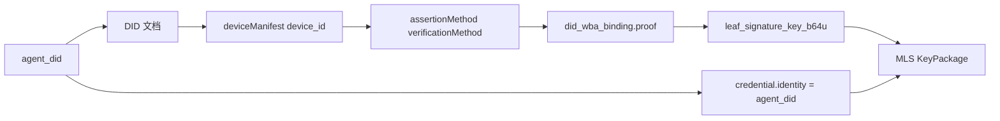
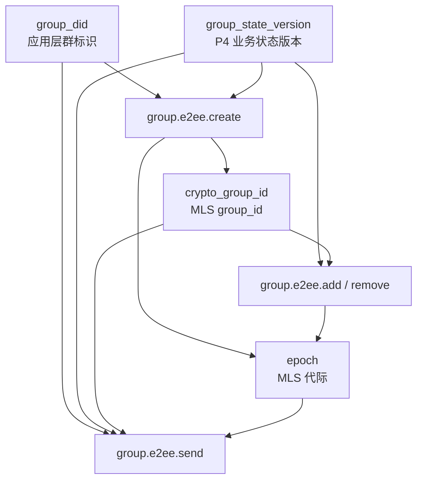
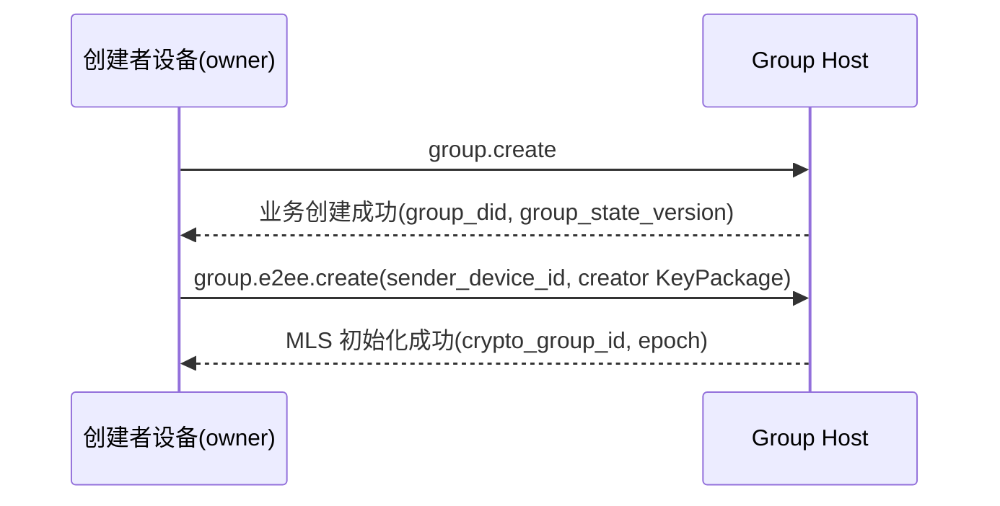
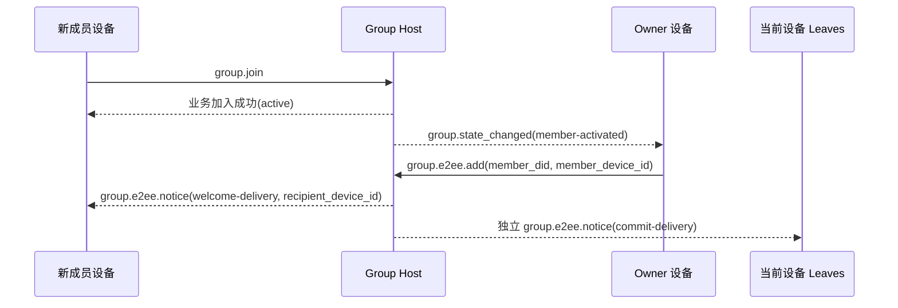
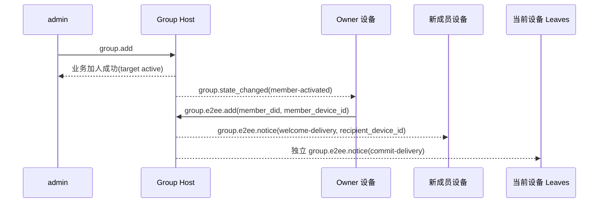
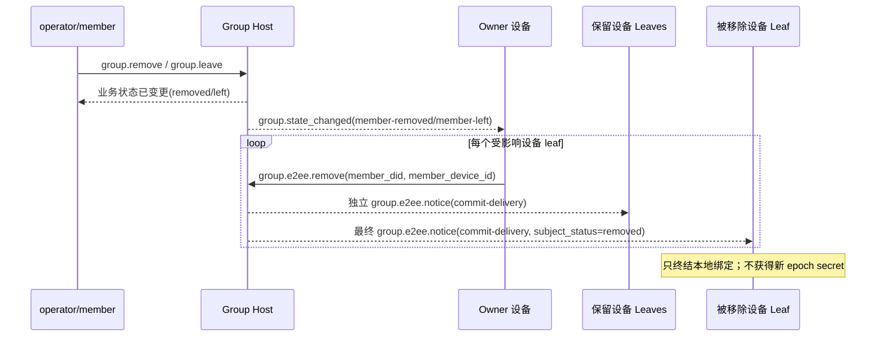
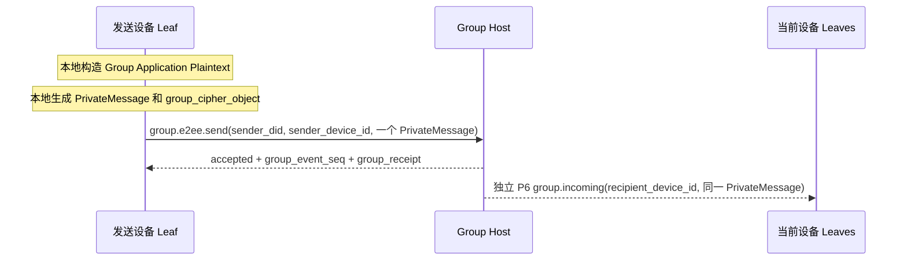
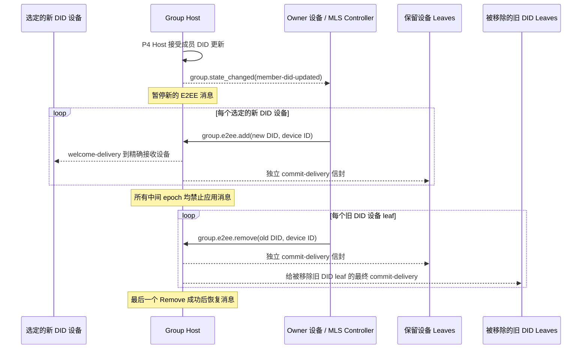

# ANP Profile 6：群组端到端加密

- 文档编号：ANP-P6-vNext
- 标题：群组端到端加密
- 状态：草案
- 规范集版本：ANP Messaging 1.2 草案
- 语言：中文
- Profile：`anp.group.e2ee.v2`
- 依赖：`anp.core.binding.v1`、`anp.identity.discovery.v1`、`anp.group.base.v2`
- 适用范围：本 Profile 适用于基于 Group DID 的群组端到端加密控制层，紧密配合 `anp.group.base.v2` 使用。

---

## 1. 目的

本 Profile 定义 ANP 的群组端到端加密控制层，规定：

1. 如何把 `group_did`、`group_state_version`、`group_event_seq` 与群密码学状态机绑定；
2. 如何使用 MLS 作为群密钥建立、成员变更和应用消息保护的基础协议；
3. 如何将 `did:wba` Agent DID 及一个合格 `device_id` 与 MLS 成员凭证、KeyPackage、Leaf 签名键进行绑定；
4. 如何定义一组独立的 `group.e2ee.*` JSON-RPC 方法，专门承载 MLS 密码学动作；
5. 如何通过**状态耦合**而不是“P4 方法内嵌 MLS 握手对象”的方式，与 `anp.group.base.v2` 紧密协作；
6. 如何处理 `epoch`、`Welcome`、`PrivateMessage`、`PublicMessage`、`epoch_authenticator`、分叉检测与恢复。
7. 如何在 P4 接受成员 DID 更新后，依次通过 `group.e2ee.add` 与 `group.e2ee.remove` 替换对应 MLS Leaf；
8. 如何让一个 P4 成员 DID 具有多个独立 MLS 设备 Leaf，而不改变 DID 级业务成员语义。

本 Profile **不**定义：

- 历史消息拉取；
- 已读与在线状态；
- 产品域内的设备注册、命名、角色、同步或内部副本管理；
- 在设备间共享 KeyPackage 私有材料、Leaf 私钥、epoch secret 或 MLS 私有状态；
- 群外目录同步的具体实现；
- 非群场景的端到端加密；
- External Commit 主线；
- `group_join_info` 与 `group.e2ee.get_join_info`；
- `accept_welcome` 协议方法；
- 第二套业务成员状态模型。
- 丢失的历史 MLS epoch secret 的恢复或重新下发。

---

## 2. 术语与规范性约定

### 2.1 规范性关键字

本文中的 **MUST**、**MUST NOT**、**REQUIRED**、**SHALL**、**SHALL NOT**、**SHOULD**、**SHOULD NOT**、**RECOMMENDED**、**NOT RECOMMENDED**、**MAY**、**OPTIONAL** 按照其大写形式解释为规范性要求。

### 2.2 术语

- **Group DID**：群的应用层全球标识，即 `group_did`。
- **Crypto Group ID**：群密码学内部标识，对应 MLS `group_id`，可与 `group_did` 不同。
- **Group Host Service**：负责群基础状态排序、策略应用与群消息入口的服务；不是 MLS 控制者。
- **MLS Group State**：基于 MLS 维护的群密码学状态。
- **Epoch**：MLS 群状态的一次代际推进。
- **KeyPackage**：MLS 加入材料对象，本 Profile 用它把一个合格设备 Leaf 加入群。
- **Welcome**：MLS 欢迎对象，用于帮助新成员初始化群状态。
- **PrivateMessage**：加密且带成员认证的 MLS 消息。
- **PublicMessage**：仅签名而不加密的 MLS 消息。
- **Device Leaf（设备 Leaf）**：一个由 `(agent_did, device_id)` 对外标识的 MLS Client/Leaf。它不是额外的 P4 业务成员。
- **Eligible Device（合格设备）**：依据 P2 `deviceManifest`、所引用密钥、服务能力与群策略，当前具备 `anp.group.e2ee.v2` 资格的设备。
- **did:wba Binding**：把某个 MLS Leaf 签名键、成员凭证或 KeyPackage 绑定到可验证的 `(agent_did, device_id)` 证明对象。
- **MLS Controller**：负责执行通用 MLS 成员变更控制动作的主体。v2 中群 `owner` 仍是控制者；第 9.4、13.4 节定义的同 DID 设备移除窄例外不是通用控制者。
- **State Coupling**：P4 与 P6 不做逐方法映射，而是通过业务状态变化触发密码学状态推进的耦合方式。
- **E2EE Notice**：P6 自己定义的独立加密通知对象，用于交付 `commit`、`welcome` 等密码学结果。
- **Terminal Leaf（终态 Leaf）**：已从群 MLS 成员集合中移除的设备 Leaf。其本地群绑定不再能就该 `group_did` 发送、接收或解密应用消息，但该设备本身可能仍是当前合格的 P2 Manifest 条目。
- **Device Delivery Queue（设备投递队列）**：Group Host 为尚未获得传输确认的 P6 envelope 按 `(recipient_did, recipient_device_id)` 维护的持久投递状态。它只承载公开元数据、被保留的公开 origin proof（若该路径定义了）与不可读密文，不是群历史。
- **Fork**：对同一 `group_did`，不同成员观察到无法调和的 `epoch` / `epoch_authenticator` / 状态推进序列。
- **MLS Member DID Update**：在 P4 已接受同一成员的 DID 更新后，通过有序 Commit 加入选定的新 DID 设备 Leaf，再移除全部旧 DID 设备 Leaf 的密码学编排。

---

## 3. 设计原则

### 3.1 群身份与密码学状态分层

本 Profile 明确区分：

- `group_did`：应用层群全球标识；
- `crypto_group_id`：密码学群内部标识；
- `group_state_version`：由 Group Host 分配的应用层群状态版本；
- `epoch`：由 MLS 状态机分配的密码学群代际。

这四者 **MUST NOT** 被机械等同；但它们之间 **MUST** 有可验证的绑定关系。

### 3.2 一个 Agent DID = 一个外部群成员；每台设备 = 一个 MLS Leaf

P4 的成员、角色、策略与成员计数仍归属当前 `agent_did`。P4 v2 只使用当前 `agent_did` 作为 wire 成员身份；名称、稳定路径字段或本地记录标识都不能替代 MLS `credential.identity` 中的当前 DID。

P6 **MAY** 将同一 DID 的多台设备表示为独立 MLS Client 与 Leaf。每个 Leaf 都保持 `credential.identity = UTF8(agent_did)`，并由第 6 节定义的经认证 `device_id` 绑定区分。具有同一 DID 的多个 Leaf 不会产生额外 P4 成员、角色或成员计数项。

每台设备独立生成并保存其 KeyPackage 私有材料、Leaf 私钥、epoch secret 和 MLS 状态。这些值 **MUST NOT** 在 sibling 设备间复制或共享。新设备只能通过自己的 Add、Commit 与定向到该设备的 Welcome 进入群。

`anp.group.e2ee.v1` 仍是独立的互通 contract。实现 **MUST NOT** 把 v1 成员或 MLS Leaf 重新解释为 v2 Device Leaf，也不得把 v1 MLS 群状态直接载入为 v2 多设备状态。本 Profile 不定义 v1 到 v2 的原地状态升级；任何迁移都需要本 Profile 之外显式定义的流程，否则必须 fail closed。

### 3.3 P4 是业务主协议，P6 是密码学控制层

本 Profile 与 `anp.group.base.v2` 的关系如下：

- P4 定义群的业务动作、业务状态、排序语义与回执语义；
- P6 定义 MLS 密码学动作、密码学对象、绑定规则和验证要求；
- P4 仍然是业务层权威；
- P6 **不**重新定义 `active / left / removed` 等业务成员状态；
- P4 Base 操作与通知仍以 DID 寻址，**MUST NOT** 携带 P6 设备 selector；
- P6 每次增加或移除一个设备 Leaf，不会独立改变 P4 成员身份；
- P6 **不**要求在 P4 方法体内直接携带 MLS 原生对象。

### 3.4 状态耦合，而不是逐方法映射

P4 与 P6 的耦合通过**状态**实现，而不是通过“某个 P4 方法直接映射某个 P6 方法”的方式实现。

也就是说：

- P4 决定某件事在业务上是否成立；
- P6 观察该业务状态变化，并推进 MLS 状态。

例如：

- 某群在 P4 中创建成功，且创建者已成为 `owner` → owner 自动执行 `group.e2ee.create`
- 某成员在 P4 中成为 `active`，且某合格设备尚未进入 MLS 成员集 → owner 执行 `group.e2ee.add(成员 DID, 设备 ID)`
- 已为 `active` 的成员增加另一台合格设备 → owner 可在不改变 P4 成员状态的情况下再执行一次设备级 `group.e2ee.add`
- 某成员在 P4 中变为 `left` 或 `removed` → owner 移除该 DID 的所有 MLS 设备 Leaf
- 某设备丧失 P2 Manifest 资格，但其 DID 仍为 `active` → owner，或持有当前 MLS 状态且具备同 DID 设备管理授权的 sibling，只移除该设备 Leaf
- 某 P4 成员 在 P4 中产生 `member-did-updated` → owner 加入选定的新 DID 设备 Leaf，再移除所有旧 DID 设备 Leaf

### 3.5 owner 是 MLS 控制者；同 DID 设备移除是窄例外

v2 中，**只有 owner DID 承担通用 MLS 控制者角色**。通用控制请求由一台合格且持有所需当前 MLS 状态的 owner 设备提交；另一台 owner 设备具备资格，不等于它持有该私有状态。

owner 负责：

- 创建 MLS group；
- 执行 `add`；
- 执行 `remove`；
- 通过有序的逐设备 Add 与 Remove 执行成员 DID 更新；
- 生成成员变更对应的 `commit`；
- 为新成员生成 `welcome`；
- 推进成员变更后的 `epoch`。

仅对调用方自己 DID 下已经权威撤销的精确设备 Leaf，存在一个窄例外：仍为当前合格 Leaf、具备权威同 DID 设备管理授权并持有当前 MLS 状态的设备，**MAY** 为同一 DID 下另一台已经撤销或当前 P2 不合格的设备提交 `group.e2ee.remove`。该例外：

- **MUST NOT** 移除调用设备自己、仍 active 的 sibling、其它 DID 的 Leaf 或 P4 业务成员；
- **MUST NOT** 改变 P4 role、status、joined_at 或成员数量；
- **MUST** 使用调用设备自己的当前 MLS 状态生成只移除一个精确 Leaf 的 Remove Commit；
- **MUST NOT** 让 Group Host 生成 Commit 或释放 MLS 私有状态。

设备管理授权是受信任的部署侧授权事实，不是新的 P6 请求字段。Group Host 若无法权威验证，**MUST** 拒绝该例外，且 **MUST NOT** 信任调用方自报或展示缓存。


P6 的核心思想不是把 MLS 对象塞进 P4 方法体，而是让密码学状态跟随业务状态推进。下图把这种“状态耦合”收敛成一张总览图，帮助读者先理解方法之间的因果关系，再阅读后面的逐节约束。

```mermaid
flowchart TB
P4[P4 业务状态变化<br/>group.create / member active / member left or removed / member DID updated]
OBS[owner 观察业务状态]

CREATE[group.e2ee.create]
ADD[group.e2ee.add(DID + device)]
REMOVE[group.e2ee.remove(DID + device)]
DID_UPDATE_ADD[group.e2ee.add(new DID devices)]
DID_UPDATE_REMOVE[group.e2ee.remove(old DID devices)]

HOST[Group Host]
NOTICE[group.e2ee.notice]

P4 --> OBS
OBS -->|群已创建且尚无 crypto_group_id| CREATE
OBS -->|合格设备未进入 MLS| ADD
OBS -->|设备或 DID 必须离开 MLS| REMOVE
OBS -->|P4 成员已DID 更新且旧 Leaf 仍存在| DID_UPDATE_ADD

CREATE --> HOST
ADD --> HOST
REMOVE --> HOST
DID_UPDATE_ADD --> HOST
DID_UPDATE_ADD -->|DID 更新 Add 已接受后执行| DID_UPDATE_REMOVE
DID_UPDATE_REMOVE --> HOST

HOST --> NOTICE
```

*图 P6-1：P4 / P6 状态耦合总览（非规范性）。*

本图强调的是触发关系，而不是新的业务状态机：P4 仍然是业务层权威，P6 只是观察这些业务结果并把它们落地为 MLS 的 create / add / remove。
### 3.6 Group Host 负责排序，不负责 MLS 控制

Group Host Service 的职责是：

- 接收并排序 P4 业务操作；
- 为已接受事件分配 `group_event_seq`；
- 推进 `group_state_version`；
- 生成 `group_receipt`；
- 分发群消息与 E2EE Notice；
- 为每个目标设备 Leaf 创建独立加密投递 envelope，但不解密或重新加密 MLS 对象；
- 见证 MLS 控制结果在业务层的落位。

默认情况下，Group Host Service：

- **不应** 作为 MLS 控制者；
- **不应** 作为 MLS 群成员；
- **不应** 持有群应用明文的解密能力。
- **MUST NOT** 在设备间复制 MLS 私有状态或 epoch secret。

### 3.7 owner 管群状态，active 成员管群消息

owner 控制：

- 成员变更；
- 群密码学状态推进；
- `epoch` 更新。

所有隶属于 `active` 成员、当前合格且已具有 MLS Leaf 的设备都可以：

- 使用当前群状态生成自己的群消息密文；
- 调用 `group.e2ee.send` 发送自己的群消息；
- 解密其它成员的群消息。

本 Profile **不**要求所有群消息都由 owner 代为加密。

第 3.5 节的同 DID 例外不授予 create、add、成员级删除、DID 更新或第三方控制权限。

### 3.8 v2 不支持 External Commit

v2 中：

- 不支持 External Commit；
- 不定义 `group_join_info`；
- 不定义 `group.e2ee.get_join_info`；
- 不定义 `accept_welcome` 协议方法。

所有入群路径在密码学层最终统一为 owner 发起的 MLS `add`。

### 3.9 只有消息面进入 PrivateMessage

v2 中：

- 只有 `group.e2ee.send` 的应用消息内容进入 MLS `PrivateMessage` 并被加密；
- `group.e2ee.create`、`group.e2ee.add`、`group.e2ee.remove` 都继续使用明文 JSON-RPC 请求体；DID 更新编排复用 `add` 与 `remove`，不定义新的请求方法；
- `commit`、`welcome` 等对象作为方法输入或 Notice 载荷出现，而不是再嵌进 P4 业务方法体。

---

## 4. 依赖、Profile 标识与目标建模

### 4.1 Profile 名称

本 Profile 的标准名称为：

`anp.group.e2ee.v2`

### 4.2 依赖关系

本 Profile **MUST** 依赖以下 Profile：

- `anp.core.binding.v1`
- `anp.identity.discovery.v1`
- `anp.group.base.v2`

### 4.3 安全模式

使用本 Profile 时：

- `meta.profile` **MUST** 等于 `anp.group.e2ee.v2`。
- 本 Profile 定义的每个设备发起 P6 请求 **MUST** 携带 `meta.sender_device_id`，并将它与 `meta.sender_did` 的当前 P2 Manifest 条目绑定。
- 每个定向到设备的 P6 通知或加密投递 **MUST** 携带 `meta.recipient_device_id`，并在 `meta.target.did` 中保留 Agent DID。
- 这些 selector 只属于 P6；P4 Base 操作与通知 **MUST NOT** 继承它们。

其中：

- `group.e2ee.publish_key_package`、`group.e2ee.get_key_package`、`group.e2ee.notice` **MUST** 使用 `transport-protected`
- `group.e2ee.create`、`group.e2ee.add`、`group.e2ee.remove`、`group.e2ee.send` 与 P6 `group.incoming` **MUST** 使用 `group-e2ee`

对 `group.e2ee.send` 而言，`group-e2ee` 表示它承载的消息语义属于群 E2EE 面；并不表示其外层 JSON-RPC 请求体再次被群加密。

### 4.4 方法目标建模

### 4.4.1 service-scoped

以下方法 **MUST** 为 `service-scoped`：

- `group.e2ee.publish_key_package`
- `group.e2ee.get_key_package`
- `group.e2ee.create`

规则：

- `meta.target.kind = "service"`
- `meta.target.did` **MUST** 等于目标公开 `ANPMessageService.serviceDid`

其中 `group.e2ee.create` 采用 service-scoped 的原因是：  
在业务层 `group.create` 成功前，群的业务状态刚刚建立，`group_did` 虽已生成，但创建动作本身仍面向群 Host 服务入口完成密码学初始化，因此 v2 统一采用 service-scoped。

### 4.4.2 group-addressed

以下方法 **MUST** 为 `group-addressed`：

- `group.e2ee.add`
- `group.e2ee.remove`
- `group.e2ee.send`

规则：

- `meta.target.kind = "group"`
- `meta.target.did` **MUST** 等于目标 `group_did`

### 4.4.3 agent-addressed notifications

以下通知 **MUST** 为 `agent-addressed`：

- `group.e2ee.notice`
- 用于应用密文投递的 P6 `group.incoming`

规则：

- `meta.target.kind = "agent"`
- `meta.target.did` **MUST** 等于通知接收方 Agent DID
- `meta.recipient_device_id` **MUST** 选择确切的接收设备 Leaf；通知 **MUST NOT** 重定向到 sibling 设备。
- 本 Profile 不定义 `target.kind = "device"`。

---

## 5. 密码学主线与 MTI 套件

### 5.1 主线协议

本 Profile 的群密钥主线 **MUST** 基于 MLS 1.0 语义实现，但 v2 只固定其受限使用子集。

v2 主线至少包括：

- KeyPackage
- Add
- Remove
- Commit
- Welcome
- PrivateMessage
- Epoch 推进

P4 成员 的成员 DID 更新不引入新的 P6 方法或 MLS 原语；它先为每个选定的新 DID 设备产生一次 `group.e2ee.add` Commit，再为每个旧 DID 设备 leaf 产生一次 `group.e2ee.remove` Commit。

其中：

- `commit_b64u` **MUST** 以完整 MLS `MLSMessage`（`mls-public-message`）按 TLS 序列化后的原始字节表示；
- `welcome_b64u` **MUST** 以 MLS `Welcome` 对象按 TLS 序列化后的原始字节表示；
- `PrivateMessage` **MUST** 作为群应用消息的唯一密文承载对象。

MLS 库 **MAY** 额外支持 `Update`、proposal batching、PSK、ReInit 等标准能力；但这些能力 **不属于** 本 Profile v2 的最小协议主线，也 **不构成** v2 的互通要求。

### 5.2 Mandatory-to-Implement 套件

为保证最小互通，符合本 Profile 的实现 **MUST** 支持下列 MTI 套件：

`MLS_128_DHKEMX25519_AES128GCM_SHA256_Ed25519`

### 5.3 额外套件

实现 **MAY** 支持更多 MLS 套件，但：

- 所有成员在同一群内 **MUST** 对所用套件达成一致；
- 若群策略限制允许套件集合，则 MLS Controller **MUST** 拒绝不满足策略的套件。

### 5.4 与 did:wba 的关系

本 Profile 的主线与 did:wba 的关系如下：

- DID 文档中的 `authentication` / `assertionMethod` 用于身份绑定证明；
- DID 文档中的 `keyAgreement` **SHOULD** 至少包含一个 X25519 条目，表示该 Agent 具备 E2EE 能力；
- P2 `deviceManifest` 标识当前设备条目、其 `signing_key_id`、`e2ee_key_id` 与 `anp.group.e2ee.v2` 资格；
- MLS 群成员的叶子签名键 **不应** 直接等同于 DID 长期身份签名键；
- 叶子签名键 **SHOULD** 单独生成，并通过 `did:wba Binding` 绑定到 `(agent_did, device_id)`。

---

## 6. did:wba 与 MLS 的绑定模型

### 6.1 绑定目标

本 Profile 要求把以下 MLS 元素绑定到 `(agent_did, device_id)`：

1. KeyPackage 所属者；
2. 当前叶子签名键；
3. 群成员凭证中的身份字符串；
4. 绑定 proof 使用的 P2 Manifest 签名密钥引用。

### 6.2 Credential Identity 规则

对于本 Profile，MLS 成员凭证中的 `credential.identity` **MUST** 等于该 leaf 当前 `agent_did` 的 UTF-8 字节串。可读名称、稳定主体路径或本地身份 **MUST NOT** 写入或替代 `credential.identity`。

实现 **MUST NOT** 使用本地账号 ID、设备 ID、数值用户 ID 或其它非 DID 字符串替代 `credential.identity`。

因此，同一 DID 的 sibling Leaf 拥有相同 `credential.identity`，但具有不同的经认证 `device_id`。验证方必须以完整二元组识别 P6 Leaf，不能只使用任意一个值。

### 6.3 `did_wba_binding` 对象

本 Profile 定义 `did_wba_binding` 对象，用于把 MLS Leaf 签名键绑定到 `agent_did` 下的一个合格设备。

推荐结构如下：

```json
{
  "agent_did": "did:wba:example.com:agents:alice:e1_<fingerprint>",
  "device_id": "dev-a-7N3KQ2",
  "verification_method": "did:wba:example.com:agents:alice:e1_<fingerprint>#dev-a-sign",
  "leaf_signature_key_b64u": "BASE64URL_ED25519_LEAF_PK",
  "issued_at": "2026-03-29T12:00:00Z",
  "expires_at": "2026-04-29T12:00:00Z",
  "proof": {
    "type": "DataIntegrityProof",
    "cryptosuite": "eddsa-jcs-2022",
    "created": "2026-03-29T12:00:00Z",
    "proofPurpose": "assertionMethod",
    "verificationMethod": "did:wba:example.com:agents:alice:e1_<fingerprint>#dev-a-sign",
    "proofValue": "z..."
  }
}
```

`did_wba_binding.proof` **MUST** 复用 P1 附录 B 定义的共享 **Object Proof Profile**。

对 `did_wba_binding` 而言：

- issuer DID **MUST** 为 `agent_did`
- 被保护文档 **MUST** 是移除 `proof` 后的整个 `did_wba_binding` 对象
- `device_id` **MUST** 标识当前 P2 Manifest 中具备 `anp.group.e2ee.v2` 资格的条目
- `verification_method` 与 `proof.verificationMethod` **MUST** 等于该条目的 `signing_key_id`，且该 key **MUST** 被 `agent_did` DID 文档的 `assertionMethod` 授权

#### 6.3.1 `anp_did_wba_device_binding` MLS extension

本草案为 `anp_did_wba_device_binding` 暂定私用 MLS `ExtensionType` `0xF0A1`。该值不是 IANA 分配，**MUST** 仅在显式协商 `anp.group.e2ee.v2` 后使用。ANP 在发布 v2 前 **MUST** 公布稳定的注册 code point；改变该草案值属于 breaking draft revision。

`extension_data` 字节是完整 `did_wba_binding` JSON 对象（包含 `proof`）的 UTF-8 RFC 8785 JCS 编码。v2 KeyPackage 携带的 LeafNode **MUST** 恰好包含一个此类型 extension，群内保留的经认证 LeafNode **MUST** 保留相同绑定。LeafNode 的 `capabilities.extensions` 与 GroupContext `required_capabilities` extension **MUST** 列出 `0xF0A1`。

v2 实现遇到缺失、重复、格式错误、不支持或发生碰撞的 extension 或 capability 声明时 **MUST** 拒绝。便于控制面处理的 `group_key_package.did_wba_binding` 成员 **MUST** 与内嵌 extension 具有相同 JCS 字节，且不能替代 extension。

### 6.4 `did_wba_binding` 验证规则

接收方在接受 KeyPackage、LeafNode 更新或新成员加入前，**MUST** 完成以下验证：

1. `agent_did` 可被解析，且当前 DID 文档有效；
2. `device_id` 在当前 P2 `deviceManifest` 中恰好出现一次，并声明 `anp.group.e2ee.v2` 及其依赖；
3. `verification_method` 等于该条目当前 `signing_key_id`，且被 `assertionMethod` 授权；
4. `proof` **MUST** 存在，并满足 P1 附录 B 的共享 Object Proof Profile；
5. `proof` 的 issuer DID 等于 `agent_did`，且 proof 验证通过；
6. 受保护文档至少覆盖 `agent_did`、`device_id`、`verification_method`、`leaf_signature_key_b64u`、`issued_at` 与 `expires_at`；
7. KeyPackage / LeafNode 携带第 6.3.1 节 extension 与所需 capability 声明；
8. 内嵌 extension 与 sibling `did_wba_binding` 具有完全相同的 JCS 字节；
9. 实际 Leaf 签名公钥与 `leaf_signature_key_b64u` 一致；
10. MLS 凭证中的 `credential.identity` 与 `agent_did` 一致；
11. suite、群策略与 `issued_at` / `expires_at` 时间窗口有效。


P6 之所以要定义 `did_wba_binding`，是因为 MLS 叶子签名键不应直接等同于 DID 长期身份签名键。下图把 `agent_did`、DID 文档、绑定对象与 KeyPackage / credential.identity 的链路连起来，便于读者理解验证顺序。



*图 P6-2：did:wba 与 MLS 绑定链路（非规范性）。*

实际验证时，接收方不应只检查 MLS 内部签名是否成立，还应沿着这条链继续确认 `credential.identity`、`device_id`、Leaf 签名键、当前 Manifest 条目与 `agent_did` 之间的绑定是否完整。
### 6.5 `e1_` 与 `k1_` 兼容

- 对默认 `e1_` DID，`did_wba_binding.proof` **MUST** 复用 P1 附录 B 的共享 Object Proof Profile；
- 对兼容型 `k1_` DID，`did_wba_binding.proof` **MAY** 使用显式扩展协商定义的替代 Object Proof Profile；但在未显式扩展协商时，v2 MTI **不**把 `k1_` 绑定 proof 作为默认互通路径；
- 无论 DID 的身份曲线为何，MLS 群的 MTI 叶子签名键仍 **MAY** 使用 Ed25519，只要绑定证明成立即可。

---

## 7. 核心对象

### 7.1 `crypto_group_id`

`crypto_group_id` 表示 MLS 的内部 `group_id`。

规则如下：

- `crypto_group_id` **MUST** 作为不透明字节串处理；
- 在 JSON 中 **MUST** 采用 `base64url` 表示，字段名推荐为 `crypto_group_id_b64u`；
- `crypto_group_id` **MUST** 与 `group_did` 建立可验证绑定。

### 7.2 `group_state_ref`

本 Profile 复用 P4 的 `group_state_ref` 概念，并要求在 E2EE 群中至少包含：

- `group_did`
- `group_state_version`
- `policy_hash`（若群策略已哈希化）


在群 E2EE 里，读者最容易在脑中串错的是四个不同层次的标识 / 版本：群 DID、业务状态版本、密码学内部 group_id 和 MLS epoch。下图把四者的来源和推进关系统一画出。



*图 P6-3：`group_did`、`crypto_group_id`、`group_state_version` 与 `epoch` 的关系（非规范性）。*

阅读后续对象结构与验证规则时，应把四者视为不同层次的坐标：它们需要绑定，但不能彼此替代，也不能被实现者机械视为同一个值。
### 7.3 `group_key_package`

本 Profile 定义群加入材料包装对象：

```json
{
  "key_package_id": "kp-001",
  "owner_did": "did:wba:example.com:agents:bob:e1_<fingerprint>",
  "owner_device_id": "dev-b-4M8P1X",
  "suite": "MLS_128_DHKEMX25519_AES128GCM_SHA256_Ed25519",
  "mls_key_package_b64u": "BASE64URL_KEYPACKAGE",
  "did_wba_binding": { ... },
  "expires_at": "2026-04-30T00:00:00Z"
}
```

其中：

- `key_package_id` **MUST** 存在；
- `owner_did` **MUST** 存在；
- `owner_device_id` **MUST** 存在；
- `suite` **MUST** 存在；
- `mls_key_package_b64u` **MUST** 存在；
- `did_wba_binding` **MUST** 存在；
- `expires_at` **SHOULD** 存在；
- `mls_key_package_b64u` **MUST** 为 MLS `KeyPackage` 对象按 MLS 1.0 TLS 序列化后的原始字节的无填充 base64url。
- `owner_did` 与 `owner_device_id` **MUST** 分别等于 `did_wba_binding.agent_did` 与 `did_wba_binding.device_id`；
- 一个 KeyPackage 只属于一台设备，**MUST NOT** 用于另一个设备 Leaf。其消费以及部署显式声明的 last-resort 重用继续不变地遵循第 13.2 节。

`group_key_package` 主要用于 owner 后续执行 `group.e2ee.add`。

### 7.4 `group_cipher_object`

`group_cipher_object` 是 `group.e2ee.send` 的线协议消息体对象。

推荐结构如下：

```json
{
  "crypto_group_id_b64u": "BASE64URL_GROUPID",
  "epoch": "7",
  "private_message_b64u": "BASE64URL_PRIVATEMESSAGE",
  "group_state_ref": {
    "group_did": "did:wba:groups.example:team:dev:e1_<fingerprint>",
    "group_state_version": "42",
    "policy_hash": "sha-256:..."
  },
  "epoch_authenticator": "BASE64URL_AUTH"
}
```

规则：

- `crypto_group_id_b64u` **MUST** 存在；
- `epoch` **MUST** 存在；
- `private_message_b64u` **MUST** 存在；
- `private_message_b64u` **MUST** 为 MLS `PrivateMessage` 对象按 MLS 1.0 TLS 序列化后的原始字节的无填充 base64url；
- `group_state_ref.group_did` **MUST** 等于外层目标 `group_did`。

### 7.5 `Group Application Plaintext`

群应用消息在进入 MLS `PrivateMessage` 加密前，**MUST** 归一化为以下内层明文对象：

```json
{
  "application_content_type": "text/plain | application/json | application/anp-attachment-manifest+json | ...",
  "thread_id": "thr-001",
  "reply_to_message_id": "msg-0009",
  "annotations": {},
  "text": "...",
  "payload": {},
  "payload_b64u": "..."
}
```

规则：

- `application_content_type` **MUST** 存在；
- `text` / `payload` / `payload_b64u` **MUST** 恰好出现一个；
- P4 中消息语义字段 `thread_id`、`reply_to_message_id`、`annotations` 在群 E2EE 下 **MUST** 位于该内层对象中；
- 发送方在加密前 **MUST** 将整个 `Group Application Plaintext` 对象使用 UTF-8 + RFC 8785 JCS 序列化为字节串；接收方解密后 **MUST** 按相同规则解释该对象。

当 `application_content_type = "application/json"` 时，`payload` **MUST**
直接承载 JSON 对象。本 Profile 不定义该对象内部字段的业务含义。

普通 JSON group application plaintext 示例：

```json
{
  "application_content_type": "application/json",
  "thread_id": "thr-001",
  "payload": {
    "type": "example",
    "data": {
      "hello": "group"
    }
  }
}
```

### 7.6 `e2ee_notice_object`

P6 定义独立的加密通知对象，用于交付密码学结果。

推荐结构如下：

```json
{
  "notice_id": "en-001",
  "notice_type": "commit-delivery | welcome-delivery",
  "group_did": "did:wba:groups.example:team:dev:e1_<fingerprint>",
  "group_state_ref": {
    "group_did": "did:wba:groups.example:team:dev:e1_<fingerprint>",
    "group_state_version": "43",
    "policy_hash": "sha-256:..."
  },
  "crypto_group_id_b64u": "BASE64URL_GROUPID",
  "epoch": "8",
  "subject_did": "did:wba:b.example:agents:bob:e1_<fingerprint>",
  "subject_device_id": "dev-b-4M8P1X",
  "subject_status": "active | removed",
  "commit_b64u": "BASE64URL_MLSMESSAGE",
  "welcome_b64u": "BASE64URL_WELCOME",
  "ratchet_tree_b64u": "BASE64URL_RATCHET_TREE",
  "epoch_authenticator": "BASE64URL_AUTH",
  "group_receipt": { ... }
}
```

规则：

- `notice_id` **MUST** 存在，**MUST** 在同一信封的各次重投间保持稳定，且 **MUST NOT** 被复用于发给同一接收设备的另一个逻辑通知。同一密码学结果的各 leaf 副本 **MAY** 共用一个 `notice_id`，因为每台设备只对发给自己的信封去重，键为 `(group_did, notice_id)`；
- `notice_type` **MUST** 存在；
- `group_did` **MUST** 存在；
- `group_state_ref` **MUST** 存在；
- `crypto_group_id_b64u` **MUST** 存在；
- `epoch` **MUST** 存在；
- `notice_type = "commit-delivery"` 时，`commit_b64u` **MUST** 存在；
- `notice_type = "welcome-delivery"` 时，`welcome_b64u` 与 `ratchet_tree_b64u` **MUST** 同时存在；
- 对成员 DID 更新编排产生的 notice，`group_state_ref` **MUST** 精确引用每个 P6 Add 和 Remove 共同使用的已接受 P4 `member-did-updated` 事件。接收方 **MUST** 从该 P4 事件取得旧 DID 与当前 DID，不得依赖 P6 notice 重复携带连续性字段；
- `subject_did`、`subject_device_id` 与 `subject_status` 只描述本次 P6 操作影响的一个 Leaf：Add 使用被加入 DID/设备与 `active`，Remove 使用被移除 DID/设备与 `removed`；
- 实际接收通知的设备只由外层 `meta.target.did` 与 `meta.recipient_device_id` 标识；在 `commit-delivery` 中，它可以与受影响 subject 不同。对 Remove 的 `commit-delivery`，接收方 **MAY** 就是被移除的 subject Leaf 本身，它按第 12.3 节接收一份最终通知；
- `ratchet_tree_b64u` **MUST** 为 ratchet tree 的 TLS 序列化原始字节的无填充 base64url；
- `group_receipt` **MAY** 存在，用于把密码学结果与业务排序位置关联起来。

---

## 8. KeyPackage 发布与发现方法

### 8.1 `group.e2ee.publish_key_package`

#### 8.1.1 语义

由某 Agent 向其自己公开的 `ANPMessageService` 发布一个可用于群加入的 KeyPackage。

#### 8.1.2 请求要求

- `method = "group.e2ee.publish_key_package"`
- `meta.profile = "anp.group.e2ee.v2"`
- `meta.security_profile = "transport-protected"`
- `meta.target.kind = "service"`
- `meta.target.did` **MUST** 等于发布方自己公开的 `ANPMessageService.serviceDid`
- `meta.sender_did` **MUST** 存在
- `meta.sender_device_id` **MUST** 存在
- `body.group_key_package` **MUST** 存在
- `body.group_key_package.owner_did` **MUST** 等于 `meta.sender_did`
- `body.group_key_package.owner_device_id` 与 `body.group_key_package.did_wba_binding.device_id` **MUST** 等于 `meta.sender_device_id`
- 发布服务在接受 KeyPackage 前 **MUST** 验证当前 P2 Manifest 条目与第 6 节绑定。

认证约束：

- 该方法属于 **service-scoped** 控制面方法；
- 调用方 **MUST** 运行在已认证的本域会话或等价 hop / service 认证上下文中；
- v2 **不要求** 为该方法额外定义新的业务层 `origin_proof`。

#### 8.1.3 成功响应

成功响应 **MUST** 至少包含：

- `published = true`
- `owner_did`
- `owner_device_id`
- `key_package_id`
- `published_at`

### 8.2 `group.e2ee.get_key_package`

#### 8.2.1 语义

通过目标 Agent 的 `ANPMessageService` 获取一个可用 KeyPackage。

#### 8.2.2 请求要求

- `meta.profile = "anp.group.e2ee.v2"`
- `meta.security_profile = "transport-protected"`
- `meta.target.kind = "service"`
- `meta.target.did` **MUST** 等于目标 Agent 公开的 `ANPMessageService.serviceDid`
- `meta.sender_did` **MUST** 存在
- `meta.sender_device_id` **MUST** 标识 `meta.sender_did` 下当前具备 P6 资格的设备

`body` **MUST** 包含：

- `target_did`
- `target_device_id`

`body` **MAY** 包含：

- `preferred_suite`
- `require_fresh`

认证约束：

- 该方法属于 **service-scoped** 控制面方法；
- 认证上下文 **MUST** 绑定精确的 `(meta.sender_did, meta.sender_device_id)` 组合，且该设备 **MUST** 在当前 P2 Manifest 中仍具备资格；
- v2 最小互通要求至少是 hop / service 级认证；
- **匿名获取 KeyPackage 不属于 v2 MTI**。

#### 8.2.3 成功响应

成功响应 **MUST** 至少包含：

- `target_did`
- `target_device_id`
- `group_key_package`

#### 8.2.4 服务端发放规则

`ANPMessageService` 在返回 `group_key_package` 时：

- **SHOULD** 返回未过期、未撤销且未消费的 KeyPackage；
- **MUST** 返回 `owner_did` 与 `owner_device_id` 精确等于请求目标二元组的 KeyPackage，且 **MUST NOT** 替换为 sibling 设备；
- 返回前 **MUST** 根据当前 P2 Manifest 重新验证目标设备；
- **MAY** 在返回后先把它标记为 `reserved` 或等价状态，以避免并发重复发放；
- 当对应的 `group.e2ee.add`（包括 DID 更新编排中的 Add 步骤）被 Group Host 成功接受并完成密码学成员变更后，**MUST** 将其标记为 `consumed` 或从发布集合中删除；
- 若对应流程失败、取消或超时，是否释放该保留态 KeyPackage 由部署策略决定，但 **SHOULD NOT** 导致同一个 KeyPackage 被两个都会成功的 `group.e2ee.add` 操作并发复用；
- caller identity、限流与防滥用策略 **MUST** 基于 hop / service 级认证实施。

---

## 9. MLS 控制面方法

### 9.1 总则

本章方法是独立的 JSON-RPC 方法。它们不是 P4 业务方法的“附加字段”，而是 P6 自己的密码学控制动作。

其中：

- `group.e2ee.create`、`group.e2ee.add`、`group.e2ee.remove` 是**成员变更控制方法**
- `group.e2ee.send` 是**消息发送方法**
- `group.e2ee.create/add/remove` 绑定到 P4 的既有业务状态，但**不会再创建新的 P4 业务成员状态**
- `group.e2ee.send` 直接作为线上发送方法，不再经 `group.send` 二次包装

### 9.2 `group.e2ee.create`

#### 9.2.1 语义

创建新的 MLS 群状态，并把 owner 作为初始成员加入。

#### 9.2.2 调用者

仅 owner。

#### 9.2.3 请求要求

- `method = "group.e2ee.create"`
- `meta.profile = "anp.group.e2ee.v2"`
- `meta.security_profile = "group-e2ee"`
- `meta.target.kind = "service"`
- `meta.target.did` **MUST** 等于目标群 Host 公开的 `ANPMessageService.serviceDid`
- `meta.sender_did` **MUST** 等于当前群 `owner`
- `meta.sender_device_id` **MUST** 标识一台合格且持有所需当前 MLS 状态的 owner 设备
- `auth.origin_proof` **MUST** 存在

`body` **MUST** 至少包含：

- `group_did`
- `group_state_ref`
- `suite`
- `creator_key_package`
- `crypto_group_id_b64u`
- `epoch`

规则：

- `creator_key_package.owner_did` **MUST** 等于 `meta.sender_did`
- `creator_key_package.owner_device_id` **MUST** 等于 `meta.sender_device_id`
- `group_state_ref.group_did` **MUST** 等于 `body.group_did`
- `epoch` 对于初始群状态 **SHOULD** 为 `"0"` 或实现明确约定的初始值

#### 9.2.4 成功响应

成功响应 **MUST** 至少包含：

- `created = true`
- `group_did`
- `group_state_ref`
- `crypto_group_id_b64u`
- `epoch`
- `accepted_at`

说明：

- `group.e2ee.create` 本身 **MUST NOT** 单独创建新的 P4 业务群；
- 它只在 `group.create` 已被业务层接受之后执行；
- 它不再单独产生新的 `group_state_version` 或 `group_event_seq`。

### 9.3 `group.e2ee.add`

#### 9.3.1 语义

由 owner 执行 MLS `add`，把 P4 `active` 成员的一个合格设备 Leaf 加入密码学群。同一 active DID 的第二台设备使用另一次 Add，不会创建另一个 P4 成员。

#### 9.3.2 调用者

仅 owner。

#### 9.3.3 请求要求

- `method = "group.e2ee.add"`
- `meta.profile = "anp.group.e2ee.v2"`
- `meta.security_profile = "group-e2ee"`
- `meta.target.kind = "group"`
- `meta.target.did` **MUST** 等于目标 `group_did`
- `meta.sender_did` **MUST** 等于当前群 `owner`
- `meta.sender_device_id` **MUST** 标识一台合格且持有所需当前 MLS 状态的 owner 设备
- `auth.origin_proof` **MUST** 存在

`body` **MUST** 至少包含：

- `member_did`
- `member_device_id`
- `group_state_ref`
- `group_key_package`
- `crypto_group_id_b64u`
- `epoch`
- `commit_b64u`
- `welcome_b64u`
- `ratchet_tree_b64u`

规则：

- `group_state_ref.group_did` **MUST** 等于外层目标 `group_did`
- `group_key_package.owner_did` **MUST** 等于 `member_did`
- `group_key_package.owner_device_id` 与 `group_key_package.did_wba_binding.device_id` **MUST** 等于 `member_device_id`
- `commit_b64u` **MUST** 为完整 MLS `MLSMessage` 对象按 TLS 序列化后的无填充 base64url
- `welcome_b64u` **MUST** 为 MLS `Welcome` 对象按 TLS 序列化后的无填充 base64url
- `ratchet_tree_b64u` **MUST** 为 ratchet tree 的 TLS 序列化原始字节的无填充 base64url
- `epoch` **MUST** 表示本次 `add` 后的新 `epoch`
- 普通路径中，`member_did` **MUST** 是 P4 当前 `active` 成员，且确切 `(member_did, member_device_id)` Leaf **MUST NOT** 已存在；同 DID 的另一个 Leaf 不是冲突；
- DID 更新路径中，`group_state_ref` **MUST** 精确引用已接受的 P4 `member-did-updated` 事件，`member_did` **MUST** 等于该事件的 `subject_did`，且新 KeyPackage **MUST** 绑定选定的新 DID 设备；
- 选定新 DID 设备的所有DID 更新 Add **MUST** 在移除旧 DID 设备 Leaf 之前成功。

#### 9.3.4 成功响应

成功响应 **MUST** 至少包含：

- `accepted = true`
- `group_did`
- `member_did`
- `member_device_id`
- `group_state_ref`
- `crypto_group_id_b64u`
- `epoch`
- `accepted_at`

说明：

- `group.e2ee.add` 本身 **MUST NOT** 把目标成员的 P4 业务状态改成 `active`；
- 该业务状态必须已经由 P4 决定；
- 本方法只负责把该业务结果落地到 MLS。

### 9.4 `group.e2ee.remove`

#### 9.4.1 语义

MLS `remove` 每次精确移除一个设备 Leaf。触发条件可以是 P4 移除该 DID、在 DID 仍为 active 时设备丧失资格、群策略，或已接受的成员 DID 更新编排。通用移除仍由 owner 控制；下述同 DID 例外仅限一台已撤销 sibling 设备。

#### 9.4.2 调用者

以下二者之一：

- 持有所需当前 MLS 状态的合格 owner 设备；
- 当前合格且具备权威同 DID 设备管理授权的 Leaf，但只能移除自己 DID 下另一台已经撤销或当前不合格的设备 Leaf。

#### 9.4.3 请求要求

- `method = "group.e2ee.remove"`
- `meta.profile = "anp.group.e2ee.v2"`
- `meta.security_profile = "group-e2ee"`
- `meta.target.kind = "group"`
- `meta.target.did` **MUST** 等于目标 `group_did`
- owner 分支中，`meta.sender_did` **MUST** 等于当前群 `owner`，`meta.sender_device_id` **MUST** 标识一台合格且持有所需当前 MLS 状态的 owner 设备；
- 同 DID 分支中，`meta.sender_did` **MUST** 等于 `member_did`，发送者 **MUST** 仍是 P4 `active` 成员和当前 MLS Leaf，`meta.sender_device_id` **MUST NOT** 等于 `member_device_id`，且 Group Host **MUST** 权威验证发送设备具备当前设备管理授权、目标设备已撤销或当前 P2 不合格；
- `auth.origin_proof` **MUST** 存在

`body` **MUST** 至少包含：

- `member_did`
- `member_device_id`
- `group_state_ref`
- `crypto_group_id_b64u`
- `epoch`
- `commit_b64u`

规则：

- `commit_b64u` **MUST** 为完整 MLS `MLSMessage` 对象按 TLS 序列化后的无填充 base64url
- `epoch` **MUST** 表示本次 `remove` 后的新 `epoch`
- 确切 `(member_did, member_device_id)` Leaf **MUST** 存在于当前 MLS 状态；
- 若 P4 将 `member_did` 标记为 `removed` 或 `left`，owner **MUST** 为该 DID 的每个当前设备 Leaf 有序执行 Remove；
- 若 P4 保持该 DID 为 `active`，仅当具名设备丧失当前 P2 资格或群策略移除该 Leaf 时才允许移除；sibling Leaf 与 P4 成员状态保持不变；
- 同 DID 分支 **MUST** 只移除具名目标 Leaf，且 **MUST NOT** 用于群策略移除、成员 remove/leave、DID 更新或其它 DID；
- DID 更新路径中，`member_did` **MUST** 等于所引用 P4 事件的 `previous_subject_did`，选定新 DID 设备的 Add 必须已成功，且 owner 必须在恢复应用消息前移除每个旧 DID 设备 Leaf。

#### 9.4.4 成功响应

成功响应 **MUST** 至少包含：

- `accepted = true`
- `group_did`
- `member_did`
- `member_device_id`
- `group_state_ref`
- `crypto_group_id_b64u`
- `epoch`
- `accepted_at`

### 9.5 `group.e2ee.send`

#### 9.5.1 语义

向某群直接发送一条 MLS 加密群消息。

#### 9.5.2 调用者

任意当前 `active` 成员的合格设备 Leaf。

#### 9.5.3 请求要求

一个合规的 `group.e2ee.send` 请求 **MUST** 满足：

1. `method = "group.e2ee.send"`
2. `meta.profile = "anp.group.e2ee.v2"`
3. `meta.security_profile = "group-e2ee"`
4. `meta.target.kind = "group"`
5. `meta.target.did` **MUST** 是目标 `group_did`
6. `meta.sender_did` **MUST** 是当前发送方 Agent DID
7. `meta.sender_device_id` **MUST** 标识产生该 PrivateMessage 的当前合格 MLS Leaf
8. `meta.message_id` **MUST** 存在
9. `meta.operation_id` **MUST** 存在
10. `meta.content_type` **MUST** 固定为 `application/anp-group-cipher+json`
11. `auth.origin_proof` **MUST** 存在，并使用所选设备当前 P2 签名密钥
12. `body` **MUST** 直接是 `group_cipher_object`

说明：

- `group.e2ee.send` 直接就是线上发送方法；
- 它不再通过 P4 `group.send` 再包装一层。

#### 9.5.4 成功响应

成功响应 **MUST** 至少包含：

- `accepted = true`
- `group_did`
- `message_id`
- `operation_id`
- `group_event_seq`
- `group_state_version`
- `accepted_at`
- `epoch`
- `group_receipt`

该成功语义表示：

- Group Host 已接受并排序了一个 MLS 密文对象；
- 它 **不**自动表示所有成员都已经成功解密该消息。

---

## 10. 状态耦合规则

### 10.1 总则

P4 与 P6 的耦合通过**业务状态变化**完成。  
本 Profile **不**再要求维护一张 `group.create -> create`、`group.add -> add` 的逐方法映射表。

owner **MUST** 通过受信任的状态观察方式获知：

- 某群已经在业务层创建完成；
- 某成员已经在业务层成为 `active`；
- 某成员已经在业务层变为 `left` 或 `removed`；
- 某合格设备需要 Leaf，或某当前 Leaf 的设备丧失 P2 资格；
- 某 P4 成员 已产生 `member-did-updated`。

状态观察方式 **MAY** 是：

- 本地与 Group Host 的内部编排；
- 对 `group.state_changed` 的订阅；
- 或其它等价且可信的状态观察机制。

### 10.2 群创建耦合规则

当 owner 观察到以下业务状态同时成立时：

- 某 `group_did` 已被创建；
- 创建者是自己；
- 该群尚未附着任何 `crypto_group_id`

owner **MUST** 触发一次 `group.e2ee.create`。

### 10.3 成员加入耦合规则

当 owner 观察到以下业务状态同时成立时：

- 某 `member_did` 在 P4 中已经是该群的 `active` 成员；
- 某选定合格 `member_device_id` 尚未具有 MLS Leaf；
- 该设备具有可用 `group_key_package`

owner **MUST** 为该设备触发一次 `group.e2ee.add`。同一 active DID 的其它合格设备重复该 P6 步骤，不另行产生 P4 成员事件。

本规则同时适用于：

- `group.join`
- `group.add`
- 部署扩展的邀请加入
- 部署扩展的审批通过

也就是说，P4 的各种加入业务入口在密码学层最终都收敛为一次 `group.e2ee.add`。

此前已被移除 Leaf 的设备 **MAY** 在之后重新加入同一个群。上述触发条件不变且已经足够：该 DID 在 P4 为 `active`、该精确设备当前没有 Leaf、并且它已发布**新的** `group_key_package`。本 Profile 不定义单独的重新加入方法。owner **MUST NOT** 复用第 13.2 节所述已消费的 KeyPackage，**MUST NOT** 恢复该设备此前的 Leaf，也 **MUST NOT** 释放重新加入之前的任何 epoch secret；重新加入的设备只能从新的 Welcome 获得当前及后续状态。

### 10.4 成员移除 / 离群耦合规则

当某 `member_did` 在 P4 中变为 `removed` 或 `left` 时，owner **MUST** 为该 DID 的每个当前设备 Leaf 触发一次有序 `group.e2ee.remove`。

当只有一台设备丧失当前 Manifest 资格且其 DID 仍为 P4 `active` 时，owner 或持有当前 MLS 状态且具备同 DID 设备管理授权的 sibling **MAY** 立即尝试只移除该设备 Leaf。群策略移除仍由 owner 控制。两条路径都不改变 P4 成员或 sibling Leaf。

当整个 P4 成员变为 `removed`/`left`、处于 DID 更新过程，或 Host 检测到 orphan/membership conflict 时，Host **MUST** 暂停新的 `group.e2ee.send`，直到所需 MLS 变更闭合。反之，若仅一台设备被权威撤销或丧失 P2 资格，而其 DID 仍为 P4 `active`，Host **MUST NOT** 仅因该设备 Leaf 尚未移除而暂停其它合法 `group.e2ee.send`。Host **MUST** 停止认证该撤销设备并停止向其投递新的服务数据，同时继续按当前 MLS head 验证消息。

该设备级非阻断状态是明确的可用性/安全折中。精确 Remove Commit 成功前，被撤销 Leaf 可能仍持有当前 epoch secret，并可能解密从服务投递路径之外取得的密文。一次即时 Remove 失败不表示密码学撤销完成；本 Profile 不要求为该尝试增加 claim-task、repair 通知、持久化客户端队列或自动重试。

移除设备 Leaf 是**群作用域**的密码学动作，与**身份作用域**的 P2 设备移除是两套不同的状态机。移除 Leaf 不会把该设备从其 DID 的 `deviceManifest` 中删除，也不会作废其 `device_id`。仍然是当前合格 Manifest 条目的设备，在其 Leaf 被移除后保留同一个 `device_id`，并 **MAY** 之后按第 10.3 节以新的 KeyPackage 重新加入本群或任何其它群。反之，已从 P2 Manifest 移除的设备 **MUST** 使用新的 device ID 与新的设备密钥重新注册，且 **MUST NOT** 复用已作废的标识。实现 **MUST NOT** 混淆两者：群 Leaf 移除是按群且可逆的，Manifest 设备移除是身份作用域且永久的。

### 10.5 成员 DID 更新耦合规则

开始 Add/Remove 编排前，MLS Controller **MUST** 获取并验证 P4 `member-did-updated` 事件与 `group_receipt`，从 `previous_subject_did` 到 `subject_did` 独立执行 P2 迁移验证并保留真实 assurance，确认 P4 roster 已包含 `subject_did`，并解析新 DID 当前合格设备和 KeyPackage。`provider_asserted` 由 P6 自身业务策略接受或拒绝，不是协议强制失败，也 **MUST NOT** 被表示为更高 assurance。

当 owner 观察到 P4 `member-did-updated` 事件时，该事件的 `subject_did` 表示新 DID，`previous_subject_did` 表示旧 DID。若旧 DID Leaf 仍在 MLS 成员集，owner **MUST** 按以下顺序编排现有方法：

1. 为每个选定新 DID 设备及其 KeyPackage 调用一次 `group.e2ee.add`；
2. 全部选定 Add 成功后，为每个旧 DID 设备 Leaf 调用一次 `group.e2ee.remove`；
3. 每个 Remove 都成功后完成密码学DID 更新。

所有请求 **MUST** 精确引用同一个 P4 `member-did-updated` 的 `group_state_ref`。全部选定 Add **MUST** 在第一个 Remove 之前成功；Remove 只能删除该事件 `previous_subject_did` 的设备 Leaf，不得借 DID 更新流程移除其它成员。

DID 更新编排期间，Group Host **MUST** 串行化 P6 成员变更控制动作。除当前步骤的幂等重试以及 Add 成功后紧随其后的匹配 Remove 外，Group Host **MUST NOT** 在 DID 更新完成前接受无关的 `group.e2ee.add` 或 `group.e2ee.remove`。

从 P4 DID 更新事件被接受起，到最后一个 Remove 成功为止，Group Host **MUST** 暂停接受该群新的 `group.e2ee.send`。Add 与 Remove 产生的中间 epoch **MUST NOT** 承载应用消息。某一步失败时，实现 **MUST** 保持暂停并重试该步骤。

P6 失败 **MUST NOT** 回滚 P4 DID 更新、恢复旧 DID 的 P4 权限，或创建新的 P6 业务成员状态。P4 成员资格、角色、状态、加入时间和成员数量始终由原 DID 更新事件决定。

若 P4 接受了 `provider_asserted` 而 P6 业务策略拒绝，P4 roster 仍保持权威且不得回滚；P6 **MUST** 保持 E2EE 消息面暂停，直到满足自身策略要求。

若 DID 更新对象本身是 owner，一台被选中的新 DID 合格设备 **MUST** 使用自己的设备绑定 `origin_proof`。过渡 Add Commit **MAY** 使用一个旧 owner 设备 Leaf 保留的 MLS 状态生成。至少一个新 owner 设备 Leaf 加入后，后续旧 DID Remove **MUST** 由一台当前合格且持有当前状态的新 owner 设备 Leaf 生成。若没有已授权 owner 设备保留或获得所需当前状态，系统 **MUST** fail closed，并保持 E2EE 消息面暂停。

### 10.6 消息发送规则

`group.e2ee.send` **不是**状态耦合触发的方法。  
它是成员显式发起的线上发送方法。

但它的业务一致性要求仍与 P4 紧密绑定：

- 发送者 **MUST** 是当前 `active` 成员；
- 发送者 **MUST** 满足 P4 `group_policy.permissions.send`
- 成功响应中的 `group_event_seq`、`group_state_version`、`group_receipt` 语义沿用 P4 对群消息的定义。

---


## 11. MLS Usage Profile（规范性）

### 11.1 总则与外部规范引用

本章定义本 Profile 对 MLS 的**受限使用子集与固定配置**。  
本章的目标不是重写 MLS 标准，而是规定：

- v2 允许使用 MLS 的哪些对象与状态机动作；
- 这些对象在线协议中如何编码；
- owner、active member、Group Host 分别需要承担哪些本地状态与处理义务；
- `group.e2ee.create`、`group.e2ee.add`、`group.e2ee.remove`、`group.e2ee.send` 背后对应什么 MLS 语义。

实现 **MUST NOT** 修改 MLS 的核心算法语义；但当 MLS 标准库默认自由度与本 Profile 的 v2 受限规则发生冲突时，**MUST** 以本 Profile 为准。

### 11.2 v2 允许的 MLS 子集

本 Profile v2 的 MLS 主线只允许以下对象和动作进入互通边界：

- `KeyPackage`
- `Add`
- `Remove`
- `Commit`
- `Welcome`
- `PrivateMessage`
- `epoch` 推进

在本 Profile v2 中：

- `commit_b64u` **MUST** 对应完整 MLS `MLSMessage`，其 wire format **MUST** 为 `mls-public-message`
- `welcome_b64u` **MUST** 对应 MLS `Welcome`
- `private_message_b64u` **MUST** 对应 MLS `PrivateMessage`

本 Profile v2 **不**把以下能力纳入互通主线：

- External Commit
- `GroupInfo` / `group_join_info`
- `group.e2ee.get_join_info`
- 独立 `accept_welcome` 协议方法
- 多控制者并发提交
- 非 owner 发起的成员变更
- 作为协议级主线动作的 `Update`
- proposal batching 作为互通要求
- ReInit、PSK、Subgroup，或除第 6.3.1 节设备绑定 extension 之外的自定义 MLS 扩展作为 v2 MTI 要求

实现使用的 MLS 库 **MAY** 支持上述能力；但未显式扩展协商时，**MUST NOT** 把它们带入 v2 线协议互通。

### 11.3 MTI 套件与固定算法

本 Profile v2 **MUST** 实现以下 MTI 套件：

`MLS_128_DHKEMX25519_AES128GCM_SHA256_Ed25519`

对应固定算法配置如下：

- KEM / HPKE DH：`DHKEMX25519`
- AEAD：`AES-128-GCM`
- Hash / KDF 基础：`SHA-256`
- 叶子签名：`Ed25519`

此外，本 Profile 中所有进入 proof、AAD 或内层明文绑定的 JSON 对象 **MUST** 使用 UTF-8 + RFC 8785 JCS 编码。这一要求至少适用于：

- `did_wba_binding` 的被保护对象
- `Group Application Plaintext`
- `group.e2ee.send` 的 `authenticated_data`
- 成员变更提交的受认证绑定对象

### 11.4 `group.e2ee.create` 的 MLS 语义

`group.e2ee.create` 只在 `group.create` 已被业务层接受后执行。

执行 `group.e2ee.create` 时，被选中的 owner 设备的本地 MLS runtime **MUST**：

1. 验证 `creator_key_package` 属于精确的 `(owner DID, sender_device_id)` 组合；
2. 验证其中的 `did_wba_binding`、第 6.3.1 节扩展和当前 P2 Manifest 资格；
3. 创建新的 MLS group state 并生成新的 `crypto_group_id`；
4. 把该 owner 设备作为第一个 MLS leaf 加入，同时保持 `credential.identity` 等于 owner DID；
5. 形成初始 `epoch`；
6. 只为该本地设备持久化私有 MLS 状态。

`group.e2ee.create` **MUST NOT** 单独创造新的 P4 业务群；它只为已存在的业务群创建对应的初始 MLS 状态。

### 11.5 `group.e2ee.add` 的 MLS 语义

`group.e2ee.add` 是 v2 中唯一标准入群密码学主线。

执行 `group.e2ee.add` 时，owner 的本地 MLS runtime **MUST**：

1. 获取精确对应 `(member_did, member_device_id)` 的 `group_key_package`；
2. 验证 KeyPackage、设备绑定、第 6.3.1 节扩展和当前 P2 Manifest 资格；
3. 校验目标 DID 是普通路径中的 P4 `active` 成员，或是所引用 P4 `member-did-updated` 事件中的 `subject_did`；
4. 校验这一精确 DID/设备组合尚未成为 leaf；同一 DID 的兄弟设备不构成冲突；
5. 执行一次 MLS `Add`，生成新的 `Commit`，并只为该设备 leaf 生成一个 `Welcome`；
6. 导出或构造足以让该设备 bootstrap 的 ratchet tree 材料；
7. 推进 `epoch` 并更新 owner 设备的本地状态。

因此，v2 中的标准入群密码学主线为：

```text
KeyPackage
→ Add
→ Commit
→ Welcome
→ ratchet_tree
→ 新 epoch
```

为降低实现歧义，v2 规定：

- `commit_b64u` **MUST** 为完整 MLS `MLSMessage` 的 TLS 序列化原始字节；
- `welcome_b64u` **MUST** 为 MLS `Welcome` 的 TLS 序列化原始字节；
- `ratchet_tree_b64u` **MUST** 单独显式提供给新成员；
- `welcome-delivery` **MUST NOT** 依赖“Welcome 内部可能自带 ratchet tree”这一库级可选行为。

在成员 DID 更新编排中，本节的每个 Add **MUST** 引用 P4 DID 更新事件的 `group_state_ref`，加入一个绑定新 DID 的选定设备 leaf，并且只向该 DID/设备组合交付 Welcome。所有选定的新 DID 设备 Add 都先于任何旧 DID 设备 leaf 的移除。

### 11.6 `group.e2ee.remove` 的 MLS 语义

执行 `group.e2ee.remove` 时，owner 的本地 MLS runtime **MUST**：

1. 校验精确的 `(member_did, member_device_id)` 组合是当前 leaf；
2. 校验存在一种允许的触发条件：该 DID 在 P4 中为 `removed` 或 `left`、该设备不再满足当前 P2 Manifest 或群策略资格，或该组合是所引用 P4 DID 更新事件中的旧 DID leaf；
3. 对该 leaf 执行一次 MLS `Remove`，生成新的 `Commit`，推进 `epoch` 并更新 owner 设备的本地状态；
4. 确保被移除设备 leaf 无法解密后续消息。

若 P4 移除某 DID 或该 DID 离群，owner **MUST** 按顺序为该 DID 的每个当前 leaf 重复该操作。若该 DID 在 P4 中仍为 `active`，只移除被点名的不合资格或被策略移除的设备 leaf；P4 成员资格和兄弟 leaf 均不改变。

一次成功的 Remove 使该 leaf 成为 Terminal Leaf。被移除设备有权知道这一点：MLS 不存在向被移除成员传递该事实的带内信号，因此 Group Host **MUST** 按第 12.3 节把已接受的 Commit 作为最终通知投递给被移除 leaf。移除不会作废该设备的 `device_id`，也不妨碍它之后按第 10.3 节重新加入。

`group.e2ee.remove` 的线协议输出 **MUST** 至少包含：

- `commit_b64u`
- `crypto_group_id_b64u`
- `epoch`
- `group_state_ref`
- `member_did`
- `member_device_id`

在成员 DID 更新编排中，只有全部选定的新 DID 设备 Add 都使用同一 `group_state_ref` 成功后才能开始 Remove；每个 Remove 只能删除该 P4 事件标识的一个旧 DID 设备 leaf。

### 11.7 `group.e2ee.send` 的加密语义

发送者调用 `group.e2ee.send` 时，其本地 MLS runtime **MUST**：

1. 校验自己的 DID 当前是 P4 `active` 成员；
2. 校验 `meta.sender_device_id` 当前合格并对应自己的 active MLS leaf；
3. 校验自己满足 P4 `permissions.send`；
4. 构造 `Group Application Plaintext` 和第 13 章定义的 `authenticated_data`；
5. 使用该设备的当前 MLS 状态把明文只加密一次，形成一个 MLS `PrivateMessage`；
6. 构造 `group_cipher_object`，并将其作为 `group.e2ee.send` 的 `body` 提交。

Group Host **MUST NOT** 解密或重新加密该应用消息。它按照第 12.5 节为每个当前设备 leaf 生成一个独立 P6 投递信封，信封中分发同一个已接受的 `group_cipher_object`。

`group.e2ee.send` 的成功仅表示：

- Group Host 已接受并排序了一个 MLS 密文对象；
- 它 **不**自动表示所有成员都已成功解密该消息。

### 11.8 群消息解密义务

接收设备在收到 `group.e2ee.send` 对应的密文对象后，**MUST**：

1. 校验外层 `meta.target.did` 和 `meta.recipient_device_id` 标识自己的 DID/设备组合；
2. 根据 `group_did` 找到该设备自己的本地 MLS group state；它 **MUST NOT** 使用从兄弟设备复制的私有状态；
3. 校验 `crypto_group_id_b64u` 和可接受的 `epoch` 窗口；
4. 只使用该设备的本地状态解密 `private_message_b64u`；
5. 校验 `authenticated_data` 中的 `sender_did` 和 `sender_device_id`，并校验 MLS sender leaf 映射到同一组合；
6. 解析内层 `Group Application Plaintext`，仅在全部检查通过后交付上层。

若任一步骤失败，接收方 **MUST NOT** 把该消息作为有效群消息交付应用层。

### 11.9 `group.e2ee.notice` 的本地处理义务

#### 11.9.1 `commit-delivery`

收到 `notice_type = "commit-delivery"` 时，接收方本地 MLS runtime **MUST**：

1. 校验外层 `meta.recipient_device_id` 标识本地设备；
2. 解码 `commit_b64u`，并校验 `group_did`、`group_state_ref`、`crypto_group_id_b64u`、`epoch` 和受影响的 `subject_did` / `subject_device_id` 组合；
3. 把该 commit 应用到该设备的本地 MLS group state；
4. 更新本地当前 `epoch`，并记录必要的 `epoch_authenticator` 或一致性状态（若存在）。

当某个 Remove 的 `commit-delivery` 其 `subject_did` 与 `subject_device_id` 等于接收设备自身的组合时，这就是该设备针对该群的**最终**通知。此类接收方：

- **MUST** 接受并处理它，而不是以"自己已不是该群成员"为由拒绝；
- **MUST** 只用它推进并终结自己的本地群绑定；
- **MUST NOT** 导出新的 epoch secret，并 **MUST** 保持无法解密新 epoch 及其后任何 epoch 的应用消息；
- 在绑定保持终态期间，即按第 10.3 节重新加入之前，**MUST NOT** 再对该 `group_did` 提交任何 `group.e2ee.send`。

该通知中的 Commit 是 MLS `PublicMessage`，因此不会向被移除设备传递任何新的 epoch secret。它只让该设备得到保留 Leaf 已经持有的同一个终态结论。

按第 12.3 节，最终通知的投递是有界的，并不保证送达。设备 **MUST NOT** 把自身终态判定或重新加入能力唯一依赖于收到它。同样地，P4 第 8.11 节要求 Group Host 向 subject DID 尝试一次自身作用域的 `member-removed` 或 `member-left` 最终投递，但该尝试同样有界、同样不保证到达。以下每一种信号都 **MUST** 被视为同等权威的终态信号，且其中任何一种单独出现都 **MUST** 足以到达同一个本地终态：送达的最终通知、送达的自身 DID 的 P4 `member-removed` 或 `member-left` 事件、自己后续请求收到的 `group.not_member` 拒绝、自己后续群寻址 P6 请求收到的 `group.e2ee.leaf_not_current` 拒绝，或第 11.9.2 节的陈旧状态规则。

对于 DID 仍为 P4 `active` 的仅 Leaf 移除，P4 事件和 `group.not_member` 永远不会触发：该 DID 仍是成员，被移除的只是这一个设备 Leaf。此时可用的拉取信号是第 13.3 节和第 17 节定义的 `group.e2ee.leaf_not_current` 拒绝：该设备下一次正当的群寻址 P6 请求——实践中即它的下一次 `group.e2ee.send`——**MUST** 在策略与载荷评估之前就被该错误拒绝；一旦收到，它 **MUST** 把该群的本地绑定置为终态，与收到最终通知完全等效。设备 **SHOULD NOT** 仅为探测成员身份而捏造应用消息；需要主动检查的部署 **MAY** 在本 Profile 之外提供只读状态机制。

#### 11.9.2 `welcome-delivery`

收到 `notice_type = "welcome-delivery"` 时，新设备的本地 MLS runtime **MUST**：

1. 校验外层 `meta.target.did` 和 `meta.recipient_device_id` 等于 `subject_did` 和 `subject_device_id`，并标识该本地设备；
2. 解码 `welcome_b64u` 和 `ratchet_tree_b64u`；
3. 校验 `group_did`、`group_state_ref`、`crypto_group_id_b64u` 和 `epoch`；
4. 校验该 Welcome 能且仅能用本设备自己发布的、全新且未消费的 KeyPackage 私钥解开，校验所投递的 ratchet tree 中恰好包含一个携带该 KeyPackage leaf node 的本设备 leaf，并把该 KeyPackage 标记为已消费；
5. 使用 Welcome 和 ratchet tree 初始化并持久化该设备自己的 MLS group state；
6. 把该状态绑定到本地 `(group_did, device_id)` 组合，并准备接收后续 commit 和应用消息。

Welcome 到达时，设备 **MAY** 已经持有该 `group_did` 的本地 MLS 状态，最常见的原因是它的 Leaf 此前被移除、现在正按第 10.3 节重新加入。设备 **MUST** 按以下方式处理这种冲突：

- 若本地状态对该群仍然可用，Welcome 的 `crypto_group_id_b64u` 与 `epoch` 与之匹配，且所投递的 `welcome_b64u` 与 `ratchet_tree_b64u` 与本设备此前已为该绑定处理过的 Welcome 字节完全一致，则把该 Welcome 视为幂等重复，并 **MUST NOT** 丢弃本地状态。若 `crypto_group_id_b64u` 与 `epoch` 匹配但投递字节与此前处理过的不一致，设备 **MUST** fail closed，保留本地状态，并 **MUST NOT** 处理这份不一致的载荷；
- 否则，若该 Welcome 引用与已存储绑定相同的 `crypto_group_id_b64u` 且 `epoch` 严格更新，并且已存储绑定是 Terminal Leaf，或所投递的 ratchet tree 中已不包含本设备**本地存储状态中记录的那个精确 leaf node**，则从该 Welcome 替换本地状态，并 **SHOULD** 保留被替DID 更新定的可审计记录。Leaf 比对对象是那个已存储的 leaf node，而不是任何绑定本设备 `(agent_did, device_id)` 组合的 leaf：重新加入时，投递的树中会包含本设备来自新 KeyPackage 的新 leaf，该新 leaf 不算作已存储的那个；
- 其余情况 **MUST** fail closed，且 **MUST NOT** 丢弃本地状态。

以上分支只决定**是否允许替换已有本地状态**，不豁免上文任何一条编号校验。因此 Terminal Leaf 并不绕过 `crypto_group_id_b64u` 连续性检查和 epoch 比较；同一 `group_did` 下引用了不同 `crypto_group_id_b64u` 的 Welcome 在任何分支下都 fail closed，因为本版本没有定义任何群重建或分叉恢复迁移。

接受一份新的 Welcome 不会给设备带来它自己没有申请过的任何能力，因为在任何分支下，该 Welcome 都只能用本设备自己发布的、全新且未消费的 KeyPackage 私钥解开。本规则要管理的风险是**销毁仍然可用的本地状态**，而不是机密性。因此设备 **MUST NOT** 替换仍然可用的本地状态，也 **MUST NOT** 把替换的前提条件设为"此前已收到第 12.3 节的最终 Remove `commit-delivery`"，因为该通知并不保证送达。

Welcome 处理是**本地行为规范**，不是新的 JSON-RPC 协议方法。

### 11.10 本地持久状态要求

为保证跨重启与跨通知时序下的可实现性，各参与方 **SHOULD** 至少持久化以下状态。

#### 11.10.1 owner

每个维护 MLS 状态的 owner 设备 **SHOULD** 至少持久化：

- `group_did`
- 自身 `device_id`
- `crypto_group_id`
- 当前 `epoch`
- 自身当前 MLS group state
- 当前业务层已同步的成员集视图
- 最近一次成功应用的 `add/remove` 结果引用，包括成员 DID 更新编排中的每个操作

owner 设备 **MUST NOT** 把其 MLS 私钥、epoch secret 或私有 tree state 作为协议状态同步给兄弟设备。

#### 11.10.2 active member

每个普通 active 成员设备 **SHOULD** 至少持久化：

- `group_did`
- 自身 `device_id`
- `crypto_group_id`
- 自身当前可用 MLS group state
- 当前 `epoch`
- 最近一次成功应用的 `commit/welcome` 引用

每台设备维护独立 leaf 和独立私有状态。同一 DID 的另一台设备通过自己的 KeyPackage 和 Welcome 加入，而不是复制该状态。

#### 11.10.3 Group Host

Group Host **SHOULD** 至少持久化：

- `group_state_version`
- `group_event_seq`
- `group_receipt`
- 与 `crypto_group_id`、`epoch` 的外层绑定引用
- 由已接受的 `create/add/remove` 形成的当前 `(DID, device_id)`-to-leaf 公共投影；该投影 **MUST NOT** 包含 MLS 私有密钥或 epoch secret
- 第 12.6 节的 Device Delivery Queue 状态，用于尚未获得传输确认的信封，仅限公开元数据、被保留的公开 origin proof 与不可读密文
- 成员 DID 更新编排当前执行到 Add 或 Remove 的内部进度；该进度不是新的协议级成员状态

Group Host 默认 **不要求** 持久化可解密群消息的 MLS 私有状态。

### 11.11 v2 不支持的 MLS 能力

除第 11.2 节列出的排除项外，本 Profile v2 还 **不支持**：

- 把 `Update` 作为独立的协议级动作暴露
- 通过 notice 交付未绑定 `group_state_ref` 的密码学结果
- 依赖 MLS 库隐式自动恢复缺失的 tree material
- 让非 owner 成员提交改变成员集的 `Commit`
- 让 Group Host 代替成员完成最终 MLS 有效性判断

### 11.12 P4 成员 DID 更新的 MLS 编排语义

owner 的本地 MLS runtime **MUST**：

1. 验证对应 P4 `member-did-updated` 状态事件及其中的新旧 DID 和 `group_state_ref`；
2. 枚举每个当前旧 DID 设备 leaf 和选定的合格新 DID 设备；
3. 为每个选定的新 DID 设备获取并完整验证独立 KeyPackage 和设备绑定；
4. 为每个选定的新 DID 设备执行一次 `group.e2ee.add` Commit，并且只向该设备交付其 Welcome 和 ratchet tree；
5. 全部选定 Add 成功后，为每个旧 DID 设备 leaf 执行一次 `group.e2ee.remove` Commit；
6. 将每个 Commit 独立投递给每个保留设备 leaf，并按第 12.3 节把每个旧 DID Remove Commit 额外投递给该被移除的旧 DID leaf 作为其最终通知；
7. 仅在最后一个 Remove 成功后恢复应用消息。

每个 Add 和 Remove Commit **MUST** 绑定同一个 P4 `group_state_ref`。每个中间 epoch 只用于完成 DID 更新，**MUST NOT** 承载应用消息。新 DID 设备只通过自己的 Welcome 获得当前及后续状态；本 Profile **MUST NOT** 恢复已丢失的历史 epoch secret，也不得在设备之间共享私有 MLS 状态。

若 DID 更新目标是 owner，过渡 Add Commit **MAY** 由保留当前状态的合格旧 owner 设备生成。某个新 owner 设备 leaf 加入后，后续旧 DID Remove **MUST** 由具有当前状态的合格新 owner 设备生成。若没有已授权 owner 设备保留或获得当前状态，实现 **MUST** fail closed；本 Profile 不提供自动 owner MLS 恢复，Group Host 也 **MUST NOT** 下发当前或历史 epoch secret。

---

## 12. 独立通知模型

### 12.1 总则

P6 定义两条设备定向通知路径：

- `group.e2ee.notice` 用于 MLS Commit 与 Welcome 结果；
- P6 `group.incoming` 用于应用密文。

两条路径都不复用 P4 `group.state_changed`。P4 `group.state_changed` 继续只承载**业务状态变化**。

### 12.2 `group.e2ee.notice`

#### 12.2.1 语义

向一个目标 Agent 设备定向投递群密码学相关的结果对象。

#### 12.2.2 Notification envelope 约束

- `method = "group.e2ee.notice"`
- `meta.profile = "anp.group.e2ee.v2"`
- `meta.security_profile = "transport-protected"`
- `meta.target.kind = "agent"`
- `meta.target.did` **MUST** 等于当前通知接收方 DID
- `meta.recipient_device_id` **MUST** 等于当前通知的精确接收设备
- `meta.sender_did` **SHOULD** 等于 `group_did`
- `body` **MUST** 直接承载 `e2ee_notice_object`

### 12.3 `notice_type = "commit-delivery"`

用于向当前已有 MLS 成员交付：

- `commit_b64u`
- 新 `epoch`
- 新 `epoch_authenticator`（若可得）

对 Add Commit，Group Host **MUST** 为每个保留设备 leaf 生成一个独立通知信封。

对 Remove Commit，Group Host **MUST** 为每个保留设备 leaf 生成一个独立通知信封，**并且** 为被移除的精确 subject leaf 生成一个最终通知信封。该最终信封：

- **MUST** 在外层 `meta.target.did` 与 `meta.recipient_device_id` 中精确以 `(body.subject_did, body.subject_device_id)` 为目标；
- **MUST** 携带与保留 leaf 信封相同的已接受 Commit、`crypto_group_id_b64u`、`epoch` 与 `group_state_ref`，且 `body.subject_status = "removed"`；
- **MUST NOT** 被改投给被移除 subject 的兄弟设备、其它已移除 leaf 或任何 DID 级 fan-out。

之所以要求该最终信封，是因为 MLS 不提供任何带内方式让被移除成员得知自己已被移除。缺少它，被移除设备无法把"被移除"与"传输失败"区分开，可能无限期保留一个看起来仍然有效的本地群绑定。该 Commit 是 MLS `PublicMessage`，因此这次投递不泄露任何 epoch secret，也不削弱前向保密；被移除设备的处理义务见第 11.9.1 节。

每个信封以该 leaf 的 DID 和设备 ID 为目标，而 `body.subject_did` 和 `body.subject_device_id` 标识该 Commit 添加或移除的一个 leaf。设备收到后按照第 11.9.1 节的本地 MLS runtime 规则处理该 commit。

给被移除 leaf 的最终信封，是该 leaf 在该群可能收到的最后一个 P6 信封。因此它的投递是有界而非无限期的：

- Group Host **MUST** 对它施加显式的、由部署声明的重试与保留上限；
- 一旦到达该上限，Group Host **MUST** 能够连同该 leaf 的 Device Delivery Queue 状态一起丢弃它，并 **MUST NOT** 为 Terminal Leaf 无限期保留按设备的投递状态；
- 丢弃它 **MUST NOT** 阻塞该群后续 epoch、保留 leaf 的投递，或对新 `group.e2ee.send` 的接受。

由于投递是有界的，接收方 **MUST NOT** 把该信封当作任何后续本地状态转换的必要前置条件；参见第 11.9.1 与 11.9.2 节。

### 12.4 `notice_type = "welcome-delivery"`

用于向新成员定向交付：

- `welcome_b64u`
- `ratchet_tree_b64u`
- 新 `epoch`
- `group_state_ref`

规则如下：

- `welcome_b64u` **MUST** 为 MLS `Welcome` 的 TLS 序列化原始字节；
- `ratchet_tree_b64u` **MUST** 为 ratchet tree 的 TLS 序列化原始字节；
- 该 notice **MUST** 精确以被添加的 `(subject_did, subject_device_id)` 组合为目标，**MUST NOT** 发送给兄弟设备；
- 新设备 **MUST** 使用 `welcome_b64u + ratchet_tree_b64u` 完成自身的本地 bootstrap；
- 对成员 DID 更新编排中的 Add，目标 DID **MUST** 等于事件 `subject_did`；不得向 `previous_subject_did` 或未被选中的新 DID 设备发送 Welcome。

### 12.5 与 P4 通知的关系

- P4 `group.state_changed` 只承载 DID 级业务事件。
- P4 Base `group.incoming` 承载非 E2EE 群消息，并保持 DID/Group DID 寻址；它不带设备选择字段。
- P6 `group.e2ee.notice` 只向特定设备承载 MLS Commit 和 Welcome 结果。

P6 应用密文投递 **MUST** 使用 `group.incoming` JSON-RPC Notification。该信封属于 P6，并且 **MUST** 满足：

- `meta.profile = "anp.group.e2ee.v2"` 且 `meta.security_profile = "group-e2ee"`；
- `meta.target.kind = "agent"`，`meta.target.did` 是一个当前 leaf 的 Agent DID，`meta.recipient_device_id` 是该 leaf 的设备 ID；
- `meta.sender_did` 和 `meta.sender_device_id` 保留 `group.e2ee.send` 接受的发送方组合；
- `meta.message_id`、`meta.operation_id` 和 `meta.content_type` 保留已接受 `group.e2ee.send` 的值；
- `params.auth` 无损保留原始 `scheme` 和 `origin_proof`，从 Device Delivery Queue 重投时同样如此，并额外携带第 13.6 节定义的 `origin_context` 重建输入；接收方如何验证该被保留的 proof 见第 13.6 节；
- `body.group_did` 等于已接受的 `group.e2ee.send.meta.target.did` 与 `body.group_cipher_object.group_state_ref.group_did`；
- `body.group_state_version`、`body.group_event_seq`、`body.accepted_at` 与 `body.group_receipt` 保留 Group Host 的已接受排序结果；
- `body.group_cipher_object` 是已接受 `group.e2ee.send` body 的无损副本。

Group Host 为每个当前设备 leaf 生成一个独立信封。所有信封携带同一组排序字段、回执和 MLS `PrivateMessage`；只有 `meta.target.did` 与 `meta.recipient_device_id` 随 leaf 变化。Host **MUST NOT** 解密或重新加密。该标准 P6 通知不是 P4 Base `group.incoming`；它只复用方法名，已接受群消息的 `group_event_seq`、`group_state_version`、`group_receipt` 和排序语义继续采用 P4 定义。顶层 `body.group_did` 同时提供 P8 联邦要求的群 caller anchor。

### 12.6 Device Delivery Queue（设备投递队列）

两条 P6 通知路径都是设备寻址的，其信封在兄弟设备之间不可互换。信封首次发出时处于离线的设备，之后仍然需要那一份精确信封，因为 Group Host 不持有 MLS 私有状态，无法为它重新加密或重新生成一份。

因此，Group Host **MUST** 就 `group.e2ee.notice` 与 P6 `group.incoming` 两者，按群内 `(recipient_did, recipient_device_id)` 维护持久的 Device Delivery Queue 状态。该状态：

1. **MUST** 为每一个尚未获得传输确认的信封持久化其 `meta`、不可读 `body`，以及对 P6 `group.incoming` 而言其被保留的 `auth`；
2. **MUST** 在重投时无损复现该信封，包括 `meta.message_id`、`meta.operation_id`、`meta.content_type`、排序字段、`group_receipt`、被保留的 `auth`（若该信封携带）与 `body`；重投 **MUST NOT** 跨设备或跨 epoch 改投、合并、拆分、重排或重新编号；
3. **MUST** 在入队前以及每次投递尝试前重新校验当前资格，使得对已不再是当前合格 leaf 的目标停止投递，例外有二：第 12.3 节定义的最终 Remove 通知，以及下文允许的、已为该 leaf 入队的信封；
4. **MUST NOT** 被投递、暴露或 fan-out 给同一 DID 的兄弟设备，也 **MUST NOT** 用兄弟设备的信封来替代满足；
5. **MUST** 限定为公开元数据、被保留的公开 origin proof 与不可读密文。Group Host **MUST NOT** 为满足本节而持久化 MLS 私有状态、epoch secret 或明文。

投递确认是传输级的。两条 P6 投递路径都是 JSON-RPC Notification，按 P1 第 5.3 节保持单向；本 Profile 不定义任何应用级确认方法。当 Host 的传输层报告已把这份精确信封完整写入接收设备的已认证会话或端点时，该信封即计为传输已确认——确认的是传输送达，不是应用处理。传输确认后 Host **MAY** 出队，且 **MUST NOT** 为等待一个本 Profile 未定义的应用级确认而挂起队列。由于传输确认不能证明已处理，接收方 **MUST** 幂等地处理重投信封：P6 `group.incoming` 信封由 `(body.group_did, body.group_event_seq)` 加 `meta.message_id` 标识，`group.e2ee.notice` 按第 7.6 节的 `notice_id` 规则，在单个接收设备自己的投递流内由 `(body.group_did, body.notice_id)` 标识。

在单个设备的队列内，P6 `group.incoming` 信封 **MUST** 按 `group_event_seq` 顺序投递和重投，`commit-delivery` 通知 **MUST** 按 epoch 顺序投递。`welcome-delivery` **MAY** 越过待投的应用信封，因为它开启的是新绑定而非旧绑定的延续。最终 Remove 通知 **MUST NOT** 越过任何 Host 仍打算投递的应用信封，以保证它是该 leaf 收到的最后一个 P6 信封，即第 12.3 节的要求。具体地：某个 leaf 的 Remove 被接受后，Host **MUST NOT** 再为该 leaf 入队新的应用信封，随后在同一有界保留期内二选一：**SHOULD** 按顺序投递完此前已为该 leaf 入队的应用信封——被移除的 leaf 仍持有那些信封加密所用 epoch 的密钥——并把第 12.3 节的最终通知放在它们全部之后；或者 **MAY** 依据已声明的部署策略取消该 leaf 全部剩余的已入队应用信封，并立即投递最终通知。最终通知一旦获得传输确认，Host **MUST NOT** 再向该 leaf 投递任何 P6 信封。

保留期 **MUST** 由显式的、部署声明的上限约束。丢弃的后果因信封类型而异。每条恢复路径还必须遵守第 13.4 节的 Add 前置条件——仍是当前 leaf 的精确 DID/设备组合不能被再次 Add：

- 丢弃的 `welcome-delivery` 留下一个已被接受、但其设备从未初始化的 leaf。owner **MUST** 先 Remove 该 leaf——这是第 13.4 节允许的、DID 保持 `active` 时的策略性 Remove——然后用新 KeyPackage 重新执行 Add，从而产生新的 Welcome；
- 发给保留 leaf 的 `commit-delivery` 被丢弃后，设备在仍是当前 leaf 的同时无法推进过那个 epoch。若该信封在保留期内无法重投，owner 同样 **MUST** 先 Remove 这个陈旧 leaf，之后设备按第 10.3 节重新加入；
- 丢弃的最终 Remove 通知不需要 Host 侧任何进一步动作：该 leaf 已不在群内，设备通过第 11.9.1 节的其它信号到达终态，并可直接按第 10.3 节重新加入；
- 丢弃的 P6 `group.incoming` 应用信封只损失那一条消息——之后的信封仍可独立解密，既不需要 Remove 也不需要重新加入。

上述任何恢复路径都不下发历史 epoch secret；本 Profile **MUST NOT** 下发后者。

该队列是投递机制，不是群历史。与 P5 Mailbox 一样，它不持有任何 MLS 状态；本 Profile 不定义任何 P6 历史拉取、已读回执或设备同步方法。

部署 **MAY** 在本 Profile 之外提供本地历史或重放 API。此类 API 不属于 `anp.group.e2ee.v2`，**MUST NOT** 被声明为 P6 能力。若它返回设备寻址的 P6 信封，则：

- **MUST** 从调用方**已认证的设备主体**推导 `meta.target.did` 与 `meta.recipient_device_id`；
- **MUST NOT** 把调用方自述的设备选择字段当作"信封发给哪个设备"的权威依据，并 **MUST** 用 `anp.device_binding_invalid` 拒绝与已认证主体冲突的选择字段；
- **MUST NOT** 返回以非"调用方自身当前 leaf"的设备为目标的信封；
- 当调用方的认证只建立 DID 级主体时，**MUST NOT** 合成任何设备寻址信封。

---

## 13. 绑定、AAD 与验证要求

### 13.1 最小绑定集合

以下字段 **MUST** 进入受认证绑定范围：

- `group_did`
- `crypto_group_id`
- `group_state_version`（或 `group_state_ref`）
- `policy_hash`（若存在）
- `meta.sender_did`
- `meta.sender_device_id`（适用于设备发起的请求和 P6 应用投递）
- `meta.message_id` / `meta.operation_id`
- `meta.security_profile = group-e2ee`

对每个设备定向的 `group.e2ee.notice` 或 P6 `group.incoming` 信封，外层认证还 **MUST** 绑定 `meta.target.did` 和 `meta.recipient_device_id`。接收设备 ID 不进入 MLS `authenticated_data`，因为同一个 MLS `PrivateMessage` 会投递给每个当前 leaf。

### 13.1.1 `group.e2ee.send` 的 `authenticated_data`

`group.e2ee.send` 使用 MLS `PrivateMessage` 时，其 `authenticated_data` **MUST** 是以下 JSON 对象经 UTF-8 + RFC 8785 JCS 编码后的字节串：

```json
{
  "content_type": "application/anp-group-cipher+json",
  "group_did": "<outer meta.target.did>",
  "crypto_group_id_b64u": "<body.crypto_group_id_b64u>",
  "group_state_ref": { "...": "..." },
  "security_profile": "group-e2ee",
  "sender_did": "<outer meta.sender_did>",
  "sender_device_id": "<outer meta.sender_device_id>",
  "message_id": "<outer meta.message_id>",
  "operation_id": "<outer meta.operation_id>"
}
```

此处“outer”指目标为 Group DID 的原始 `group.e2ee.send` 请求，而不是之后以 Agent DID 为目标的逐设备投递信封。接收设备从投递信封 `body.group_did` 取得 `group_did`，并 **MUST** 验证它等于 `body.group_cipher_object.group_state_ref.group_did` 与受认证的 `group_did`；该信封保留原始发送方组合、消息 ID 和操作 ID。

### 13.1.2 `group.e2ee.add/remove` 的提交绑定

owner 在本地为 `group.e2ee.add/remove` 生成 `commit_b64u` 时，**SHOULD** 至少把以下语义放入其受认证绑定范围（例如 MLS `authenticated_data` 或等价上下文）：

```json
{
  "group_did": "<outer meta.target.did>",
  "crypto_group_id_b64u": "<body.crypto_group_id_b64u>",
  "group_state_ref": { "...": "..." },
  "subject_method": "group.e2ee.add | group.e2ee.remove",
  "member_did": "<body.member_did>",
  "member_device_id": "<body.member_device_id>",
  "epoch": "<body.epoch>",
  "security_profile": "group-e2ee",
  "sender_did": "<outer meta.sender_did>",
  "sender_device_id": "<outer meta.sender_device_id>",
  "operation_id": "<outer meta.operation_id>"
}
```

所有缺省可选字段 **MUST** 直接省略，**MUST NOT** 使用 `null`、空字符串或其它占位值代替省略字段。`member_did` 与 `member_device_id` **MUST** 始终标识本次实际 Add 或 Remove 的精确目标 leaf。

对于成员 DID 更新编排，每个 Commit **MUST** 使用上述绑定并引用同一个 P4 `group_state_ref`：每个 Add 的 `member_did` **MUST** 等于事件的 `subject_did`，每个 Remove 的 `member_did` **MUST** 等于事件的 `previous_subject_did`。P6 请求不增加重复的 DID 连续性字段；`previous_subject_did` 与 `subject_did` 由所引用的 P4 事件提供。

### 13.2 KeyPackage 验证

接收方在接受某 KeyPackage 用于入群前，**MUST**：

1. 解码 MLS `KeyPackage`
2. 校验其 protocol version 与 suite 满足本群要求
3. 校验其未过期、未撤销且未被标记为已消费
4. 校验 `leaf_node` 对 `KeyPackage` 有效
5. 使用 `leaf_node.credential` 中的公钥验证 `KeyPackage` 签名
6. 校验 `credential.identity == owner_did`；
7. 校验 `owner_device_id == did_wba_binding.device_id`，且该组合与请求的 leaf 一致；
8. 验证完整 `did_wba_binding` proof 和第 6.3.1 节内嵌扩展；
9. 校验该设备在当前 P2 Manifest 中恰好出现一次、满足本 Profile 资格，并使用当前 Manifest 签名密钥；
10. 校验 leaf 签名公钥与 `did_wba_binding.leaf_signature_key_b64u` 一致。

若某 KeyPackage 已经成功用于一次 `group.e2ee.add`（包括 DID 更新编排中的 Add）并被 Group Host 接受，则实现 **MUST NOT** 再把它视为可重用的有效加入材料，除非部署显式声明 last-resort 例外。

### 13.3 `group.e2ee.send` 请求验证

Group Host 在接受一个 `group.e2ee.send` 前，**MUST** 至少验证：

1. `auth.origin_proof` 合法
2. `group_did` 存在且可被当前 Host 管理
3. `group_state_ref.group_did` 与外层目标一致
4. `meta.sender_did` 当前是 P4 `active` 成员；
5. `meta.sender_device_id` 在发送方当前 P2 Manifest 中合格，并映射到 Host 公共投影中的当前 leaf；
6. `auth.origin_proof` 由该 Manifest 条目的当前签名密钥生成，并绑定发送方 DID/设备组合；
7. `group_policy.permissions.send` 允许该发送者；
8. `group_cipher_object` 字段完整且格式正确。

第 4、5 两项区分的三种状态 **MUST** 映射到三个互不相同的稳定错误，且 Group Host **MUST** 按以下顺序、先于策略检查（第 7 项）和载荷检查（第 8 项）判定：若 `meta.sender_did` 当前不是 P4 `active` 成员，适用 P4 的 `group.not_member`；否则，若 `meta.sender_device_id` 在发送方当前 P2 Manifest 中不合格，适用 P1 Core 设备错误（`anp.device_not_eligible` 或 `anp.device_state_changed`，见第 17 节）；否则，若这个合格组合未映射到当前 leaf，Group Host **MUST** 用第 17 节定义的稳定错误 `group.e2ee.leaf_not_current` 拒绝，且 **MUST NOT** 把这种情况折叠进 `group.not_member`、设备错误或策略错误。该拒绝是第 11.9.1 节针对仅 Leaf 移除的权威终态信号；对这种情况返回其它或不稳定错误的 Host 会破坏被移除设备的收敛能力。

由于 Group Host 无需持有 MLS 私有状态，接收方 MLS runtime 最终校验解密所得 MLS sender leaf 与 `authenticated_data` 绑定的 `(sender_did, sender_device_id)` 相同。不一致时 **MUST** 拒绝。

### 13.4 `group.e2ee.add/remove` 请求验证

Group Host 在接受一个 `group.e2ee.add` 或 `group.e2ee.remove` 前，**MUST** 至少验证：

1. `auth.origin_proof` 合法
2. 调用方精确满足一个授权分支：`meta.sender_did` 是当前群 `owner` 且 `meta.sender_device_id` 是具备所需状态的合格当前 owner Leaf；或者这是满足下述全部限制的同 DID 精确设备 Remove；
3. `group_state_ref.group_did` 与外层目标一致
4. `crypto_group_id` 与该群当前密码学绑定一致
5. `(member_did, member_device_id)` 与请求所影响的精确 leaf 语义一致；
6. `commit_b64u`（以及 `welcome_b64u`，若存在）字段格式合法

此外：

- 普通 Add **MUST** 以当前 P4 `active` DID 的合格 Manifest 设备为目标，且精确 DID/设备组合尚未成为 leaf；DID 更新 Add **MUST** 精确引用 P4 `member-did-updated`，以事件 `subject_did` 为目标，并验证 KeyPackage 绑定该 DID 的被点名设备；
- 普通 Remove **MUST** 以一个现有 leaf 为目标，且该 leaf 的 DID 已在 P4 中为 `removed` 或 `left`，或其设备在 DID 仍为 `active` 时失去 Manifest 资格或被群策略移除；DID 更新 Remove **MUST** 在全部选定新 DID 设备 Add 成功后，以同一事件和 `group_state_ref` 下的旧 DID 设备 leaf 为目标；
- 同 DID Remove **MUST** 满足 `meta.sender_did == member_did`，目标是同 DID 的另一台设备，发送设备是当前具备设备管理授权且持有当前 MLS 状态的 Leaf，目标设备已撤销或当前 P2 不合格，P4 成员与全部 sibling Leaf 保持不变，并拒绝移除不止该目标 Leaf 的 Commit delta；
- Group Host **MUST** 拒绝先于对应 Add 的 DID 更新 Remove，也 **MUST** 拒绝借 DID 更新例外移除其它 `active` 成员；
- DID 更新期间，Group Host **MUST** 串行化全部选定 Add 与全部旧 leaf Remove，并拒绝或延后无关的 Add/Remove；
- 对同一 P4 DID 更新事件，Add 与 Remove 的重试 **MUST** 具有幂等语义。

Group Host 的上述检查 **MUST NOT** 取代成员 MLS runtime 对 Commit 和 Welcome 的最终验证。成员 runtime **MUST** 校验 Commit delta 精确添加或移除绑定的 `(member_did, member_device_id)` leaf。

### 13.5 `group.e2ee.create` 请求验证

Group Host 在接受一个 `group.e2ee.create` 前，**MUST** 至少验证：

1. `auth.origin_proof` 合法
2. `meta.sender_did` 是当前业务层 owner，且 `meta.sender_device_id` 当前满足本 Profile 资格；
3. `creator_key_package.owner_did` 和 `owner_device_id` 分别等于 `meta.sender_did` 和 `meta.sender_device_id`，且其绑定扩展匹配当前 P2 Manifest；
4. `crypto_group_id_b64u`、`epoch`、`group_state_ref` 字段完整
5. 该群当前尚未存在已接受的 MLS 初始状态

### 13.6 已投递与重投 `group.incoming` 信封的验证

本节只适用于 P6 `group.incoming`。标准 `group.e2ee.notice` 不携带 `params.auth`，也没有被保留的 origin proof：它的真实性依赖来自 Group Host 的传输认证通道、第 12.2 节的信封绑定，以及接收方 runtime 对所投递 Commit 或 Welcome 内部 MLS 签名的验证。实现 **MUST NOT** 附加一个看似对通知信封签名的 proof，也 **MUST NOT** 把下述规则套用到通知上。

按第 12.5 节的要求，P6 `group.incoming` 信封无损保留 `group.e2ee.send` 提交时所产生的 origin proof。因此同一份 proof 会出现在提交请求中、每个按 leaf 分发的投递信封中，以及之后任何一次来自 Device Delivery Queue 的重投中。proof 的新鲜性与 proof 的有效性，在这两种语境下 **MUST** 用不同方式判定。

`created`、`expires`、`nonce` 等 origin proof 新鲜性参数只约束**提交**。Group Host 在接受 `group.e2ee.create`、`group.e2ee.add`、`group.e2ee.remove` 与 `group.e2ee.send` 时，**MUST** 施加完整的新鲜性窗口与一次性 nonce 校验。

**重建输入。**该 proof 签名的是发送方的原始提交请求，而不是投递信封本身，所以接收方必须能够复现被覆盖的组件。按 P1 附录 A.4 的全局映射，这些组件是逻辑值而非 HTTP 传输值：`"@method"` 是 Signed Request Object 的 `method`，`"@target-uri"` 是 `anp://{meta.target.kind}/{pct-encoded meta.target.did}`。二者因此都可以从下文的重建结果完整推导，实现 **MUST NOT** 用实际的 HTTP 方法或请求 URL 替代它们。接收方唯一无法从信封推导的提交值，是被信封自身投递时间戳覆盖掉的提交 `meta.created_at`，以及本 Profile 未要求信封保留的其它原始 meta 字段。因此信封的 `auth` **MUST** 在被保留的 proof 之外携带 `origin_context`：

```json
"auth": {
  "scheme": "anp-rfc9421-origin-proof-v1",
  "origin_proof": { "...": "无损保留" },
  "origin_context": {
    "created_at": "2026-03-29T16:30:00Z"
  }
}
```

`origin_context.created_at` 记录提交请求 Signed Request Object 中的 `meta.created_at`（若存在），因为信封自身的 `meta.created_at` 是投递时间戳。若被接受的 Signed Request Object 还包含本 Profile 未要求信封保留的其它 meta 字段，Group Host **MUST** 把它无损记录进 `origin_context.extra_meta`。`extra_meta` **MUST NOT** 包含 `profile`、`security_profile`、`sender_did`、`sender_device_id`、`target`、`recipient_device_id`、`message_id`、`operation_id`、`content_type` 或 `created_at`；接收方若在 `extra_meta` 中发现这些保留字段，**MUST** 把该信封按未经证明处理，且 **MUST NOT** 让 `extra_meta` 的值覆盖重建规则已定义的值。`origin_context` 是验证输入，不是可信声明：错误的取值只会让摘要验证失败，因此它不需要额外保护；中继 **MUST** 原样转发。

**重建。**接收方按如下方式重建提交请求的 Signed Request Object：

- `method` = `"group.e2ee.send"`；
- `meta` = 被保留的提交字段 `profile`、`security_profile`、`sender_did`、`sender_device_id`、`message_id`、`operation_id`、`content_type`，加上按 `{"kind": "group", "did": <body.group_did>}` 重建的 `target`，加上来自 `origin_context.created_at` 的 `created_at`（若存在），加上 `origin_context.extra_meta` 的全部字段。仅投递用的值被排除：信封按 leaf 的 `meta.target`、`meta.recipient_device_id`，以及信封自身的 `meta.created_at`；
- `body` = `body.group_cipher_object`，原样不变。

**验证。**接收设备在验证一个已投递或重投的 `group.incoming` 信封时，**MUST** 校验：

1. 对重建的 Signed Request Object 重新计算的 RFC 8785 JCS `contentDigest` 等于该 proof 覆盖的摘要；
2. RFC 9421 签名在被覆盖组件上验签通过，其中 `"@method"` 从重建对象的 `method`（即 `group.e2ee.send`）推导，`"@target-uri"` 按 P1 附录 A.4 取 `anp://group/<pct-encoded body.group_did>`，验证方法为该 proof `keyid` 所引用的、从发送方当前根保护 DID Document 解析出的验证方法；
3. 该 proof 绑定的 `(meta.sender_did, meta.sender_device_id)` 与该信封携带的组合一致；
4. 该信封的排序字段、`group_receipt` 与 `group_cipher_object` 相互一致，且绑定同一个 `group_did`。

P2 文档不是历史密钥日志，因此操作之后被轮换或删除的密钥可能使旧 proof 无法验证。若 `keyid` 引用的验证方法已无法从当前文档解析，接收方 **MUST NOT** 把该信封判为伪造；而 **MUST** 把它按未经证明处理，与 `auth` 缺失时完全一致。第 11.8 节的 MLS 校验仍然是密文本身的权威发送方认证。

该接收方 **MUST NOT** 仅仅因为 proof 的 `expires` 已过就拒绝该信封，也 **MUST NOT** 把同一 `(group_did, group_event_seq)` 在首次投递与重投之间重复出现的 proof `nonce` 判定为重放攻击。接收侧对应用消息的防重放以 `(group_did, group_event_seq)` 与 `meta.message_id`，配合第 11.8 节的 MLS 校验为准，**MUST NOT** 以 origin proof 新鲜性为准。

缺失 `auth` 的标准 P6 `group.incoming` 信封不符合本 Profile，无论首投还是重投：Group Host 既然接受了提交，它必然持有第 12.5 节要求它保留的 proof 与上下文。"省略 `auth` 并把信封作为未经证明上报"这一选项只存在于第 12.6 节之下、本 Profile 之外的本地历史或重放 API，例如重放早于 proof 持久化的存量记录。不携带 `auth` 的信封 **MUST NOT** 被视为具备 origin proof；任何实现都不得合成、重新签名、回填或修补 proof，也不得用 Group Host 自己的签名替代发送方签名。

---

## 14. 排序、Epoch、回执与分叉

### 14.1 排序职责

- P4 业务操作和 `group.e2ee.send` 由 Group Host 进入群事件排序链路；
- `group.e2ee.create/add/remove` 是绑定到既有业务状态的密码学控制动作，**MUST NOT** 单独创造新的 P4 `group_state_version`；
- 相关密码学结果通过 `group.e2ee.notice` 交付。

### 14.2 `epoch` 处理

- `epoch` **MUST** 作为十进制字符串在外层对象中表达；
- 接收方 **MUST** 拒绝明显过旧且超出容忍窗口的应用消息；
- 实现 **MAY** 为延迟消息保留有限旧 epoch 解密窗口，但 **MUST** 设定上限。

### 14.3 `epoch_authenticator`

若套件可导出 `epoch_authenticator` 或等价一致性令牌，实现 **SHOULD** 在：

- `group_cipher_object`
- `group.e2ee.notice`
- `group_receipt`（如适用）

中暴露该值，以便成员做一致性抽检。

### 14.4 群回执

- `group_receipt` 继续由 Group Host 生成；
- 对 `group.e2ee.send`，`group_receipt` 仍是标准返回字段；
- 对 `group.e2ee.add/remove/create`，`group_receipt` **MAY** 作为 `group.e2ee.notice` 的附加信息出现，用于把密码学结果锚定到对应业务状态；
- 若 `group_receipt` 携带 `proof`，其 proof 语法、被保护文档与验证步骤 **MUST** 复用 P4 第 7.9 节及 P1 附录 B 的共享 Object Proof Profile。

### 14.5 分叉检测

若成员观察到：

- 同一 `group_did` 对应多个不可调和的 `crypto_group_id`
- 相同或相邻状态下出现不一致的 `epoch_authenticator`
- 相同上下文下存在不同有效 `Commit`

则实现 **SHOULD** 将该群标记为 `fork-suspected`，并暂停新的群消息发送，直到状态被重新确认。

---

## 15. 流程图章节

### 15.1 建群流程



### 15.2 自助加入流程（open-join）



### 15.3 直接加人流程（admin-add）



### 15.4 移除 / 离群流程



### 15.5 群消息发送流程



### 15.6 P4 成员 DID 更新流程



---

## 16. 安全与策略要求

### 16.1 Host 不替代成员加密权限

Group Host **MUST NOT** 因为它负责排序，就被视为当然拥有群明文解密能力。

### 16.2 `origin_proof` 与 MLS 成员签名的关系

- `auth.origin_proof` 使用设备的当前 Manifest 签名密钥，证明哪个 DID/设备组合在应用层请求了该动作；
- MLS 签名或 sender data 证明哪个设备绑定 MLS leaf 产生了密文或 Commit。

普通动作中，两个绑定 **MUST** 解析为同一 DID/设备组合，且 **MUST NOT** 互相替代。唯一例外是第 10.5 和 11.12 节的 owner DID 更新过渡 Add：Origin Proof 绑定当前合格的新 owner 设备，Commit 可由保留状态的旧 owner 设备 leaf 生成，二者都绑定同一个已接受 P4 DID 更新事件。

被保留在 P6 `group.incoming` 信封中的 `origin_proof` 只证明谁提交了所引用的 `group.e2ee.send`。它不是投递时间、投递顺序或接收设备的证据，其新鲜性参数也不约束接收方对重投信封的接受。该区分见第 13.6 节。标准 `group.e2ee.notice` 不携带被保留的 proof；其 Commit 与 Welcome 载荷由各自的 MLS 签名认证。

### 16.3 群策略优先于纯密码学能力

即便某成员从纯 MLS 角度“能生成某种 Proposal/Commit/PrivateMessage”，应用层是否允许其执行，仍 **MUST** 由 P4 的 `group_policy` 判断。

### 16.4 `group.e2ee.send` 的发送权限

只有当发送者：

- 其 DID 当前是 P4 `active` 成员；
- 其 `sender_device_id` 当前满足 Manifest 资格并映射到 active MLS sender leaf；
- 满足 `group_policy.permissions.send`；

时，Group Host 才能接受 `group.e2ee.send`。

### 16.5 owner 作为通用控制者

只要 v2 未扩展到多控制者模型，则：

- 只有 P4 owner DID 能授权 `group.e2ee.create/add` 和通用 `group.e2ee.remove`
- 该 owner DID 的任一合格设备仅在具有所需当前 MLS 状态时才能提交动作；设备 ID 不创建新的 P4 角色
- 当前具备同 DID 设备管理授权的 Leaf 只能直接调用第 9.4、13.4 节定义的精确撤销 sibling `group.e2ee.remove` 例外
- admin 不能借该例外直接调用 create/add、删除 P4 成员、删除其它 DID 或执行 DID 更新控制
- admin 的业务层动作只影响 P4 状态，最终由 owner 落地到 MLS

### 16.6 DID 更新后的未来保密性与历史边界

- 设备 leaf 的 Remove Commit 被接受后，该设备 leaf **MUST NOT** 解密新 epoch 或后续 epoch 的消息；
- P4 移除某 DID 或该 DID 离群时，**MUST** 通过移除该 DID 的每个 leaf 完成收敛；单台设备失去资格时只允许移除该 leaf，不改变兄弟 leaf 或 P4 成员资格，且等待移除不暂停其它合法应用消息；
- 多设备 DID 更新期间的每个中间 epoch **MUST NOT** 承载应用消息；
- 每个选定的新 DID 设备只通过自己的 Welcome 获得新 epoch 及后续状态，本 Profile **MUST NOT** 向其补发已丢失的历史 epoch secret；
- 历史密文、历史发送者 DID、历史 MLS credential 和历史回执 **MUST NOT** 因 DID 更新而重写；
- 若应用需要历史明文恢复，必须使用本 Profile 之外的显式加密备份机制。

---

## 17. Profile 特定错误（推荐）

在沿用 ANP Core 公共错误模型的前提下，本 Profile 推荐以下 `anp_code`：

| `code` | `anp_code` | 含义 |
|---|---|---|
| 5000 | `group.e2ee.key_package_not_found` | 未找到可用的 KeyPackage |
| 5001 | `group.e2ee.invalid_key_package` | KeyPackage 无效 |
| 5002 | `group.e2ee.did_binding_invalid` | did:wba 绑定验证失败 |
| 5003 | `group.e2ee.controller_required` | 当前调用方不是 MLS 控制者 |
| 5004 | `group.e2ee.state_not_ready` | 对应业务状态尚未 ready |
| 5005 | `group.e2ee.epoch_conflict` | epoch 冲突 |
| 5006 | `group.e2ee.crypto_group_mismatch` | `group_did` 与 `crypto_group_id` 绑定不一致 |
| 5007 | `group.e2ee.private_message_invalid` | 群消息密文对象无效 |
| 5008 | `group.e2ee.commit_invalid` | Commit 对象无效 |
| 5009 | `group.e2ee.welcome_invalid` | Welcome 对象无效 |
| 5010 | `group.e2ee.fork_suspected` | 检测到潜在分叉 |
| 5011 | `group.e2ee.notice_type_unsupported` | 不支持的 E2EE Notice 类型 |
| 5012 | `group.e2ee.key_package_consumed` | KeyPackage 已被消费，不可复用 |
| 5013 | `group.e2ee.leaf_not_current` | 发送设备不是该群当前 MLS leaf，其 DID 可能仍是 P4 成员 |

成员 DID 更新编排不定义专属错误码。状态尚未就绪、Commit 无效、epoch 冲突或调用方不是控制者时，分别复用 `group.e2ee.state_not_ready`、`group.e2ee.commit_invalid`、`group.e2ee.epoch_conflict` 与 `group.e2ee.controller_required`。

设备绑定缺失、无效、不合资格或状态过期时，复用 P1 Core 的 `anp.device_binding_required`、`anp.device_binding_invalid`、`anp.device_not_eligible` 和 `anp.device_state_changed`。本 Profile 不定义第二套错误信封结构，也不重复这些 Core 错误码。

---

## 18. 最小互通要求

一个符合本 Profile 的实现至少 **MUST** 支持：

1. `MLS_128_DHKEMX25519_AES128GCM_SHA256_Ed25519`
2. 第 11 章定义的 MLS Usage Profile 受限使用子集
3. `group.e2ee.publish_key_package`
4. `group.e2ee.get_key_package`
5. `group.e2ee.create`
6. `group.e2ee.add`
7. `group.e2ee.remove`
8. `group.e2ee.send`
9. P2 Manifest 支持的设备验证和第 6.3.1 节 `anp_did_wba_device_binding` MLS 扩展
10. `group.e2ee.create` 的 service-scoped 目标模型
11. `group.e2ee.add/remove/send` 的 group-addressed 目标模型
12. `group.e2ee.notice` 与 P6 `group.incoming` 的 DID 与设备定址通知模型
13. owner 作为通用 MLS 控制者，并且只保留本 Profile 定义的同 DID 已撤销设备 Remove 闭合例外
14. 通过 P4 业务状态驱动 `create/add/remove`
15. 由 P4 `member-did-updated` 驱动全部选定的 `add(new DID, device)`，随后执行全部 `remove(old DID, device)`，且每个步骤绑定同一 `group_state_ref`
16. 从 P4 DID 更新被接受到最后一个 Remove 完成期间暂停应用消息，并在全过程串行化成员变更控制动作
17. `group.e2ee.send` 直接发送 MLS 密文，不再经 `group.send` 包装
18. `group.e2ee.notice` 用于 `welcome-delivery` 与 `commit-delivery`
19. `welcome-delivery` 中显式交付 `ratchet_tree_b64u`
20. P6 应用投递使用标准 `group.incoming` Notification，携带 `meta.profile = "anp.group.e2ee.v2"`、发送/接收设备绑定、P4 排序字段与回执，以及同一已接受 `group_cipher_object`；它不是 P4 Base `group.incoming`
21. 只有消息面进入 `PrivateMessage`
22. `group_receipt`、`group_state_version`、`group_event_seq` 的业务语义与 P4 一致
23. 每个设备 leaf 的 Remove 成功后阻止该 leaf 解密后续消息
24. P4 业务成员、角色、状态和成员计数保持 DID 级，同时允许一个 DID 拥有多个独立 MLS leaf
25. 在本 Profile 声明的位置要求 `sender_device_id`、`member_device_id`、`owner_device_id` 和设备定向的 `recipient_device_id`
26. 每台设备维护独立 KeyPackage、Welcome、MLS 私有状态和加密投递；兄弟设备之间不共享私有状态
27. P4 移除某 DID 或该 DID 离群时移除其全部 Leaf；单台设备撤销/失去资格时只允许移除受影响 Leaf，且不暂停其它合法应用消息
28. 每次应用发送只加密一个 MLS `PrivateMessage`，Group Host 不重新加密，并为每个当前设备 leaf 生成一个独立 P6 信封
29. 除每个保留 leaf 之外，还在有界的重试与保留上限内向被移除的精确 subject leaf 发出一个最终 `commit-delivery` 信封，并在被移除设备上处理该最终信封而不导出新的 epoch secret
30. 当最终 `commit-delivery` 始终未送达时，仍能从确有观察到的 P4 `member-removed` 或 `member-left` 事件、后续请求收到的 `group.not_member` 拒绝、仅设备 leaf 被移除时收到的 `group.e2ee.leaf_not_current` 拒绝、或第 11.9.2 节陈旧状态规则到达同一个本地终态，并且绝不把该信封作为重新加入的前置条件
31. 通过 P4 `active` 状态加上新的 KeyPackage 与 Welcome 让此前被移除的设备 leaf 重新加入，不引入重新加入方法，不复用已消费的 KeyPackage，也不恢复任何更早的 epoch secret
32. 把群 leaf 移除与 P2 Manifest 设备移除区分开，在群 leaf 移除与重新加入前后保持同一个 `device_id`
33. 维护按 `(recipient_did, recipient_device_id)` 键控的持久 Device Delivery Queue，无损复现未确认信封、在每次投递前重新校验 leaf 资格、绝不用兄弟设备信封替代，且不存储 MLS 私有状态或明文
34. 验证已投递或重投 P6 `group.incoming` 信封中被保留的 `origin_proof` 时，按第 13.6 节重建原始 Signed Request Object、按 P1 附录 A.4 的逻辑映射推导被覆盖组件后验签，不施加提交侧新鲜性窗口，不把重复的 proof nonce 判为重放，并且绝不合成缺失的 proof
35. 当某设备已不再是当前 leaf 而其 DID 仍为 `active` 时，用稳定错误 `group.e2ee.leaf_not_current` 拒绝其群寻址 P6 请求，且设备侧把该拒绝作为该群绑定的权威终态信号

本 Profile v2 **不要求**：

- External Commit
- `group_join_info`
- `group.e2ee.get_join_info`
- `accept_welcome`
- 独立的 `get_state` 方法
- 作为协议级主线动作的 `Update`
- 多控制者并发提交
- 任何 P6 历史拉取、已读回执或设备同步方法
- 专门的重新加入方法

---

## 19. 示例

### 19.1 `group.e2ee.publish_key_package` 示例

```json
{
  "jsonrpc": "2.0",
  "id": "req-gk-001",
  "method": "group.e2ee.publish_key_package",
  "params": {
    "meta": {
      "profile": "anp.group.e2ee.v2",
      "security_profile": "transport-protected",
      "sender_did": "did:wba:a.example:agents:alice:e1_<fingerprint>",
      "sender_device_id": "dev-a-7N3KQ2",
      "target": {
        "kind": "service",
        "did": "did:wba:a.example"
      },
      "operation_id": "op-gk-001",
      "created_at": "2026-03-29T16:00:00Z"
    },
    "body": {
      "group_key_package": {
        "key_package_id": "kp-001",
        "owner_did": "did:wba:a.example:agents:alice:e1_<fingerprint>",
        "owner_device_id": "dev-a-7N3KQ2",
        "suite": "MLS_128_DHKEMX25519_AES128GCM_SHA256_Ed25519",
        "mls_key_package_b64u": "BASE64URL_KEYPACKAGE",
        "did_wba_binding": {
          "agent_did": "did:wba:a.example:agents:alice:e1_<fingerprint>",
          "device_id": "dev-a-7N3KQ2",
          "verification_method": "did:wba:a.example:agents:alice:e1_<fingerprint>#dev-a-sign",
          "leaf_signature_key_b64u": "BASE64URL_ED25519_LEAF_PK",
          "issued_at": "2026-03-29T16:00:00Z",
          "expires_at": "2026-04-29T16:00:00Z",
          "proof": {
            "type": "DataIntegrityProof",
            "cryptosuite": "eddsa-jcs-2022",
            "created": "2026-03-29T16:00:00Z",
            "proofPurpose": "assertionMethod",
            "verificationMethod": "did:wba:a.example:agents:alice:e1_<fingerprint>#dev-a-sign",
            "proofValue": "z..."
          }
        },
        "expires_at": "2026-04-30T00:00:00Z"
      }
    }
  }
}
```

### 19.2 `group.e2ee.create` 示例

```json
{
  "jsonrpc": "2.0",
  "id": "req-gec-001",
  "method": "group.e2ee.create",
  "params": {
    "meta": {
      "profile": "anp.group.e2ee.v2",
      "security_profile": "group-e2ee",
      "sender_did": "did:wba:a.example:agents:alice:e1_<fingerprint>",
      "sender_device_id": "dev-a-7N3KQ2",
      "target": {
        "kind": "service",
        "did": "did:wba:groups.example"
      },
      "operation_id": "op-gec-001",
      "created_at": "2026-03-29T16:10:00Z"
    },
    "auth": {
      "scheme": "anp-rfc9421-origin-proof-v1",
      "origin_proof": {
        "contentDigest": "sha-256=:BASE64_DIGEST:",
        "signatureInput": "sig1=(\"@method\" \"@target-uri\" \"content-digest\");created=1774797000;expires=1774797060;nonce=\"n-create\";keyid=\"did:wba:a.example:agents:alice:e1_<fingerprint>#dev-a-sign\"",
        "signature": "sig1=:BASE64_SIGNATURE:"
      }
    },
    "body": {
      "group_did": "did:wba:groups.example:team:dev:e1_<fingerprint>",
      "group_state_ref": {
        "group_did": "did:wba:groups.example:team:dev:e1_<fingerprint>",
        "group_state_version": "1",
        "policy_hash": "sha-256:abcd"
      },
      "suite": "MLS_128_DHKEMX25519_AES128GCM_SHA256_Ed25519",
      "creator_key_package": {
        "key_package_id": "kp-owner-001",
        "owner_did": "did:wba:a.example:agents:alice:e1_<fingerprint>",
        "owner_device_id": "dev-a-7N3KQ2",
        "suite": "MLS_128_DHKEMX25519_AES128GCM_SHA256_Ed25519",
        "mls_key_package_b64u": "BASE64URL_KEYPACKAGE",
        "did_wba_binding": {
          "agent_did": "did:wba:a.example:agents:alice:e1_<fingerprint>",
          "device_id": "dev-a-7N3KQ2",
          "verification_method": "did:wba:a.example:agents:alice:e1_<fingerprint>#dev-a-sign"
        }
      },
      "crypto_group_id_b64u": "BASE64URL_GROUPID",
      "epoch": "0"
    }
  }
}
```

### 19.3 `group.e2ee.add` 示例

```json
{
  "jsonrpc": "2.0",
  "id": "req-gea-001",
  "method": "group.e2ee.add",
  "params": {
    "meta": {
      "profile": "anp.group.e2ee.v2",
      "security_profile": "group-e2ee",
      "sender_did": "did:wba:a.example:agents:alice:e1_<fingerprint>",
      "sender_device_id": "dev-a-7N3KQ2",
      "target": {
        "kind": "group",
        "did": "did:wba:groups.example:team:dev:e1_<fingerprint>"
      },
      "operation_id": "op-gea-001",
      "created_at": "2026-03-29T16:20:00Z"
    },
    "auth": {
      "scheme": "anp-rfc9421-origin-proof-v1",
      "origin_proof": {
        "contentDigest": "sha-256=:BASE64_DIGEST:",
        "signatureInput": "sig1=(\"@method\" \"@target-uri\" \"content-digest\");created=1774797600;expires=1774797660;nonce=\"n-add\";keyid=\"did:wba:a.example:agents:alice:e1_<fingerprint>#dev-a-sign\"",
        "signature": "sig1=:BASE64_SIGNATURE:"
      }
    },
    "body": {
      "member_did": "did:wba:b.example:agents:bob:e1_<fingerprint>",
      "member_device_id": "dev-b-4M8P1X",
      "group_state_ref": {
        "group_did": "did:wba:groups.example:team:dev:e1_<fingerprint>",
        "group_state_version": "2",
        "policy_hash": "sha-256:efgh"
      },
      "group_key_package": {
        "key_package_id": "kp-bob-001",
        "owner_did": "did:wba:b.example:agents:bob:e1_<fingerprint>",
        "owner_device_id": "dev-b-4M8P1X",
        "suite": "MLS_128_DHKEMX25519_AES128GCM_SHA256_Ed25519",
        "mls_key_package_b64u": "BASE64URL_KEYPACKAGE",
        "did_wba_binding": {
          "agent_did": "did:wba:b.example:agents:bob:e1_<fingerprint>",
          "device_id": "dev-b-4M8P1X",
          "verification_method": "did:wba:b.example:agents:bob:e1_<fingerprint>#dev-b-sign"
        }
      },
      "crypto_group_id_b64u": "BASE64URL_GROUPID",
      "epoch": "1",
      "commit_b64u": "BASE64URL_MLSMESSAGE_COMMIT",
      "welcome_b64u": "BASE64URL_WELCOME",
      "ratchet_tree_b64u": "BASE64URL_RATCHET_TREE"
    }
  }
}
```

### 19.4 `group.e2ee.send` 示例

```json
{
  "jsonrpc": "2.0",
  "id": "req-ges-001",
  "method": "group.e2ee.send",
  "params": {
    "meta": {
      "profile": "anp.group.e2ee.v2",
      "security_profile": "group-e2ee",
      "sender_did": "did:wba:a.example:agents:alice:e1_<fingerprint>",
      "sender_device_id": "dev-a-7N3KQ2",
      "target": {
        "kind": "group",
        "did": "did:wba:groups.example:team:dev:e1_<fingerprint>"
      },
      "operation_id": "msg-ges-001",
      "message_id": "msg-ges-001",
      "content_type": "application/anp-group-cipher+json",
      "created_at": "2026-03-29T16:30:00Z"
    },
    "auth": {
      "scheme": "anp-rfc9421-origin-proof-v1",
      "origin_proof": {
        "contentDigest": "sha-256=:BASE64_DIGEST:",
        "signatureInput": "sig1=(\"@method\" \"@target-uri\" \"content-digest\");created=1774798200;expires=1774798260;nonce=\"n-send\";keyid=\"did:wba:a.example:agents:alice:e1_<fingerprint>#dev-a-sign\"",
        "signature": "sig1=:BASE64_SIGNATURE:"
      }
    },
    "body": {
      "crypto_group_id_b64u": "BASE64URL_GROUPID",
      "epoch": "1",
      "private_message_b64u": "BASE64URL_PRIVATEMESSAGE",
      "group_state_ref": {
        "group_did": "did:wba:groups.example:team:dev:e1_<fingerprint>",
        "group_state_version": "2",
        "policy_hash": "sha-256:efgh"
      },
      "epoch_authenticator": "BASE64URL_AUTH"
    }
  }
}
```

### 19.5 `group.e2ee.notice` 示例（welcome-delivery）

```json
{
  "jsonrpc": "2.0",
  "method": "group.e2ee.notice",
  "params": {
    "meta": {
      "profile": "anp.group.e2ee.v2",
      "security_profile": "transport-protected",
      "sender_did": "did:wba:groups.example:team:dev:e1_<fingerprint>",
      "target": {
        "kind": "agent",
        "did": "did:wba:b.example:agents:bob:e1_<fingerprint>"
      },
      "recipient_device_id": "dev-b-4M8P1X",
      "operation_id": "op-notice-001",
      "created_at": "2026-03-29T16:21:00Z"
    },
    "body": {
      "notice_id": "en-001",
      "notice_type": "welcome-delivery",
      "group_did": "did:wba:groups.example:team:dev:e1_<fingerprint>",
      "group_state_ref": {
        "group_did": "did:wba:groups.example:team:dev:e1_<fingerprint>",
        "group_state_version": "2",
        "policy_hash": "sha-256:efgh"
      },
      "crypto_group_id_b64u": "BASE64URL_GROUPID",
      "epoch": "1",
      "subject_did": "did:wba:b.example:agents:bob:e1_<fingerprint>",
      "subject_device_id": "dev-b-4M8P1X",
      "welcome_b64u": "BASE64URL_WELCOME",
      "ratchet_tree_b64u": "BASE64URL_RATCHET_TREE"
    }
  }
}
```

### 19.6 P4 成员 DID 更新编排示例

P4 `member-did-updated` 已被接受且消息面暂停后，owner 为一个选定的新 DID 设备提交如下 Add（其它选定设备重复该操作）：

```json
{
  "jsonrpc": "2.0",
  "id": "req-ger-add-001",
  "method": "group.e2ee.add",
  "params": {
    "meta": {
      "profile": "anp.group.e2ee.v2",
      "security_profile": "group-e2ee",
      "sender_did": "did:wba:a.example:agents:alice:e1_<fingerprint>",
      "sender_device_id": "dev-a-7N3KQ2",
      "target": {
        "kind": "group",
        "did": "did:wba:groups.example:team:dev:e1_<fingerprint>"
      },
      "operation_id": "op-ger-add-001",
      "created_at": "2026-03-29T16:25:00Z"
    },
    "auth": {
      "scheme": "anp-rfc9421-origin-proof-v1",
      "origin_proof": {
        "contentDigest": "sha-256=:BASE64_DIGEST:",
        "signatureInput": "sig1=(\"@method\" \"@target-uri\" \"content-digest\");created=1774797900;expires=1774797960;nonce=\"n-did-update-add\";keyid=\"did:wba:a.example:agents:alice:e1_<fingerprint>#dev-a-sign\"",
        "signature": "sig1=:BASE64_SIGNATURE:"
      }
    },
    "body": {
      "member_did": "did:wba:b.example:agents:bob:e1_<new-fingerprint>",
      "member_device_id": "dev-b-new-9R5TLM",
      "group_state_ref": {
        "group_did": "did:wba:groups.example:team:dev:e1_<fingerprint>",
        "group_state_version": "3",
        "policy_hash": "sha-256:efgh"
      },
      "group_key_package": {
        "key_package_id": "kp-bob-002",
        "owner_did": "did:wba:b.example:agents:bob:e1_<new-fingerprint>",
        "owner_device_id": "dev-b-new-9R5TLM",
        "suite": "MLS_128_DHKEMX25519_AES128GCM_SHA256_Ed25519",
        "mls_key_package_b64u": "BASE64URL_NEW_KEYPACKAGE",
        "did_wba_binding": {
          "agent_did": "did:wba:b.example:agents:bob:e1_<new-fingerprint>",
          "device_id": "dev-b-new-9R5TLM",
          "verification_method": "did:wba:b.example:agents:bob:e1_<new-fingerprint>#dev-b-new-sign"
        }
      },
      "crypto_group_id_b64u": "BASE64URL_GROUPID",
      "epoch": "2",
      "commit_b64u": "BASE64URL_ADD_NEW_DID_COMMIT",
      "welcome_b64u": "BASE64URL_NEW_DID_WELCOME",
      "ratchet_tree_b64u": "BASE64URL_RATCHET_TREE"
    }
  }
}
```

全部选定 Add 被接受后，Group Host 继续暂停应用消息，owner 为一个旧 DID 设备 leaf 提交如下 Remove（每个剩余旧 leaf 重复该操作）。每个请求使用完全相同的 `group_state_ref`：

```json
{
  "jsonrpc": "2.0",
  "id": "req-ger-remove-001",
  "method": "group.e2ee.remove",
  "params": {
    "meta": {
      "profile": "anp.group.e2ee.v2",
      "security_profile": "group-e2ee",
      "sender_did": "did:wba:a.example:agents:alice:e1_<fingerprint>",
      "sender_device_id": "dev-a-7N3KQ2",
      "target": {
        "kind": "group",
        "did": "did:wba:groups.example:team:dev:e1_<fingerprint>"
      },
      "operation_id": "op-ger-remove-001",
      "created_at": "2026-03-29T16:26:00Z"
    },
    "auth": {
      "scheme": "anp-rfc9421-origin-proof-v1",
      "origin_proof": {
        "contentDigest": "sha-256=:BASE64_DIGEST:",
        "signatureInput": "sig1=(\"@method\" \"@target-uri\" \"content-digest\");created=1774797960;expires=1774798020;nonce=\"n-did-update-remove\";keyid=\"did:wba:a.example:agents:alice:e1_<fingerprint>#dev-a-sign\"",
        "signature": "sig1=:BASE64_SIGNATURE:"
      }
    },
    "body": {
      "member_did": "did:wba:b.example:agents:bob:e1_<old-fingerprint>",
      "member_device_id": "dev-b-old-2C6VQ8",
      "group_state_ref": {
        "group_did": "did:wba:groups.example:team:dev:e1_<fingerprint>",
        "group_state_version": "3",
        "policy_hash": "sha-256:efgh"
      },
      "crypto_group_id_b64u": "BASE64URL_GROUPID",
      "epoch": "3",
      "commit_b64u": "BASE64URL_REMOVE_OLD_DID_COMMIT"
    }
  }
}
```

### 19.7 P6 `group.incoming` 设备投递示例

Group Host 向每个当前设备 leaf 独立发送该信封。每份信封携带同一组排序字段、回执和 `group_cipher_object`；只有目标 DID 和 `recipient_device_id` 随 leaf 改变。`auth` 无损保留发送方的提交 proof，并加入第 13.6 节的 `origin_context`：其 `created_at` 复述提交请求的 `meta.created_at`，而信封自身的 `meta.created_at` 是投递时间戳。

```json
{
  "jsonrpc": "2.0",
  "method": "group.incoming",
  "params": {
    "meta": {
      "profile": "anp.group.e2ee.v2",
      "security_profile": "group-e2ee",
      "sender_did": "did:wba:a.example:agents:alice:e1_<fingerprint>",
      "sender_device_id": "dev-a-7N3KQ2",
      "target": {
        "kind": "agent",
        "did": "did:wba:b.example:agents:bob:e1_<fingerprint>"
      },
      "recipient_device_id": "dev-b-4M8P1X",
      "operation_id": "msg-ges-001",
      "message_id": "msg-ges-001",
      "content_type": "application/anp-group-cipher+json",
      "created_at": "2026-03-29T16:30:01Z"
    },
    "auth": {
      "scheme": "anp-rfc9421-origin-proof-v1",
      "origin_proof": {
        "contentDigest": "sha-256=:BASE64_DIGEST:",
        "signatureInput": "sig1=(\"@method\" \"@target-uri\" \"content-digest\");created=1774798200;expires=1774798260;nonce=\"n-send\";keyid=\"did:wba:a.example:agents:alice:e1_<fingerprint>#dev-a-sign\"",
        "signature": "sig1=:BASE64_SIGNATURE:"
      },
      "origin_context": {
        "created_at": "2026-03-29T16:30:00Z"
      }
    },
    "body": {
      "group_did": "did:wba:groups.example:team:dev:e1_<fingerprint>",
      "group_state_version": "2",
      "group_event_seq": "128",
      "accepted_at": "2026-03-29T16:30:01Z",
      "group_receipt": { "...": "..." },
      "group_cipher_object": {
        "crypto_group_id_b64u": "BASE64URL_GROUPID",
        "epoch": "1",
        "private_message_b64u": "BASE64URL_PRIVATEMESSAGE",
        "group_state_ref": {
          "group_did": "did:wba:groups.example:team:dev:e1_<fingerprint>",
          "group_state_version": "2",
          "policy_hash": "sha-256:efgh"
        },
        "epoch_authenticator": "BASE64URL_AUTH"
      }
    }
  }
}
```

### 19.8 给被移除 Leaf 的最终 `commit-delivery` 示例

`group.e2ee.remove` 被接受后，Group Host 为每个保留 leaf 发出一个 `commit-delivery` 信封，并为被移除 leaf 本身发出一个最终信封。下面这个最终信封携带与保留 leaf 副本相同的 Commit 与 epoch；只有外层目标标识被移除设备，且 `subject_status` 为 `removed`。作为标准通知，它不携带 `params.auth`：内部的 Commit 由其 MLS 签名认证，见第 13.6 节。

```json
{
  "jsonrpc": "2.0",
  "method": "group.e2ee.notice",
  "params": {
    "meta": {
      "profile": "anp.group.e2ee.v2",
      "security_profile": "transport-protected",
      "sender_did": "did:wba:groups.example:team:dev:e1_<fingerprint>",
      "target": {
        "kind": "agent",
        "did": "did:wba:b.example:agents:bob:e1_<fingerprint>"
      },
      "recipient_device_id": "dev-b-4M8P1X",
      "operation_id": "op-notice-009",
      "created_at": "2026-03-29T16:45:00Z"
    },
    "body": {
      "notice_id": "en-009",
      "notice_type": "commit-delivery",
      "group_did": "did:wba:groups.example:team:dev:e1_<fingerprint>",
      "group_state_ref": {
        "group_did": "did:wba:groups.example:team:dev:e1_<fingerprint>",
        "group_state_version": "3",
        "policy_hash": "sha-256:efgh"
      },
      "crypto_group_id_b64u": "BASE64URL_GROUPID",
      "epoch": "2",
      "subject_did": "did:wba:b.example:agents:bob:e1_<fingerprint>",
      "subject_device_id": "dev-b-4M8P1X",
      "subject_status": "removed",
      "commit_b64u": "BASE64URL_MLSMESSAGE",
      "epoch_authenticator": "BASE64URL_AUTH"
    }
  }
}
```

被移除设备只用这个 Commit 终结自己的本地绑定。它 **MUST NOT** 导出 epoch `2` 的 secret，并且保持无法解密 epoch `2` 及其后的任何应用消息。若该信封在 Host 保留上限内始终未送达，该设备转而从其它权威信号到达同一个终态，例如确有观察到的 P4 `member-removed` 事件、后续请求收到的 `group.not_member` 拒绝，或仅本设备 leaf 被移除时收到的 `group.e2ee.leaf_not_current` 拒绝，其之后的重新加入也不依赖是否收到过它。

---

## 20. 注册表占位

本标准后续版本 **SHOULD** 建立以下注册表：

1. Group E2EE 套件注册表；
2. did:wba Binding 证明类型注册表；
3. `group.e2ee.notice.notice_type` 注册表；
4. Group E2EE 错误码注册表；
5. `anp_did_wba_device_binding` 的稳定 MLS `ExtensionType` 分配，在 v2 发布前替换草案私有值 `0xF0A1`。

---

## 21. 参考实现说明（非规范性）

实现方在落地本 Profile 时，宜把它视为：

- 与 `anp.group.base.v2` 紧密协作的 MLS 控制层；
- owner 负责成员变更控制、成员负责普通消息发送的群 E2EE 模型；
- 通过状态变化驱动 `create/add/remove` 的收敛式方案；
- 通过 P4 `member-did-updated` 驱动先按设备 add(new DID) Commit、再按设备 remove(old DID) Commit 的有序流程；
- 每台设备维护独立 MLS leaf 和私有状态，并为每个当前 leaf 生成一个加密投递信封；
- 通过设备定向的独立 `group.e2ee.notice` 信封完成 `commit` 与 `welcome` 交付；
- 一个重投"原样存储的信封"的按设备持久投递队列，而不是一个重新构造信封的历史服务；
- 同一台设备的两条生命周期：可被移除、也可重新加入的按群 leaf，以及移除后永久失效的身份作用域 Manifest 条目。

对未来版本，可进一步考虑：

- admin 作为备选 MLS 控制者；
- 多控制者协同；
- External Commit 作为可选扩展重新引入；
- 更细的 fork 恢复机制；
- 后量子群套件。
