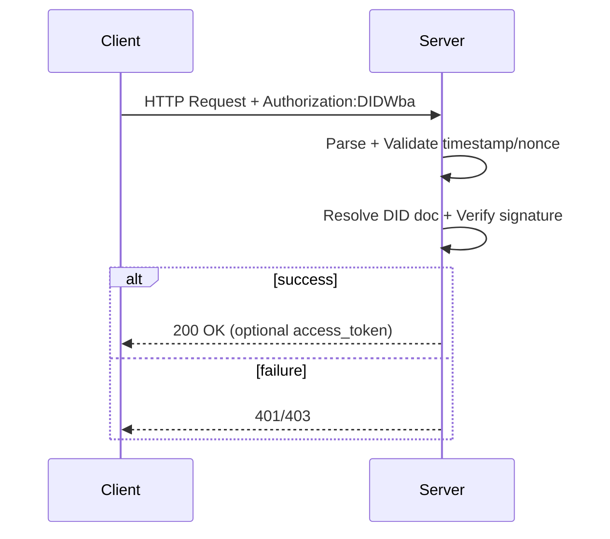

# ANP 身份与认证（did:wba）

本页提供可直接编码的最小认证实现，覆盖 DID 格式、请求头签名、服务端校验与错误处理。

## 核心原则 (Key Principles)

### 1. 去中心化身份验证 (Decentralized Authentication)

- 基于 W3C DID 标准，智能体拥有自主控制的数字身份
- 无需中心化认证机构，通过公钥密码学实现端到端认证
- DID 文档**必须 (MUST)** 可通过域名解析获取

### 2. 请求签名验证 (Request Signature Verification)

- 所有敏感请求**必须 (MUST)** 携带有效的数字签名
- 签名**必须 (MUST)** 覆盖请求的关键参数（nonce、timestamp、did、service）
- 服务端**必须 (MUST)** 验证签名的有效性和时效性

### 3. 重放攻击防护 (Replay Attack Prevention)

- 每个请求**必须 (MUST)** 包含唯一的 nonce 值
- 服务端**必须 (MUST)** 缓存已使用的 nonce 并拒绝重复请求
- timestamp **必须 (MUST)** 在合理的时间窗口内（**建议 SHOULD** 60秒）

### 4. 最小权限原则 (Principle of Least Privilege)

- 服务端**应该 (SHOULD)** 对不同 DID 实施细粒度的访问控制
- 仅授予完成特定操作所需的最小权限
- 敏感操作**应该 (SHOULD)** 要求额外的授权确认

## 1. DID 格式

```
did:wba:{domain}:{path}
```

示例：
```
did:wba:grand-hotel.com:service:hotel-assistant
```

## 2. DID 文档最小字段

服务端**必须 (MUST)** 能解析包含认证公钥的 DID 文档。最小可用字段：

```json
{
  "id": "did:wba:example.com:user:alice",
  "verificationMethod": [
    {
      "id": "did:wba:example.com:user:alice#key-1",
      "type": "EcdsaSecp256r1VerificationKey2019",
      "controller": "did:wba:example.com:user:alice",
      "publicKeyJwk": {"kty": "EC", "crv": "P-256", "x": "...", "y": "..."}
    }
  ],
  "authentication": ["did:wba:example.com:user:alice#key-1"]
}
```

### 2.1 DID 文档字段表（最小）

| 字段 | 类型 | 要求级别 | 说明 |
| --- | --- | --- | --- |
| id | string | **必须 MUST** | DID 标识 |
| verificationMethod[].id | string | **必须 MUST** | 验证方法 ID（含 fragment） |
| verificationMethod[].type | string | **必须 MUST** | 公钥类型 |
| verificationMethod[].controller | string | **必须 MUST** | 控制者 DID |
| verificationMethod[].publicKeyJwk | object | **必须 MUST** | JWK 公钥 |
| authentication | array | **必须 MUST** | 允许用于认证的 verificationMethod 列表 |

## 3. HTTP 头部认证（最小实现）

### 3.1 客户端请求头

```
Authorization: DIDWba did="did:wba:example.com:user:alice", nonce="abc123", timestamp="2024-12-05T12:34:56Z", verification_method="key-1", signature="base64url(...)"
```

**必须 (MUST)** 包含的字段：
- `did`：客户端 DID
- `nonce`：随机字符串（**建议 SHOULD** 至少 16 字节）
- `timestamp`：ISO 8601 UTC 时间
- `verification_method`：DID 文档中的 key fragment（如 `key-1`）
- `signature`：对签名输入的签名

### 3.1.1 请求头字段表

| 字段 | 类型 | 要求级别 | 说明 |
| --- | --- | --- | --- |
| did | string | **必须 MUST** | 客户端 DID |
| nonce | string | **必须 MUST** | 随机字符串，**必须 MUST** 唯一 |
| timestamp | string | **必须 MUST** | ISO 8601 UTC 时间 |
| verification_method | string | **必须 MUST** | DID 文档中的 key fragment |
| signature | string | **必须 MUST** | Base64URL 编码签名 |

### 3.2 签名输入（最小）

客户端构造如下 JSON，做 JCS 规范化后签名：

```json
{
  "nonce": "abc123",
  "timestamp": "2024-12-05T12:34:56Z",
  "service": "example.com",
  "did": "did:wba:example.com:user:alice"
}
```

签名流程：
1. JCS 规范化 JSON
2. SHA-256 哈希
3. 私钥签名
4. Base64URL 编码作为 `signature`

### 3.3 服务端校验步骤

服务端**必须 (MUST)** 按以下步骤验证请求：

1. 校验 `timestamp`（**建议 SHOULD** 允许 60 秒时间窗）
2. 校验 `nonce` 是否重复（服务端**必须 MUST** 缓存已使用 nonce）
3. 校验 DID 是否具备访问权限
4. 解析 DID 文档，找到 `verification_method` 对应公钥
5. 复现签名输入并验签

任何一步失败**必须 (MUST)** 返回 401 或 403 错误。

## 4. Access Token（可选优化）

服务端**可以 (MAY)** 实施 Access Token 优化：

- 初次校验通过后**可以 (MAY)** 返回 `Authorization: Bearer <access_token>`
- 后续请求**可以 (MAY)** 只校验 access token，避免重复签名验证
- Access token **应该 (SHOULD)** 设置合理的过期时间

## 5. JSON 体内认证（非 HTTP 场景）

当无法设置 HTTP 头时，可在请求体中携带认证字段：

```json
{
  "did": "did:wba:example.com:user:alice",
  "nonce": "abc123",
  "timestamp": "2024-12-05T12:34:56Z",
  "verification_method": "key-1",
  "signature": "base64url(...)"
}
```

校验流程与 HTTP 头一致。

## 6. 错误响应（最小）

- `401 Unauthorized`：签名、时间戳、nonce 校验失败
- `403 Forbidden`：DID 无权限访问资源

建议在 `WWW-Authenticate` 中返回：

```
WWW-Authenticate: Bearer method="DIDWba", error="invalid_nonce", error_description="Nonce has already been used.", nonce="new_nonce"
```

### 6.1 错误码表（建议）

| HTTP 状态码 | error | 场景 |
| --- | --- | --- |
| 401 | invalid_nonce | nonce 已使用或不存在 |
| 401 | invalid_timestamp | 时间戳超出允许范围 |
| 401 | invalid_signature | 签名校验失败 |
| 401 | invalid_access_token | access token 无效或过期 |
| 403 | forbidden | DID 无权限访问资源 |

## 7. 认证请求状态机（服务端）

```text
Start
  -> ParseAuthorization
  -> ValidateTimestamp
  -> ValidateNonce
  -> ResolveDidDoc
  -> VerifySignature
  -> Authorized
  -> IssueAccessToken (optional)

Any step failed -> Rejected(401/403)
```

## 8. 认证时序图（最小）



## 9. 最小实现清单

实现 `did:wba` 认证的服务端**必须 (MUST)** 提供：

- DID 文档解析能力
- `Authorization: DIDWba ...` 请求头解析
- JCS 规范化 + SHA-256 哈希 + 签名验证
- nonce 缓存与去重机制
- timestamp 时间窗校验（**建议 SHOULD** 60秒）
- 基于 DID 的访问控制（返回 403 拒绝无权限请求）

客户端**必须 (MUST)** 提供：

- DID 密钥对生成与管理
- 请求签名生成能力
- 唯一 nonce 生成机制

## 10. 安全考虑 (Security Considerations)

### 10.1 时间同步攻击 (Time Synchronization Attack)

**风险**：攻击者利用服务器时钟偏移绕过 timestamp 校验。

**防护措施**：
- 服务端**必须 (MUST)** 使用 NTP 或类似机制保持时钟准确
- **建议 (SHOULD)** 将时间窗口设置为 60 秒以平衡安全性和可用性
- **不应 (SHOULD NOT)** 接受未来时间戳的请求

### 10.2 Nonce 重放攻击 (Nonce Replay Attack)

**风险**：攻击者捕获合法请求并重放。

**防护措施**：
- 服务端**必须 (MUST)** 维护 nonce 缓存并拒绝重复的 nonce
- nonce 缓存时长**必须 (MUST)** 大于 timestamp 时间窗口
- **建议 (SHOULD)** 使用高熵随机值（至少 128 位）作为 nonce

### 10.3 DID 文档劫持 (DID Document Hijacking)

**风险**：攻击者通过 DNS 劫持或中间人攻击篡改 DID 文档。

**防护措施**：
- DID 文档**必须 (MUST)** 通过 HTTPS 获取
- **应该 (SHOULD)** 验证 DID 文档的数字签名（如果提供）
- **可以 (MAY)** 实施 DID 文档缓存和版本校验机制

### 10.4 私钥泄露 (Private Key Compromise)

**风险**：私钥泄露导致身份被冒用。

**防护措施**：
- 客户端**必须 (MUST)** 安全存储私钥（使用密钥管理服务或硬件安全模块）
- **应该 (SHOULD)** 支持密钥轮换机制
- **应该 (SHOULD)** 在检测到异常访问时撤销受损密钥

### 10.5 侧信道攻击 (Side-Channel Attack)

**风险**：通过签名验证的时间差异推断签名信息。

**防护措施**：
- 签名验证**应该 (SHOULD)** 使用常数时间算法
- **不应 (SHOULD NOT)** 在错误消息中泄露签名验证的详细信息

## 了解更多 (Learn More)

- **访问控制实践**：参见 [06-ANP-安全与隐私实践.md](./06-ANP-安全与隐私实践.md)
- **完整协议规范**：参见 [03-did-wba方法规范.md](../03-did-wba方法规范.md)
- **智能体描述中的安全配置**：参见 [03-ANP-智能体描述协议.md](./03-ANP-智能体描述协议.md)

## 参考规范

- `../03-did-wba方法规范.md`
