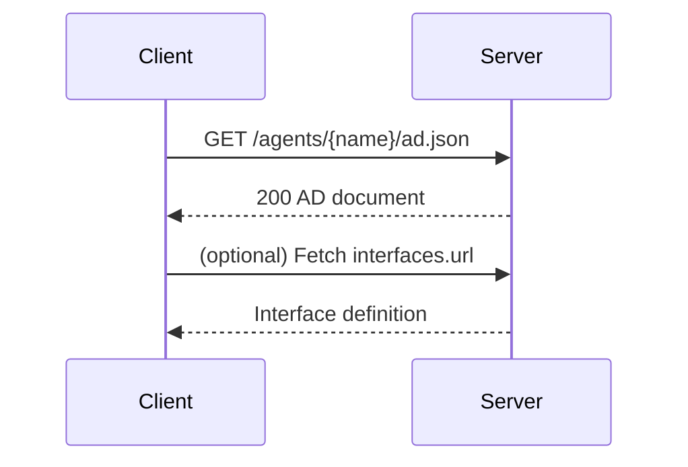

# ANP 智能体描述协议（ADP）

智能体描述协议（Agent Description Protocol, ADP）定义了智能体的"对外入口文档"。实现者只要发布一份规范的 AD 文档，其他智能体即可据此发现能力、接口与安全要求。


## 核心原则 (Key Principles)

### 1. 自描述能力 (Self-Describing Capability)

- AD 文档**必须 (MUST)** 完整描述智能体的身份、能力和接口
- 客户端**应该 (SHOULD)** 仅依赖 AD 文档即可理解如何与智能体交互
- AD 文档**应该 (SHOULD)** 采用标准化的 JSON 格式，便于机器解析

### 2. 协议复用与兼容 (Protocol Reusability)

- AD 支持引用现有协议描述（OpenRPC、JSON-RPC、YAML 等）
- **不应 (SHOULD NOT)** 重新发明已有的接口描述标准
- 支持 MCP Server 描述的互通（通过 `protocol: "MCP"`）

### 3. 安全优先设计 (Security-First Design)

- 所有 AD 文档**必须 (MUST)** 在 `securityDefinitions` 中声明认证方案
- 敏感接口**应该 (SHOULD)** 启用 `humanAuthorization` 要求人类确认
- AD 文档本身**应该 (SHOULD)** 通过 HTTPS 提供

### 4. 信息最小披露 (Minimal Information Disclosure)

- AD 文档**应该 (SHOULD)** 仅公开完成交互所需的最小信息
- 内部实现细节**不应 (SHOULD NOT)** 暴露在 AD 中
- 敏感字段（如内部 API 密钥）**必须不得 (MUST NOT)** 包含在 AD 中

## 1. 文档位置与获取

- **推荐 (SHOULD)** 路径：`https://{domain}/agents/{agent-name}/ad.json`
- MIME 类型**必须 (MUST)** 为：`application/json`
- **建议 (SHOULD)** 将 AD 文档 URL 放入发现入口 `/.well-known/agent-descriptions`
- AD 文档**必须 (MUST)** 通过 HTTPS 提供

## 2. AD 文档最小字段

**必须 (MUST)** 包含的字段：
- `protocolType`：固定值 `ANP`
- `protocolVersion`：当前 `1.0.0`
- `type`：固定值 `AgentDescription`
- `name`
- `securityDefinitions`
- `security`

**建议 (SHOULD)** 包含的字段：
- `url`、`did`、`owner`、`description`、`created`
- `Infomations`、`interfaces`

### 2.1 AD 文档字段表（最小）

| 字段 | 类型 | 要求级别 | 说明 |
| --- | --- | --- | --- |
| protocolType | string | **必须 MUST** | 固定值 `ANP` |
| protocolVersion | string | **必须 MUST** | 当前 `1.0.0` |
| type | string | **必须 MUST** | 固定值 `AgentDescription` |
| name | string | **必须 MUST** | 智能体名称 |
| securityDefinitions | object | **必须 MUST** | 鉴权方案定义 |
| security | string | **必须 MUST** | 启用的鉴权方案名称 |
| url | string | **应该 SHOULD** | AD 文档地址 |
| did | string | **应该 SHOULD** | 智能体 DID |
| owner | object | **可以 MAY** | 拥有者信息 |
| description | string | **应该 SHOULD** | 描述 |
| created | string | **可以 MAY** | ISO 8601 时间 |
| Infomations | array | **可以 MAY** | 信息资源列表 |
| interfaces | array | **应该 SHOULD** | 接口列表 |

### 最小示例

```json
{
  "protocolType": "ANP",
  "protocolVersion": "1.0.0",
  "type": "AgentDescription",
  "url": "https://grand-hotel.com/agents/hotel-assistant/ad.json",
  "name": "Grand Hotel Assistant",
  "did": "did:wba:grand-hotel.com:service:hotel-assistant",
  "securityDefinitions": {
    "didwba_sc": {"scheme": "didwba", "in": "header", "name": "Authorization"}
  },
  "security": "didwba_sc",
  "Infomations": [],
  "interfaces": []
}
```

## 3. Infomations（信息资源）

用于公开数据或资源入口，常见类型：`Product`、`Information`、`VideoObject`。

```json
{
  "type": "Information",
  "description": "Hotel policies and check-in info",
  "url": "https://grand-hotel.com/info/policies.json"
}
```

### 3.1 Information 字段表

| 字段 | 类型 | 必需 | 说明 |
| --- | --- | --- | --- |
| type | string | 是 | 信息类型 |
| description | string | 否 | 说明 |
| url | string | 是 | 资源地址 |

## 4. Interfaces（接口）

接口分两类：
- `NaturalLanguageInterface`：自然语言交互入口
- `StructuredInterface`：结构化接口（推荐）

最小字段：
- `type`、`protocol`、`version`、`url`、`description`
- `humanAuthorization`（敏感操作建议启用）

```json
{
  "type": "StructuredInterface",
  "protocol": "openrpc",
  "version": "1.0.0",
  "url": "https://grand-hotel.com/api/openrpc.json",
  "description": "Booking and order APIs",
  "humanAuthorization": true
}
```

支持的 `protocol`（示例）：
- `openrpc`、`JSON-RPC`
- `YAML`（自然语言接口描述）
- `MCP`（用于互通 MCP Server 描述）

### 4.1 Interface 字段表

| 字段 | 类型 | 必需 | 说明 |
| --- | --- | --- | --- |
| type | string | 是 | `NaturalLanguageInterface` 或 `StructuredInterface` |
| protocol | string | 是 | 接口协议 |
| version | string | 是 | 协议版本 |
| url | string | 是 | 接口描述地址 |
| description | string | 否 | 接口说明 |
| humanAuthorization | boolean | 否 | 是否需要人类授权 |

### 4.2 securityDefinitions 字段表（最小）

| 字段 | 类型 | 必需 | 说明 |
| --- | --- | --- | --- |
| scheme | string | 是 | `didwba` |
| in | string | 是 | `header` |
| name | string | 是 | `Authorization` |

## 5. 校验规则（最小）

- `protocolType` 必须为 `ANP`
- `type` 必须为 `AgentDescription`
- `security` 必须引用 `securityDefinitions` 中已定义的条目
- `interfaces` 中的 `url` 必须可访问

### 5.1 错误码表（获取 AD 文档）

| HTTP 状态码 | 错误场景 | 处理建议 |
| --- | --- | --- |
| 404 | AD 文档不存在 | 回退到发现入口重新拉取 |
| 410 | AD 已下线 | 移除缓存与索引 |
| 500 | 服务端异常 | 退避重试 |

## 6. 客户端处理状态机（最小）

```text
Start
  -> FetchAD
  -> ValidateFields
  -> ResolveInterfaces
  -> Ready

FetchAD failed -> Retry/Abort
ValidateFields failed -> Reject
```

### 6.1 获取 AD 时序图（最小）



## 7. 接口描述文件示例（OpenRPC / JSON-RPC）

### 7.1 OpenRPC 示例

```json
{
  "openrpc": "1.2.6",
  "info": {
    "title": "Hotel Booking API",
    "version": "1.0.0"
  },
  "servers": [
    {"name": "prod", "url": "https://grand-hotel.com/api"}
  ],
  "methods": [
    {
      "name": "booking.create",
      "summary": "Create a booking",
      "params": [
        {"name": "room_id", "schema": {"type": "string"}, "required": true},
        {"name": "check_in", "schema": {"type": "string", "format": "date"}, "required": true},
        {"name": "check_out", "schema": {"type": "string", "format": "date"}, "required": true}
      ],
      "result": {
        "name": "result",
        "schema": {
          "type": "object",
          "properties": {
            "booking_id": {"type": "string"},
            "status": {"type": "string"}
          },
          "required": ["booking_id", "status"]
        }
      }
    }
  ]
}
```

### 7.2 JSON-RPC 调用示例

```json
{
  "request": {
    "jsonrpc": "2.0",
    "id": "req-1",
    "method": "booking.create",
    "params": {
      "room_id": "deluxe-001",
      "check_in": "2025-01-17",
      "check_out": "2025-01-19"
    }
  },
  "response": {
    "jsonrpc": "2.0",
    "id": "req-1",
    "result": {
      "booking_id": "bk_123",
      "status": "CONFIRMED"
    }
  }
}
```

> 在 AD 文档的 `interfaces.url` 中指向 OpenRPC 描述文件即可。

## 8. 最小实现步骤

服务端**必须 (MUST)** 完成以下步骤：

1. 生成 AD 文档 JSON 并部署为静态文件（**必须 MUST** 通过 HTTPS）
2. 在 `/.well-known/agent-descriptions` 中列出 AD 文档 URL（**应该 SHOULD**）
3. 将对外 API 或接口描述文件放入 `interfaces`（**应该 SHOULD**）
4. 启用 `did:wba` 鉴权（参见 [02-ANP-身份与认证-did-wba.md](./02-ANP-身份与认证-did-wba.md)）

## 9. 安全考虑 (Security Considerations)

### 9.1 AD 文档篡改 (AD Document Tampering)

**风险**：攻击者篡改 AD 文档,诱导客户端访问恶意接口。

**防护措施**：
- AD 文档**必须 (MUST)** 通过 HTTPS 提供
- **应该 (SHOULD)** 对 AD 文档实施完整性保护（如数字签名）
- 客户端**应该 (SHOULD)** 缓存 AD 文档并检测异常变更

### 9.2 敏感信息泄露 (Sensitive Information Disclosure)

**风险**：AD 文档暴露内部实现细节或敏感配置。

**防护措施**：
- **必须不得 (MUST NOT)** 在 AD 中包含 API 密钥、私钥等敏感信息
- **应该 (SHOULD)** 仅公开必要的接口和字段
- **应该 (SHOULD)** 对内部接口使用单独的 AD 文档并限制访问

### 9.3 接口劫持 (Interface Hijacking)

**风险**：`interfaces.url` 指向的接口描述文件被劫持。

**防护措施**：
- 接口描述文件**必须 (MUST)** 通过 HTTPS 提供
- **应该 (SHOULD)** 验证接口描述文件的来源域名
- **可以 (MAY)** 对接口描述文件实施签名验证

### 9.4 未授权访问 (Unauthorized Access)

**风险**：未经授权的客户端访问敏感接口。

**防护措施**：
- 所有敏感接口**必须 (MUST)** 在 `securityDefinitions` 中声明认证要求
- 高风险操作**应该 (SHOULD)** 启用 `humanAuthorization`
- 服务端**必须 (MUST)** 严格执行访问控制策略

## 了解更多 (Learn More)

- **身份认证配置**：参见 [02-ANP-身份与认证-did-wba.md](./02-ANP-身份与认证-did-wba.md)
- **发现机制**：参见 [04-ANP-智能体发现协议.md](./04-ANP-智能体发现协议.md)
- **安全最佳实践**：参见 [06-ANP-安全与隐私实践.md](./06-ANP-安全与隐私实践.md)

## 参考规范

- `../07-ANP-智能体描述协议规范.md`
