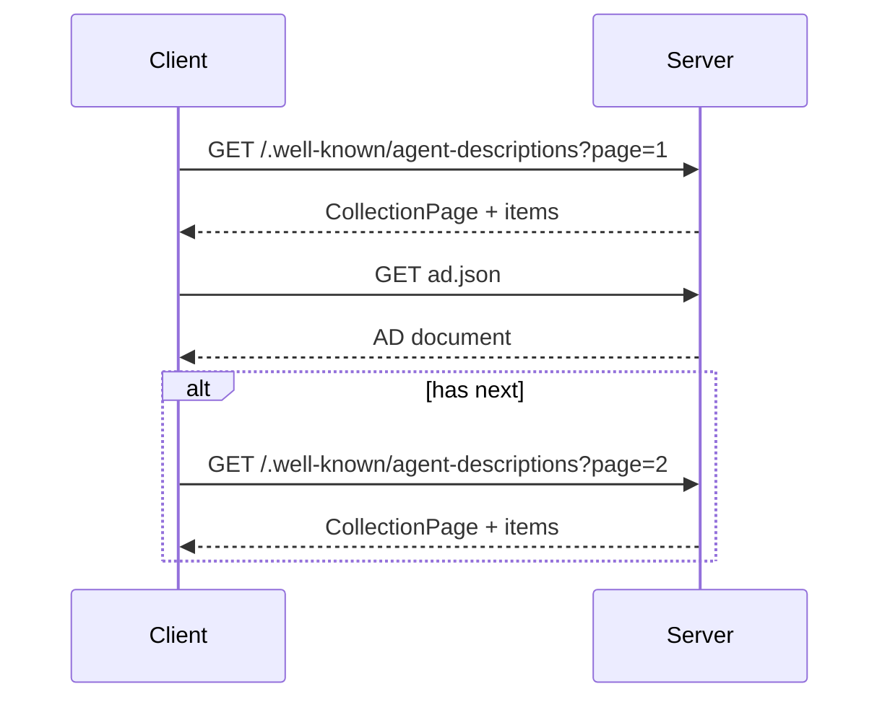

# ANP 智能体发现协议

智能体发现协议提供统一的入口,让搜索服务或其他智能体在"只知道域名"的情况下找到该域名下的智能体描述文档（AD）。


## 核心原则 (Key Principles)

### 1. 标准化发现入口 (Standardized Discovery Endpoint)

- **必须 (MUST)** 使用 `.well-known` 标准路径提供发现入口
- 遵循 RFC 8615 规范,确保与现有 Web 基础设施兼容
- 客户端**应该 (SHOULD)** 优先尝试主动发现机制

### 2. 分页与可扩展性 (Pagination & Scalability)

- 支持大量智能体的分页列举
- **应该 (SHOULD)** 提供 `next` 字段支持分页
- 客户端**必须 (MUST)** 能够处理分页响应

### 3. JSON-LD 语义化 (JSON-LD Semantics)

- 采用 JSON-LD 格式提供语义化元数据
- **必须 (MUST)** 使用 `CollectionPage` 类型
- 支持与语义网技术栈的互操作

## 1. 主动发现（.well-known）

**入口路径**：
```
https://{domain}/.well-known/agent-descriptions
```

**响应类型**：JSON-LD `CollectionPage`

服务端**必须 (MUST)** 返回符合以下格式的响应。

### 最小响应示例

```json
{
  "@context": {
    "@vocab": "https://schema.org/",
    "ad": "https://agent-network-protocol.com/ad#"
  },
  "@type": "CollectionPage",
  "url": "https://agent-network-protocol.com/.well-known/agent-descriptions",
  "items": [
    {"@type": "ad:AgentDescription", "name": "Hotel Assistant", "@id": "https://agent-network-protocol.com/agents/hotel/ad.json"}
  ]
}
```

### 1.1 CollectionPage 字段表

| 字段 | 类型 | 要求级别 | 说明 |
| --- | --- | --- | --- |
| @context | object | **必须 MUST** | JSON-LD 上下文 |
| @type | string | **必须 MUST** | 固定值 `CollectionPage` |
| url | string | **必须 MUST** | 当前页面 URL |
| items | array | **必须 MUST** | AD 列表 |
| next | string | **可以 MAY** | 下一页 URL（分页时提供） |

### 1.2 items 项字段表

| 字段 | 类型 | 要求级别 | 说明 |
| --- | --- | --- | --- |
| @type | string | **必须 MUST** | 固定值 `ad:AgentDescription` |
| name | string | **必须 MUST** | 智能体名称 |
| @id | string | **必须 MUST** | AD 文档 URL |

### 分页

当 items 数量较多时**应该 (SHOULD)** 返回 `next`：

```json
{
  "next": "https://agent-network-protocol.com/.well-known/agent-descriptions?page=2"
}
```

客户端**必须 (MUST)** 循环拉取直到 `next` 缺失。

## 2. 被动发现（注册 API）

- 由搜索服务智能体提供注册接口（**可选 MAY**）
- 注册接口位置**应该 (SHOULD)** 在其 AD 文档的 `interfaces` 中声明
- 注册数据**必须 (MUST)** 包含最小字段：`did` + `ad_url`

### 2.1 注册请求字段表（最小）

| 字段 | 类型 | 要求级别 | 说明 |
| --- | --- | --- | --- |
| did | string | **必须 MUST** | 智能体 DID |
| ad_url | string | **必须 MUST** | AD 文档 URL |

## 3. 服务器端实现步骤（最小）

服务端**必须 (MUST)** 完成以下步骤：

1. 维护 AD 文档列表（静态文件或数据库）
2. 在 `/.well-known/agent-descriptions` 生成 `CollectionPage`
3. 支持分页（**建议 SHOULD** 使用 `page` + `page_size` 参数）
4. **可以 (MAY)** 添加 `ETag` 与 `Cache-Control` HTTP 头优化缓存

## 4. 客户端实现步骤（最小）

客户端**必须 (MUST)** 完成以下步骤：

1. 请求 `/.well-known/agent-descriptions`
2. 解析 `items` 中的 `@id`（AD URL）
3. 拉取 AD 文档并校验字段
4. 处理分页（循环拉取直到 `next` 为空）

## 5. 错误处理（最小）

### 5.1 错误码表

| HTTP 状态码 | 场景 | 处理建议 |
| --- | --- | --- |
| 400 | 分页参数非法 | 修正参数后重试 |
| 404 | 未提供发现入口 | 回退为被动发现或手动配置 |
| 429 | 访问过频 | 退避重试 |
| 500 | 服务异常 | 退避重试 |

## 6. 客户端发现状态机（最小）

```text
Start
  -> RequestPage
  -> ParseItems
  -> FetchAD
  -> HasNext? -> RequestPage
  -> Done

RequestPage failed -> Retry/Abort
ParseItems failed -> Skip/Abort
```

## 7. 发现时序图（最小）



## 8. 安全考虑 (Security Considerations)

### 8.1 发现入口欺骗 (Discovery Endpoint Spoofing)

**风险**：攻击者通过 DNS 劫持或中间人攻击返回恶意 AD 列表。

**防护措施**：
- 发现入口**必须 (MUST)** 通过 HTTPS 访问
- 客户端**应该 (SHOULD)** 验证 TLS 证书有效性
- **应该 (SHOULD)** 对发现结果实施信誉评分或白名单机制

### 8.2 拒绝服务攻击 (Denial of Service)

**风险**：恶意客户端频繁请求发现入口导致服务过载。

**防护措施**：
- 服务端**应该 (SHOULD)** 实施速率限制（返回 429 状态码）
- **应该 (SHOULD)** 使用 CDN 或缓存减轻服务器负载
- **可以 (MAY)** 要求客户端认证以访问发现入口

### 8.3 隐私泄露 (Privacy Leakage)

**风险**：发现入口暴露内部或敏感智能体信息。

**防护措施**：
- **不应 (SHOULD NOT)** 在公开发现入口中列出内部智能体
- 敏感智能体**应该 (SHOULD)** 使用单独的、受访问控制的发现入口
- **可以 (MAY)** 对发现入口实施基于 DID 的访问控制

### 8.4 AD URL 劫持 (AD URL Hijacking)

**风险**：`items[].@id` 指向的 AD URL 被劫持或篡改。

**防护措施**：
- AD URL **必须 (MUST)** 使用 HTTPS
- 客户端**应该 (SHOULD)** 验证 AD URL 的域名与发现入口的域名一致（或在可信域名列表中）
- **应该 (SHOULD)** 对获取的 AD 文档进行签名验证

## 了解更多 (Learn More)

- **AD 文档格式**：参见 [03-ANP-智能体描述协议.md](./03-ANP-智能体描述协议.md)
- **身份认证**：参见 [02-ANP-身份与认证-did-wba.md](./02-ANP-身份与认证-did-wba.md)
- **安全最佳实践**：参见 [06-ANP-安全与隐私实践.md](./06-ANP-安全与隐私实践.md)

## 参考规范

- `../08-ANP-智能体发现协议规范.md`
