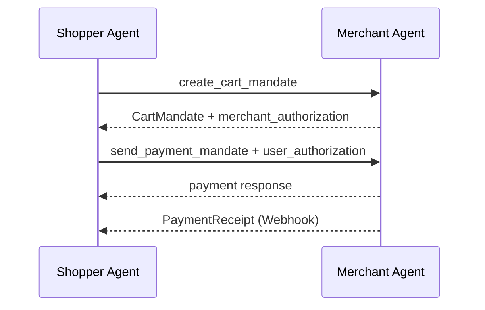

# ANP 智能体支付协议（AP2）

本页提供 AP2 的最小可用实现（M1），聚焦二维码支付场景与基础凭证链路，确保实现者能直接按文档编码。


## 核心原则 (Key Principles)

### 1. 凭证链完整性 (Credential Chain Integrity)

- **必须 (MUST)** 维护完整的凭证链：CartMandate → PaymentMandate → PaymentReceipt
- 每个凭证**必须 (MUST)** 通过哈希值引用前序凭证
- 任何一环断裂**必须 (MUST)** 终止交易并告警

### 2. 双向授权确认 (Bilateral Authorization)

- 商户**必须 (MUST)** 签名 CartMandate 和 PaymentReceipt
- 用户**必须 (MUST)** 签名 PaymentMandate
- 所有签名**必须 (MUST)** 使用 JWS 格式并包含完整的 JWT claims

### 3. 防重放与幂等性 (Replay Protection & Idempotency)

- 每个凭证**必须 (MUST)** 包含唯一的 `jti` (JWT ID)
- 服务端**必须 (MUST)** 缓存 `jti` 并拒绝重复请求
- 所有 API **必须 (MUST)** 支持幂等性（基于 `messageId`）

### 4. 支付方式灵活性 (Payment Method Flexibility)

- 支持多种支付方式（二维码、银行卡、数字货币等）
- **必须 (MUST)** 通过 `method_data[]` 数组声明支持的支付方式
- 客户端**可以 (MAY)** 选择任意支持的支付方式

## 1. 最小实现范围（M1）

- 支持二维码支付（ALIPAY / WECHAT）
- 实现 `CartMandate`、`PaymentMandate`、`PaymentReceipt`
- 基础签名校验（JWS）
- 使用 `did:wba` 完成身份认证
- 支持 Webhook 接收支付凭证

> `FulfillmentReceipt` 可选，适用于履约确认场景。

## 2. 角色定义

- **SA（Shopper Agent）**：代表用户发起购买与支付授权
- **MA（Merchant Agent）**：返回购物车授权、确认支付
- **CP/PP**：最小实现中可与 SA 或 MA 合并

## 3. 核心凭证与数据结构

### 3.1 CartMandate（MA → SA）

关键字段：
- `contents.id`
- `contents.timestamp`
- `contents.payment_request.method_data[]`
- `contents.payment_request.details.total`
- `merchant_authorization`（JWS）

简化示例：

```json
{
  "contents": {
    "id": "cart-123",
    "timestamp": "2025-01-17T09:00:00Z",
    "payment_request": {
      "method_data": [
        {
          "supported_methods": "QR_CODE",
          "data": {
            "channel": "ALIPAY",
            "qr_url": "https://pay.example.com/qrcode/abc123",
            "out_trade_no": "order_20250117_123456",
            "expires_at": "2025-01-17T09:15:00Z"
          }
        }
      ],
      "details": {
        "id": "order-123",
        "total": {"label": "Total", "amount": {"currency": "CNY", "value": 120.0}}
      }
    }
  },
  "merchant_authorization": "<jws>"
}
```

**签名要点**：
- `cart_hash = Base64URL(SHA-256(JCS(contents)))`
- `merchant_authorization` 的 payload 必须包含 `cart_hash`

#### 3.1.1 CartMandate 字段表（最小）

| 字段 | 类型 | 必需 | 说明 |
| --- | --- | --- | --- |
| contents.id | string | 是 | 购物车唯一标识 |
| contents.timestamp | string | 是 | ISO 8601 时间 |
| contents.payment_request.method_data[] | array | 是 | 支付方式数组 |
| contents.payment_request.method_data[].supported_methods | string | 是 | `QR_CODE` |
| contents.payment_request.method_data[].data.channel | string | 是 | `ALIPAY`/`WECHAT` |
| contents.payment_request.method_data[].data.qr_url | string | 是 | 二维码 URL |
| contents.payment_request.method_data[].data.out_trade_no | string | 是 | 交易号 |
| contents.payment_request.method_data[].data.expires_at | string | 是 | 过期时间 |
| contents.payment_request.details.id | string | 是 | 订单 ID |
| contents.payment_request.details.total.amount.currency | string | 是 | 币种 |
| contents.payment_request.details.total.amount.value | number | 是 | 金额 |
| merchant_authorization | string | 是 | JWS 签名 |

### 3.2 PaymentMandate（SA → MA）

关键字段：
- `payment_mandate_contents.payment_mandate_id`
- `payment_mandate_contents.payment_details_id`
- `payment_mandate_contents.payment_response`
- `payment_mandate_contents.cart_hash`
- `user_authorization`（JWS）

```json
{
  "payment_mandate_contents": {
    "payment_mandate_id": "pm_12345",
    "payment_details_id": "order-123",
    "payment_details_total": {"label": "Total", "amount": {"currency": "CNY", "value": 120.0}},
    "payment_response": {
      "method_name": "QR_CODE",
      "details": {"channel": "ALIPAY", "out_trade_no": "order_20250117_123456"}
    },
    "timestamp": "2025-01-17T09:05:00Z",
    "cart_hash": "<b64url>"
  },
  "user_authorization": "<jws>"
}
```

**签名要点**：
- `pmt_hash = Base64URL(SHA-256(JCS(payment_mandate_contents)))`
- `user_authorization` payload 必须包含 `pmt_hash`

#### 3.2.1 PaymentMandate 字段表（最小）

| 字段 | 类型 | 必需 | 说明 |
| --- | --- | --- | --- |
| payment_mandate_contents.payment_mandate_id | string | 是 | 支付授权 ID |
| payment_mandate_contents.payment_details_id | string | 是 | 订单 ID |
| payment_mandate_contents.payment_details_total.amount.currency | string | 是 | 币种 |
| payment_mandate_contents.payment_details_total.amount.value | number | 是 | 金额 |
| payment_mandate_contents.payment_response.method_name | string | 是 | `QR_CODE` |
| payment_mandate_contents.payment_response.details.channel | string | 是 | `ALIPAY`/`WECHAT` |
| payment_mandate_contents.payment_response.details.out_trade_no | string | 是 | 交易号 |
| payment_mandate_contents.timestamp | string | 是 | ISO 8601 时间 |
| payment_mandate_contents.cart_hash | string | 是 | CartMandate 哈希 |
| user_authorization | string | 是 | JWS 签名 |

### 3.3 PaymentReceipt（MA → SA，Webhook）

```json
{
  "contents": {
    "credential_type": "PaymentReceipt",
    "version": 1,
    "id": "receipt-001",
    "timestamp": "2025-01-17T09:10:00Z",
    "payment_mandate_id": "pm_12345",
    "provider": "ALIPAY",
    "status": "SUCCEEDED",
    "transaction_id": "alipay_txn_789",
    "out_trade_no": "order_20250117_123456",
    "paid_at": "2025-01-17T09:08:30Z",
    "amount": {"currency": "CNY", "value": 120.0},
    "pmt_hash": "<b64url>"
  },
  "merchant_authorization": "<jws>"
}
```

#### 3.3.1 PaymentReceipt 字段表（最小）

| 字段 | 类型 | 必需 | 说明 |
| --- | --- | --- | --- |
| contents.credential_type | string | 是 | 固定值 `PaymentReceipt` |
| contents.version | number | 是 | 当前 `1` |
| contents.id | string | 是 | 凭证 ID |
| contents.timestamp | string | 是 | ISO 8601 时间 |
| contents.payment_mandate_id | string | 是 | PaymentMandate ID |
| contents.provider | string | 是 | 支付提供商 |
| contents.status | string | 是 | `SUCCEEDED`/`FAILED`/`PENDING` |
| contents.transaction_id | string | 是 | 支付平台交易号 |
| contents.out_trade_no | string | 是 | 交易号 |
| contents.paid_at | string | 是 | 支付完成时间 |
| contents.amount.currency | string | 是 | 币种 |
| contents.amount.value | number | 是 | 金额 |
| contents.pmt_hash | string | 是 | PaymentMandate 哈希 |
| merchant_authorization | string | 是 | JWS 签名 |

#### 3.4 JWS Payload 字段表（最小）

| 字段 | 类型 | 必需 | 说明 |
| --- | --- | --- | --- |
| iss | string | 是 | 签发者 DID |
| sub | string | 是 | 主体 DID |
| aud | string | 是 | 受众 DID |
| iat | number | 是 | 签发时间（秒） |
| exp | number | 是 | 过期时间（秒） |
| jti | string | 是 | 唯一 ID |
| cart_hash / pmt_hash / cred_hash | string | 是 | 对应哈希字段 |

## 4. API 端点（最小）

### 4.1 create_cart_mandate

- `POST /ap2/merchant/create_cart_mandate`

请求（SA → MA）：

```json
{
  "messageId": "cart-request-001",
  "from": "did:wba:a.com:shopper",
  "to": "did:wba:a.com:merchant",
  "data": {
    "cart_mandate_id": "cart-123",
    "items": [{"id": "sku-1", "quantity": 1}],
    "shipping_address": {"recipient_name": "张三", "phone": "13800138000", "region": "北京市", "city": "北京市", "address_line": "朝阳区某某街道123号"}
  }
}
```

响应（MA → SA）：返回 `CartMandate`

#### 4.1.1 请求字段表（最小）

| 字段 | 类型 | 必需 | 说明 |
| --- | --- | --- | --- |
| messageId | string | 是 | 消息唯一 ID |
| from | string | 是 | 发起方 DID |
| to | string | 是 | 接收方 DID |
| data.cart_mandate_id | string | 是 | 购物车 ID |
| data.items[] | array | 是 | 商品列表 |
| data.items[].id | string | 是 | 商品 ID |
| data.items[].quantity | number | 是 | 数量 |
| data.shipping_address | object | 否 | 收货地址 |

### 4.2 send_payment_mandate

- `POST /ap2/merchant/send_payment_mandate`

请求（SA → MA）：

```json
{
  "messageId": "payment-mandate-001",
  "from": "did:wba:a.com:shopper",
  "to": "did:wba:a.com:merchant",
  "mandate_webhook_url": "https://shopper.example.com/ap2/webhook",
  "data": {"payment_mandate_contents": {}, "user_authorization": "<jws>"}
}
```

响应（MA → SA）：

```json
{"messageId": "payment-response-001", "data": {"status": "success", "payment_mandate_id": "pm_12345"}}
```

#### 4.2.1 请求字段表（最小）

| 字段 | 类型 | 必需 | 说明 |
| --- | --- | --- | --- |
| messageId | string | 是 | 消息唯一 ID |
| from | string | 是 | 发起方 DID |
| to | string | 是 | 接收方 DID |
| mandate_webhook_url | string | 是 | 接收凭证的 Webhook |
| data.payment_mandate_contents | object | 是 | PaymentMandate 内容 |
| data.user_authorization | string | 是 | JWS 签名 |

### 4.3 错误码表（最小）

| HTTP 状态码 | 场景 | 处理建议 |
| --- | --- | --- |
| 400 | 请求字段缺失/类型错误 | 修正后重试 |
| 401 | did:wba 鉴权失败 | 重新签名 |
| 409 | 重复的 messageId/jti | 幂等处理 |
| 422 | 哈希链不一致 | 终止并告警 |
| 500 | 服务端异常 | 退避重试 |

## 5. Webhook（最小）

- `POST {mandate_webhook_url}` 接收 `PaymentReceipt`
- 必须验证 `merchant_authorization`
- 返回 `200 OK` 表示接收成功

## 6. 校验与安全要点

- 所有 JWS 必须校验 `iss/sub/aud/iat/exp/jti` 与哈希字段
- 强制 HTTPS
- 对 `jti` 做去重防重放
- 校验 `expires_at` 与时间戳

## 7. 交易状态机（最小）

**SA 状态机**：

```text
Init
  -> CartRequested
  -> CartReceived
  -> PaymentSubmitted
  -> ReceiptReceived
  -> Done

Any error -> Failed
```

## 8. 交易时序图（最小）



**MA 状态机**：

```text
Init
  -> CartIssued
  -> PaymentReceived
  -> ReceiptSent
  -> Done

Any error -> Failed
```

## 9. 安全考虑 (Security Considerations)

### 9.1 凭证链篡改 (Credential Chain Tampering)

**风险**：攻击者篡改凭证链中的任意凭证,导致金额或商品信息被篡改。

**防护措施**：
- 所有凭证**必须 (MUST)** 使用 JWS 签名
- **必须 (MUST)** 验证凭证链的哈希完整性（`cart_hash`、`pmt_hash`）
- 任何哈希不匹配**必须 (MUST)** 立即终止交易并告警

### 9.2 支付重放攻击 (Payment Replay Attack)

**风险**：攻击者捕获合法的 PaymentMandate 并重放,导致重复扣款。

**防护措施**：
- 每个凭证**必须 (MUST)** 包含唯一的 `jti`
- 服务端**必须 (MUST)** 缓存所有 `jti` 并拒绝重复请求
- `jti` 缓存时长**应该 (SHOULD)** 至少为订单有效期

### 9.3 金额篡改 (Amount Tampering)

**风险**：攻击者修改支付金额或商品数量。

**防护措施**：
- 所有金额字段**必须 (MUST)** 包含在签名范围内
- 商户**必须 (MUST)** 验证 `PaymentMandate` 中的金额与 `CartMandate` 一致
- **不应 (SHOULD NOT)** 信任客户端提供的金额,始终以服务端为准

### 9.4 Webhook 伪造 (Webhook Forgery)

**风险**：攻击者伪造 PaymentReceipt 发送到 Webhook,诱导系统发货。

**防护措施**：
- Webhook **必须 (MUST)** 验证 `merchant_authorization` 签名
- **应该 (SHOULD)** 使用 HTTPS 并验证来源 IP 白名单
- **应该 (SHOULD)** 向支付提供商的 API 验证交易真实性

### 9.5 二维码劫持 (QR Code Hijacking)

**风险**：攻击者替换 `qr_url`,将用户引导到恶意支付页面。

**防护措施**：
- `qr_url` **必须 (MUST)** 使用 HTTPS
- **应该 (SHOULD)** 验证 `qr_url` 的域名在可信列表中
- **应该 (SHOULD)** 在 QR 码中包含订单摘要供用户确认

### 9.6 中间人攻击 (Man-in-the-Middle Attack)

**风险**：攻击者拦截并修改支付请求或响应。

**防护措施**：
- 所有 API 调用**必须 (MUST)** 使用 HTTPS
- **应该 (SHOULD)** 使用证书固定 (Certificate Pinning)
- **应该 (SHOULD)** 验证 TLS 证书的有效性

### 9.7 时间戳过期攻击 (Timestamp Expiry Attack)

**风险**：攻击者使用过期的凭证进行交易。

**防护措施**：
- 所有凭证**必须 (MUST)** 包含 `timestamp` 和 `exp` (过期时间)
- 服务端**必须 (MUST)** 验证凭证未过期
- `expires_at` (QR码过期时间) **应该 (SHOULD)** 设置为合理值(建议15分钟)

## 了解更多 (Learn More)

- **身份认证**：参见 [02-ANP-身份与认证-did-wba.md](./02-ANP-身份与认证-did-wba.md)
- **智能体描述**：参见 [03-ANP-智能体描述协议.md](./03-ANP-智能体描述协议.md)
- **安全最佳实践**：参见 [06-ANP-安全与隐私实践.md](./06-ANP-安全与隐私实践.md)

## 参考规范

- `../application/10-ANP-智能体支付协议规范.md`
