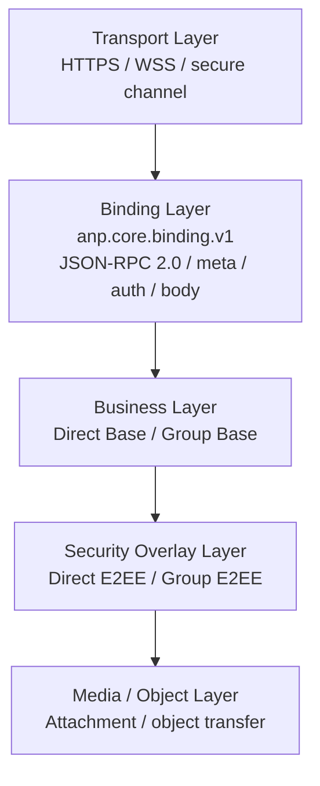
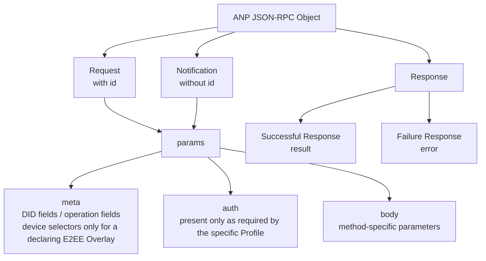
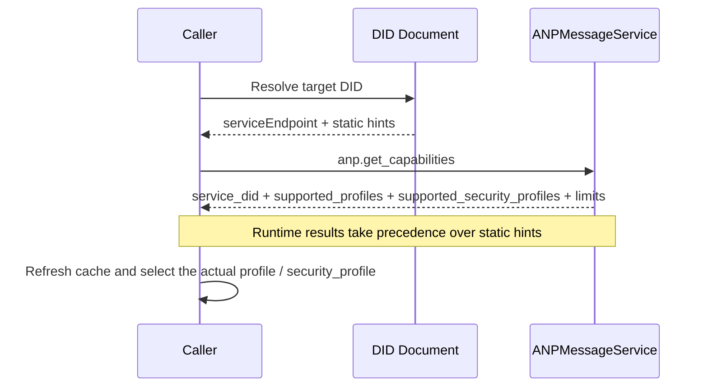

# ANP Profile 1: Core Binding

- Document ID: ANP-P1
- Title: Core Binding
- Status: Released
- Version: 1.2
- Specification Set: ANP Messaging 1.2
- Language: English
- Profile: `anp.core.binding.v1`
- Applicability: This profile applies to all ANP basic profiles and security overlay profiles.

---

## 1. Purpose

This Profile defines ANP's unified outer message bindings, common fields, capability negotiation, error models, and interoperability constraints.

The goals of this Profile are:

1. Provide a unified message envelope for all ANP methods;
2. Avoid repeatedly reinventing request, response, notification, and error formats for different application profiles;
3. Provide a common foundation for Profiles such as Direct Base, Group Base, Direct E2EE, Group E2EE, Attachment, Federation, etc.;
4. While retaining the basic compatibility of JSON-RPC 2.0, tighten the optional degrees of freedom and reduce cross-implementation ambiguity;
5. Keep ordinary Base messaging addressed by DID, while allowing a P5/P6-like E2EE Overlay to declare device selectors when endpoint-specific cryptographic binding is required.

---

## 2. Terminology and Normative Conventions

### 2.1 Normative Keywords

In this article, **MUST**, **MUST NOT**, **REQUIRED**, **SHALL**, **SHALL NOT**, **SHOULD**, **SHOULD NOT**, **RECOMMENDED**, **NOT RECOMMENDED**, **MAY**, **OPTIONAL** are interpreted as normative requirements according to their capitalized form.

### 2.2 Terminology

- **ANP Endpoint**: The protocol endpoint that implements ANP, usually the entrance service of the domain where the Agent is located, the group Host service, or other declared service endpoint.
- **Request**: JSON-RPC call object with `id`.
- **Notification**: JSON-RPC call object without `id`.
- **Result**: `result` member in the Successful Response object.
- **Error**: `error` member in the failure response object.
- **Profile**: ANP's protocol capability unit, such as `anp.direct.base.v1`.
- **Security Profile**: Security semantic unit of ANP, such as `transport-protected`, `direct-e2ee`, `group-e2ee`.
- **Operation**: A protocol action that can be recognized idempotently, such as sending a message, creating a group, adding a member, or submitting a group state change.
- **Message-bearing Operation**: Operation carrying application layer message payload, such as `direct.send`, `group.send`, `group.e2ee.send`.
- **Message-bearing Notification**: A notification used to carry an application-layer message payload, such as `direct.incoming`, `group.incoming`, or `group.e2ee.notice`.
- **Control Operation**: does not carry application layer business messages, but operations that change the protocol or business state, such as `group.create`, `group.add`, and `group.remove`.
- **Origin Proof**: Application layer origin proof generated by the business subject's private key and carried through `auth.origin_proof`.
- **Object Proof**: A verifiable object-level assertion made by object-embedded `proof` on the "entire object with `proof` removed".
- **Signed Request Object**: A shared normalized business object composed of `method`, `meta`, and `body` and used to calculate `contentDigest`.
- **Device Endpoint**: A cryptographic endpoint under an Agent DID, selected by an opaque device identifier only when a P5/P6-like device-addressed E2EE Overlay requires it. It is not a DID or a business participant.
- **Device Manifest**: The P2 DID-document structure that publishes the minimum public key references and Profile eligibility needed by P5/P6-like device-addressed E2EE Overlays. Base messaging does not use it.

---

## 3. Design Principles

### 3.1 Layering principle

ANP uses the following layering:

1. **Transport layer**: HTTP(S), WebSocket Secure and other secure transmission;
2. **Binding layer**: JSON-RPC 2.0 binding defined by this Profile;
3. **Business layer**: Business semantics such as Direct Base and Group Base;
4. **Security Overlay layer**: Direct E2EE, Group E2EE and other security semantics;
5. **Media/Object layer**: Large object extensions such as Attachment.

To help readers quickly build an overall mental model of ANP layering boundaries, the following diagram gives an overview from the transport layer to the media/object layer. Subsequent Profiles further constrain their own objects, flows, and requirements on top of this layering framework.



*Figure P1-1: ANP layering overview (non-normative).*

This diagram emphasizes responsibility boundaries rather than deployment topology: an implementation may merge multiple layers into the same service, but implementations should still preserve the semantic separation of these layers for cross-implementation interoperability.

### 3.2 Minimum interoperability principle

Different implementations can share the same as long as they meet this Profile constraint:

- Request/response format;
- Notification format;
- Common field semantics;
- Capacity negotiation methods;
- Error model;
- Idempotent processing principle.

### 3.3 Non-Goals

This Profile does not define the following capabilities:

- History pull;
- Read status;
- Device enrollment, naming, roles, synchronization, or internal fan-out;
- online status;
- Internal copy consistency;
- Specific E2EE algorithm.

These capabilities must be defined by other Profiles or explicitly stated as being outside the scope of the ANP standard.

Ordinary Direct Base, Group Base, and Attachment operations remain DID-addressed. They do not require or carry device selectors. Device selection becomes part of the wire protocol only when an owning Direct E2EE, Group E2EE, or future equivalent E2EE Overlay explicitly declares it.

### 3.4 Profile identification

The standard name of this Profile is:

`anp.core.binding.v1`

Subsequent Profiles **MUST** use this name to reference this Profile when declaring dependencies.

---

## 4. Binding basics

### 4.1 JSON-RPC version

ANP Core Binding **MUST** use JSON-RPC 2.0.

The `jsonrpc` member **MUST** in every request object and response object is exactly equal to the string `"2.0"`.

### 4.2 Secure transmission requirements

All ANP bindings **MUST** run over a certified secure transport layer, such as:

- HTTPS;
- WSS;
- Other secure channels that provide confidentiality, integrity and peer authentication.

This profile does not allow operation over unauthenticated, unencrypted raw transfers.

### 4.3 Transport independence

This Profile is logically transport-agnostic; HTTP(S) and WSS are the recommended bindings, but not the only allowed bindings.
Any new binding that does not change the message object semantics of this Profile is defined as a supplementary binding document.

---

## 5. JSON-RPC interoperability constraints

### 5.1 `params` form

The original JSON-RPC specification allowed `params` to take either a per-position array or a per-name object.
In ANP, `params` **MUST** be an object; **MUST NOT** use array form.
If the array form `params` is received, the receiver **MUST** return an `anp.invalid_params_shape` error.

### 5.2 `id` type

The original JSON-RPC specification allowed `id` to be a string, a number, or `null`.
In ANP, `id` **MUST** of Request is a non-empty string.
ANP Request **MUST NOT** use the number `id`.
An ANP request **MUST NOT** use `null` as `id`.
If an `id` that does not meet the requirements is received, the receiver **MUST** return `anp.invalid_request_id`.

### 5.3 Notification usage scope

In ANP, Notification is **only** used in the following scenarios:

1. Asynchronous events actively pushed by the peer;
2. One-way prompts that do not require confirmation and should not return error details.

The following operations **MUST NOT** use Notification:

- Control operations that change persistent state;
- Sending messages that require idempotent confirmation;
- Any operation that requires the caller to perceive success or failure.

### 5.4 Batch prohibited

JSON-RPC batch calls MUST NOT be used in ANP.
Client **MUST NOT** send batches.
When the server receives the batch, it **MUST** reject it and returns `anp.batch_not_supported`.

### 5.5 Method name constraints

The method name **MUST** be a string and follows the following naming rules:

- Use logical namespace;
- Start with a lowercase letter;
- Use `.` to separate sections;
- The method name **MUST NOT** start with `rpc.`;
- Business method **SHOULD** use `<domain>.<action>` style.

Recommended examples:

- `anp.get_capabilities`
- `direct.send`
- `group.create`
- `group.add`
- `group.send`

### 5.6 Response constraints

Except for Notification, the server **MUST** return a Response for each Request.
Successful Response **MUST** contain `result`, and **MUST NOT** contain `error`.
The failure response **MUST** contain `error`, and **MUST NOT** contain `result`.
Response's `id` **MUST** be exactly the same as the corresponding Request's `id`.

---

## 6. Generic `params` structure

### 6.1 Top-level objects

With certain exceptions, ANP's `params` **MUST** have the following structure:

```json
{
  "meta": { "...": "..." },
  "auth": { "...": "..." },
  "body": { "...": "..." }
}
```

Among them:

- `meta`: general metadata, carrying interpretation Profile, target, idempotent, security profile, etc.;
- `auth`: Optional authentication and certification object; only appears when explicitly required by the specific Profile;
- `body`: Method specific parameters.

If `auth` is not defined for a specific Profile, the caller **MAY** omit it.
If a specific Profile explicitly requires `auth`, the caller **MUST** provide it and the recipient **MUST** validate it.
Top-level `params` members other than `meta`, `auth`, and `body` are only allowed to appear if the corresponding Profile is explicitly defined.

The following diagram consolidates the outer envelope that appears repeatedly in this Profile into a single view. It helps readers understand which structures are shared by Request, Notification, and Response, and what responsibilities are carried by `meta`, `auth`, and `body`.



*Figure P1-2: ANP JSON-RPC envelope structure (non-normative).*

Subsequent business Profiles and security overlays should extend only `body` and the necessary `auth` constraints, rather than inventing another top-level binding structure that conflicts with this diagram.

### 6.2 `meta` object

The `meta` object fields are defined as follows:

#### 6.2.1 `anp_version`

- Type: string
- Status: **Deprecated**
- Requirements: Existing senders **MAY** include it for compatibility; new senders **SHOULD NOT** include it
- Semantics: Compatibility or diagnostic hint only
- Default: None
- Description:
  - `meta.profile` is the sole source of truth for parsing, wire-contract selection, and capability negotiation;
  - A receiver **MUST NOT** use `anp_version` to select a Profile, infer support for a Profile set, or change security semantics;
  - A receiver that accepts this field **MAY** retain it for compatibility gateways or diagnostics only;
  - Omitting the field does not imply a default ANP or Messaging specification-set version.

#### 6.2.2 `profile`

- Type: string
- Requirements: **MUST**
- Semantics: the only interpretation of this request Profile
- Description:
  - `profile` is used to declare "which Profile interprets the `body`, `result`, error constraints and method semantics of the current request";
  - `profile` **MUST NOT** express the union semantics of multiple profiles at the same time;
  - `security_profile` only expresses security profile and does not replace `profile`.
- Example:
  - `"anp.direct.base.v1"`
  - `"anp.group.base.v2"`
  - `"anp.direct.e2ee.v2"`
  - `"anp.group.e2ee.v2"`

#### 6.2.3 `security_profile`

- Type: string
- Requirements: **MUST**
- Semantics: security profile for this call
- Allowed values:
  - `"transport-protected"`
  - `"direct-e2ee"`
  - `"group-e2ee"`
- Description:
  - `security_profile` indicates the security profile currently used by Request Requirements;
  - It describes the security level or security semantics, not the interpretation syntax of `body`;
  - If an `profile` only allows certain `security_profile` combinations, this must be explicitly specified by the corresponding Profile.

#### 6.2.4 `sender_did`

- Type: String (DID)
- Requirements: In addition to anonymous public discovery capabilities, **MUST**
- Semantics: The sending subject DID of this request in terms of business semantics (business origin DID / logical sender DID)
- Description:
  - For ordinary Request, `sender_did` **SHOULD** indicate the current business initiator;
  - For Notifications generated by the server, whether `sender_did` is allowed to be omitted or other fields are used to express the logical issuer is defined by the specific Profile;
  - `sender_did` **MUST NOT** be automatically equated to the one-hop caller identity of the outer transport connection.

#### 6.2.4.1 `sender_device_id`

- Type: string
- Requirement: Conditional; **MUST NOT** appear unless the owning P5/P6-like E2EE Overlay explicitly declares a device-addressed operation
- Semantics: Selects one cryptographic Device Endpoint under `sender_did`
- Description:
  - The owning P5/P6-like E2EE Overlay **MUST** declare for each method whether this field is required or allowed;
  - When present, it **MUST** identify a current eligible entry in the P2 `deviceManifest` of `sender_did`;
  - It **MUST NOT** be treated as a sender DID, business member, role, hardware identifier, or routing target;
  - Ordinary Direct Base, Group Base, Attachment, and other non-E2EE operations **MUST NOT** carry this field.

#### 6.2.4.2 `recipient_device_id`

- Type: string
- Requirement: Conditional; **MUST NOT** appear unless the owning P5/P6-like E2EE Overlay explicitly declares a device-addressed operation
- Semantics: Selects one recipient cryptographic Device Endpoint under the recipient Agent DID identified by the owning Overlay
- Description:
  - For an agent-addressed operation, the recipient Agent DID remains `meta.target.did`;
  - The owning P5/P6-like E2EE Overlay **MUST** declare for each method whether this field is required or allowed and which recipient DID owns it;
  - When present, it **MUST** identify a current eligible entry in that DID's P2 `deviceManifest`;
  - It does not introduce `target.kind = "device"`, and ordinary non-E2EE operations **MUST NOT** carry it.

Device selectors are Profile-owned security fields, not universal message metadata. A relay **MUST** preserve them when forwarding an operation whose P5/P6-like E2EE Overlay declares them and **MUST NOT** add, remove, infer, or rewrite them. If an attachment manifest is carried inside an encrypted P5/P6 message, the selectors belong to that outer security Overlay; the ordinary P7 attachment semantics remain DID-level.

#### 6.2.5 `target`

- Type: Object
- Requirement: **MUST** when a method has a protocol-level target
- Structure:

```json
{
  "kind": "agent | group | service",
  "did": "did:example:..."
}
```

- Description:
  - `kind = "agent"` indicates that the target is a single Agent;
  - `kind = "group"` indicates that the target is a single group;
  - `kind = "service"` indicates that the target is a public `ANPMessageService.serviceDid`;
  - `target.did` **MUST NOT** directly carries the transport layer URL;
  - `target.did` remains the business DID even when a security Overlay selects a device; `target.kind = "device"` is not defined;
  - Any method profile **MUST** explicitly declare whether it is `agent-addressed`, `group-addressed`, `service-scoped`, or `endpoint-local`;
  - Whether `target` is allowed to be omitted, **MUST** be explicitly declared by the specific Profile, and the caller and receiver **MUST NOT** can guess by themselves.
  - If a method requires `auth.origin_proof`, then `meta.target` **MUST** be present and `meta.target.kind` **MUST** be one of `agent`, `group`, and `service`.

#### 6.2.5.1 Target modeling pattern declaration rules

In order to eliminate the bifurcation of interpretations of `target` by different Profiles, the specific Profile **MUST** explicitly declares which of the following target modeling modes its methods belong to:

1. **agent-addressed**
   - `meta.target.kind = "agent"`
   - `meta.target.did` points to the target Agent DID

2. **group-addressed**
   - `meta.target.kind = "group"`
   - `meta.target.did` points to the target Group DID

3. **service-scoped**
   - `meta.target.kind = "service"`
   - `meta.target.did` points to target public `ANPMessageService.serviceDid`

4. **endpoint-local**
   - `meta.target` is allowed to be omitted only if the corresponding Profile explicitly declares it

If a method is not explicitly declared endpoint-local by its profile, the receiver **MUST** handle it as "explicit `target` required".

If the `meta.target.kind` of a request is inconsistent with the target modeling mode declared by this method, the receiver **MUST** return `anp.invalid_target_binding`.


#### 6.2.6 `operation_id`

- Type: string
- Requirement: All operations that change state **MUST**
- Semantics: Idempotent identifier of this operation
- Rules:
  - `operation_id` **MUST** remain unchanged when the same initiator retries in the same semantic context;
  - Idempotent scope **MUST** be clearly defined by a specific Profile;
  - The server **MUST** perform idempotent hit checking first, and then performs optimistic concurrency or version precondition checking;
  - For message-type operations, the sender **SHOULD** directly sets `operation_id = message_id`, unless it really needs to distinguish between "message identification" and "operation retry identification".

#### 6.2.7 `message_id`

- Type: string
- Requirement: Message-bearing Operation **MUST**
- Semantics: application layer message identification
- Description:
  - `message_id` is used for message-level unique identification or duplicate identification;
  - `message_id` and `operation_id` can be the same or different;
  - If the implementation does not have an independent operation life cycle, **SHOULD** directly reuses `message_id` as `operation_id`;
  - `message_id` **MUST NOT** implicitly replaces the general idempotent semantics of `operation_id`, unless the corresponding Profile explicitly allows the same;
  - This constraint also applies when the specific method is message-bearing Notification.

#### 6.2.8 `created_at`

- type: string (RFC 3339 time)
- Requirements: **SHOULD**
- Semantics: timestamp when the initiator created the operation
- Note: Unless otherwise specified in the subsequent Profile, `created_at` shall not be used as the only basis for anti-replay.

#### 6.2.9 `trace_id`

- Type: string
- Requirement: **No longer as a standard interoperable field**
- Semantics: implement internal tracking identifiers
- Description:
  - If the deployment requires cross-service tracking, **SHOULD** use transport layer metadata or private extension fields (such as `x_trace_id`);
  - The recipient **MUST NOT** incorporate this into any security semantics, authorization judgments, or idempotence judgments.

#### 6.2.10 `content_type`

- Type: string
- Requirement: Message-bearing Operation **MUST**
- Semantics: The main business payload type of the current message operation; if the current Profile / Overlay uses an independent outer envelope, it indicates the type of the outer envelope.

The rules are as follows:

1. In a base profile, if `body` is only a structured carrier (for example, a mutually exclusive `text` / `payload` / `payload_b64u` structure), `meta.content_type` **MUST** describe the primary business payload type carried in that structure, not the type of the JSON carrier object itself;
2. In the Security Overlay, if `body` carries an independent ciphertext envelope, then `meta.content_type` **MUST** represent the wire object type of the outer envelope;
3. If the original application content type is different from the outer envelope type, **MUST** be expressed by the corresponding Overlay in its internal field (such as `application_content_type`);
4. When the specific method is message-bearing Notification, this rule also applies;
5. The base interpretation of `meta.content_type` is defined exclusively by this profile; other application profiles and security overlays **MUST NOT** redefine its base semantics.

Example:

- Direct Base text message: `text/plain`
- Group Base JSON message: `application/json`
- Direct E2EE text message: outer `meta.content_type = "application/anp-direct-cipher+json"`, inner `application_content_type = "text/plain"`
- Group E2EE Attachment Message: Outer `meta.content_type = "application/anp-group-cipher+json"`

When the business payload is ordinary structured JSON, the content type **MUST** be
`application/json` and the JSON object **MUST** be carried directly in `body.payload`
or in the security overlay's inner `payload`. Profiles and applications **MUST NOT**
define additional content types solely to distinguish business meanings such as
commands, status updates, tasks, or results. Those meanings are application-level
semantics inside the JSON object and are outside this core binding layer.

Among them, if the inner original business type of Group E2EE is an attachment list, it should be written in the inner plain text:

```json
{
  "application_content_type": "application/anp-attachment-manifest+json"
}
```

And **not** continue writing the attachment list type in the outer `meta.content_type`.

### 6.3 `body` object

The `body` object is a method-specific parameter collection:

- Business Profile **MUST** define its fields;
- Security Overlay Profile **MUST** define its cryptography fields;
- Whether the unrecognized fields in `body` can be ignored, **MUST** be clearly stated by the corresponding Profile;
- The receiver **MUST** reject unknown fields that affect security, routing, permissions, idempotence, or state machine semantics.

---

## 7. Payload Representation Rules

### 7.1 JSON object first

Any business object that can be naturally expressed as a JSON object is directly represented as a JSON object.
ANP **MUST NOT** use double serialization of "JSON within a JSON string" as the default practice.

### 7.2 Binary representation

When binary payload needs to be transmitted, the field **MUST** be represented by unpadded base64url text.
Related field names **SHOULD** end with `_b64u`, for example:

- `ciphertext_b64u`
- `key_package_b64u`
- `welcome_b64u`

### 7.3 Numerical representation

In order to avoid differences in the representation of large integers, counters, and serial numbers in different languages, the following fields **MUST** be represented by decimal strings:

- Counter;
- serial number;
- logical clock;
- epoch;
- generation;
- Large integer length;
- Any value that may exceed the range of IEEE 754 double-safe integers.

If the subsequent Profile needs to perform standardized signature on JSON, the serialization rules for the signature input must be clearly defined.
Once a Profile defines a Signed Payload or equivalent cryptographic binding object, the Profile **MUST** specify a unique normalization algorithm; different implementations **MUST NOT** choose different "stable serialization" strategies.

---

## 8. Capability Negotiation

### 8.1 General

An ANP endpoint **MUST** expose the capability-negotiation interface.
The results of capability negotiation **MUST** include at least:

- List of supported ANP Profiles;
- Supported Security Profile list;
- Runtime service identity;
- Implement constraints (such as maximum payload, maximum object size, throttling policy, etc.).

The implementer **MAY** return more fine-grained extended fields (such as supported content types, method-level capabilities, Notification capabilities, authentication scheme capabilities), but these extended fields do not affect the minimum standard response structure defined in this section.

### 8.2 Standard method: `anp.get_capabilities`

#### 8.2.1 Request

```json
{
  "jsonrpc": "2.0",
  "id": "req-001",
  "method": "anp.get_capabilities",
  "params": {
    "meta": {
      "profile": "anp.core.binding.v1",
      "security_profile": "transport-protected",
      "operation_id": "op-cap-001",
      "created_at": "2026-03-29T12:00:00Z"
    },
    "body": {}
  }
}
```

Notes:

- `anp.get_capabilities` **MAY** be called as an anonymous public discovery capability;
- When calling anonymously, `meta.sender_did` **MAY** be omitted;
- If the server returns different capability subsets based on identity, the caller **MAY** call again in the authenticated context.

#### 8.2.2 Successful Response

```json
{
  "jsonrpc": "2.0",
  "id": "req-001",
  "result": {
    "service_did": "did:example:service",
    "supported_profiles": [
      "anp.core.binding.v1",
      "anp.identity.discovery.v1",
      "anp.direct.base.v1",
      "anp.group.base.v2",
      "anp.attachment.v1",
      "anp.federation.relay.v1",
      "anp.direct.e2ee.v2",
      "anp.group.e2ee.v2"
    ],
    "supported_security_profiles": [
      "transport-protected",
      "direct-e2ee",
      "group-e2ee"
    ],
    "limits": {
      "max_request_bytes": "1048576",
      "max_message_bytes": "262144"
    },
    "supported_content_types": [
      "text/plain",
      "application/json",
      "application/anp-attachment-manifest+json"
    ]
  }
}
```

Notes:

- `result.service_did` indicates the service identity DID corresponding to the current runtime capability result;
- Static DID documents only provide hints, and runtime capabilities are subject to this result;
- `supported_content_types` is a recommended extension. Where practical, servers **SHOULD** return it.

### 8.3 Negotiation Rules

- Static extension fields in DID documents only represent cacheable static hints;
- The return result of `anp.get_capabilities` indicates the runtime authority;
- If the static hint conflicts with the runtime capability, the caller **MUST** take the runtime capability result as the criterion and refreshes the cache;
- The caller **SHOULD** obtain the target service capabilities before the first interaction or after the cache expires;
- If `profile` or `security_profile` in the request is not supported, the server **MUST** return an explicit error;
- The caller **MUST NOT** assume that support for a base profile implies support for an E2EE overlay.
- For an ordinary Base operation, capability negotiation remains DID-level and neither requires a `deviceManifest` nor selects a device;
- Before a device-addressed E2EE operation, the caller **MUST** additionally verify the device eligibility and Profile declaration required by the owning Overlay against the current P2 `deviceManifest`.

Static hints in DID documents and runtime capability results are easy for implementers to confuse. The following diagram fixes the recommended negotiation order and highlights the principle that static information is used for discovery, while runtime results are used for final decisions.



*Figure P1-3: Capability negotiation and runtime authority (non-normative).*

When static hints conflict with runtime capabilities, implementations should follow the runtime result shown in this diagram and treat the conflict as a signal to refresh the local cache.

---

## 9. Idempotence and retry

### 9.1 Idempotence principle

All state-changing operations **MUST** support idempotence.
Duplicate request for the same `(sender_did, target_scope, method, operation_id)`:

- If semantically equivalent, the server **MUST** return the same result or an equivalent result;
- If there is a semantic conflict, the server **MUST** return `anp.idempotency_conflict`.

Among them:

- The specific value of `target_scope` **MUST** be defined by the corresponding Profile;
- For Direct class methods, `target_scope` is usually `target.did`;
- For Group class methods, `target_scope` is usually `group_did`.

For DID-addressed Base operations, a device identifier is not part of the idempotency scope. A device-addressed E2EE Overlay **MUST** extend the idempotency scope with every device selector that it requires, so retries for different cryptographic endpoints cannot collide.

When an owning Profile supports DID-transition continuity, an exact retry of a request accepted under an earlier DID **MUST** be looked up before rejecting that DID as superseded. If the exact idempotency record exists, the receiver **MUST** return the prior result. A request signed by the successor DID is not an exact retry of the earlier-DID request; the owning Profile **MAY** define additional cross-DID deduplication only after the transition has been accepted and the business action is semantically equivalent.

### 9.2 Message retry

For message sending operations:

- `message_id` **MUST** remain unchanged when retrying;
- `operation_id` **MUST** remain unchanged when retrying;
- If the implementation has no independent operation semantics, the sender **SHOULD** make the two directly the same;
- The server **MUST** check operation-level idempotent records first;
- The key used for message-level repeat identification (such as whether it contains `message_id`) must be explicitly defined by the corresponding message Profile.

### 9.3 Non-idempotent operations

If an operation is inherently not idempotent, the corresponding Profile **MUST** be clearly marked and an alternative remediation mechanism is provided.
Those not explicitly marked are always considered to be idempotent.

---

## 10. Error model

### 10.1 General

ANP uses JSON-RPC's `error` object to host errors.
ANP **retains** the original semantics of JSON-RPC standard error codes, while defining ANP's own application error codes.

For the following situations, the server **SHOULD** preferentially uses JSON-RPC standard error codes:

| Scenario | Recommended JSON-RPC error code |
|---|---|
| Unable to parse JSON | `-32700 Parse error` |
| Illegal JSON-RPC object | `-32600 Invalid Request` |
| Method does not exist | `-32601 Method not found` |
| Illegal parameter shape | `-32602 Invalid params` |
| Server internal exception | `-32603 Internal error` |

For ANP business layer errors, the server **SHOULD** use the 1000+ error codes defined in this document, and also provides machine-readable semantics in `error.data.anp_code`.

### 10.2 ANP Error Object Extension

`error` object suggestion structure:

```json
{
  "code": 1001,
  "message": "Unsupported profile",
  "data": {
    "anp_code": "anp.unsupported_profile",
    "retryable": false,
    "details": {}
  }
}
```

`error.data.anp_code` **MUST** exist when `code` belongs to the ANP custom error scope.

### 10.3 ANP public error code

| `code` | `anp_code` | Meaning |
|---|---|---|
| 1000 | `anp.invalid_request_id` | `id` Illegal |
| 1001 | `anp.unsupported_profile` | The requested Profile is not supported |
| 1002 | `anp.unsupported_security_profile` | The requested security profile is not supported |
| 1003 | `anp.invalid_params_shape` | `params` The structure does not meet the requirements |
| 1004 | `anp.batch_not_supported` | Batch not supported |
| 1005 | `anp.unauthorized` | Failed to pass certification |
| 1006 | `anp.forbidden` | Authenticated but no authority |
| 1007 | `anp.target_not_found` | Destination DID does not exist or is unreachable |
| 1008 | `anp.idempotency_conflict` | Idempotent key conflict |
| 1009 | `anp.unsupported_content_type` | Content type not supported |
| 1010 | `anp.delivery_rejected` | The target service refused to receive |
| 1011 | `anp.rate_limited` | Trigger current limit |
| 1012 | `anp.temporarily_unavailable` | Service temporarily unavailable |
| 1013 | `anp.invalid_security_binding` | security profile and payload structures do not match |
| 1014 | `anp.invalid_target_binding` | The target modeling mode required by the method does not match the actual `meta.target` |
| 1015 | `anp.device_binding_required` | A device-addressed E2EE Overlay requires a device selector that is missing |
| 1016 | `anp.device_binding_invalid` | A device selector or its required DID/key binding is invalid |
| 1017 | `anp.device_not_eligible` | The selected device is not currently eligible for the requested security Profile |
| 1018 | `anp.device_state_changed` | Previously resolved device eligibility or key state is no longer current |
| 1019 | `anp.did_superseded` | The requested DID has a successor; the caller must verify the transition, rebuild the request, and sign again |
| 1020 | `anp.did_transition_invalid` | The transition chain, proof, binding, stable subject path, or transition Profile is invalid or unsupported |
| 1021 | `anp.did_transition_conflict` | The transition contains a fork, cycle, ambiguous subject, active-record collision, or concurrent update conflict |

Codes 1015 through 1018 apply only when the owning P5/P6-like E2EE Overlay declares device addressing. An ordinary Base, Group, or Attachment operation **MUST NOT** use these errors to demand a device selector; a selector received in such an operation is instead an invalid parameter for that Profile.

Codes 1019 through 1021 apply only when the owning Profile processes a DID transition. For `anp.did_superseded`, `error.data.details` **SHOULD** include `requested_did` and `current_did`. The latter is an unverified hint: the caller **MUST** verify the transition from `requested_did` and **MUST** rebuild every DID-bound signature, digest, or encrypted context before retrying. ANP errors **MUST NOT** expose an internal stable-subject identifier.

### 10.4 Error return requirements

- For ANP custom errors, the server **MUST** return machine-determinable `anp_code`;
- `message` **SHOULD** be short and readable;
- `data.retryable` **SHOULD** indicate whether the caller may retry;
- Any errors **MUST NOT** leak unnecessarily sensitive internal state.
- **SHOULD** return `anp.invalid_target_binding` for target binding errors, misuse of service-scoped / endpoint-local, etc.

---

## 11. Method registration and namespace

### 11.1 Namespace

It is recommended to use the following first-level namespace:

- `anp.*`
- `direct.*`
- `group.*`
- `attachment.*`
- `federation.*`

### 11.2 Version Management

Profile name **MUST** be explicit with version, for example:

- `anp.core.binding.v1`
- `anp.identity.discovery.v1`
- `anp.direct.base.v1`

Each Profile is independently versioned. Depending on a Profile with a new major version does not change the major versions of its Core, Discovery, Base, Attachment, Federation, or extension dependencies.

The ANP Messaging specification-set version is a document/catalog release version and is not a wire identifier. ANP Messaging 1.2 can therefore contain `anp.direct.base.v1` and `anp.direct.e2ee.v2` at the same time. Profile identifiers **MUST** use major versions such as `.v1` or `.v2` and **MUST NOT** use specification-set minor versions such as `.v1.1` or `.v1.2`.

### 11.3 Extension methods

The implementer **MAY** define private extension methods, but:

- **MUST NOT** have the same name as a standard method;
- Implementations **SHOULD** use a private prefix;
- Implementations **MUST NOT** assume that other implementations understand these methods.

---

## 12. Compatibility and version evolution

### 12.1 Forward Compatibility

The receiver's processing rules for unknown extended fields are as follows:

- Receiver **MUST** reject unknown core `meta` field;
- Extend the `meta` field for implementations starting with `x_`, ignored by the receiver **MAY**;
- For unknown `auth` fields, the receiver **MUST** reject them unless the corresponding Profile explicitly states that they can be extended;
- For unknown `body` fields, the receiver will **MAY** ignore them only if the corresponding Profile explicitly states that they can be ignored;
- If the unknown field affects security, routing, permissions, idempotence, or state machine semantics, the receiver **MUST** reject.

### 12.2 Breaking changes

The following changes are considered breaking changes and the Profile major version must be upgraded:

- Adding a required wire field;
- Removing or renaming an existing field;
- Changing a field's meaning;
- Changing signature or AAD coverage;
- Changing an idempotency key or state machine;
- Changing security-mode semantics;
- Any change that an older implementation cannot process safely.

### 12.3 Non-breaking specification revisions

The following changes do not change a Profile major version:

- Clarifying existing semantics or adding prohibitions that make an existing boundary explicit;
- Correcting examples or internal documentation inconsistencies;
- Documenting composition with a new Overlay;
- Adding an optional extension that does not affect older requests.

The v1 and v2 identifiers of the same Profile are separate interoperability contracts. In particular, an implementation **MUST NOT** infer a P5/P6 v2 device endpoint for a v1 peer, synthesize a default device, reuse v1 E2EE state as v2 state, or silently downgrade a failed v2 device-addressed E2EE operation to v1 or to a transport-protected Base operation. P1/P2 v1 only register the conditional extension points; the declaring P5/P6 v2 Overlay exclusively owns and enables the selectors in Section 6.2.4.

---

## 13. Security Considerations

### 13.1 Security Profile Fixed

The caller and server **MUST NOT** silently downgrade from high security profile to low security profile without explicit negotiation.
If the target does not support the requested `security_profile`, the server MUST explicitly return `anp.unsupported_security_profile`.

### 13.2 Timestamp is not the main anti-replay mechanism

`created_at` **MUST NOT** be used as the sole anti-replay mechanism.
Anti-replay should be defined by subsequent Profiles in session state, message state or group state.

### 13.3 Tracking field isolation

`trace_id`, log label, monitoring field **MUST NOT** participate in any cryptographic binding or business authorization judgment.

### 13.4 Payload Mutual Exclusion

If a Profile defines `body.payload` and `body.payload_b64u` as mutually exclusive fields, the sender **MUST NOT** provide both at the same time; the receiver **MUST** reject when receiving conflicting input.

When `meta.content_type` is `application/json`, the corresponding payload carrier
**MUST** be a JSON object. The sender **MUST NOT** put a serialized JSON string in
`body.text`, and **MUST NOT** double-serialize the object as a JSON string inside
`body.payload`.

### 13.5 Device selector integrity

An owning P5/P6-like E2EE Overlay **MUST** protect every device selector in the authenticated context that it defines. If the operation uses `auth.origin_proof`, the selector is covered through the Signed Request Object and the proof key **MUST** match the selected P2 Manifest entry as specified in Appendix A. If the Overlay does not use an Origin Proof, it **MUST** bind the selector through its authenticated session, AAD, or equivalent cryptographic context. A recipient **MUST** reject an unprotected or mismatched selector.

---

## 14. Privacy Considerations

### 14.1 Minimum Metadata Principle

The sender **SHOULD** place only the minimum metadata necessary for interoperability across implementations in `meta`.

### 14.2 Device metadata minimization

Business identities and Base-message addresses remain Agent DIDs and Group DIDs. Device selectors are reserved for a P5/P6-like E2EE Overlay that requires a cryptographic endpoint; they are not mandatory Core metadata. Implementations **MUST NOT** expose device names, hardware identifiers, roles, online state, recovery state, or internal topology through these selectors.

### 14.3 Capability cache

The caller **SHOULD** cache capability-negotiation results, but **MUST** renegotiate upon capability changes, authentication failure, service-endpoint switching, or cache invalidation.

---

## 15. Minimum Interoperability Requirements

An ANP Core Binding compliant implementation MUST support at least:

1. JSON-RPC 2.0;
2. Object form `params`;
3. String `id`;
4. `anp.get_capabilities`;
5. Public error code;
6. Idempotent `operation_id`;
7. `meta` / `body` top-level structure;
8. Secure transmission;
9. Processing of anonymous or authenticated `anp.get_capabilities`;
10. Unified `content_type` semantics: the outer layer always represents the current wire object type;
11. Explicitly declare the target modeling mode for each method: `agent-addressed`, `group-addressed`, `service-scoped`, or `endpoint-local`;
12. Force verification of `meta.target.kind = "service"` and `target.did = serviceDid` for the `service-scoped` method;
13. Explicit declaration of `endpoint-local` method allows omission of `target`, and rejects ambiguous omission when not declared;
14. Reject device selectors in ordinary Base operations and validate them only when a P5/P6-like device-addressed E2EE Overlay explicitly declares them.
15. Public DID-transition errors 1019 through 1021 and exact old-DID idempotent replay before superseded-DID rejection.

## 16. Example

The following example only demonstrates the outer envelope of Core Binding; Overlay methods (such as `group.e2ee.send`, `group.e2ee.notice`) are also subject to the Request / Notification, `meta`, target modeling and error model of this Profile.

The request below is an ordinary transport-protected Direct Base message. It intentionally contains only the sender and recipient DIDs and no `sender_device_id` or `recipient_device_id`.

### 16.1 `direct.send` request example

```json
{
  "jsonrpc": "2.0",
  "id": "req-10001",
  "method": "direct.send",
  "params": {
    "meta": {
      "profile": "anp.direct.base.v1",
      "security_profile": "transport-protected",
      "sender_did": "did:example:agent-a",
      "target": {
        "kind": "agent",
        "did": "did:example:agent-b"
      },
      "operation_id": "msg-10001",
      "message_id": "msg-10001",
      "created_at": "2026-03-29T12:00:00Z",
      "content_type": "text/plain"
    },
    "auth": {
      "scheme": "anp-rfc9421-origin-proof-v1",
      "origin_proof": {
        "contentDigest": "sha-256=:BASE64_SHA256_OF_SIGNED_DIRECT_PAYLOAD:",
        "signatureInput": "sig1=(\"@method\" \"@target-uri\" \"content-digest\");created=1774785600;expires=1774785660;nonce=\"n-10001\";keyid=\"did:example:agent-a#key-1\"",
        "signature": "sig1=:BASE64_SIGNATURE:"
      }
    },
    "body": {
      "text": "hello"
    }
  }
}
```

### 16.2 Successful Response Example

```json
{
  "jsonrpc": "2.0",
  "id": "req-10001",
  "result": {
    "accepted": true,
    "message_id": "msg-10001",
    "operation_id": "msg-10001",
    "target_did": "did:example:agent-b",
    "accepted_at": "2026-03-29T12:00:01Z"
  }
}
```

---

## 17. IANA / Registry Placeholder

Subsequent versions of this standard **SHOULD** establish the following registry:

1. ANP Profile name registry;
2. Security Profile registry;
3. Content-Type registry;
4. ANP error code registry.

---

## 18. Reference Implementation Notes (Non-Normative)

Implementers should adopt the following principles when implementing this Profile:

- Core Binding only retains fields that must be consistent across implementations;
- Static hints in DID documents only perform discovery and do not perform runtime judgment;
- The business layer only cares about business semantics, and security details are placed in the Overlay;
- Tracking, routing and internal gateway fields should be placed in the private extension or transport layer as much as possible and do not enter the standard interoperability boundary.

---
# Appendix A (Normative): Shared Origin Proof Bearing Convention

This appendix defines the application-layer origin-proof bearer convention shared by P3, P4, P6, and future application profiles.

This appendix **does not repeat definitions** of common signature algorithms, Structured Field serialization, or JSON normalization algorithms; these are provided directly by the following standards:

* **RFC 8785**: JSON Canonicalization Scheme(JCS)
* **RFC 9530**: `Content-Digest` field value format
* **RFC 9421**: Construction and verification model of `Signature-Input`, `Signature`, signature base
* **RFC 3986**: URI percent encoding rules
* [ANP-02](../02-anp-did-authentication-protocol-specification.md): common identity inputs, authentication-key authorization, signature-parameter security, time, and replay requirements; the applicable method binding owns Document validation

ANP only defines the following custom parts in this appendix:

1. The bearer field of `auth.origin_proof`;
2. Unified **Signed Request Object**;
3. Application layer `@method` / `@target-uri` / `content-digest` component mapping;
4. Responsibility boundaries with hop/service authentication and cross-domain forwarding.

## A.1 Unify `auth.scheme` and `auth.origin_proof`

When an application profile uses application-layer origin proof:

* `auth.scheme` **MUST** equal `anp-rfc9421-origin-proof-v1`
* `auth.origin_proof` **MUST** exist
* `auth` itself **MUST NOT** enter the digest input

The recommended structure is as follows:

```json
{
  "auth": {
    "scheme": "anp-rfc9421-origin-proof-v1",
    "origin_proof": {
      "contentDigest": "sha-256=:BASE64_SHA256_DIGEST:",
      "signatureInput": "sig1=(\"@method\" \"@target-uri\" \"content-digest\");created=1733402096;expires=1733402156;nonce=\"abc123\";keyid=\"did:wba:example.com:user:alice:e1_<fingerprint>#key-1\"",
      "signature": "sig1=:BASE64_SIGNATURE:"
    }
  }
}
```

Notes:

* `contentDigest` stores the field value of RFC 9530 `Content-Digest`
* `signatureInput` stores the field value of RFC 9421 `Signature-Input`
* `signature` stores the field value of RFC 9421 `Signature`

## A.2 Shared `origin_proof` object structure

`origin_proof` **MUST** contain at least the following fields:

* `contentDigest`
* `signatureInput`
* `signature`

For this v1 Profile, the contract is as follows:

* `contentDigest` **MUST** use `sha-256`
* `signatureInput` **MUST** use tag `sig1`
* `signature` **MUST** use tag `sig1`
* Override component collection **MUST** be fixed to:

```text
("@method" "@target-uri" "content-digest")
```

Regarding the specific syntax, serialization, and validation of these field values, senders and verifiers **MUST** directly follow RFC 9530 and RFC 9421, while **MUST NOT** invent alternative formats.

## A.3 Sharing Signed Request Object

`contentDigest` **MUST** bind a standard business object that does not contain `auth`, called **Signed Request Object**.

The general structure is as follows:

```json
{
  "method": "<jsonrpc method>",
  "meta": {
    "...": "..."
  },
  "body": {
    "...": "..."
  }
}
```

The rules are as follows:

* The Signed Request Object **MUST** contain only `method`, `meta`, and `body`
* It **MUST NOT** contain `jsonrpc`, `id`, `auth`
* The sender **MUST** use RFC 8785 JCS to normalize and serialize it before calculating `contentDigest`
* Default optional fields **MUST** be omitted
* Upstream service routing information, local cache fields, and operation and maintenance tracking fields **MUST NOT** be included in the Signed Request Object

Notes:

* Business Profile **MAY** continue to constrain the required fields in `meta` / `body`
* But as long as a method requires `auth.origin_proof`, its summary object will always be the Signed Request Object defined in this appendix, instead of defining a new universal signature shell for each Profile.

## A.4 Global component mapping

When common DID authentication is bound to an ANP JSON-RPC origin proof, to ensure that the signature remains stable under cross-service forwarding, the key component **MUST** in `Signature-Input` uses the following global application layer mapping:

* `@method`: mapped to `Signed Request Object.method`
* `@target-uri`: mapped to `anp://{meta.target.kind}/{pct-encoded meta.target.did}`
* `content-digest`: `contentDigest` value mapped to Signed Request Object

Among them:

* `pct-encoded` **MUST** be derived from the UTF-8 byte sequence of `meta.target.did` and then percent-encoded according to RFC 3986
* `meta.target` **MUST** exist when a method requires `auth.origin_proof`
* `meta.target.kind` **MUST** take one of `agent`, `group`, or `service`
* If an endpoint-local method introduces `auth.origin_proof` in the future, the corresponding profile **MUST** define its target-modeling and reconstruction rules explicitly

Rationale:

`meta.target.kind` has entered `contentDigest` through the Signed Request Object; `@target-uri` continues to explicitly carry `kind` in order to allow the target category to maintain stable semantics that is readable, auditable, and independently checkable in the signature base, rather than relying on the verifier to first expand the entire summary object before knowing the target type.

Appendix A of P1 is the originator-proof foundation shared by multiple business Profiles. The following diagram compresses the relationship among the `Signed Request Object`, `contentDigest`, and the `@method` / `@target-uri` / `content-digest` components into one view for reuse by subsequent documents.

```mermaid
flowchart LR
M1[method]
M2[meta]
M3[body]

M1 --> SRO[Signed Request Object]
M2 --> SRO
M3 --> SRO

SRO --> JCS[RFC 8785 JCS]
JCS --> CD[contentDigest]

M1 --> HM[@method]
M2 --> TU[@target-uri<br/>anp://kind/pct-encoded-did]

HM --> SB[Signature Base]
TU --> SB
CD --> SB

SB --> SI[signatureInput]
SB --> SG[signature]

CD --> OP[auth.origin_proof]
SI --> OP
SG --> OP
```

*Figure P1-4: Binding of the Signed Request Object and Origin Proof (non-normative).*

For any subsequent business method that requires `auth.origin_proof`, this shared binding diagram should be used to understand the sources of digest input and signature components, instead of defining a new generic signature envelope in each document.

## A.5 Relationship with the standard signature model

In addition to the application layer component mapping defined in this appendix, the sender and verifier MUST directly reuse the signature model of RFC 9421:

* Field value construction of `signatureInput`
* Field value construction of `signature`
* Generation of signature base
* Cover component order explanation
* Construction and verification of `@signature-params`

Specifically:

* The sender **MUST** sign the signature base under RFC 9421 semantics
* The sender **MUST NOT** sign the raw JSON request text directly
* The sender **MUST NOT** sign the `signatureInput` JSON string field directly

This appendix only replaces the "where the component values come from" layer:
In standard HTTP Message Signatures, components typically come from HTTP messages; in ANP, they come from the application layer mapping defined in this appendix.

## A.6 Minimum Authentication Requirements

The verifier **MUST** perform at least the following steps:

1. Read `auth.origin_proof`
2. Extract `contentDigest`, `signatureInput`, `signature`
3. Rebuild the Signed Request Object using the `method`, `params.meta`, and `params.body` of the current request
4. Use RFC 8785 JCS to normalize and serialize it
5. Recalculate `contentDigest`
6. Rebuild `@method` from `method`
7. Rebuild `@target-uri` from `meta.target.kind` and `meta.target.did`
8. Rebuild and verify signature base according to RFC 9421 model
9. Validate the current DID Document under ANP-02 identity inputs and its method binding, then check that the exact `keyid` method exists and is authorized by the subject's `authentication` relationship
10. Verify the signature, time window, and replay protection under ANP-02 common requirements and this appendix's message context

If any step fails, the verifier **MUST** reject the request.

If the owning P5/P6-like E2EE Overlay declares `meta.sender_device_id` and requires this Origin Proof, the verifier **MUST** additionally require `keyid` to equal the `signing_key_id` of the current eligible P2 Manifest entry selected by that field. This requirement does not apply to ordinary Base requests, because they do not carry device selectors.

## A.7 DID and verification relationship

* `keyid` **MUST** point to a parsable DID URL
* The verifier **MUST** parse the DID document to which `keyid` belongs and check whether the verification method is authorized by the `authentication` relationship
* The DID to which `keyid` belongs **MUST** be consistent with the business subject DID required by the applicable profile
* The verifier **MUST** validate the Document under its method binding; method validation does not replace this appendix's authentication purpose, request signature, and message-context checks

Notes:

* In the current request semantics of P3, P4, and P6, the business subject DID is usually `meta.sender_did`
* If a notification or declarative profile uses a different business-entity DID in the future, that DID **MUST** be specified explicitly by the profile

## A.8 Relationship with hop authentication

`anp-rfc9421-origin-proof-v1` proves the identity of the business originator, not the identity of the current network one-hop caller.

Therefore:

* Hop/service authentication for any hop **MAY** change
* An intermediate service **MUST NOT** rewrite its service-level identity into a new business Origin Proof
* The target recipient **MUST** independently verify the business Origin Proof, while **MUST NOT** presume its establishment solely based on the identity of the upstream service

## A.9 Cross-Domain forwarding

If the original service request carries `auth.origin_proof`, the cross-domain sender:

* **MUST** leave it unchanged and forward it with the request
* **MUST NOT** create a new business Origin Proof
* **MUST NOT** replace `auth.origin_proof` with the outer HTTP `serviceDid` signature

Notes:

* The outer cross-domain HTTP authentication is used to prove "which service is currently calling the next hop"
* `auth.origin_proof` is used to prove "which business entity initiated this action"
* The two have different responsibilities, **MUST NOT** replace each other

---
# Appendix B (Normative): Shared Object Proof Profile

This appendix defines the "Object Proof" configuration shared by P4, P5, P6 and future object-based profiles. Whenever an object's chapter declares that its `proof` uses this appendix, that `proof` **MUST** follow this appendix.

## B.0 Normative Reference and Positioning

This appendix reuses the **W3C Data Integrity** certification framework and its associated cipher suites, rather than **not** adopting the Verifiable Credentials data model as a whole.

More specifically:

- `DataIntegrityProof`'s general proof framework, following **[W3C Verifiable Credential Data Integrity 1.0](https://www.w3.org/TR/vc-data-integrity/)**;
- The generation and verification rules of `eddsa-jcs-2022` cryptosuite follow **[W3C Data Integrity EdDSA Cryptosuites v1.0](https://www.w3.org/TR/vc-di-eddsa/)**;
- JSON canonicalization algorithm, following **[RFC 8785: JSON Canonicalization Scheme (JCS)](https://www.rfc-editor.org/rfc/rfc8785)**;
- Byte sequence encoding, following **[RFC 3629: UTF-8, a transformation format of ISO 10646](https://www.rfc-editor.org/rfc/rfc3629)**;
- DID document model, verification relationship and basic semantics of DID URL, follow **[W3C DID Core 1.0](https://www.w3.org/TR/did-core/)**;
- Identity material is validated under [P2 method validation](02-identity-and-discovery.md#method-validation) and the applicable method binding. WBA-specific rules remain owned by [ANP-03 method clauses](../03-did-wba-method-design-specification.md#wba-method-rules) and are not copied into the object-proof algorithm.

This appendix **does not repeat definitions** of Data Integrity, `eddsa-jcs-2022`, JCS, UTF-8, DID Core, or the DID method itself.
The ANP only harmonizes the following in this appendix:

1. The fixed load-bearing shape of object-level `proof`;
2. Determination rules for protected documents;
3. UTF-8 + RFC 8785 JCS standardized serialization requirements;
4. The default unified semantics of `proofPurpose = "assertionMethod"`;
5. Share division of labor boundaries between verification steps and object-specific constraints.

A DID method that does not require a document-level proof still uses the object proof and `assertionMethod` authorization specified in this appendix.

## B.1 Applicability

In this v1 Profile, the following objects **MUST** use this appendix:

- `group_receipt.proof` for P4
- `prekey_bundle.proof` for P5
- `did_wba_binding.proof` for P6

In the future, if other Profiles introduce similar object-level `proof` and do not explicitly define different profiles, **SHOULD** reuse this appendix.

## B.2 Unify `proof` structure

Objects using this appendix must have `proof` **MUST** contain at least:

- `type`
- `cryptosuite`
- `verificationMethod`
- `proofPurpose`
- `created`
- `proofValue`

The recommended structure is as follows:

```json
{
  "proof": {
    "type": "DataIntegrityProof",
    "cryptosuite": "eddsa-jcs-2022",
    "verificationMethod": "did:example:issuer#key-1",
    "proofPurpose": "assertionMethod",
    "created": "2026-03-29T12:00:00Z",
    "proofValue": "z..."
  }
}
```

The unified requirements for v1 are as follows:

* `proof.type` **MUST** equal `DataIntegrityProof`
* `proof.cryptosuite` **MUST** equal `eddsa-jcs-2022`
* `proof.proofPurpose` **MUST** equal `assertionMethod`
* `proof.verificationMethod` **MUST** be the complete DID URL
* `proof.created` **MUST** be an RFC 3339 time string
*`proof.proofValue` **MUST** use base58-btc multibase (`z...`)

Unless explicitly allowed by the corresponding object Profile, implementations MUST NOT reinterpret the semantics of these public fields for that shared profile.

## B.3 Protected documents

For any object using this appendix, the protected document **MUST** when generating and verifying `proof` is:

> **The entire object after removing the top-level `proof` member of the object**

This means:

* The protection scope **MUST NOT** be reduced to several local fields
* It **MUST NOT** expand to the outer JSON-RPC envelope, HTTP headers, transport-layer metadata, or local cache fields
* Default optional fields **MUST** be omitted
* Implementations **MUST NOT** use `null`, an empty string, an empty object placeholder, or any other dummy value to represent an omitted field

If an object requires nested proofs, separate sub-object proofs, or any other special coverage model in the future, the corresponding profile **MUST** define that model explicitly; otherwise, this section applies.

## B.4 Normalization and Serialization

When using this appendix, the protected document **MUST** first:

1. RFC 8785 JSON Canonicalization Scheme (JCS) standardization
2. UTF-8 encoding

`proof` is then generated or verified as required by `eddsa-jcs-2022`.

Unless otherwise explicitly stated in the corresponding object Profile, validators and generators **MUST NOT** use other "stable serialization", "implement custom ordering", "pretty-print JSON" or local-specific encoding to replace the requirements of this section.

## B.5 Issuance subject DID and verification method authorization

Each object using this appendix **MUST** declare its issuer DID in the corresponding object profile.

For any object proof:

* The DID to which `proof.verificationMethod` belongs **MUST** be equal to the issuer DID specified by the object's Profile
* `proof.verificationMethod` **MUST** exist in the issuer DID document
* `proof.verificationMethod` **MUST** be authorized by the `assertionMethod` relationship of the issuer DID document
* `proofPurpose` is fixed to `assertionMethod`, whose default semantics are: **issuer DID is making an assertion on the object as a whole**

If the corresponding DID method requires additional verification (for example, path fingerprint binding for a did:wba path-type `e1_` DID), the verifier **MUST** also perform the additional checks specified by that DID method.

## B.6 Division of labor with object-specific business constraints

What this appendix unifies is the **proof framework**, not object semantics.

Therefore:

* The shared profile defines the common syntax, protected document, normalization rules, and default authorization relationships for `proof`
* Each object profile **MUST** specify, at minimum:

  * Which DID is the issuer DID for the object
  * Which minimum security-critical fields the object is required to contain
  * Which business-consistency checks are required after `proof` has been verified

In other words, after `proof` has been verified successfully, the verifier **MUST** continue to validate field integrity, object semantics, and state constraints as specified by the corresponding object profile, and **MUST NOT** skip business-layer validation merely because `proof` has passed.

## B.7 Minimum Authentication Requirements

Verifiers **MUST** perform at least the following steps for objects using this appendix:

1. Read object `proof`
2. Check whether `type`, `cryptosuite`, `verificationMethod`, `proofPurpose`, `created`, `proofValue` exist and meet the requirements of this appendix
3. Determine the issuer DID according to the corresponding object Profile
4. Reconstruct "the entire object after removing the top-level `proof`" as a protected document
5. Use UTF-8 + RFC 8785 JCS to normalize and serialize protected documents
6. Resolve and validate the current issuer DID Document under P2 identity inputs and the applicable method binding
7. Check that `proof.verificationMethod` exists and is authorized by `assertionMethod` of the issuer DID document
8. Press `DataIntegrityProof + eddsa-jcs-2022` to verify the proof
9. Execute field integrity, time window, status reference and other business checks specified by the object Profile

If any step fails, the verifier **MUST** reject the object.
