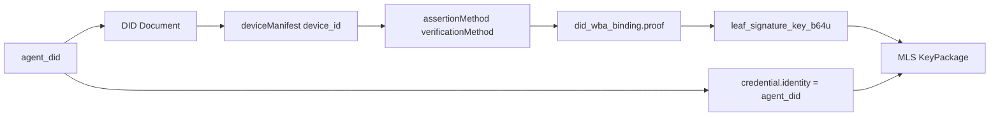
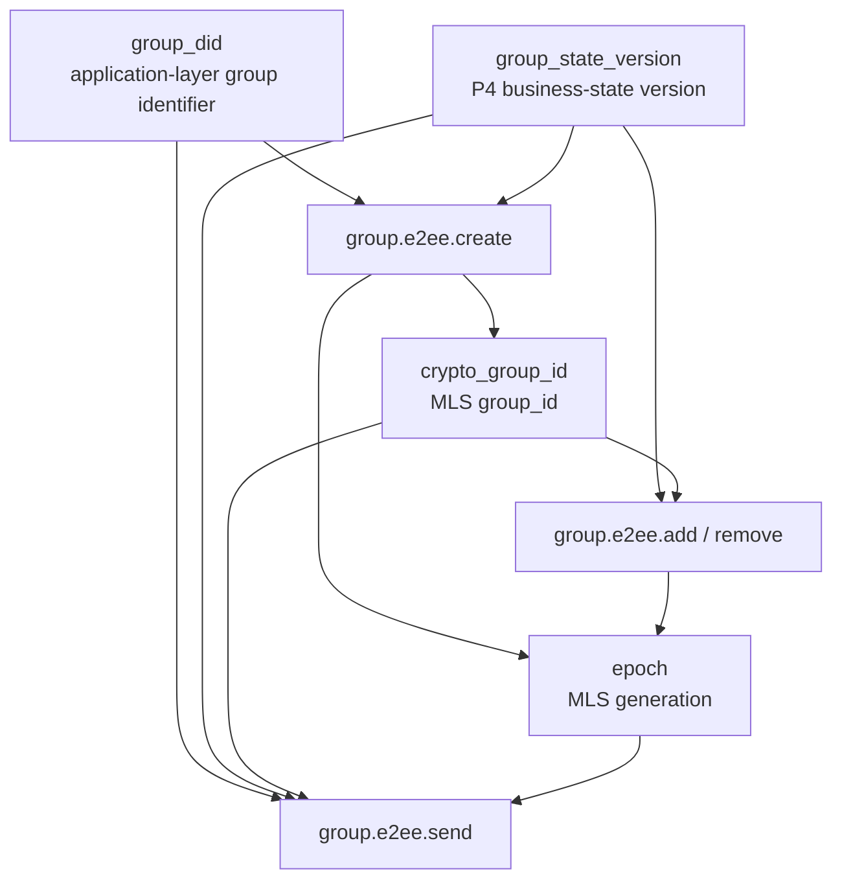
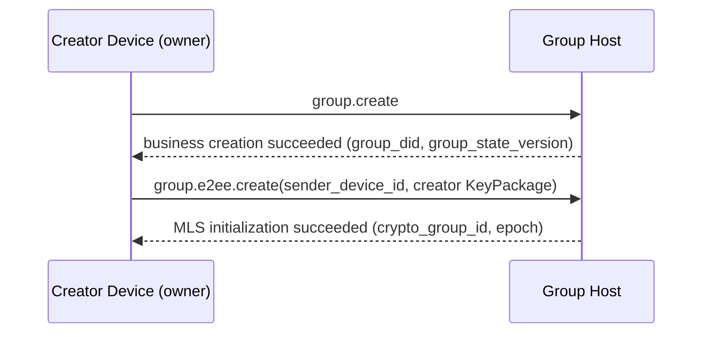
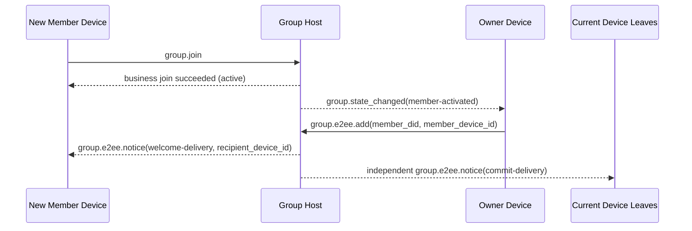
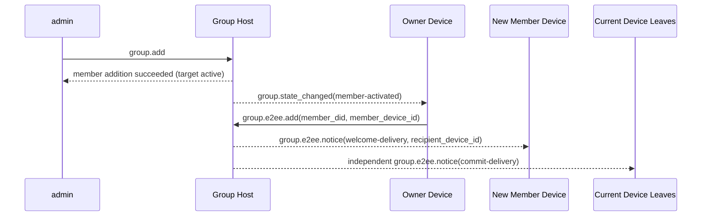
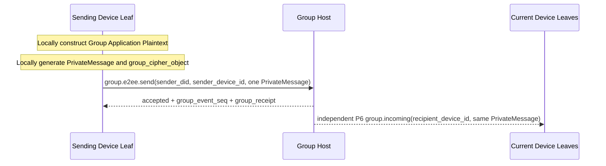
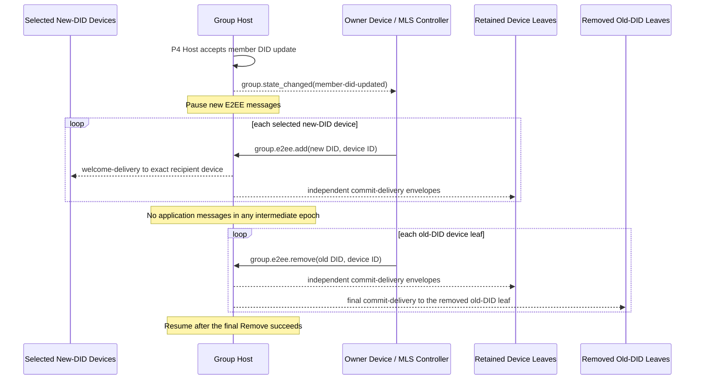

# ANP Profile 6: Group End-to-End Encryption

- Document ID: ANP-P6-vNext
- Title: Group End-to-End Encryption
- Status: Draft
- Specification Set: ANP Messaging 1.2 Draft
- Language: English
- Profile: `anp.group.e2ee.v2`
- Dependencies: `anp.core.binding.v1`, `anp.identity.discovery.v1`, `anp.group.base.v2`
- Applicability: This Profile is suitable for the Group End-to-End Encryption control layer based on Group DID and works closely with `anp.group.base.v2`.

---

## 1. Purpose

This Profile defines the Group End-to-End Encryption control layer of ANP, stipulating:

1. How to bind `group_did`, `group_state_version`, and `group_event_seq` to the group cryptography state machine;
2. How to use MLS as the basic protocol for group key establishment, member changes, and application message protection;
3. How to bind a `did:wba` Agent DID and one eligible `device_id` to an MLS member credential, KeyPackage, and leaf signature key;
4. How to define a set of independent `group.e2ee.*` JSON-RPC methods to specifically carry MLS cryptographic actions;
5. How to work closely with `anp.group.base.v2` through **state coupling** instead of "embedding the MLS handshake object in the P4 method";
6. How to deal with `epoch`, `Welcome`, `PrivateMessage`, `PublicMessage`, `epoch_authenticator`, fork detection and recovery.
7. How to replace the corresponding MLS leaves through ordered `group.e2ee.add` and `group.e2ee.remove` operations after P4 accepts a DID update for a member;
8. How one P4 member DID can have multiple independent MLS device leaves without changing DID-level business membership.

This Profile does not define:

- Pull historical messages;
- Read and online status;
- Product-local device enrollment, naming, roles, synchronization, or internal replica management;
- Sharing KeyPackage private material, leaf private keys, epoch secrets, or MLS private state between devices;
- Specific implementation of directory synchronization outside the group;
- end-to-end encryption for non-group scenarios;
- External Commit main line;
- `group_join_info` and `group.e2ee.get_join_info`;
- `accept_welcome` protocol method;
- The second set of business member status models.
- Recovery or redistribution of lost historical MLS epoch secrets.

---

## 2. Terminology and Normative Conventions

### 2.1 Normative Keywords

In this article, **MUST**, **MUST NOT**, **REQUIRED**, **SHALL**, **SHALL NOT**, **SHOULD**, **SHOULD NOT**, **RECOMMENDED**, **NOT RECOMMENDED**, **MAY**, **OPTIONAL** are interpreted as normative requirements according to their capitalized form.

### 2.2 Terminology

- **Group DID**: The application layer global identifier of the group, which is `group_did`.
- **Crypto Group ID**: Group cryptography internal identifier, corresponding to MLS `group_id`, which can be different from `group_did`.
- **Group Host Service**: The service responsible for the group basic status ordering, policy application and group message entry; not the MLS controller.
- **MLS Group State**: Group cryptographic state maintained based on MLS.
- **Epoch**: A generational advance in MLS group state.
- **KeyPackage**: MLS adding material object, used by this Profile to add one eligible device leaf to the group.
- **Welcome**: MLS welcome object, used to help new members initialize the group state.
- **PrivateMessage**: Encrypted MLS message with member authentication.
- **PublicMessage**: MLS message that is only signed and not encrypted.
- **Device Leaf**: One MLS client/leaf identified externally by `(agent_did, device_id)`. It is not an additional P4 business member.
- **Eligible Device**: A device that is currently eligible for `anp.group.e2ee.v2` under P2 `deviceManifest`, referenced keys, service capabilities, and group policy.
- **did:wba Binding**: Binds an MLS leaf signature key, member credential, or KeyPackage to a verifiable `(agent_did, device_id)` proof object.
- **MLS Controller**: The subject responsible for general MLS member-change control actions. The group `owner` remains the controller in v2. A narrowly authorized same-DID device-removal caller defined in Sections 9.4 and 13.4 is not a general controller.
- **State Coupling**: P4 and P6 do not do method-by-method mapping, but a coupling method that triggers cryptographic state advancement through business state changes.
- **E2EE Notice**: P6's self-defined independent encryption notification object, used to deliver cryptographic results such as `commit` and `welcome`.
- **Terminal Leaf**: A device leaf that has been removed from the group's MLS membership set. Its local group binding can no longer send, receive, or decrypt application messages for that `group_did`, while the device itself may remain a current eligible P2 Manifest entry.
- **Device Delivery Queue**: The durable per-`(recipient_did, recipient_device_id)` delivery state that the Group Host keeps for P6 envelopes it has not transport-confirmed. It carries public metadata, any preserved public origin proof, and opaque ciphertext only, and it is not group history.
- **Fork**: An irreconcilable sequence of `epoch` / `epoch_authenticator` / status advancement was observed by different members for the same `group_did`.
- **MLS Member DID Update**: After P4 accepts a DID update for the same member, the cryptographic orchestration that adds selected new-DID device leaves and then removes every old-DID device leaf through ordered Commits.

---

## 3. Design Principles

### 3.1 Group identity and cryptographic status stratification

This Profile clearly distinguishes between:

- `group_did`: application layer group global identifier;
- `crypto_group_id`: cryptography group internal identifier;
- `group_state_version`: Application layer group state version assigned by Group Host;
- `epoch`: Cryptozoological group generation assigned by the MLS state machine.

The four MUST NOT be mechanically equivalent; but there MUST be a verifiable binding between them.

### 3.2 One Agent DID = one external group member; each device = one MLS leaf

P4 membership, roles, policy, and member counts remain attached to the current `agent_did`. P4 v2 uses the current `agent_did` as its only wire member identity; no name, stable-path field, or local record identifier may replace that DID in MLS `credential.identity`.

P6 **MAY** represent several devices of that same DID as independent MLS clients and leaves. Every such leaf keeps `credential.identity = UTF8(agent_did)` and is distinguished by the authenticated `device_id` binding defined in Section 6. Multiple leaves with the same DID do not create additional P4 members, roles, or member-count entries.

Each device independently generates and stores its KeyPackage private material, leaf private key, epoch secrets, and MLS state. Those values **MUST NOT** be copied or shared between sibling devices. A new device enters a group only through its own Add, Commit, and device-targeted Welcome.

`anp.group.e2ee.v1` remains a separate interoperability contract. An implementation **MUST NOT** reinterpret a v1 member or MLS leaf as a v2 Device Leaf, or load v1 MLS group state as v2 multi-device state. This Profile defines no in-place v1-to-v2 state upgrade; any migration requires an explicitly defined process outside this Profile and must otherwise fail closed.

### 3.3 P4 is the main business protocol, and P6 is the cryptography control layer

The relationship between this Profile and `anp.group.base.v2` is as follows:

- P4 defines the business actions, business state, ordering semantics and receipt semantics of the group;
- P6 defines MLS cryptographic actions, cryptographic objects, binding rules and verification requirements;
- P4 is still the business layer authority;
- P6 **does not** redefine business member status such as `active / left / removed`;
- P4 Base operations and notifications remain DID-addressed and **MUST NOT** carry P6 device selectors;
- P6 adds or removes one device leaf at a time without independently changing P4 membership;
- P6 does not require MLS native objects to be carried directly in the P4 method body.

### 3.4 State coupling instead of method-by-method mapping

The coupling between P4 and P6 is achieved through **state**, rather than through "a certain P4 method directly mapping a certain P6 method".

Specifically:

- P4 determines whether something is valid in business terms;
- P6 observes business-state changes and advances the MLS state accordingly.

For example:

- A group is successfully created in P4, and the creator has become `owner` → owner automatically executes `group.e2ee.create`
- A member becomes `active` in P4 and an eligible device has not yet entered the MLS membership set → owner executes `group.e2ee.add(member DID, device ID)`
- An already-active member adds another eligible device → owner may execute another device-level `group.e2ee.add` without a P4 membership change
- A member becomes `left` or `removed` in P4 → owner removes every MLS device leaf for that DID
- A device loses P2 Manifest eligibility while its DID remains active → owner, or a same-DID device-management-authorized sibling with current MLS state, removes only that device leaf
- A P4 member produces `member-did-updated` in P4 → owner adds selected new-DID device leaves and then removes every old-DID device leaf

### 3.5 owner is the MLS controller; same-DID device removal is a narrow exception

In v2, only the owner DID assumes the general MLS controller role. A general control request is submitted by an eligible owner device that possesses the required current MLS state; eligibility of another owner device does not give it that private state.

owner is responsible for:

- Create MLS group;
- Execute `add`;
- Execute `remove`;
- Execute member DID updates through ordered per-device Adds and Removes;
- Generate `commit` corresponding to member changes;
- Generate `welcome` for new members;
- Advance `epoch` after member change.

One narrow exception applies only to an exact revoked device leaf of the caller's own DID. An eligible current leaf whose device has authoritative same-DID device-management authorization **MAY** submit `group.e2ee.remove` for a different device leaf of that same DID after the target device has been authoritatively revoked or has lost current P2 eligibility. This exception:

- **MUST NOT** remove the caller's own leaf, an active sibling device, another DID's leaf, or the P4 business member;
- **MUST NOT** change P4 role, status, join time, or member count;
- **MUST** use the caller's own current MLS state to generate an exact one-leaf Remove Commit; and
- **MUST NOT** cause the Group Host to generate a Commit or release MLS private state.

The device-management authorization is a trusted deployment authorization fact, not a new P6 request field. A Group Host that cannot verify it authoritatively **MUST** reject the exception and **MUST NOT** trust a caller assertion or cached presentation data.

The core idea of P6 is not to put MLS objects into P4 method bodies, but to let cryptographic state advance together with business state. The following diagram summarizes this state coupling so that readers can understand the causal relationships among methods before reading the detailed constraints below.

```mermaid
flowchart TB
P4[P4 business-state changes<br/>group.create / member active / member left or removed / member DID updated]
OBS[owner observes business state]

CREATE[group.e2ee.create]
ADD[group.e2ee.add(DID + device)]
REMOVE[group.e2ee.remove(DID + device)]
DID_UPDATE_ADD[group.e2ee.add(new DID devices)]
DID_UPDATE_REMOVE[group.e2ee.remove(old DID devices)]

HOST[Group Host]
NOTICE[group.e2ee.notice]

P4 --> OBS
OBS -->|group created and has no crypto_group_id yet| CREATE
OBS -->|eligible device not yet in MLS| ADD
OBS -->|device or DID must leave MLS| REMOVE
OBS -->|P4 member rebound and old leaves remain| DID_UPDATE_ADD

CREATE --> HOST
ADD --> HOST
REMOVE --> HOST
DID_UPDATE_ADD --> HOST
DID_UPDATE_ADD -->|execute after DID update Add is accepted| DID_UPDATE_REMOVE
DID_UPDATE_REMOVE --> HOST

HOST --> NOTICE
```

*Figure P6-1: Overview of P4 / P6 state coupling (non-normative).*

This diagram emphasizes trigger relationships rather than a new business state machine: P4 remains the authority for the business layer, and P6 only observes those business results and materializes them as MLS create / add / remove operations.

### 3.6 Group Host is responsible for ordering and is not responsible for MLS control

The responsibilities of Group Host Service are:

- Receive and ordering P4 business operations;
- Assign `group_event_seq` to accepted events;
- Advance `group_state_version`;
- generate `group_receipt`;
- Distribute group messages and E2EE Notice;
- Create a separate encrypted-delivery envelope for each target device leaf without decrypting or re-encrypting the MLS object;
- Witness the implementation of MLS control results at the business layer.

By default, Group Host Service:

- **SHOULD NOT** act as an MLS controller;
- **SHOULD NOT** serve as an MLS group member;
- **SHOULD NOT** hold group application plaintext decryption capabilities.
- **MUST NOT** copy MLS private state or epoch secrets between devices.

### 3.7 The owner manages group state; active members manage group messages

The owner controls:

- Member changes;
- Advancement of the group cryptographic state;
- Updates to `epoch`.

Every eligible device that belongs to an `active` member and currently has an MLS leaf can:

- Use the current group state to generate their own group-message ciphertext;
- Call `group.e2ee.send` to send their own group message;
- Decrypt other members' group messages.

This Profile does not require that all group messages be encrypted by the owner.

The same-DID exception in Section 3.5 grants no create, add, member-level removal, DID-update, or third-party control authority.

### 3.8 v2 does not support External Commit

In v2:

- External Commit is not supported;
- `group_join_info` is not defined;
- `group.e2ee.get_join_info` is not defined;
- The `accept_welcome` protocol method is not defined.

All group entry paths are eventually unified into MLS `add` initiated by the owner at the cryptographic layer.

### 3.9 Only the message side enters PrivateMessage

In v2:

- Only the application message content of `group.e2ee.send` enters MLS `PrivateMessage` and is encrypted;
- `group.e2ee.create`, `group.e2ee.add`, and `group.e2ee.remove` all continue to use plaintext JSON-RPC request bodies; DID update orchestration reuses `add` and `remove` and defines no new request method;
- Objects such as `commit` and `welcome` appear as method inputs or Notice payloads instead of being embedded in the P4 business method body.

---

## 4. Dependency, Profile identification and target modeling

### 4.1 Profile name

The standard name of this Profile is:

`anp.group.e2ee.v2`

### 4.2 Dependencies

This Profile **MUST** depend on the following Profiles:

- `anp.core.binding.v1`
- `anp.identity.discovery.v1`
- `anp.group.base.v2`

### 4.3 Security Profile

When using this Profile:

- `meta.profile` **MUST** be equal to `anp.group.e2ee.v2`.
- Every device-originated P6 request defined by this Profile **MUST** contain `meta.sender_device_id` and bind it to the current P2 Manifest entry of `meta.sender_did`.
- Every device-targeted P6 notification or encrypted delivery **MUST** contain `meta.recipient_device_id` and preserve the Agent DID in `meta.target.did`.
- These selectors belong only to P6; P4 Base operations and notifications **MUST NOT** inherit them.

Among them:

- `group.e2ee.publish_key_package`, `group.e2ee.get_key_package`, `group.e2ee.notice` **MUST** use `transport-protected`
- `group.e2ee.create`, `group.e2ee.add`, `group.e2ee.remove`, `group.e2ee.send`, and P6 `group.incoming` **MUST** use `group-e2ee`

For `group.e2ee.send`, `group-e2ee` means that the message semantics it carries belong to the group E2EE side; it does not mean that its outer JSON-RPC request body is encrypted by the group again.

### 4.4 Method Target Modeling

### 4.4.1 service-scoped

The following methods **MUST** be `service-scoped`:

- `group.e2ee.publish_key_package`
- `group.e2ee.get_key_package`
- `group.e2ee.create`

Rules:

- `meta.target.kind = "service"`
- `meta.target.did` **MUST** equal target public `ANPMessageService.serviceDid`

The reason why `group.e2ee.create` uses service-scoped is:
Before the success of `group.create` in the business layer, the business state of the group has just been established. Although `group_did` has been generated, the creation action itself still completes cryptographic initialization for the group Host service entrance, so v2 uniformly uses service-scoped.

### 4.4.2 group-addressed

The following methods **MUST** be `group-addressed`:

- `group.e2ee.add`
- `group.e2ee.remove`
- `group.e2ee.send`

Rules:

- `meta.target.kind = "group"`
- `meta.target.did` **MUST** equal target `group_did`

### 4.4.3 agent-addressed notifications

The following notifications **MUST** be `agent-addressed`:

- `group.e2ee.notice`
- P6 `group.incoming` for application-ciphertext delivery

Rules:

- `meta.target.kind = "agent"`
- `meta.target.did` **MUST** be equal to the notification recipient Agent DID
- `meta.recipient_device_id` **MUST** select the exact recipient device leaf; the notification **MUST NOT** be redirected to a sibling device.
- This Profile does not define `target.kind = "device"`.

---

## 5. Cryptographic Mainline and MTI Suite

### 5.1 Mainline Protocol

This Profile's group key mainline **MUST** be implemented based on MLS 1.0 semantics, but v2 only fixes a restricted usage subset of it.

v2 mainline includes at least:

- KeyPackage
- Add
- Remove
- Commit
- Welcome
- PrivateMessage
- Epoch advancement

A P4 member DID update introduces neither a new P6 method nor a new MLS primitive. It first uses one `group.e2ee.add` Commit per selected new-DID device, then one `group.e2ee.remove` Commit per old-DID device leaf.

Among them:

- `commit_b64u` **MUST** be represented as raw bytes of the complete MLS `MLSMessage` (`mls-public-message`) serialized by TLS;
- `welcome_b64u` **MUST** be represented as raw bytes of the MLS `Welcome` object serialized by TLS;
- `PrivateMessage` **MUST** serve as the only ciphertext bearer object for group application messages.

The MLS library **MAY** additionally supports standard capabilities such as `Update`, proposal batching, PSK, and ReInit; however, these capabilities **do not belong** to the minimum protocol mainline of this Profile v2, and do not constitute interoperability requirements for v2.

### 5.2 Mandatory-to-Implement Suite

To ensure minimal interoperability, implementations conforming to this Profile MUST support the following MTI packages:

`MLS_128_DHKEMX25519_AES128GCM_SHA256_Ed25519`

### 5.3 Additional Suites

Implementation **MAY** support more MLS suites, but:

- All members within the same group **MUST** agree on the kit used;
- If group policy restrictions allow package collection, MLS Controller **MUST** reject packages that do not satisfy the policy.

### 5.4 Relationship with did:wba

The relationship between the main line of this Profile and did:wba is as follows:

- `authentication`/`assertionMethod` in the DID document is used for identity binding proof;
- `keyAgreement` **SHOULD** in the DID document contains at least one X25519 entry, indicating that the Agent has E2EE capabilities;
- P2 `deviceManifest` identifies the current device entry, its `signing_key_id`, `e2ee_key_id`, and `anp.group.e2ee.v2` eligibility;
- The MLS group member's leaf signing key **SHOUNT** be directly equivalent to the DID long-term identity signing key;
- The leaf signature key **SHOULD** be generated separately and bound to `(agent_did, device_id)` via `did:wba Binding`.

---

## 6. did:wba and MLS binding model

### 6.1 Binding target

This Profile requires the following MLS elements to be bound to `(agent_did, device_id)`:

1. KeyPackage owner;
2. Current leaf signature key;
3. The identity string in the group member's credentials;
4. The P2 Manifest signing-key reference used for the binding proof.

### 6.2 Credential Identity Rules

For this Profile, `credential.identity` in an MLS member credential **MUST** equal the UTF-8 byte string of that leaf's current `agent_did`. A readable name, stable subject path, or local identity **MUST NOT** be written into or replace `credential.identity`.

Implementation **MUST NOT** replace `credential.identity` with a local account ID, device ID, numeric user ID, or other non-DID string.

Sibling leaves of the same DID therefore have the same `credential.identity` but distinct authenticated `device_id` values. A verifier identifies a P6 leaf by the complete pair, not by either value alone.

### 6.3 `did_wba_binding` object

This Profile defines the `did_wba_binding` object used to bind the MLS leaf signature key to one eligible device under `agent_did`.

The recommended structure is as follows:

```json
{
  "agent_did": "did:wba:example.com:agents:alice:e1_<fingerprint>",
  "device_id": "dev-a-7N3KQ2",
  "verification_method": "did:wba:example.com:agents:alice:e1_<fingerprint>#dev-a-sign",
  "leaf_signature_key_b64u": "BASE64URL_ED25519_LEAF_PK",
  "issued_at": "2026-03-29T12:00:00Z",
  "expires_at": "2026-04-29T12:00:00Z",
  "proof": {
    "type": "DataIntegrityProof",
    "cryptosuite": "eddsa-jcs-2022",
    "created": "2026-03-29T12:00:00Z",
    "proofPurpose": "assertionMethod",
    "verificationMethod": "did:wba:example.com:agents:alice:e1_<fingerprint>#dev-a-sign",
    "proofValue": "z..."
  }
}
```

`did_wba_binding.proof` **MUST** reuse the shared **Object Proof Profile** defined in P1 Appendix B.

For `did_wba_binding`:

- issuer DID **MUST** be `agent_did`
- The protected document **MUST** be the entire `did_wba_binding` object after removing `proof`
- `device_id` **MUST** identify a current P2 Manifest entry eligible for `anp.group.e2ee.v2`
- `verification_method` and `proof.verificationMethod` **MUST** equal that entry's `signing_key_id`, which **MUST** be authorized by `assertionMethod` in the `agent_did` DID document

#### 6.3.1 `anp_did_wba_device_binding` MLS extension

This draft assigns provisional private-use MLS `ExtensionType` `0xF0A1` to `anp_did_wba_device_binding`. It is not an IANA assignment and **MUST** be used only after `anp.group.e2ee.v2` has been explicitly negotiated. ANP **MUST** publish a stable registered code point before releasing v2; changing this draft value is a breaking draft revision.

The `extension_data` bytes are the UTF-8 RFC 8785 JCS encoding of the complete `did_wba_binding` JSON object, including `proof`. A v2 LeafNode carried by a KeyPackage **MUST** contain exactly one extension of this type, and the authenticated LeafNode retained in the group **MUST** preserve the same binding. The LeafNode's `capabilities.extensions` and the GroupContext `required_capabilities` extension **MUST** list `0xF0A1`.

A v2 implementation **MUST** reject a missing, duplicate, malformed, unsupported, or colliding extension or capability declaration. The convenience `group_key_package.did_wba_binding` member **MUST** have the same JCS bytes as the embedded extension and does not replace it.

### 6.4 `did_wba_binding` verification rules

The recipient MUST complete the following verifications before accepting KeyPackage, LeafNode updates, or new members:

1. `agent_did` can be parsed and the current DID document is valid;
2. `device_id` occurs exactly once in the current P2 `deviceManifest` and declares `anp.group.e2ee.v2` with its dependencies;
3. `verification_method` equals that entry's current `signing_key_id` and is authorized by `assertionMethod`;
4. `proof` **MUST** exist and satisfy the shared Object Proof Profile of P1 Appendix B;
5. The issuer DID of `proof` equals `agent_did` and proof verification passes;
6. The protected document covers at least `agent_did`, `device_id`, `verification_method`, `leaf_signature_key_b64u`, `issued_at`, and `expires_at`;
7. The KeyPackage / LeafNode carries the Section 6.3.1 extension and required capability declarations;
8. The embedded extension and sibling `did_wba_binding` have identical JCS bytes;
9. The actual leaf signature public key is consistent with `leaf_signature_key_b64u`;
10. `credential.identity` in the MLS credential is consistent with `agent_did`;
11. The suite, group policy, and `issued_at` / `expires_at` window are valid.

P6 defines `did_wba_binding` because the MLS leaf signature key should not be directly equated with the DID long-term identity signing key. The following diagram connects `agent_did`, the DID document, the binding object, and KeyPackage / `credential.identity` so that readers can understand the verification order.



*Figure P6-2: did:wba and MLS binding chain (non-normative).*

During verification, the recipient should not only check that the internal MLS signature is valid. It should also follow this chain to confirm that `credential.identity`, `device_id`, the leaf signature key, the current Manifest entry, and `agent_did` are fully bound.

### 6.5 `e1_` is compatible with `k1_`

- For the default `e1_` DID, `did_wba_binding.proof` **MUST** reuse the shared Object Proof Profile of P1 Appendix B;
- For compatible `k1_` DID, `did_wba_binding.proof` **MAY** use the alternative Object Proof Profile defined by explicit extension negotiation; but when there is no explicit extension negotiation, v2 MTI **does not** bind `k1_` proof as the default interworking path;
- MTI leaf signature keys for MLS groups still **MAY** use Ed25519 regardless of the DID's identity curve, as long as the proof of binding holds.

---

## 7. Core objects

### 7.1 `crypto_group_id`

`crypto_group_id` represents the MLS's internal `group_id`.

The rules are as follows:

- `crypto_group_id` **MUST** treated as opaque bytes;
- In JSON, **MUST** be represented by `base64url`, and the field name is recommended to be `crypto_group_id_b64u`;
- `crypto_group_id` **MUST** establish a verifiable binding to `group_did`.

### 7.2 `group_state_ref`

This Profile reuses the `group_state_ref` concept of P4 and requires that the E2EE group contains at least:

- `group_did`
- `group_state_version`
- `policy_hash` (if the group policy has been hashed)

In group E2EE, readers can easily connect the wrong mental model among four identifiers / versions at different layers: Group DID, business-state version, cryptographic internal group ID, and MLS epoch. The following diagram puts their sources and advancement relationships in one view.



*Figure P6-3: Relationship among `group_did`, `crypto_group_id`, `group_state_version`, and `epoch` (non-normative).*

When reading the subsequent object structures and verification rules, treat these four values as coordinates from different layers: they need to be bound, but they cannot replace each other and should not be mechanically treated as the same value.

### 7.3 `group_key_package`

This Profile definition group adds material packaging objects:

```json
{
  "key_package_id": "kp-001",
  "owner_did": "did:wba:example.com:agents:bob:e1_<fingerprint>",
  "owner_device_id": "dev-b-4M8P1X",
  "suite": "MLS_128_DHKEMX25519_AES128GCM_SHA256_Ed25519",
  "mls_key_package_b64u": "BASE64URL_KEYPACKAGE",
  "did_wba_binding": { ... },
  "expires_at": "2026-04-30T00:00:00Z"
}
```

Among them:

- `key_package_id` **MUST** exist;
- `owner_did` **MUST** exist;
- `owner_device_id` **MUST** exist;
- `suite` **MUST** exist;
- `mls_key_package_b64u` **MUST** exist;
- `did_wba_binding` **MUST** exist;
- `expires_at` **SHOULD** exist;
- `mls_key_package_b64u` **MUST** be no-padding base64url for the raw bytes of the MLS `KeyPackage` object after serialization by MLS 1.0 TLS.
- `owner_did` and `owner_device_id` **MUST** equal `did_wba_binding.agent_did` and `did_wba_binding.device_id`;
- One KeyPackage belongs to exactly one device and **MUST NOT** be used for another device leaf. Its consumption and any deployment-declared last-resort reuse follow Section 13.2 unchanged.

`group_key_package` is mainly used by owner to subsequently execute `group.e2ee.add`.

### 7.4 `group_cipher_object`

`group_cipher_object` is the wire protocol message body object of `group.e2ee.send`.

The recommended structure is as follows:

```json
{
  "crypto_group_id_b64u": "BASE64URL_GROUPID",
  "epoch": "7",
  "private_message_b64u": "BASE64URL_PRIVATEMESSAGE",
  "group_state_ref": {
    "group_did": "did:wba:groups.example:team:dev:e1_<fingerprint>",
    "group_state_version": "42",
    "policy_hash": "sha-256:..."
  },
  "epoch_authenticator": "BASE64URL_AUTH"
}
```

Rules:

- `crypto_group_id_b64u` **MUST** exist;
- `epoch` **MUST** exist;
- `private_message_b64u` **MUST** exist;
- `private_message_b64u` **MUST** be no-padding base64url for the raw bytes of the MLS `PrivateMessage` object serialized by MLS 1.0 TLS;
- `group_state_ref.group_did` **MUST** be equal to the outer target `group_did`.

### 7.5 `Group Application Plaintext`

Before group application messages enter MLS `PrivateMessage` encryption, **MUST** be normalized into the following inner plaintext objects:

```json
{
  "application_content_type": "text/plain | application/json | application/anp-attachment-manifest+json | ...",
  "thread_id": "thr-001",
  "reply_to_message_id": "msg-0009",
  "annotations": {},
  "text": "...",
  "payload": {},
  "payload_b64u": "..."
}
```

Rules:

- `application_content_type` **MUST** exist;
- Exactly one of `text`, `payload`, or `payload_b64u` **MUST** be present;
- The message semantic fields `thread_id`, `reply_to_message_id`, and `annotations` in P4 **MUST** be located in the inner object under group E2EE;
- The sender **MUST** serialize the entire `Group Application Plaintext` object into a byte string using UTF-8 + RFC 8785 JCS before encryption; the receiver **MUST** interpret the object according to the same rules after decryption.

When `application_content_type = "application/json"`, `payload` **MUST**
directly carry the JSON object. This Profile does not define the business meaning
of fields inside that object.

Ordinary JSON group application plaintext example:

```json
{
  "application_content_type": "application/json",
  "thread_id": "thr-001",
  "payload": {
    "type": "example",
    "data": {
      "hello": "group"
    }
  }
}
```

### 7.6 `e2ee_notice_object`

P6 defines an independent cryptographic notification object used to deliver cryptographic results.

The recommended structure is as follows:

```json
{
  "notice_id": "en-001",
  "notice_type": "commit-delivery | welcome-delivery",
  "group_did": "did:wba:groups.example:team:dev:e1_<fingerprint>",
  "group_state_ref": {
    "group_did": "did:wba:groups.example:team:dev:e1_<fingerprint>",
    "group_state_version": "43",
    "policy_hash": "sha-256:..."
  },
  "crypto_group_id_b64u": "BASE64URL_GROUPID",
  "epoch": "8",
  "subject_did": "did:wba:b.example:agents:bob:e1_<fingerprint>",
  "subject_device_id": "dev-b-4M8P1X",
  "subject_status": "active | removed",
  "commit_b64u": "BASE64URL_MLSMESSAGE",
  "welcome_b64u": "BASE64URL_WELCOME",
  "ratchet_tree_b64u": "BASE64URL_RATCHET_TREE",
  "epoch_authenticator": "BASE64URL_AUTH",
  "group_receipt": { ... }
}
```

Rules:

- `notice_id` **MUST** exist, **MUST** be stable across redeliveries of the same envelope, and **MUST NOT** be reused for a different logical notice delivered to the same recipient device. Per-leaf copies of the same cryptographic result **MAY** share one `notice_id`, because each device deduplicates only envelopes addressed to itself, keyed on `(group_did, notice_id)`;
- `notice_type` **MUST** exist;
- `group_did` **MUST** exist;
- `group_state_ref` **MUST** exist;
- `crypto_group_id_b64u` **MUST** exist;
- `epoch` **MUST** exist;
- `commit_b64u` **MUST** exist when `notice_type = "commit-delivery"` is present;
- When `notice_type = "welcome-delivery"`, `welcome_b64u` and `ratchet_tree_b64u` **MUST** exist at the same time;
- For a notice produced by DID update orchestration, `group_state_ref` **MUST** exactly reference the accepted P4 `member-did-updated` event used by every P6 Add and Remove. The receiver **MUST** obtain the previous DID and current DID from that P4 event rather than from duplicated P6 continuity fields;
- `subject_did`, `subject_device_id`, and `subject_status` describe the one leaf affected by this P6 operation: Add uses the added DID/device with `active`, while Remove uses the removed DID/device with `removed`;
- The device receiving the notice is identified only by outer `meta.target.did` and `meta.recipient_device_id`; for `commit-delivery`, it can differ from the affected subject. For a Remove `commit-delivery`, the recipient **MAY** be the removed subject leaf itself, which receives one final notice as specified in Section 12.3;
- `ratchet_tree_b64u` **MUST** be no-padding base64url of raw bytes for TLS serialization of the ratchet tree;
- `group_receipt` **MAY** exist to associate cryptographic results with the location of business ordering.

---

## 8. KeyPackage publishing and discovery methods

### 8.1 `group.e2ee.publish_key_package`

#### 8.1.1 Semantics

Published by an Agent to its own exposed `ANPMessageService`, a KeyPackage that can be used for group joining.

#### 8.1.2 Request Requirements

- `method = "group.e2ee.publish_key_package"`
- `meta.profile = "anp.group.e2ee.v2"`
- `meta.security_profile = "transport-protected"`
- `meta.target.kind = "service"`
- `meta.target.did` **MUST** be equal to the publisher’s own public `ANPMessageService.serviceDid`
- `meta.sender_did` **MUST** exist
- `meta.sender_device_id` **MUST** exist
- `body.group_key_package` **MUST** exist
- `body.group_key_package.owner_did` **MUST** equal `meta.sender_did`
- `body.group_key_package.owner_device_id` and `body.group_key_package.did_wba_binding.device_id` **MUST** equal `meta.sender_device_id`
- The publishing service **MUST** validate the current P2 Manifest entry and Section 6 binding before accepting the package.

Authentication constraints:

- This method belongs to **service-scoped** Control-Plane Methods;
- The caller **MUST** be running in an authenticated local session or an equivalent hop- and service-level authentication context;
- v2 does **not** require an additional business-layer `origin_proof` for this method.

#### 8.1.3 Successful Response

A successful response **MUST** contain at least:

- `published = true`
- `owner_did`
- `owner_device_id`
- `key_package_id`
- `published_at`

### 8.2 `group.e2ee.get_key_package`

#### 8.2.1 Semantics

Get an available KeyPackage through the target Agent's `ANPMessageService`.

#### 8.2.2 Request Requirements

- `meta.profile = "anp.group.e2ee.v2"`
- `meta.security_profile = "transport-protected"`
- `meta.target.kind = "service"`
- `meta.target.did` **MUST** be equal to the `ANPMessageService.serviceDid` exposed by the target Agent
- `meta.sender_did` **MUST** exist
- `meta.sender_device_id` **MUST** identify a current P6-eligible device under `meta.sender_did`

`body` **MUST** contain:

- `target_did`
- `target_device_id`

`body` **MAY** contain:

- `preferred_suite`
- `require_fresh`

Authentication constraints:

- This method belongs to **service-scoped** Control-Plane Methods;
- The authenticated context **MUST** bind the exact `(meta.sender_did, meta.sender_device_id)` pair, and that device **MUST** remain eligible under the current P2 Manifest;
- v2 Minimum Interoperability Requirements is at least hop/service level certification;
- **Anonymous retrieval of KeyPackage is not part of v2 MTI**.

#### 8.2.3 Successful Response

A successful response **MUST** contain at least:

- `target_did`
- `target_device_id`
- `group_key_package`

#### 8.2.4 Server-side distribution rules

`ANPMessageService` When returning `group_key_package`:

- **SHOULD** return KeyPackage that has not expired, not been revoked and not consumed;
- **MUST** return a KeyPackage whose `owner_did` and `owner_device_id` exactly equal the requested target pair, and **MUST NOT** substitute a sibling device;
- **MUST** revalidate the target device against the current P2 Manifest before return;
- The server **MAY** mark it as `reserved`, or assign an equivalent status after return, to avoid concurrent re-issuance;
- When the corresponding `group.e2ee.add`, including the Add step of a DID update orchestration, is successfully accepted by the Group Host and the cryptographic membership change is completed, the service **MUST** mark it as `consumed` or delete it from the publishing set;
- If the corresponding process fails, is canceled, or times out, release of the reserved KeyPackage is deployment-specific, but it **SHOULD NOT** allow the same KeyPackage to be concurrently reused by two successful `group.e2ee.add` operations;
- Caller identity, rate limiting and anti-abuse policies **MUST** be implemented based on hop/service level authentication.

---

## 9. MLS Control-Plane Methods

### 9.1 General

The methods in this chapter are independent JSON-RPC methods. They are not "additional fields" to the P4 business method, but are P6's own cryptographic control actions.

Among them:

- `group.e2ee.create`, `group.e2ee.add`, and `group.e2ee.remove` are **member change control methods**
- `group.e2ee.send` is the **message sending method**
- `group.e2ee.create/add/remove` is bound to existing P4 business state, but **does not create new P4 business member state**
- `group.e2ee.send` is directly used as the online delivery method, without secondary packaging by `group.send`

### 9.2 `group.e2ee.create`

#### 9.2.1 Semantics

Create a new MLS group state and add the owner as the initial member.

#### 9.2.2 Caller

owner only.

#### 9.2.3 Request Requirements

- `method = "group.e2ee.create"`
- `meta.profile = "anp.group.e2ee.v2"`
- `meta.security_profile = "group-e2ee"`
- `meta.target.kind = "service"`
- `meta.target.did` **MUST** be equal to the `ANPMessageService.serviceDid` exposed by the target group Host
- `meta.sender_did` **MUST** be equal to the current group `owner`
- `meta.sender_device_id` **MUST** identify an eligible owner device with the required current MLS state
- `auth.origin_proof` **MUST** exist

`body` **MUST** contain at least:

- `group_did`
- `group_state_ref`
- `suite`
- `creator_key_package`
- `crypto_group_id_b64u`
- `epoch`

Rules:

- `creator_key_package.owner_did` **MUST** equal `meta.sender_did`
- `creator_key_package.owner_device_id` **MUST** equal `meta.sender_device_id`
- `group_state_ref.group_did` **MUST** equal `body.group_did`
- `epoch` For the initial group state **SHOULD** be `"0"` or an initial value explicitly agreed upon by the implementation

#### 9.2.4 Successful Response

A successful response **MUST** contain at least:

- `created = true`
- `group_did`
- `group_state_ref`
- `crypto_group_id_b64u`
- `epoch`
- `accepted_at`

Notes:

- `group.e2ee.create` itself **MUST NOT** create a new P4 business group;
- It is only executed after `group.create` has been accepted by the business layer;
- It no longer generates new `group_state_version` or `group_event_seq` independently.

### 9.3 `group.e2ee.add`

#### 9.3.1 Semantics

The owner executes MLS `add` to add one eligible device leaf of a P4 `active` member to the cryptographic group. A second device of the same active DID uses another Add and does not create another P4 member.

#### 9.3.2 Caller

owner only.

#### 9.3.3 Request Requirements

- `method = "group.e2ee.add"`
- `meta.profile = "anp.group.e2ee.v2"`
- `meta.security_profile = "group-e2ee"`
- `meta.target.kind = "group"`
- `meta.target.did` **MUST** equal target `group_did`
- `meta.sender_did` **MUST** be equal to the current group `owner`
- `meta.sender_device_id` **MUST** identify an eligible owner device with the required current MLS state
- `auth.origin_proof` **MUST** exist

`body` **MUST** contain at least:

- `member_did`
- `member_device_id`
- `group_state_ref`
- `group_key_package`
- `crypto_group_id_b64u`
- `epoch`
- `commit_b64u`
- `welcome_b64u`
- `ratchet_tree_b64u`

Rules:

- `group_state_ref.group_did` **MUST** equal outer target `group_did`
- `group_key_package.owner_did` **MUST** equal `member_did`
- `group_key_package.owner_device_id` and `group_key_package.did_wba_binding.device_id` **MUST** equal `member_device_id`
- `commit_b64u` **MUST** be no-padding base64url for the complete MLS `MLSMessage` object serialized by TLS
- `welcome_b64u` **MUST** be no-padding base64url for the MLS `Welcome` object after serialization by TLS
- `ratchet_tree_b64u` **MUST** be no-padding base64url of raw bytes for TLS serialization of the ratchet tree
- `epoch` **MUST** indicate the new `epoch` after this `add`
- On an ordinary path, `member_did` **MUST** be a current P4 `active` member and the exact `(member_did, member_device_id)` leaf **MUST NOT** already exist; another leaf with the same DID is not a conflict;
- On a DID update path, `group_state_ref` **MUST** exactly reference an accepted P4 `member-did-updated` event, `member_did` **MUST** equal that event's `subject_did`, and the new KeyPackage **MUST** bind the selected new-DID device;
- Every DID update-path Add for selected new-DID devices **MUST** succeed before old-DID device leaves are removed.

#### 9.3.4 Successful Response

A successful response **MUST** contain at least:

- `accepted = true`
- `group_did`
- `member_did`
- `member_device_id`
- `group_state_ref`
- `crypto_group_id_b64u`
- `epoch`
- `accepted_at`

Notes:

- `group.e2ee.add` itself **MUST NOT** change the P4 business state of the target member to `active`;
- The business state **MUST** already have been determined by P4;
- This method is only responsible for implementing the business results to MLS.

### 9.4 `group.e2ee.remove`

#### 9.4.1 Semantics

MLS `remove` removes exactly one device leaf. The trigger may be P4 removal of the DID, loss of device eligibility while the DID remains active, group policy, or an accepted member DID update orchestration. General removal remains owner-controlled; the same-DID exception below is limited to one revoked sibling device.

#### 9.4.2 Caller

Either:

- an eligible owner device with the required current MLS state; or
- an eligible current leaf with authoritative same-DID device-management authorization, only when removing a different, already-revoked or currently ineligible device leaf of its own DID.

#### 9.4.3 Request Requirements

- `method = "group.e2ee.remove"`
- `meta.profile = "anp.group.e2ee.v2"`
- `meta.security_profile = "group-e2ee"`
- `meta.target.kind = "group"`
- `meta.target.did` **MUST** equal target `group_did`
- Under the owner branch, `meta.sender_did` **MUST** equal the current group `owner` and `meta.sender_device_id` **MUST** identify an eligible owner device with the required current MLS state;
- Under the same-DID branch, `meta.sender_did` **MUST** equal `member_did`, the sender **MUST** remain a P4 `active` member and current MLS leaf, `meta.sender_device_id` **MUST NOT** equal `member_device_id`, and the Group Host **MUST** authoritatively verify that the sender device has current device-management authorization while the target device is revoked or currently P2-ineligible;
- `auth.origin_proof` **MUST** exist

`body` **MUST** contain at least:

- `member_did`
- `member_device_id`
- `group_state_ref`
- `crypto_group_id_b64u`
- `epoch`
- `commit_b64u`

Rules:

- `commit_b64u` **MUST** be no-padding base64url for the complete MLS `MLSMessage` object serialized by TLS
- `epoch` **MUST** indicate the new `epoch` after this `remove`
- The exact `(member_did, member_device_id)` leaf **MUST** exist in the current MLS state;
- If P4 marks `member_did` as `removed` or `left`, the owner **MUST** issue an ordered Remove for every current device leaf of that DID;
- If P4 keeps the DID `active`, removal is allowed only for the named device after it loses current P2 eligibility or group policy removes that leaf; sibling leaves and P4 membership remain unchanged;
- The same-DID branch **MUST** remove exactly the named target leaf and **MUST NOT** be used for group-policy removal, member removal/leave, DID update orchestration, or another DID;
- On a DID update path, `member_did` **MUST** equal `previous_subject_did` in the referenced P4 event, selected new-DID device Adds must already have succeeded, and the owner must remove every old-DID device leaf before resuming application messages.

#### 9.4.4 Successful Response

A successful response **MUST** contain at least:

- `accepted = true`
- `group_did`
- `member_did`
- `member_device_id`
- `group_state_ref`
- `crypto_group_id_b64u`
- `epoch`
- `accepted_at`

### 9.5 `group.e2ee.send`

#### 9.5.1 Semantics

Send an MLS encrypted group message directly to a group.

#### 9.5.2 Caller

Any eligible device leaf of a current `active` member.

#### 9.5.3 Request Requirements

A compliant `group.e2ee.send` request **MUST** satisfy:

1. `method = "group.e2ee.send"`
2. `meta.profile = "anp.group.e2ee.v2"`
3. `meta.security_profile = "group-e2ee"`
4. `meta.target.kind = "group"`
5. `meta.target.did` **MUST** be the target `group_did`
6. `meta.sender_did` **MUST** be the current sender Agent DID
7. `meta.sender_device_id` **MUST** identify the current eligible MLS leaf that produced the PrivateMessage
8. `meta.message_id` **MUST** exist
9. `meta.operation_id` **MUST** exist
10. `meta.content_type` **MUST** be fixed to `application/anp-group-cipher+json`
11. `auth.origin_proof` **MUST** exist and use the selected device's current P2 signing key
12. `body` **MUST** directly carry `group_cipher_object`

Notes:

- `group.e2ee.send` is the online sending method itself;
- It no longer wraps another layer via P4 `group.send`.

#### 9.5.4 Successful Response

A successful response **MUST** contain at least:

- `accepted = true`
- `group_did`
- `message_id`
- `operation_id`
- `group_event_seq`
- `group_state_version`
- `accepted_at`
- `epoch`
- `group_receipt`

The Success Semantics says:

- Group Host has accepted and ordering an MLS ciphertext object;
- It does not automatically mean that all members have successfully decrypted the message.

---

## 10. State coupling rules

### 10.1 General

The coupling between P4 and P6 is completed through **business-state changes**.
This Profile no longer requires the maintenance of a method-by-method mapping table for `group.create -> create` and `group.add -> add`.

owner **MUST** be known via trusted state observation:

- A certain group has been created at the business layer;
- A member has become `active` at the business level;
- A member has become `left` or `removed` at the business level;
- An eligible device needs a leaf, or a current leaf's device loses P2 eligibility;
- A P4 member has produced `member-did-updated`.

The status observation method **MAY** be:

- Internal orchestration of local and Group Host;
- Subscription to `group.state_changed`;
- Or other equivalent and reliable state observation mechanism.

### 10.2 Group creation coupling rules

When the owner observes that the following business states are simultaneously true:

- A certain `group_did` has been created;
- The creator is yourself;
- There are no `crypto_group_id`s attached to this group yet

owner **MUST** trigger `group.e2ee.create` once.

### 10.3 Member joining coupling rules

When the owner observes that the following business states are simultaneously true:

- A certain `member_did` is already a member of `active` of the group in P4;
- A selected eligible `member_device_id` does not yet have an MLS leaf;
- That device has an available `group_key_package`

owner **MUST** trigger `group.e2ee.add` once for that device. Additional eligible devices of the same active DID repeat this P6 step without another P4 membership event.

This rule also applies to:

- `group.join`
- `group.add`
- Deployment extension invites to join
- Deployment extension approved

In other words, P4’s various service entry points eventually converge to `group.e2ee.add` at the cryptographic layer.

A device whose leaf was previously removed from this group **MAY** rejoin it later. The trigger above is unchanged and sufficient: the DID is P4 `active`, that exact device currently has no leaf, and it has published a **fresh** `group_key_package`. This Profile defines no separate rejoin method. The owner **MUST NOT** reuse a consumed KeyPackage as described in Section 13.2, **MUST NOT** restore the device's previous leaf, and **MUST NOT** release any epoch secret from before the rejoin; the rejoining device obtains only current and subsequent state from its new Welcome.

### 10.4 Member Removal / Leaving Coupling Rules

When a `member_did` becomes `removed` or `left` in P4, owner **MUST** trigger one ordered `group.e2ee.remove` for every current device leaf of that DID.

When only one device loses current Manifest eligibility while its DID remains P4 `active`, the owner or a same-DID device-management-authorized sibling with current MLS state **MAY** immediately attempt to remove only that device leaf. Group-policy removal remains owner-controlled. Neither path changes the P4 member or its sibling leaves.

When the whole P4 member becomes `removed`/`left`, during a DID update, or when the Host detects an orphan/membership conflict, the Host **MUST** pause new `group.e2ee.send` acceptance until the required MLS change closes. By contrast, when only one device has been authoritatively revoked or loses P2 eligibility while its DID remains P4 `active`, the Host **MUST NOT** pause otherwise-valid `group.e2ee.send` solely because that device leaf remains pending removal. It **MUST** stop authenticating and delivering new service data to the revoked device, while continuing to validate messages against the current MLS head.

This device-only non-blocking state is an explicit availability/security tradeoff. Until an exact Remove Commit succeeds, the revoked leaf may retain the current epoch secret and may decrypt ciphertext obtained outside the service delivery path. A failed immediate Remove attempt does not imply cryptographic revocation, and this Profile requires no claim-task, repair notification, durable client queue, or automatic retry for that attempt.

Removing a device leaf is a **group-scoped** cryptographic action, and it is a different state machine from **identity-scoped** P2 device removal. Removing a leaf does not remove the device from its DID's `deviceManifest` and does not retire its `device_id`. A device that remains a current eligible Manifest entry keeps the same `device_id` after its leaf is removed, and **MAY** later rejoin this or any other group under that same `device_id` with a fresh KeyPackage, as described in Section 10.3. Conversely, a device removed from the P2 Manifest **MUST** re-enroll under a new device ID and new device keys and **MUST NOT** reuse the retired identifier. Implementations **MUST NOT** conflate the two: group leaf removal is per-group and reversible, while Manifest device removal is identity-scoped and permanent.

### 10.5 Member DID Update Coupling Rules

Before starting Add/Remove orchestration, the MLS Controller **MUST** obtain and verify the P4 `member-did-updated` event and `group_receipt`, independently verify the P2 transition from `previous_subject_did` to `subject_did`, retain the actual assurance, confirm that the P4 roster already contains `subject_did`, and resolve the new DID's current eligible devices and KeyPackages. `provider_asserted` is accepted or rejected by P6's own business policy; it is not a protocol-mandated failure and **MUST NOT** be represented as a higher assurance.

When the owner observes a P4 `member-did-updated` event, its `subject_did` identifies the new DID and its `previous_subject_did` identifies the old DID. If old-DID leaves remain in the MLS membership set, the owner **MUST** orchestrate the existing methods in this order:

1. Call `group.e2ee.add` once for each selected new-DID device and its KeyPackage;
2. After all selected Adds succeed, call `group.e2ee.remove` once for each old-DID device leaf;
3. Complete the cryptographic DID update after every Remove succeeds.

All requests **MUST** exactly reference the same P4 `member-did-updated` `group_state_ref`. Every selected Add **MUST** succeed before the first Remove. Remove may delete only device leaves of the event's `previous_subject_did` and **MUST NOT** use the DID update workflow to remove another member.

During DID update orchestration, the Group Host **MUST** serialize P6 member-change control actions. Except for an idempotent retry of the current step and the matching Remove immediately after Add succeeds, the Group Host **MUST NOT** accept an unrelated `group.e2ee.add` or `group.e2ee.remove` until the DID update completes.

From acceptance of the P4 DID update event until the final Remove succeeds, the Group Host **MUST** pause acceptance of new `group.e2ee.send` operations for the group. Intermediate epochs produced by Adds and Removes **MUST NOT** carry application messages. If a step fails, the implementation **MUST** remain paused and retry that step.

A P6 failure **MUST NOT** roll back the P4 DID update, restore the old DID's P4 authority, or create a new P6 business-membership state. P4 membership, role, status, join time, and member count remain determined by the original DID update event.

If P4 accepted `provider_asserted` but P6 policy rejects it, the P4 roster remains authoritative and is not rolled back; P6 **MUST** keep the E2EE message plane paused until its policy requirements are satisfied.

If the DID update target is the owner, an eligible device selected for the new DID **MUST** use its own device-bound `origin_proof`. Transitional Add Commits **MAY** be generated from the retained MLS state of an old-owner device leaf. After at least one new-owner device leaf joins, subsequent old-DID Removes **MUST** be generated by an eligible new-owner device leaf with current state. If no authorized owner device retains or obtains the required current state, the system **MUST** fail closed and keep the E2EE message plane paused.

### 10.6 Message sending rules

`group.e2ee.send` is **not** a method that triggers state coupling.
It is an online sending method explicitly initiated by members.

But its business consistency requirements are still tightly tied to P4:

- The sender **MUST** be a current member of `active`;
- Sender **MUST** meet P4 `group_policy.permissions.send`
- The semantics of `group_event_seq`, `group_state_version`, and `group_receipt` in Successful Response follow the definition of group messages in P4.

---


## 11. MLS Usage Profile (normative)

### 11.1 General and external specification references

This chapter defines the **restricted use subset and fixed configuration** of this Profile for MLS.
The goal of this chapter is not to rewrite the MLS standards, but to provide:

- Which objects and state machine actions of MLS are allowed to be used in v2;
- How these objects are encoded in the online protocol;
- What local status and processing obligations do owner, active member, and Group Host need to bear respectively?
- What are the MLS semantics behind `group.e2ee.create`, `group.e2ee.add`, `group.e2ee.remove`, and `group.e2ee.send`.

Implement **MUST NOT** to modify the core algorithm semantics of MLS; but when the default degrees of freedom of the MLS standard library conflict with the v2 restricted rules of this Profile, **MUST** shall prevail.

### 11.2 MLS Subset Allowed in v2

The MLS mainline of this Profile v2 only allows the following objects and actions to enter the interoperability boundary:

- `KeyPackage`
- `Add`
- `Remove`
- `Commit`
- `Welcome`
- `PrivateMessage`
- `epoch` Advance

In this Profile v2:

- `commit_b64u` **MUST** correspond to the complete MLS `MLSMessage`, and its wire format **MUST** be `mls-public-message`
- `welcome_b64u` **MUST** correspond to MLS `Welcome`
- `private_message_b64u` **MUST** correspond to MLS `PrivateMessage`

This Profile v2 **does not** include the following capabilities into the main interoperability line:

- External Commit
- `GroupInfo` / `group_join_info`
- `group.e2ee.get_join_info`
- Standalone `accept_welcome` protocol method
- Concurrent submission by multiple controllers
- Member changes initiated by non-owner
- `Update` as protocol-level mainline action
- proposal batching as an interoperability requirement
- ReInit, PSK, Subgroup, or custom MLS extensions other than the Section 6.3.1 device-binding extension as v2 MTI

The MLS library used by the implementation **MAY** support the above capabilities; but when not explicitly extended for negotiation, **MUST NOT** bring them into v2 wire protocol interworking.

### 11.3 MTI suite and fixed algorithm

This Profile v2 **MUST** implement the following MTI suites:

`MLS_128_DHKEMX25519_AES128GCM_SHA256_Ed25519`

The corresponding fixed algorithm configuration is as follows:

- KEM / HPKE DH: `DHKEMX25519`
- AEAD: `AES-128-GCM`
- Hash/KDF base: `SHA-256`
- Leaf signature: `Ed25519`

Additionally, all JSON objects in this Profile that go into proof, AAD, or inner plaintext bindings MUST be encoded using UTF-8 + RFC 8785 JCS. This requirement applies at least to:

- Protected object of `did_wba_binding`
- `Group Application Plaintext`
- `group.e2ee.send` of `authenticated_data`
- Authenticated binding object submitted by member change

### 11.4 MLS semantics of `group.e2ee.create`

`group.e2ee.create` is only executed after `group.create` has been accepted by the business layer.

When executing `group.e2ee.create`, the selected owner's local MLS runtime **MUST**:

1. Verify that `creator_key_package` belongs to the exact `(owner DID, sender_device_id)` pair;
2. Verify its `did_wba_binding`, Section 6.3.1 extension, and current P2 Manifest eligibility;
3. Create a new MLS group state and generate a new `crypto_group_id`;
4. Add that owner device as the first MLS leaf while keeping `credential.identity` equal to the owner DID;
5. Form the initial `epoch`; and
6. Persist the private MLS state only for that local device.

`group.e2ee.create` **MUST NOT** create a new P4 business group separately; it only creates the corresponding initial MLS state for the existing business group.

### 11.5 MLS Semantics of `group.e2ee.add`

`group.e2ee.add` is the only standard entry cryptography mainline in v2.

When executing `group.e2ee.add`, the owner's local MLS runtime **MUST**:

1. Obtain the `group_key_package` for the exact `(member_did, member_device_id)` pair;
2. Verify the KeyPackage, device binding, Section 6.3.1 extension, and current P2 Manifest eligibility;
3. Verify that the target DID is either a P4 `active` member on an ordinary path or the `subject_did` in the referenced P4 `member-did-updated` event;
4. Verify that this exact DID/device pair is not already a leaf; a sibling device of the same DID is not a conflict;
5. Execute one MLS `Add`, generate a new `Commit`, and generate one `Welcome` for that device leaf;
6. Export or construct ratchet-tree material sufficient for that device to bootstrap;
7. Advance the `epoch` and update the owner's local device state.

Therefore, the main line of standard group cryptography in v2 is:

```text
KeyPackage
→ Add
→ Commit
→ Welcome
→ ratchet_tree
→ new epoch
```

To reduce implementation ambiguity, v2 stipulates:

- `commit_b64u` **MUST** be the TLS-serialized raw bytes of the complete MLS `MLSMessage`;
- `welcome_b64u` **MUST** be the TLS-serialized raw bytes of the MLS `Welcome` object;
- `ratchet_tree_b64u` **MUST** be provided explicitly, and only to new members;
- `welcome-delivery` **MUST NOT** rely on the library-level optional behavior "Welcome may come with ratchet tree internally".

In DID update orchestration, each Add in this section **MUST** reference the P4 DID update event's `group_state_ref`, add one selected device leaf bound to the new DID, and deliver the Welcome only to that DID/device pair. All selected new-DID device Adds precede removal of any old-DID device leaf.

### 11.6 MLS Semantics of `group.e2ee.remove`

When executing `group.e2ee.remove`, the owner's local MLS runtime **MUST**:

1. Verify that the exact `(member_did, member_device_id)` pair is a current leaf;
2. Verify one allowed trigger: the DID is `removed` or `left` in P4, the named device is no longer eligible under the current P2 Manifest or group policy, or the pair is an old-DID leaf in the referenced P4 DID update event;
3. Execute one MLS `Remove` for that leaf, generate a new `Commit`, advance the `epoch`, and update the owner's local device state;
4. Ensure that the removed device leaf cannot decrypt subsequent messages.

If P4 removes or leaves a DID, the owner **MUST** repeat this operation in order for every current leaf of that DID. If the DID remains P4 `active`, only the named ineligible or policy-removed device leaf is removed; P4 membership and sibling leaves do not change.

A successful Remove makes that leaf a Terminal Leaf. The removed device is entitled to learn this: MLS carries no in-band signal to a removed member, so the Group Host **MUST** deliver the accepted Commit to the removed leaf as its final notice, as specified in Section 12.3. Removal does not retire the device's `device_id` and does not bar a later rejoin under Section 10.3.

The line protocol output for `group.e2ee.remove` **MUST** contain at least:

- `commit_b64u`
- `crypto_group_id_b64u`
- `epoch`
- `group_state_ref`
- `member_did`
- `member_device_id`

In DID update orchestration, Removes may start only after all selected new-DID device Adds have succeeded with the same `group_state_ref`; each Remove may delete only one old-DID device leaf identified by that P4 event.

### 11.7 Encryption semantics of `group.e2ee.send`

When the sender calls `group.e2ee.send`, its local MLS runtime **MUST**:

1. Verify that its DID is currently a P4 `active` member;
2. Verify that `meta.sender_device_id` is currently eligible and corresponds to its own active MLS leaf;
3. Verify that it meets P4 `permissions.send`;
4. Construct `Group Application Plaintext` and the Chapter 13 `authenticated_data`;
5. Use that device's current MLS state to encrypt the plaintext once as one MLS `PrivateMessage`;
6. Construct `group_cipher_object` and submit it as the `body` of `group.e2ee.send`.

The Group Host **MUST NOT** decrypt or re-encrypt this application message. It distributes the same accepted `group_cipher_object` in independent P6 delivery envelopes, one for each current device leaf, as specified in Section 12.5.

Success with `group.e2ee.send` simply means:

- Group Host has accepted and ordering an MLS ciphertext object;
- It does not automatically mean that all members have successfully decrypted the message.

### 11.8 Group message decryption obligations

After a receiving device receives the ciphertext object corresponding to `group.e2ee.send`, it **MUST**:

1. Verify that outer `meta.target.did` and `meta.recipient_device_id` identify its own DID/device pair;
2. Find this device's local MLS group state from `group_did`; it **MUST NOT** use private state copied from a sibling device;
3. Verify `crypto_group_id_b64u` and the acceptable `epoch` window;
4. Decrypt `private_message_b64u` using only that local device state;
5. Verify `authenticated_data`, including `sender_did` and `sender_device_id`, and verify that the MLS sender leaf maps to that same pair;
6. Parse the inner `Group Application Plaintext` and deliver it only after every check passes.

If any step fails, the receiver **MUST NOT** deliver the message to the application layer as a valid group message.

### 11.9 Local processing obligations for `group.e2ee.notice`

#### 11.9.1 `commit-delivery`

When receiving `notice_type = "commit-delivery"`, the receiver's local MLS runtime **MUST**:

1. Verify that outer `meta.recipient_device_id` identifies the local device;
2. Decode `commit_b64u` and verify `group_did`, `group_state_ref`, `crypto_group_id_b64u`, `epoch`, and the affected `subject_did` / `subject_device_id` pair;
3. Apply the commit to this device's local MLS group state;
4. Update the local current `epoch` and record the necessary `epoch_authenticator` or consistency status, if present.

A Remove `commit-delivery` whose `subject_did` and `subject_device_id` equal the receiving device's own pair is that device's **final** notice for the group. Such a receiver:

- **MUST** accept and process it rather than reject it as a notice for a group it is no longer a member of;
- **MUST** apply it only to advance and terminalize its own local group binding;
- **MUST NOT** derive the new epoch secrets, and **MUST** remain unable to decrypt any application message of the new or any later epoch; and
- **MUST NOT** submit any further `group.e2ee.send` for that `group_did` while the binding remains terminal, that is, until it rejoins under Section 10.3.

The Commit in that notice is an MLS `PublicMessage`, so it conveys no new epoch secret to the removed device. It only allows that device to reach the same terminal conclusion the retained leaves already hold.

Delivery of the final notice is bounded and not guaranteed, as stated in Section 12.3. A device **MUST NOT** make its terminal-state determination or its ability to rejoin depend solely on receiving it. P4 Section 8.11 likewise requires the Group Host to attempt one final self-scoped `member-removed` or `member-left` delivery to the subject DID, but that attempt is also bounded and its arrival is also not guaranteed. Each of the following **MUST** therefore be treated as an equally authoritative terminal signal, and any one of them alone **MUST** be sufficient to reach the same terminal local state: the final notice when it arrives, the P4 `member-removed` or `member-left` event for its own DID when it arrives, a `group.not_member` rejection of a later request of its own, a `group.e2ee.leaf_not_current` rejection of a later group-addressed P6 request of its own, or the stale-state rule of Section 11.9.2.

For a leaf-only Remove whose DID remains P4 `active`, neither the P4 event nor `group.not_member` will ever fire: the DID is still a member, and only the exact device leaf was removed. The `group.e2ee.leaf_not_current` rejection defined in Sections 13.3 and 17 is the pull signal that remains available in that case: the device's next legitimate group-addressed P6 request — in practice its next `group.e2ee.send` — **MUST** be rejected with that error before policy or payload evaluation, and on receiving it the device **MUST** treat its local binding for that group as terminal, exactly as if the final notice had arrived. A device **SHOULD NOT** fabricate synthetic application messages solely to probe its membership; a deployment that needs proactive checking **MAY** offer a read-only status mechanism outside this Profile.

#### 11.9.2 `welcome-delivery`

When receiving `notice_type = "welcome-delivery"`, the new device's local MLS runtime **MUST**:

1. Verify that outer `meta.target.did` and `meta.recipient_device_id` equal `subject_did` and `subject_device_id` and identify this local device;
2. Decode `welcome_b64u` and `ratchet_tree_b64u`;
3. Verify `group_did`, `group_state_ref`, `crypto_group_id_b64u`, and `epoch`;
4. Verify that the Welcome decrypts under the private key of a fresh, unconsumed KeyPackage that this device itself published, verify that the delivered ratchet tree contains exactly one leaf carrying that KeyPackage's leaf node for this device, and mark that KeyPackage consumed;
5. Initialize and persist this device's own MLS group state from the Welcome and ratchet tree;
6. Bind that state to the local `(group_did, device_id)` pair and prepare for subsequent commit and application-message delivery.

A device **MAY** already hold local MLS state for that `group_did` when a Welcome arrives, most commonly because its leaf was removed earlier and it is now rejoining under Section 10.3. The device **MUST** resolve that collision as follows:

- If the local state is still usable for the group, the Welcome's `crypto_group_id_b64u` and `epoch` match it, and the delivered `welcome_b64u` and `ratchet_tree_b64u` are byte-identical to a Welcome this device already processed for that binding, treat the Welcome as an idempotent repeat and **MUST NOT** discard the local state. If `crypto_group_id_b64u` and `epoch` match but the delivered bytes differ from the previously processed ones, the device **MUST** fail closed, keep the local state, and **MUST NOT** process the differing payload;
- Otherwise, if the Welcome references the same `crypto_group_id_b64u` as the stored binding at a strictly newer `epoch`, and either the stored binding is a Terminal Leaf or the delivered ratchet tree no longer contains the exact leaf node recorded in the device's stored local state, replace the local state from the Welcome and **SHOULD** retain an auditable record of the replaced binding. The leaf comparison is against that stored leaf node, not against any leaf bound to the device's `(agent_did, device_id)` pair: in a rejoin the delivered tree contains the device's new leaf from the fresh KeyPackage, and that new leaf does not count as the stored one;
- Otherwise **MUST** fail closed and **MUST NOT** discard the local state.

These branches decide only whether replacing existing local state is permitted; they waive none of the numbered verifications above. A Terminal Leaf therefore does not bypass the `crypto_group_id_b64u` continuity check or the epoch comparison, and a Welcome that references a different `crypto_group_id_b64u` under the same `group_did` fails closed in every branch, because this version defines no group re-creation or fork-recovery transition.

Accepting a fresh Welcome grants the device no capability it did not itself request, because in every branch the Welcome decrypts only under the private key of a fresh, unconsumed KeyPackage this device itself published for the rejoin. The risk this rule manages is destruction of still-usable local state, not confidentiality. Accordingly, a device **MUST NOT** replace usable local state, and **MUST NOT** condition replacement on having previously received the final Remove `commit-delivery` of Section 12.3, because that notice is not guaranteed to arrive.

Welcome handling is a local behavior specification, not a new JSON-RPC protocol method.

### 11.10 Local persistent state requirements

To remain implementable across restarts and notification timing differences, each participant **SHOULD** persist at least the following state.

#### 11.10.1 owner

Each owner device that maintains MLS state **SHOULD** persist at least:

- `group_did`
- Its own `device_id`
- `crypto_group_id`
- Current `epoch`
- Its own current MLS group state
- The synchronized member set view of the current business layer
- Reference to the most recently accepted `add/remove` result, including every operation in DID update orchestration

An owner device **MUST NOT** synchronize its MLS private keys, epoch secrets, or private tree state to a sibling device as protocol state.

#### 11.10.2 active member

Each ordinary active member device **SHOULD** persist at least:

- `group_did`
- Its own `device_id`
- `crypto_group_id`
- Its own currently available MLS group state
- Current `epoch`
- The most recent successfully applied `commit/welcome` reference

Each device maintains an independent leaf and independent private state. Another device of the same DID joins with its own KeyPackage and Welcome rather than copying this state.

#### 11.10.3 Group Host

The Group Host **SHOULD** persist at least:

- `group_state_version`
- `group_event_seq`
- `group_receipt`
- Outer binding reference to `crypto_group_id`, `epoch`
- The current public `(DID, device_id)`-to-leaf projection derived from accepted `create/add/remove` operations; this projection **MUST NOT** contain MLS private keys or epoch secrets
- The Section 12.6 Device Delivery Queue state for envelopes not yet transport-confirmed, limited to public metadata, any preserved public origin proofs, and opaque ciphertext
- Internal progress indicating whether DID update orchestration is at Add or Remove; this progress is not a new protocol-level membership state

By default, the Group Host is **not required** to persist MLS private state capable of decrypting group messages.

### 11.11 MLS Capabilities Not Supported in v2

In addition to the exclusions listed in Section 11.2, this Profile v2 does not support:

- Expose `Update` as a separate protocol-level action
- Deliver unbound cryptographic results of `group_state_ref` via notice
- Rely on MLS library to implicitly and automatically restore missing tree material
- Let non-owner members submit `Commit` that changes the membership set
- Let the Group Host complete the final MLS validity judgment on behalf of the members

### 11.12 P4 Member DID Update MLS Orchestration

The owner's local MLS runtime **MUST**:

1. Verify the corresponding P4 `member-did-updated` state event and its old DID, new DID, and `group_state_ref`;
2. Enumerate every current old-DID device leaf and the selected eligible new-DID devices;
3. Obtain and fully verify a separate KeyPackage and device binding for each selected new-DID device;
4. Execute one `group.e2ee.add` Commit per selected new-DID device, delivering its Welcome and ratchet tree only to that device;
5. After all selected Adds succeed, execute one `group.e2ee.remove` Commit per old-DID device leaf;
6. Deliver each Commit independently to every retained device leaf, and deliver each old-DID Remove Commit additionally to that removed old-DID leaf as its final notice under Section 12.3;
7. Resume application messages only after the final Remove succeeds.

Every Add and Remove Commit **MUST** bind the same P4 `group_state_ref`. Every intermediate epoch exists only to complete the DID update and **MUST NOT** carry application messages. New-DID devices obtain only current and subsequent state through their own Welcomes; this Profile **MUST NOT** restore lost historical epoch secrets or share private MLS state between devices.

If the DID update target is the owner, transitional Add Commits **MAY** be generated by an eligible old-owner device retaining current state. After a new-owner device leaf joins, subsequent old-DID Removes **MUST** be generated by an eligible new-owner device with current state. If no authorized owner device retains or obtains current state, the implementation **MUST** fail closed. This Profile provides no automatic owner MLS recovery, and the Group Host **MUST NOT** release current or historical epoch secrets.

---

## 12. Independent notification model

### 12.1 General

P6 defines two device-targeted notification paths:

- `group.e2ee.notice` for MLS Commit and Welcome results;
- P6 `group.incoming` for application ciphertext.

Neither path reuses P4's `group.state_changed`. P4 `group.state_changed` continues to carry only **business-state changes**.

### 12.2 `group.e2ee.notice`

#### 12.2.1 Semantics

Directly deliver group cryptography-related result objects to one target Agent device.

#### 12.2.2 Notification envelope constraints

- `method = "group.e2ee.notice"`
- `meta.profile = "anp.group.e2ee.v2"`
- `meta.security_profile = "transport-protected"`
- `meta.target.kind = "agent"`
- `meta.target.did` **MUST** equal the current notification recipient DID
- `meta.recipient_device_id` **MUST** equal the exact current notification recipient device
- `meta.sender_did` **SHOULD** be equal to `group_did`
- `body` **MUST** directly carry `e2ee_notice_object`

### 12.3 `notice_type = "commit-delivery"`

For delivery to current MLS members:

- `commit_b64u`
- NEW `epoch`
- New `epoch_authenticator` (if available)

For an Add Commit, the Group Host **MUST** emit one independent notification envelope for every retained device leaf.

For a Remove Commit, the Group Host **MUST** emit one independent notification envelope for every retained device leaf **and** one final notification envelope for the exact removed subject leaf. That final envelope:

- **MUST** target exactly `(body.subject_did, body.subject_device_id)` in outer `meta.target.did` and `meta.recipient_device_id`;
- **MUST** carry the same accepted Commit, `crypto_group_id_b64u`, `epoch`, and `group_state_ref` as the retained-leaf envelopes, with `body.subject_status = "removed"`; and
- **MUST NOT** be redirected to a sibling device of the removed subject, to another removed leaf, or to any DID-level fan-out.

The final envelope is required because MLS provides no in-band way for a removed member to learn that it was removed. Without it, a removed device cannot distinguish removal from a transport failure and may retain an apparently active local group binding indefinitely. The Commit is an MLS `PublicMessage`, so this delivery discloses no epoch secret and does not weaken forward secrecy; Section 11.9.1 states the removed device's processing obligations.

Each envelope targets that leaf's DID and device ID, while `body.subject_did` and `body.subject_device_id` identify the one leaf added or removed by the Commit. After receiving it, the device processes the Commit according to its local MLS runtime rules in Section 11.9.1.

The final envelope for a removed leaf is the last P6 envelope that leaf may receive for the group. Its delivery is therefore bounded rather than indefinite:

- the Group Host **MUST** apply an explicit, deployment-declared retry and retention limit to it;
- once that limit is reached, the Group Host **MUST** be able to discard the envelope together with that leaf's Device Delivery Queue state, and **MUST NOT** retain per-device delivery state for a Terminal Leaf indefinitely; and
- discarding it **MUST NOT** block the group's subsequent epochs, the retained leaves' delivery, or acceptance of new `group.e2ee.send`.

Because delivery is bounded, a receiver **MUST NOT** treat this envelope as a guaranteed prerequisite for any later local transition; see Sections 11.9.1 and 11.9.2.

### 12.4 `notice_type = "welcome-delivery"`

For targeted delivery to new members:

- `welcome_b64u`
- `ratchet_tree_b64u`
- NEW `epoch`
- `group_state_ref`

The rules are as follows:

- `welcome_b64u` **MUST** be the TLS-serialized raw bytes of the MLS `Welcome` object;
- `ratchet_tree_b64u` **MUST** be the TLS-serialized raw bytes of the ratchet tree;
- This notice **MUST** target exactly the added `(subject_did, subject_device_id)` pair and **MUST NOT** be sent to a sibling device;
- The new device **MUST** use `welcome_b64u + ratchet_tree_b64u` to complete its own local bootstrap;
- For an Add in DID update orchestration, the target DID **MUST** equal the event's `subject_did`; a Welcome **MUST NOT** be sent to `previous_subject_did` or to an unselected new-DID device.

### 12.5 Relationship to P4 Notifications

- P4 `group.state_changed` carries only DID-level business events.
- P4 Base `group.incoming` carries non-E2EE group messages and remains DID/Group-DID addressed; it has no device selectors.
- P6 `group.e2ee.notice` carries only MLS Commit and Welcome results to a particular device.

P6 application-ciphertext delivery **MUST** use `group.incoming` as a JSON-RPC Notification. This is a P6 envelope, and it **MUST** satisfy all of the following:

- `meta.profile = "anp.group.e2ee.v2"` and `meta.security_profile = "group-e2ee"`;
- `meta.target.kind = "agent"`, `meta.target.did` is one current leaf's Agent DID, and `meta.recipient_device_id` is that leaf's device ID;
- `meta.sender_did` and `meta.sender_device_id` preserve the sender pair accepted by `group.e2ee.send`;
- `meta.message_id`, `meta.operation_id`, and `meta.content_type` preserve the accepted `group.e2ee.send` values;
- `params.auth` preserves the original `scheme` and `origin_proof` without modification, including on any redelivery from the Device Delivery Queue, and additionally carries the `origin_context` reconstruction input defined in Section 13.6; Section 13.6 defines how a receiver verifies that preserved proof;
- `body.group_did` equals the accepted `group.e2ee.send.meta.target.did` and `body.group_cipher_object.group_state_ref.group_did`;
- `body.group_state_version`, `body.group_event_seq`, `body.accepted_at`, and `body.group_receipt` preserve the Group Host's accepted ordering result; and
- `body.group_cipher_object` is an unchanged copy of the accepted `group.e2ee.send` body.

The Group Host emits one independent envelope per current device leaf. All such envelopes carry the same ordering fields, receipt, and MLS `PrivateMessage`; only `meta.target.did` and `meta.recipient_device_id` vary by leaf. The Host **MUST NOT** decrypt or re-encrypt the ciphertext. This standard P6 notification is not P4 Base `group.incoming`; it uses the same method name while P4 definitions of `group_event_seq`, `group_state_version`, `group_receipt`, and ordering continue to apply to the accepted group message. The top-level `body.group_did` also provides the group caller anchor required by P8 federation.

### 12.6 Device Delivery Queue

Both P6 notification paths are device-addressed, and their envelopes are not interchangeable between sibling devices. A device that was offline when an envelope was first emitted still needs that exact envelope, because the Group Host holds no MLS private state and therefore cannot re-encrypt or regenerate one for it.

The Group Host **MUST** therefore maintain durable Device Delivery Queue state, keyed by `(recipient_did, recipient_device_id)` within the group, for both `group.e2ee.notice` and P6 `group.incoming`. That state:

1. **MUST** persist the emitted envelope's `meta`, opaque `body`, and, for P6 `group.incoming`, its preserved `auth`, for every envelope the Host has not transport-confirmed;
2. **MUST** reproduce the envelope unchanged on redelivery, including `meta.message_id`, `meta.operation_id`, `meta.content_type`, the ordering fields, `group_receipt`, the preserved `auth` when the envelope carries one, and `body`; a redelivery **MUST NOT** re-target, merge, split, re-order, or renumber envelopes across devices or epochs;
3. **MUST** be revalidated against current eligibility before enqueue and before each delivery attempt, so that delivery stops for a leaf that is no longer a current eligible leaf, with two exceptions: the final Remove notice defined in Section 12.3, and envelopes already enqueued for that leaf as permitted below; and
4. **MUST NOT** be delivered, exposed, or fanned out to a sibling device of the same DID, and **MUST NOT** be satisfied by substituting a sibling device's envelope; and
5. **MUST** be limited to public metadata, any preserved public origin proof, and opaque ciphertext. The Group Host **MUST NOT** persist MLS private state, epoch secrets, or plaintext in order to satisfy this section.

Delivery confirmation is transport-level. Both P6 delivery paths are JSON-RPC Notifications and remain one-way under P1 Section 5.3; this Profile defines no application-level acknowledgment method. An envelope counts as transport-confirmed when the Host's transport reports a completed write of that exact envelope toward the recipient device's authenticated session or endpoint. That confirms transport delivery, not application processing. After transport confirmation the Host **MAY** dequeue the envelope, and it **MUST NOT** hold the queue open waiting for an application acknowledgment that this Profile does not define. Because transport confirmation does not prove processing, a receiver **MUST** process redelivered envelopes idempotently: `(body.group_did, body.group_event_seq)` together with `meta.message_id` identifies a P6 `group.incoming` envelope, and `(body.group_did, body.notice_id)` identifies a `group.e2ee.notice` within one recipient device's own delivery stream, per the `notice_id` rules of Section 7.6.

Within one device's queue, P6 `group.incoming` envelopes **MUST** be delivered and redelivered in `group_event_seq` order, and `commit-delivery` notices in epoch order. A `welcome-delivery` **MAY** overtake pending application envelopes, because it starts a new binding rather than continuing an old one. The final Remove notice **MUST NOT** overtake an application envelope that the Host still intends to deliver, so that it stays the last P6 envelope the leaf receives, as Section 12.3 requires. Concretely, after a Remove of a leaf is accepted, the Host **MUST NOT** enqueue new application envelopes for that leaf, and then does exactly one of the following within the same bounded retention: it **SHOULD** deliver the application envelopes already enqueued for that leaf, in order — the removed leaf still holds the epoch keys they were encrypted under — with the final notice of Section 12.3 delivered after all of them; or it **MAY**, as declared deployment policy, cancel all remaining enqueued application envelopes for that leaf and deliver the final notice immediately. Once the final notice is transport-confirmed, the Host **MUST NOT** deliver any further P6 envelope to that leaf.

Retention **MUST** be bounded by an explicit, deployment-declared limit. The consequence of a discard depends on the envelope type. Each recovery path also has to respect the Section 13.4 Add precondition that an exact DID/device pair which is still a current leaf cannot be Added again:

- a discarded `welcome-delivery` leaves an accepted leaf that its device never initialized. The owner **MUST** first Remove that leaf — a policy-driven Remove that Section 13.4 permits while the DID remains `active` — and then perform a fresh Add with a fresh KeyPackage, which yields a fresh Welcome;
- a discarded `commit-delivery` to a retained leaf leaves the device unable to advance past that epoch while it is still a current leaf. If the envelope cannot be redelivered within retention, the owner likewise **MUST** first Remove the stale leaf, after which the device rejoins under Section 10.3;
- a discarded final Remove notice needs no further Host-side action: the leaf is already absent from the group, the device reaches terminal state through the other signals of Section 11.9.1, and it can rejoin directly under Section 10.3;
- a discarded P6 `group.incoming` envelope loses only that one message; later envelopes remain independently decryptable, and no Remove or rejoin is needed.

None of these recovery paths releases historical epoch secrets, which this Profile **MUST NOT** release.

This queue is a delivery mechanism, not group history. Like the P5 Mailbox it owns no MLS state, and this Profile defines no P6 history-pull, read-receipt, or device-synchronization method.

A deployment **MAY** offer a local history or replay API outside this Profile. Such an API is not part of `anp.group.e2ee.v2` and **MUST NOT** be advertised as a P6 capability. If it returns device-addressed P6 envelopes, then:

- it **MUST** derive `meta.target.did` and `meta.recipient_device_id` from the authenticated device principal of the caller;
- it **MUST NOT** accept a caller-asserted device selector as authority for which device an envelope is addressed to, and **MUST** reject a selector that conflicts with the authenticated principal using `anp.device_binding_invalid`;
- it **MUST NOT** return an envelope addressed to a device that is not the authenticated caller's own current leaf; and
- it **MUST NOT** synthesize a device-addressed envelope at all when the caller's authentication establishes only a DID-level principal.

---

## 13. Binding, AAD and Authentication Requirements

### 13.1 Minimum binding set

The following fields **MUST** enter the authenticated binding scope:

- `group_did`
- `crypto_group_id`
- `group_state_version` (or `group_state_ref`)
- `policy_hash` (if present)
- `meta.sender_did`
- `meta.sender_device_id` (for device-originated requests and P6 application delivery)
- `meta.message_id` / `meta.operation_id`
- `meta.security_profile = group-e2ee`

For each device-targeted `group.e2ee.notice` or P6 `group.incoming` envelope, outer authentication **MUST** also bind `meta.target.did` and `meta.recipient_device_id`. The recipient device ID is not inserted into MLS `authenticated_data`, because the same MLS `PrivateMessage` is delivered to every current leaf.

### 13.1.1 `authenticated_data` for `group.e2ee.send`

`group.e2ee.send` When using MLS `PrivateMessage`, its `authenticated_data` **MUST** be the UTF-8 + RFC 8785 JCS encoded byte string of the following JSON object:

```json
{
  "content_type": "application/anp-group-cipher+json",
  "group_did": "<outer meta.target.did>",
  "crypto_group_id_b64u": "<body.crypto_group_id_b64u>",
  "group_state_ref": { "...": "..." },
  "security_profile": "group-e2ee",
  "sender_did": "<outer meta.sender_did>",
  "sender_device_id": "<outer meta.sender_device_id>",
  "message_id": "<outer meta.message_id>",
  "operation_id": "<outer meta.operation_id>"
}
```

Here, "outer" means the originating `group.e2ee.send` request, whose target is the Group DID, not a later per-device delivery envelope whose target is an Agent DID. A receiving device obtains `group_did` from the delivery envelope's `body.group_did` and **MUST** verify that it equals `body.group_cipher_object.group_state_ref.group_did` and the authenticated `group_did`; the envelope preserves the originating sender pair, message ID, and operation ID.

### 13.1.2 Submission Binding of `group.e2ee.add/remove`

When the owner generates `commit_b64u` locally for `group.e2ee.add/remove`, it **SHOULD** put at least the following semantics into the authenticated binding scope, for example through MLS `authenticated_data` or equivalent context:

```json
{
  "group_did": "<outer meta.target.did>",
  "crypto_group_id_b64u": "<body.crypto_group_id_b64u>",
  "group_state_ref": { "...": "..." },
  "subject_method": "group.e2ee.add | group.e2ee.remove",
  "member_did": "<body.member_did>",
  "member_device_id": "<body.member_device_id>",
  "epoch": "<body.epoch>",
  "security_profile": "group-e2ee",
  "sender_did": "<outer meta.sender_did>",
  "sender_device_id": "<outer meta.sender_device_id>",
  "operation_id": "<outer meta.operation_id>"
}
```

All default optional fields **MUST** be omitted directly and **MUST NOT** be represented by `null`, an empty string, or another placeholder. `member_did` and `member_device_id` **MUST** always identify the exact target leaf of the actual Add or Remove operation.

For DID update orchestration, every Commit **MUST** use the binding above and reference the same P4 `group_state_ref`: each Add's `member_did` **MUST** equal the event's `subject_did`, and each Remove's `member_did` **MUST** equal the event's `previous_subject_did`. P6 requests add no duplicate DID-continuity fields; `previous_subject_did` and `subject_did` are provided by the referenced P4 event.

### 13.2 KeyPackage verification

Before the receiver accepts a KeyPackage for joining the group, **MUST**:

1. Decoding MLS `KeyPackage`
2. Verify that its protocol version and suite meet the requirements of this group
3. Verify that it has not expired, been revoked and has not been marked as consumed
4. Verify that `leaf_node` is valid for `KeyPackage`
5. Verify the `KeyPackage` signature using the public key in `leaf_node.credential`
6. Verify `credential.identity == owner_did`;
7. Verify that `owner_device_id == did_wba_binding.device_id` and that the pair matches the requested leaf;
8. Verify the complete `did_wba_binding` proof and Section 6.3.1 embedded extension;
9. Verify that the device occurs exactly once in the current P2 Manifest, is eligible for this Profile, and uses the current Manifest signing key;
10. Verify that the leaf signature public key is consistent with `did_wba_binding.leaf_signature_key_b64u`.

If a KeyPackage has been successfully used for `group.e2ee.add`, including the Add step of DID update orchestration, and accepted by the Group Host, implementations **MUST NOT** treat it as reusable valid join material unless the deployment explicitly declares a last-resort exception.

### 13.3 `group.e2ee.send` Request Verification

Before accepting an `group.e2ee.send`, the Group Host **MUST** verify at least:

1. `auth.origin_proof` is legal
2. `group_did` exists and can be managed by the current Host
3. `group_state_ref.group_did` is consistent with the outer target
4. `meta.sender_did` is currently a P4 `active` member;
5. `meta.sender_device_id` is currently eligible in the sender's P2 Manifest and maps to a current leaf in the Host's public projection;
6. `auth.origin_proof` was made by that Manifest entry's current signing key and binds the sender DID/device pair;
7. `group_policy.permissions.send` allows this sender;
8. The `group_cipher_object` field is complete and in the correct format.

Checks 4 and 5 distinguish three states that **MUST** map to three distinct stable errors, and the Group Host **MUST** resolve them in this order, before the policy check 7 and the payload check 8: if `meta.sender_did` is not currently a P4 `active` member, the P4 `group.not_member` error applies; otherwise, if `meta.sender_device_id` is not currently eligible in the sender's P2 Manifest, the P1 Core device errors apply (`anp.device_not_eligible` or `anp.device_state_changed`, per Section 17); otherwise, if the eligible pair does not map to a current leaf, the Group Host **MUST** reject with the stable error `group.e2ee.leaf_not_current` defined in Section 17, and **MUST NOT** collapse this case into `group.not_member`, a device error, or a policy error. This rejection is the authoritative terminal signal of Section 11.9.1 for a leaf-only removal, so a Host that returns a different or unstable error for this case breaks the removed device's ability to converge.

Because the Group Host need not hold MLS private state, the receiving MLS runtime performs the final check that the decrypted MLS sender leaf is the same `(sender_did, sender_device_id)` pair bound in `authenticated_data`. A mismatch **MUST** be rejected.

### 13.4 `group.e2ee.add/remove` Request Verification

Before the Group Host accepts an `group.e2ee.add` or `group.e2ee.remove`, **MUST** verify at least:

1. `auth.origin_proof` is legal
2. The caller satisfies exactly one authorization branch: either `meta.sender_did` is the current group `owner` and `meta.sender_device_id` is an eligible current owner leaf with the required state, or this is a same-DID exact-device Remove satisfying every restriction below;
3. `group_state_ref.group_did` is consistent with the outer target
4. `crypto_group_id` is consistent with the current cryptographic binding of the group
5. `(member_did, member_device_id)` is semantically consistent with the exact leaf affected by the request;
6. The `commit_b64u` (and `welcome_b64u`, if present) field format is legal

In addition:

- An ordinary Add **MUST** target a current P4 `active` DID and an eligible Manifest device whose exact DID/device pair is not yet a leaf. A DID update Add **MUST** exactly reference a P4 `member-did-updated`, target its `subject_did`, and verify that the KeyPackage binds the named device of that DID;
- An ordinary Remove **MUST** target an existing leaf whose DID is P4 `removed` or `left`, or whose named device has lost Manifest eligibility or is removed by group policy while the DID remains `active`. A DID update Remove **MUST** target an old-DID device leaf under the same event and `group_state_ref`, after all selected new-DID device Adds have succeeded;
- A same-DID Remove **MUST** have `meta.sender_did == member_did`, target a different device of that DID, verify the sender as a current device-management-authorized and MLS-current leaf, verify the target as revoked or currently P2-ineligible, preserve the P4 member and all sibling leaves, and reject a Commit delta that removes anything other than that one target leaf;
- The Group Host **MUST** reject a DID update Remove that precedes its corresponding Add and **MUST** reject use of the DID update exception to remove another `active` member;
- During a DID update, the Group Host **MUST** serialize all selected Adds and all old-leaf Removes and reject or defer unrelated Add/Remove operations;
- Add and Remove retries for the same P4 DID update event **MUST** have idempotent semantics.

These Group Host checks **MUST NOT** replace final Commit and Welcome validation by member MLS runtimes. Those runtimes **MUST** verify that the Commit delta adds or removes exactly the bound `(member_did, member_device_id)` leaf.

### 13.5 `group.e2ee.create` Request Verification

Before accepting an `group.e2ee.create`, the Group Host **MUST** verify at least:

1. `auth.origin_proof` is legal
2. `meta.sender_did` is the current business-layer owner and `meta.sender_device_id` is currently eligible for this Profile;
3. `creator_key_package.owner_did` and `owner_device_id` equal `meta.sender_did` and `meta.sender_device_id`, and its binding extension matches the current P2 Manifest;
4. `crypto_group_id_b64u`, `epoch`, and `group_state_ref` fields are complete
5. There is currently no accepted MLS initial status for this group.

### 13.6 Verification of delivered and redelivered `group.incoming` envelopes

This section applies to P6 `group.incoming` only. A standard `group.e2ee.notice` carries no `params.auth` and no preserved origin proof: its authenticity rests on the transport-authenticated channel from the Group Host, the Section 12.2 envelope binding, and the MLS signature that the receiving runtime verifies inside the delivered Commit or Welcome itself. An implementation **MUST NOT** attach a proof that appears to sign a notice envelope and **MUST NOT** apply the rules below to notices.

A P6 `group.incoming` envelope preserves the origin proof that was produced when `group.e2ee.send` was submitted, unmodified, as required by Section 12.5. The same proof therefore appears in the submission, in every per-leaf delivery envelope, and in any later redelivery from the Device Delivery Queue. Proof freshness and proof validity **MUST** be evaluated differently in these two contexts.

Origin-proof freshness parameters such as `created`, `expires`, and `nonce` constrain **submission** only. The Group Host **MUST** apply the full freshness window and the single-use nonce check when it accepts `group.e2ee.create`, `group.e2ee.add`, `group.e2ee.remove`, and `group.e2ee.send`.

**Reconstruction input.** The proof signs the sender's original submission, not the delivery envelope, so the receiver must be able to reproduce the covered components. Under the global mapping of P1 Appendix A.4 these are logical values, not HTTP transport values: `"@method"` is the Signed Request Object's `method`, and `"@target-uri"` is `anp://{meta.target.kind}/{pct-encoded meta.target.did}`. Both are therefore fully derivable from the reconstruction below, and an implementation **MUST NOT** substitute the actual HTTP method or request URL for them. The only submission values the receiver cannot derive from the envelope are the submission's `meta.created_at`, which the envelope's own delivery timestamp overwrites, and any other original meta field this Profile does not require the envelope to preserve. The envelope's `auth` therefore **MUST** carry `origin_context` beside the preserved proof:

```json
"auth": {
  "scheme": "anp-rfc9421-origin-proof-v1",
  "origin_proof": { "...": "preserved unchanged" },
  "origin_context": {
    "created_at": "2026-03-29T16:30:00Z"
  }
}
```

`origin_context.created_at` records the submission's `meta.created_at` when the accepted Signed Request Object contained one, because the envelope's own `meta.created_at` is a delivery timestamp. If the accepted Signed Request Object contained any other meta field that this Profile does not already require the envelope to preserve, the Group Host **MUST** record it unchanged in `origin_context.extra_meta`. `extra_meta` **MUST NOT** contain `profile`, `security_profile`, `sender_did`, `sender_device_id`, `target`, `recipient_device_id`, `message_id`, `operation_id`, `content_type`, or `created_at`; a receiver that finds one of these reserved fields in `extra_meta` **MUST** treat the envelope as unproven and **MUST NOT** let the `extra_meta` value override a reconstruction-defined value. `origin_context` is a verification input, not a trusted claim: an incorrect value simply makes digest verification fail, so it needs no separate protection, and a relay **MUST** forward it unmodified.

**Reconstruction.** The receiver reconstructs the submission's Signed Request Object as:

- `method` = `"group.e2ee.send"`;
- `meta` = the preserved submission fields `profile`, `security_profile`, `sender_did`, `sender_device_id`, `message_id`, `operation_id`, and `content_type`, plus `target` rebuilt as `{"kind": "group", "did": <body.group_did>}`, plus `created_at` from `origin_context.created_at` when present, plus any `origin_context.extra_meta` fields. The delivery-only values are excluded: the envelope's per-leaf `meta.target`, `meta.recipient_device_id`, and the envelope's own `meta.created_at`;
- `body` = `body.group_cipher_object`, unchanged.

**Verification.** A receiving device validating a delivered or redelivered `group.incoming` envelope **MUST** verify:

1. that the RFC 8785 JCS `contentDigest` recomputed over the reconstructed Signed Request Object equals the digest covered by the proof;
2. that the RFC 9421 signature verifies over the covered components, deriving `"@method"` from the reconstructed object's `method` (`group.e2ee.send`) and `"@target-uri"` as `anp://group/<pct-encoded body.group_did>` per P1 Appendix A.4, using the verification method referenced by the proof's `keyid`, as resolved from the sender's current root-protected DID Document;
3. that the proof binds the same `(meta.sender_did, meta.sender_device_id)` pair carried by the envelope; and
4. that the envelope's ordering fields, `group_receipt`, and `group_cipher_object` are mutually consistent and bound to the same `group_did`.

P2 documents are not a historical key log, so a key rotated or removed after the operation may make an old proof unverifiable. If the `keyid` verification method can no longer be resolved from the current document, the receiver **MUST NOT** treat the envelope as forged; it **MUST** instead handle the envelope as unproven, exactly as if `auth` were absent. The MLS checks of Section 11.8 remain the authoritative sender authentication for the ciphertext itself.

That receiver **MUST NOT** reject the envelope solely because the proof's `expires` has passed, and **MUST NOT** treat a proof `nonce` repeated between the original delivery and a redelivery of the same `(group_did, group_event_seq)` as a replay attack. Receiver-side replay protection for application messages is keyed on `(group_did, group_event_seq)` and `meta.message_id` together with the MLS checks of Section 11.8; it **MUST NOT** be keyed on origin-proof freshness.

A standard P6 `group.incoming` envelope that lacks `auth` is non-conformant, whether realtime or redelivered: the Group Host accepted the submission, so it always possesses the proof and context that Section 12.5 requires it to preserve. The option to omit `auth` and surface an envelope as unproven exists only for an out-of-Profile local history or replay API under Section 12.6, for example when replaying stored rows that predate proof persistence. An envelope carrying no `auth` **MUST NOT** be treated as origin-proven, and no implementation may synthesize, re-sign, backdate, or repair a proof, or substitute the Group Host's own signature for the sender's.

---

## 14. ordering, Epoch, receipt and forks

### 14.1 ordering Responsibilities

- P4 business operation and `group.e2ee.send` enter the group event ordering link from the Group Host;
- `group.e2ee.create/add/remove` is a cryptographic control action bound to existing business state and **MUST NOT** independently create a new P4 `group_state_version`;
- Relevant cryptographic results are delivered via `group.e2ee.notice`.

### 14.2 `epoch` processing

- `epoch` **MUST** expressed as a decimal string in the outer object;
- The receiver **MUST** reject application messages that are obviously old and outside the tolerance window;
- The implementation **MAY** reserve a finite old epoch decryption window for delayed messages, but **MUST** set an upper limit.

### 14.3 `epoch_authenticator`

If the package can export `epoch_authenticator` or equivalent consistency token, implement **SHOULD** in:

- `group_cipher_object`
- `group.e2ee.notice`
- `group_receipt` (if applicable)

Expose this value so that members can do consistency checks.

### 14.4 Group receipt

- `group_receipt` continues to be generated by Group Host;
- For `group.e2ee.send`, `group_receipt` is still the standard return field;
- For `group.e2ee.add/remove/create`, `group_receipt` **MAY** appear as additional information in `group.e2ee.notice` to anchor cryptographic results to the corresponding business state;
- If `group_receipt` carries `proof`, its proof syntax, protected document and verification steps **MUST** reuse the shared Object Proof Profile of P4 Section 7.9 and P1 Appendix B.

### 14.5 Fork detection

If a member observes:

- The same `group_did` corresponds to multiple irreconcilable `crypto_group_id`
- Inconsistent `epoch_authenticator` in the same or adjacent state
- There are different valid `Commit`s in the same context

Then implement **SHOULD** to mark the group as `fork-suspected` and suspend the sending of new group messages until the status is reconfirmed.

---

## 15. Flow Diagrams

### 15.1 Group establishment process



### 15.2 Self-service joining process (open-join)



### 15.3 Direct addition process (admin-add)



### 15.4 Removal / Leaving Process

```mermaid
sequenceDiagram
    participant X as operator/member
    participant H as Group Host
    participant O as Owner Device
    participant R as Remaining Device Leaves
    participant D as Removed Device Leaf

    X->>H: group.remove / group.leave
    H-->>X: business state changed (removed/left)
    H-->>O: group.state_changed(member-removed/member-left)
    loop each affected device leaf
        O->>H: group.e2ee.remove(member_did, member_device_id)
        H-->>R: independent group.e2ee.notice(commit-delivery)
        H-->>D: final group.e2ee.notice(commit-delivery, subject_status=removed)
    end
    Note over D: terminalize local binding only; no new epoch secret
```

### 15.5 Group message sending process



### 15.6 P4 Member DID Update Process



---

## 16. Security and Policy Requirements

### 16.1 Host does not replace member encryption permissions

The Group Host **MUST NOT** be presumed to have access to group plaintext merely because it is responsible for ordering.

### 16.2 Relationship between `origin_proof` and MLS member signatures

- `auth.origin_proof` proves which DID/device pair requested the action at the application layer, using that device's current Manifest signing key;
- The MLS signature or sender data proves which device-bound MLS leaf produced the ciphertext or Commit.

For ordinary actions, both bindings **MUST** resolve to the same DID/device pair and **MUST NOT** replace each other. The only exception is the transitional owner-DID update Add in Sections 10.5 and 11.12: the Origin Proof binds an eligible current new-owner device, the Commit may be generated by a retained old-owner device leaf, and both are bound to the same accepted P4 DID update event.

An `origin_proof` preserved in a P6 `group.incoming` envelope proves who submitted the referenced `group.e2ee.send`. It is not evidence of delivery time, delivery order, or the recipient device, and its freshness parameters do not constrain the receiver's acceptance of a redelivered envelope. Section 13.6 defines that split. A standard `group.e2ee.notice` carries no preserved proof; its Commit and Welcome payloads are authenticated by their MLS signatures.

### 16.3 Group policy takes precedence over pure cryptography capabilities

Even if a member "can generate some kind of Proposal/Commit/PrivateMessage" from a pure MLS perspective, whether the application layer allows its execution is still **MUST** determined by P4's `group_policy`.

### 16.4 Sending permission of `group.e2ee.send`

Only if sender:

- Its DID is currently a P4 `active` member;
- Its `sender_device_id` is currently Manifest-eligible and maps to the active MLS sender leaf;
- Meet `group_policy.permissions.send`;

Group Host can only accept `group.e2ee.send`.

### 16.5 owner as general controller

As long as v2 is not extended to the multi-controller model, then:

- Only the P4 owner DID can authorize `group.e2ee.create/add` and general `group.e2ee.remove`
- Any eligible device of that owner DID may submit the action only when it has the required current MLS state; device ID does not create a new P4 role
- A current same-DID device-management-authorized leaf may directly call only the exact revoked-sibling `group.e2ee.remove` exception in Sections 9.4 and 13.4
- admin cannot directly call create/add, remove a P4 member, remove another DID, or perform DID-update control through that exception
- The business layer actions of admin only affect the P4 status, and are eventually implemented to MLS by owner

### 16.6 Future Secrecy and Historical Boundary After DID Update

- After a device-leaf Remove Commit is accepted, that device leaf **MUST NOT** decrypt messages from the new epoch or later epochs;
- P4 removal or leaving of a DID **MUST** converge by removing every leaf of that DID; loss of one device's eligibility allows only that leaf to be removed without changing sibling leaves or P4 membership, and its pending removal does not pause otherwise-valid application sends;
- Every intermediate epoch during multi-device DID update **MUST NOT** carry application messages;
- Each selected new-DID device receives only the new epoch and later state through its own Welcome. This Profile **MUST NOT** redistribute lost historical epoch secrets;
- Historical ciphertext, sender DIDs, MLS credentials, and receipts **MUST NOT** be rewritten because of a DID update;
- Applications that require historical plaintext recovery need an explicit encrypted backup mechanism outside this Profile.

---

## 17. Profile specific errors (recommended)

On the premise of following the ANP Core public error model, this Profile recommends the following `anp_code`:

| `code` | `anp_code` | Meaning |
|---|---|---|
| 5000 | `group.e2ee.key_package_not_found` | No available KeyPackage found |
| 5001 | `group.e2ee.invalid_key_package` | KeyPackage is invalid |
| 5002 | `group.e2ee.did_binding_invalid` | did:wba binding verification failed |
| 5003 | `group.e2ee.controller_required` | The current caller is not an MLS controller |
| 5004 | `group.e2ee.state_not_ready` | The corresponding business state is not ready yet |
| 5005 | `group.e2ee.epoch_conflict` | epoch conflict |
| 5006 | `group.e2ee.crypto_group_mismatch` | The binding of `group_did` and `crypto_group_id` is inconsistent |
| 5007 | `group.e2ee.private_message_invalid` | The group message ciphertext object is invalid |
| 5008 | `group.e2ee.commit_invalid` | The Commit object is invalid |
| 5009 | `group.e2ee.welcome_invalid` | The Welcome object is invalid |
| 5010 | `group.e2ee.fork_suspected` | Potential fork detected |
| 5011 | `group.e2ee.notice_type_unsupported` | Unsupported E2EE Notice type |
| 5012 | `group.e2ee.key_package_consumed` | KeyPackage has been consumed and cannot be reused |
| 5013 | `group.e2ee.leaf_not_current` | The sender device is not a current MLS leaf of this group, while its DID may remain a P4 member |

DID update orchestration defines no dedicated error codes. If state is not ready, a Commit is invalid, an epoch conflicts, or the caller is not the controller, implementations reuse `group.e2ee.state_not_ready`, `group.e2ee.commit_invalid`, `group.e2ee.epoch_conflict`, and `group.e2ee.controller_required`, respectively.

Missing, invalid, ineligible, or stale device bindings reuse the P1 Core errors `anp.device_binding_required`, `anp.device_binding_invalid`, `anp.device_not_eligible`, and `anp.device_state_changed`. This Profile does not define a second error-envelope shape or duplicate those Core codes.

---

## 18. Minimum Interoperability Requirements

An implementation conforming to this Profile MUST support at least:

1. `MLS_128_DHKEMX25519_AES128GCM_SHA256_Ed25519`
2. MLS Usage Profile Restricted Use Subset as defined in Chapter 11
3. `group.e2ee.publish_key_package`
4. `group.e2ee.get_key_package`
5. `group.e2ee.create`
6. `group.e2ee.add`
7. `group.e2ee.remove`
8. `group.e2ee.send`
9. P2 Manifest-backed device verification and the Section 6.3.1 `anp_did_wba_device_binding` MLS extension
10. Service-scoped target model of `group.e2ee.create`
11. Group-addressed target model of `group.e2ee.add/remove/send`
12. DID-and-device-addressed notification model of `group.e2ee.notice` and P6 `group.incoming`
13. owner as the general MLS controller, plus only the closed same-DID revoked-device Remove exception defined by this Profile
14. Drive `create/add/remove` through P4 business state
15. Drive all selected `add(new DID, device)` operations followed by all `remove(old DID, device)` operations from P4 `member-did-updated`, with every step bound to the same `group_state_ref`
16. Pause application messages from acceptance of the P4 DID update until the final Remove completes, and serialize member-change control actions throughout
17. `group.e2ee.send` directly sends MLS ciphertext without being packaged by `group.send`
18. `group.e2ee.notice` is used for `welcome-delivery` and `commit-delivery`
19. Explicit delivery of `ratchet_tree_b64u` in `welcome-delivery`
20. P6 application delivery uses the standard `group.incoming` Notification with `meta.profile = "anp.group.e2ee.v2"`, sender/recipient device binding, P4 ordering fields and receipt, and the same accepted `group_cipher_object`; it is not P4 Base `group.incoming`
21. Only the message side enters `PrivateMessage`
22. The business semantics of `group_receipt`, `group_state_version`, and `group_event_seq` are consistent with P4
23. Prevent each removed device leaf from decrypting future messages after its Remove succeeds
24. Keep P4 business membership, role, status, and member count at DID scope while allowing multiple independent MLS leaves for one DID
25. Require `sender_device_id`, `member_device_id`, `owner_device_id`, and device-targeted `recipient_device_id` where this Profile declares them
26. Maintain independent KeyPackages, Welcomes, private MLS state, and encrypted delivery for each device; private state is not shared between sibling devices
27. Remove every leaf when a P4 DID is removed or leaves; a single revoked/ineligible device allows only its affected leaf to be removed without pausing otherwise-valid application sends
28. Encrypt one MLS `PrivateMessage` per application send and distribute it in one independent P6 envelope per current device leaf without Host re-encryption
29. Emit one final `commit-delivery` envelope to the exact removed subject leaf in addition to every retained leaf, under a bounded retry and retention limit, and process that final envelope on the removed device without deriving new epoch secrets
30. Reach the same terminal local state when the final `commit-delivery` never arrives, from the P4 `member-removed` or `member-left` event when observed, from a `group.not_member` rejection of a later request, from a `group.e2ee.leaf_not_current` rejection when only the device leaf was removed, or from the Section 11.9.2 stale-state rule, and never require that envelope as a precondition for rejoining
31. Rejoin a previously removed device leaf through P4 `active` state plus a fresh KeyPackage and Welcome, without a rejoin method, without reusing a consumed KeyPackage, and without restoring any earlier epoch secret
32. Keep group leaf removal separate from P2 Manifest device removal, retaining the same `device_id` across group leaf removal and rejoin
33. Maintain a durable Device Delivery Queue keyed by `(recipient_did, recipient_device_id)` that reproduces unacknowledged envelopes unchanged, revalidates leaf eligibility before each delivery, never substitutes a sibling device's envelope, and stores no MLS private state or plaintext
34. Verify a delivered or redelivered P6 `group.incoming` envelope's preserved `origin_proof` by reconstructing the original Signed Request Object per Section 13.6 and deriving the covered components under the P1 Appendix A.4 logical mapping, without applying submission freshness windows or treating a repeated proof nonce as a replay, and never synthesize a missing proof
35. Reject a group-addressed P6 request from a device that is no longer a current leaf while its DID remains `active` with the stable error `group.e2ee.leaf_not_current`, and on the device treat that rejection as an authoritative terminal signal for its group binding

This Profile v2 does **not** require:

- External Commit
- `group_join_info`
- `group.e2ee.get_join_info`
- `accept_welcome`
- Standalone `get_state` method
- `Update` as protocol-level mainline action
- Concurrent submission by multiple controllers
- A P6 history-pull, read-receipt, or device-synchronization method
- A dedicated rejoin method

---

## 19. Example

### 19.1 `group.e2ee.publish_key_package` Example

```json
{
  "jsonrpc": "2.0",
  "id": "req-gk-001",
  "method": "group.e2ee.publish_key_package",
  "params": {
    "meta": {
      "profile": "anp.group.e2ee.v2",
      "security_profile": "transport-protected",
      "sender_did": "did:wba:a.example:agents:alice:e1_<fingerprint>",
      "sender_device_id": "dev-a-7N3KQ2",
      "target": {
        "kind": "service",
        "did": "did:wba:a.example"
      },
      "operation_id": "op-gk-001",
      "created_at": "2026-03-29T16:00:00Z"
    },
    "body": {
      "group_key_package": {
        "key_package_id": "kp-001",
        "owner_did": "did:wba:a.example:agents:alice:e1_<fingerprint>",
        "owner_device_id": "dev-a-7N3KQ2",
        "suite": "MLS_128_DHKEMX25519_AES128GCM_SHA256_Ed25519",
        "mls_key_package_b64u": "BASE64URL_KEYPACKAGE",
        "did_wba_binding": {
          "agent_did": "did:wba:a.example:agents:alice:e1_<fingerprint>",
          "device_id": "dev-a-7N3KQ2",
          "verification_method": "did:wba:a.example:agents:alice:e1_<fingerprint>#dev-a-sign",
          "leaf_signature_key_b64u": "BASE64URL_ED25519_LEAF_PK",
          "issued_at": "2026-03-29T16:00:00Z",
          "expires_at": "2026-04-29T16:00:00Z",
          "proof": {
            "type": "DataIntegrityProof",
            "cryptosuite": "eddsa-jcs-2022",
            "created": "2026-03-29T16:00:00Z",
            "proofPurpose": "assertionMethod",
            "verificationMethod": "did:wba:a.example:agents:alice:e1_<fingerprint>#dev-a-sign",
            "proofValue": "z..."
          }
        },
        "expires_at": "2026-04-30T00:00:00Z"
      }
    }
  }
}
```

### 19.2 `group.e2ee.create` Example

```json
{
  "jsonrpc": "2.0",
  "id": "req-gec-001",
  "method": "group.e2ee.create",
  "params": {
    "meta": {
      "profile": "anp.group.e2ee.v2",
      "security_profile": "group-e2ee",
      "sender_did": "did:wba:a.example:agents:alice:e1_<fingerprint>",
      "sender_device_id": "dev-a-7N3KQ2",
      "target": {
        "kind": "service",
        "did": "did:wba:groups.example"
      },
      "operation_id": "op-gec-001",
      "created_at": "2026-03-29T16:10:00Z"
    },
    "auth": {
      "scheme": "anp-rfc9421-origin-proof-v1",
      "origin_proof": {
        "contentDigest": "sha-256=:BASE64_DIGEST:",
        "signatureInput": "sig1=(\"@method\" \"@target-uri\" \"content-digest\");created=1774797000;expires=1774797060;nonce=\"n-create\";keyid=\"did:wba:a.example:agents:alice:e1_<fingerprint>#dev-a-sign\"",
        "signature": "sig1=:BASE64_SIGNATURE:"
      }
    },
    "body": {
      "group_did": "did:wba:groups.example:team:dev:e1_<fingerprint>",
      "group_state_ref": {
        "group_did": "did:wba:groups.example:team:dev:e1_<fingerprint>",
        "group_state_version": "1",
        "policy_hash": "sha-256:abcd"
      },
      "suite": "MLS_128_DHKEMX25519_AES128GCM_SHA256_Ed25519",
      "creator_key_package": {
        "key_package_id": "kp-owner-001",
        "owner_did": "did:wba:a.example:agents:alice:e1_<fingerprint>",
        "owner_device_id": "dev-a-7N3KQ2",
        "suite": "MLS_128_DHKEMX25519_AES128GCM_SHA256_Ed25519",
        "mls_key_package_b64u": "BASE64URL_KEYPACKAGE",
        "did_wba_binding": {
          "agent_did": "did:wba:a.example:agents:alice:e1_<fingerprint>",
          "device_id": "dev-a-7N3KQ2",
          "verification_method": "did:wba:a.example:agents:alice:e1_<fingerprint>#dev-a-sign"
        }
      },
      "crypto_group_id_b64u": "BASE64URL_GROUPID",
      "epoch": "0"
    }
  }
}
```

### 19.3 `group.e2ee.add` Example

```json
{
  "jsonrpc": "2.0",
  "id": "req-gea-001",
  "method": "group.e2ee.add",
  "params": {
    "meta": {
      "profile": "anp.group.e2ee.v2",
      "security_profile": "group-e2ee",
      "sender_did": "did:wba:a.example:agents:alice:e1_<fingerprint>",
      "sender_device_id": "dev-a-7N3KQ2",
      "target": {
        "kind": "group",
        "did": "did:wba:groups.example:team:dev:e1_<fingerprint>"
      },
      "operation_id": "op-gea-001",
      "created_at": "2026-03-29T16:20:00Z"
    },
    "auth": {
      "scheme": "anp-rfc9421-origin-proof-v1",
      "origin_proof": {
        "contentDigest": "sha-256=:BASE64_DIGEST:",
        "signatureInput": "sig1=(\"@method\" \"@target-uri\" \"content-digest\");created=1774797600;expires=1774797660;nonce=\"n-add\";keyid=\"did:wba:a.example:agents:alice:e1_<fingerprint>#dev-a-sign\"",
        "signature": "sig1=:BASE64_SIGNATURE:"
      }
    },
    "body": {
      "member_did": "did:wba:b.example:agents:bob:e1_<fingerprint>",
      "member_device_id": "dev-b-4M8P1X",
      "group_state_ref": {
        "group_did": "did:wba:groups.example:team:dev:e1_<fingerprint>",
        "group_state_version": "2",
        "policy_hash": "sha-256:efgh"
      },
      "group_key_package": {
        "key_package_id": "kp-bob-001",
        "owner_did": "did:wba:b.example:agents:bob:e1_<fingerprint>",
        "owner_device_id": "dev-b-4M8P1X",
        "suite": "MLS_128_DHKEMX25519_AES128GCM_SHA256_Ed25519",
        "mls_key_package_b64u": "BASE64URL_KEYPACKAGE",
        "did_wba_binding": {
          "agent_did": "did:wba:b.example:agents:bob:e1_<fingerprint>",
          "device_id": "dev-b-4M8P1X",
          "verification_method": "did:wba:b.example:agents:bob:e1_<fingerprint>#dev-b-sign"
        }
      },
      "crypto_group_id_b64u": "BASE64URL_GROUPID",
      "epoch": "1",
      "commit_b64u": "BASE64URL_MLSMESSAGE_COMMIT",
      "welcome_b64u": "BASE64URL_WELCOME",
      "ratchet_tree_b64u": "BASE64URL_RATCHET_TREE"
    }
  }
}
```

### 19.4 `group.e2ee.send` Example

```json
{
  "jsonrpc": "2.0",
  "id": "req-ges-001",
  "method": "group.e2ee.send",
  "params": {
    "meta": {
      "profile": "anp.group.e2ee.v2",
      "security_profile": "group-e2ee",
      "sender_did": "did:wba:a.example:agents:alice:e1_<fingerprint>",
      "sender_device_id": "dev-a-7N3KQ2",
      "target": {
        "kind": "group",
        "did": "did:wba:groups.example:team:dev:e1_<fingerprint>"
      },
      "operation_id": "msg-ges-001",
      "message_id": "msg-ges-001",
      "content_type": "application/anp-group-cipher+json",
      "created_at": "2026-03-29T16:30:00Z"
    },
    "auth": {
      "scheme": "anp-rfc9421-origin-proof-v1",
      "origin_proof": {
        "contentDigest": "sha-256=:BASE64_DIGEST:",
        "signatureInput": "sig1=(\"@method\" \"@target-uri\" \"content-digest\");created=1774798200;expires=1774798260;nonce=\"n-send\";keyid=\"did:wba:a.example:agents:alice:e1_<fingerprint>#dev-a-sign\"",
        "signature": "sig1=:BASE64_SIGNATURE:"
      }
    },
    "body": {
      "crypto_group_id_b64u": "BASE64URL_GROUPID",
      "epoch": "1",
      "private_message_b64u": "BASE64URL_PRIVATEMESSAGE",
      "group_state_ref": {
        "group_did": "did:wba:groups.example:team:dev:e1_<fingerprint>",
        "group_state_version": "2",
        "policy_hash": "sha-256:efgh"
      },
      "epoch_authenticator": "BASE64URL_AUTH"
    }
  }
}
```

### 19.5 `group.e2ee.notice` example (welcome-delivery)

```json
{
  "jsonrpc": "2.0",
  "method": "group.e2ee.notice",
  "params": {
    "meta": {
      "profile": "anp.group.e2ee.v2",
      "security_profile": "transport-protected",
      "sender_did": "did:wba:groups.example:team:dev:e1_<fingerprint>",
      "target": {
        "kind": "agent",
        "did": "did:wba:b.example:agents:bob:e1_<fingerprint>"
      },
      "recipient_device_id": "dev-b-4M8P1X",
      "operation_id": "op-notice-001",
      "created_at": "2026-03-29T16:21:00Z"
    },
    "body": {
      "notice_id": "en-001",
      "notice_type": "welcome-delivery",
      "group_did": "did:wba:groups.example:team:dev:e1_<fingerprint>",
      "group_state_ref": {
        "group_did": "did:wba:groups.example:team:dev:e1_<fingerprint>",
        "group_state_version": "2",
        "policy_hash": "sha-256:efgh"
      },
      "crypto_group_id_b64u": "BASE64URL_GROUPID",
      "epoch": "1",
      "subject_did": "did:wba:b.example:agents:bob:e1_<fingerprint>",
      "subject_device_id": "dev-b-4M8P1X",
      "welcome_b64u": "BASE64URL_WELCOME",
      "ratchet_tree_b64u": "BASE64URL_RATCHET_TREE"
    }
  }
}
```

### 19.6 P4 Member DID Update Orchestration Example

After P4 `member-did-updated` is accepted and the message plane is paused, the owner submits the following Add for one selected new-DID device (and repeats it for any other selected device):

```json
{
  "jsonrpc": "2.0",
  "id": "req-ger-add-001",
  "method": "group.e2ee.add",
  "params": {
    "meta": {
      "profile": "anp.group.e2ee.v2",
      "security_profile": "group-e2ee",
      "sender_did": "did:wba:a.example:agents:alice:e1_<fingerprint>",
      "sender_device_id": "dev-a-7N3KQ2",
      "target": {
        "kind": "group",
        "did": "did:wba:groups.example:team:dev:e1_<fingerprint>"
      },
      "operation_id": "op-ger-add-001",
      "created_at": "2026-03-29T16:25:00Z"
    },
    "auth": {
      "scheme": "anp-rfc9421-origin-proof-v1",
      "origin_proof": {
        "contentDigest": "sha-256=:BASE64_DIGEST:",
        "signatureInput": "sig1=(\"@method\" \"@target-uri\" \"content-digest\");created=1774797900;expires=1774797960;nonce=\"n-did-update-add\";keyid=\"did:wba:a.example:agents:alice:e1_<fingerprint>#dev-a-sign\"",
        "signature": "sig1=:BASE64_SIGNATURE:"
      }
    },
    "body": {
      "member_did": "did:wba:b.example:agents:bob:e1_<new-fingerprint>",
      "member_device_id": "dev-b-new-9R5TLM",
      "group_state_ref": {
        "group_did": "did:wba:groups.example:team:dev:e1_<fingerprint>",
        "group_state_version": "3",
        "policy_hash": "sha-256:efgh"
      },
      "group_key_package": {
        "key_package_id": "kp-bob-002",
        "owner_did": "did:wba:b.example:agents:bob:e1_<new-fingerprint>",
        "owner_device_id": "dev-b-new-9R5TLM",
        "suite": "MLS_128_DHKEMX25519_AES128GCM_SHA256_Ed25519",
        "mls_key_package_b64u": "BASE64URL_NEW_KEYPACKAGE",
        "did_wba_binding": {
          "agent_did": "did:wba:b.example:agents:bob:e1_<new-fingerprint>",
          "device_id": "dev-b-new-9R5TLM",
          "verification_method": "did:wba:b.example:agents:bob:e1_<new-fingerprint>#dev-b-new-sign"
        }
      },
      "crypto_group_id_b64u": "BASE64URL_GROUPID",
      "epoch": "2",
      "commit_b64u": "BASE64URL_ADD_NEW_DID_COMMIT",
      "welcome_b64u": "BASE64URL_NEW_DID_WELCOME",
      "ratchet_tree_b64u": "BASE64URL_RATCHET_TREE"
    }
  }
}
```

After every selected Add is accepted, the Group Host keeps application messages paused and the owner submits the following Remove for one old-DID device leaf (and repeats it for every remaining old leaf). Every request uses exactly the same `group_state_ref`:

```json
{
  "jsonrpc": "2.0",
  "id": "req-ger-remove-001",
  "method": "group.e2ee.remove",
  "params": {
    "meta": {
      "profile": "anp.group.e2ee.v2",
      "security_profile": "group-e2ee",
      "sender_did": "did:wba:a.example:agents:alice:e1_<fingerprint>",
      "sender_device_id": "dev-a-7N3KQ2",
      "target": {
        "kind": "group",
        "did": "did:wba:groups.example:team:dev:e1_<fingerprint>"
      },
      "operation_id": "op-ger-remove-001",
      "created_at": "2026-03-29T16:26:00Z"
    },
    "auth": {
      "scheme": "anp-rfc9421-origin-proof-v1",
      "origin_proof": {
        "contentDigest": "sha-256=:BASE64_DIGEST:",
        "signatureInput": "sig1=(\"@method\" \"@target-uri\" \"content-digest\");created=1774797960;expires=1774798020;nonce=\"n-did-update-remove\";keyid=\"did:wba:a.example:agents:alice:e1_<fingerprint>#dev-a-sign\"",
        "signature": "sig1=:BASE64_SIGNATURE:"
      }
    },
    "body": {
      "member_did": "did:wba:b.example:agents:bob:e1_<old-fingerprint>",
      "member_device_id": "dev-b-old-2C6VQ8",
      "group_state_ref": {
        "group_did": "did:wba:groups.example:team:dev:e1_<fingerprint>",
        "group_state_version": "3",
        "policy_hash": "sha-256:efgh"
      },
      "crypto_group_id_b64u": "BASE64URL_GROUPID",
      "epoch": "3",
      "commit_b64u": "BASE64URL_REMOVE_OLD_DID_COMMIT"
    }
  }
}
```

### 19.7 P6 `group.incoming` Device Delivery Example

The Group Host sends an independent copy of this envelope to each current device leaf. Every copy carries the same ordering fields, receipt, and `group_cipher_object`; only the target DID and `recipient_device_id` vary by leaf. `auth` preserves the sender's submission proof unchanged and adds the Section 13.6 `origin_context`, whose `created_at` echoes the submission's `meta.created_at` while the envelope's own `meta.created_at` is the delivery timestamp.

```json
{
  "jsonrpc": "2.0",
  "method": "group.incoming",
  "params": {
    "meta": {
      "profile": "anp.group.e2ee.v2",
      "security_profile": "group-e2ee",
      "sender_did": "did:wba:a.example:agents:alice:e1_<fingerprint>",
      "sender_device_id": "dev-a-7N3KQ2",
      "target": {
        "kind": "agent",
        "did": "did:wba:b.example:agents:bob:e1_<fingerprint>"
      },
      "recipient_device_id": "dev-b-4M8P1X",
      "operation_id": "msg-ges-001",
      "message_id": "msg-ges-001",
      "content_type": "application/anp-group-cipher+json",
      "created_at": "2026-03-29T16:30:01Z"
    },
    "auth": {
      "scheme": "anp-rfc9421-origin-proof-v1",
      "origin_proof": {
        "contentDigest": "sha-256=:BASE64_DIGEST:",
        "signatureInput": "sig1=(\"@method\" \"@target-uri\" \"content-digest\");created=1774798200;expires=1774798260;nonce=\"n-send\";keyid=\"did:wba:a.example:agents:alice:e1_<fingerprint>#dev-a-sign\"",
        "signature": "sig1=:BASE64_SIGNATURE:"
      },
      "origin_context": {
        "created_at": "2026-03-29T16:30:00Z"
      }
    },
    "body": {
      "group_did": "did:wba:groups.example:team:dev:e1_<fingerprint>",
      "group_state_version": "2",
      "group_event_seq": "128",
      "accepted_at": "2026-03-29T16:30:01Z",
      "group_receipt": { "...": "..." },
      "group_cipher_object": {
        "crypto_group_id_b64u": "BASE64URL_GROUPID",
        "epoch": "1",
        "private_message_b64u": "BASE64URL_PRIVATEMESSAGE",
        "group_state_ref": {
          "group_did": "did:wba:groups.example:team:dev:e1_<fingerprint>",
          "group_state_version": "2",
          "policy_hash": "sha-256:efgh"
        },
        "epoch_authenticator": "BASE64URL_AUTH"
      }
    }
  }
}
```

### 19.8 Final `commit-delivery` Example for a Removed Leaf

After `group.e2ee.remove` is accepted, the Group Host emits one `commit-delivery` envelope per retained leaf and one final envelope to the removed leaf itself. The final envelope below carries the same Commit and epoch as the retained-leaf copies; only the outer target identifies the removed device, and `subject_status` is `removed`. As a standard notice it carries no `params.auth`: the Commit inside is authenticated by its MLS signature, per Section 13.6.

```json
{
  "jsonrpc": "2.0",
  "method": "group.e2ee.notice",
  "params": {
    "meta": {
      "profile": "anp.group.e2ee.v2",
      "security_profile": "transport-protected",
      "sender_did": "did:wba:groups.example:team:dev:e1_<fingerprint>",
      "target": {
        "kind": "agent",
        "did": "did:wba:b.example:agents:bob:e1_<fingerprint>"
      },
      "recipient_device_id": "dev-b-4M8P1X",
      "operation_id": "op-notice-009",
      "created_at": "2026-03-29T16:45:00Z"
    },
    "body": {
      "notice_id": "en-009",
      "notice_type": "commit-delivery",
      "group_did": "did:wba:groups.example:team:dev:e1_<fingerprint>",
      "group_state_ref": {
        "group_did": "did:wba:groups.example:team:dev:e1_<fingerprint>",
        "group_state_version": "3",
        "policy_hash": "sha-256:efgh"
      },
      "crypto_group_id_b64u": "BASE64URL_GROUPID",
      "epoch": "2",
      "subject_did": "did:wba:b.example:agents:bob:e1_<fingerprint>",
      "subject_device_id": "dev-b-4M8P1X",
      "subject_status": "removed",
      "commit_b64u": "BASE64URL_MLSMESSAGE",
      "epoch_authenticator": "BASE64URL_AUTH"
    }
  }
}
```

The removed device applies this Commit only to terminalize its own local binding. It **MUST NOT** derive the epoch `2` secrets and remains unable to decrypt any application message at epoch `2` or later. If this envelope is never delivered within the Host's retention limit, that device instead reaches the same terminal state from another authoritative signal, such as the P4 `member-removed` event when observed, a `group.not_member` rejection of a later request, or a `group.e2ee.leaf_not_current` rejection when only this device leaf was removed, and its later rejoin does not depend on having received it.

---

## 20. Registry Placeholder

Subsequent versions of this standard **SHOULD** establish the following registry:

1. Group E2EE suite registration form;
2. did:wba Binding certification type registry;
3. `group.e2ee.notice.notice_type` registry;
4. Group E2EE error code registry;
5. A stable MLS `ExtensionType` assignment for `anp_did_wba_device_binding`, replacing the draft private-use value `0xF0A1` before v2 release.

---

## 21. Reference Implementation Notes (Non-Normative)

When implementing this Profile, the implementer should regard it as:

- MLS control layer that works closely with `anp.group.base.v2`;
- A group E2EE model in which the owner is responsible for member change control and members are responsible for sending ordinary messages;
- Convergent scheme that drives `create/add/remove` through state changes;
- An ordered workflow of per-device add(new DID) Commits followed by per-device remove(old DID) Commits, driven by the P4 `member-did-updated` event;
- Independent MLS leaf and private state per device, with one encrypted-delivery envelope per current leaf;
- Delivery of `commit` and `welcome` through device-targeted independent `group.e2ee.notice` envelopes;
- A durable per-device delivery queue that redelivers the exact stored envelope, rather than a history service that reconstructs one;
- Two separate lifecycles for one device: a per-group leaf that may be removed and later rejoined, and an identity-scoped Manifest entry whose removal is permanent.

For future versions, further consideration may be given to:

- admin as alternate MLS controller;
- Multi-controller collaboration;
- External Commit is reintroduced as an optional extension;
- More detailed fork recovery mechanism;
- Post-Quantum Swarm Kit.
