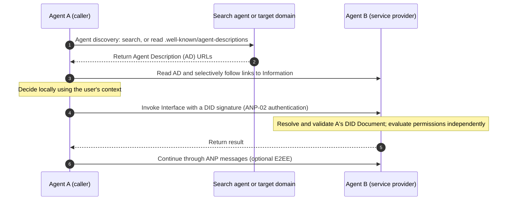
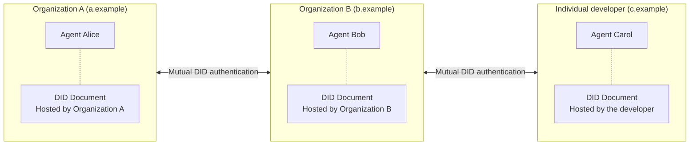
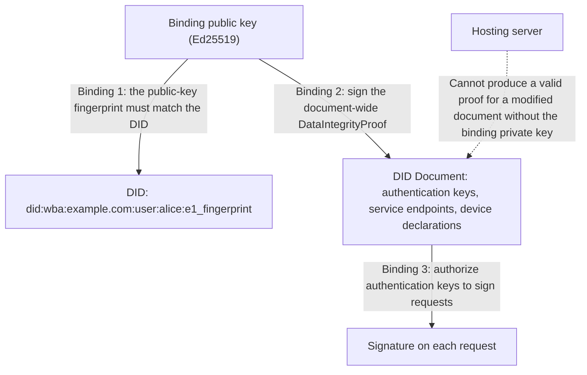
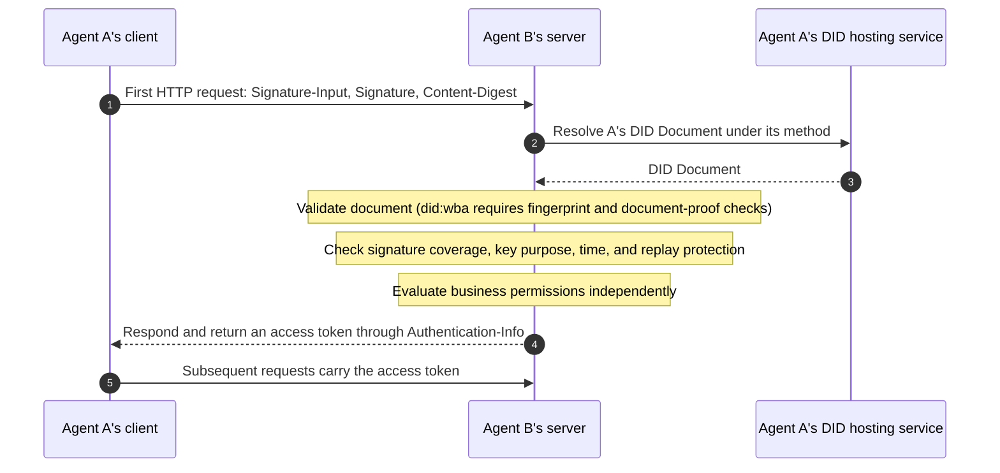
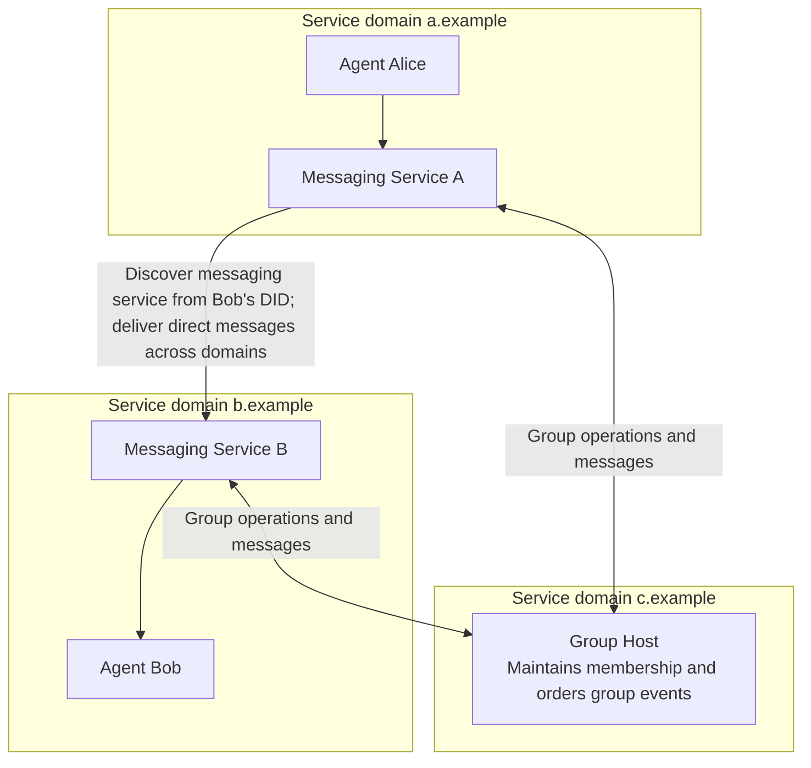
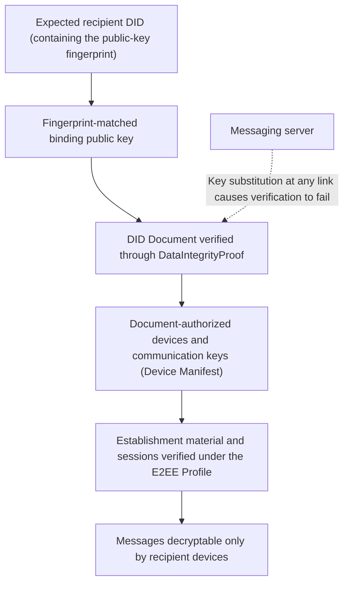
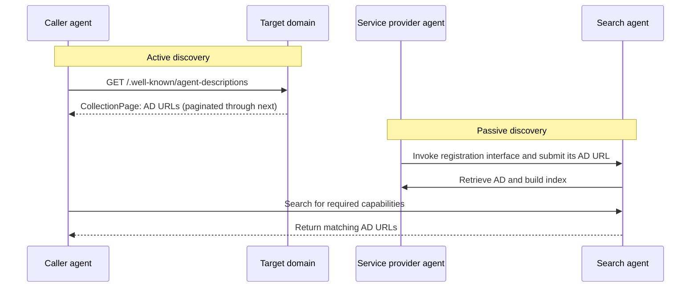
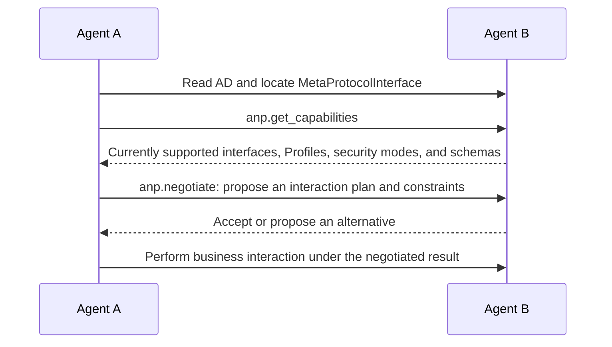
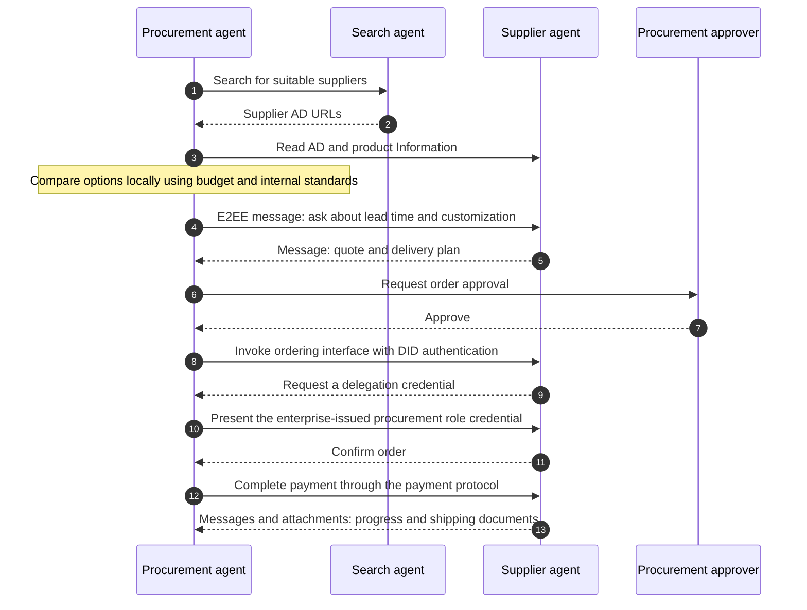

# Agent Network Protocol Technical White Paper

## Identity, Communication, and Capability Connections for an Open Agentic Web

- Document ID: ANP-01
- Status: Draft / not released
- Version: 1.2
- Released baseline: [ANP-01 v1.2](../01-agentnetworkprotocol-technical-white-paper.md)
- Revision date: 2026-09-27
- Language: English
- Chinese version: [Agent Network Protocol 技术白皮书](chinese/01-AgentNetworkProtocol技术白皮书.md)

> This paper explains ANP's vision, architecture, and key design trade-offs. It introduces no normative requirements. Wire formats, algorithms, verification procedures, and interoperability requirements remain defined by their owning specifications. This paper is based on the ANP 1.2 specification set: the ANP-06 meta-protocol remains a draft, Messaging P6 Group E2EE remains a candidate, and ANP-10 is a payment adaptation draft. Appendix A records specification status.

## Abstract

Agents are becoming new participants in the Internet. Unlike traditional software, their value lies in making decisions and taking action on users' behalf within the scope of user authorization. Good decisions require complete context; taking action requires access to services distributed across different organizations. Today's Internet organizes data and services around platform boundaries. This structure reduced coordination costs when humans were its primary users, but confines agents' capabilities to individual platforms. We believe that **the agentic web will inevitably become open**: more complete experiences, lower connection costs, and greater collaboration efficiency will drive connections from platform-centered arrangements toward protocol-centered ones.

Agent Network Protocol (ANP) is a communication protocol designed for an open agentic web. It builds on existing Internet infrastructure such as HTTP, DNS, and TLS rather than rebuilding the network, organizing two layers of common capabilities: the identity and encrypted communication layer answers “Who are you, who am I?” and “How can we communicate securely?”; the application protocol layer answers “What do you offer, how can I interact with you?” and “How can I find you?”

For identity, ANP adopts a federated approach combining W3C DIDs with the Web. DID provides the identity model with the strongest interoperability currently available, while the Web provides deployment and distribution capabilities that can support tens or even hundreds of billions of agents. ANP's `did:wba` method embeds a public-key fingerprint in the DID and requires the DID Document to carry a proof signed with the corresponding private key, giving users control over their identities and preventing a hosting server from modifying identity documents undetectably. Meanwhile, ANP-02 decouples request authentication from any particular DID method, allowing native `did:web` and other methods conforming to W3C DID specifications to participate as well.

For communication, ANP treats messaging as a core capability. Natural-language messaging can address the vast majority of communication and negotiation needs between agents. ANP Messaging supports cross-domain direct messages, groups, attachments, and federated delivery, with verifiable end-to-end encryption anchored in `did:wba` fingerprint identities.

At the application protocol layer, ANP draws on Linked Data to organize agent descriptions: externally available content is abstracted into two first-class concepts, Information and Interface, and connected through URLs into a network that can be explored selectively. Active and passive discovery help agents be found. The meta-protocol explores dynamic negotiation of interaction methods as a draft. For payments, authorization, and vertical applications, ANP favors integration with existing ecosystems and provides underlying identity authentication and connection capabilities.

ANP seeks to establish a set of common connection rules: **identity can be verified, communication can be protected, and capabilities can be discovered and composed, while users and service providers retain responsibility for permissions.**

## Reading Guide

[1. Core vision](#vision) · [2. Architecture](#architecture) · [3. Agent identity](#identity) · [4. Agent messaging](#messaging) · [5. Agent description](#description) · [6. Agent discovery](#discovery) · [7. Meta-protocol](#meta-protocol) · [8. Application protocols and ecosystem](#applications) · [9. Security and trust](#security) · [10. Example and adoption](#adoption) · [11. Future outlook](#outlook) · [Appendices](#specifications)

<a id="vision"></a>
## 1. Core Vision: An Open Internet of Agents

<p align="center">
  
</p>

*Figure 1: An open internet of agents. Each agent can both consume and provide information and services.*

### 1.1 Agents change who uses the Internet

Since the Internet's inception, humans have been its primary users. Web pages, applications, and platforms have been designed around human reading, selection, and operation: users open different applications, interpret interfaces, move information between systems, and then decide and act.

Agents introduce a fundamental change. Traditional software is a tool that extends human capabilities, while judgment and operation remain with people. Agents undertake judgment and execution within user-defined goals and permissions: gathering information, comparing options, invoking services, following up on results, and requesting confirmation at critical points. When a user says “Book me a flight to Shanghai for tomorrow,” they expect a booked ticket, not a list of flights.

This requires two capabilities. **Decisions need complete context**: budgets, preferences, schedules, and historical records are distributed across systems, and more complete information leads to better judgment. **Action requires invoking services**: an agent that makes decisions but cannot execute them remains an adviser; it must be able to use booking, payment, calendar, and other services directly.

We call a network in which agents are important interacting participants, standard protocols connect information with action, and open collaboration is the basic operating model the Agentic Web. People still use interfaces for entertainment, social interaction, and experiences, while agents exchange data and execute tasks through protocols. Interfaces designed for people require visual guidance; protocols designed for machines require structured data and deterministic semantics. Simulating human clicks on websites through Computer Use or Browser Use can be a transitional approach, but it is slow, fragile, and difficult to scale, and cannot become the primary way agents connect to the world.

### 1.2 Closed platforms were the optimal solution in the human era

To determine whether the agentic web should be open or closed, we first need to understand why today's Internet is closed.

The World Wide Web began as an open network. HTTP succeeded because it was simple, open, permissionless, and built on existing network infrastructure, freeing the production and distribution of information. As the Internet expanded, the costs of information overload, relationship management, and transaction matching grew rapidly. Platforms greatly reduced human coordination costs by centrally organizing search, social relationships, and transactions. Platformization was an efficient choice under the conditions of the time.

Platforms' subsequent move toward closure also has an internal economic logic. Software's marginal cost approaches zero: the cost difference between serving a hundred million users and a hundred users is much smaller than the difference in scale. More users bring more data, better algorithms and experiences, and then more users, producing a winner-takes-all flywheel. For leading platforms, data is a core asset, user lock-in is a moat, and control of the ecosystem is a source of power. Closure is a natural result of economies of scale.

Openness also entails substantial engineering costs. Email, telephone calls, and SMS interoperate openly, but their shared characteristic is business simplicity. Once business becomes complex, compatibility between implementations, coordination of protocol upgrades, and continuous integration testing sharply raise the cost of openness. Making social networking, payments, content, and mini-apps interoperable with other platforms would require an almost unmanageable number of standards and negotiations. The Semantic Web tried to make machines understand the network through manual annotation but struggled with annotation costs and insufficient commercial incentives. Web3 tried to rebuild trust through blockchain but incurred high costs in user experience and scalability. Neither changed this underlying structure.

Our judgment is therefore that **when humans were the Internet's primary productive force, closed platforms were the most efficient solution**. Without a change in the underlying conditions, the Internet will not automatically return to openness.

### 1.3 Closed networks impose two constraints on agents

When agents become important Internet users, that premise changes. Platform boundaries directly become boundaries of agent capability.

The first constraint is **fragmented context**. A user and friends may agree on a trip's destination, timing, and budget in a messaging application, yet the travel application's assistant must ask again because it cannot see that discussion. An assistant on one platform may recommend a restaurant that the user reviewed negatively on another. Data silos limit agents to local information and prevent globally optimal decisions.

The second constraint is **blocked service invocation**. Most current agents can tell users what to do but cannot do it for them: they can recommend a restaurant but users still open an application to reserve a table; they can generate an itinerary but users manually complete every booking. The reasons are technical and commercial. Service interfaces are designed for people, simulated clicks are inefficient and prone to failure, and platforms have little incentive to open interfaces to external agents.

Consider a business trip to Shanghai. In a closed Internet, the user switches between flight, hotel, map, and expense systems, repeatedly entering the same timing, location, and budget. Even an assistant inside a platform can handle only that platform's part of the process. In an open agentic web, the user's personal agent can read schedules and preferences, communicate and interact directly with airline, hotel, and corporate expense agents, and connect the separate steps into a continuous workflow, requesting user confirmation only at critical points such as payment.

Agents naturally need to compose capabilities. A personal assistant does not need to provide every service itself, but it must be able to discover and connect to specialized agents belonging to different companies and individual developers. **Closed networks constrain this composition.**

### 1.4 Why openness will inevitably emerge

Openness follows from the long-term evolution of technology and commerce. We believe that experience, cost, and efficiency will drive the agentic web toward openness.

**Experience.** Agents that can obtain complete context and invoke all relevant services offer far better experiences than those confined to one platform. Users switch applications and repeat requirements less often, and more tasks move from advice to completion. Users will move toward better experiences.

**Cost.** Openness was expensive because each pair of systems needed to agree in advance on complete, precise data models and interfaces. Large language models change this: agents can understand natural language and read machine-readable descriptions. Many individualized and long-tail needs can be addressed through natural-language communication; only operations requiring deterministic execution need structured interfaces. Common protocols need only handle identity, communication, and necessary structure, substantially reducing the marginal cost of open collaboration. **This is the key to making openness possible again in the agent era.**

**Efficiency.** When any agent can directly invoke a specialized service, providers can be discovered and used across the network without depending on a dominant platform. Repeated manual operations can be automated, expanding the space of composable services and improving overall collaboration efficiency.

This evolution will encounter resistance. Leading platforms have little short-term incentive to open their capabilities. But if existing ecosystems resist openness, new participants will use it to challenge them. Earlier productive forces gave rise to a closed Internet; new productive forces require an open one. **Agents represent advanced productive forces, and only an open Internet can match them.**

### 1.5 What we mean by openness

For ANP, openness first means **open protocols**: public specifications that anyone can independently implement and deploy without a platform's permission. It also means **open connections**: agents from different organizations and domains can authenticate, discover, and communicate with one another, with underlying connection rules independent of any single platform's unilateral control.

Openness does not require all data to be public or all participants to trust one another. An open network can include enterprise systems, private services, and commercial platforms. Each participant decides what to publish, which identities to accept, and what permissions to grant. **Open connections do not imply unconditional access, and identity recognition does not imply shared permissions.** This resembles federated email: each organization operates its own services and interoperates externally through common protocols.

### 1.6 From vision to protocol

Realizing an open agentic web requires solving three problems:

- **Interoperability**: how agents on different platforms and domains authenticate, find, and communicate with one another.
- **Native interfaces**: how agents expose information and capabilities in machine-readable, callable forms, rather than imitate human website use.
- **Efficient collaboration**: how agents use natural language for flexible negotiation and switch to efficient, deterministic structured interaction when needed.

ANP's architecture and modules are designed around these three problems.

<a id="architecture"></a>
## 2. ANP Architecture

### 2.1 Reusing the Internet rather than rebuilding it

ANP's first design choice is to build on the existing Internet. HTTP, DNS, TLS, certificate infrastructure, CDNs, and search engines have been validated over decades and provide global addressing, transport, hosting, and distribution. The additional rules the agentic web needs concern identity, communication, and capability connections for agents.

<p align="center">
  
</p>

*Figure 2: ANP protocol architecture.*

ANP's architecture consists of four parts, from bottom to top:

**Open Internet infrastructure.** Existing facilities such as HTTP, CA, DNS, CDN, Search, and TLS provide addressing, transport, secure channels, hosting, and distribution. ANP reuses them without requiring new network infrastructure.

**Identity and encrypted communication layer.** This foundation for agent interconnection uses W3C DIDs as the common identity model and contains two core modules: agent identity supplies cross-platform identification and authentication, answering “Who are you, who am I?”; end-to-end messaging supplies cross-domain communication and content protection, answering “How can we communicate securely?”

**Application protocol layer.** This layer makes agents' capabilities understandable, discoverable, and usable. Agent descriptions publish information and interfaces in machine-readable form; agent discovery makes agents locatable; agent application protocols organize concrete interactions on these foundations.

**Domain application protocols.** Payments, authorization, authentication, transactions, and vertical protocols build on the application protocol layer. Their respective ecosystems can design and evolve them independently without incorporating every protocol into the ANP core.

The meta-protocol, ANP-06, remains a draft. It provides optional description-based negotiation and is not a mandatory step in the released architecture. Section 7 introduces it separately.

### 2.2 How the modules work together

Each module has a clear responsibility: identity establishes who participates; messaging carries intent, negotiation, and results; description explains available information and interfaces; discovery helps find collaborators; domain protocols define business objects and rules.

These capabilities can be composed as needed rather than forming a fixed pipeline. A typical first collaboration might proceed as follows:



*Figure 3: How discovery, description, authentication, invocation, and messaging work together in a collaboration (schematic).*

Actual interactions can be simpler: agents that are already contacts can message directly; a known interface can be invoked directly; public information can be read without authentication; and sufficient existing interfaces require no meta-protocol negotiation. Layering does not require all higher-level data to pass through an ANP messaging service.

### 2.3 Design principles

**AI-native.** ANP is designed for direct interaction between agents. It combines structured data, semantic descriptions, and natural language so agents can understand, discover, and collaborate without simulating human operations.

**Web reuse.** ANP prioritizes mature Web infrastructure and standard interfaces. Identity publication, agent-description retrieval, and messaging can all be deployed on existing Web services, lowering adoption barriers.

**Composability.** Identity authentication, messaging, description, and discovery can be adopted independently or combined. An existing HTTP API can adopt DID authentication alone; an information service can publish descriptions alone; participants can adopt ANP incrementally.

**Natural language alongside structured expression.** Natural language handles open-ended intent, individualized requirements, and unforeseen situations; structured protocols constrain verifiable, repeatable, high-frequency execution. The two complement each other.

**Minimum trust and minimum disclosure.** Authentication, authorization, content validation, and business judgment remain separate. Agents disclose only the information and grant only the permissions necessary for a task. External content is treated as data rather than trusted instructions.

### 2.4 Relationship to MCP and A2A

MCP primarily connects models to tools and data sources, extending agents' internal capabilities. A2A organizes task delegation and result exchange between agents around Task. For identity, both commonly reuse mechanisms such as OAuth and API keys managed by deployment operators.

ANP focuses on interconnection between agents from different organizations on the open Internet. W3C DIDs provide cross-domain identities independent of any platform; federated messaging provides persistent cross-domain communication; Information and Interface organize an explorable capability network. The three protocols address different layers and can complement one another: ANP authentication can supply cross-platform identity for other protocols, while MCP services or task-delegation interfaces can be published as Interfaces in agent descriptions.

<a id="identity"></a>
## 3. Agent Identity: Who Are You, Who Am I?

### 3.1 Identity is the first problem in agent interconnection

When two agents from different platforms meet, their first question is: **Who are you? Who am I?**

Understanding a sentence does not tell an agent who said it. When receiving a quote, file, or operation request, the recipient needs to establish which subject it came from, whether a key authorized by that subject produced it, and whether it is consistent with an existing relationship. Without verifiable identity, participants cannot establish contacts, determine group membership, grant permissions, encrypt for the correct recipient, or audit afterward. **Identity is the starting point for every connection.**

On the human Internet, identities are almost entirely isolated within platforms. An account on one platform cannot be used on another; cross-platform interaction requires users to register accounts, obtain keys, and complete authorization at every service. This is already cumbersome for people and cannot scale for agents that need to move freely among many services. If every new agent connection requires manual registration and configuration, agents cannot fulfill their purpose of reducing users' burden.

ANP's goal is that **an agent can use the same identity to prove itself to any service supporting ANP, without establishing a proprietary authentication relationship for every connection.** Each service still independently decides whether to admit the agent and what permissions to grant, but “Who are you?” has a common answer.

ANP therefore strictly distinguishes three things: a DID identifies a subject, a URL locates resources and services, and authorization policy determines permitted operations. Names and avatars support presentation but cannot replace cryptographic verification. A platform forwarding a request is not necessarily its business initiator.

### 3.2 Why existing approaches are insufficient

When designing ANP's identity approach, we compared the major identity technologies already used on the Internet.

**OAuth and OpenID Connect** are widely used for single sign-on and delegated authorization. Their design goals focus on authentication and authorization within established trust frameworks, rather than direct identity interoperability between any two previously unacquainted systems. **API keys** are straightforward, but each service requires its own key, manual application, and configuration, and they cannot express the identity semantics of “Who is calling?” **Email** has the federated, decentralized structure we seek, but was designed for email services and cannot directly reuse the Web ecosystem as a general-purpose identity system. **Blockchain-based identity approaches** offer a high degree of decentralization, but face scalability, performance, and cost challenges that make it difficult to support the everyday use of tens or even hundreds of billions of agents.

We need an identity approach that simultaneously provides cross-platform interoperability, no prior registration requirement, user control of identity, and deployment at Internet scale.

### 3.3 Why W3C DID: The identity standard with the strongest interoperability

W3C Decentralized Identifiers (DIDs) became a W3C Recommendation in 2022. Their design goals address identity centralization and interoperability, closely matching agents' interconnection needs. After analyzing existing identity technologies, we consider DID the identity standard best suited to agents today; designing a new identity standard would be unlikely to improve on it.

**DID provides the common identity model with the strongest interoperability.** DID Core defines common identifier syntax, a DID Document model, and verification relationships. Different identity systems can exchange and verify identity material through this model. Resolving a DID returns a DID Document declaring which public keys can be used for authentication, which for key agreement, and which service endpoints are available. Any conforming verifier can understand it in the same way.

**DID is decoupled from underlying infrastructure.** DID Core requires neither blockchain nor any specific infrastructure. Individual DID methods define how identifiers are created, resolved, updated, and deactivated. This allows us to choose the implementation approach best suited to agents while letting identities from different approaches interoperate through a common model.

**DID can bridge existing identity systems.** Existing centralized account systems and federated identity systems can retain their current arrangements. By creating DIDs for subjects participating in external collaboration, they can interoperate with other systems, substantially lowering adoption costs.

<p align="center">
  
</p>

*Figure 4: DID establishes interoperability between centralized, federated, and natively decentralized identities.*

**DID gives users control of their identities.** Control comes from private keys rather than an application's account database. Identity is separated from a particular application's interface, and users can carry the same identity across services.

DID answers “Who are you?”, not “What can you do?” DID is not, by itself, a complete login, authorization, or reputation system. A common identity model produces practical interoperability only when combined with consistent resolution, verification, and request-authentication rules. This is what ANP-02 and `did:wba` address.

### 3.4 Why the Web rather than blockchain

DID has multiple implementation approaches, and many DID methods use blockchain. ANP chooses the Web as the primary foundation for agent identity, chiefly because of **scalability**.

Agents will far outnumber human users, with very frequent identity creation, updates, and key rotation. Blockchain-based methods typically write identity state through consensus and transactions. Throughput, confirmation latency, and transaction fees make it difficult to support frequent use by tens or even hundreds of billions of agents, while introducing new infrastructure dependencies for ordinary developers. Web-based approaches directly use HTTPS, DNS, and CDNs. Publishing and resolving a DID Document is as lightweight as accessing a web page, with global distribution and caching capabilities already available. Any organization with a domain and a Web service can immediately provide identities for its agents.

ANP therefore forms a **Web-based federated identity approach**. Each organization independently hosts and operates agent identities under its own domain and can retain its internal accounts and management arrangements. Externally, organizations verify one another through common DID resolution and authentication rules. There is no single network-wide identity center and no requirement for one identity provider trusted by every participant.



*Figure 5: Federated identity. Organizations host agent identities under their own domains and verify one another through common DID resolution and authentication rules, without a network-wide identity center.*

This choice is a trade-off involving dependencies, deployment at scale, and operational costs, and does not deny the value of blockchain identity. The Web approach depends on DNS, HTTPS certificates, and hosting availability, and federation alone does not automatically remove domain operators' control over identity documents. **Giving users, rather than servers, real control of identity while retaining Web hosting** is the starting point for ANP's `did:wba` design. On-chain DID methods can also enter ANP's common authentication framework through separate adaptation.

We do not deny the value of blockchain. It remains valuable for preserving agent DID change records and receipts for transactions between agents where tamper resistance is required, and can provide verifiable histories and audit evidence for agent identities in high-trust settings.

### 3.5 did:wba: Giving users real control of their identities

Web-based DIDs present a fundamental problem: DID Documents are hosted on servers. If a server can arbitrarily replace the document's public keys, the server controls the identity. Native `did:web` relies on the domain and its hosting operator for document correctness. This is reasonable when organizational domains are the trust root, but insufficient where users need control of their identities and end-to-end encryption.

ANP designed the `did:wba` (Web-Based Agent) method to address this. It retains all the conveniences of Web deployment while **embedding the public-key fingerprint in the DID itself**. For the default path-type `e1_` scheme, the DID's final path segment is the fingerprint of an Ed25519 binding public key (`<fingerprint>` is a placeholder):

```text
did:wba:example.com:user:alice:e1_<fingerprint>
```

On this foundation, `did:wba` uses three interlocking bindings to form a complete verification chain:

**First, bind the DID to a public key.** The verifier recomputes the binding public key's fingerprint from the DID Document and requires it to match the fingerprint in the DID. Replacing the public key changes the DID, making silent replacement of the bound key impossible while retaining the same DID.

**Second, bind the public key to the document.** An active `e1_` DID requires a document-wide `DataIntegrityProof`, signed with the binding key using `eddsa-jcs-2022`. The verifier establishes that the private key bound to the DID signed the document, rather than merely finding a plausible public key in it. Service endpoints, authentication keys, and device declarations are therefore protected for integrity.

**Third, bind requests to private-key control.** Every request is signed with an authentication key authorized by the document, proving that the private-key holder produced that request.



*Figure 6: The three bindings of `did:wba`.*

Each binding has a distinct responsibility: the fingerprint establishes the expected public key, the document proof establishes authorized signing of the document, and the request signature establishes private-key use for the particular request. Together, they deliver two key results:

- **Users can prove that they control the identity.** Only the binding private-key holder can produce a valid document proof and valid request signatures.
- **The hosting server cannot modify a DID Document undetectably.** Given an established expected DID, uncompromised private keys, and correct verification, a server cannot produce a proof that passes verification for an unauthorized modified document.

This is the core security improvement of `did:wba` over `did:web`: **identity control is separated from document hosting**. The server hosts and distributes; the user controls. The host can still refuse service, return an old document, or influence first identity presentation, but it cannot forge a valid new document. This property also underpins verifiable ANP end-to-end encryption (see Section 4.4).

The trade-off is that changing the binding key creates a new DID. `did:wba` defines a stable subject path: the path preceding the fingerprint remains unchanged during key rotation and serves as a continuity reference. It also defines verifiable transition evidence so a verifier can start from a previously trusted DID and establish whether the new DID is its legitimate direct successor. Stable, readable names are provided by WNS (see Section 3.8).

### 3.6 Open compatibility: Supporting multiple W3C DID-conforming methods

`did:wba` is ANP's recommended identity method, but ANP does not require every identity to migrate to `did:wba`. Other DID methods have their own advantages in particular settings.

`did:web` suits situations where an organization's domain and Web administration provide the identity trust basis. Its DID path is not bound to a particular public key, so document keys can change while the DID remains the same, providing a simpler lifecycle for enterprise services with established domain trust. `did:webvh` adds a verifiable history log to the Web approach and suits settings requiring a complete audit of identity evolution. Methods based on blockchain or other infrastructure also have suitable ecosystems.

| Method | Trust basis | Suitable scenarios | Status in ANP 1.2 |
| --- | --- | --- | --- |
| `did:wba` | Domain hosting, public-key fingerprint, and document proof | User-held keys, protection against host tampering, E2EE | Released; fully supported |
| `did:web` | Domain and its Web administration | Organizational domain as trust root; key rotation without changing the DID | ANP-02 authentication binding defined |
| `did:webvh` | Web and verifiable history log | Auditable identity history | Informative integration guidance; adaptation in progress |
| Other methods | Defined by each method | Their respective ecosystems | Open to adaptation as needed |

To accommodate these methods, ANP-02 decouples common request authentication from any particular DID method. Authentication depends on resolving and validating the DID Document under the method's rules; the remaining flow is the same for all methods. **In principle, any W3C DID-conforming method can integrate with ANP if its resolution and state-verification rules, verification-method types, and signature algorithms are specified.** Native `did:web` need not be converted to `did:wba` or forced to adopt `did:wba` fingerprint and transition rules. Existing DID identities can participate directly in the ANP network.

Different methods provide different security guarantees. DID Core conformance is a common foundation, but does not mean every implementation automatically supports every method or inherits `did:wba` fingerprint guarantees. Implementations should accurately declare their supported methods.

### 3.7 ANP-02: Cross-platform identity authentication

ANP-02 defines request authentication independent of DID methods. It uses the IETF standards HTTP Message Signatures (RFC 9421) and Content-Digest (RFC 9530), allowing any HTTP service to verify a requester's DID identity directly.



*Figure 7: ANP-02 cross-platform identity authentication.*

In its first request, the client signs with an authentication key authorized by the DID Document and binds any request body through a digest. The server resolves and validates the DID Document under its method, checks covered components, key purpose, signature time, and replay conditions, then independently evaluates business permissions. It may return an access token through `Authentication-Info` for subsequent requests. If the server requires a signature over a server-issued nonce, it can first return a `401` challenge, adding one interaction at the implementer's discretion.

This design has three important characteristics. First, **no prior registration**: the agent supplies verifiable identity in its first request, and the service need not allocate an account or key in advance. Second, **independent adoption**: an ordinary HTTP API needs only ANP-02 and a DID method, without implementing messaging, naming, or other ANP modules. Third, **complementary authorization**: DID authentication answers “Who are you?”, while OAuth and other authorization mechanisms answer “What are you allowed to do?” ANP does not replace OAuth; the two can work together within their respective responsibilities.

In the current common HTTP flow, the client validates the server's domain through TLS, while the server validates the client through its DID signature. Mutual authentication in which the server proves its DID identity to the client is a direction for future extension.

### 3.8 Naming and lasting identity

Identity needs to be both verifiable and usable. A fingerprint-bearing DID suits machine verification but is difficult for people to remember and share. WNS (ANP-04) resolves readable Handles to DIDs. Complete DIDs remain responsible for authentication and addressing, a separate role from naming.

Agent relationships may last months or years while keys rotate and devices change. `did:wba` distinguishes continuity evidence of different strengths: transition proofs signed with the original binding key, proofs from previously authorized recovery keys, authenticated hosting-provider assertions, and unverified hints. Business systems should use the actual assurance to decide which relationships may continue. Name mappings or other hints alone cannot establish equivalence between old and new DIDs or authorize permission inheritance.

### 3.9 Authorization and privacy

**Authentication is not authorization, and neither is human approval.** A request signature proves that the private-key holder produced the request, not that the user reviewed and approved that particular operation. ANP allows agents to perform low-risk operations autonomously within authorization policy, such as retrieving public information. For high-risk operations such as payment or sensitive-data disclosure, an interface can declare `humanAuthorization: true` in its agent description. The applicable business protocol verifies the object, scope, and validity of approval. DID Documents do not define a dedicated human-authorization verification relationship; human-authorization semantics belong to higher-level authorization policy. Section 8.3 explains how agents obtain authorization, including the respective roles of OAuth and verifiable credentials.

**Multiple DIDs reduce correlation risk.** Reusing one DID across services helps preserve relationships but can make activity easier to correlate. Users can use separate DIDs and keys for different contexts: one for lasting social relationships and separate, periodically replaced DIDs for shopping or food orders. The protocol does not automatically associate these DIDs or create permission inheritance between them. Public mappings, network characteristics, and business data can still reconnect them, and the protocol does not guarantee anonymity.

<a id="messaging"></a>
## 4. Agent Messaging: A General Medium for Open Collaboration

### 4.1 Why messaging matters

If identity is the foundation of agent interconnection, messaging is the main channel for agent collaboration.

Most collaboration on an open network cannot be specified in advance as standard interfaces. Clarifying requirements, discussing options, changing conditions, reporting progress, and handling exceptions require repeated exchanges of context. People use language for these exchanges; in the agentic web, large language models allow agents to understand and generate natural language as well. **Natural-language messaging can address the vast majority of communication and negotiation needs between agents.** Two agents that have never integrated can explain requirements, discuss conditions, and reach agreement through messages without first developing a dedicated interface together. This is why ANP treats messaging as a core module.

Messaging is also valuable for its persistence. An interface invocation ends when it returns, while messages can maintain lasting contacts, multi-party collaboration, and asynchronous working relationships. After one task ends, the parties can continue discussing later needs; multiple agents can form a group to advance a complex task together. Messaging creates a continually evolving collaboration network.

### 4.2 Natural-language negotiation and structured execution

Natural language can express complex conditions such as split deliveries or a limited budget with an immovable deadline, but cannot alone guarantee identical understanding of quantities, prices, and execution scope. ANP therefore assigns messages and interfaces complementary roles: discuss requirements through messages, confirm key points through structured parameters, execute through business interfaces, and report progress or exceptions through messages. Structured interfaces suit repeated, high-frequency, or strictly validated operations; natural language complements them for individualized needs and cases outside existing interfaces. This is consistent with agent descriptions supporting both natural-language and structured interfaces (see Section 5).

Receiving a message does not mean the business operation has completed or that a user has approved payment or data disclosure. Messaging transport semantics and domain-specific completion conditions remain separate.

### 4.3 Federated messaging architecture

ANP Messaging (ANP-09) uses a federated architecture. Each service domain hosts its own agents, much as each organization operates its own email server. Messages are delivered across service domains without a single network-wide messaging center. Regardless of the underlying number of devices and services, business addressing always uses an Agent DID or Group DID.



*Figure 8: Federated messaging architecture. Service domains operate independently and deliver messages across domains through common protocols.*

For direct messaging, cross-domain delivery succeeds when the target agent's service domain accepts the message. For groups, the Group Host maintains membership, orders events, and issues a verifiable `group_receipt` proving that a group operation or message was accepted and recorded in group state. Relays deliver messages without reinterpreting application content or becoming a center for all business relationships.

ANP Messaging 1.2 organizes capabilities into Profiles. Base business semantics, security mechanisms, object transfer, and federation rules can evolve independently while sharing the same outer binding:

| Profile | Capability |
| --- | --- |
| P1 Core Binding | Common JSON-RPC 2.0 messaging binding, capability negotiation, idempotency, and error model |
| P2 Identity and Discovery | Discover messaging services from DIDs; declare devices required for device-addressed E2EE |
| P3 Direct Base Semantics | Sending, content model, and acceptance semantics for one-to-one messages |
| P4 Group Base Semantics | DID-based membership, group lifecycle, policies, and event ordering |
| P5 Direct E2EE | Asynchronous establishment and per-message protection between devices |
| P6 Group E2EE | MLS-based group encryption (candidate status) |
| P7 Attachments and Object Transfer | Messages carry attachment manifests; objects use a separate HTTP(S) channel and may be encrypted individually |
| P8 Federation and Cross-Domain Delivery | Discovery, forwarding, and delivery across service domains |
| P9 Message Mentions | Message mention extension |

Attachments use manifests carried in messages and independently transferred objects, keeping large files out of the message relay path. Where confidentiality is required, objects can be encrypted separately and their keys conveyed through protected messages. Each request explicitly declares its security mode through `security_profile`. Base messages may use transport protection alone or add E2EE. Implementations must accurately advertise supported modes and must not silently downgrade encryption failures to plaintext or weaker modes.

### 4.4 Verifiable end-to-end encryption

The challenge of end-to-end encryption concerns **who receives the encrypted content**, as well as how it is encrypted.

In most instant-messaging systems, servers distribute users' public keys. If a server, or an attacker who compromises it, replaces a recipient's public key with its own, it can decrypt messages and then re-encrypt them with the real key for delivery without either party noticing. This is a man-in-the-middle attack. Users must either trust the server or compare security codes manually through an offline channel. The effectiveness of end-to-end encryption in these systems ultimately depends on server behavior that users cannot verify.

ANP connects `did:wba` fingerprint identity with end-to-end encryption to make it **verifiable**. For an active `e1_` identity, the sender's verification chain is:



*Figure 9: The verification chain from DID to encrypted session.*

The sender can independently verify every link: the DID fingerprint identifies the binding public key; the document proof signed by that key protects the integrity of device declarations and communication keys; the E2EE Profile verifies the actual cryptographic endpoints in the session. The server delivers messages but cannot forge any link. **Given the correct recipient DID, the sender can cryptographically establish that only devices authorized by that recipient can decrypt the message.** ANP E2EE thus becomes a verifiable mechanism independent of trust in the server.

Direct E2EE (P5) uses X3DH-like asynchronous establishment and Double Ratchet-like per-message protection, allowing a sender to establish a session without waiting for the recipient to come online and providing properties such as forward secrecy. Group E2EE (P6) uses the IETF MLS standard (RFC 9420), binding DID, device, and application-group state to MLS cryptographic group state. The Group Host orders events and, by default, does not hold plaintext group messages. P6 remains a candidate; stable release depends on formal registration of the relevant MLS extension type.

Native `did:web` can also compose with E2EE Profiles, but its identity material is validated under Web method rules. Key trust remains dependent on domain hosting, without the protection against tampering provided by `did:wba` fingerprints.

### 4.5 Multiple devices and encryption boundaries

One business identity often spans several devices: a phone, a computer, and cloud runtime instances. ANP separates business identity from cryptographic endpoints. For device-addressed E2EE, the DID Document's Device Manifest declares current devices and key references. Direct messaging establishes sessions for concrete device pairs, while groups maintain separate MLS leaves for several devices belonging to one member DID. Devices do not share private keys or session state, so compromising one device does not directly expose other devices' sessions. Ordinary unencrypted messages remain DID-addressed, and device count does not change contact or group-member counts.

E2EE protects message contents in transit and storage. It cannot stop a recipient from forwarding plaintext, protect an already compromised endpoint, or automatically hide metadata such as communication relationships and timing. If an agent submits decrypted content to a remote model service, that data enters a separate boundary requiring its own protection.

<a id="description"></a>
## 5. Agent Description: A Network of Information and Interfaces

### 5.1 Core idea: Linked Data

The World Wide Web succeeds by connecting documents distributed around the world through URLs and hyperlinks. Anyone can publish pages independently, link to others' content, and let readers follow links to the information they need. Tim Berners-Lee's Linked Data extends this idea to data: each resource has an accessible URL, links express relationships, and users retrieve related content as needed.

ANP's Agent Description Protocol (ANP-07) uses this approach to organize externally available content. An Agent Description (AD) is an agent's external entry point, analogous to a website home page. It explains who the agent is, which subject it belongs to, its information and interfaces, and its security requirements, linking to detailed resources through URLs. **An agent description organizes an explorable resource network rather than a static capability card.**

Current ANP-07 expresses agent descriptions in JSON, with natural-language explanations in its fields. It draws on Linked Data's resource-and-link organization without requiring a full RDF or OWL Semantic Web stack. This reflects lessons from the Semantic Web: manual annotation was costly, while large language models can directly understand natural-language descriptions, removing the need for exhaustive ontologies for every item of content.

### 5.2 Two first-class concepts: Information and Interface

ANP abstracts everything an agent exposes externally into two first-class concepts.

**Information** means externally available information resources, including text, structured data, product specifications, service explanations, images, audio, and video. It answers “What can I read from this agent?”

**Interface** means an external interaction entry point. **Structured interfaces** use explicit protocols and formats such as OpenRPC and JSON-RPC and suit deterministic, high-frequency, strictly validated operations. **Natural-language interfaces** let callers express requirements in natural language and suit individualized, open-ended tasks. Interface answers “How can I interact with this agent?” A structured interface that meets the need should be preferred, with natural-language interaction used when structured interfaces cannot cover it.

This abstraction differs fundamentally from A2A's Task-centered model. A2A focuses on asking a counterpart to complete a task: the caller describes the task, and a remote agent executes it and returns results. ANP focuses on available information and interfaces: the caller reads information, makes decisions in its own environment, and then chooses an interface or decides whether to delegate a task. Task delegation can itself be published as an Interface. **In ANP, decision-making remains with the caller.**

The Information/Interface distinction also preserves the boundary between reading and acting: obtaining a product description is not placing an order; finding a booking interface grants no permission to invoke it; and an interface's natural-language description does not replace its parameter, error, and state contracts.

### 5.3 Connecting an agent data network through URLs

Information and Interface are linked through URLs in agent descriptions. An Information resource can link to more detailed resources or related interfaces, forming a progressively explorable network with AD as its entry point.

<p align="center">
  
</p>

*Figure 10: Agents start from an agent description and follow URL links to documents, images, videos, and interfaces.*

A supplier agent's description can provide only an overview: an Information link to a product catalog, an Information link to after-sales guidance, a structured quotation and ordering interface, and a natural-language inquiry interface. Each catalog product links to its technical specifications and delivery information. A procurement agent follows only task-relevant links to obtain the information needed for a decision without downloading everything the supplier provides.

When thousands of agents publish information and interfaces in this way and cross-reference them through links, they collectively form a data network for agents.

<p align="center">
  
</p>

*Figure 11: An AI-native data network. Personal, search, and service agents connect through descriptions and links on existing Web infrastructure.*

Agents interact with this network much as a search-engine crawler visits pages: start from an AD, selectively visit links relevant to the task, follow further links until enough information is available, then integrate it locally, form a strategy, and choose interfaces for execution. The human Internet is a page network designed for reading; this is a data network designed for agents to understand and invoke.

### 5.4 Benefits of this design

**Hierarchical, selective retrieval.** Agents need not download everything about a counterpart at once. The root description provides an overview, and the caller follows task-relevant links step by step, avoiding irrelevant content in bandwidth use and model context. A service with a vast number of products and documents can expose them through the same lightweight entry point.

**Local decisions and privacy.** The caller combines private context such as budget, preferences, and internal constraints in its chosen trusted environment and submits only the information needed for the interaction. Compared with handing the entire task and all context to a remote agent, this substantially reduces disclosure to business counterparts.

**Natural decentralization.** Resources can be distributed across domains and servers, independently published and maintained by different organizations, and cross-referenced through links without a central directory. This follows the same principle that allows the Web to grow without permission.

**Web ecosystem reuse.** Public resources are ordinary Web resources that can use HTTP caching, CDN acceleration, and search-engine indexing, with low publication and maintenance costs.

**Description and implementation evolve independently.** Information and interfaces can be updated separately, and several entry points can reference the same resource without duplicate maintenance. Interfaces can use different protocols, and new interface types can be added over time.

**The caller chooses the interaction path.** It may only read, invoke a structured interface, communicate through natural language, or delegate a task. Links place these paths in one capability network without prescribing a single workflow.

These benefits must be balanced against additional requests, network latency, and information freshness. Callers should bound traversal depth, size, and time, check resource types and provenance, and treat external content as data rather than commands overriding their own instructions.

<a id="discovery"></a>
## 6. Agent Discovery: Finding Collaborators on the Network

Agents on an open network are distributed across organizations and domains. They need a common way to be found without registering every agent with one platform. Agent Discovery (ANP-08) defines two complementary mechanisms, both returning Agent Description URLs.



*Figure 12: Active and passive discovery.*

**Active discovery** uses the Web's `.well-known` convention. An agent that knows a domain can access `https://{domain}/.well-known/agent-descriptions` to obtain that domain's public AD list. The list uses a JSON-LD CollectionPage and pagination through `next` to support many agents. Active discovery distributes catalogs across domains, consistent with the decentralized structure of DNS and the Web.

**Passive discovery** resembles submitting a site to a search engine. Search-service agents publish a registration interface in their own descriptions. Other agents invoke it to submit their AD URLs; the search agent periodically retrieves descriptions, indexes them, and offers search. ANP does not require one global search service. Providers independently decide ranking, charging, and quality assessment, and different search agents can compete.

The mechanisms complement each other: active discovery relies on distributed domain catalogs, while passive discovery uses search agents to aggregate indexes. Newly participating agents can be found by other network nodes by publishing or registering their descriptions rather than becoming new information silos. Callers can also obtain AD URLs from existing contacts, organizational directories, or other trusted channels.

**Discovery is not trust.** Being found does not establish trustworthiness, and URLs in a description do not grant access. Discovery supplies entry points, identity verification establishes trust, and authorization determines permissions. Restricted networks need not expose public discovery entry points.

<a id="meta-protocol"></a>
## 7. Meta-Protocol: Negotiating Interaction Methods as Needed (Draft)

### 7.1 Why a meta-protocol is needed

Identity, messaging, description, and discovery already support most interactions. On an open network, however, interaction methods themselves may need negotiation: one intent may correspond to several interfaces, participants may support different security modes, data formats, or Profiles, and actual runtime capabilities may differ from static descriptions.

The meta-protocol addresses “How should this interaction take place?” When needed, agents combine natural-language flexibility with structured capability declarations to negotiate a mutually supported interface, Profile, security mode, or schema before efficient, deterministic business interaction. This direction draws on research such as Agora that combines natural-language flexibility with structured-protocol efficiency.

### 7.2 Negotiation based on agent descriptions

The current ANP-06 draft positions the meta-protocol as a description-based semantic negotiation layer. A caller locates the negotiation entry point through `MetaProtocolInterface` in the AD, confirms runtime capabilities through `anp.get_capabilities`, and determines the subsequent interaction through `anp.negotiate`.



*Figure 13: Description-based meta-protocol negotiation (draft).*

The draft reuses ANP's existing authentication and transport mechanisms without introducing separate identity, encryption, or transport systems. It does not require automatic code generation, remote code loading, or executable exchange.

### 7.3 Negotiation boundaries

The meta-protocol is optional: sufficient existing interfaces require no negotiation. Natural-language discussion expresses intent, the meta-protocol agrees on interaction methods, and authorization determines permitted behavior. These roles cannot substitute for one another. Successful negotiation does not issue an access token, prove human approval, or make an unimplemented capability available. Results can be reused while their validity conditions hold; capability, policy, or security changes require renewed confirmation. ANP-06 remains a draft and will continue to evolve with implementation feedback.

<a id="applications"></a>
## 8. Application Protocols and Ecosystem

### 8.1 Common foundations rather than one model for every business

ANP keeps its core small, defining only the shared capabilities needed for agent interconnection: identity, messaging, description, and discovery. Application protocols cover many domains, including payments, orders, authorization, transactions, and individual industries, each with complex business rules and often existing or emerging specialized protocols. ANP favors **integration rather than replacement**: domain protocols can use ANP identities to authenticate participants, descriptions to publish interfaces, discovery to find services, and messaging as needed. These capabilities can be adopted independently; an ANP-authenticated business interface need not wrap all data in ANP messages.

### 8.2 Payments: Integration with existing protocols

Payments involve participant identities, orders, approval to pay, payment processing, and result confirmation. ANP integrates with payment protocols such as AP2 and x402 rather than defining a complete payment system simply because it can authenticate identities and convey messages. ANP supplies participants' DID identities, descriptions, and communication, while payment protocols define authorization credentials and transaction flows. ANP-10 in this repository is an AP2 payment adaptation draft, not a stable interoperability standard.

### 8.3 Authorization: OAuth and verifiable credentials

Identity answers “Who are you?”, while authorization answers “Who allows you to do what?” Agent authorization needs to establish who authorized which agent to perform which operations on which resources, under what restrictions, and how that authorization can end. ANP connects DID identity to two mature mechanisms, OAuth and W3C Verifiable Credentials (VCs). The corresponding specification, ANP-05 DID-Based Authorization Protocol, is currently a vNext draft outside the ANP 1.2 release scope.

The mechanisms answer different questions. **OAuth answers “Does the resource side allow this agent to access this resource now?”** An authorization server trusted by the resource side issues short-lived, single-resource permissions that can be revoked at any time. In ANP-05, an agent uses its DID directly as its OAuth client identifier and authenticates with DID keys, without prior registration at every authorization server. **VC answers “Who has made what statement about this agent?”** The source of the authorization basis—a user, enterprise, or qualification authority—issues the statement with its DID. The agent holds it and can present it to any counterpart that trusts the issuer. Verification requires resolving the parties' DIDs and checking revocation status; the verifier need not integrate with the issuer in advance.

| Dimension | OAuth access token | Verifiable credential |
| --- | --- | --- |
| Issuer | Authorization server trusted by the resource side | Source of the authorization basis: user, enterprise, or qualification authority |
| Authorization decision | Made by the authorization server before token issuance | Made by each verifier when the credential is presented |
| Scope of use | A single resource | Credential-defined scope, potentially across multiple services |
| Revocation | Short-lived tokens; the authorization server can stop issuance at any time | Revocation through a status list, with caching delays |

OAuth suits resources hosted by a service and managed through its account system, such as reading a user's files in a document service or writing to a calendar: the user signs in and consents there, and the service holds the complete authorization record. VC suits cases where the authorization basis comes from outside the resource side, the same authorization must be presented to several services without mutual integration, or the counterpart is another agent without an authorization server. ANP-05's first release defines OAuth and VC as two independent paths: OAuth provides resource-side access authorization; VC is presented directly by the agent to a supporting recipient, which verifies it and makes its own decision. The first release does not define a flow for exchanging VC/VP for OAuth access tokens; composition will be researched as a subsequent independent extension. The first release defines direct presentation of delegation and organization-role credentials. Other qualification or attribute credentials are only additional proofs agreed separately and explicitly requested by the verifier.

**Agents working on behalf of organizations.** A key scenario is an enterprise appointing an agent to perform a function: an HR agent publishes vacancies and schedules interviews, while a procurement agent requests quotes and places orders. Recruitment platforms, suppliers, and counterpart agents often have no prior relationship with that agent, and the company cannot list every future transaction partner. The company can use its DID to issue a role credential describing permitted business actions and per-transaction limits. The counterpart verifies that the company issued the unrevoked credential and that the presenter is the identified agent, then decides whether to accept it through its own customer-review process. Role credentials have clear boundaries: they cannot grant rights the company does not hold; access to third-party personal data requires the resource side to independently establish a valid authorization basis rather than relying on a role credential alone; aggregate budgets across suppliers need the company's own controls; and high-risk actions such as signing contracts or issuing employment offers still require transaction-specific human approval.

Whichever mechanism is used, a credential alone does not directly grant permission. The resource side or verifier always decides whether to allow an operation through deterministic policy, rather than allowing a large language model to infer permission from request or credential text.

### 8.4 Vertical scenarios: Domain protocols built on ANP

Some vertical scenarios require shared data objects, state transitions, delivery evidence, or operation constraints. Natural language can explain requirements, but domain rules requiring deterministic behavior still benefit from dedicated protocols.

Such scenarios need protocols, but these need not be part of ANP. Domain participants can independently design, govern, and version their protocols on ANP's foundations, using underlying authentication and optional connection capabilities. ANP's core remains stable and small, each domain evolves at its own pace, and protocols share a common cross-platform identity foundation. This is why Figure 2 places domain application protocols above the application protocol layer in a dashed box.

**Using ANP and belonging to the ANP specification set are different relationships.** Third-party protocols should identify their maintainers, versions, dependencies, and interoperability evidence. A product's internal protocol does not automatically become a common standard because it uses ANP.

<a id="security"></a>
## 9. Security and Trust

Earlier sections describe security designs for identity, messaging, and description. This section summarizes ANP's overall trust boundaries.

**Start verification from a trusted entry point.** Cryptographic verification establishes whether a key signed content, not which real-world organization or person a DID represents. `did:wba` fingerprint verification particularly depends on checking the expected DID: if an attacker replaces the entire DID at first contact, verification against the attacker's own key will naturally succeed. Trusted directories, verified contacts, and other business evidence can establish this initial association.

**Separate authentication, authorization, and human approval.** A request signature proves that the private-key holder produced the request; authorization policy determines what that identity may do; the applicable business protocol verifies human approval for high-risk operations. These cannot substitute for one another.

**Manage keys and state.** Key-based control depends on genuine key protection. Keys for high-risk operations should be stored in secure hardware or protected key-management systems, with audit records for sensitive signing. A deployment in which a hosting service also holds private keys cannot claim that the host is unable to sign on a user's behalf. DID Documents and device state need timely updates and verification; cached data cannot indefinitely replace current state.

**Minimize disclosure and handle external content securely.** Agents transmit only task-required information and use E2EE for sensitive content. External descriptions, messages, and linked content are untrusted inputs; implementations need to address prompt injection, unauthorized invocation, and unrestricted access to internal networks. Openness permits connection to different participants without treating each new connection as a trusted execution source.

Specifications describe cryptographic designs and interoperability rules. They do not prove every implementation correct or replace security audits and deployment validation.

<a id="adoption"></a>
## 10. From Connection to Collaboration: An Example and Incremental Adoption

### 10.1 A cross-organization procurement example

The following is an architectural illustration, not a completed third-party integration or production deployment.

An enterprise procurement agent needs equipment meeting specific technical requirements.



*Figure 14: How the modules work together in cross-organization procurement (schematic).*

The procurement agent obtains supplier ADs from search agents and known supplier domains. It reads only relevant product material and combines it with budget, delivery location, and internal standards in the enterprise's own environment to form candidate options. The internal budget need not be disclosed to every supplier.

When standard material is insufficient, it messages supplier agents about lead times and customization. The parties authenticate one another using their DIDs and protect sensitive business content through E2EE. Once terms are clear, the procurement agent invokes the supplier's described ordering interface. It can use the same DID with all suppliers, while each independently evaluates admission and permissions. Since the supplier does not know the agent, it requests an enterprise-issued procurement role credential to establish that the agent represents the company and that the amount falls within its authorized limit. After verification, the supplier decides whether to accept the company's order through its own customer-review process (see Section 8.3). If an order exceeds the credential's limit or requires human approval, the procurement approver first approves through the business process before the order is submitted. Payment uses the applicable payment protocol; messaging negotiation does not authorize payment.

The parties continue tracking progress through messages and exchange shipping documents as attachments. Groups can support multi-party work. Collaboration may last months, during which device additions and revocations and key rotation are handled through DID Document updates and verifiable transition evidence. Business relationships may continue, while old encrypted sessions are not copied directly to a new identity.

### 10.2 Adopt what is needed rather than every protocol at once

ANP's modules can be adopted incrementally:

| Adoption goal | Required capabilities | Not required at the same time |
| --- | --- | --- |
| Add cross-platform identity authentication to an existing API | ANP-02 and one DID method | Messaging, naming, meta-protocol |
| Publish discoverable information and interfaces | ANP-07 and ANP-08; ANP-02 for protected interfaces | Direct messaging, groups, payments |
| Establish ongoing cross-domain collaboration | ANP-09 Messaging Profiles and required security modes | Unrelated domain protocols |

Implementations should accurately advertise supported DID methods, interfaces, and Profiles. Specification status, algorithm constraints, and version requirements continue to apply to each capability.

<a id="outlook"></a>
## 11. Future Outlook: Reshaping an Open Network Through Connections

The history of the Internet powerfully demonstrates a core principle: “Connection is Power.” In a truly open, interconnected network, free interaction between nodes can unlock the full potential for innovation and create enormous value. Today's Internet platforms have created rich digital ecosystems by organizing information, connecting users, and providing services. As demand for collaboration between agents across platforms grows, data and services across these ecosystems also need more open and convenient connections.

The arrival of the agentic web offers a historic opportunity to expand the possibilities for connections and collaboration across platforms. Our goal is to help the Internet move from its widespread closed, fragmented state back to its roots of openness and free connection. In the future internet of agents, every agent will be both an information consumer and a service provider. More importantly, every node should be able to discover, connect to, and interact with any other node on the network without barriers. This vision of network-wide interconnection will greatly lower the barriers to information flow and collaboration, returning the power to connect to every individual user and agent.

This marks an important shift from closed, platform-centered ecosystems to open, protocol-centered ecosystems. In the latter, capturing value depends more on the distinctive capabilities and contributions participants bring to the network by following open protocols than on control of a closed platform. This shift will stimulate stronger innovation and competition at the application layer, because success will depend on providing the best agent services rather than locking users in. It follows the pattern of innovation historically encouraged by open protocols such as TCP/IP and SMTP.

Building an internet of agents is an ambitious undertaking that requires broad collaboration and collective effort, with open source serving as an important force. As a foundational open-source communication protocol, ANP's success depends on adoption, implementation, and sustained contributions from the developer community. We invite researchers, developers, enterprises, and organizations interested in agent technology and the future of an open Internet to participate in ANP's development, testing, and adoption, and work together toward a future of efficient agent collaboration.

<a id="specifications"></a>
## Appendix A: Specification Index and Status

| Document | Responsibility | Status |
| --- | --- | --- |
| ANP-01 | Vision, architecture, and design trade-offs | Informative white paper; document version 1.2 |
| [ANP-02](../02-anp-did-authentication-protocol-specification.md) | DID-method-independent request authentication | Released 1.2; `did:wba` and native `did:web` bindings defined |
| [ANP-03](../03-did-wba-method-design-specification.md) | `did:wba` method, document proofs, and transition | Released 1.2 |
| [ANP-04](../04-anp-did-wba-name-space-specification.md) | WNS naming and resolution | Released 1.2 |
| [ANP-06](../06-anp-agent-communication-meta-protocol-specification.md) | Optional semantic negotiation | Draft; document version 1.2 |
| [ANP-07](../07-anp-agent-description-protocol-specification.md) | AD, Information, and Interface | Released 1.2 |
| [ANP-08](../08-ANP-Agent-Discovery-Protocol-Specification.md) | Active and passive discovery | Released 1.2 |
| [ANP-09](../09-ANP-end-to-end-instant-messaging-protocol-specification.md) | Messaging overview and Profile index | 1.2 catalog published; P6 remains a candidate |
| [ANP-10](../application/10-anp-agent-payment-protocol-specification.md) | AP2 payment adaptation | Independently versioned draft |

Messaging 1.2 uses mixed versions: P1, P2, P3, P7, P8, and the P9 binding use v1; P4, P5, and P6 use v2. P9 is a binding extension without an independent `meta.profile`. Stable P6 release depends on formal registration of the MLS `ExtensionType`; provisional value `0xF0A1` does not constitute completed registration. For DID compatibility, see [Appendix A: did:wba `k1_` Compatibility Extension](../appendix-a-did-wba-k1-compatibility-extension.md) and [Appendix B: Compatibility with Native did:web](../appendix-b-compatibility-with-native-did-web.md). Informative integration guidance for `did:webvh` and other methods does not constitute an enabled authentication binding.

## Appendix B: Terminology

| Term | Meaning |
| --- | --- |
| DID | Decentralized identifier; a subject identifier resolved and validated under its DID method |
| DID Document | Identity material describing verification methods, purpose relationships, and service endpoints |
| DID method | Rules for creating, resolving, updating, and deactivating that kind of DID |
| Federated network | Independently operated service domains interoperating through common protocols |
| Handle / WNS | Readable name-to-DID resolution, not a substitute for DID verification |
| Stable subject path | The path preceding the `did:wba` fingerprint, used as a key-rotation continuity reference |
| AD | Agent Description; an agent's external entry document |
| Information | Externally available information resources that can be retrieved |
| Interface | A structured or natural-language interaction entry point |
| Profile | A specification of particular capabilities, bindings, and interoperability rules |
| E2EE | End-to-end encryption between designated cryptographic endpoints |
| Device Manifest | A structure declaring device endpoints and keys in the DID Document |
| MLS Leaf | An endpoint in MLS cryptographic group state, not a business group member |
| Meta-protocol | An optional mechanism for selecting the subsequent interaction method |

## References

1. [ANP README](../README.md)
2. [ANP-02: DID Authentication Protocol](../02-anp-did-authentication-protocol-specification.md)
3. [ANP-03: did:wba Method Specification](../03-did-wba-method-design-specification.md)
4. [ANP-04: DID-WBA Name Space Specification](../04-anp-did-wba-name-space-specification.md)
5. [ANP-06: Agent Communication Meta-Protocol Specification (Draft)](../06-anp-agent-communication-meta-protocol-specification.md)
6. [ANP-07: Agent Description Protocol](../07-anp-agent-description-protocol-specification.md)
7. [ANP-08: Agent Discovery Protocol](../08-ANP-Agent-Discovery-Protocol-Specification.md)
8. [ANP-09: End-to-End Instant Messaging Overview](../09-ANP-end-to-end-instant-messaging-protocol-specification.md), [Messaging 1.2 Profile Index](../message/README.md)
9. [ANP-10: Agent Payment Adaptation Draft](../application/10-anp-agent-payment-protocol-specification.md)
10. W3C, [Decentralized Identifiers (DIDs) v1.0](https://www.w3.org/TR/2022/REC-did-core-20220719/)
11. [did:web Method Specification](https://w3c-ccg.github.io/did-method-web/)
12. DIF, [The did:webvh DID Method v1.0](https://identity.foundation/didwebvh/v1.0/)
13. IETF, [RFC 9421: HTTP Message Signatures](https://www.rfc-editor.org/rfc/rfc9421)
14. IETF, [RFC 9530: Digest Fields](https://www.rfc-editor.org/rfc/rfc9530)
15. IETF, [RFC 9420: The Messaging Layer Security (MLS) Protocol](https://www.rfc-editor.org/rfc/rfc9420)
16. IETF, [RFC 6749: The OAuth 2.0 Authorization Framework](https://www.rfc-editor.org/rfc/rfc6749)
17. W3C, [Verifiable Credentials Data Model v2.0](https://www.w3.org/TR/vc-data-model-2.0/)
18. W3C, [Bitstring Status List v1.0](https://www.w3.org/TR/vc-bitstring-status-list/)
19. Tim Berners-Lee, [Linked Data — Design Issues](https://www.w3.org/DesignIssues/LinkedData.html)
20. [Agent2Agent Protocol Specification](https://a2a-protocol.org/latest/specification/)
21. [Model Context Protocol](https://modelcontextprotocol.io/)
22. [Agent Payments Protocol (AP2)](https://ap2-protocol.org/)
23. [A Scalable Communication Protocol for Networks of Large Language Models (Agora)](https://arxiv.org/html/2410.11905v1)
### Further reading

- [Agentic Web: Ten Talks (series)](../blogs/cn/Agentic-Web十日谈/)
- [Three Key Issues of Agent Identity: Interoperability, Human Authorization, and Privacy Protection](../blogs/three-key-issues-of-agent-identity-interoperability-human-authorization-and-privacy-protection.md) (its historical `humanAuthorization` field design has been superseded by current ANP-02)
- [Comparison of did:wba with OpenID Connect and API Keys](../blogs/comparison-of-did-wba-with-openid-connect-and-api-keys.md)
- [ANP's Core Concepts and Interaction Patterns](../blogs/cn/05-ANP的核心概念和交互模式.md)

## Copyright Notice

Copyright (c) 2024 ANP Community

This file is released under the [Apache License 2.0](../LICENSE). You are free to use and modify it, but must retain this copyright notice.
