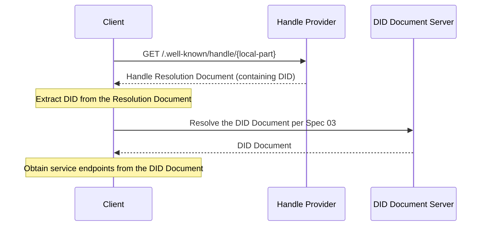
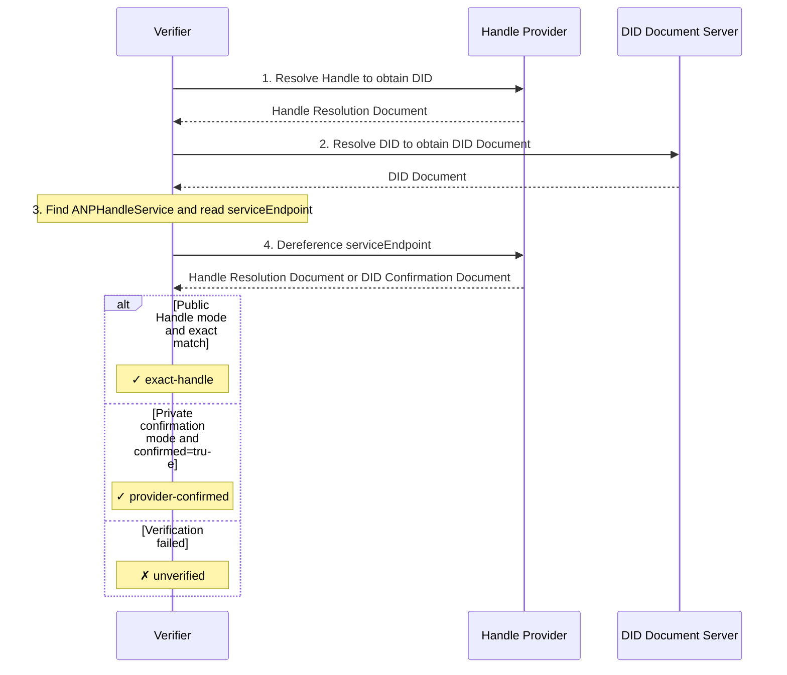

# ANP-DID:WBA Name Space Specification

- Document ID: ANP-04-vNext
- Title: ANP-DID:WBA Name Space Specification
- Status: Draft / not released
- Released Baseline: [ANP-04 v1.1](../04-anp-did-wba-name-space-specification.md)
- Language: English
- Applicability: This specification applies to human-readable Handle naming, WNS resolution, and did:wba name mapping in ANP.

> Draft notice: this is an initial vNext working copy of the released ANP 1.1 specification. It MUST NOT be treated as the published protocol until this draft is released. The Chinese mirror is [ANP-基于DID:WBA的命名空间规范](../chinese/vnext/04-ANP-基于DID-WBA的命名空间规范.md).

Abbreviation: WNS (WBA Name Space)

## Abstract

This specification defines WNS (WBA Name Space), a human-readable namespace based on did:wba. WNS introduces Handles (such as `alice.example.com`) as readable aliases for `did:wba` DIDs. Through a standardized resolution flow, a Handle is mapped to a DID, and the DID is then resolved to a DID Document and service capabilities according to the [did:wba Method Specification](03-did-wba-method-design-specification.md).

Handles solve the problem that DID identifiers are not human-friendly. Identifiers such as `did:wba:example.com:user:alice:e1_<fingerprint>` are machine-friendly but difficult to remember and share. In particular, under the latest did:wba specification, path-type DIDs carry a bound public key fingerprint by default, and the path-type DID itself may rotate when the binding key or binding profile changes. Therefore, WNS not only provides an experience similar to email addresses or social platform usernames, but also serves as a stable human-readable naming layer: the Handle can remain stable while the underlying did:wba may rotate as the binding key changes.

To let cross-domain protocols safely use that stable name as a stable reference, this specification requires every conforming Handle Provider to make and enforce the following protocol commitment: once allocated, a Handle permanently belongs to the same subject, is non-transferable, and cannot be reused after revocation. Handle stability and the Handle-to-DID mapping do not replace the cryptographic DID migration proof defined by Specification 03.

The Handle-related functionality defined by this specification can also be compatible with the native `did:web` method. See Appendix A for the compatibility entry.

## 1. Background and Motivation

### 1.1 Problem Statement

The `did:wba` method provides decentralized identity capabilities for agents (see the [did:wba Method Specification](03-did-wba-method-design-specification.md)), but its identifier format is not human-friendly:

- **Hard to remember**: `did:wba:example.com:user:alice:e1_<fingerprint>` contains the method prefix, domain, path, and binding fingerprint, making the identifier relatively long.
- **Hard to share**: Sharing DID identifiers in social contexts is inconvenient and error-prone.
- **Hard to input**: The user experience of manually entering DID identifiers is poor.
- **Potentially rotating**: For path-type DIDs using the default path profile, the DID itself may change when the binding key or binding profile changes.

These problems are especially prominent in the following scenarios:

- Sharing agent identifiers through social channels
- Entering recipients in instant messaging
- Referencing agent identities in business cards, documents, or verbal communication
- Keeping a stable public-facing reference while allowing the underlying DID to rotate

### 1.2 Design Goals

The design goals of WNS include:

1. **Human-readable**: Provide short, memorable, and easy-to-type aliases such as `alice.example.com`.
2. **Domain-independent**: Any entity with a domain name and TLS certificate can host a Handle service without depending on a specific centralized platform.
3. **Deterministic resolution**: The mapping from Handle to DID is explicit, and the resolution process is standardized.
4. **Stable reference**: A Handle is a permanent, non-transferable, and non-reusable stable naming layer, allowing the underlying path-type did:wba to rotate as the binding key changes.
5. **Bidirectional binding**: Handles and DIDs support bidirectional verification to prevent unilateral tampering.
6. **Protocol integration**: Seamless integration with the existing ANP protocol stack (Specifications 03/07/08/09).
7. **Minimal design**: Define only the core naming and resolution mechanisms without specifying Handle registration, management, or other business processes.

### 1.3 Relationship with Existing Protocols

- **03-did:wba Method Specification**: WNS Handles are readable aliases for did:wba DIDs. Handle resolution ultimately depends on Specification 03 to obtain the DID Document. For path-type DIDs using the default path profile, WNS does not redefine binding fingerprint generation rules and directly reuses Specification 03. The stable subject path, `successorDid`, `alsoKnownAs`, and migration `proof` for an underlying DID rotation are also defined by Specification 03.
- **07-Agent Description Protocol**: After Handle resolution, the DID Document's `service` section leads to the Agent Description document.
- **08-Agent Discovery Protocol**: Handle Providers can serve as supplementary entry points for agent discovery.
- **09-End-to-End Instant Messaging Protocol**: Handles can be used for recipient display and input, while message routing remains DID-based.

## 2. Terminology

| Term | Definition |
|------|------------|
| **Handle** | A human-readable short identifier in the format `local-part.domain`, such as `alice.example.com` |
| **Handle Provider** | The domain party that hosts the Handle resolution service and maintains Handle-to-DID mappings |
| **Local Part** | The user identifier portion of a Handle, such as `alice` in `alice.example.com` |
| **Domain** | The domain portion of a Handle, such as `example.com` in `alice.example.com` |
| **DID Binding** | The one-to-one mapping relationship from a Handle to a DID |
| **Handle Resolution** | The process of resolving a Handle to a DID |
| **DID Rotation** | For path-type did:wba, the process in which the complete DID changes because the binding key or binding profile changes and subject continuity is established according to Specification 03 |
| **Binding Generation** | A monotonically increasing generation of WNS Handle binding state used to detect DID rebinding, status changes, and rollback attacks; it is not a generation field of a did:wba DID |
| **Handle Tombstone** | A permanent reservation retained after Handle revocation to prevent the same Handle from being allocated again |
| **WNS** | WBA Name Space, the namespace system defined by this specification |
| **Handle Resolution Document** | The JSON document returned by the Handle Resolution Endpoint, containing Handle-to-DID mapping information |
| **DID Confirmation Endpoint** | A confirmation endpoint under the Handle Provider's domain, used to confirm that a DID is indeed resolved by that Provider without disclosing a specific Handle in the DID Document |

## 3. Handle Format Specification

### 3.1 Handle Syntax

Handles use DNS-style syntax in the format `local-part.domain`.

**ABNF Definition:**

```abnf
handle     = local-part "." domain
local-part = (ALPHA / DIGIT) *61(ALPHA / DIGIT / "-") (ALPHA / DIGIT)
domain     = ; A valid Fully Qualified Domain Name (FQDN), see RFC 1035
```

**Syntax Rules:**

- The local-part MUST contain only ASCII lowercase letters `a-z`, digits `0-9`, and hyphens `-`.
- The local-part MUST begin and end with a letter or digit.
- The local-part MUST NOT contain consecutive hyphens `--`.
- The local-part MUST be 1 to 63 characters in length.
- The domain MUST be a valid FQDN protected by a TLS/SSL certificate.
- The domain portion of a Handle MUST NOT carry a port number.
- All input MUST be normalized to lowercase before processing.

**Examples:**

```text
alice.example.com          ✓ Valid
bob-smith.example.com      ✓ Valid
agent-42.example.com       ✓ Valid
a.example.com              ✓ Valid (single-character local-part)
-alice.example.com         ✗ Invalid (starts with hyphen)
alice-.example.com         ✗ Invalid (ends with hyphen)
al--ice.example.com        ✗ Invalid (consecutive hyphens)
Alice.Example.com          → Normalized to alice.example.com
```

### 3.2 URI Representation

To explicitly identify a Handle in sharing scenarios, the `wba://` prefix MAY be used:

```text
wba://alice.example.com
```

The `wba://` prefix is used only for sharing and recognition scenarios, and is semantically equivalent to the Handle itself.

- Clients MAY accept input with the `wba://` prefix.
- If a client accepts the prefix, it MUST strip `wba://` before resolution and then follow the standard resolution flow.
- Implementations MUST NOT make support for the `wba://` prefix a prerequisite for interoperability.

> Note: `wba://` has not been registered with IANA as a formal URI scheme. Implementers may also use the following Web URL as an alternative:
> ```text
> https://{domain}/.well-known/handle/{local-part}
> ```

### 3.3 Reserved Word Principles

Handle Providers SHOULD maintain reserved word lists to prevent certain local-parts from being registered. The protocol defines the following reserved word categories; the specific list is determined by each Handle Provider:

**a) Protocol reserved words**: Words that conflict with ANP protocol keywords, such as `did`, `agent`, `well-known`, and `service`.

**b) System reserved words**: Words that conflict with common system functions, such as `admin`, `root`, `system`, and `api`.

**c) Defensive reserved words**: Words that may be used for phishing or confusion attacks, such as `support`, `security`, and `official`.

Handle Providers SHOULD publish their reserved word lists.

## 4. Handle Resolution Protocol

### 4.1 Resolution Flow

Handle resolution follows the flow below:

```text
Handle → Handle Resolution Endpoint → DID → DID Document → service
```



### 4.2 Handle Resolution Endpoint

The Handle Resolution Endpoint is a standardized HTTP endpoint provided by the Handle Provider:

- **URL**: `https://{domain}/.well-known/handle/{local-part}`
- **Method**: `GET`
- **Response Content-Type**: `application/json`

Where `{domain}` is the domain portion of the Handle and `{local-part}` is the user identifier portion.

**Example Request:**

```http
GET /.well-known/handle/alice HTTP/1.1
Host: example.com
Accept: application/json
```

### 4.3 Handle Resolution Document

The JSON document returned by the Handle Resolution Endpoint has the following format:

```json
{
  "handle": "alice.example.com",
  "did": "did:wba:example.com:user:alice:e1_<fingerprint>",
  "status": "active",
  "binding_generation": "8",
  "updated": "2025-01-01T00:00:00Z",
  "versionId": "42",
  "ttl": 300,
  "profile": {
    "type": "DIDSubjectProfile",
    "subject_did": "did:wba:example.com:user:alice:e1_<fingerprint>",
    "subject_type": "person",
    "handle": "alice.example.com",
    "display_name": "Alice",
    "description": "Researcher and AI agent user",
    "avatar_uri": "https://example.com/avatars/alice.png",
    "profile_uri": "https://example.com/alice/",
    "discoverability": "listed",
    "updated": "2025-01-01T00:00:00Z",
    "versionId": "profile-7",
    "ttl": 300
  }
}
```

**Field Descriptions:**

| Field | Required/Optional | Description |
|-------|-------------------|-------------|
| `handle` | Required | The complete Handle identifier |
| `did` | Required | The did:wba DID currently bound to the Handle |
| `status` | Required | The current Handle status; see Section 4.7 |
| `binding_generation` | Required | Decimal string that MUST strictly increase whenever the Handle binding or status changes |
| `updated` | Optional | Last update time in ISO 8601 format |
| `versionId` | Optional | Mapping version identifier used for caching and troubleshooting |
| `ttl` | Optional | Suggested cache lifetime in seconds |
| `profile` | Optional | Public presentational metadata of the DID subject currently bound to this Handle. It is intended for UI display, contact preview, search results, and IM recipient confirmation. It MUST NOT be used for authentication, authorization, routing, service discovery, E2EE binding, or security-profile negotiation. |

### 4.3.1 DID Confirmation Endpoint

When the DID holder does not want to disclose a specific Handle in the DID Document, the Handle Provider MAY provide a DID Confirmation Endpoint.

**Recommended URL:**

```text
https://{domain}/.well-known/handle/by-did?did={urlencoded-did}
```

- **Method**: `GET`
- **Response Content-Type**: `application/json`

**Example Response:**

```json
{
  "did": "did:wba:example.com:user:alice:e1_<fingerprint>",
  "confirmed": true,
  "status": "active",
  "updated": "2025-01-01T00:00:00Z",
  "ttl": 300
}
```

**Field Descriptions:**

| Field | Required/Optional | Description |
|-------|-------------------|-------------|
| `did` | Required | The DID being confirmed |
| `confirmed` | Required | MUST be `true`, indicating that this DID is indeed resolved by the current Handle Provider |
| `status` | Optional | The current resolution status of this DID at the Handle Provider |
| `updated` | Optional | Last update time in ISO 8601 format |
| `ttl` | Optional | Suggested cache lifetime in seconds |

When a DID Confirmation Endpoint is used, the response document SHOULD NOT directly return a specific `handle`, so as to avoid indirectly disclosing the Handle via the DID Document.

### 4.3.2 Profile Object

The Handle Resolution Document MAY include a `profile` object.

The `profile` object represents public presentational metadata of the DID subject currently bound to the resolved Handle. This specification calls that object a **DID Subject Profile**. The JSON field name remains `profile`, and the object `type` SHOULD be `DIDSubjectProfile`.

`profile` is generic DID-subject metadata. It MUST NOT be interpreted as Agent-only metadata. The resolved DID subject MAY be a person, agent, group, organization, service, application, or another DID subject type.

The presence or absence of `profile` MUST NOT change the authoritative Handle-to-DID binding semantics. The authoritative resolution result remains the top-level `handle` and `did` fields. Routing, authentication, authorization, E2EE session binding, and service discovery MUST continue to use the resolved DID, DID Document, `ANPMessageService`, and the corresponding ANP Profiles.

**Recommended Profile Object:**

```json
{
  "type": "DIDSubjectProfile",
  "subject_did": "did:wba:example.com:user:alice:e1_<fingerprint>",
  "subject_type": "person",
  "handle": "alice.example.com",
  "display_name": "Alice",
  "description": "Researcher and AI agent user",
  "avatar_uri": "https://example.com/avatars/alice.png",
  "profile_uri": "https://example.com/alice/",
  "discoverability": "listed",
  "labels": {
    "locale": "en-US"
  },
  "updated": "2025-01-01T00:00:00Z",
  "versionId": "profile-7",
  "ttl": 300,
  "proof": {
    "type": "DataIntegrityProof",
    "cryptosuite": "eddsa-jcs-2022",
    "created": "2025-01-01T00:00:00Z",
    "proofPurpose": "assertionMethod",
    "verificationMethod": "did:wba:example.com:user:alice:e1_<fingerprint>#key-1",
    "proofValue": "z..."
  }
}
```

**Field Descriptions:**

| Field | Required/Optional | Description |
|-------|-------------------|-------------|
| `type` | Recommended | SHOULD be `DIDSubjectProfile` to distinguish this object from other profile-like objects |
| `subject_did` | Required | DID subject described by this profile |
| `subject_type` | Recommended | DID subject type. Recommended values are `person`, `agent`, `group`, `organization`, `service`, `application`, and `unknown` |
| `handle` | Optional | Handle corresponding to this profile. If present, it MUST equal the top-level `handle` field |
| `display_name` | Recommended | Display name for UI use |
| `description` | Optional | Human-readable description, such as a person bio, agent description, or group introduction |
| `avatar_uri` | Optional | Avatar, icon, or group image URI |
| `profile_uri` | Optional | Richer public profile page or profile-document URI |
| `discoverability` | Optional | Discoverability hint. Recommended values are `private`, `listed`, and `public` |
| `labels` | Optional | Non-security extension labels for display, classification, or search assistance |
| `updated` | Optional | Profile update time |
| `versionId` | Optional | Profile version identifier |
| `ttl` | Optional | Suggested profile cache lifetime in seconds |
| `proof` | Optional | Object-level assertion proof over the profile object with `proof` removed |

If `subject_type` is absent or not recognized, clients MUST treat it as `unknown`. Clients and servers MUST NOT use `subject_type` as an authorization input. Private subject-type extensions SHOULD be represented in `labels` instead of extending the recommended enum.

`display_name` is a display field, not an identity name, route name, or authorization name. It MAY be duplicated by different DID subjects and MAY change over time. It MUST NOT participate in message signatures, authorization checks, E2EE session binding, or service endpoint selection. New protocol output SHOULD use `display_name`; servers MAY accept legacy input named `name` for compatibility, but standard output SHOULD NOT use `name`.

**Consistency Rules:**

If `profile` is present, `profile.subject_did` MUST equal the top-level `did` field of the Handle Resolution Document. If `profile.handle` is present, it MUST equal the top-level `handle` field. A client that receives a mismatched `profile.subject_did` or `profile.handle` MUST ignore the `profile` object and MAY mark the resolution result as suspicious.

If `avatar_uri` or `profile_uri` is present, it SHOULD be an absolute HTTPS URI. Clients MUST NOT infer DID bindings, service endpoints, or authorization capabilities from `profile_uri`. Clients should treat remote profile and avatar content as ordinary external content and must not execute it as local instructions.

`labels` are only for non-security presentation, categorization, and search assistance. They MUST NOT be used for authorization, routing, security-level decisions, group membership decisions, or E2EE capability decisions.

**Caching Semantics:**

The top-level `ttl` constrains the Handle Resolution Document cache, especially the `handle` → `did` mapping. `profile.ttl` constrains the profile cache. If `profile.ttl` is absent, clients MAY use the top-level `ttl` as the maximum profile cache lifetime. Clients SHOULD NOT cache `profile` longer than the Handle Resolution Document unless local policy explicitly allows that. If the top-level `did` changes, clients MUST invalidate profile cache entries associated with the old DID.

Top-level `binding_generation` is the security-critical monotonic binding generation. `updated` and `versionId` are supplemental version information for caching, diagnostics, and reconciliation. `profile.updated` and `profile.versionId` describe the profile version. Handle bindings and profile versions MAY change independently. Verifiers MUST NOT use `updated` or `versionId` as a substitute for the rollback-protection semantics of `binding_generation`.

**Proof Semantics:**

In the first deployment phase, `profile.proof` is optional. If no `proof` is present, clients MUST treat the profile as provider-supplied UI metadata. It MAY be used for display, search results, contact cards, and IM recipient confirmation, but MUST NOT be used for authentication, authorization, routing, service endpoint selection, E2EE binding, or security policy decisions.

If `profile.proof` is present, it SHOULD be treated as an object-level assertion. The protected object is the whole `profile` object with `proof` removed. Verification rules are:

1. `profile.subject_did` MUST equal the top-level `did`.
2. The DID that owns `proof.verificationMethod` MUST equal `profile.subject_did`.
3. `proof.verificationMethod` SHOULD be authorized by the `assertionMethod` relationship in the DID Document for `profile.subject_did`.
4. If proof verification succeeds, the client MAY treat the profile as public presentational metadata asserted by the DID subject.
5. Even if proof verification succeeds, `profile` still MUST NOT replace routing, authorization, service discovery, or E2EE binding rules.

**Group Profile Projection:**

Group Base continues to use `group_profile` as the authoritative group-state presentation object. If a Handle points to a Group DID, the WNS `profile` MAY project group presentation fields for quick display:

| Group Base field | WNS `profile` field |
|------------------|---------------------|
| `group_did` | `profile.subject_did` |
| `group_profile.display_name` | `profile.display_name` |
| `group_profile.description` | `profile.description` |
| `group_profile.avatar_uri` | `profile.avatar_uri` |
| `group_profile.discoverability` | `profile.discoverability` |
| `group_profile.labels` | `profile.labels` |

If WNS `profile` and Group Base `group_profile` conflict, group management, group permissions, group messaging semantics, and current group state are determined by the Group Host's `group_profile`, `group_policy`, and `group_state_version`. WNS `profile` is only a fast display projection after Handle resolution.

**Client Behavior:**

Clients MAY display `profile.display_name`, `profile.avatar_uri`, and `profile.subject_type` immediately after Handle resolution. Clients MUST continue to work when `profile` is absent, for example by displaying the Handle or a shortened DID. For anti-confusion UI, clients SHOULD keep the Handle or DID available next to the display name, especially before high-risk operations.

### 4.4 Handle-to-DID Mapping Rules

Handles and DIDs have a one-to-one correspondence maintained by the Handle Provider. The mapping follows these rules:

1. **Hostname consistency**: The domain portion of the Handle MUST match the hostname in the DID. If the DID authority includes a port, the comparison MUST ignore the port and compare only the hostname.
2. **Unique binding**: A Handle MUST be bound to exactly one DID.
3. **Local-part uniqueness**: The local-part MUST be unique within the same domain.
4. **No redefinition of did:wba binding fingerprints**: If a Handle points to a path-type did:wba using the default path profile, the generation, validation, and profile semantics of the final binding fingerprint segment in the DID path are defined entirely by Specification 03. WNS does not redefine or override those rules.
5. **Permanent reservation**: Once a Handle is allocated, the Handle Provider MUST permanently retain its ownership record and MUST NOT transfer or reallocate it to another subject.
6. **Monotonic generation**: On initial allocation, `binding_generation` MUST be a positive decimal string. Whenever the current DID or Handle status changes, it MUST strictly increase and MUST NOT roll back or reuse an earlier generation.

**Mapping Examples:**

```text
Handle:  alice.example.com
DID:     did:wba:example.com:user:alice:e1_<fingerprint>
```

```text
Handle:  alice.example.com
DID:     did:wba:example.com%3A8800:user:alice:e1_<fingerprint>
```

In the second example, the Handle domain is `example.com`. Although the DID contains the encoded port `%3A8800`, its hostname is still `example.com`, so the mapping remains valid. The Handle itself does not carry a port number. The port only affects where the DID Document is resolved, not the textual form of the Handle.

### 4.5 did:wba Standard Resolution

After obtaining the DID, implementations MUST resolve the DID Document according to the [did:wba Method Specification](03-did-wba-method-design-specification.md).

Implementers MUST NOT bypass the DID Document and directly infer service endpoints, binding keys, or other DID-related information from the Handle. The DID Document is the authoritative source of agent capabilities and services.

### 4.6 Handle Uniqueness Constraints

- A Handle MUST be bound to exactly one DID.
- The local-part MUST be unique within the same domain.
- Once allocated, a Handle MUST remain permanently reserved, and a revoked Handle MUST retain a tombstone.
- A Handle MUST NOT be transferred or reallocated through an ordinary registration flow.
- Different domains MAY have the same local-part (decentralized model).

For example, `alice.example.com` and `alice.other.com` are two different Handles that point to different DIDs.

### 4.7 Handle Status

Handles have the following three states:

| Status | Description |
|--------|-------------|
| `active` | Normal state; the Handle can be resolved |
| `suspended` | Temporarily unresolvable but recoverable |
| `revoked` | Permanently revoked and not recoverable; the Provider MUST retain a permanent tombstone and MUST NOT reallocate it |

### 4.8 Error Responses

The Handle Resolution Endpoint SHOULD return the following standard HTTP status codes:

| Status Code | Meaning | Description |
|-------------|---------|-------------|
| `200 OK` | Resolution successful | Returns the Handle Resolution Document |
| `404 Not Found` | Handle does not exist | The local-part was never registered, or the server is unwilling to disclose whether the Handle exists |
| `410 Gone` | Handle permanently revoked | The Handle previously existed but has been revoked |
| `301 Moved Permanently` | Handle migrated | The `Location` header points to the new Resolution Endpoint |
| `308 Permanent Redirect` | Handle migrated | Similar to `301`, but preserves request semantics more explicitly |
| `429 Too Many Requests` | Request rate too high | Returned when rate limits are triggered; it may include `Retry-After` |

When `301` or `308` is returned:

1. `Location` is only a migration hint.
2. The client MUST re-run the bidirectional binding verification defined in Section 6 at the new address.
3. The client MUST NOT accept the new Handle → DID binding solely based on the HTTP redirect.

**Error Response Example:**

```json
{
  "error": "handle_not_found",
  "message": "The handle 'bob.example.com' does not exist"
}
```

## 5. Profile URL

### 5.1 Profile Entry Point

Handle Providers MAY provide a Profile entry point for each Handle. The following URL formats are recommended:

- Subdomain style: `https://{local-part}.{domain}/`
- Path style: `https://{domain}/{local-part}/`

This Profile URL is distinct from the `profile` object defined in Section 4.3.2. If a Handle Resolution Document includes `profile.profile_uri`, it MAY point to such a Profile URL, but that URL remains an external presentation or business entry point.

### 5.2 Profile Format

Profiles are business-level documents. This specification only defines the Profile URL entry point and does not constrain the content format. The specific content and presentation of Profiles are defined by Handle users and Handle Providers.

The Profile URL is a presentation or business entry point, not the authoritative source for Handle → DID binding or service discovery. Implementers MUST NOT infer the DID, service endpoints, or authorization capabilities solely from the Profile URL. Any security-sensitive identity binding, message routing, and service discovery MUST still follow the standard chain of Handle → DID → DID Document.

## 6. Reverse Verification (Bidirectional Binding)

To prevent a malicious Handle Provider from mapping an arbitrary Handle to someone else's DID, WNS defines a bidirectional binding verification mechanism.

### 6.1 Handle Provider Declaration (Forward)

The Handle Provider declares the Handle-to-DID mapping through the Resolution Endpoint. This is part of the standard resolution flow (Section 4).

### 6.2 DID Document Declaration (Reverse)

The DID holder adds an entry of type `ANPHandleService` to the `service` section of the DID Document to declare the Handle binding service endpoint it uses. `ANPHandleService.serviceEndpoint` no longer merely expresses the provider domain. Instead, it is a dereferenceable HTTPS endpoint. This endpoint supports the following two compatible modes:

1. **Public Handle mode**: `serviceEndpoint` directly uses the standard Resolution Endpoint of that Handle.
2. **Private confirmation mode**: `serviceEndpoint` points to the DID Confirmation Endpoint, which confirms that the DID is indeed resolved by the Handle Provider without disclosing a specific Handle in the DID Document.

**Public Handle mode example:**

```json
{
  "id": "did:wba:example.com:user:alice:e1_<fingerprint>#handle",
  "type": "ANPHandleService",
  "serviceEndpoint": "https://example.com/.well-known/handle/alice"
}
```

**Private confirmation mode example:**

```json
{
  "id": "did:wba:example.com:user:alice:e1_<fingerprint>#handle",
  "type": "ANPHandleService",
  "serviceEndpoint": "https://example.com/.well-known/handle/by-did?did=did%3Awba%3Aexample.com%3Auser%3Aalice%3Ae1_%3Cfingerprint%3E"
}
```

**Field Descriptions:**

- `id`: Unique identifier of the service; using the `#handle` suffix is recommended.
- `type`: MUST be `ANPHandleService`.
- `serviceEndpoint`: MUST be a dereferenceable absolute HTTPS URI under the Handle Provider's domain. In Public Handle mode, it SHOULD directly use the standard Handle Resolution Endpoint. In Private confirmation mode, it MAY use the DID Confirmation Endpoint.

`ANPHandleService` is used to express the DID holder's reverse declaration of its Handle binding service.

- In Public Handle mode, the DID holder explicitly declares the Resolution Endpoint of a specific Handle, and the verifier can perform a strong check on whether the input Handle exactly matches the DID.
- In Private confirmation mode, the DID holder declares only the accepted Handle Provider and DID confirmation endpoint. The verifier can confirm the provider relationship, but cannot infer from that alone that a specific Handle has been precisely reverse-confirmed.

Future versions may introduce stronger Name Service provider identity or privacy-preserving mechanisms such as `providerDid` and `handleCommitment`, while preserving compatibility.

### 6.3 Verification Flow

For the following security-sensitive scenarios, verifiers MUST perform bidirectional binding verification:

- Identity authentication
- Authorization decisions
- Instant messaging recipient resolution
- Automated calls that trigger state changes, write operations, charges, or resource creation

For scenarios used only for UI display, search preview, or directory browsing, verifiers MAY delay bidirectional binding verification. However, once a security-sensitive operation is about to occur, the verifier MUST complete the verification.



**Verification Steps:**

1. Resolve the input Handle through the standard Handle Resolution Endpoint, obtain the Handle Resolution Document, and extract its `did`.
2. Resolve that `did` according to Specification 03 and obtain the DID Document.
3. Find entries of type `ANPHandleService` in the DID Document's `service` section.
4. Verify that `serviceEndpoint` is an absolute `https` URI and that its hostname is consistent with the domain of the input Handle.
5. Send a `GET` request to `serviceEndpoint` and parse the returned JSON document.
6. If `serviceEndpoint` is equal to the standard Resolution Endpoint of the input Handle, and the returned document's `did` is identical to the `did` from Step 1, and the returned document's `handle` exactly matches the input Handle, the verifier has completed precise bidirectional binding verification for that specific Handle.
7. If the returned document does not contain `handle`, but contains `confirmed = true`, and the returned document's `did` is identical to the `did` from Step 1, this means that the DID is indeed resolved by the Handle Provider. This result confirms only the provider relationship.
8. All other cases MUST be treated as verification failure or insufficient verification strength.

For security-sensitive scenarios that require confirmation of a specific Handle, the verifier MUST obtain the precise bidirectional binding verification result defined in Step 6. The provider confirmation result in Step 7 is not sufficient on its own for such scenarios.

### 6.3.1 Rules for Using `ANPHandleService` (v2)

When performing bidirectional binding verification, the verifier should use `ANPHandleService.serviceEndpoint` according to the following rules:

1. Extract the domain and local-part from the input Handle, and construct the standard Resolution Endpoint for that Handle: `https://{domain}/.well-known/handle/{local-part}`.
2. Resolve the Handle through that Resolution Endpoint, obtain the Handle Resolution Document, and extract its `did`.
3. Resolve the DID Document for that `did` according to Specification 03.
4. Find the entry where `type = "ANPHandleService"` in the DID Document's `service` section.
5. Verify that the entry's `serviceEndpoint` is an absolute `https` URI and that its hostname MUST match the Handle domain extracted in Step 1.
6. Send a `GET` request to `serviceEndpoint` and obtain the returned JSON document.
7. If `serviceEndpoint` is exactly the same as the standard Resolution Endpoint constructed in Step 1, and the returned document's `did` is identical to the `did` from Step 2, and the returned document's `handle` exactly matches the input Handle, then that Handle and DID are considered to have completed precise bidirectional binding verification.
8. If the returned document does not contain `handle`, but contains `confirmed = true`, and the returned document's `did` is identical to the `did` from Step 2, this means that the DID is indeed resolved by the Handle Provider where `ANPHandleService` resides. This result confirms only the provider relationship and MUST NOT by itself be treated as meaning that a specific Handle and DID have completed precise bidirectional binding verification.
9. If `ANPHandleService` does not exist, `serviceEndpoint` is not `https`, the hostname is inconsistent, dereferencing `serviceEndpoint` fails, the returned document's `did` is inconsistent, or the checks in Step 7 or Step 8 fail, the binding MUST NOT be treated as verified.
10. For security-sensitive scenarios such as identity authentication, authorization decisions, and recipient confirmation before message sending that require confirmation of a specific Handle, the verifier MUST obtain the precise bidirectional binding verification result defined in Step 7. The provider confirmation result in Step 8 is not sufficient for such scenarios.

**Notes:**

- When the DID holder is willing to disclose its Handle, `ANPHandleService.serviceEndpoint` SHOULD directly use the standard Resolution Endpoint of that Handle.
- When the DID holder does not want to disclose its Handle in the DID Document, `ANPHandleService.serviceEndpoint` MAY point to a DID Confirmation Endpoint, which returns `did` and `confirmed = true`.
- Future versions may introduce `providerDid`, `handleCommitment`, or other stronger privacy-preserving binding mechanisms while preserving compatibility.

### 6.3.2 Verification Result Semantics

To avoid conflating verification results of different strengths, implementers SHOULD distinguish at least the following three results:

| Result | Description |
|--------|-------------|
| `exact-handle` | The input Handle and DID have completed precise bidirectional binding verification |
| `provider-confirmed` | The resolution relationship between the DID and the Handle Provider has been confirmed, but no specific Handle has been confirmed |
| `unverified` | Verification failed, or only a result with insufficient trust strength was obtained |

`provider-confirmed` is suitable for DID-first, directory browsing, or privacy-friendly Handle Provider confirmation scenarios. Only `exact-handle` satisfies high-assurance scenarios that require confirmation of a specific Handle.

## 7. Integration with the ANP Protocol Stack

### 7.1 Integration with DID Document (Spec 03)

The DID Document adds the `ANPHandleService` service type to support reverse verification (Section 6).

```json
{
  "service": [
    {
      "id": "did:wba:example.com:user:alice:e1_<fingerprint>#ad",
      "type": "AgentDescription",
      "serviceEndpoint": "https://example.com/agents/alice/ad.json"
    },
    {
      "id": "did:wba:example.com:user:alice:e1_<fingerprint>#handle",
      "type": "ANPHandleService",
      "serviceEndpoint": "https://example.com/.well-known/handle/alice"
    }
  ]
}
```

For did:wba using the default path profile, WNS does not define the binding fingerprint format and does not redefine the `e1_` / `k1_` rules through WNS. Those semantics are entirely handled by Specification 03.

The example above shows Public Handle mode. If the DID holder does not want to disclose a specific Handle in the DID Document, `ANPHandleService.serviceEndpoint` MAY instead use a DID Confirmation Endpoint, for example:

```json
{
  "id": "did:wba:example.com:user:alice:e1_<fingerprint>#handle",
  "type": "ANPHandleService",
  "serviceEndpoint": "https://example.com/.well-known/handle/by-did?did=did%3Awba%3Aexample.com%3Auser%3Aalice%3Ae1_%3Cfingerprint%3E"
}
```

In this mode, the verifier can confirm only the provider relationship and cannot, based on that alone, treat a specific Handle as having completed precise bidirectional binding verification.

### 7.2 Integration with Agent Description Protocol (Spec 07)

An Agent Description document MAY include an optional `handle` field:

```json
{
  "protocolType": "ANP",
  "protocolVersion": "1.0.0",
  "type": "AgentDescription",
  "did": "did:wba:example.com:user:alice:e1_<fingerprint>",
  "handle": "alice.example.com",
  "name": "Alice's Agent",
  "description": "..."
}
```

The `handle` field is optional and helps other agents obtain a human-readable identifier. Its authoritative binding relationship is still determined by the WNS resolution result and the DID Document.

### 7.3 Integration with Agent Discovery Protocol (Spec 08)

In the collection returned by `.well-known/agent-descriptions`, each entry MAY include an optional `handle` field:

```json
{
  "@type": "ad:AgentDescription",
  "name": "Alice's Agent",
  "@id": "https://example.com/agents/alice/ad.json",
  "handle": "alice.example.com"
}
```

In addition, the Handle Provider's `/.well-known/handle/` path may serve as a supplementary entry point for agent discovery.

### 7.4 Integration with Instant Messaging Protocol (Spec 09)

Handles can be used for recipient display and input in instant messaging scenarios:

- Users can specify message recipients by entering a Handle such as `alice.example.com`.
- The client resolves the Handle to a DID and then performs message routing.
- The messaging UI may display the Handle instead of the DID to improve readability.
- If the Handle Resolution Document contains a valid `profile`, the messaging UI may display `profile.display_name`, `profile.avatar_uri`, and `profile.subject_type` for contact preview and recipient confirmation.

Message routing and transport remain DID-based. Handles and WNS `profile` are used only for display and input at the human-computer interaction layer.

## 8. Handle Provider Requirements

### 8.1 Resolution Service Requirements

Handle Providers MUST satisfy the following requirements:

- MUST provide the resolution service over HTTPS.
- MUST implement the `/.well-known/handle/{local-part}` endpoint.
- MAY implement the `/.well-known/handle/by-did` DID Confirmation Endpoint.
- SHOULD support HTTP caching headers (at least `Cache-Control` and `ETag`; `Last-Modified` is optional).
- SHOULD implement rate limiting to prevent abuse.
- When returning `429 Too Many Requests`, SHOULD include `Retry-After`.
- When a Handle is in a migration window or an underlying DID rotation window, SHOULD reduce the cache TTL.

### 8.2 Handle Management

- Handle Providers are responsible for Handle allocation and lifecycle management.
- Handle registration flows, identity verification methods, length policies, and similar operational rules are defined by each Handle Provider.
- Handle Providers MUST ensure Handle uniqueness within the same domain.
- Handle Providers MUST treat an allocated Handle as a permanent, non-transferable subject identifier and MUST NOT transfer it to another subject.
- After Handle revocation, the Provider MUST retain a permanent tombstone. No ordinary registration, recovery, or administrative flow may reallocate the same Handle to any subject.
- Handle Providers MUST persist and monotonically increase `binding_generation` so that verifiers can reject replayed historical bindings.

### 8.3 Handle Provider Migration

Users may need to migrate a Handle from one Handle Provider to another. During migration:

- In this version, Provider migration means moving operations or infrastructure while the complete Handle and its domain remain unchanged. Moving to a different domain creates a different Handle and has no automatic identity continuity under this specification.
- Provider migration **MUST** preserve the same complete Handle and the same Handle subject, and **MUST NOT** be used to transfer the Handle or replace its subject.
- The new Provider **MUST** inherit the highest accepted `binding_generation`, binding history, and permanent tombstone obligation. The next state after migration **MUST** use a strictly greater generation and **MUST NOT** reset or roll back because of migration.
- The old Handle Provider MAY return `301 Moved Permanently` or `308 Permanent Redirect`, but the Resolution Endpoint identified by `Location` **MUST** still satisfy verification rules for the input Handle domain.
- During the migration period, the old and new Handle Providers SHOULD both maintain resolution capability.
- The DID holder needs to update `ANPHandleService` in the DID Document so that it continues to point to a verifiable public Handle Resolution Endpoint or DID Confirmation Endpoint under the same Handle domain.
- After resolving the result at the new address, the client MUST re-run bidirectional binding verification and MUST NOT accept the new binding solely based on the redirect.
- If stronger provider identity needs to be expressed in the future without breaking the current interoperability model, a `providerDid` mechanism may be introduced in a later version.

### 8.4 Underlying DID Rotation

For path-type did:wba using the default path profile, the underlying DID rotates when the binding key changes or when the binding profile switches between `e1_` and `k1_`. In this scenario, WNS has the following requirements:

- The Handle MAY remain unchanged to provide a stable human-readable name.
- Once the new DID Document is available and the Provider's independent recovery or identity-verification policy has succeeded, the Handle Provider MUST update the Handle mapping to the new DID and strictly increase `binding_generation`.
- `binding_generation` represents only the state of the Handle mapping; it MUST NOT be interpreted as a DID generation or as cryptographic proof of DID migration.
- DID rebinding MUST represent a credential update for the same Handle subject and MUST NOT be used to transfer the Handle or replace its subject.
- If a Handle Provider or client needs to treat the old and new DIDs as the same continuing subject, it MUST follow Specification 03 from the old DID, verify the stable subject path and every direct `successorDid`, and reach a proof-valid active DID. A valid old-binding or pre-authorized recovery proof provides cryptographic continuity. Without either proof, an authenticated same-origin HTTPS complete-chain resolution may report `provider_asserted`; the Handle mapping, matching prefix, or binding generation by itself still yields only `unverified`.
- During the rotation window, the Handle Provider SHOULD reduce the cache TTL to reduce the time during which clients may use an outdated mapping.
- Clients MUST NOT assume that a Handle is always bound to the same DID; the current resolution result is the authoritative current DID for that Handle.
- For security-sensitive operations, after obtaining a new DID through a Handle, the client MUST re-run bidirectional binding verification.
- If the upper-layer operation requires confirmation of a specific Handle, the client MUST require an `exact-handle` result and MUST NOT accept only `provider-confirmed`.
- Rules for deactivating the old DID, its `successorDid` chain, and the new DID's `alsoKnownAs` are defined by Specification 03. WNS is responsible only for the mapping between the stable name and the current DID.

## 9. Security Considerations

### 9.1 Domain Security

The security model of WNS is consistent with the did:wba method and relies on the TLS/SSL certificate system. The domain portion of a Handle MUST be protected by a valid TLS certificate. The security of a Handle Provider is equivalent to the security of its domain and TLS configuration.

### 9.2 Phishing and Confusion Attacks

WNS reduces phishing and confusion risks through the following mechanisms:

- The local-part is restricted to ASCII lowercase letters, digits, and hyphens, avoiding Unicode homograph attacks.
- Handle Providers SHOULD maintain reserved word lists (see Section 3.3).
- Clients SHOULD visually emphasize the domain portion when displaying Handles to help users identify the source.

### 9.3 Handle Squatting

Handle Providers SHOULD take measures to prevent malicious squatting, including but not limited to:

- Maintaining reserved word lists
- Implementing registration review mechanisms
- Providing dispute resolution processes

Specific policies are defined by each Handle Provider.

### 9.4 Privacy Considerations

- The Handle Resolution Endpoint exposes the existence of a Handle (for example, through differences among `200`, `404`, and `410`). Handle Providers SHOULD implement rate limiting to mitigate enumeration attacks.
- Handle Providers SHOULD NOT return sensitive information beyond the mapping relationship in the Resolution Endpoint.
- If a Handle Provider returns `profile`, it SHOULD avoid sensitive personal, group, or organizational information unless that information is intentionally public.
- Handle Providers SHOULD try to normalize error response structures to avoid leaking unnecessary state through excessive differences.
- If the DID holder does not want to disclose a specific Handle in the DID Document, it MAY use the DID Confirmation Endpoint mode and return only provider-level confirmation information.
- For display-only scenarios, clients MAY delay bidirectional binding verification to reduce unnecessary cross-site resolution requests.

### 9.5 Anti-Tampering

The core anti-tampering mechanism of WNS is bidirectional binding verification (Section 6):

1. The Handle Provider declares Handle → DID through the standard Resolution Endpoint in the forward direction.
2. The DID holder declares, through `ANPHandleService` in the DID Document, a dereferenceable HTTPS endpoint under the same Handle Provider domain in the reverse direction.
3. The verifier dereferences that endpoint and distinguishes between `exact-handle` and `provider-confirmed` based on the returned result.
4. For high-assurance scenarios that require confirmation of a specific Handle, the verifier MUST require `exact-handle` and MUST NOT substitute `provider-confirmed`.
5. Future versions may introduce mechanisms such as `providerDid` and `handleCommitment` to provide stronger Name Service provider identity verification and privacy protection.

For path-type did:wba using the default path profile, the DID itself may also carry a binding fingerprint segment defined by Specification 03 (such as `e1_...` or `k1_...`). This belongs to the did:wba method layer and is not redefined by WNS.

WNS no longer defines a separate "public key fingerprint extension whose algorithm and encoding are chosen by the Handle Provider" in order to avoid redundant definitions or semantic conflicts with the default path profile of did:wba.

## 10. Use Cases

### 10.1 Social Sharing

User Alice can share `wba://alice.example.com` on social media. When other users see it, they can:

1. Recognize the `wba://` prefix and remove it to get the Handle `alice.example.com`.
2. Resolve the Handle to obtain the DID.
3. Obtain Alice's agent description and service endpoints through the DID Document.
4. Establish interaction with Alice's agent.

### 10.2 Inter-Agent Communication

Agent A needs to communicate with Agent B whose Handle is `bob.example.com`:

1. Resolve the Handle `bob.example.com` to obtain the DID.
2. Resolve the DID Document according to Specification 03.
3. Obtain the AgentDescription endpoint from the DID Document's `service` section.
4. Fetch the Agent Description document to understand Agent B's capabilities and interfaces.
5. Initiate communication according to the interface definition.

### 10.3 Instant Messaging

A user enters the recipient Handle `carol.example.com` in an instant messaging application:

1. The client resolves the Handle to obtain the DID.
2. If the resolution document contains a valid `profile`, the client may display `profile.display_name` and `profile.avatar_uri` for recipient confirmation.
3. The client obtains the messaging service endpoint through the DID Document.
4. The client sends a message using the instant messaging protocol defined in Specification 09.
5. The messaging interface displays the recipient's display name and Handle rather than only the DID.

### 10.4 Stable Handle and DID Rotation

Alice uses the Handle `alice.example.com` publicly over the long term. After some time, due to binding key rotation, the underlying path-type did:wba rotates from:

```text
did:wba:example.com:user:alice:e1_<old-fingerprint>
```

to:

```text
did:wba:example.com:user:alice:e1_<new-fingerprint>
```

During this process:

1. Alice's Handle `alice.example.com` remains unchanged.
2. The old DID Document sets `deactivated = true` and `successorDid = <new DID>` and generates a document-wide `proof` according to Specification 03.
3. The new DID Document may reference the old DID through `alsoKnownAs` and continues to declare `ANPHandleService`.
4. The Handle Provider updates the mapping of the Handle to the new DID and strictly increases `binding_generation` from its previous value.
5. After validating the DID migration relationship according to Specification 03 and re-running WNS bidirectional binding verification, resolvers continue to find Alice's current DID through the same Handle.
6. If Alice revokes the Handle itself, the Provider permanently retains its tombstone rather than assigning the same Handle to a new subject.

## 11. Normative Requirements Summary

The following summarizes all MUST / SHOULD / MAY requirements in this specification (terminology defined per [RFC 2119](https://www.rfc-editor.org/rfc/rfc2119)):

### MUST

1. The local-part of a Handle MUST begin and end with a letter or digit.
2. The local-part of a Handle MUST NOT contain consecutive hyphens.
3. The domain of a Handle MUST be a valid FQDN protected by a TLS/SSL certificate.
4. All Handle input MUST be normalized to lowercase.
5. If a client accepts input with the `wba://` prefix, it MUST strip the prefix before resolution.
6. The domain portion of a Handle MUST match the hostname in the DID; if the DID includes a port, the comparison MUST ignore the port.
7. A Handle MUST be bound to exactly one DID.
8. The local-part MUST be unique within the same domain.
9. After obtaining the DID, the DID Document MUST be resolved according to Specification 03.
10. Implementations MUST NOT bypass the DID Document and infer service endpoints, binding keys, or other DID information directly from a Handle.
11. Handle Providers MUST provide the resolution service over HTTPS.
12. Handle Providers MUST implement the `/.well-known/handle/{local-part}` endpoint.
13. In identity authentication, authorization decisions, instant messaging recipient resolution, and other security-sensitive scenarios, verifiers MUST perform bidirectional binding verification.
14. `ANPHandleService.serviceEndpoint` MUST be an absolute HTTPS URI under the Handle Provider's domain. During verification, its hostname MUST match the domain of the input Handle.
15. When performing bidirectional binding verification, the verifier MUST dereference `ANPHandleService.serviceEndpoint`.
16. To treat a specific Handle as a verified binding, the verifier MUST obtain an `exact-handle` result.
17. A `provider-confirmed` result MUST NOT by itself be treated as meaning that a specific Handle and DID have completed precise bidirectional binding verification.
18. After a client follows a `301` / `308` redirect to a new Resolution Endpoint, it MUST re-run bidirectional binding verification and MUST NOT accept the new binding solely based on the redirect.
19. For security-sensitive operations after underlying DID rotation, the client MUST re-run bidirectional binding verification.
20. A Profile URL MUST NOT be treated as the authoritative source for Handle → DID binding or service discovery.
21. If `profile` is present, `profile.subject_did` MUST equal the top-level `did` field.
22. If `profile.handle` is present, it MUST equal the top-level `handle` field.
23. Clients MUST NOT use `profile` fields for routing, authentication, authorization, E2EE binding, service endpoint selection, or security-profile negotiation.
24. If `subject_type` is absent or unknown, clients MUST treat it as `unknown`.
25. If `profile.proof` is absent, clients MUST treat the profile as provider-supplied UI metadata.
26. When the top-level `did` changes, clients MUST invalidate profile cache entries associated with the old DID.
27. A Handle Resolution Document MUST contain decimal-string `binding_generation`.
28. Whenever the current DID or status of a Handle changes, `binding_generation` MUST strictly increase and MUST NOT roll back or reuse an earlier value.
29. Once allocated, a Handle MUST remain permanently reserved to the same subject and MUST NOT be transferred or reallocated.
30. After revocation, a Handle MUST retain a permanent tombstone and MUST NOT be reactivated through ordinary registration or recovery.
31. Handle-to-DID rebinding MUST represent a credential update for the same subject and MUST NOT be used for identity transfer.
32. Handle Provider migration MUST preserve the same Handle subject and MUST NOT be used for identity transfer.
33. A new Provider MUST inherit the maximum binding generation, binding history, and tombstone obligation, and MUST NOT reset or roll back `binding_generation`.
34. Provider migration MUST preserve the complete Handle and its domain; moving to a different domain has no automatic identity continuity.
35. `binding_generation` MUST NOT be interpreted as a DID generation or as cryptographic proof of DID migration.
36. Before treating the DIDs from before and after a rotation as the same cryptographically verified continuing subject, the verifier MUST validate the stable subject path, `successorDid`, and the document-wide `proof` according to Specification 03.
37. Two DIDs MUST NOT be treated as belonging to the same continuing subject solely because they have the same Handle or DID prefix.

### SHOULD

1. Handle Providers SHOULD maintain and publish reserved word lists.
2. The Handle Resolution Endpoint SHOULD support HTTP caching headers.
3. The Handle Resolution Endpoint SHOULD implement rate limiting.
4. During Handle migration, the old Provider SHOULD return a `301` or `308` redirect hint.
5. Clients SHOULD visually emphasize the domain portion when displaying a Handle.
6. Handle Providers SHOULD NOT return sensitive information in the Resolution Endpoint.
7. During Handle migration or an underlying DID rotation window, Handle Providers SHOULD reduce the cache TTL.
8. When returning `429 Too Many Requests`, Handle Providers SHOULD include `Retry-After`.
9. Handle Providers SHOULD try to normalize error response structures to reduce unnecessary state leakage.
10. When the DID holder is willing to disclose a specific Handle, it SHOULD directly use the standard Resolution Endpoint of that Handle as `ANPHandleService.serviceEndpoint`.
11. When a DID Confirmation Endpoint is used, the response document SHOULD NOT directly return a specific `handle`.
12. Implementers SHOULD distinguish among `exact-handle`, `provider-confirmed`, and `unverified`.
13. After Handle Provider migration, the DID holder SHOULD update `ANPHandleService` in the DID Document.
14. When the underlying path-type DID rotates, the Handle Provider SHOULD shorten the old mapping's cache lifetime and publish the new mapping after strong recovery verification succeeds.
15. `profile.type` SHOULD be `DIDSubjectProfile`.
16. New protocol output SHOULD use `profile.display_name` rather than legacy `name`.
17. `avatar_uri` and `profile_uri`, when present, SHOULD be absolute HTTPS URIs.
18. Clients SHOULD keep the Handle or DID available next to `profile.display_name` in anti-confusion UI.
19. Handle Providers returning `profile` SHOULD avoid sensitive information unless it is intentionally public.

### MAY

1. Clients MAY accept input with the `wba://` prefix.
2. Handle Providers MAY provide Profile entry points for Handles.
3. Agent Description documents MAY include a `handle` field.
4. Entries in the agent discovery collection MAY include a `handle` field.
5. For scenarios used only for UI display, search preview, or directory browsing, verifiers MAY delay bidirectional binding verification.
6. Handle Providers MAY implement the `/.well-known/handle/by-did` DID Confirmation Endpoint.
7. When the DID holder does not want to disclose a specific Handle, it MAY use the DID Confirmation Endpoint as `ANPHandleService.serviceEndpoint`.
8. A Handle MAY remain unchanged when the underlying path-type DID rotates to provide a stable human-readable name.
9. Handle Resolution Documents MAY include a `profile` object.
10. Clients MAY display `profile.display_name`, `profile.avatar_uri`, and `profile.subject_type` immediately after Handle resolution.
11. Servers MAY accept legacy input named `name` for compatibility, but standard output should use `display_name`.
12. `profile.proof` MAY be included as an object-level assertion proof.

## Appendix A: Native `did:web` Compatibility

Reference document: [Appendix B: Compatibility with native `did:web`](../appendix-b-compatibility-with-native-did-web.md)

## References

- [W3C DID Core Specification](https://www.w3.org/TR/did-core/)
- [RFC 2119 - Key words for use in RFCs to Indicate Requirement Levels](https://www.rfc-editor.org/rfc/rfc2119)
- [RFC 1035 - Domain Names - Implementation and Specification](https://www.rfc-editor.org/rfc/rfc1035)
- [RFC 6585 - Additional HTTP Status Codes](https://www.rfc-editor.org/rfc/rfc6585)
- [RFC 8615 - Well-Known URIs](https://www.rfc-editor.org/rfc/rfc8615)
- [RFC 9110 - HTTP Semantics](https://www.rfc-editor.org/rfc/rfc9110)
- [ANP Technical White Paper](../01-agentnetworkprotocol-technical-white-paper.md)
- [DID:WBA Method Design Specification](03-did-wba-method-design-specification.md)
- [Agent Description Protocol Specification](../07-anp-agent-description-protocol-specification.md)
- [Agent Discovery Protocol Specification](../08-ANP-Agent-Discovery-Protocol-Specification.md)
- [End-to-End Instant Messaging Protocol Specification](../09-ANP-end-to-end-instant-messaging-protocol-specification.md)

## Copyright Notice

Copyright (c) 2024 ANP Community
This file is released under the [MIT License](../LICENSE). You are free to use and modify it, but you must retain this copyright notice.
