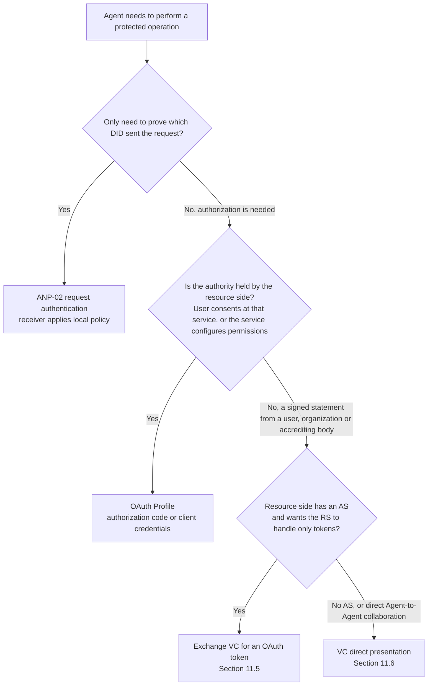
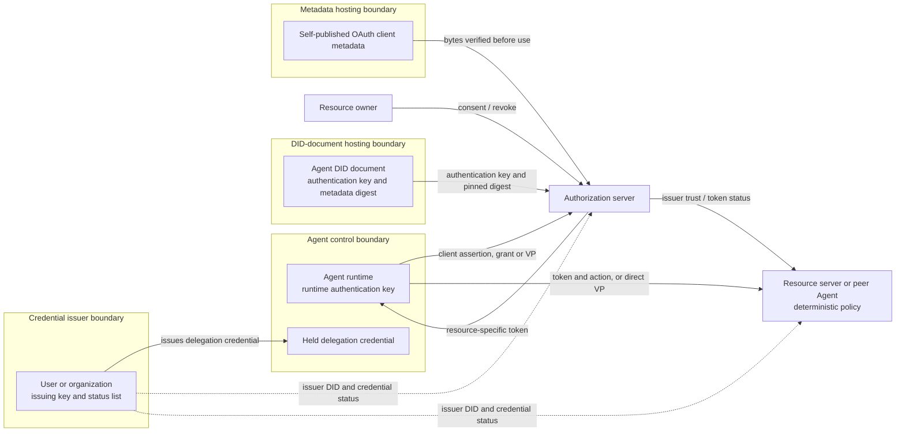
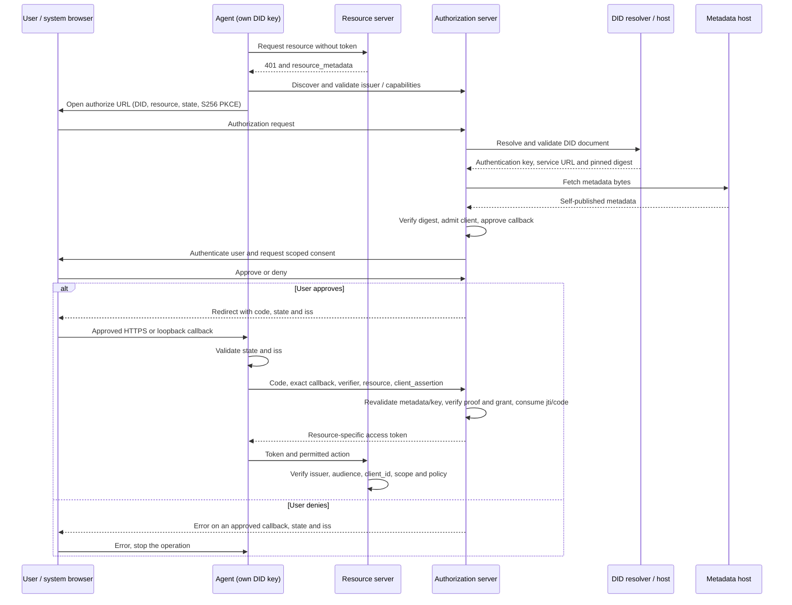
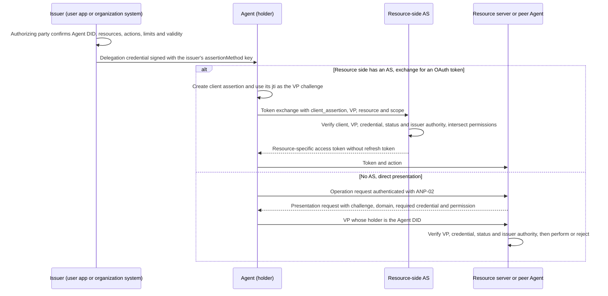

# ANP DID-Based Authorization Protocol

- Document ID: ANP-11
- Status: Draft / not released
- Version: 0.5
- Specification set: ANP vNext; not part of the ANP 1.2 release
- Draft Profile identifiers: OAuth Profile `anp.authorization.oauth2.did.v1-draft4`; VC Profile `anp.authorization.vc.v1-draft1`
- Language: English
- Chinese mirror: [ANP 基于 DID 的授权协议](chinese/11-ANP-基于DID的授权协议.md)

<a id="scope"></a>
## 1. Scope, authorization problem, and roadmap

ANP-11 defines the DID-based agent authorization workstream with two complementary mechanisms: the **OAuth Profile**, in which an authorization server trusted by the resource side issues access tokens, and the **VC Profile**, in which a user or organization that holds the authority issues a W3C Verifiable Credential (VC) that the Agent holds and presents. Both identify the authorizing party and the authorized Agent by DID. **The first release (v1) is a DID–OAuth client identity and basic delegated-access Profile, plus single-level VC delegation credentials, not a complete agent delegation system.** The current document is its unreleased v0.5 draft. In this document, “v1” names that first-release scope; it does not mean that v1 has shipped or that all later roadmap capabilities are implemented.

In the OAuth Profile, an Agent uses its own DID-backed key to authenticate as an OAuth client; the resource owner authorizes access, the authorization server (AS) issues a restricted token, and the resource server (RS) enforces it. That path does not require VC, VP, an OIDC login bridge, or a blockchain. In the VC Profile, a user or organization with authority over a resource issues a delegation credential under its own DID, and the Agent signs a Verifiable Presentation (VP) under its DID; the verifier decides under its own policy whether to accept it, and either performs the operation directly or has the resource's AS exchange it for an ordinary OAuth token.

The OAuth Profile's normative baseline is **OAuth 2.0 plus published extensions**, including RFC 6749 and RFC 9700. OAuth 2.1 draft-16 and JWT client-authentication update draft-11 are informative design references, not published RFC dependencies. The VC Profile's normative baseline is the W3C VC Data Model 2.0, VC Data Integrity 1.0 with its EdDSA cryptosuites, and Bitstring Status List 1.0; exchanging a credential for a token uses RFC 8693. Capitalized MUST, MUST NOT, SHOULD, SHOULD NOT, and MAY use BCP 14 meanings. The restrictions below are this Profile's rules, not amendments to the referenced specifications.

Document structure: Section 1 states the authorization problem and roadmap; Section 2 covers the relationship to ANP-02 and when to use OAuth or VC; Sections 3–10 define the OAuth Profile; Section 11 defines the VC Profile; Sections 12–14 are the shared error-handling, security and conformance requirements.

<a id="authorization-problem"></a>
### 1.1 The actual agent authorization problem (informative)

The central question is not only “which Agent holds this key?” but **“who authorized which Agent to perform which action, on which resource, under which limits, and how can that authority end?”** Five requirements drive the work:

| Requirement | Problem that must be solved | v1 boundary |
| --- | --- | --- |
| Human-to-Agent delegation | Record the authorizing user, intended Agent, resource, permitted actions, duration, and withdrawal; a natural-language task is not itself a resource grant. | OAuth: authorization code with user consent or valid existing authorization; distinct user and client subjects, scopes, expiry and revocation. VC: a user or organization issues a single-level delegation credential (Section 11) as a portable, offline-verifiable mandate; the verifier still decides authority independently. |
| Organization authorizing an Agent to act for it | A company appoints an Agent as its HR Agent or purchasing Agent to deal on the company's behalf with recruiting platforms, suppliers or peer Agents not known in advance; the counterparty must confirm that this Agent really represents the company, what it may do, and its limits. | VC: the organization issues a role credential (Section 11.2) listing functions and constraints by business action rather than by resource address; the counterparty confirms the issuer is that organization, maps the actions to its own operations, and decides whether to accept. No cross-counterparty cumulative budget and no authority over third parties' personal data. |
| One Agent serving a user across multiple services | Each service controls its own resources, account identity and policy; permissions and consent at one service are not accepted everywhere. | OAuth: repeat the flow with the same Agent DID for each resource and accepted AS; keep independent grants and target-limited tokens. VC: one credential may list resources at several services; each verifier uses only its own entries and independently confirms the issuer's authority over them. No single global consent or cross-AS account equivalence. |
| Multi-level redelegation | A delegates to B and B to C without expanding authority or losing user/actor attribution; revocation and shared limits must propagate. | Not defined. The VC Profile accepts only credentials issued to the Agent directly by a principal with authority over the resource and rejects delegation credentials issued by an Agent. No token, credential or private-key forwarding as implicit delegation. |
| Per-operation approval for high-risk actions | Bind a person's approval to the exact payee, amount/currency, data disclosure or deletion target, expiry and one-time operation identifier. | No generic transaction-approval credential. A delegation credential expresses a scope granted in advance and is not a per-operation approval either. A service requiring separate approval must verify its own explicit operation approval or block the action. Login, a broad scope, a DID signature, or DPoP alone is not that approval. |

A basic consent record and a VC delegation credential both already delegate limited access to an Agent. It is therefore inaccurate to say v1 does no human delegation at all. The VC delegation credential provides a portable mandate but covers single-level delegation only; v1 does **not** yet define delegation chains or standardized transaction approval. The user's instruction can guide execution but cannot create rights the user or Agent does not have.

<a id="technical-choices"></a>
### 1.2 Technical choices and implementation cost (informative)

**Reuse OAuth for the authorization lifecycle.** RFC 6749 already separates resource owner, client, AS and RS and supplies consent/grant, access-token and refresh flows. RFC 7523 Section 2.2 supplies the client assertion transport; RFC 7636, RFC 8707, RFC 7009 and RFC 7662 supply code protection, target restriction, revocation and status checks. This lets ANP focus on reusable Agent identity and the missing agent-specific delegation semantics, rather than invent another grant/token ecosystem. OAuth is not the whole solution: it does not by itself define a task-wide budget, permission attenuation, or a user's approval of a specific business action.

**Use DID as the principal, not as permission.** The same method-validated DID and authentication-key relationships can be reused for ordinary ANP authentication, communication and OAuth access. Native did:web retains DNS/HTTPS/hosting trust; it does not gain a fingerprint-bound identity or protection from its own DID-document host merely by using this Profile. Path-based did:wba e1_ adds binding-key fingerprints and a verified document proof. Those properties are conditional on correct method validation and key custody; neither method proves software integrity or human consent. This is a common identity/lifecycle model, not a claim that only DID can offer portable identifiers.

**Require an explicit AS adapter.** A stock OAuth AS is not expected to accept this flow unchanged. The adapter must accept DID client identifiers, resolve their method/key policy, discover and verify self-published client metadata, perform admission, and advertise the ANP capability. Existing OAuth grant/token engines and RS validation can be reused where their capabilities suffice. No whole-server rewrite is required by the architecture, but zero-modification compatibility is not claimed. A client needs DID key access, metadata publication, discovery and standard OAuth flow support. The private key stays with the Agent or its explicitly authorized signer.

**Use VC to carry authority that originates outside the resource side.** The basis for much agent authorization is not held by the resource side: a company appoints an Agent as its purchasing representative, a user gives an Agent a mandate it can show to several merchants, or an institution attests which organization an Agent belongs to or what qualification it has. An OAuth consent record lives inside each AS; it cannot be carried to another service or verified by a peer that has no AS. W3C VC 2.0 lets the authorizing party sign a statement under its own DID; the Agent holds it and presents it to any verifier that trusts that issuer. Verification only requires resolving the issuer and holder DIDs and checking a status list, with no prior integration between verifier and issuer. ANP already uses Data Integrity eddsa-jcs-2022 for did:wba document proofs and the messaging binding; the VC Profile reuses that proof mechanism rather than adding another signature stack. VC has costs too: revocation depends on a status list and has cache latency; each verifier must maintain its own policy on which issuers it trusts for which claims; and once presented, a credential's contents are visible to the verifier.

**VC and OAuth have separate roles and do not replace each other.** A VC is the issuer's statement; it grants no access by itself and is not an access token. An OAuth token is an access permission issued by the resource side and cannot be carried to other services. They compose: a VC supplies the authority, and the resource's AS verifies it and issues a token. Section 2.2 explains when to choose which. Standards proposed for later phases are evaluation targets, not current conformance requirements.

<a id="v1-scope"></a>
### 1.3 What v1 delivers

V1's deliverable is **DID client identity plus usable, auditable basic user delegation**: DID-as-client-ID; integrity-bound self-published metadata; policy-controlled first-contact admission without per-AS preregistration; RFC 7523 client authentication; client credentials for qualified confidential deployments; authorization code with S256 PKCE for hosted HTTPS and local loopback clients; target-specific tokens, optional refresh, and lifecycle enforcement. A deployment claiming user-delegated support MUST implement the authorization-code path; a client-credentials-only implementation MUST NOT claim that capability.

For user-delegated grants, the AS MUST retain the authenticated resource-owner identifier in its issuer/tenant context, Agent DID, target resource, granted scopes, approval source and time, applicable lifetime/revocation policy, and a stable internal grant reference. An existing consent or administrator grant may supply approval only under documented policy. This is an OAuth authorization-record requirement; the portable, cross-system mandate is defined by the VC Profile. New permissions require another approval decision. User credentials and an Agent's authentication key remain separate.

The VC Profile is an optional capability. It delivers two ANP credential types, the delegation credential and the organization role credential, presentation rules bound to the holder DID, credential verification and status-checking rules, a binding that exchanges a credential for an OAuth token through RFC 8693, and direct-presentation rules for verifiers without an AS. An implementation claiming the VC Profile MUST satisfy Section 11; an implementation without VC support can still fully conform to the OAuth Profile. A valid delegation credential does not replace the authorization decision of the AS or verifier.

**Security baseline:** Profile flows MUST NOT use implicit or resource-owner password credentials grants, access tokens in URI query strings, or PKCE plain. Authorization code requires S256 PKCE, approved redirect matching with the narrowly defined loopback-port exception, and issuer/session validation. Future roadmap capabilities MUST NOT be advertised as v1 support.

<a id="roadmap"></a>
### 1.4 Staged solution and acceptance roadmap (informative)

These are ordered capability stages, not promised delivery dates. Later stages can ship as independent extensions without changing the v1 identity/grant boundary.

| Stage | Solution direction | Evidence before claiming the capability |
| --- | --- | --- |
| v1: identity and basic delegation | Implement the scope in Section 1.3. The same DID obtains separate authorizations at multiple services; retain user/Agent attribution and explicit revocation. When authority originates outside the resource side, use a single-level VC delegation credential by direct presentation or token exchange. | Native first contact; hosted and loopback user flows; two-resource isolation; metadata tampering; key rotation; revocation; positive and negative VC exchange and direct-presentation cases; interoperable client/AS evidence under Section 14. |
| Next: precise authority and high-risk approval | Evaluate RFC 9396 RAR for structured resource/action/constraint requests; define a separately verified one-operation approval, possibly a dedicated VC type or another credential, bound to Agent, resource, exact normalized action digest, critical parameters, expiry and a unique identifier. Check and consume it atomically at execution. | Parameter substitution, replay, double execution, expiry and approval withdrawal fail safely. Fresh login, a signed transport request, or a broad delegation credential cannot substitute for transaction approval. |
| Then: controlled redelegation | Evaluate VC delegation chains (a child credential referencing its parent and narrowing authority) and RFC 8693 Token Exchange actor attribution; define authorized delegation depth, child permissions no greater than the parent's effective authority, audience/expiry narrowing, grant-family revocation and audit. Cross-AS exchanges need explicit trust and account/authority mappings. V1 uses RFC 8693 only to exchange a single-level delegation credential for a token, not for redelegation. | A-to-B-to-C delegation; attempted expansion or wrong actor rejected; root withdrawal blocks new child grants; existing-token invalidation latency documented. Do not treat actor-history claims alone as authorization. |
| Alongside those stages: long-running and noninteractive execution, privacy | Evaluate RFC 8628 for remote/headless approval, additional backchannel flows, verified DID migration, and shared budget/counter enforcement. Evaluate VC selective-disclosure cryptosuites and OpenID4VP/OpenID4VCI bindings for human wallets. Evaluate interoperable action vocabularies for common business functions such as purchasing and HR, defined and governed by the corresponding domain protocols. V1 loopback covers a browser on the Agent's own device, not every headless environment. | User-to-device/transaction binding, phishing and polling controls, no client-only fallback after user-grant expiry; shared limits remain correct under concurrent child actions; selective disclosure does not leak unpresented permission entries. |

The planned common model is an identified delegator, intended Agent, resource/action, constraints, parent grant where relevant, approval evidence, and revocation state. Subsequent extensions will define precise wire schemas and enforcement rules. A signed claim stating a budget does not itself implement a global counter; a token exchange does not itself propagate revocation or prove permission attenuation.

Publication of this draft does not establish SDK, AS or product support. The OAuth Profile v1-draft4 and VC Profile v1-draft1 identifiers are both experimental. Revision 0.5 adds the VC Profile without changing the OAuth Profile v1-draft4 wire rules; revision 0.4 changed metadata integrity, local redirects and assertion-compatibility rules. Implementations MUST match the exact revision and revalidate affected metadata and pending transactions before migration; changing a Profile string MUST NOT reinterpret old grants or codes.

<a id="anp-boundary"></a>
## 2. Relationship to ANP and mechanism selection

Use the current [ANP-02 identity-material rules](../02-anp-did-authentication-protocol-specification.md#identity-input), [ANP-03 WBA binding](../03-did-wba-method-design-specification.md#wba-auth-binding), and [ANP-02 native Web binding](../02-anp-did-authentication-protocol-specification.md#web-binding). The historical ANP-02 snapshot beside this file is not this draft's normative baseline.

ANP-02 defines HTTP/JSON request authentication. ANP-11 reuses the DID validation and authentication-key authorization model, **not** its HTTP signature serialization, challenges, or optional token response headers. The OAuth token endpoint uses `client_assertion` and the standard OAuth JSON token response. It MUST NOT require a second ANP-02 HTTP signature to satisfy this Profile. A deployment needing HTTP Message Signatures as a distinct OAuth authentication method needs another explicit binding.

An ANP-02 authentication-cache token is not automatically an ANP-11 OAuth authorization token. Implementations MUST separate their acceptance rules. Messaging, WNS, Device Manifests, E2EE, and human-presence UI are not dependencies of this Profile; VC direct presentation may be carried by an ANP-02-authenticated HTTP interface or an authenticated messaging session without changing those protocols' rules. A DID's `authentication` relationship authorizes a key for authentication; it does not grant access to application resources.

### 2.1 Selecting ANP-02, OAuth or VC (informative)

| Need | Select | Credential meaning |
| --- | --- | --- |
| Authenticate a direct API request or communication peer; receiver applies its existing local policy | ANP-02 | Its optional token reuses the receiver's authenticated context under that API's policy; it does not establish a standardized user-delegation grant. |
| Obtain restricted access on behalf of a user, or use an AS-managed client grant, resource audience, consent, expiry and revocation | ANP-11 OAuth Profile | The AS issues an OAuth access token for a specific grant and resource. |
| Present authority that originates outside the resource side, such as an organizational appointment, a user mandate or a qualification, for the verifier or its AS to accept | ANP-11 VC Profile | A statement signed by the issuer; the verifier decides under its own policy whether to accept it, and the credential itself is not an access token. |

A service may offer several mechanisms on clearly separated routes or declared policies. The presence of a JWT, signed JSON or the word “token” does not make them interchangeable. ANP-11 does not require an ANP-02 token first, and ANP-02 clients are not required to adopt an AS for every ordinary authenticated message. An RS MUST NOT accept a raw VC or VP as a Bearer access credential.

<a id="mechanism-selection"></a>
### 2.2 Division of roles between OAuth and VC (informative)

The two answer different questions. **OAuth answers “does the resource side allow this client to access this resource now?”**: the permission is issued by an AS the resource side trusts, bound to one resource, short-lived, and the AS can stop issuance and refresh at any time. **VC answers “who stated what about this Agent?”**: the statement is issued by the source of the authority, held by the Agent, can be shown to several verifiers, and each verifier decides for itself whether to act on it.

| Aspect | OAuth access token | VC delegation or attribute credential |
| --- | --- | --- |
| Issuer | An AS trusted by the resource side | The source of the authority: a user, organization or accrediting body |
| Authorization decision | Made by the AS before issuing the token; enforced by the RS | Made by each verifier (or its AS) when the credential is presented |
| Scope | One resource; this Profile binds each token to a single `resource` | The scope listed in the credential, possibly across services; each verifier uses only its own entries |
| Verification depends on | The trusted AS's signing key or introspection | Issuer DID, holder DID and status list; no prior integration between verifier and issuer |
| Lifetime and revocation | Short-lived tokens; the AS can stop issuance and refresh immediately | Usually longer-lived; revoked through a status list with cache latency |
| Interaction needed | The user signs in and consents at the AS; client–AS round trips | The authorizing party confirms once at issuance; at presentation the verifier only resolves DIDs and checks status |
| Privacy | Token contents are usually opaque to the client; the AS sees every grant | The presented credential is visible to the verifier; the issuer does not learn when or to whom it is presented |

**When OAuth fits:**

- The resource is hosted by a service that has its own user accounts. For example, an Agent reads a user's files in a document service or writes to the user's calendar: the user signs in and consents at that service, which holds the complete grant record.
- The Agent calls a service in its own name (machine to machine), with permissions configured by the service, using client credentials.
- The resource side needs immediate revocation, short-lived tokens, per-resource isolation or incremental authorization.
- The resource side already runs OAuth and wants the RS to validate tokens without changes.

**When VC fits:**

- The authority originates outside the resource side. For example, a company authorizes its purchasing Agent to place orders with a supplier in the company's name, with limits and duration set by the company; the supplier needs to confirm that “this company really authorized this Agent”, not that a company employee signed in and consented in the supplier's system.
- An organization appoints an Agent to a functional role. For example, the company's HR Agent publishes positions on recruiting platforms and schedules interviews with candidates' Agents on the company's behalf, and its purchasing Agent requests quotes from and places orders with new suppliers. Counterparties often do not know the Agent beforehand, and the company cannot list every counterparty's address in advance; a role credential states by business action “what this Agent does for our company and up to what limit”, see Section 11.9.
- The same authority must be shown to several services that are not integrated with each other. For example, a user issues one delegation credential allowing an Agent to compare and book several hotels; each hotel verifies it independently and the user does not sign in to each one.
- The verifier has no AS or is another Agent. In peer-to-peer collaboration between Agents, the peer needs to confirm which user or organization an Agent represents and what it may do.
- What must be proven is an attribute rather than an access permission, such as organization membership, an industry qualification, an identity-verification result, or who operates the Agent. This version defines only the delegation credential type; attribute credential types are agreed between issuer and verifier, with the same verification rules.

**Composition: VC as input, OAuth as output.** When the resource is already OAuth-protected but the authority comes from outside, the Agent gives a VP to the resource's AS, which verifies it and issues an ordinary access token (Section 11.5). The RS does not need to understand VC, the AS still controls token lifetime and revocation, and the token lifetime does not exceed the credential's validity.



### 2.3 Trust boundaries (informative)



The diagram draws DID-document hosting as a separate boundary. For did:wba e1_, document integrity comes from the Agent-controlled binding-key proof, so the host can only deny service or replay an old document; for native did:web, a compromised host can replace keys and digest (see Section 4.2). The issuer and the resource owner may be the same person, but the issuing key always stays under the issuer's control and is never given to the Agent.

<a id="roles"></a>
## 3. Roles and identifiers

Sections 3–10 define the OAuth Profile. The VC exchange in Section 11 reuses their client authentication (Section 6), resource binding (Section 7) and token rules (Section 8).

| Term | Meaning |
| --- | --- |
| Client / Agent runtime | The software deployment requesting and using an access token; its identity is distinct from the resource owner. |
| Client DID | The DID whose authentication key proves the client's identity. It is not necessarily a user's DID. |
| `client_id` | The bare Agent DID used as the OAuth client identifier in this Profile. |
| Resource owner | The user or organization entitled to authorize access. |
| Authorization server (AS) | Authenticates the client, validates the grant and policy, and issues tokens. |
| Resource server (RS) | The target Agent, API, or gateway enforcing resource access. |

A client assertion's `sub` identifies the client. An access token's `sub` identifies the subject of the authorization: normally the resource owner for user-delegated access, or a subject determined by the AS for client-only access. Implementations MUST NOT copy the assertion's `sub` into a user-delegated token merely because authentication succeeded.

A client assertion's `aud` identifies the AS; an access token's audience identifies the intended RS. The same DID may be accepted by several ASs, but enrollment, grants, and tokens remain scoped to each AS. A token from one AS does not become acceptable everywhere because the client has a DID.

The AS MUST keep the resource-owner subject, authenticated client/Agent, tenant or trust domain, grant, and target resource distinguishable in its authorization records. Client-only and user-delegated permissions MUST NOT be interchangeable.

Client records, grants, and token caches MUST be scoped by (issuer, tenant-or-trust-domain, client_id). The expected client DID is the exact client_id, not a caller-supplied replacement. For RFC 9068 JWT access tokens, the existing required client_id claim MUST carry that DID; a user-delegated token's sub remains the user subject. For an authorized RFC 7662 active-token response under this Profile, the AS MUST include client_id with the same meaning. RFC 7662 makes that field optional in general; this Profile requires it on active responses to avoid proprietary Agent-DID claims. Inactive responses remain minimal and do not disclose it. Other trusted opaque-token validation paths MUST supply equivalent client identity context to the RS.

The RS uses client_id only after verifying the trusted issuer or introspection channel, token status, intended audience, and scopes. A plain request field is not evidence. This identifies the Agent to which the token was issued, not proof that a Bearer token's current presenter still controls the Agent's key; sender constraint is a separate check. The DID does not identify a model version, software integrity, or a human owner by implication.

<a id="enrollment"></a>
## 4. Client enrollment and binding

### 4.1 DID as the client identifier

An AS claiming this revision's core conformance MUST implement DID-as-client-ID and the self-published metadata discovery/admission procedure below. The bare DID is the client identifier; it has no DID URL path, query, or fragment. DID method-specific colon-separated paths are part of the DID, not DID URL paths. For example, `did:web:agents.example:agent-a` identifies the client and `did:web:agents.example:agent-a#auth-1` identifies a key.

The AS MAY retain pre-registered native clients, and MAY disable open first-contact admission by local policy. It MUST advertise the enabled enrollment modes in Section 5. A deployment allowing only pre-registration cannot claim that its clients can onboard without pre-registration. Admission MAY be automated; per-client human administrative approval is not a core prerequisite.

The request `client_id`, assertion `iss`, assertion `sub`, and native metadata `client_id` MUST identify the same exact bare DID. The DID part of `kid` MUST match it. Compare identifiers after one normal form/JSON decoding step; case folding, recursive percent decoding, prefix matching, and WNS/alias substitution MUST NOT make mismatched identifiers equal.

### 4.2 Self-published OAuth client metadata

A self-published client MUST expose exactly one service of type `ANPOAuthClientMetadata` in its method-validated DID document. The service `id` MUST be that DID plus a non-empty fragment; `serviceEndpoint` MUST be a single absolute HTTPS URL with a path, no userinfo, query, or fragment. Duplicate service IDs or multiple matching services are rejected. Other DID services remain unaffected. This is an **ANP-defined experimental DID service type**, not an existing W3C type. JSON-LD deployments need an explicit, pinned extension context; implementations MUST NOT assume the DID Core context defines this term.

The service URL locates a JSON OAuth client metadata document, NOT the authorization server or a token endpoint. It is resolved only from the validated DID, never from a caller-supplied override. A successful HTTPS fetch MUST return HTTP 200 and `application/json`; redirects, malformed or duplicate JSON members, private material, and oversized content are rejected. Implementations MUST support documents up to 5 KiB and enforce a finite configured maximum, fetch timeout, and Section 13 SSRF controls. Do not send credentials or cookies with public metadata requests.

The selected service MUST also carry anp_metadata_sha256, an ANP-defined 64-character lowercase hexadecimal SHA-256 digest of the entire metadata representation. Hash the UTF-8 response bytes after HTTP transfer/content decoding, including all whitespace and any final newline; do not reserialize JSON, normalize text, or include HTTP headers. Reject a BOM or invalid UTF-8, and bound decoded size before hashing/parsing. The controller computes the digest after serialization and publishes it through the DID method's authenticated document-update procedure. For e1_, it is inside the document covered by the binding-key proof.

Before using any client name, redirect URI or grant metadata, the AS MUST compare the computed digest with the value from the current method-validated DID document. Missing, malformed or mismatched digests fail closed. A Content-Digest response header or a digest supplied only by the metadata host is not a replacement. This binds the content without another credential format or an online metadata-signing service. A metadata update, even cosmetic, requires updating the digest in the DID document; Section 4.3 still governs whether a pending transaction can continue.

The following field definitions reuse OAuth client metadata from RFC 7591 where applicable; no RFC 7591 registration endpoint is required:

| Field | Rule for native metadata |
| --- | --- |
| `anp_profile` | Required; exact current draft Profile identifier. ANP-defined experimental discriminator. |
| `client_id` | Required; exact bare client DID, NOT the metadata URL. |
| `client_name` | Required non-empty display string; self-asserted, not a verified organization name. |
| `token_endpoint_auth_method` | Required; `private_key_jwt`. |
| `grant_types` | Required non-empty array of requested supported core grants; not a permission grant. |
| `response_types` | Required as `["code"]` when requesting authorization code; otherwise absent. |
| `redirect_uris` | Required non-empty array for authorization code; approved HTTPS callbacks or explicitly declared native loopback entries under Section 7.2.1. Otherwise absent or empty. |
| `anp_application_type` | Optional ANP-defined `web` (default) or `native`; `native` is required for loopback. It describes the application deployment, not confidential-client status. |
| `scope` | Optional space-delimited requested capabilities; the AS and resource owner independently decide actual rights. |
| `token_endpoint_auth_signing_alg` | Optional allowed JOSE algorithm; intersect it with the DID's authorized key and AS capabilities, never expand either. |
| `client_uri`, `logo_uri` | Optional display metadata, with independent fetch/rendering protections. |

`jwks`, `jwks_uri`, shared secrets, private keys, and bearer credentials MUST NOT appear in native metadata. The DID's `authentication` relationship remains the sole client-key authority. Unsupported security extensions MUST NOT override these rules. The metadata URL is only a retrieval location and MUST NOT replace the DID as `client_id`.

The service delegates delivery, not independent authority to edit metadata. A separate metadata host cannot change the accepted bytes without a corresponding method-valid DID-document update. For e1_, this includes a valid binding-key document proof; for did:web, an attacker controlling the DID-document host can still replace its keys and digest. Integrity pinning does not prevent a host from withholding data or replaying a previously valid DID document and matching metadata where the DID method cannot prove latest state. It is not rollback resistance or independent organizational endorsement. Apply current method-state checks, bounded cache freshness and local suspension policy; display the DID alongside the self-asserted client name.

### 4.3 First-contact admission without per-AS preregistration

When `self_published` is enabled, an unknown bare DID is a candidate for discovery, not an immediate `invalid_client` solely for lacking a database row. No new grant type, registration endpoint, client secret, VC, or OIDC login bridge is required.

The AS MUST perform these steps in order, with bounded work:

1. Validate the request's `client_id` syntax, supported method, requested flow and local deny/suspension records before initiating permitted network work. Previously disabled clients MUST NOT bypass a block by appearing new after cache eviction.
2. Resolve and validate that DID under Section 6.2, select its metadata service, fetch and validate Section 4.2 metadata, including its DID-pinned digest, and require exact `client_id` and `anp_profile` matches. Check flow consistency: refresh requires the authorization-code flow; no implicit/password flow or `none` client authentication is allowed.
3. Apply explicit local admission policy to the DID/method, metadata origin, requested grants, client deployment, redirect URIs and target resources. The policy MAY admit unfamiliar clients automatically, or refuse them. This decision does not grant resource access. Requested metadata is not AS policy.
4. Create a bounded, issuer/tenant-scoped **candidate transaction record** containing the DID, service ID/URL, accepted metadata snapshot and its DID-pinned digest, authentication policy, selected resource and policy decision. An implementation need not preallocate a permanent client database record. Discovery/cache entries and an active authenticated client MUST remain distinct.
5. At `/token`, verify a fresh Section 6 assertion and atomically consume its `jti`. Bind the proof to the candidate DID and accepted metadata. Then approve the client binding and independently evaluate the grant, user consent where applicable, resources and scopes before any access token is issued.

For authorization code, discovery and callback approval occur at `/authorize` before displaying consent or issuing a code. This follows OAuth's usual separation: client proof is required at code redemption, not invented as an extra front-channel signature. The AS MUST bind any issued code and user authorization to the candidate DID, accepted metadata snapshot, exact callback, issuer, resource and S256 PKCE transaction. It MUST NOT report that the Agent has proved key possession merely because metadata was retrieved. Before redemption, it MUST revalidate freshness, current DID key authorization, accepted metadata and local policy. A changed authentication policy, metadata endpoint or callback/grant configuration invalidates that pending transaction; restart rather than substituting new values. Cosmetic-only changes MAY be recognized as equivalent by a documented deterministic comparison.

For client credentials, discovery, admission and proof can complete in the first token request. Access still requires AS policy authorizing this client for that resource; a self-published `scope` or a valid DID signature is not enough. Refresh never creates a new grant: an existing valid refresh-token/client/issuer binding remains required.

Thus **no per-AS preregistration** means no mandatory advance manual enrollment or registration API call. It does not mean no admission decision, no local state, no consent, or unconditional acceptance of every DID. Pre-registered clients MAY use approved out-of-band metadata without publishing a service, but the AS MUST preserve that source choice and MUST NOT silently replace it with newly discovered metadata.

### 4.4 Client boundaries

Public clients do not become confidential merely by owning a key or using PKCE. This Profile requires a per-Agent asymmetric authentication binding, not a secret embedded in every copy of an application. A local Agent with its own authorized DID key can use authorization code and the loopback binding in Section 7.2.1 while remaining classified as public. The AS MUST record and evaluate the actual client type; client credentials still requires qualified confidential custody. Hosted HTTPS callbacks remain supported. Remote/headless clients without a same-device browser need a later device/backchannel authorization extension, not an unrestricted callback exception.

<a id="discovery"></a>
## 5. AS discovery and capability advertisement

For dynamically discovered HTTP resources, the RS MUST publish RFC 9728 protected-resource metadata containing its `resource` and one or more `authorization_servers`; clients MUST implement that discovery path. A `401` challenge can carry `resource_metadata`, otherwise clients use the RFC 9728 well-known location rules. Before selecting an AS, the client MUST validate the resource/metadata association against the requested RS and an accepted trust policy. Trusted out-of-band configuration MAY be used for closed deployments; the resource/issuer relationship must still be validated.

The client MUST obtain the expected issuer from that accepted resource relationship or trusted configuration, implement RFC 8414 discovery, and validate the discovered AS metadata with exact issuer matching. A URL in an arbitrary DID document or Agent Description is not authority to change the target resource's AS.

Client records, authorization transactions, and token caches MUST be isolated by AS issuer and tenant/trust domain. A changed issuer requires a newly validated relationship and applicable registration/binding approval; do not send the old AS's code, refresh token, secret, or client assertion to it. The DID/key can be reused only under an approved new relationship with a freshly created audience-bound assertion.

For this Profile, the AS MUST publish RFC 8414 metadata including `issuer`, `token_endpoint`, `token_endpoint_auth_methods_supported` containing `private_key_jwt`, its supported signing algorithms, and grant types. An AS supporting authorization code MUST also publish its authorization endpoint, code response support, `S256` PKCE support, and `authorization_response_iss_parameter_supported=true`, and implement RFC 9207 response issuer identification.

This draft defines the optional RFC 8414 extension member `anp_did_oauth`. It is REQUIRED to advertise this Profile and has the following required fields:

| Field | Type and rule |
| --- | --- |
| `profile` | String; exactly `anp.authorization.oauth2.did.v1-draft4`. |
| `did_methods_supported` | Non-empty array of method identifiers, such as `did:web` and `did:wba`, that the AS actually validates. |
| `client_id_modes_supported` | Exactly `["did"]`; this version defines only native DID client identifiers. |
| `client_enrollment_methods_supported` | Non-empty array of enabled `self_published` and/or `pre_registered` native modes. Supporting the self-published implementation is required; local policy may restrict admission. |
| `redirect_uri_modes_supported` | Required when authorization code is enabled; non-empty array of enabled `https` and/or `loopback` modes. Code-capable implementations implement both; local admission may restrict their use. Omit for client-credentials-only deployments. |

`anp_did_oauth` and the draft Profile identifier are ANP-defined, unregistered experimental metadata, not existing IETF/IANA features. They create no new token endpoint authentication method: that method remains `private_key_jwt`. Without an exact Profile match, the client MUST NOT assume DID-aware processing or silently fall back to a different identity or weaker authentication.

Clients MUST pin the issuer, client DID, Profile revision, and credential policy before starting a flow. Authentication or admission failure MUST NOT trigger an automatic switch of client identity or weaker authentication to bypass that rejection.

The following metadata is illustrative; addresses do not identify deployed services:

```json
{
  "issuer": "https://auth.example",
  "authorization_endpoint": "https://auth.example/authorize",
  "token_endpoint": "https://auth.example/token",
  "token_endpoint_auth_methods_supported": [
    "private_key_jwt"
  ],
  "token_endpoint_auth_signing_alg_values_supported": [
    "RS256",
    "Ed25519",
    "EdDSA"
  ],
  "grant_types_supported": [
    "client_credentials",
    "authorization_code",
    "refresh_token"
  ],
  "response_types_supported": [
    "code"
  ],
  "code_challenge_methods_supported": [
    "S256"
  ],
  "authorization_response_iss_parameter_supported": true,
  "anp_did_oauth": {
    "profile": "anp.authorization.oauth2.did.v1-draft4",
    "did_methods_supported": [
      "did:web",
      "did:wba"
    ],
    "client_id_modes_supported": [
      "did"
    ],
    "client_enrollment_methods_supported": [
      "self_published",
      "pre_registered"
    ],
    "redirect_uri_modes_supported": [
      "https",
      "loopback"
    ]
  }
}
```

An AS supporting the VC exchange in Section 11.5 additionally advertises the `anp_vc_authorization` member and lists the RFC 8693 grant type in `grant_types_supported`; the example above shows only OAuth Profile capabilities.

[ANP-07 Agent Description](../07-anp-agent-description-protocol-specification.md) MAY link to an interface document explaining this OAuth requirement and the RFC 8414/RFC 9728 metadata locations. This version does not redefine ANP-07's `securityDefinitions`, require a new `scheme` value there, or place credentials in a public description. Description and discovery are not authorization.

<a id="client-assertion"></a>
## 6. DID-backed JWT client authentication

### 6.1 Transport and JWT fields

The client MUST send an HTTPS POST to the validated token endpoint with `application/x-www-form-urlencoded` content and exactly one of each required parameter: `grant_type`, `client_id`, `client_assertion_type`, and `client_assertion`. The assertion type MUST be `urn:ietf:params:oauth:client-assertion-type:jwt-bearer`. Grant-specific parameters follow Section 7. Duplicate security-relevant form parameters MUST be rejected, not resolved by first/last-value selection.

`client_assertion` MUST contain one compact JWS with an attached, base64url-encoded JWT payload. JWE, detached payloads, unencoded payloads, multiple assertions, and simultaneous client authentication methods are not permitted by this Profile. The client MUST NOT put the assertion or private key into a URL, log, or Agent Description.

The JWS protected header has the following fields; alg and kid are REQUIRED, while typ is RECOMMENDED:

| Field | Requirement |
| --- | --- |
| `typ` | RECOMMENDED: `client-authentication+jwt`. Compatibility rules below also permit the earlier `anp-did-client-auth+jwt`, `JWT`, or omission. |
| `alg` | An allowed asymmetric JOSE signature algorithm compatible with the resolved key. |
| `kid` | A complete DID URL formed as the expected client DID plus a non-empty fragment, identifying an authentication verification method. No DID URL path or query is allowed in this Profile's key reference. |

Clients SHOULD use client-authentication+jwt, the explicit type recommended by the informative JWT client-authentication update draft-11. The AS MUST accept that value, the earlier anp-did-client-auth+jwt, generic JWT, or no typ, provided every other validation succeeds. A present typ MUST be a string from that allowlist; an access-token type or other unsupported role is rejected. The AS MUST NOT rely on typ alone to select the identity, issuer, grant, permissions, or validation policy. Dedicated client_assertion processing, exact DID/issuer binding, current key authorization and replay protection remain mandatory. This compatibility rule does not turn an access token or metadata document into a client assertion. The type name is adopted by this Profile with the draft's work-in-progress status acknowledged.

The payload MUST contain:

| Claim | Requirement |
| --- | --- |
| `iss` | Exact request `client_id`; the client issues this assertion. |
| `sub` | Exact request `client_id`; this is client authentication, not user delegation. |
| `aud` | The validated AS `issuer` as the sole audience: either that exact JSON string or a one-element string array containing it. Empty/multi-element arrays, non-strings, and a token-endpoint URL different from the issuer are rejected. |
| `iat` | Integer NumericDate in seconds; signing time. |
| `exp` | Integer NumericDate; `0 < exp - iat <= 300`. |
| `jti` | A fresh, non-empty identifier with at least 128 bits of cryptographic randomness. It MUST NOT be reused across requests, keys, or retries. |

`nbf` is optional; when present it MUST be an integer NumericDate not greater than `exp` and MUST be enforced. AS clock-skew allowance MUST NOT exceed 60 seconds. With AS time `now` and permitted skew `s`, acceptance requires `iat <= now + s`, `now < exp + s`, and, if present, `nbf <= now + s`. ISO date strings are not NumericDate values.

An AS MUST reject duplicate JSON member names in the protected header or payload, unknown critical JWS parameters, and malformed encodings. Extra non-critical claims MUST NOT create permissions or override the approved client record, resource owner, request parameters, or grant. This version does not use the JWT `assertion` grant parameter or `grant_type=urn:ietf:params:oauth:grant-type:jwt-bearer`.

### 6.2 DID resolution and key authorization

The AS MUST derive the expected DID from Section 4 and validate its supported method before trusting its document. At least one of the defined method bindings MUST be implemented and advertised:

- `did:web`: apply native method resolution, HTTPS validation, exact document `id` checking, and ANP-02 Web identity-material rules. WBA fingerprints and WBA document proofs MUST NOT be imposed on native Web DIDs.
- `did:wba`: apply ANP-03's selected method profile, document integrity/binding checks, active-state checks, and authentication-key policy. A valid JWT alone does not replace the WBA E1 proof and fingerprint validation.

This v1 did:wba binding covers the e1_ path profile and ANP-03's bare-domain form. The separate k1_ extension is not implemented by this binding: reject k1_ DIDs rather than imply that advertising did:wba enables every variant. Adding it would require both its fingerprint/document-proof policy and correct ES256K/secp256k1 JOSE verification, not ES256/P-256 or just an algorithm-name alias. That extension requires a separately reviewed binding and test evidence.

Other DID methods require a documented adapter with a pinned method specification, state rules, supported verification methods, JOSE conversion, and verification evidence before advertisement. DID Core compatibility alone does not establish support; this draft does not automatically enable `did:webvh` or BID.

The resolved document `id` MUST match the expected DID. The DID part of `kid` MUST match that DID. The selected verification method MUST be resolvable from that validated document and authorized by its `authentication` relationship, whether embedded there or referenced there. Merely appearing in `verificationMethod`, `assertionMethod`, or `keyAgreement` is insufficient. Relative document references MUST be resolved using DID Core rules before exact comparison. Cross-DID authentication keys are outside this initial Profile and MUST be rejected.

The verifier MUST obtain public key material from this validated relationship. It MUST NOT trust a client-supplied JWS `jwk`, `jku`, `x5u`, or `x5c` as a replacement; those header fields are disallowed here. JSON-LD contexts needed by a method or verification suite MUST be pinned or allowlisted, not unrestricted network fetches.

### 6.3 Algorithms and serialization

The AS MUST implement RS256 verification: RFC 7523 Section 5 explicitly makes it mandatory to implement. It MUST also implement Ed25519 verification for this Profile. This does not require an Ed25519-only client to acquire an RSA key or require RSA use for every DID. The AS advertises only algorithms it implements and enables; actual use intersects the client's authorized key, metadata and AS policy.

Ed25519 is the fully specified JOSE identifier in RFC 9864. New deployments SHOULD prefer it. To interoperate with older libraries, an AS SHOULD provide an explicitly configured EdDSA verification option restricted to Ed25519 keys; advertise it only when enabled. RFC 9864 deprecates the polymorphic EdDSA identifier but does not prohibit it. An implementation may disable that compatibility option under documented policy; it is not a universal mandatory new-deployment algorithm. Never rewrite the signed alg header or treat an Ed448 key as Ed25519. A client lacking a mutually enabled algorithm fails closed instead of silently substituting one. ES256 and other algorithms require explicit implementation, key-format and policy support. Reject none, HS* algorithms, key/algorithm mismatches and unsupported curves.

DID `publicKeyJwk` material MUST be validated as a public key of the required type and size; RSA keys MUST be at least 2048 bits. Ed25519 `Multikey` material MUST be decoded and checked for its declared multicodec/key type and length before use. An implementation MUST NOT treat arbitrary multibase bytes as an Ed25519 key. An AS supporting WBA E1 MUST support the Ed25519 key representation required by that binding.

The JWT signature covers the JWS signing input, not the ANP-02 HTTP signature base or a JCS-normalized JSON reconstruction. Converting key representations MUST preserve the same public key; signature encoding MUST follow the selected JOSE algorithm.

### 6.4 Verification and replay handling

The AS MUST perform bounded parsing, lookup of an approved record or Section 4.3 candidate discovery/admission, expected-DID selection, Profile and algorithm checks, method/document/key validation, JWT signature verification, exact claim checks, and time checks before accepting authentication. An unknown DID in enabled self-published mode is not rejected merely for having no pre-existing record; it must satisfy the full admission procedure. It MUST then atomically reserve `(AS issuer, client_id, jti)` until `exp + allowed skew`. Reuse MUST fail even with another `kid`, across server replicas, or through concurrent requests. Invalid signatures MUST NOT poison the replay store. If replay protection is unavailable, the AS MUST fail closed.

A successfully verified assertion MUST be considered consumed before grant processing or token issuance; a later grant error does not make it reusable. A retry requires a freshly signed assertion and a new `jti`, and still follows the grant's own single-use rules.

Finally the AS MUST independently validate the grant, resource owner where applicable, allowed resource, requested permissions, and current policy. A valid client assertion is insufficient to issue a token. It does not sign the OAuth form body; HTTPS protects transport, and OAuth binds the grant and validates parameters. It is not a transaction-signing or human-consent proof.

<a id="authorization-flows"></a>
## 7. Authorization flows

An implementation MUST support at least one flow below and advertise only supported flows. This version uses a single target resource per grant. The client MUST supply exactly one absolute HTTPS `resource` URI without a fragment, using RFC 8707, on authorization requests and on all token requests covered here, including code redemption and refresh. This explicit repetition is an ANP Profile requirement. The AS MUST validate it against permitted resources and bind the grant and token to that target. Scope names have AS/RS-defined semantics; a DID is not a scope. The VC exchange in Section 11.5 is a separate grant type that follows the same resource rules.

**One target per token is an isolation rule, not one service per Agent.** An Agent can hold separate grants and tokens for a calendar service and a document service using the same DID. Cache them by issuer, tenant, resource owner, client DID, resource, scopes and sender key where applicable; never choose a token only by the Agent DID. Each AS authenticates its own user account and independently approves access. An aggregate task is not an aggregate token, and identical user names/DIDs at different ASs do not silently merge accounts. Requiring resource on redemption and refresh prevents target ambiguity; it deliberately excludes ASs lacking RFC 8707 from native conformance. Enabling several resource indicators or a cross-AS grant would need another Profile and is not required here.

### 7.1 Client credentials

Use `grant_type=client_credentials` only for a confidential client acting on its own behalf or under a prior resource-owner authorization arrangement recognized by the AS. It MUST NOT be used to obtain an arbitrary user's permissions based solely on an Agent DID.

The AS MUST verify Section 6, check a current policy/grant allowing this client to access the requested resource and scopes, and issue only permitted access. In this Profile, no refresh token is issued for client credentials; the client authenticates again for another token.

### 7.2 User-delegated authorization code with PKCE

The client uses the AS authorization endpoint with `response_type=code`, its accepted `client_id`, an approved `redirect_uri`, the target `resource`, requested `scope`, fresh session-bound `state`, and PKCE `code_challenge_method=S256`. The AS authenticates the resource owner using its own supported method and obtains consent or applies an existing valid authorization. DID client authentication does not authenticate that user or replace consent.

Before authorization, the client MUST retain the validated issuer, resource, client binding, redirect URI, `state`, and PKCE verifier in one transaction record. On both success and error callbacks, it MUST validate `state` and RFC 9207 `iss` against that record before sending a code or accepting an error. Missing, duplicate, or mismatched `iss` MUST abort this Profile flow; comparison is exact after normal response decoding, without URL normalization. Unvalidated response fields MUST NOT select another AS or token endpoint. Redirect URIs MUST be approved from the integrity-validated metadata snapshot or pre-registration before code issuance. Apply Section 7.2.1 matching, including its sole loopback-port exception; no wildcard matching is permitted.

At the token endpoint the client sends `grant_type=authorization_code`, `code`, the same `redirect_uri`, `code_verifier`, and a fresh Section 6 assertion. `resource` MUST be sent and MUST equal the grant's original target; omission or a changed target is rejected by this Profile. The AS MUST validate the single-use code's client, redirect, PKCE, target, and grant bindings. It MUST NOT substitute a client-only identity for the resource owner in the output authorization.

### 7.2.1 Hosted and local redirect bindings

An AS implementing the authorization-code flow MUST implement HTTPS and RFC 8252 loopback matching, and advertise enabled modes under Section 5. A client checks that its chosen mode is enabled before starting. Local policy can reject a deployment independently of implementation support.

For hosted callbacks, require an absolute HTTPS URI without a fragment or userinfo, and exact matching to an approved redirect URI. For native loopback, require anp_application_type=native and an approved metadata entry with scheme http, the literal host 127.0.0.1 or [::1], and an exact non-empty path. Query, fragment, userinfo, localhost names, alternative numeric IP spellings, wildcard hosts and path wildcards are not allowed in this initial loopback binding. Metadata entries may omit a port or contain one concrete valid port; they are not URI templates. Only the port is ignored when comparing an authorization request to that approved loopback entry, as in RFC 8252 Section 7.3. The requested redirect MUST include an explicit port from 1 through 65535; any such port is permitted by matching. IPv4 and IPv6 entries are separate approved values, and all other components must match exactly without decoding/normalizing paths into a different value.

The AS MUST bind the full actual redirect URI, including the selected port, to the authorization code. Redemption MUST repeat that exact value; the port exception applies only to metadata-to-authorization-request matching, not to code redemption. The metadata snapshot does not change when an ephemeral request port changes. S256 PKCE, state, response iss and the Agent's fresh client assertion remain mandatory.

The local client opens a loopback-only listener before launching the external system browser, binds only the selected loopback interface, and closes it on completion or timeout. An embedded login webview, 0.0.0.0 listener or LAN callback is not a substitute. This HTTP exception never authorizes the AS to fetch a callback or to access loopback/private metadata endpoints: the browser returns to its own device, while AS-to-DID/metadata traffic remains subject to Section 13 SSRF controls. Remote Agents without a browser on the same device are not covered by this binding.

### 7.2.2 First-contact user-delegation sequence (informative)



### 7.3 Refresh

An AS MAY issue refresh tokens for the authorization-code flow. Refresh requests MUST include a fresh Section 6 client assertion and use the original client's binding. They MUST preserve the resource, resource owner, and grant; scopes MUST NOT increase. `resource` MUST be present and MUST equal the original single target.

The AS MUST enforce expiration and revocation and implement refresh-token rotation with reuse detection or a supported sender-constrained refresh mechanism. DID authentication alone does not constrain a refresh token's sender. Invalidated client bindings or grants MUST prevent refresh. Existing valid grants need not prompt the user on every API call, but new permissions require a new authorization decision.

<a id="tokens"></a>
## 8. Access tokens and resource enforcement

### 8.1 Token validation and proof of possession

The token endpoint MUST return the standard OAuth JSON response, with `access_token`, `token_type`, `expires_in`, `scope` identifying the actual grant, `Cache-Control: no-store`, and `Pragma: no-cache`. An error MUST NOT also return a token. The token MUST have a finite, policy-defined lifetime. The 300-second assertion limit is not the access-token lifetime.

Tokens MAY be opaque or JWT. The RS MUST validate the trusted AS, validity, revocation/status where applicable, intended resource audience, scope, and local business policy. Opaque tokens need a trusted validation path, such as RFC 7662 introspection; JWT access tokens issued by an ANP-11 AS under this Profile MUST follow RFC 9068, including required claims and token-type separation. The AS signs such a token; the Agent's DID key does not make the Agent a trusted access-token issuer.

The client assertion MUST NOT be accepted as an access token, ID Token, refresh token, or authorization grant. `Bearer` access uses RFC 6750. DPoP is RECOMMENDED when both AS and RS support it; it remains optional in this initial Profile. Where used, RFC 9449 applies, including `token_type=DPoP`, `Authorization: DPoP`, proof validation, `ath` at the RS, and `cnf.jkt` for JWT key binding. DPoP does not replace client authentication and its key need not be the long-lived DID key. Policy requiring DPoP MUST NOT silently fall back to Bearer.

The RS need not resolve a DID merely to accept an AS-issued token if its existing token/policy implementation suffices. It still needs support for any negotiated extension such as DPoP and MUST enforce the permissions rather than assume that a familiar DID has unrestricted access. Authentication, authorization, TLS, and message E2EE remain separate guarantees.

### 8.2 Inbound and outbound authorization

An Agent acting as both RS and downstream client MUST keep the two authorizations separate. A token issued for Agent A MUST NOT be forwarded to service B as B's resource credential. A obtains a separate B-targeted token under B's accepted AS and grant rules. Its own client-only permissions MUST NOT substitute for missing user-delegated permissions, and possession of an A-targeted user token alone is not authority to mint a B token.

This version defines no token-exchange or multi-hop delegation flow. A client lacking the required independent authorization MUST obtain it through a supported authorization flow or refuse the affected operation.

### 8.3 Incremental authorization and execution

An RS with no valid token uses `401`; insufficient granted permissions use `403` with an applicable `insufficient_scope` challenge. For dynamic HTTP discovery, the RS SHOULD include `resource_metadata` and the minimal scopes for the operation. The client MUST verify the challenge belongs to its selected RS and authorized AS relationship, then request an independently approved scope increase; it MUST NOT treat the challenge as permission or silently switch to a privileged client credential. Requested scope increases remain subject to resource-owner consent and local policy; retries MUST be bounded.

Authorization MUST cover the actual resource/action and caller's task access, not merely a known DID or task identifier. Pending authorization blocks the affected operation. Session IDs, open streams, and successful previous calls do not themselves grant future authority. Credentials MUST stay in the dedicated authentication/authorization channel, not ordinary prompts, task text, or artifacts.

<a id="examples"></a>
## 9. Wire examples (informative)

These are schematic messages, not executable cryptographic fixtures. `SIGNED_CLIENT_ASSERTION` and `OPAQUE_ACCESS_TOKEN` are placeholders, and the example NumericDates are fixed examples, not live credentials. The client may have been pre-approved or admitted under Section 4.3; its active `#auth-1` Ed25519 key and grant must be validated before a token is issued.

Decoded JWS header and payload for DID-as-client-ID mode:

```json
{
  "typ": "client-authentication+jwt",
  "alg": "Ed25519",
  "kid": "did:web:agents.example:agent-a#auth-1"
}
```

```json
{
  "iss": "did:web:agents.example:agent-a",
  "sub": "did:web:agents.example:agent-a",
  "aud": "https://auth.example",
  "iat": 1790467200,
  "exp": 1790467500,
  "jti": "wTHzTd4fT8uRPLbI4_QY0g"
}
```

Client credentials; the form body is shown on one line:

```http
POST /token HTTP/1.1
Host: auth.example
Content-Type: application/x-www-form-urlencoded

grant_type=client_credentials&client_id=did%3Aweb%3Aagents.example%3Aagent-a&client_assertion_type=urn%3Aietf%3Aparams%3Aoauth%3Aclient-assertion-type%3Ajwt-bearer&client_assertion=SIGNED_CLIENT_ASSERTION&resource=https%3A%2F%2Fdocs.example%2Fapi&scope=documents.read
```

```http
HTTP/1.1 200 OK
Content-Type: application/json
Cache-Control: no-store
Pragma: no-cache
```

```json
{
  "access_token": "OPAQUE_ACCESS_TOKEN",
  "token_type": "Bearer",
  "expires_in": 600,
  "scope": "documents.read"
}
```

```http
GET /api/documents HTTP/1.1
Host: docs.example
Authorization: Bearer OPAQUE_ACCESS_TOKEN
```

The AS's server-side opaque-token record binds this token to `https://docs.example/api` and the approved client/grant; the audience is not omitted merely because it is not visible in an opaque token. Authorization-code redemption uses the same assertion transport but `grant_type=authorization_code` with `code`, `redirect_uri`, and `code_verifier` from Section 7.2.

### 9.1 Resource discovery

A protected-resource challenge and the associated RFC 9728 JSON document:

```http
HTTP/1.1 401 Unauthorized
WWW-Authenticate: Bearer resource_metadata="https://docs.example/.well-known/oauth-protected-resource/api", scope="documents.read"
Cache-Control: no-store
```

```json
{
  "resource": "https://docs.example/api",
  "authorization_servers": [
    "https://auth.example"
  ],
  "scopes_supported": [
    "documents.read"
  ],
  "bearer_methods_supported": [
    "header"
  ]
}
```

The client validates the resource association before discovering `https://auth.example`. The metadata does not grant `documents.read`.

### 9.2 Native DID publication

The following did:web JSON representation uses an Ed25519 Multikey (multicodec 0xed, unsigned-varint bytes ed 01, followed by 32 public-key bytes). It contains no private key. The same public key verifies the native assertion above; the method and verification-relationship checks still apply. This is not a did:wba e1_ document-proof fixture or a JSON-LD context definition. The service digest hashes the exact UTF-8 native-metadata block below, including its final LF newline; any changed serialization requires a recomputed digest.

```json
{
  "id": "did:web:agents.example:agent-a",
  "verificationMethod": [
    {
      "id": "did:web:agents.example:agent-a#auth-1",
      "type": "Multikey",
      "controller": "did:web:agents.example:agent-a",
      "publicKeyMultibase": "z6Mkk8HzVpDddKLmZ6Bzpxe3xyCGEqFuCTRTFkXZktTuDoqD"
    }
  ],
  "authentication": [
    "did:web:agents.example:agent-a#auth-1"
  ],
  "service": [
    {
      "id": "did:web:agents.example:agent-a#oauth-client",
      "type": "ANPOAuthClientMetadata",
      "serviceEndpoint": "https://agents.example/agent-a/oauth/native-client.json",
      "anp_metadata_sha256": "18749a07243142cfe8cbe4e65efeff4a515ff056cd0c2c59ebc1a6b57db4f453"
    }
  ]
}
```

The native document at `https://agents.example/agent-a/oauth/native-client.json` uses the Agent DID as `client_id`; the URL is only its publication location:

```json
{
  "anp_profile": "anp.authorization.oauth2.did.v1-draft4",
  "client_id": "did:web:agents.example:agent-a",
  "client_name": "Example Agent A",
  "token_endpoint_auth_method": "private_key_jwt",
  "grant_types": [
    "client_credentials",
    "authorization_code",
    "refresh_token"
  ],
  "response_types": [
    "code"
  ],
  "redirect_uris": [
    "https://agents.example/agent-a/callback"
  ],
  "scope": "documents.read",
  "anp_application_type": "web"
}
```

A previously unknown native client can present this DID to an AS advertising `self_published`. The AS retrieves these documents, performs admission and later proof/grant verification as specified in Section 4.3. No advance registration API call is required for that flow.

### 9.3 User and Agent attribution

The following is the decoded payload of an illustrative AS-signed RFC 9068 access token, not a client assertion. Its JWS header would use typ=at+jwt and an AS signing key. The issuer-scoped user is user-248; client_id is the Agent DID. A Bearer token does not additionally prove the presenter's key ownership. For an authorized active introspection response, the same client_id is returned with active=true and the applicable token attributes; an inactive response discloses no such identity.

```json
{
  "iss": "https://auth.example",
  "sub": "user-248",
  "aud": "https://docs.example/api",
  "client_id": "did:web:agents.example:agent-a",
  "iat": 1790467200,
  "exp": 1790467800,
  "jti": "example-access-token-01",
  "scope": "documents.read"
}
```

### 9.4 Local Agent callback example

A separate local Agent, did:web:agents.example:local-a, publishes and integrity-binds its own complete metadata with anp_application_type=native, authorization_code (and optionally refresh_token), private_key_jwt and an approved loopback entry. The following values illustrate the matching rule; they are not a substitute for that full metadata document or user approval.

| Item | Value |
| --- | --- |
| Approved metadata redirect | http://127.0.0.1/callback |
| Actual authorization request redirect | http://127.0.0.1:49152/callback |
| Required redemption redirect | http://127.0.0.1:49152/callback |
| Different port only during redemption | http://127.0.0.1:49153/callback — reject |
| Different path or localhost spelling | http://localhost:49152/callback — reject |

The Agent opens its loopback listener before invoking the system browser. After state/iss validation it redeems the code using a fresh assertion whose iss and sub equal the local Agent DID, not the DID of the earlier hosted example. Placeholders below are not live credentials:

```http
POST /token HTTP/1.1
Host: auth.example
Content-Type: application/x-www-form-urlencoded

grant_type=authorization_code&client_id=did%3Aweb%3Aagents.example%3Alocal-a&code=ONE_TIME_LOCAL_CODE&redirect_uri=http%3A%2F%2F127.0.0.1%3A49152%2Fcallback&code_verifier=LOCAL_PKCE_VERIFIER&client_assertion_type=urn%3Aietf%3Aparams%3Aoauth%3Aclient-assertion-type%3Ajwt-bearer&client_assertion=FRESH_LOCAL_CLIENT_ASSERTION&resource=https%3A%2F%2Fdocs.example%2Fapi
```

<a id="lifecycle"></a>
## 10. Key, identity, and grant lifecycle

### 10.1 Routine runtime-key rotation versus identity migration

For e1_ OAuth deployments, clients SHOULD keep the fingerprint-binding key protected for document control and use a separate authorized authentication key for routine client assertions. AS policy SHOULD accept such a runtime key after the e1_ document proof/fingerprint and authentication relationship are verified. This uses ANP-03 Section 3.1.1's explicit allowance for non-binding authentication keys; it does not change the ANP-03 default for other request profiles or waive local approval. The root key remains authorized as required by the method, but need not be exposed to the runtime for every token request.

Changing only an authorized runtime key and updating the DID document under the unchanged binding key does not change the DID. The AS can preserve still-valid client/grant records under the existing policy; adding a key is not permission expansion. Assertions by removed keys fail once the removal is observed. Binding-key rotation is a different operation: it changes a fingerprint-path DID and requires the explicit migration checks below. V1 does not guarantee automatic grant transfer or require that all history be deleted; a future verified-migration extension must define reapproval, compromise and in-flight-token handling.

DID resolution results and self-published client metadata MUST have bounded authentication freshness intervals no longer than 300 seconds in this Profile; stricter method or local limits win. Once stale, the AS MUST revalidate before accepting a new assertion. Failed revalidation MUST NOT cause indefinite use of stale keys or fallback to unvalidated key material. Unknown `kid` MAY trigger one bounded refresh, not unbounded retries. Locally known deactivation, key removal, or compromise MUST invalidate affected cache entries immediately.

Metadata MUST be revalidated through the current DID service link and its pinned digest; do not indefinitely reuse a detached metadata URL. Changes to redirects, grants, authentication, service location or client identity require a new admission decision and checks on pending flows and existing grants; metadata refresh MUST NOT automatically expand consent. Invalid/error responses cannot become accepted metadata. Short-lived abuse throttles are permitted but are not positive identity caches.

After current state shows a key removed or unauthorized, assertions using it MUST fail even if their `iat` predates removal. The freshness interval implies a bounded detection delay for remote changes; this Profile does not claim instantaneous global key revocation.

For an unchanged DID, valid method-defined key rotation MAY retain the approved client record and grants, unless policy or compromise handling invalidates them. On compromise, operators MUST be able to disable the client binding, block token issuance/refresh, and invalidate affected grants or tokens through the deployment's revocation path.

A changed DID, including a WBA successor, MUST NOT automatically inherit an OAuth client record, redirect URIs, codes, refresh tokens, or grants through string similarity, Handle, `stableSubjectId`, or an unverified `successorDid` hint. A migration needs method-verified continuity plus an explicit AS binding/authorization decision. A change of client DID MUST also trigger review of issuer-scoped token caches, outstanding tasks, and downstream grants; a task may retain its identifier while losing authorization. This draft defines no automatic grant-migration procedure; absent such an approved procedure, establish a new client binding and authorization. ANP-03's HTTP 409 hint is not the OAuth token-endpoint error format.

DID key revocation does not itself revoke an already issued AS token. Deployments MUST define and document grant/token expiry and revocation behavior, using short-lived access, trusted status checks, or another supported revocation mechanism. RFC 7009 token revocation and RFC 7662 introspection MAY be supported; their endpoint authentication policy MUST be separately configured rather than assumed from token-endpoint support. Revoking a grant MUST prevent new issuance and refresh under that grant.

<a id="vc-authorization"></a>
## 11. VC-based authorization

This section defines the VC Profile `anp.authorization.vc.v1-draft1`. It lets a user or organization that holds authority issue a delegation as a W3C Verifiable Credential; the Agent holds the credential and presents it when needed, and the verifier decides under its own policy whether to accept it. The VC Profile is optional; an implementation claiming it MUST satisfy all of this section.

### 11.1 Roles and flow

| Role | Meaning |
| --- | --- |
| Issuer | The user or organization that holds the authority and signs the credential under its own DID. The issuing key MUST be in the `assertionMethod` relationship of the issuer's DID document and stay under the issuer's control, for example in a user app or an organization's issuing system. |
| Holder | The authorized Agent, which holds and presents the credential under its own DID; it MUST be the credential's `credentialSubject.id`. |
| Verifier | The party receiving the presentation: the resource's AS (Section 11.5), or an RS or peer Agent that performs the operation directly (Section 11.6). |
| Status list | A Bitstring Status List credential published by the issuer to revoke delegation credentials already issued. |

The issuer MUST NOT be the holder: a delegation credential an Agent issues to itself is invalid. Issuer and holder DIDs are validated as in Section 6.2, including its method scope and k1_ rejection; the difference is that the credential proof key MUST be in the issuer's `assertionMethod` relationship and the presentation proof key MUST be in the holder's `authentication` relationship.



### 11.2 Delegation and role credentials

A delegation credential MUST conform to the W3C VC Data Model 2.0: the first `@context` entry is `https://www.w3.org/ns/credentials/v2` and the second is the ANP authorization extension context `https://agent-network-protocol.com/contexts/authorization/v1`; `type` includes both `VerifiableCredential` and `ANPAgentDelegationCredential`. The extension context and credential type are experimental ANP-defined terms; the context file must be published and its contents fixed before a stable release. A verifier MUST NOT fetch a context outside its allowlist during verification.

| Field | Rule |
| --- | --- |
| `id` | Required; a URI unique within the issuer, such as `urn:uuid:`, used for audit and revocation correlation. |
| `issuer` | Required; the issuer's bare DID as a string. |
| `validFrom`, `validUntil` | Both required; `validUntil` is later than `validFrom`. The issuer SHOULD choose the shortest validity the task needs. |
| `credentialSubject.id` | Required; the bare DID of the delegated Agent. |
| `credentialSubject.permissions` | Required non-empty array. Each entry has `resource`, an absolute HTTPS URI without a fragment compared exactly with the RFC 8707 `resource`; `actions`, a non-empty string array whose semantics are defined by that resource's AS/RS in the same namespace as OAuth scope names; and optional `constraints`. |
| `constraints` | Optional object. This version defines `perOperationLimit`, with a decimal-string `value` and an ISO 4217 `currency` code, as the amount limit for a single operation. This version defines no cumulative budget. |
| `credentialStatus` | Required; at least one `BitstringStatusListEntry` whose `statusPurpose` is `revocation`, optionally with a `suspension` entry. |
| `proof` | Required; a VC Data Integrity 1.0 `DataIntegrityProof` with `proofPurpose` `assertionMethod` and a `verificationMethod` in the issuer's `assertionMethod` relationship. |

Implementations MUST support the `eddsa-jcs-2022` cryptosuite; other suites are accepted only when explicitly advertised and enabled. JCS suites sign JSON-canonicalized bytes, so verifiers do not perform RDF canonicalization, but they still enforce the context allowlist above. This version defines no presentation binding for VC-JOSE-COSE, SD-JWT VC or selective disclosure.

A verifier that encounters a constraint term it does not understand MUST reject the whole permission entry containing it rather than ignore the constraint. The credential states the authorized scope only; it does not carry the Agent's account identifiers at each service and SHOULD NOT include personal data unnecessary for the authorization.

Before issuing, the issuer SHOULD show the authorizing person the Agent DID, every resource and action, the constraints and the validity, and obtain explicit confirmation. The issuing key MUST NOT be given to the Agent. This version does not specify an issuance protocol: the Agent may obtain the credential through ANP messaging, a local interface, OpenID4VCI or similar means.

**Organization role credential.** When an organization appoints an Agent to a function and allows it to deal on the organization's behalf with counterparties not known in advance, use `ANPAgentRoleCredential`. For example, the company's HR Agent publishes positions on recruiting platforms on the company's behalf, and its purchasing Agent requests quotes from and places orders with new suppliers. It differs from the delegation credential in expressing authority by business action rather than by resource address, so the same credential can be shown to any counterparty willing to accept it. The rules for `@context`, `id`, `validFrom`/`validUntil`, `credentialStatus` and `proof` are the same as for the delegation credential; `type` includes both `VerifiableCredential` and `ANPAgentRoleCredential`; the other fields are:

| Field | Rule |
| --- | --- |
| `issuer` | Required; the organization's bare DID. Whether the issuer really is an organization, and which one, is confirmed by the verifier in Section 11.4 step 7. |
| `credentialSubject.id` | Required; the bare DID of the appointed Agent. |
| `credentialSubject.role` | Required non-empty string, such as `Recruiting agent`; for display and audit only, and MUST NOT by itself be used as an authorization basis. |
| `credentialSubject.capabilities` | Required non-empty array. Each entry has `action`, an absolute URI identifying a business action such as “publish a job posting” or “place a purchase order”, and optional `constraints` with the same rules as in the delegation credential. |

Action URI semantics are determined by the domain protocol or public vocabulary that defines them; this version does not standardize specific actions. A verifier may map an action URI to its own concrete operation or scope only through a documented correspondence; an action without such a correspondence MUST be treated as unknown and its entry rejected.

A role credential cannot grant rights the organization itself does not have. An organization can authorize an Agent to place orders, publish positions and schedule interviews on its behalf, but cannot authorize it to read candidates' or employees' personal data held by third parties: that needs the data subject's own consent and should use OAuth or a delegation credential issued by the data subject. Who may approve issuing a role credential is a matter of the organization's internal governance; the issuing organization SHOULD define it explicitly and keep audit records, while verifiers verify only the organization's issuing key and the credential contents.

### 11.3 Presentation and holder binding

When presenting a credential, the Agent MUST place it in a VP that the Agent signs:

- `type` includes `VerifiablePresentation`; `holder` equals the Agent's bare DID.
- `verifiableCredential` contains exactly one authorization credential, either `ANPAgentDelegationCredential` or `ANPAgentRoleCredential`; other credentials may be attached only when the verifier explicitly requests them, such as an organization identity credential issued by a trusted institution.
- `proof` is a `DataIntegrityProof` with `proofPurpose` `authentication`, a `verificationMethod` in the holder's `authentication` relationship, a single-string `domain` equal to the verifier identifier, a `challenge` that is a one-time value the verifier can check, and `created` as the signing time.

The verifier MUST compare `domain` and `challenge` exactly and consume the `challenge` atomically; reuse is rejected. `created` MUST be within 300 seconds of the verifier's current time, with allowed clock skew of at most 60 seconds. A VP is valid only for the verifier named by its `domain` and MUST NOT be passed on to another verifier.

Holder binding means that a stolen credential cannot be presented by a party that lacks the Agent's authentication key. Conversely, if the Agent's authentication key and the credential are both compromised, an attacker can act within the credential's scope until it is revoked or expires, which is why credential validity should be as short as possible.

### 11.4 Verification and authorization decision

A verifier MUST process a presentation in the following order, reject on any failure, and MUST NOT fall back to a weaker check:

1. **Format and size.** Limit the decoded VP size; implementations MUST support at least 16 KiB and enforce a finite configured maximum. Reject JSON with duplicate member names, contexts outside the allowlist, and unsupported cryptosuites.
2. **Presentation proof.** Resolve the holder DID as in Section 6.2, verify the VP proof, check `domain`, `challenge` and `created`, and consume the `challenge` atomically.
3. **Holder binding.** `holder` MUST equal the authenticated requester DID, which is the `client_id` for token exchange and the DID authenticated by ANP-02 or the messaging session for direct presentation, and MUST equal the credential's `credentialSubject.id`.
4. **Credential proof.** Resolve the issuer DID, verify the credential proof, confirm the key is in the issuer's `assertionMethod` relationship, and confirm the issuer differs from the holder.
5. **Validity.** Require `validFrom <= now + s` and `now < validUntil + s`, where `s` is allowed skew of at most 60 seconds.
6. **Status.** Fetch the `statusListCredential` under the Section 13 SSRF controls; verify the status list credential's own proof, whose issuer MUST be the issuer of the presented authorization credential; and check the referenced bit. Reject when revoked or suspended. Reject when status cannot be obtained; never treat it as valid. Status results MUST NOT be cached for more than 300 seconds.
7. **Issuer authority.** The verifier MUST confirm that the issuer DID has authority over the requested resource: it is bound through verification to a local account at the verifier, or it is accepted as a new customer under documented policy, or it is an organization the verifier trusts for that resource type. Reject when this cannot be confirmed. The credential itself cannot establish or change that correspondence. For a role credential, the verifier MUST confirm that the issuer DID is the organization it will treat as the principal: the organization is already the verifier's customer with this DID bound, or the verifier admits it under a documented customer-vetting policy; that policy may require the VP to include an organization identity credential issued by a trusted institution, whose format this version does not define. For did:web, the domain proves control of that domain only, not by itself the identity of a legal entity.
8. **Permission intersection.** For a delegation credential, the requested resource MUST exactly match one `permissions[].resource` and the requested actions MUST be a subset of that entry's `actions`. For a role credential, the requested operation MUST fall within one `capabilities[].action` under the verifier's documented correspondence. Every constraint of the accepted entry MUST be understood and enforceable by the verifier. The resulting authority does not exceed the intersection of the verifier's local policy, the credential's permissions and this request.
9. **Record.** The authorization record keeps the credential `id`, issuer, holder, status entry, accepted permissions, verification time and the confirmed local principal.

A valid credential proves only that the issuer made the statement; whether to allow the operation is decided by steps 7 and 8 above and the verifier's local policy. All such decisions MUST be made by deterministic server-side policy, not inferred by an LLM from the credential text.

<a id="vc-token-exchange"></a>
### 11.5 Exchanging a VC for an OAuth token

Use this binding when the resource is already OAuth-protected but the authority originates outside the resource side. It is based on RFC 8693 token exchange: the Agent authenticates with the Section 6 client assertion and submits the authority as a VP in `subject_token`; the AS verifies it and issues an ordinary OAuth access token. The RS validates the token under Section 8 and does not need to understand VC.

**AS advertisement.** An AS supporting this binding MUST also conform to the OAuth Profile, list `urn:ietf:params:oauth:grant-type:token-exchange` in `grant_types_supported`, and provide the RFC 8414 extension member `anp_vc_authorization`:

| Field | Rule |
| --- | --- |
| `profile` | Exactly `anp.authorization.vc.v1-draft1`. |
| `credential_types_supported` | Non-empty array whose values are `ANPAgentDelegationCredential` and/or `ANPAgentRoleCredential`; list only the types actually accepted. |
| `cryptosuites_supported` | Non-empty array that includes `eddsa-jcs-2022`. |
| `status_types_supported` | Non-empty array that includes `BitstringStatusListEntry`. |

`anp_vc_authorization` is experimental ANP-defined metadata that has not been registered. Without an exact Profile match, the client MUST NOT submit a VP.

**Request.** The client sends the Section 6.1 form request to the token endpoint, in which:

- `grant_type` is `urn:ietf:params:oauth:grant-type:token-exchange`; `client_id`, `client_assertion_type` and a fresh `client_assertion` follow Section 6.
- `subject_token` is the base64url encoding, without padding, of the VP's UTF-8 JSON bytes; `subject_token_type` is the ANP-defined `https://agent-network-protocol.com/oauth/token-type/vp`.
- `resource` and `scope` each appear once and are both required; `resource` follows Section 7.
- `requested_token_type` may be omitted; when present it MUST be `urn:ietf:params:oauth:token-type:access_token`. This version does not use `actor_token`, `actor_token_type` or `audience`.
- The VP's `domain` MUST equal the AS `issuer`, and its `challenge` MUST equal the `jti` of this request's client assertion. The AS checks this binding after atomically consuming the `jti` in Section 6.4, so a VP can accompany only one token request, and no extra round trip is needed to obtain a challenge.

**Processing and response.** The AS first completes Section 6 client authentication, then runs Section 11.4 with `client_id` as the authenticated DID, and finally issues the token. A successful response follows RFC 8693, contains `access_token`, `issued_token_type` (value `urn:ietf:params:oauth:token-type:access_token`), `token_type`, `expires_in` and the actually granted `scope`, and carries the Section 8.1 cache-control headers. The token's `sub` is the local principal confirmed in Section 11.4 step 7, its `client_id` is the Agent DID, and its audience is the requested resource. The token expiry MUST NOT be later than the credential's `validUntil`. When the accepted permission carries constraints, the AS MUST ensure the RS enforces them, for example by returning constraint claims agreed between AS and RS in an RFC 9068 token or introspection response; when this cannot be ensured, it refuses the exchange and MUST NOT issue a token without the constraints. The AS MUST NOT issue a refresh token for this binding; for a new token, the Agent presents the credential again and the AS checks status again.

**Revocation latency.** After a credential is revoked, the AS MUST refuse new exchanges once the status cache expires; an issued token may still be used for its remaining lifetime. Deployments MUST document the upper bound on revocation latency, which is the status cache time plus the token lifetime. High-sensitivity resources SHOULD use shorter token lifetimes or re-check credential status during introspection.

<a id="vc-direct-presentation"></a>
### 11.6 Direct presentation

Use direct presentation when the verifier does not run an AS or is itself another Agent. It suits peer-to-peer collaboration between Agents and one-time operation authorization.

1. The requester first establishes its DID through ANP-02 (HTTP) or an authenticated messaging session.
2. The verifier returns a presentation request containing at least a `challenge` with at least 128 bits of cryptographic randomness, single-use and valid for no more than 300 seconds; a `domain`, which is the verifier's own identifier, either its HTTPS origin or its DID; and the accepted credential types with the required resource and actions.
3. The requester signs a VP under Section 11.3 and returns it.
4. The verifier runs Section 11.4 with the DID authenticated by ANP-02 or the messaging session as the holder, then performs or rejects the operation.

This version defines the minimum fields of the presentation request object (example in Section 11.8) and defines no new HTTP authentication scheme or `Authorization` header; the field or message that carries the presentation request and VP is defined by the carrying interface's ANP-07 description or the messaging application protocol. Direct-presentation authority covers only the current operation or a short session the verifier explicitly establishes; the session MUST NOT outlive the credential's `validUntil`, and status must be re-checked periodically under Section 11.4 step 6.

### 11.7 Lifecycle and privacy

**Revocation.** The issuer revokes a credential by setting its status bit; verifiers see the result once their status cache expires. Revoking a credential does not automatically revoke tokens an AS has already issued in exchange; Section 11.5 gives the latency bound.

**Key and DID changes.** After the issuer removes a key from `assertionMethod`, credentials signed with that key no longer verify and need to be reissued. When the Agent only rotates its authentication key, credentials remain valid because they bind the DID rather than a key, but the VP must be signed with a currently authorized key. When the Agent DID changes, including a new DID produced by did:wba binding-key rotation, old credentials cannot move to the new DID and must be reissued.

**Role changes and Agent retirement.** When an organization changes an Agent's function, switches the Agent's operating provider, or retires the Agent, it SHOULD revoke the old role credential immediately and issue a new one for the new function as needed. Role credentials SHOULD be short-lived and renewed regularly, so that the impact of a failed revocation is bounded.

**Privacy.** The presented credential is fully visible to the verifier. A credential listing resources at several services shows every verifier the Agent's authority at the other services; privacy-sensitive deployments SHOULD issue each verifier a separate credential containing only its resources, and selective disclosure is left to a later extension. Fetching a status list exposes the verifier's network address to the status-list host but not which credential is being checked. Verifiers SHOULD NOT log complete VPs, only the credential `id` and the verification result.

### 11.8 Examples (informative)

In the examples below, `proofValue`, `BASE64URL_VP` and `FRESH_CLIENT_ASSERTION` are placeholders, not verifiable signatures. Scenario: the company `did:web:corp.example` authorizes the Agent `did:web:agents.example:agent-a` to place orders with a supplier, up to 5000 CNY per order; at 2026-09-27T00:00:00Z the Agent presents the credential to the supplier's AS and exchanges it for a token.

VP for token exchange, containing the delegation credential. Its `challenge` equals the `jti` of the client assertion in the same request:

```json
{
  "@context": [
    "https://www.w3.org/ns/credentials/v2"
  ],
  "type": [
    "VerifiablePresentation"
  ],
  "holder": "did:web:agents.example:agent-a",
  "verifiableCredential": [
    {
      "@context": [
        "https://www.w3.org/ns/credentials/v2",
        "https://agent-network-protocol.com/contexts/authorization/v1"
      ],
      "id": "urn:uuid:cdf2506e-b40d-4124-934b-7a9711fe5331",
      "type": [
        "VerifiableCredential",
        "ANPAgentDelegationCredential"
      ],
      "issuer": "did:web:corp.example",
      "validFrom": "2026-09-20T00:00:00Z",
      "validUntil": "2026-10-20T00:00:00Z",
      "credentialSubject": {
        "id": "did:web:agents.example:agent-a",
        "permissions": [
          {
            "resource": "https://supplier.example/api/orders",
            "actions": [
              "orders.create",
              "orders.read"
            ],
            "constraints": {
              "perOperationLimit": {
                "value": "5000.00",
                "currency": "CNY"
              }
            }
          }
        ]
      },
      "credentialStatus": {
        "id": "https://corp.example/credentials/status/3#94567",
        "type": "BitstringStatusListEntry",
        "statusPurpose": "revocation",
        "statusListIndex": "94567",
        "statusListCredential": "https://corp.example/credentials/status/3"
      },
      "proof": {
        "type": "DataIntegrityProof",
        "cryptosuite": "eddsa-jcs-2022",
        "created": "2026-09-20T00:00:00Z",
        "verificationMethod": "did:web:corp.example#assert-1",
        "proofPurpose": "assertionMethod",
        "proofValue": "ISSUER_PROOF_VALUE_PLACEHOLDER"
      }
    }
  ],
  "proof": {
    "type": "DataIntegrityProof",
    "cryptosuite": "eddsa-jcs-2022",
    "created": "2026-09-27T00:00:00Z",
    "verificationMethod": "did:web:agents.example:agent-a#auth-1",
    "proofPurpose": "authentication",
    "domain": "https://auth.supplier.example",
    "challenge": "Mflb_lNn12d4yt1jXKE9SQ",
    "proofValue": "HOLDER_PROOF_VALUE_PLACEHOLDER"
  }
}
```

The supplier AS metadata members relevant to VC exchange; the complete metadata also includes `anp_did_oauth` and the other Section 5 members:

```json
{
  "issuer": "https://auth.supplier.example",
  "grant_types_supported": [
    "authorization_code",
    "refresh_token",
    "urn:ietf:params:oauth:grant-type:token-exchange"
  ],
  "anp_vc_authorization": {
    "profile": "anp.authorization.vc.v1-draft1",
    "credential_types_supported": [
      "ANPAgentDelegationCredential",
      "ANPAgentRoleCredential"
    ],
    "cryptosuites_supported": [
      "eddsa-jcs-2022"
    ],
    "status_types_supported": [
      "BitstringStatusListEntry"
    ]
  }
}
```

Token-exchange request, with the form body shown on one line; the client assertion's `aud` is `https://auth.supplier.example` and its `jti` is `Mflb_lNn12d4yt1jXKE9SQ`:

```http
POST /token HTTP/1.1
Host: auth.supplier.example
Content-Type: application/x-www-form-urlencoded

grant_type=urn%3Aietf%3Aparams%3Aoauth%3Agrant-type%3Atoken-exchange&client_id=did%3Aweb%3Aagents.example%3Aagent-a&client_assertion_type=urn%3Aietf%3Aparams%3Aoauth%3Aclient-assertion-type%3Ajwt-bearer&client_assertion=FRESH_CLIENT_ASSERTION&subject_token=BASE64URL_VP&subject_token_type=https%3A%2F%2Fagent-network-protocol.com%2Foauth%2Ftoken-type%2Fvp&resource=https%3A%2F%2Fsupplier.example%2Fapi%2Forders&scope=orders.create
```

JSON body of the successful response; the HTTP headers are as in Section 9, including `Cache-Control: no-store`:

```json
{
  "access_token": "OPAQUE_EXCHANGED_ACCESS_TOKEN",
  "issued_token_type": "urn:ietf:params:oauth:token-type:access_token",
  "token_type": "Bearer",
  "expires_in": 300,
  "scope": "orders.create"
}
```

For direct presentation, the presentation request object returned by the supplier's sales Agent. The Agent then signs a VP with the same `domain` and `challenge`:

```json
{
  "type": "ANPPresentationRequest",
  "challenge": "JP-0hfyItrCTHObnXV3Svg",
  "domain": "did:web:supplier.example:sales-agent",
  "expires_at": 1790467500,
  "credential_types": [
    "ANPAgentDelegationCredential"
  ],
  "resource": "https://supplier.example/api/orders",
  "actions": [
    "orders.create"
  ]
}
```

`expires_at` is a NumericDate. Before accepting the order, the supplier still confirms which enterprise customer in its system corresponds to `did:web:corp.example` (Section 11.4 step 7) and checks that the order amount does not exceed `perOperationLimit`.

<a id="vc-organization-agents"></a>
### 11.9 Scenario: HR and purchasing Agents working for a company (informative)

Companies often want an Agent to take on a whole function rather than just access one service: an HR Agent handles recruiting, and a purchasing Agent handles quotes and orders. Most of their counterparties—recruiting platforms, candidates' Agents, suppliers and their sales Agents—do not know the Agent beforehand and do not necessarily run OAuth. A counterparty really cares about three things: whether this Agent truly represents this company, what it is allowed to do, and up to what limit.

**Approach.** The company issues each Agent a role credential under its own DID, stating the function name, the permitted business actions and constraints, with short validity and regular renewal. When dealing with a counterparty, the Agent first proves its DID through ANP-02 or a messaging session, then presents the role credential in response to the counterparty's presentation request. The counterparty verifies under Section 11.4: the credential was issued by that company and is not revoked, the presenter is the Agent named in the credential, the company is a customer or partner it recognizes, and the requested operation falls within the listed actions and constraints. If the counterparty has an AS, it can instead exchange the role credential for an access token under Section 11.5 and then serve ordinary OAuth calls; the token's `sub` is the company's customer account in the counterparty's system and its `client_id` is the Agent's DID.

**Purchasing Agent.** The credential can list actions such as “request a quote”, “place a purchase order” and “query order status”, with a per-order limit on placing orders. When a new supplier receives the first order, it decides under its own customer-vetting policy whether to accept the company, for example by requiring an organization identity credential from a trusted institution or an offline account-opening process first. Orders above the per-order limit are outside the credential's authority and should go back to the company's internal approval, handled by a person or another dedicated approval. A cumulative budget across suppliers cannot be enforced by any single supplier and must be controlled by the company's own systems.

**HR Agent.** The credential can list actions such as “publish a job posting”, “schedule an interview” and “query application status”. It handles the company's own recruiting affairs on the company's behalf, but the company's authority does not let it read candidates' résumés on other platforms, background-check results or other personal data; that data requires the candidate's own consent and should be obtained through OAuth or a delegation credential issued by the candidate. Sending an offer or signing an employment contract is a high-risk operation; a role credential in this version cannot substitute for per-operation approval, and the receiver should require its own approval mechanism or refuse.

| Need | Met by a role credential? | Notes |
| --- | --- | --- |
| Prove which company the Agent represents and in which function | Yes | The issuer is the company DID and `role` is for display; the authorization basis is `capabilities`, not the function name. |
| Act toward counterparties not known in advance | Yes | Authority is by action URI, with no need to list counterparty addresses beforehand; each counterparty decides by its own correspondence. |
| Per-operation amount limit | Yes | Use `perOperationLimit`, enforced by the verifier. |
| Cumulative budget across counterparties | No | Controlled by the company's own systems; not defined in this version. |
| Access personal data of third parties such as candidates or employees | No | Needs the data subject's own authorization. |
| High-risk operations such as signing a contract or sending an offer | Not by itself | Needs per-operation approval, not defined in this version. |
| HR or purchasing operations in the company's internal systems | Usually not needed | Internal systems can keep using their existing permission model or OAuth. |

The following is a role credential for the HR Agent. The action URIs use an example domain to stand for actions defined by a domain protocol or public vocabulary; they are not ANP-defined terms. `proofValue` is a placeholder:

```json
{
  "@context": [
    "https://www.w3.org/ns/credentials/v2",
    "https://agent-network-protocol.com/contexts/authorization/v1"
  ],
  "id": "urn:uuid:0b6f2d7e-3c41-4a8e-9f05-6d2a7c1e8b34",
  "type": [
    "VerifiableCredential",
    "ANPAgentRoleCredential"
  ],
  "issuer": "did:web:corp.example",
  "validFrom": "2026-09-01T00:00:00Z",
  "validUntil": "2026-12-01T00:00:00Z",
  "credentialSubject": {
    "id": "did:web:agents.example:hr-agent",
    "role": "Recruiting agent",
    "capabilities": [
      {
        "action": "https://vocab.example/hr#publishJobPosting"
      },
      {
        "action": "https://vocab.example/hr#scheduleInterview"
      },
      {
        "action": "https://vocab.example/hr#queryApplicationStatus"
      }
    ]
  },
  "credentialStatus": {
    "id": "https://corp.example/credentials/status/3#94568",
    "type": "BitstringStatusListEntry",
    "statusPurpose": "revocation",
    "statusListIndex": "94568",
    "statusListCredential": "https://corp.example/credentials/status/3"
  },
  "proof": {
    "type": "DataIntegrityProof",
    "cryptosuite": "eddsa-jcs-2022",
    "created": "2026-09-01T00:00:00Z",
    "verificationMethod": "did:web:corp.example#assert-1",
    "proofPurpose": "assertionMethod",
    "proofValue": "ISSUER_PROOF_VALUE_PLACEHOLDER"
  }
}
```

<a id="errors"></a>
## 12. Errors

Use OAuth errors; do not return ANP-02 `DIDWba` challenges, an ANP `did_superseded` payload, or an invented DID grant type from the token endpoint.

| Condition | Error / behavior |
| --- | --- |
| Missing required fields, duplicated security parameters, multiple authentication methods | `invalid_request` |
| Client discovery/admission/binding fails; bad assertion, DID/key/claim/algorithm/time binding, or replay | `invalid_client` at the token endpoint; unknown DID alone is not failure when self-published admission is enabled |
| Authenticated client not permitted to use the selected grant | `unauthorized_client` |
| Invalid, expired, used, revoked, or incorrectly bound authorization code/refresh token | `invalid_grant` |
| Unknown grant type | `unsupported_grant_type` |
| Invalid or ungrantable requested scope | `invalid_scope` |
| Unacceptable target resource | `invalid_target` under RFC 8707 |
| User denies authorization at the authorization endpoint | `access_denied` under the authorization-endpoint rules |
| Temporary resolver or replay-store outage | Fail closed; HTTP 503 with no token is permitted. Do not assert successful authentication or invent a successful OAuth response. |
| In VC exchange, `subject_token` cannot be decoded, or VP, credential, status or issuer-authority checks fail | `invalid_request` as required by RFC 8693 Section 2.2.2 |
| In VC exchange, the credential does not cover the requested resource | `invalid_target` |
| In VC exchange, requested actions exceed the credential's permissions or local policy, or constraints cannot be handed to the RS for enforcement | `invalid_scope` |
| Status list temporarily unavailable | Fail closed; HTTP 503 with no token is permitted, and the credential is not treated as valid. |

For body-carried assertion authentication, token errors normally use HTTP 400 and the RFC 6749 Section 5.2 JSON format; applicable OAuth HTTP-authentication-specific status/header rules still apply. A generic `invalid_client` or VC-exchange `invalid_request` description SHOULD avoid disclosing account existence, whether an issuer is trusted, or private policy. RS failures follow the selected Bearer/DPoP specification, not this token-endpoint table. Direct-presentation error formats are defined by the carrying interface and likewise should not disclose which verification step failed. Never redirect an invalid authorization request to an unapproved URI.

<a id="security"></a>
## 13. Security and privacy requirements

Self-published admission MUST impose fetch/concurrency and candidate-record limits, rate-limit failed attempts, and avoid durable allocations for unauthenticated floods. A cache miss MUST NOT erase a suspension or revocation policy. Never interpret a familiar name/logo or a published metadata permission as an endorsement.

DID/metadata resolution is an SSRF boundary. Implementations MUST restrict allowed schemes and destinations; block loopback, link-local, private-network, cloud-metadata, and equivalent IPv6 destinations unless explicitly permitted for a controlled deployment; validate each redirect and resolved address against the same policy; and enforce time, size, redirect, and recursion limits. DNS rebinding MUST NOT bypass destination checks. Resolver and metadata failure MUST NOT downgrade HTTPS or identity validation.

The AS MUST bind the selected issuer, client record, resource, and authorization transaction and enforce anti-mix-up and CSRF protections. It MUST NOT let an assertion claim, natural-language instruction, unverified Agent Description, or DID service endpoint override these bindings. All permissions MUST be evaluated by deterministic server-side policy, not inferred by an LLM from the requester's apparent intent.

Clients SHOULD separate long-lived DID control keys from restricted runtime authentication keys where their DID method permits it. No human's key or token is to be copied to another Agent as an implicit delegation mechanism. Compromise of an allowed authentication key permits client impersonation within existing AS policy; DID signatures do not attest software integrity, human presence, or intent. DPoP likewise does not prove consent to a particular business request body.

Where resource policy requires separate per-operation approval, the RS MUST verify approval of the actual operation and applicable one-time-use/expiry conditions before execution, or reject the operation. General user consent, a task instruction, client authentication and DPoP MUST NOT be substituted for such approval. This is a fail-closed policy boundary, not a new approval credential defined by v1.

A cross-service stable DID increases correlation risk. Deployments SHOULD disclose identifier use, minimize token claims and logs, and avoid embedding raw VCs, private user data, assertions, or tokens in public descriptions or operational logs.

VC verification uses the same SSRF controls as DID/metadata resolution: issuer DIDs, status-list URLs and contexts outside the allowlist are all untrusted input. A VC or VP MUST NOT be treated as a Bearer access credential or placed in URLs, prompts, task text or artifacts. A human's or organization's issuing key MUST NOT be copied to an Agent; holding a credential does not confer the ability to issue one. Issuer trust policy MUST be scoped by credential type and resource: trusting an organization to issue delegations for its own staff does not mean trusting it to issue delegations for other organizations or other resources. Natural-language descriptions in credential text do not constitute authority.

<a id="conformance"></a>
## 14. Conformance and release evidence

Client conformance requires native DID metadata publication/discovery, Section 6 assertions, trusted AS discovery, the declared grant flow, and token handling. AS conformance requires native DID and self-published admission implementation, explicit enabled-policy advertisement, supported method validation, replay enforcement, independent grants, and lifecycle handling. RS conformance requires the selected standard token validation and actual resource-policy enforcement. Optional features within this Profile MUST be declared and tested before use.

When the VC Profile is claimed, holders implement Section 11.3 VP signing and binding; verifiers implement the complete Section 11.4 verification order, status checking and issuer-authority confirmation; an AS supporting exchange also implements Section 11.5 and advertises `anp_vc_authorization`. Issuer conformance covers only correct credential format, proof and status-list publication; this version does not certify issuance interfaces or issuance protocols.

The following are **required design scenarios**, not a claim that an implementation has passed them. Test applicable positive flows and all relevant rejection paths before release or public enablement; record unsupported optional features rather than reporting them as passes.

Scenario identifiers are stable evidence references, not an ordered checklist. Retired IDs (03, 19, 24, 25, 28 and 34–40) remain unused; requirements added in 0.4 start at 41 and VC scenarios added in 0.5 start at 51 (61–64 for role credentials). Numbering gaps do not waive any listed scenario.

| ID | Scenario and expected result |
| --- | --- |
| AUTHZ-01 | Approved `did:web` client, authorized key and client-credentials policy: issue a target-limited token. |
| AUTHZ-02 | Approved WBA client: issue only after the advertised WBA binding and key policy pass. |
| AUTHZ-04 | User-approved authorization code with matching redirect, state/session, and S256 PKCE: preserve the user subject and resource. |
| AUTHZ-05 | Wrong signature, `none`/`HS*`, incompatible algorithm, or unsupported curve: reject. |
| AUTHZ-06 | Key absent from `authentication`, foreign-DID `kid`, wrong document `id`, or injected JWS key: reject. |
| AUTHZ-07 | Wrong iss/sub, wrong or multiple AS audiences, a differing token-endpoint audience, or a conflicting JWT type: reject. A one-element issuer array and allowed/omitted typ follow Section 6.1. |
| AUTHZ-08 | Expired, future-dated, over-300-second assertion or malformed NumericDate: reject under the stated skew bounds. |
| AUTHZ-09 | Reuse or concurrent submission of one `jti`, including another key/replica: at most one accepted authentication. |
| AUTHZ-10 | Valid DID proof without successful admission or permission, or user access attempted with client-only authority: do not grant that access. |
| AUTHZ-11 | Wrong/reused code, redirect or PKCE mismatch, scope/resource escalation, or another client's refresh token: reject. |
| AUTHZ-12 | Removed key, stale-resolution failure, deactivated DID, or unapproved successor migration: no new authentication or inherited grant. |
| AUTHZ-13 | SSRF through DID/metadata/context fetch, redirects, or DNS rebinding: block without token issuance. |
| AUTHZ-14 | Client assertion used as resource token, ANP-02 cache token substituted, or wrong AS/RS audience: reject. |
| AUTHZ-15 | Grant revocation or refresh reuse: prevent issuance/refresh according to the configured lifecycle policy. |
| AUTHZ-16 | Duplicate form/JSON security fields or simultaneous authentication methods: reject without ambiguous parsing. |
| AUTHZ-17 | Where DPoP is required, wrong proof/key/token hash or Bearer downgrade: reject. |
| AUTHZ-18 | Core advertisement with a wrong Profile revision or a client-ID mode other than `did`: reject without substituting identity or weakening authentication. |
| AUTHZ-20 | Protected-resource metadata points to a different resource, or AS metadata issuer mismatches: stop before transmitting credentials. |
| AUTHZ-21 | Authorization response `iss` missing, duplicated, or mismatched, including error responses: reject before code redemption. |
| AUTHZ-22 | Code redemption or refresh omits `resource`, changes its target, or reuses another AS/tenant's client record or token: reject. |
| AUTHZ-23 | An inbound A-targeted token is presented to B: reject; a separately authorized B-targeted token succeeds. |
| AUTHZ-26 | A public client is treated as confidential merely for owning a key or using PKCE: reject that client-credentials configuration. |
| AUTHZ-27 | Scope challenge is accepted only for the trusted RS/AS context, with new approval and bounded retries; it cannot silently escalate rights. |
| AUTHZ-29 | Unknown DID with self-published admission enabled, valid metadata/proof, and independent authorized grant: issue without a prior client row or registration API call. |
| AUTHZ-30 | First-contact admission disabled, policy denies, or a disabled client attempts reenrollment after cache eviction: reject without bypassing the current identity or policy checks. |
| AUTHZ-31 | Missing/ambiguous service, wrong native metadata DID/Profile, redirected/oversized/duplicate JSON or injected JWKS: reject before code/token issuance. |
| AUTHZ-32 | Discovery at authorization endpoint creates only a candidate; proof is checked at redemption, and changed callback/service/authentication/grant metadata aborts the pending code. |
| AUTHZ-33 | Metadata lists privileged scopes or client_credentials: do not treat these as resource grants; refresh still needs an existing authorized token binding. |
| AUTHZ-41 | A metadata host changes a name, callback, grants or serialization without updating the validated DID digest: reject before display, redirection or token issuance. Missing/malformed digest also fails. |
| AUTHZ-42 | Approved native loopback metadata with an ephemeral request port and exact code-redemption URI succeeds; wrong host/path, port substitution at redemption, disabled mode or non-native application fails. |
| AUTHZ-43 | A local callback does not authorize AS-side loopback/private metadata fetches; listener on a LAN/all-interfaces address is not this binding. |
| AUTHZ-44 | Rotate an authorized e1_ runtime key while retaining the binding key/DID: retain valid grants under policy and reject the removed key. A new binding-key DID receives no automatic grant inheritance. |
| AUTHZ-45 | Preferred, legacy-specific, generic or absent typ is accepted only with all other checks; singleton issuer audience is accepted, multiple/empty/non-string audiences or an access-token type are rejected. |
| AUTHZ-46 | AS-verified token or active introspection client_id identifies the Agent while sub identifies the user; caller-injected DID and inactive-token identity disclosure are rejected. |
| AUTHZ-47 | One Agent obtains separate user grants for two resources; token selection includes user/issuer/resource and rejects cross-resource or cross-AS account/permission substitution. |
| AUTHZ-48 | A service requires approval of a high-risk action: absent, mismatched or already consumed operation approval blocks execution; login, broad scope or DID/DPoP proof alone cannot satisfy that policy. |
| AUTHZ-49 | k1_ is rejected by this v1 binding; EdDSA is accepted only when enabled and using an Ed25519 key. Relabeled curves or unsupported algorithms fail. |
| AUTHZ-50 | A client-credentials-only deployment does not claim user-delegation support; roadmap redelegation/per-operation approval/cumulative budgets do not become active capabilities merely through metadata claims. |
| AUTHZ-51 | A delegation credential whose issuer authority is confirmed, in a VP whose `domain` is the AS issuer and whose `challenge` is the assertion `jti`: the exchanged token's `sub` is the confirmed local principal, its `client_id` is the Agent DID, it expires no later than `validUntil`, and no refresh token is issued. |
| AUTHZ-52 | VP `holder` differs from `client_id` or the authenticated DID, `credentialSubject.id` differs from the holder, `domain`/`challenge` mismatch, or the same VP is used again: reject. |
| AUTHZ-53 | Invalid credential proof, signing key outside the issuer's `assertionMethod`, VP key outside the holder's `authentication`, unverifiable issuer DID, a cryptosuite that is not enabled, or a context outside the allowlist: reject. |
| AUTHZ-54 | Credential not yet valid or expired, status revoked or suspended, status list from a different issuer, or status list unavailable: reject and never treat as valid. |
| AUTHZ-55 | Issuer DID cannot be confirmed as a local principal with authority over the resource, or the Agent self-issues a delegation (issuer equals holder): reject; the credential cannot establish an account correspondence. |
| AUTHZ-56 | Requested resource not in the credential, actions beyond the credential or local policy, an unknown constraint, or constraints that cannot be handed to the RS for enforcement: reject; granted authority is the three-way intersection. |
| AUTHZ-57 | In direct presentation, a missing, expired or used challenge, a `domain` naming another verifier, or an ANP-02-authenticated DID different from the holder: reject and do not perform the operation. |
| AUTHZ-58 | Credential revoked after an exchange: new exchanges fail once the status cache expires, and remaining lifetime of issued tokens stays within the documented revocation-latency bound. |
| AUTHZ-59 | A raw VC or VP in the `Authorization` header at an RS, or a VP submitted to an AS that does not exactly advertise the VC Profile: reject or do not send. |
| AUTHZ-60 | A delegation credential issued by another Agent (redelegation): rejected in this version. |
| AUTHZ-61 | A role credential issued by an organization that is confirmed as one the verifier recognizes, with the requested operation within the listed actions and constraints under a documented correspondence: accept, with the organization's local account as principal of the token or operation. |
| AUTHZ-62 | A role credential containing an action URI with no correspondence at the verifier, a requested operation outside every listed action, or an amount above the per-operation limit: reject that entry or operation. |
| AUTHZ-63 | Issuer DID cannot be confirmed as an organization the verifier recognizes, or an organization identity credential required by verifier policy is missing or untrusted: reject; the `role` name or a did:web domain alone does not pass. |
| AUTHZ-64 | Using a role credential to read third-party personal data or in place of per-operation approval for a high-risk action: not sufficient; reject or route to the verifier's own approval mechanism. |

A draft or an experimental prototype may be reviewed with one complete implementation and explicit negative-test evidence, but MUST be labeled experimental. A stable interoperable v1 release claim requires two independently developed client/AS implementations and cross-implementation tests, applicable RS tests, first-contact admission at each AS, disabled-admission behavior, metadata tampering/updates, hosted and loopback redirects when authorization-code support is claimed, method/runtime-key lifecycle, multi-resource isolation for the declared flows, and an explicit security review. When the VC Profile is claimed, it also requires cross-tests between independently implemented holders and verifiers covering both exchange and direct presentation, plus credential revocation. Implementation independence means independent code paths for the protocol, not two instances of the same server; deployments must document shared components. This gate does not block publishing or reviewing a draft.

A recorded compatibility decision is required for custom metadata and optional algorithm/type handling. Tests for high-risk approval verify refusal or the deployment's explicit business approval policy; they do not certify a generic approval format that v1 has not defined. Specification text, diagram checks and documentation tests alone do not satisfy runtime or stable-release conformance.

<a id="references"></a>
## 15. References

Normative, where the corresponding feature is used:

- [W3C DID Core v1.0](https://www.w3.org/TR/2022/REC-did-core-20220719/); ANP-02 and ANP-03 bindings linked in Section 2.
- [RFC 2119](https://www.rfc-editor.org/rfc/rfc2119.html) and [RFC 8174](https://www.rfc-editor.org/rfc/rfc8174.html): BCP 14 requirement language.
- [RFC 6749](https://www.rfc-editor.org/rfc/rfc6749.html) and [RFC 9700](https://www.rfc-editor.org/rfc/rfc9700.html): OAuth framework and security baseline.
- [RFC 7523](https://www.rfc-editor.org/rfc/rfc7523.html): JWT client authentication; this Profile uses its client-authentication branch, not its JWT authorization-grant branch.
- [RFC 7515](https://www.rfc-editor.org/rfc/rfc7515.html), [RFC 7517](https://www.rfc-editor.org/rfc/rfc7517.html), [RFC 7518](https://www.rfc-editor.org/rfc/rfc7518.html), [RFC 7519](https://www.rfc-editor.org/rfc/rfc7519.html), and [RFC 8725](https://www.rfc-editor.org/rfc/rfc8725.html): JWS, keys, algorithms, JWT, and JWT security.
- [RFC 8037](https://www.rfc-editor.org/rfc/rfc8037.html) and [RFC 9864](https://www.rfc-editor.org/rfc/rfc9864.html): Edwards keys and fully specified JOSE algorithms.
- [RFC 8414](https://www.rfc-editor.org/rfc/rfc8414.html), [RFC 9728](https://www.rfc-editor.org/rfc/rfc9728.html), and [RFC 9207](https://www.rfc-editor.org/rfc/rfc9207.html): AS/resource metadata and authorization-response issuer binding.
- [RFC 7591, Section 2](https://www.rfc-editor.org/rfc/rfc7591.html#section-2): reused OAuth client metadata names and semantics; its registration exchange is not required by native discovery.
- [RFC 7636](https://www.rfc-editor.org/rfc/rfc7636.html) and [RFC 8707](https://www.rfc-editor.org/rfc/rfc8707.html): PKCE and target-resource restriction.
- [RFC 6750](https://www.rfc-editor.org/rfc/rfc6750.html), [RFC 9068](https://www.rfc-editor.org/rfc/rfc9068.html), and [RFC 9449](https://www.rfc-editor.org/rfc/rfc9449.html): Bearer, JWT access tokens, and optional DPoP.
- [RFC 7009](https://www.rfc-editor.org/rfc/rfc7009.html) and [RFC 7662](https://www.rfc-editor.org/rfc/rfc7662.html): optional revocation and introspection.

- [RFC 8252, Section 7.3](https://www.rfc-editor.org/rfc/rfc8252.html#section-7.3): native loopback redirects; this Profile restricts the enabled URI forms as specified in Section 7.2.1.
- [RFC 6234](https://www.rfc-editor.org/rfc/rfc6234.html): SHA-256 for the exact-byte metadata digest; the DID service field is defined by this Profile.
- [Controlled Identifiers v1.0: Multikey](https://www.w3.org/TR/cid/#multikey): supported multicodec/multibase public-key representation.

Normative for the VC Profile, where that Profile is claimed:

- [W3C Verifiable Credentials Data Model v2.0](https://www.w3.org/TR/vc-data-model-2.0/): credential and presentation data model.
- [W3C Verifiable Credential Data Integrity 1.0](https://www.w3.org/TR/vc-data-integrity/) and [Data Integrity EdDSA Cryptosuites v1.0](https://www.w3.org/TR/vc-di-eddsa/): `DataIntegrityProof`, `domain`/`challenge`, and `eddsa-jcs-2022`.
- [W3C Bitstring Status List v1.0](https://www.w3.org/TR/vc-bitstring-status-list/): credential revocation and suspension status.
- [RFC 8693](https://www.rfc-editor.org/rfc/rfc8693.html): token exchange used to exchange a VP for an access token.

Informative:

- [OAuth 2.1 draft-16](https://datatracker.ietf.org/doc/html/draft-ietf-oauth-v2-1-16): work in progress, not a published RFC.

- [JWT client-authentication update draft-11](https://datatracker.ietf.org/doc/html/draft-ietf-oauth-rfc7523bis-11): sole issuer audience and explicit-type interoperability guidance; work in progress.
- [RFC 9396](https://www.rfc-editor.org/rfc/rfc9396.html) and [RFC 8628](https://www.rfc-editor.org/rfc/rfc8628.html): roadmap evaluation inputs for structured authorization and device authorization; not implemented extension requirements in v1. Using RFC 8693 for redelegation is likewise only an evaluation direction.
- [W3C Securing Verifiable Credentials using JOSE and COSE](https://www.w3.org/TR/vc-jose-cose/), [OpenID for Verifiable Presentations 1.0](https://openid.net/specs/openid-4-verifiable-presentations-1_0.html), and [OpenID for Verifiable Credential Issuance 1.0](https://openid.net/specs/openid-4-verifiable-credential-issuance-1_0.html): other credential securing mechanisms and presentation/issuance bindings for human wallets, evaluated in the roadmap and not required by this version.

<a id="future-extensions"></a>
## 16. Future extensions (informative)

A future version is planned to support compatibility with CIMD so that authorization servers without native DID support can also be reached. This version defines only DID-native OAuth and VC authorization and includes no conversion, mapping, or publication-adapter requirements. The concrete design will be specified in a separate extension and will not become a mandatory dependency of the core protocol.

## Copyright Notice

Copyright (c) 2026 ANP Open Source Community
This file is released under the [Apache License 2.0](../LICENSE). You are free to use and modify it, but you must retain this copyright notice.
