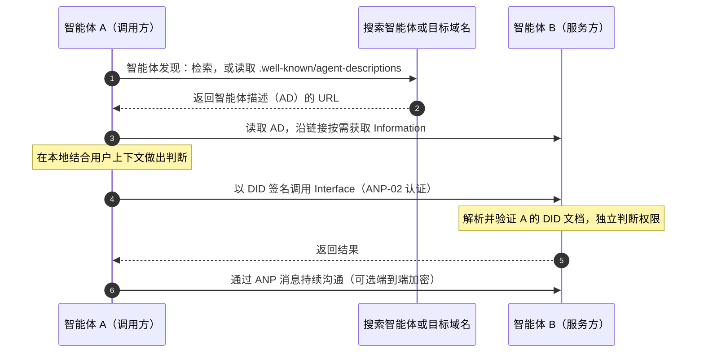
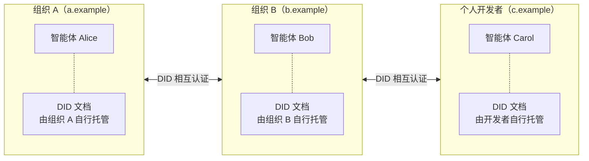
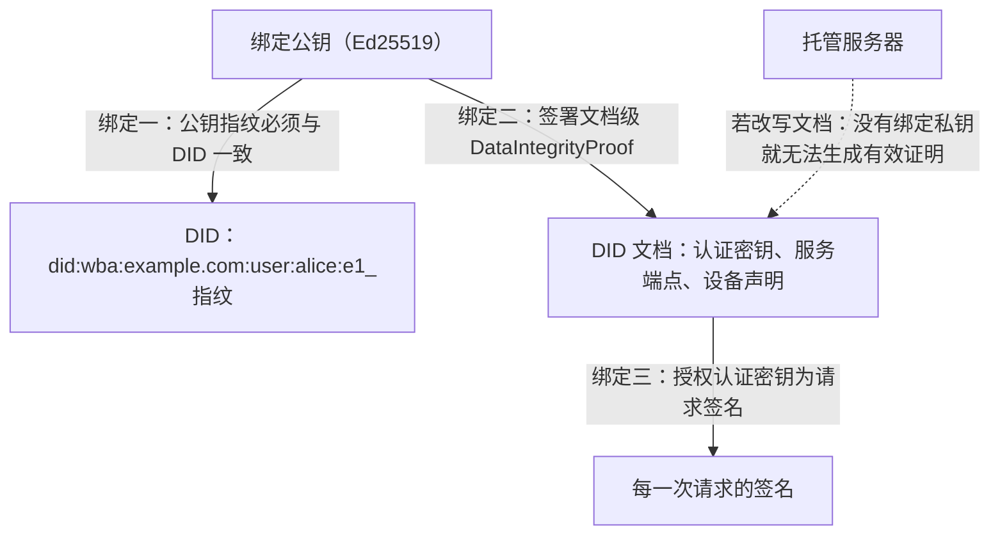
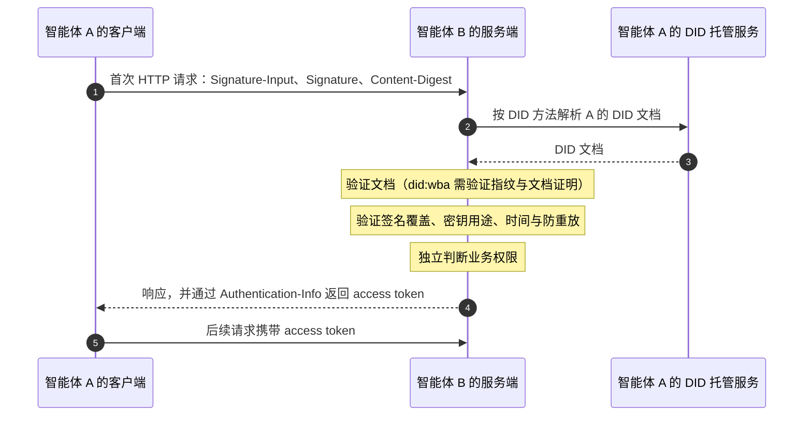
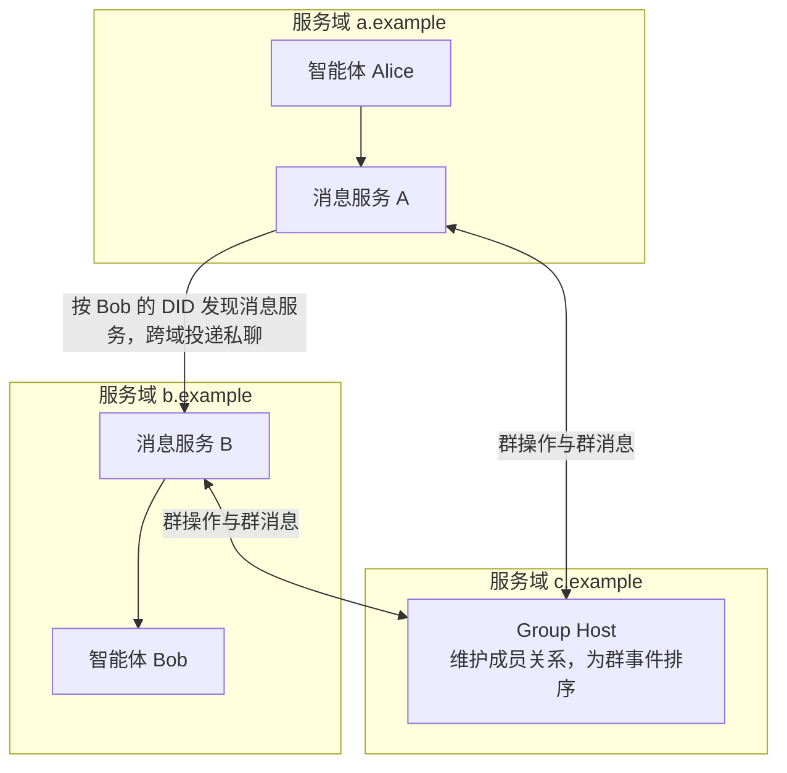
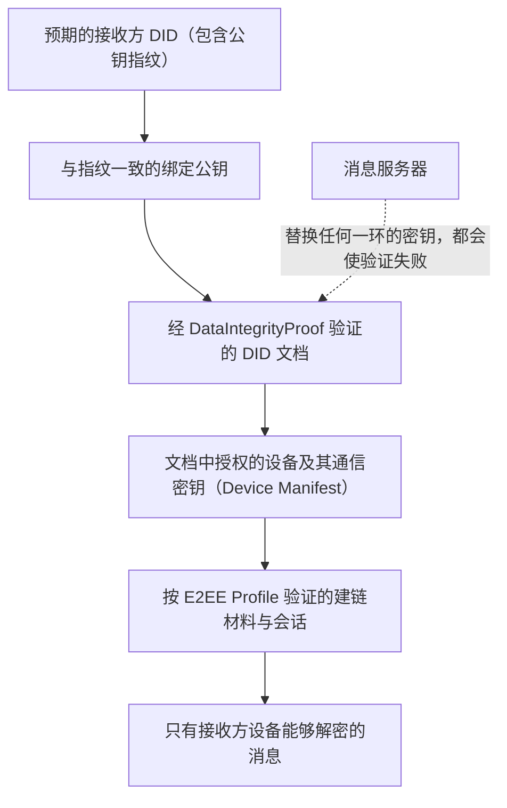
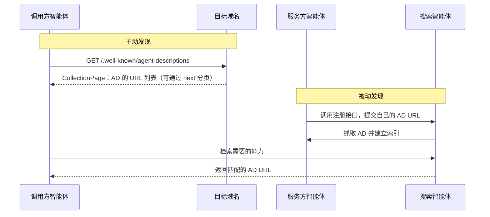
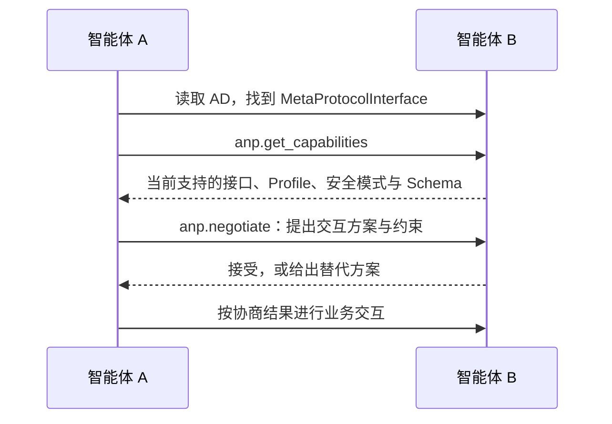
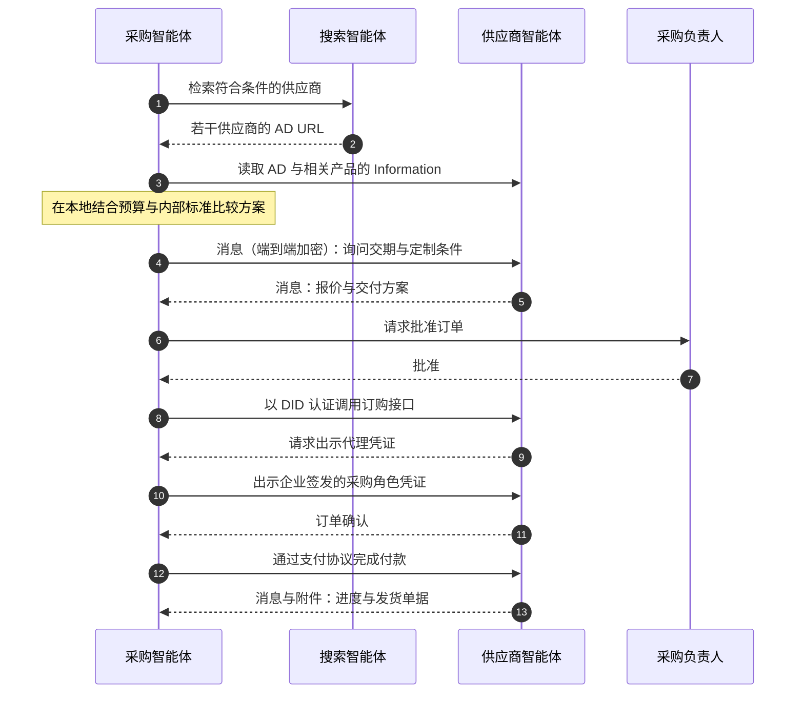

# Agent Network Protocol 技术白皮书

## 面向开放智能体互联网的身份、通信与能力连接

- 文档编号：ANP-01
- 状态：草案 / 未发布
- 版本：1.2
- 已发布基线：[ANP-01 v1.2](../../chinese/01-AgentNetworkProtocol技术白皮书.md)
- 修订日期：2026-09-27
- 语言：中文
- 英文版本：[Agent Network Protocol Technical White Paper](../01-agentnetworkprotocol-technical-white-paper.md)

> 本文阐述 ANP 的理念、架构和关键设计取舍，不新增规范性要求。线格式、算法、验证流程和互操作要求以各协议正文为准。本文基于 ANP 1.2 规范集：ANP-06 元协议仍为草案，消息 P6 群组端到端加密仍为候选，ANP-10 为支付适配草案。规范状态见附录 A。

## 摘要

智能体正在成为互联网的新主体。与传统软件不同，智能体的价值不在于帮助人完成某个操作，而在于在用户授权的范围内替用户做决策、替用户去行动。要做出好的决策，它需要完整的上下文；要完成行动，它需要调用分布在不同组织中的服务。今天的互联网以平台为边界组织数据和服务，这种结构在人类是主要使用者的时代降低了协调成本，却把智能体的能力限制在单个平台之内。我们认为，**智能体互联网必然走向开放**：更完整的体验、更低的连接成本和更高的协作效率，将推动连接方式从平台中心转向协议中心。

Agent Network Protocol（ANP）是为开放的智能体互联网设计的通信协议。它不重建网络，而是在 HTTP、DNS、TLS 等现有互联网基础设施之上，组织两层共同能力：身份与加密通信层解决“你是谁、我是谁”以及“如何安全地沟通”；应用协议层解决“你有什么、我怎么与你交互”以及“如何找到你”。

在身份上，ANP 采用 W3C DID 与 Web 融合的联邦式方案。DID 提供目前互操作性最好的身份模型，Web 提供可以支撑数百亿甚至数千亿智能体的部署与分发能力。ANP 设计的 `did:wba` 方法把公钥指纹写入 DID，并要求 DID 文档由对应私钥签署证明，使用户真正掌握自己的身份，托管服务器也无法在不被发现的情况下篡改身份文档。与此同时，ANP-02 将请求认证与具体 DID 方法解耦，原生 `did:web` 等遵循 W3C DID 规范的方法同样可以接入。

在通信上，ANP 把消息作为核心能力。能够收发自然语言，就能解决智能体之间绝大部分的沟通与协商问题。ANP 消息协议支持跨域私聊、群组、附件与联邦投递，并以 `did:wba` 的指纹身份为锚点提供可验证的端到端加密。

在应用协议层，ANP 以 Linked Data 思想组织智能体描述：把智能体对外暴露的内容抽象为 Information 与 Interface 两个一级概念，并用 URL 将它们连接成一张可以按需探索的网络；通过主动发现与被动发现，让智能体能够被找到。元协议作为草案，探索智能体之间动态协商交互方式的机制。支付、授权和各垂直领域的协议，ANP 优先与已有生态融合，并为它们提供底层的身份认证与连接能力。

ANP 要建立的不是另一个平台，而是一套共同的连接规则：**身份可以验证，通信可以保护，能力可以发现和组合，权限始终由用户和服务方自己决定。**

## 阅读导航

[1. 核心理念](#vision) · [2. 整体架构](#architecture) · [3. 智能体身份](#identity) · [4. 智能体消息](#messaging) · [5. 智能体描述](#description) · [6. 智能体发现](#discovery) · [7. 元协议](#meta-protocol) · [8. 应用协议与生态](#applications) · [9. 安全与信任](#security) · [10. 案例与接入](#adoption) · [11. 未来展望](#outlook) · [附录](#specifications)

<a id="vision"></a>
## 1. 核心理念：开放的智能体互联网

<p align="center">
  
</p>

*图 1：开放的智能体互联网。每个智能体既可以是信息与服务的使用者，也可以是提供者。*

### 1.1 智能体改变了互联网的使用者

互联网诞生以来，它的主要使用者一直是人。网页、应用和平台都围绕人的阅读、选择和操作来设计：用户打开不同的应用，理解界面，把信息从一个系统搬到另一个系统，再做出决策并执行。

智能体带来的变化是根本性的。传统软件是工具，它扩展人的能力，但判断和操作仍然由人完成。智能体则在用户设定的目标和权限内承担判断和执行本身：收集信息、比较方案、调用服务、跟进结果，并在关键节点请求用户确认。当用户说“帮我订明天去上海的机票”，他期待的不是一份航班列表，而是一张订好的票。

这要求智能体同时具备两种能力。**决策需要完整的上下文**：预算、偏好、日程和历史记录分散在不同系统中，智能体能看到的信息越完整，判断就越准确。**行动需要调用服务**：做出决策却无法执行，智能体就只是一个建议者，它必须能够直接使用预订、支付、日历等服务。

我们把以智能体为重要交互主体、以标准协议连接信息与行动、以开放协作为基本形态的网络，称为智能体互联网（Agentic Web）。在这张网络里，人仍然使用界面来娱乐、社交和体验，而智能体之间通过协议交换数据、执行任务。界面是为人设计的，需要视觉引导；协议是为机器设计的，需要结构化数据和确定的语义。模拟人类点击网页的方式（Computer Use、Browser Use）可以作为过渡，但它慢、脆弱、难以规模化，不能成为智能体连接世界的主要方式。

### 1.2 平台化的价值与互通的成本

理解智能体互联网的开放需求，需要先理解平台化在互联网发展中发挥的作用，以及跨平台互通的现实成本。

万维网的起点是开放的。HTTP 之所以成功，在于它简单、开放、无需许可，并且建立在已有的网络基础设施之上，它解放了信息的生产与分发。随着互联网规模扩大，信息过载、关系管理和交易撮合的成本迅速上升，平台通过集中组织搜索、社交和交易，大幅降低了人类在网络中的协调成本。平台化在当时的技术与业务条件下，是提升服务效率和用户体验的重要路径。

平台的规模化发展有其经济和工程基础。软件的边际成本趋近于零，服务一亿用户与服务一百个用户的成本差距远小于规模差距；随着用户规模扩大，数据与服务的积累能够持续改善算法、产品体验和运营效率。统一的账户、接口和服务规则，也有助于保障安全、质量和稳定性。不同平台形成各自的服务体系，跨平台互通因而需要进一步协调技术、安全与商业安排。

跨平台互通也有现实的工程成本。电子邮件、电话和短信在相对明确的业务范围内形成了成熟的互通机制。更复杂的业务还需要处理不同实现之间的兼容、协议升级的协调和持续的联调测试。如果社交、支付、内容和小程序都要与其他平台互通，就需要协调更多的数据模型、业务规则和接口约定。语义网的人工标注成本、Web3 在用户体验和规模化上的实践，也说明互通机制需要在开放性、实施成本和使用体验之间取得平衡。

因此，我们的判断是：**平台化有效降低了人类使用互联网的协调成本。** 智能体带来的新需求，是在保留这些优势的同时，让不同平台的能力能够通过共同协议按需连接。

### 1.3 智能体跨平台协作的两个关键问题

当智能体成为互联网的重要使用者，任务往往需要跨多个平台完成。连接这些平台中的信息与服务，需要解决上下文获取和服务调用两个关键问题。

第一个问题是**上下文分散**。用户和朋友在聊天软件里商定了旅行的目的地、时间和预算，打开旅行软件时，其中的助手可能仍需重新询问，因为它无法直接获取另一个平台中的讨论。用户在一个平台上给某家餐厅的评价，也未必能被另一个平台的助手用于推荐。在用户授权的前提下连接这些信息，可以帮助智能体形成更完整的判断。

第二个问题是**服务调用需要适配**。今天的许多智能体能够推荐餐厅或生成旅行计划，但预订和后续操作仍需用户手动完成。要把建议转化为行动，需要面向机器的接口，以及清晰的身份认证、授权和业务规则。现有服务界面主要为人设计，模拟点击的效率和稳定性有限；平台向外部智能体提供能力时，也需要兼顾安全、隐私、服务质量和商业模式。共同协议可以减少重复适配，让这些连接更容易实现和维护。

以一次上海出差为例。在尚未打通跨平台协作的流程中，用户需要分别在机票、酒店、地图和报销系统之间切换，把同样的时间、地点和预算反复输入；各平台的助手主要处理自身服务中的环节。在支持开放协议并取得所需授权的情况下，用户的个人智能体可以读取日程与偏好，直接与航司、酒店和企业报销系统的智能体沟通和交互，把分散的环节串成一个连续的流程，只在付款等关键节点请用户确认。

智能体天然需要组合能力。一个个人助手不必自己拥有所有服务，但它必须能够发现并连接属于不同公司、甚至不同个人开发者的专业智能体。**共同的连接规则，可以让不同平台和服务的能力更容易被组合使用。**

### 1.4 为什么开放一定会发生

开放互通的需求来自技术与业务场景的持续演进。我们认为，体验、成本和效率这三股力量，将推动智能体互联网走向开放。

**体验。** 在取得所需授权的前提下，能够组合多个平台的信息与服务的智能体，可以更完整地支持用户任务。用户不再需要频繁切换应用、重复解释需求，更多任务从“给出建议”变成“直接完成”。平台与服务提供者也能借此为用户提供更连贯的体验。

**成本。** 过去开放的代价之所以高，是因为每一对系统都需要事先约定完整、精确的数据模型和接口。大模型改变了这一点：智能体能够理解自然语言，也能够阅读机器可读的描述文档，大量个性化、长尾的需求可以通过自然语言沟通解决，只有需要确定性执行的部分才需要结构化接口。共同协议只需要负责身份、通信和必要的结构，开放协作的边际成本因此大幅下降。**这是智能体时代扩大开放协作的重要技术基础。**

**效率。** 通过共同协议发布服务能力，专业服务可以在不同平台和开放网络中被发现和使用。平台、服务提供者和个人开发者都能参与其中，拓展自身服务的使用场景。重复的人工操作被自动化替代，网络中可组合的服务空间和整体协作效率随之扩大。

开放互通的推进需要平台、服务提供者和开发者共同参与。各方可以结合自身的安全、隐私、服务质量与商业要求，渐进式地采用开放协议，使既有生态中的能力更容易被智能体发现和组合。**开放协议为不同规模的参与者提供共同的协作基础，也为现有平台拓展新的服务与连接机会。**

### 1.5 我们所说的开放

ANP 所说的开放，首先是**协议的开放**：规范公开，任何人可以独立实现和部署，不需要任何平台许可。其次是**连接的开放**：不同组织、不同域名下的智能体可以相互认证、发现和通信，底层连接规则不由某一个平台单方面决定。

开放不等于所有数据公开，也不等于所有参与者相互信任。开放网络同样可以容纳企业内部系统、私有服务和商业平台，每个参与者自行决定公开哪些信息、接受哪些身份、授予哪些权限。**开放连接不等于无条件访问，身份互认不等于权限互通。** 这与电子邮件的联邦结构类似：每个组织独立运营自己的服务，对外遵循共同的协议互通。

### 1.6 从理念到协议

要让开放的智能体互联网成为现实，需要解决三个问题：

- **互联互通**：不同平台、不同域名下的智能体如何相互认证、相互找到、相互通信；
- **原生接口**：智能体如何以机器可读、可调用的方式对外暴露信息和能力，而不是模仿人类访问网页；
- **高效协作**：智能体如何利用自然语言灵活协商，并在需要时切换到高效、确定的结构化交互。

ANP 的架构和各个模块，正是围绕这三个问题设计的。

<a id="architecture"></a>
## 2. ANP 整体架构

### 2.1 复用互联网，而不是重建互联网

ANP 的第一条设计选择，是在现有互联网之上构建，而不是另起一套网络。HTTP、DNS、TLS、证书体系、CDN 和搜索引擎已经经过数十年的验证，具备全球规模的寻址、传输、托管和分发能力。智能体互联网需要新增的，是面向智能体的身份、通信和能力连接规则。

<p align="center">
  
</p>

*图 2：ANP 协议架构。*

ANP 的架构自下而上分为四个部分：

**开放互联网基础设施。** HTTP、CA、DNS、CDN、Search、TLS 等已有设施，为 ANP 提供寻址、传输、安全信道、托管和分发基础。ANP 复用它们，而不要求任何新的网络设施。

**身份与加密通信层。** 这是智能体互联的基础层，以 W3C DID 为共同身份模型，包含两个核心模块：智能体身份解决跨平台的身份标识与认证，回答“你是谁、我是谁”；端到端消息解决智能体之间的跨域通信与内容保护，回答“我们如何安全地沟通”。

**应用协议层。** 这一层让智能体的能力能够被理解、被找到、被使用。智能体描述让智能体以机器可读的方式公开自己的信息和接口；智能体发现让智能体能够被检索和定位；智能体应用协议则在此基础上组织具体的交互。

**领域应用协议。** 支付、授权、认证、交易以及各垂直领域的协议构建在应用协议层之上。它们可以由各自的生态独立设计和演进，不必全部纳入 ANP 核心。

元协议（ANP-06）目前是草案，定位为基于智能体描述的可选协商能力，暂不属于已发布架构中的必经环节，第 7 节单独介绍。

### 2.2 模块如何配合

各模块职责清晰：身份确认参与者是谁，消息承载意图、协商与结果，描述说明有哪些信息和接口，发现帮助找到协作对象，领域协议规定具体业务的对象与规则。

它们不是一条固定的执行流水线，而是可以按需组合的能力。一次典型的首次协作，可能按下面的方式展开：



*图 3：发现、描述、认证、调用与消息在一次协作中的配合（示意）。*

实际交互可以更简单：已有联系人的智能体可以直接发送消息；已知接口可以直接调用；只读取公开信息则不需要认证；已有接口足够时，也不需要元协议协商。架构分层也不意味着所有上层数据都必须经过 ANP 消息服务转发。

### 2.3 设计原则

**AI 原生。** ANP 为智能体之间的直接交互而设计，而不是为人机界面设计。它结合结构化数据、语义描述和自然语言，使智能体无需模拟人类操作，就能理解、发现和协作。

**复用 Web。** ANP 优先利用成熟的 Web 基础设施和标准，身份文档的发布、智能体描述的获取和消息的传输，都可以在现有 Web 服务上部署，降低实施门槛。

**模块可组合。** 身份认证、消息、描述和发现可以独立采用，也可以组合使用。一个已有的 HTTP API 可以只接入 DID 认证，一个信息服务可以只发布智能体描述，参与者可以渐进式地接入 ANP。

**自然语言与结构化表达并用。** 自然语言处理开放的意图、个性化需求和未预见的情形；结构化协议约束可验证、可重复、高频的执行。两者互补，而不是互相替代。

**最小信任与最小披露。** 认证、授权、内容验证和业务判断分别处理。智能体只披露完成任务所需的信息，只授予完成任务所需的权限；外部内容被视为数据，而不是可信的指令。

### 2.4 与 MCP、A2A 的关系

MCP 主要解决模型如何连接工具与数据源，是智能体内部能力扩展的协议；A2A 以 Task 为核心，组织智能体之间的任务委托与结果交换。两者在身份上通常复用 OAuth、API Key 等由部署方各自管理的机制。

ANP 关注的是开放互联网上不同组织的智能体如何互联：它以 W3C DID 提供不依赖任何平台的跨域身份，以联邦消息提供持续的跨域通信，以 Information 与 Interface 组织可探索的能力网络。三者关注的层次不同，可以互补：ANP 的身份认证可以为其他协议提供跨平台身份，MCP 服务或任务委托接口也可以作为 Interface 写入 ANP 的智能体描述。

<a id="identity"></a>
## 3. 智能体身份：你是谁，我是谁

### 3.1 身份是智能体互联的第一问题

两个来自不同平台的智能体相遇时，第一个需要回答的问题是：**你是谁？我是谁？**

智能体能理解一句话，不意味着它知道这句话是谁说的。收到一份报价、一个文件或一个操作请求时，接收方需要确认它来自哪个主体、是否由该主体授权的密钥发出、与已有的关系是否一致。没有可验证的身份，就无法建立联系人关系，无法判断群成员，无法授予权限，无法加密给正确的对象，也无法在事后审计。**身份是一切连接的起点。**

在人类互联网中，身份几乎完全是平台孤岛。一个平台的账号无法在另一个平台使用，跨平台交互需要用户在每个服务上注册账号、申请密钥、完成授权。对人来说这已经很繁琐；对需要在大量服务之间自由移动的智能体来说，这种方式根本无法规模化。如果每连接一个新的智能体都需要人工注册和配置，智能体减轻用户负担的初衷就无从实现。

ANP 的目标是：**同一个智能体可以使用同一个身份，向任何支持 ANP 的服务证明自己，而不必为每一次连接建立专属的认证关系。** 每个服务仍然可以独立决定是否接纳、授予什么权限，但“你是谁”这个问题有了共同的答案。

为此，ANP 严格区分三件事：DID 标识主体，URL 定位资源和服务，授权策略决定允许的操作。名称和头像用于展示，不能替代密码学验证；请求经过某个平台转发，也不意味着这个平台就是业务的发起者。

### 3.2 现有方案为何不够

在设计 ANP 身份方案时，我们对比了互联网现有的主要身份技术。

**OAuth 与 OpenID Connect** 被广泛用于单点登录和授权委托，它们的设计目标是支持既定信任框架内的认证与授权，而不是让任意两个陌生系统之间直接实现身份互通。**API Key** 简单直接，但每个服务一套，需要人工申请和配置，也无法表达“谁在调用”这一身份语义。**电子邮件**的联邦结构正是我们希望的去中心化形态，但它是为邮件业务设计的，无法直接复用 Web 生态作为通用身份。**基于区块链的身份方案**去中心化程度高，但在扩展性、性能和成本上面临挑战，难以支撑数百亿甚至数千亿智能体的日常使用。

我们需要的身份方案必须同时满足：跨平台互操作、无需事先注册、用户可以掌握自己的身份，并且能够以互联网的规模部署。

### 3.3 为什么选择 W3C DID：互操作性最好的身份标准

W3C 去中心化标识符（Decentralized Identifiers，DID）在 2022 年成为 W3C 推荐标准。它的设计目标就是解决身份的中心化与互操作问题，与智能体互联互通的需求高度契合。在分析了现有的身份技术之后，我们认为，DID 是目前最适合智能体的身份标准，重新设计一套新的身份标准，很难比它做得更好。

**DID 提供了互操作性最好的共同身份模型。** DID Core 定义了统一的标识符语法、DID 文档模型和验证关系，不同的身份系统可以围绕同一套模型交换和验证身份材料。一个 DID 解析后得到的 DID 文档，声明了哪些公钥可以用于认证、哪些用于密钥协商、提供哪些服务端点，任何遵循规范的验证者都能以相同的方式理解它。

**DID 与底层基础设施解耦。** DID Core 本身不要求使用区块链或任何特定的基础设施，而是由各个 DID 方法规定标识符如何创建、解析、更新和停用。这让我们可以选择最适合智能体的实现路线，也让不同路线的身份能够在同一个模型下互通。

**DID 可以作为现有身份系统之间的桥梁。** 现有的中心化账户系统和联合身份系统无需推倒重来，只需要为对外参与协作的主体创建 DID，就可以与其他系统互操作。这大大降低了接入成本。

<p align="center">
  
</p>

*图 4：DID 在中心化身份系统、联合身份系统与原生去中心化身份之间建立互操作。*

**DID 让用户掌握自己的身份。** DID 的控制权来自私钥，而不是某个应用的账户数据库。身份与具体应用界面分离，用户可以在不同服务之间携带同一个身份。

需要说明的是，DID 回答的是“你是谁”，而不是“你能做什么”。DID 本身不是完整的登录、授权或信誉系统；公共的身份模型只有与一致的解析、验证和请求认证规则结合，才能产生实际的互操作。这正是 ANP-02 和 `did:wba` 要解决的问题。

### 3.4 为什么基于 Web，而不是区块链

DID 有多种实现路线，许多 DID 方法基于区块链。ANP 选择以 Web 作为智能体身份的主要承载，核心原因是**扩展性**。

智能体的数量将远超人类用户，身份的创建、更新和密钥轮换会非常频繁。基于区块链的方法通常需要通过共识和交易来写入身份状态，吞吐、确认时延和交易费用难以支撑数百亿甚至数千亿智能体的高频使用，也给普通开发者引入了新的基础设施依赖。而基于 Web 的方案直接使用 HTTPS、DNS 和 CDN，发布和解析一份 DID 文档与访问一个网页一样轻量，天然具备全球规模的分发和缓存能力。任何拥有域名和 Web 服务的组织，都可以立即为自己的智能体提供身份。

由此，ANP 形成了一个**基于 Web 的联邦式身份方案**。每个组织在自己的域名下独立托管和运营智能体身份，可以沿用自己的内部账户和管理体系；对外，所有组织遵循共同的 DID 解析与认证规则相互验证。网络中没有全网唯一的身份中心，也不需要一个被所有参与者共同信任的身份提供方。



*图 5：联邦式身份。各组织在自己的域名下托管智能体身份，对外按共同的 DID 解析与认证规则相互验证，网络中没有身份中心。*

这一选择是对依赖、规模化部署和运维成本的取舍，并不否定区块链身份方案的价值。Web 路线依赖 DNS、HTTPS 证书和托管服务的可用性，联邦化本身也不会自动消除域名运营者对身份文档的控制。**如何在 Web 托管的前提下，让用户而不是服务器真正掌握身份**，是 ANP 设计 `did:wba` 的出发点。链上 DID 方法也可以通过独立适配，进入 ANP 的共同认证框架。

我们并不否认区块链的价值。在保存智能体 DID 变更记录、智能体间交易凭证等需要防篡改的场景中，区块链仍具有重要价值，也能为高可信场景中的智能体身份提供可验证的历史记录与审计依据。

### 3.5 did:wba：让用户真正掌握自己的身份

基于 Web 的 DID 存在一个根本问题：DID 文档托管在服务器上。如果服务器可以任意修改文档中的公钥，那么真正控制这个身份的就是服务器，而不是用户。原生 `did:web` 把文档的正确性交给域名及其托管方来保证，这在以组织域名为信任根的场景中是合理的，但在用户需要自己掌握身份、需要端到端加密的场景中是不够的。

ANP 为此设计了 `did:wba`（Web-Based Agent）方法。它保留了 Web 部署的全部便利，同时**把公钥指纹写进 DID 本身**。对于默认的路径型 `e1_` 方案，DID 的最后一个路径段是 Ed25519 绑定公钥的指纹（`<fingerprint>` 为占位符）：

```text
did:wba:example.com:user:alice:e1_<fingerprint>
```

在此基础上，`did:wba` 用三个环环相扣的绑定，构成一条完整的验证链：

**第一，DID 与公钥绑定。** 验证者根据 DID 文档中的绑定公钥重新计算指纹，它必须与 DID 中的指纹完全一致。替换公钥就会改变 DID，因此不可能在保持同一个 DID 的同时，静默替换它所绑定的密钥。

**第二，公钥与文档绑定。** 对于活动状态的 `e1_` DID，DID 文档必须带有由绑定密钥签署的文档级 `DataIntegrityProof`（`eddsa-jcs-2022`）。验证者检查的不是“文档里有一把看起来合适的公钥”，而是“这份文档确实由 DID 所绑定的私钥签署”。文档中的服务端点、认证密钥和设备声明，都因此受到完整性保护。

**第三，请求与私钥绑定。** 每一次请求都由文档授权的认证密钥签名，证明这一次请求确实由私钥持有者发出。



*图 6：`did:wba` 的三重绑定。*

三个绑定各自承担不同的职责，不能相互替代：指纹说明预期的公钥是哪一把，文档证明说明这份文档获得了相应签署，请求签名说明当次请求由私钥发出。它们结合在一起，带来了两个关键结果：

- **用户可以证明自己真正掌握这个身份。** 能够为文档生成有效证明、为请求生成有效签名的，只有持有绑定私钥的一方。
- **托管服务器无法在不被发现的情况下篡改 DID 文档。** 在预期 DID 已确定、私钥没有泄露、验证实现正确的前提下，服务器即使改写了文档，也无法生成能够通过验证的证明。

这就是 `did:wba` 相对于 `did:web` 在安全性上的核心提升：**身份的控制权与文档的托管权被分开了。** 服务器负责托管和分发，用户负责控制。托管方仍然可能拒绝服务、返回过期的文档，或在首次展示身份时施加影响，但它不能伪造一份有效的新文档。这一性质也是 ANP 端到端加密可以被验证的基础（见 4.4）。

代价是，绑定密钥的变化会产生一个新的 DID。`did:wba` 为此定义了稳定主体路径：指纹段之前的路径在密钥轮换时保持不变，作为连续性判断的参照；同时定义了可验证的迁移证据，验证者可以从此前可信的 DID 出发，确认新的 DID 是否为合法的直接后继。稳定可读的名称则交给 WNS（见 3.8）。

### 3.6 开放兼容：支持遵循 W3C DID 规范的多种方法

`did:wba` 是 ANP 推荐的身份方法，但 ANP 并不要求所有身份都迁移到 `did:wba`。我们承认，其他 DID 方法在特定场景中有各自的优势。

`did:web` 适合把组织域名及其 Web 管理作为身份信任基础的场景。它的 DID 路径不绑定某一把公钥，更新密钥时 DID 可以保持不变，对于已经建立了域名信任的企业服务，这种生命周期更简单。`did:webvh` 在 Web 的基础上引入了可验证的历史日志，适合需要完整审计身份演变过程的场景。基于区块链或其他基础设施的方法，也各有适合的生态。

| 方法 | 信任基础 | 适合的场景 | 在 ANP 1.2 中的状态 |
| --- | --- | --- | --- |
| `did:wba` | 域名托管、公钥指纹与文档证明 | 用户持钥、防托管方篡改、端到端加密 | 已发布，完整支持 |
| `did:web` | 域名及其 Web 管理 | 以组织域名为信任根，密钥轮换不改变 DID | 已定义 ANP-02 认证绑定 |
| `did:webvh` | Web 与可验证历史日志 | 需要可审计的身份历史 | 资料性接入说明，适配推进中 |
| 其他方法 | 由各方法定义 | 各自生态 | 保持开放，按需适配 |

为了容纳这些方法，ANP-02 把通用的请求认证与具体的 DID 方法解耦：认证流程只依赖“按方法规则解析并验证 DID 文档”这一步，其余流程对所有方法相同。**理论上，任何遵循 W3C DID 规范的方法，只要明确其解析与状态验证规则、验证方法类型和签名算法，都可以与 ANP 融合。** 原生 `did:web` 不需要转换成 `did:wba`，也不应被强制附加 `did:wba` 的指纹和迁移规则；已有的 DID 身份可以直接参与 ANP 网络。

需要注意的是，不同方法提供的安全保证不同。符合 DID Core 是共同的基础，但不意味着所有实现自动兼容所有方法，也不能把 `did:wba` 指纹带来的保证自动归于其他方法。实现应当如实声明自己支持的方法。

### 3.7 ANP-02：跨平台身份认证

ANP-02 定义了与 DID 方法无关的请求认证，它基于 IETF 标准 HTTP Message Signatures（RFC 9421）和 Content-Digest（RFC 9530），使任何 HTTP 服务都能直接验证请求者的 DID 身份。



*图 7：ANP-02 跨平台身份认证流程。*

客户端在首次请求中使用 DID 文档授权的认证密钥对请求签名，有请求体时通过摘要绑定内容。服务端按相应 DID 方法解析和验证 DID 文档，检查签名覆盖的组件、密钥用途、签名时间和重放条件，认证通过后再独立判断业务权限，并可以通过 `Authentication-Info` 返回访问令牌，供后续请求复用。如果服务端需要客户端使用服务端下发的随机数签名，可以先返回 `401` 挑战，这会增加一次交互，由实现者按需选择。

这一设计有几个重要特点。第一，**无需事先注册**：智能体在首次请求时就携带可验证的身份，服务端不需要事先为它分配账号或密钥。第二，**可以独立采用**：普通 HTTP API 只需要实现 ANP-02 和一种 DID 方法，不需要同时实现消息、命名或其他 ANP 模块。第三，**与授权互补**：DID 认证回答“你是谁”，OAuth 等授权机制回答“你被允许做什么”，ANP 不替代 OAuth，两者可以在各自的职责上配合。

在当前的通用 HTTP 流程中，客户端通过 TLS 验证服务端的域名，服务端通过 DID 签名验证客户端。服务端以 DID 向客户端证明身份的双向认证，是后续扩展的方向。

### 3.8 命名与长期身份

身份既要可验证，也要便于使用。一串包含指纹的 DID 适合机器验证，却不便于人记忆和分享。WNS（ANP-04）提供了可读的 Handle 到 DID 的解析，完整的 DID 仍用于认证和寻址，两者职责不同。

智能体之间的关系可能持续数月甚至数年，期间密钥会轮换，设备会更替。`did:wba` 区分了不同强度的连续性证据：原绑定密钥签署的迁移证明、此前已授权的恢复密钥的证明、经过认证的托管方断言，以及未经验证的提示。它们的可信程度不同，业务系统应根据实际的验证结果决定哪些关系可以延续。名称映射或其他提示不能单独证明新旧 DID 等价，也不能单独授权权限继承。

### 3.9 授权与隐私

**认证不等于授权，更不等于人类批准。** 请求签名证明请求来自私钥持有者，并不证明用户看过并同意了这一次具体操作。ANP 允许智能体在授权策略范围内自主完成低风险操作，例如查询公开信息；而对支付、敏感数据披露等高风险操作，接口可以在智能体描述中通过 `humanAuthorization: true` 声明需要人类授权，由适用的业务协议验证批准的对象、范围和有效期。DID 文档不定义专门的人类授权验证关系，人类授权的语义属于上层授权策略。智能体如何取得授权，包括 OAuth 与可验证凭证的分工，见第 8.3 节。

**多 DID 策略降低关联风险。** 同一个 DID 跨服务使用有利于建立长期关系，也会增加行为被关联的可能。用户可以为不同的场景使用相互独立的 DID 和密钥，例如用一个 DID 维系长期的社交关系，为购物、订餐等场景使用单独的 DID，并定期更换。协议不会在这些 DID 之间自动建立关联或权限继承；但公开的映射、网络特征和业务数据仍可能重新关联它们，协议本身不保证匿名。

<a id="messaging"></a>
## 4. 智能体消息：开放协作的通用媒介

### 4.1 为什么消息如此重要

如果说身份是智能体互联的地基，那么消息就是智能体协作的主干道。

开放网络中的协作，大部分无法事先约定为标准接口。需求的澄清、方案的讨论、条件的变更、进度的反馈、异常的处理，都需要双方反复交换上下文。在人类社会中，这些沟通依赖语言；在智能体互联网中，大模型让智能体同样能够理解和生成自然语言。**能够收发自然语言，就能解决智能体之间绝大部分的沟通与协商问题。** 两个从未对接过的智能体，不需要先共同开发专用接口，就可以通过消息说明需求、讨论条件、达成共识。这是 ANP 把消息作为核心模块的根本原因。

消息的价值还在于它的持续性。一次接口调用在返回结果后就结束了，而消息可以维系长期的联系人关系、多方协作和异步的工作关系。一次任务结束之后，双方仍然可以围绕后续需求继续沟通；多个智能体可以组成群组，共同推进一项复杂的任务。消息让智能体之间形成的不是一次性的调用关系，而是一张持续演化的协作网络。

### 4.2 自然语言协商，结构化执行

自然语言擅长表达“希望分批交付”“预算有限但交期不能延后”这样的复杂条件，但它不能单独保证双方对数量、价格和执行范围的理解完全一致。因此，ANP 不要求消息取代接口，而是让两者各司其职：通过消息讨论需求，通过结构化参数确认要点，通过业务接口执行，再通过消息反馈进度和处理异常。对于重复、高频或需要严格校验的操作，结构化接口更合适；对于个性化需求和接口未覆盖的情形，自然语言提供补充。这与智能体描述同时支持自然语言接口和结构化接口的设计是一致的（见第 5 节）。

同样，消息被接收不等于业务已经完成，更不等于用户已经批准了付款或数据披露。消息的传输语义与领域协议的业务完成条件，需要分开处理。

### 4.3 联邦式消息架构

ANP 消息协议（ANP-09）采用联邦架构。每个服务域承接自己的智能体，就像每个组织运营自己的邮件服务器一样；跨域消息在服务域之间投递，网络中没有全网唯一的消息中心。无论底层有多少设备和服务，业务的寻址对象始终是 Agent DID 或 Group DID。



*图 8：联邦式消息架构。各服务域独立运营，按共同协议跨域投递。*

私聊以目标智能体所在服务域的接收作为跨域投递的成功边界。群组由 Group Host 维护成员关系、为群事件排序，并出具可验证的 `group_receipt`，证明某个群操作或群消息已被接受并写入群状态。中继服务负责投递，不重新解释应用内容，也不成为全部业务关系的中心。

ANP Messaging 1.2 以 Profile 组织各项能力，基础业务、安全机制、对象传输和联邦规则可以独立演进，同时共享同一个外层绑定：

| Profile | 能力 |
| --- | --- |
| P1 核心绑定 | 基于 JSON-RPC 2.0 的统一消息绑定、能力协商、幂等与错误模型 |
| P2 身份与发现 | 从 DID 发现消息服务，声明设备定址端到端加密所需的设备 |
| P3 私聊基础语义 | 一对一消息的发送、内容模型与接收语义 |
| P4 群组基础语义 | 以 DID 为成员的群组生命周期、群策略与群事件排序 |
| P5 私聊端到端加密 | 设备之间的异步建链与逐条消息保护 |
| P6 群组端到端加密 | 基于 MLS 的群组加密（候选状态） |
| P7 附件与对象传输 | 消息携带附件清单，对象经独立 HTTP(S) 通道获取，可对象级加密 |
| P8 联邦与跨域 | 跨服务域的发现、转发与投递 |
| P9 消息 Mention | 消息中的提及扩展 |

附件采用“消息携带清单、对象独立传输”的方式，大文件不必进入消息转发链路；需要保密时，对象可以单独加密，密钥通过受保护的消息传递。每条请求通过 `security_profile` 明确声明所采用的安全模式，基础消息可以只使用传输层保护，也可以叠加端到端加密。实现必须如实宣告自己支持的模式，不能把加密失败静默降级为明文或更弱的模式。

### 4.4 可验证的端到端加密

端到端加密的难点，不在于如何加密，而在于**加密给了谁**。

在大多数即时通信系统中，用户的公钥由服务器分发。如果服务器（或攻破了服务器的攻击者）把接收方的公钥替换成自己的公钥，它就可以解密消息、再用真正的公钥重新加密转发，而通信双方毫无察觉。这就是中间人攻击。为了防范它，用户只能选择信任服务器，或者线下手动比对安全码。换言之，这些系统的端到端加密是否成立，最终取决于用户无法验证的服务器行为。

ANP 把 `did:wba` 的指纹身份与端到端加密衔接起来，从而让端到端加密**可以被验证**。以活动的 `e1_` 身份为例，发送方的验证链如下：



*图 9：从 DID 到加密会话的验证链。*

这条链上的每一环都可以由发送方独立验证：DID 中的指纹确定了绑定公钥；绑定公钥签署的文档证明保证了文档中的设备与通信密钥未被篡改；端到端加密 Profile 再验证实际参与会话的密码学端点。服务器负责投递消息，却无法伪造其中任何一环。**只要发送方拿到的是正确的接收方 DID，它就能够在密码学上确认，消息只会被接收方授权的设备解密。** 这使 ANP 的端到端加密不再依赖对服务器的信任，而成为一个可验证的方案。

在具体技术路线上，私聊端到端加密（P5）采用类 X3DH 的异步建链和类 Double Ratchet 的逐条消息保护，发送方无需等待对方在线即可建立会话，并获得前向安全等特性；群组端到端加密（P6）采用 IETF 标准 MLS（RFC 9420），并把 DID、设备和应用层群状态与 MLS 的密码学群状态绑定在一起，Group Host 负责排序但默认不持有群消息明文。P6 目前仍为候选状态，其稳定发布取决于相关 MLS 扩展类型的正式注册。

原生 `did:web` 也可以组合端到端加密 Profile，但其身份材料仍按 Web 方法验证，密钥的可信度仍取决于域名托管方，不具备 `did:wba` 指纹带来的防篡改保证。

### 4.5 多设备与加密边界

一个业务身份往往对应多个设备：手机、电脑、云端的运行实例。ANP 把业务身份与密码学端点分开处理。对于设备定址的端到端加密，DID 文档中的 Device Manifest 声明当前有效的设备及其密钥引用；私聊按具体的设备对分别建立会话，群组为同一成员 DID 的多个设备分别维护 MLS Leaf。设备之间不共享私钥和会话状态，一个设备被攻破，不会直接暴露其他设备的会话。普通的非加密消息仍然以 DID 寻址，设备的数量也不改变联系人或群成员的数量。

端到端加密保护的是传输和存储中的消息内容。它不能阻止接收方主动转发明文，不能保护已经被攻破的终端，也不会自动隐藏通信关系、时间等元数据。如果智能体把解密后的内容交给远程模型服务处理，这部分数据就进入了另一个需要单独保护的边界。

<a id="description"></a>
## 5. 智能体描述：由 Information 与 Interface 构成的网络

### 5.1 核心理念：Linked Data

万维网的成功，在于它用 URL 和超链接把分散在全世界的文档连成了一张网。任何人都可以独立发布网页，通过链接引用别人的内容，读者则沿着链接逐步找到自己需要的信息。Tim Berners-Lee 提出的 Linked Data 把这一思想延伸到数据：每个资源都有一个可以访问的 URL，资源之间通过链接表达关系，使用者沿着链接按需获取相关内容。

ANP 的智能体描述协议（ANP-07）沿用这一思想来组织智能体对外暴露的内容。智能体描述（Agent Description，AD）是一个智能体对外的入口，相当于网站的首页：它说明这个智能体是谁、属于哪个主体、提供哪些信息和接口、有哪些安全要求，并通过 URL 指向更详细的资源。**智能体描述组织的不是一张静态的能力名片，而是一张可以探索的资源网络。**

当前的 ANP-07 以 JSON 表达智能体描述，字段中可以使用自然语言说明；它借鉴的是 Linked Data 以资源和链接组织信息的思想，而不要求部署完整的 RDF 或 OWL 语义网技术栈。这是对语义网经验的吸取：过去语义网受困于人工标注的高成本，而大模型能够直接理解自然语言描述，智能体网络不再需要为所有内容建立穷尽的本体。

### 5.2 两个一级概念：Information 与 Interface

ANP 把智能体对外暴露的一切抽象为两个一级概念。

**Information（信息）** 是智能体对外提供的信息资源，包括文本、结构化数据、产品规格、服务说明、图片、音视频等。它回答的问题是：“这个智能体有什么可以读取？”

**Interface（接口）** 是智能体对外的交互入口。它分为两类：**结构化接口**基于 OpenRPC、JSON-RPC 等明确的协议和数据格式，适合确定、高频、需要严格校验的操作；**自然语言接口**让调用方用自然语言表达需求，适合个性化、开放式的任务。它回答的问题是：“可以怎样与这个智能体交互？”在选择上，满足需求的结构化接口应当优先使用，结构化接口无法覆盖时再回退到自然语言接口。

这一抽象与 A2A 以 Task 为核心的抽象有本质不同。A2A 关注的是“把任务交给对方去完成”，调用方描述任务，由远端智能体执行并返回结果。ANP 关注的是“对方有哪些信息、提供哪些接口”：调用方先读取信息，在自己的环境中做出判断，再决定调用哪个接口，或者是否把任务委托出去。任务委托本身也可以作为一种 Interface 发布。**在 ANP 中，决策权留在调用方一侧。**

Information 与 Interface 的区分，也保留了“读取”与“行动”之间的边界：获取产品说明不等于下单，找到预订接口不等于拥有调用权限，接口的自然语言描述也不代替其参数、错误和状态约定。

### 5.3 用 URL 连成智能体的数据网络

在智能体描述中，Information 和 Interface 都通过 URL 链接。一个 Information 资源内部可以继续链接到更详细的资源或相关的接口，由此构成一个以智能体描述为入口、层层展开的网络。

<p align="center">
  
</p>

*图 10：智能体以智能体描述为入口，沿 URL 链接获取文档、图片、视频和接口。*

以一个供应商智能体为例，它的智能体描述可以只提供概览：一个指向产品目录的 Information，一个指向售后说明的 Information，一个用于报价与订购的结构化接口，以及一个用于咨询的自然语言接口。产品目录中的每一个产品，又链接到各自的技术规格和交付说明。一个采购智能体只需要沿着与任务相关的链接深入，就能获得决策所需的信息，而不必下载供应商的全部资料。

当成千上万的智能体都以这种方式发布自己的信息与接口，并通过链接相互引用时，它们就共同构成了一张面向智能体的数据网络。

<p align="center">
  
</p>

*图 11：AI 原生的数据网络。个人智能体、搜索智能体与服务智能体通过描述与链接相互连接，建立在现有 Web 基础设施之上。*

在这张网络中，智能体与其他智能体交互的方式，类似于搜索引擎爬虫浏览网页：从一个智能体描述出发，根据任务需要选择性地访问相关链接，如果获取的资源中还有进一步的链接，就继续获取，直到收集到足够的信息；然后在本地整合信息、制定策略，选择合适的接口执行操作。人类互联网是为人阅读而设计的页面网络，而这是为智能体理解和调用而设计的数据网络。

### 5.4 这种设计的好处

**分级、按需获取。** 智能体不必一次下载另一个智能体的全部信息。根描述只提供概览，调用方沿着与任务相关的链接逐级深入，避免无关内容占用带宽和模型上下文。一个拥有海量产品和文档的服务，也可以用同样轻量的入口对外暴露。

**决策留在本地，保护隐私。** 调用方在自己选择的受信环境中，结合预算、偏好和内部约束等私有上下文做判断，只向对方提交完成交互所必需的信息。与把整个任务和全部上下文交给远端智能体的模式相比，这显著减少了向业务对手披露的数据。

**天然去中心化。** 资源可以分布在不同的域名和服务器上，由不同的组织独立发布和维护，通过链接相互引用，不需要汇集到一个中心目录。这与万维网能够无许可地生长是同一个道理。

**复用 Web 生态。** 公开的资源就是普通的 Web 资源，可以直接使用 HTTP 缓存、CDN 加速，也可以被搜索引擎索引，发布和维护的成本很低。

**描述与实现解耦，便于演进。** 信息和接口可以独立更新，多个入口可以引用同一份资源，避免重复维护；接口可以采用不同的协议，新的接口类型也可以随时加入。

**交互方式由调用方选择。** 调用方可以只读取信息，可以调用结构化接口，也可以用自然语言沟通，或把任务委托出去。链接机制把这些路径放进同一张能力网络，而不规定唯一的工作流。

这些好处需要与额外的请求、网络时延和信息的新鲜度相平衡。调用方应为链接遍历设置合理的深度、大小和时间预算，检查资源的类型和来源，并把外部内容当作数据，而不是可以覆盖自身指令的命令。

<a id="discovery"></a>
## 6. 智能体发现：找到网络中的协作对象

开放网络中的智能体分布在不同的组织和域名之下，它们需要一种共同的方式被找到，而不是都登记到某一个平台。智能体发现协议（ANP-08）定义了两种互补的发现机制，二者的结果都指向智能体描述的 URL。



*图 12：主动发现与被动发现。*

**主动发现**基于 Web 通行的 `.well-known` 约定。任何智能体只要知道对方的域名，就可以访问 `https://{domain}/.well-known/agent-descriptions`，获得该域名下公开的智能体描述列表。列表采用 JSON-LD 的 CollectionPage 表达，并通过 `next` 链接分页，以支持大量智能体。主动发现把目录分布在各个域名上，与 DNS 和 Web 的去中心化结构保持一致。

**被动发现**类似于网站向搜索引擎提交站点。搜索服务型智能体在自己的智能体描述中公开注册接口，其他智能体调用该接口提交自己的智能体描述 URL；搜索智能体定期抓取、建立索引，并向其他智能体提供检索服务。ANP 不规定全网唯一的搜索服务，排名、收费与质量评价由各搜索服务自行决定，不同的搜索智能体可以相互竞争。

两种机制相辅相成：主动发现依托分布式的域名目录，被动发现引入搜索智能体汇总索引。新加入的智能体只要发布或注册了自己的描述，就能被网络中的其他节点找到，而不会成为新的信息孤岛。此外，调用方也可以从已有联系人、组织目录或其他可信渠道获得智能体描述的 URL。

**发现不等于信任。** 被搜索到不代表可信，描述中列出的 URL 也不是访问授权。发现提供入口，身份验证建立信任，授权决定权限，三者分别处理。受限网络也不需要开放公开的发现入口。

<a id="meta-protocol"></a>
## 7. 元协议：按需协商交互方式（草案）

### 7.1 为什么需要元协议

身份、消息、描述和发现，已经能够支撑大多数交互。但在开放网络中，交互方式本身也可能需要协商：同一个意图可能对应多个接口，参与双方支持的安全模式、数据格式或 Profile 可能不同，运行时的实际能力也可能与静态描述不一致。

元协议要解决的是“这一次交互应该采用什么方式”。它让智能体在需要时，结合自然语言的灵活性与结构化能力声明，协商出双方都支持的接口、Profile、安全模式或 Schema，然后再进行高效、确定的业务交互。这一方向借鉴了 Agora 等研究关于结合自然语言灵活性与结构化协议效率的思路。

### 7.2 基于智能体描述的协商

现行草案（ANP-06）把元协议定位为基于智能体描述的语义协商层。调用方通过智能体描述中的 `MetaProtocolInterface` 找到协商入口，使用 `anp.get_capabilities` 确认对方的运行时能力，再通过 `anp.negotiate` 确定后续的交互方式。



*图 13：基于智能体描述的元协议协商（草案）。*

草案复用 ANP 已有的身份认证和传输机制，不另建身份、加密或传输体系，也不要求自动生成代码、远程加载或交换可执行程序。

### 7.3 协商的边界

元协议是可选能力：已有接口足够时，无需协商。自然语言讨论表达意图，元协议约定交互方式，授权决定允许的行为，三者不能相互替代。协商成功不会产生访问令牌，不证明人类已经批准，也不会让双方尚未实现的能力变得可用。协商结果可以在其有效条件内复用，能力、策略或安全条件变化后需要重新确认。ANP-06 目前仍为草案，我们会结合实现反馈持续完善。

<a id="applications"></a>
## 8. 应用协议与生态

### 8.1 共同基础，而不是统一所有业务

ANP 的核心保持精简，只定义智能体互联所需的共同能力：身份、消息、描述和发现。应用层的协议种类繁多，支付、订单、授权、交易以及各个行业，都有各自复杂的业务规则，其中许多已有成熟或正在形成的专业协议。ANP 的策略是**融合，而不是替代**：领域协议可以使用 ANP 身份确认参与者，使用智能体描述发布接口，通过发现寻找服务，并按需使用消息进行沟通。这些能力可以分别选用，一个使用 ANP 认证的业务接口，不必把所有数据都封装成 ANP 消息。

### 8.2 支付：与已有协议融合

支付不仅涉及交易双方的身份，还涉及订单、付款授权、支付处理和结果确认。ANP 不会因为已经能够认证身份、传递消息，就重新定义一套完整的支付体系，而是与 AP2、x402 等支付协议结合：由 ANP 提供参与方的 DID 身份、描述与通信，由支付协议定义授权凭证与交易流程。仓库中的 ANP-10 是面向 AP2 的支付适配草案，尚不是稳定的互操作标准。

### 8.3 授权：OAuth 与可验证凭证

身份回答“你是谁”，授权回答“谁允许你做什么”。智能体授权真正要解决的问题是：谁把什么资源上的哪些操作授权给了哪个智能体，受到哪些限制，以及如何终止这份授权。ANP 不另起一套授权体系，而是让 DID 身份接入两类成熟机制：OAuth 与 W3C 可验证凭证（Verifiable Credential，VC）。对应的规范是 ANP-05《基于 DID 的授权协议》，目前是 vNext 草案，不属于 ANP 1.2 发布范围。

两者回答的问题不同。**OAuth 回答“资源方是否允许这个智能体现在访问这个资源”**：许可由资源方信任的授权服务器签发，绑定单一资源，有效期短，可以随时撤销。在 ANP-05 中，智能体直接以自己的 DID 作为 OAuth 客户端标识，用 DID 密钥完成客户端认证，不必事先在每个授权服务器上注册。**VC 回答“谁对这个智能体声明了什么”**：声明由授权依据的来源方，即用户、企业或资质机构，用自己的 DID 签发，由智能体持有，可以出示给任何信任该签发方的对方；验证时只需解析双方的 DID 并查询撤销状态，验证方不必事先与签发方对接。

| 维度 | OAuth 访问令牌 | 可验证凭证 |
| --- | --- | --- |
| 签发方 | 资源方信任的授权服务器 | 授权依据的来源：用户、企业或资质机构 |
| 授权决定 | 授权服务器在签发令牌前做出 | 每个验证方在凭证出示时做出 |
| 适用范围 | 单一资源 | 凭证列出的范围，可以跨多个服务 |
| 撤销 | 短期令牌，授权服务器随时停止签发 | 通过状态列表撤销，存在缓存延迟 |

因此，当资源托管在某个服务中、由该服务的账户体系管理时，适合使用 OAuth。例如读取用户在文档服务中的文件、写入用户日历：用户在该服务登录并同意，服务掌握完整的授权记录。当授权依据来自资源方之外，同一份授权要交给多个互不对接的服务，或者对方本身是另一个智能体、并没有授权服务器时，适合使用 VC。ANP-05 首版将 OAuth 与 VC 定义为两条独立路径：OAuth 用于资源方管理的访问授权；VC 由智能体直接向支持该能力的接收方出示，并由接收方验证和决策。首版不定义 VC/VP 换取 OAuth 访问令牌的流程，两者的组合将作为后续独立扩展研究。首版定义委托与组织角色凭证的直接出示；其他资质或属性凭证只作为另行约定、由验证方明确要求的附加证明。

**代表组织工作的智能体。** 一类重要的场景是企业任命智能体承担某个职能：HR 智能体代表公司发布职位、安排面试，采购智能体代表公司询价、下单。它们面对的招聘平台、供应商和对方的智能体，大多事先并不认识它，公司也无法预先列出所有的交易对象。为此，公司可以用自己的 DID 为智能体签发角色凭证，按业务动作写明它可以代表公司做什么、单笔上限是多少。对方核实凭证由该公司签发且未被撤销、出示者正是凭证中的智能体，再结合自己的客户审核流程决定是否接受。角色凭证也有明确的边界：它不能授予公司本身没有的权利；涉及第三方个人数据时，资源方须独立确认有效的访问授权依据，不能仅凭角色凭证放行；跨多个供应商的累计预算，需要由公司自己的系统控制；签署合同、发出录用通知这类高风险操作，仍然需要逐笔的人类批准。

无论采用哪种机制，凭证本身都不直接授予权限。是否放行，始终由资源方或验证方依据确定性的策略决定，而不是由大模型从请求或凭证的文字中推断。

### 8.4 垂直场景：以 ANP 为底座设计领域协议

在某些垂直场景中，行业需要共同的数据对象、状态流转、交付证据或操作约束。自然语言可以帮助解释需求，但这些需要确定性的领域规则，仍有必要通过专门的协议来表达。

我们认为有必要为这些场景设计协议，但这些协议不一定放进 ANP。更合理的方式是，由领域的参与者在 ANP 的基础之上独立设计、治理和版本化自己的协议，ANP 为它们提供底层的身份认证和可选的连接能力。这样，ANP 核心保持稳定和精简，各领域协议可以按照自己的节奏演进，而所有协议共享同一套跨平台身份。这也是图 2 中领域应用协议位于应用协议层之上、以虚线框表示的含义。

需要强调的是，**使用 ANP，与属于 ANP 规范集，是两种不同的关系。** 第三方协议应当明确自己的维护主体、版本、依赖和互操作证据；某个产品的内部协议，也不会因为使用了 ANP 而自动成为共同标准。

<a id="security"></a>
## 9. 安全与信任

前面各节已经分别介绍了身份、消息、描述中的安全设计。这里从整体上总结 ANP 的信任边界。

**从可信入口开始验证。** 密码学验证回答的是某个密钥是否签署了某个内容，并不自动证明一个 DID 对应现实中的哪家公司或哪个人。`did:wba` 的指纹验证尤其依赖“正在验证的是预期的 DID”：如果攻击者在首次接触时就替换了整个 DID，针对攻击者自己密钥的验证当然会成功。可信目录、已验证的联系人关系和其他业务证据，可以帮助建立这一最初的关联。

**认证、授权与人工批准分别处理。** 请求签名证明请求来自私钥持有者；授权策略决定这个身份能做什么；高风险操作所需的人类批准，由适用的业务协议验证。三者不能相互替代。

**密钥与状态管理。** 持钥控制依赖真实的密钥保护，用于高风险操作的密钥应存储在安全硬件或受保护的密钥管理系统中，敏感签名应有审计记录。由托管服务同时掌握私钥的部署，不能宣称具备“托管方无法代表用户签署”的保证。DID 文档与设备状态需要及时更新和验证，缓存不能无限期替代当前状态。

**最小披露与外部内容安全。** 智能体只传输完成任务所需的信息，敏感内容使用端到端加密。所有外部的描述、消息和链接内容都应被视为不可信输入，实现需要防范提示注入、越权调用和对内部网络的不受限访问。开放意味着可以与不同的参与者连接，而不是把新的连接直接当作可信的执行来源。

规范描述的是密码学设计与互操作规则，不等于每个实现都正确，也不能替代安全审计和部署验证。

<a id="adoption"></a>
## 10. 从连接到协作：案例与渐进接入

### 10.1 一个跨组织采购案例

以下是架构示例，不代表已经完成的第三方集成或生产部署。

一家企业的采购智能体需要采购一批符合技术要求的设备。



*图 14：跨组织采购中各模块的配合（示意）。*

采购智能体首先通过搜索智能体和已知的供应商域名，获得若干供应商的智能体描述。它只读取与需求相关的产品资料，在企业自己的环境中结合预算、交付地点和内部标准形成候选方案，内部预算不必透露给每一个供应商。

遇到标准资料无法回答的问题时，它通过消息向供应商智能体询问交期和定制条件。双方基于各自的 DID 相互认证，敏感的商务内容使用端到端加密保护。条件明确之后，采购智能体调用供应商描述中的订购接口。它可以用同一个 DID 与所有供应商交互，每家供应商独立判断是否接纳以及授予什么权限。供应商并不认识这个智能体，因此下单时要求它出示企业签发的采购角色凭证，以证明它代表这家企业、本次金额在授权上限之内；供应商核实凭证后，再按自己的客户审核流程决定是否接受这家企业的订单（见第 8.3 节）。订单超出凭证上限或需要人工批准时，先由采购负责人按业务流程批准，再发起订购；付款通过相应的支付协议完成，消息中的协商结果不充当付款授权。

之后，双方继续通过消息跟进进度，通过附件交换发货单据。需要多方协同时，可以建立群组。合作可能持续数月，其间设备的新增和撤销、密钥的轮换，都通过 DID 文档的更新和可验证的迁移证据处理，业务关系可以延续，而旧的加密会话不会被直接复制到新的身份上。

### 10.2 按需接入，而不是一次实现全部协议

ANP 的模块可以渐进式地采用：

| 接入目标 | 需要的能力 | 不必同时实现 |
| --- | --- | --- |
| 为已有 API 增加跨平台身份认证 | ANP-02 与一种 DID 方法 | 消息、命名、元协议 |
| 发布可以被发现的信息与接口 | ANP-07、ANP-08，受保护的接口配合 ANP-02 | 私聊、群组、支付 |
| 建立持续的跨域协作 | ANP-09 消息 Profile 与所需的安全模式 | 与场景无关的领域协议 |

实现应当如实宣告所支持的 DID 方法、接口和 Profile；不同能力的规范状态、算法限制和版本要求仍然适用。

<a id="outlook"></a>
## 11. 未来展望：通过连接重塑开放网络

互联网的发展历程深刻印证了一个核心理念：“连接即力量（Connection is Power）”。在一个真正开放、互联的网络中，节点间的自由交互能够最大限度地激发创新潜力并创造巨大价值。今天的互联网平台通过组织信息、连接用户和提供服务，创造了丰富的数字生态；随着智能体跨平台协作需求的增长，不同生态之间的数据与服务也需要更加开放、便捷的连接方式。

智能体互联网时代的到来，为我们提供了一个历史性的契机，去拓展跨平台连接与协作的可能性。我们的目标是在既有互联网生态的基础上，通过开放协议扩展数据与服务的互通能力。在未来的智能体互联网络中，每一个智能体都将同时扮演信息消费者和服务提供者的双重角色。每一个节点都应能够按各方的授权与策略，发现、连接并与网络中的其他节点进行交互。这种全域互联的愿景将降低信息流动和协作的门槛，为用户、智能体、开发者和平台提供更丰富的连接与协作选择。

这标志着一个重要的转变：从以平台为中心的封闭生态系统，转向以协议为中心的开放生态系统。在这样的网络中，用户、智能体、开发者和服务提供者可以通过共同协议建立连接，按需组合分布在不同组织中的信息与能力。价值的获取将更多地取决于参与者提供的优质服务、独特能力以及对网络的持续贡献。开放协议为不同规模的参与者提供共同的协作基础，降低连接与协作的门槛，让更多创新和竞争在应用层展开，共同推动智能体互联网的发展。

智能体互联网络的建设是一项宏伟的事业，需要广泛的协作和共同的努力，而开源将会成为其中一支重要的力量。ANP 作为一个基础性的开源通信协议，其成功依赖于开发者社区的采纳、实现和持续贡献。我们邀请所有对智能体技术、开放互联网未来感兴趣的研究者、开发者、企业和组织，共同参与到 ANP 的开发、测试和应用推广中来，携手共筑智能体高效协作的美好未来。

<a id="specifications"></a>
## 附录 A：规范索引与状态

| 文档 | 职责 | 状态 |
| --- | --- | --- |
| ANP-01 | 理念、架构与设计取舍 | 资料性白皮书，文档版本 1.2 |
| [ANP-02](../../chinese/02-ANP-基于DID的身份认证协议.md) | 与 DID 方法无关的请求认证 | 已发布 1.2；已定义 `did:wba` 与原生 `did:web` 绑定 |
| [ANP-03](../../chinese/03-did-wba方法规范.md) | `did:wba` 方法、文档证明与迁移 | 已发布 1.2 |
| [ANP-04](../../chinese/04-ANP-基于DID-WBA的命名空间规范.md) | WNS 命名与解析 | 已发布 1.2 |
| [ANP-06](../../chinese/06-ANP-智能体通信元协议规范.md) | 可选的语义协商 | 草案；文档版本 1.2 |
| [ANP-07](../../chinese/07-ANP-智能体描述协议规范.md) | 智能体描述、Information 与 Interface | 已发布 1.2 |
| [ANP-08](../../chinese/08-ANP-智能体发现协议规范.md) | 主动发现与被动发现 | 已发布 1.2 |
| [ANP-09](../../chinese/09-ANP-端到端即时消息协议规范.md) | 消息体系总纲与 Profile 索引 | 1.2 目录已发布；P6 为候选 |
| [ANP-10](../../chinese/application/10-ANP-智能体支付协议规范.md) | AP2 支付适配 | 草案，独立版本化 |

Messaging 1.2 采用混合版本：P1、P2、P3、P7、P8、P9 的绑定为 v1，P4、P5、P6 为 v2；P9 是绑定扩展，没有独立的 `meta.profile`。P6 的稳定发布取决于 MLS `ExtensionType` 的正式注册，临时值 `0xF0A1` 不代表注册完成。DID 兼容性另见[附录 A：did:wba `k1_` 兼容扩展](../../chinese/附录A：did-wba-k1_兼容扩展.md)与[附录 B：与原生 did:web 的兼容](../../chinese/附录B：与原生did-web-的兼容.md)。`did:webvh` 与其他方法的资料性接入说明，不构成已启用的认证绑定。

## 附录 B：术语

| 术语 | 含义 |
| --- | --- |
| DID | 去中心化标识符，按相应 DID 方法解析和验证的主体标识 |
| DID 文档 | 描述验证方法、用途关系及服务端点等身份材料的文档 |
| DID 方法 | 规定某类 DID 如何创建、解析、更新和停用的规则 |
| 联邦式网络 | 各服务域独立运营、通过共同协议互通的网络 |
| Handle / WNS | 可读名称到 DID 的解析机制，不替代 DID 验证 |
| 稳定主体路径 | `did:wba` 指纹段之前的路径，用作密钥轮换时的连续性参照 |
| AD | 智能体描述（Agent Description），智能体对外的入口文档 |
| Information | 智能体对外提供的、可以读取的信息资源 |
| Interface | 智能体提供的结构化或自然语言交互入口 |
| Profile | 对特定能力、绑定与互操作规则的规范约定 |
| E2EE | 指定密码学端点之间的端到端加密 |
| Device Manifest | DID 文档中声明设备端点及其密钥的结构 |
| MLS Leaf | MLS 群组密码学状态中的端点，不等同于业务群成员 |
| 元协议 | 用于选择后续交互方式的可选协商机制 |

## 参考资料

1. [ANP README](../../README.cn.md)
2. [ANP-02：基于 DID 的身份认证协议](../../chinese/02-ANP-基于DID的身份认证协议.md)
3. [ANP-03：did:wba 方法规范](../../chinese/03-did-wba方法规范.md)
4. [ANP-04：基于 DID-WBA 的命名空间规范](../../chinese/04-ANP-基于DID-WBA的命名空间规范.md)
5. [ANP-06：智能体通信元协议规范（草案）](../../chinese/06-ANP-智能体通信元协议规范.md)
6. [ANP-07：智能体描述协议规范](../../chinese/07-ANP-智能体描述协议规范.md)
7. [ANP-08：智能体发现协议规范](../../chinese/08-ANP-智能体发现协议规范.md)
8. [ANP-09：端到端即时消息协议总纲](../../chinese/09-ANP-端到端即时消息协议规范.md)，[Messaging 1.2 Profile 索引](../../chinese/message/README.md)
9. [ANP-10：智能体支付适配草案](../../chinese/application/10-ANP-智能体支付协议规范.md)
10. W3C, [Decentralized Identifiers (DIDs) v1.0](https://www.w3.org/TR/2022/REC-did-core-20220719/)
11. [did:web Method Specification](https://w3c-ccg.github.io/did-method-web/)
12. DIF, [The did:webvh DID Method v1.0](https://identity.foundation/didwebvh/v1.0/)
13. IETF, [RFC 9421: HTTP Message Signatures](https://www.rfc-editor.org/rfc/rfc9421)
14. IETF, [RFC 9530: Digest Fields](https://www.rfc-editor.org/rfc/rfc9530)
15. IETF, [RFC 9420: The Messaging Layer Security (MLS) Protocol](https://www.rfc-editor.org/rfc/rfc9420)
16. IETF, [RFC 6749: The OAuth 2.0 Authorization Framework](https://www.rfc-editor.org/rfc/rfc6749)
17. W3C, [Verifiable Credentials Data Model v2.0](https://www.w3.org/TR/vc-data-model-2.0/)
18. W3C, [Bitstring Status List v1.0](https://www.w3.org/TR/vc-bitstring-status-list/)
19. Tim Berners-Lee, [Linked Data — Design Issues](https://www.w3.org/DesignIssues/LinkedData.html)
20. [Agent2Agent Protocol Specification](https://a2a-protocol.org/latest/specification/)
21. [Model Context Protocol](https://modelcontextprotocol.io/)
22. [Agent Payments Protocol (AP2)](https://ap2-protocol.org/)
23. [A Scalable Communication Protocol for Networks of Large Language Models (Agora)](https://arxiv.org/html/2410.11905v1)
### 延伸阅读

- [Agentic Web 十日谈（系列文章）](../../blogs/cn/Agentic-Web十日谈/)
- [关于智能体身份的三个关键问题：互联互通、人类授权、隐私保护](../../blogs/cn/关于智能体身份的三个关键问题：互联互通、人类授权、隐私保护.md)（其中的 `humanAuthorization` 字段设计已被现行 ANP-02 取代）
- [did:wba 对比 OpenID Connect、API Keys](../../blogs/cn/did-wba对比openid-connect、api-keys.md)
- [ANP 的核心概念和交互模式](../../blogs/cn/05-ANP的核心概念和交互模式.md)

## 版权声明

Copyright (c) 2024 ANP Community

本文件依据 [Apache License 2.0](../../LICENSE) 发布，您可以自由使用和修改，但必须保留本版权声明。
