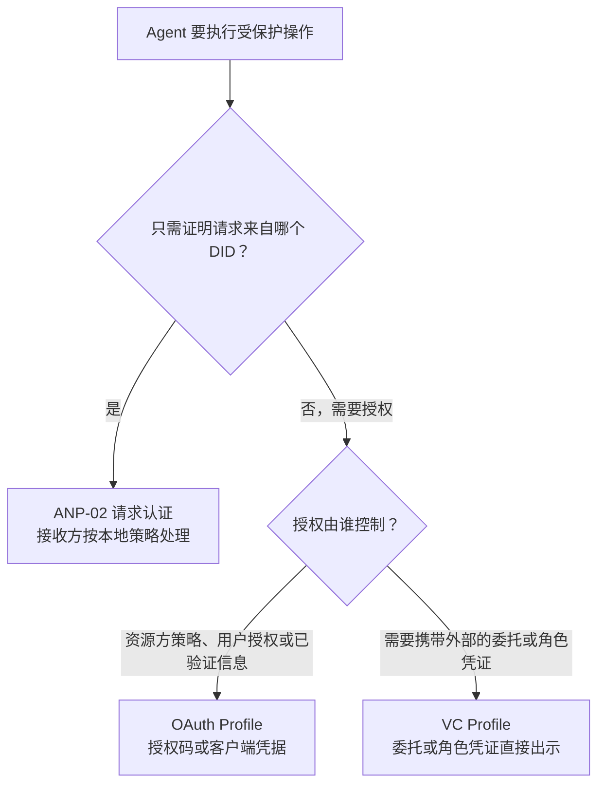
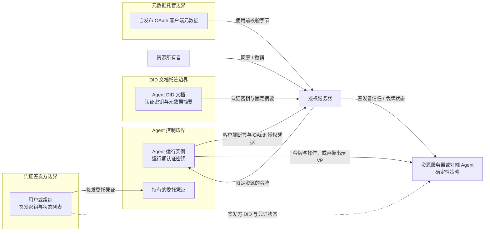
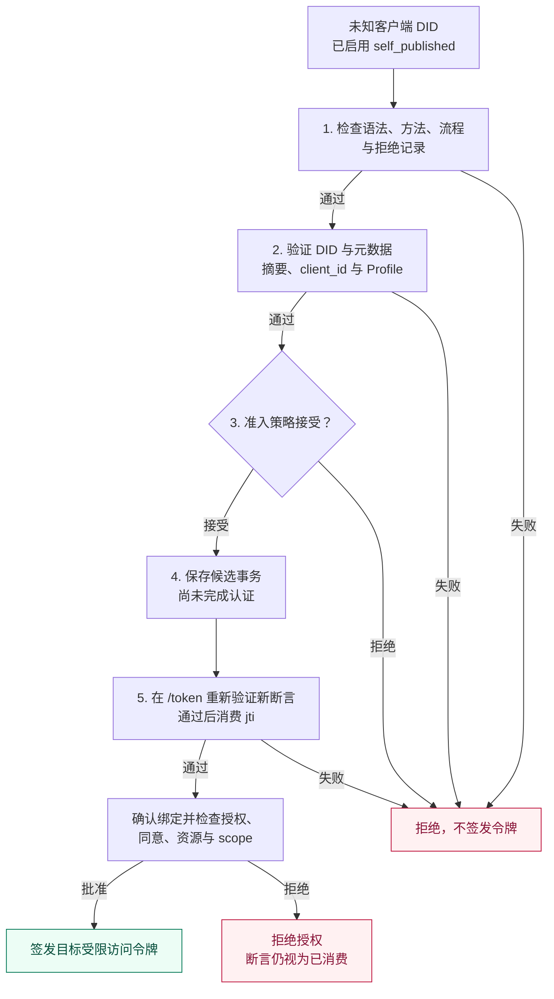
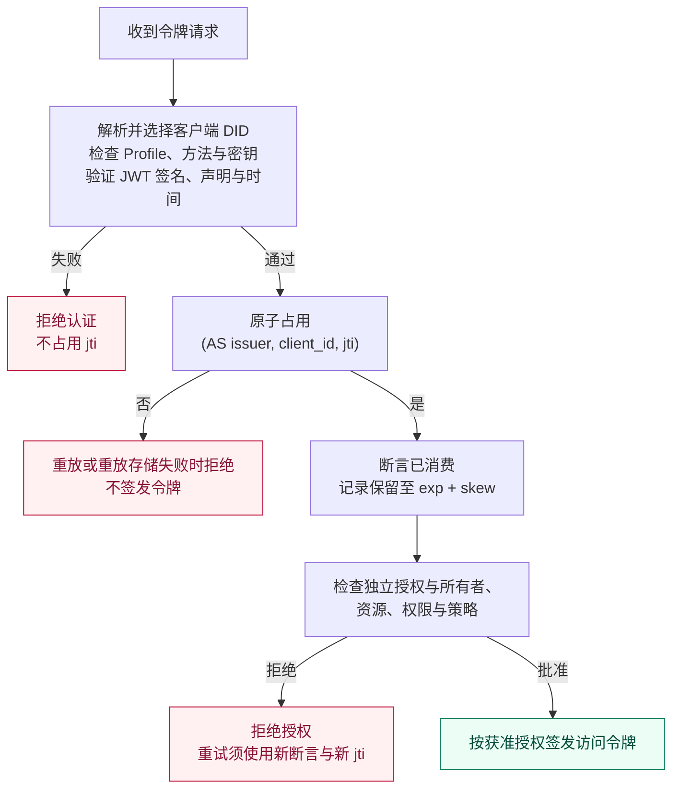
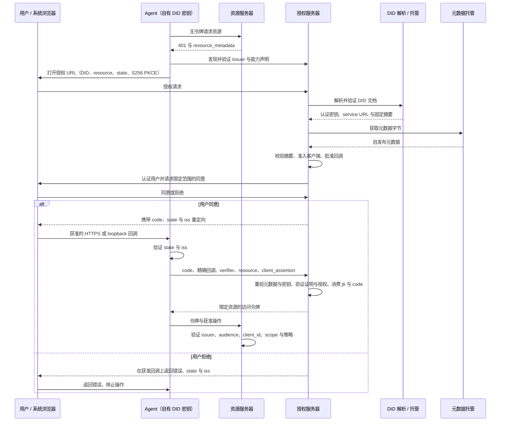
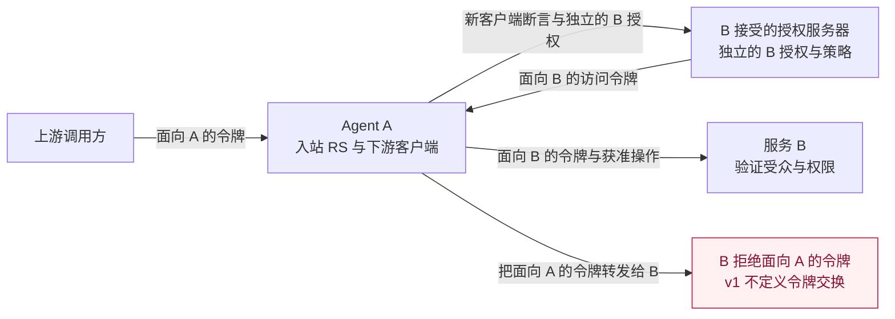
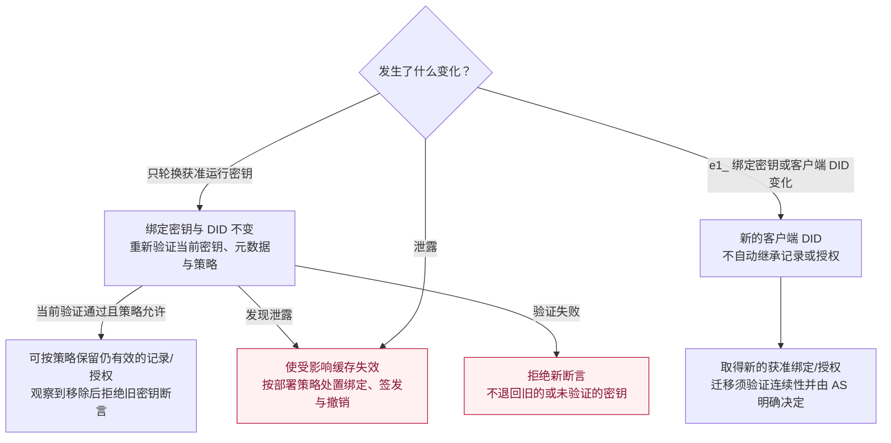
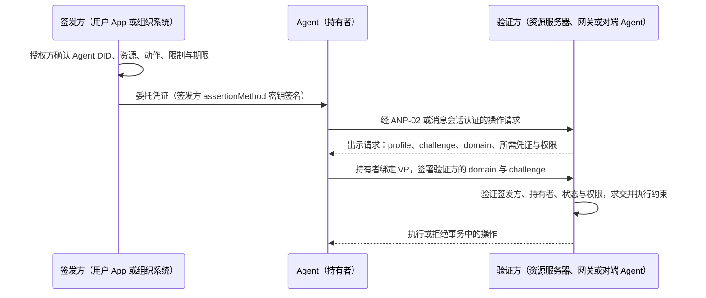
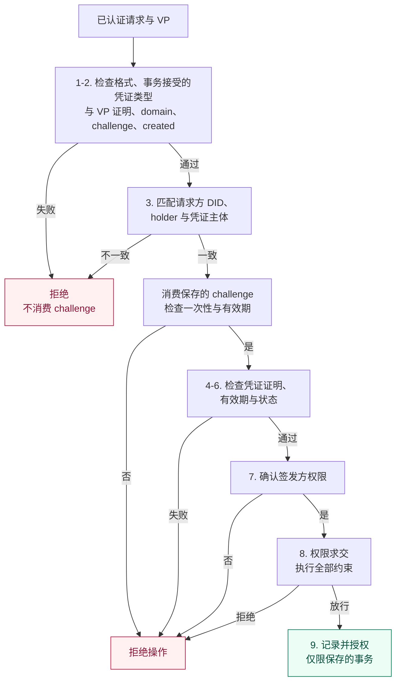
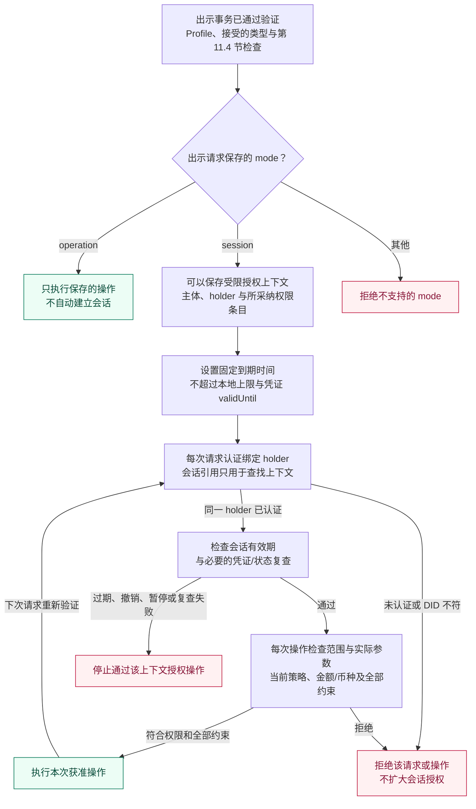

# ANP 基于 DID 的授权协议

- 文档编号：ANP-05
- 状态：草案 / 未发布
- 版本：0.6
- 规范集：ANP vNext；不属于 ANP 1.2 发布范围
- 草案 Profile 标识：OAuth Profile `anp.authorization.oauth2.did.v1-draft4`；VC Profile `anp.authorization.vc.v1-draft2`
- 语言：中文
- 英文镜像：[ANP DID-Based Authorization Protocol](../05-anp-did-authorization-protocol-specification.md)

<a id="scope"></a>
## 1. 范围、授权问题与路线图

ANP-05 定义基于 DID 的智能体授权方向，由两种互补机制组成：**OAuth Profile**，由资源方信任的授权服务器签发访问令牌；**VC Profile**，由拥有授权依据的用户或组织签发 W3C 可验证凭证（Verifiable Credential，VC），Agent 持有并出示。两者都用 DID 标识授权方和被授权的 Agent。**第一版（v1）是 DID–OAuth 客户端身份与基础委托访问 Profile，加上直接出示的单级 VC 委托凭证与组织角色凭证，不是完整的智能体委托体系。** 当前文档是其尚未发布的 v0.6 草案。本文的“v1”指首个版本的能力范围，不代表 v1 已发布，也不代表路线图中的后续能力已经实现。

在 OAuth Profile 中，Agent 用自己的 DID 认证密钥证明 OAuth 客户端身份；资源所有者批准权限，授权服务器（AS）签发受限令牌，资源服务器（RS）执行访问控制。这条路径不要求 VC、VP、OIDC 登录桥接或区块链。在 VC Profile 中，有权主体向 Agent 签发凭证，Agent 通过与持有者绑定的可验证出示（Verifiable Presentation，VP）向验证方出示；验证方独立验证签发方、持有者、凭证状态、权限、约束与本地信任策略，然后执行或拒绝请求的操作。

OAuth Profile 的规范性基线为 **OAuth 2.0 与已发布扩展**，包括 RFC 6749、RFC 9700。OAuth 2.1 draft-16 与 JWT 客户端认证更新 draft-11 只作为资料性设计参考，不是已发布 RFC 依赖。VC Profile 的规范性基线为 W3C VC 数据模型 2.0、VC Data Integrity 1.0 及其 EdDSA 密码套件、Bitstring Status List 1.0。大写 MUST（必须）、MUST NOT（不得）、SHOULD（应当）、SHOULD NOT（不应）、MAY（可以）使用 BCP 14 定义。下文的收紧规则是本 Profile 的要求，不是对所引用规范的修改。

**ANP-05 v1 定义两条相互独立的授权路径：基于 DID 客户端身份的 OAuth 资源访问授权，以及基于持有者绑定 VC 的可携带委托与组织角色凭证出示。v1 不定义 VC/VP 到 OAuth Access Token 的转换。本版本不定义独立的资质或属性凭证 Profile。**

文档结构：第 1 节说明要解决的授权问题与路线图；第 2 节说明与 ANP-02 的关系，以及何时使用 OAuth、何时使用 VC；第 3–10 节定义 OAuth Profile；第 11 节定义 VC Profile；第 12–14 节是两者共同的错误处理、安全与一致性要求。

<a id="authorization-problem"></a>
### 1.1 智能体授权真正要解决的问题（资料性）

核心不只是“哪个 Agent 持有这把密钥”，而是**“谁把什么资源上的哪些操作授权给了哪个 Agent，受到哪些限制，以及如何终止授权”**。本方向围绕五项需求展开：

| 需求 | 必须解决的问题 | v1 边界 |
| --- | --- | --- |
| 人把权限委托给智能体 | 记录授权人、被委托 Agent、资源、操作、期限与撤回；自然语言任务本身不是资源授权。 | OAuth：授权码流程取得用户同意或使用已有有效授权；区分用户与客户端主体，执行 scope、期限和撤销。VC：用户或组织签发单级委托凭证（第 11 节），作为可携带的委托书：签名可由任何验证方独立检查，但接受授权仍要求实时的状态检查；验证方仍独立决定权限。 |
| 组织授权智能体代表组织行事 | 公司把某个 Agent 任命为 HR Agent 或采购 Agent，由它代表公司对接事先未知的招聘平台、供应商或对端 Agent；对方需要确认这个 Agent 确实代表该公司、能做哪些事、上限是多少。 | VC：组织签发角色凭证（第 11.2 节），按业务动作而不是按资源地址列出职能与约束；对方确认签发方就是该组织，并把动作对应到自己的操作后决定是否接受。不定义跨对方的累计预算，也不自动授权访问第三方的个人数据。 |
| 同一智能体代表用户访问多个服务 | 各服务独立管理资源、账户身份与策略，某处的权限和同意不能通用于其他服务。 | OAuth：同一 Agent DID 分别对各资源及其认可的 AS 执行授权流程，保存独立授权和目标受限令牌。VC：一份委托凭证可以列出多个服务的资源，每个验证方只采用与自己相关的条目，并独立确认签发方对该资源有权。不定义一次全网同意或跨 AS 账户等价。 |
| 多级转委托 | A 委托 B、B 委托 C 时不得扩权，必须保留用户/执行者归因，并处理撤销传播与共享限制。 | 不定义该流程。VC Profile 只接受由验证方独立认可的授权主体直接签发给 Agent 的凭证；签发资格不能从签发方自己持有的委托凭证、角色凭证或访问令牌推导，因此持有他人委托的 Agent 再签发的凭证会被拒绝。不得把转发令牌、凭证或私钥当作隐式转委托。 |
| 高风险操作逐笔批准 | 把人的批准绑定到确定的收款方、金额/币种、披露或删除对象、有效期及唯一操作标识。 | 不定义通用逐笔批准凭据。委托凭证表达的是事先划定的授权范围，也不是逐笔批准。服务要求独立批准时，必须验证自身明确的操作批准机制，否则阻止操作。登录、宽泛 scope、DID 签名或 DPoP 本身不是该批准。 |

基础同意记录和 VC 委托凭证都已把受限访问权限委托给 Agent，因此不能说 v1 完全没有“人→Agent”授权。VC 委托凭证提供了可移植的委托书，但只覆盖单级委托；v1 尚未定义的是**委托链和标准化逐笔批准**。用户指令可以指导执行，但不能创造用户或 Agent 原本没有的资源权限。

<a id="technical-choices"></a>
### 1.2 技术选择与实现代价（资料性）

**复用 OAuth 管理授权生命周期。** RFC 6749 已区分资源所有者、客户端、AS、RS，并提供同意/授权、访问令牌及刷新流程；RFC 7523 第 2.2 节提供客户端断言传输；RFC 7636、RFC 8707、RFC 7009、RFC 7662 分别提供授权码保护、目标资源限制、撤销及状态检查。ANP 因而可集中定义可复用的 Agent 身份与缺少的智能体委托语义，不必重新建立另一套授权/令牌生态。OAuth 不是全部答案：任务总预算、权限衰减及用户对具体业务动作的批准，并不会因采用 OAuth 自动获得。

**DID 标识主体，不授予权限。** 同一经过方法验证的 DID 及认证密钥关系可以用于普通 ANP 认证、通信和 OAuth 访问。原生 did:web 仍以 DNS/HTTPS/托管为信任基础，不会因为采用本 Profile 就获得指纹绑定身份或抵抗自身 DID 文档托管方的保证。路径型 did:wba e1_ 增加绑定密钥指纹与可验证文档证明。这些性质均以正确的方法验证和密钥保管为前提；两种方法都不证明软件完整性或用户同意。这里的价值是共同的身份/生命周期模型，不是宣称只有 DID 才能提供可移植标识。

**需要明确的 AS 适配。** 不假设现成 OAuth AS 可以原样接受本流程。适配模块需要接受 DID 客户端标识、解析方法/密钥策略、发现并验证自发布客户端元数据、执行准入并声明 ANP 能力。既有 OAuth 授权/令牌引擎及 RS 验证在能力满足时可复用；架构不要求重写整个服务器，但也不宣称零改造兼容。客户端需要 DID 密钥调用、元数据发布、发现及标准 OAuth 流程支持。私钥留在 Agent 或它明确批准的签署方。

**用 VC 承载来自资源方之外的授权依据。** 许多智能体授权的依据并不在资源方手里：公司任命某个 Agent 为采购代表，用户给 Agent 一份可以交给多个商家的委托书，或者某机构证明 Agent 属于哪个组织、具备什么资质。OAuth 的同意记录保存在各 AS 内部，无法带到另一个服务，也无法由没有 AS 的对端验证。W3C VC 2.0 让授权方用自己的 DID 签署声明，由 Agent 持有，并出示给任何信任该签发方的验证方；验证只需解析签发方与持有者的 DID 并查询状态列表，验证方不必与签发方预先对接。ANP 已在 did:wba 文档证明和消息绑定中使用 Data Integrity 的 eddsa-jcs-2022，VC Profile 复用同一证明机制，不另外引入签名栈。VC 也有代价：撤销依赖状态列表，存在缓存延迟；验证方必须自己维护“信任哪些签发方做哪类声明”的策略；凭证一旦出示，其内容就被验证方看到。

**VC 与 OAuth 分工，不互相替代。** v1 中二者是独立的授权路径。OAuth 用于资源方通过 OAuth 授权记录与访问令牌管理的授权；本版 VC Profile 用于携带来自资源方之外的委托或组织角色凭证，并由其他方独立验证；资质或属性凭证只能按另行约定的规则作为验证方明确要求的附加证明。OAuth 的授权决定也可以依据角色、资质、组织身份或其他已验证信息。后续扩展可以定义外部凭证如何成为 OAuth 授权决定的输入；v1 不定义 VC 到访问令牌的换发。何时选择哪一种，见第 2.2 节。后续阶段提及的标准是评估方向，不是本版一致性要求。

<a id="v1-scope"></a>
### 1.3 v1 交付什么

v1 的交付目标是**DID 客户端身份加上可使用、可审计的基础用户委托**：DID 作为 client_id、具备完整性绑定的自发布元数据、无需逐 AS 预注册且受策略控制的首次准入、RFC 7523 客户端认证、适用于合格机密部署的客户端凭据、面向托管 HTTPS 与本机 loopback 客户端的 S256 PKCE 授权码、目标限定令牌、可选刷新与生命周期执行。在 OAuth Profile 中声明支持用户委托的部署必须（MUST）实现授权码路径；只实现客户端凭据的部署不得（MUST NOT）宣称具备 OAuth 用户委托能力。只通过 VC Profile 接受委托的验证方不受此项约束。

用户委托授权中，AS 必须（MUST）记录其 issuer/租户上下文内已认证的资源所有者标识、Agent DID、目标资源、获准 scope、批准来源及时间、适用期限/撤销策略，以及稳定的内部授权记录标识。只有在文档化策略认可时，已有同意或管理员授权才可作为批准来源。这是 OAuth 授权记录要求；可跨系统携带的委托书由 VC Profile 定义。新增权限需要新的批准决定；用户凭据与 Agent 认证密钥保持分离。

VC Profile 是可选能力，交付：ANP 委托凭证与组织角色凭证两种类型、持有者绑定的出示、签发方与持有者验证、凭证状态检查、权限与约束求值，以及向资源服务器或对端 Agent 直接出示。声明支持 VC Profile 的实现必须（MUST）满足第 11 节中适用于其角色的要求；不支持 VC 的实现仍可完整符合 OAuth Profile。有效的委托凭证不替代验证方的授权决定。

**安全基线：**本 Profile 不得（MUST NOT）使用隐式授权、资源所有者密码凭据授权、URI 查询中的访问令牌或 PKCE plain。授权码必须采用 S256 PKCE、获准回调匹配（仅有下文明确限定的 loopback 端口例外），以及 issuer/会话验证。不得（MUST NOT）把路线图中的后续能力宣告为 v1 已支持能力。

<a id="roadmap"></a>
### 1.4 分阶段方案与验收路线（资料性）

以下是有先后依赖的能力阶段，不是交付日期承诺。后续阶段可以独立扩展发布，不改变 v1 的身份/授权分工。

| 阶段 | 方案方向 | 宣称能力前的验证证据 |
| --- | --- | --- |
| v1：身份与基础委托 | 实现第 1.3 节范围。同一 DID 分别向多个服务取得独立授权，保留用户/Agent 归因和明确撤销机制；授权依据来自资源方之外时，通过直接出示使用单级 VC 委托凭证或角色凭证。 | 原生首次接触；托管与 loopback 用户流程；两资源隔离；元数据篡改；密钥轮换；撤销；VC 直接出示的正反例；第 14 节客户端/AS 互操作证据。 |
| 下一阶段：精细权限与高风险批准 | 评估 RFC 9396 RAR 表达结构化资源/动作/限制；另行定义单次批准，可以是专用 VC 类型或其他凭据，绑定 Agent、资源、规范化后的精确动作摘要、关键参数、期限和唯一标识，由执行端原子检查并消费。 | 参数替换、重放、重复执行、过期与撤回均安全失败；重新登录、传输请求签名或宽泛的委托凭证不能代替逐笔批准。 |
| 再下一阶段：受控转委托 | 评估 VC 委托链（子凭证引用父凭证并收窄权限）以及 RFC 8693 Token Exchange 的执行者归因；定义允许的委托深度、子授权不超出父授权有效权限、受众/期限收窄、授权族撤销与审计。跨 AS 交换须明确建立信任及账户/权限对应。v1 不定义 VC 到 OAuth 令牌的换发或多级转委托。 | A→B→C 委托；扩权或执行者不符时拒绝；根授权撤回后阻止新子授权；记录已签令牌的失效延迟。不能只凭执行者历史声明授权。 |
| 配套演进：长期与无交互执行、隐私 | 评估 RFC 8628 支持远端/无界面授权，研究其他后端授权流程、经验证的 DID 迁移和共享预算/计数执行。评估 VC 选择性披露密码套件，以及面向人类钱包的 OpenID4VP/OpenID4VCI 绑定。为采购、HR 等常见业务职能评估可互操作的动作词表，由相应领域协议定义并治理。v1 loopback 覆盖浏览器位于 Agent 同一设备的情况，不覆盖全部无界面环境。 | 用户与设备/事务绑定、防钓鱼与轮询控制；用户授权过期不能改走客户端自身权限；多个子任务并发时仍正确执行共享限额；选择性披露不泄露未出示的权限条目。 |

计划统一描述授权人、目标 Agent、资源/动作、限制、适用的父授权、批准证据与撤销状态；具体线协议 Schema 和执行规则在后续扩展中制定。签名声明预算不等于实现全局计数器；令牌交换本身不等于已经实现撤销传播或权限衰减。

本草案发布不代表 SDK、AS 或产品已支持。OAuth Profile 的 v1-draft4 与 VC Profile 的 v1-draft2 都是实验性标识。0.6 修订移除 VC 到 OAuth 令牌的换发，并把 VC Profile 升为 v1-draft2；OAuth Profile v1-draft4 的线协议规则保持不变。0.5 修订新增 VC Profile；0.4 修订改变元数据完整性、本机回调和断言兼容规则。实现必须（MUST）精确匹配修订，迁移前重新验证受影响元数据及未完成事务；不得（MUST NOT）只改 Profile 字符串就重新解释已有授权或授权码。

<a id="anp-boundary"></a>
## 2. 与 ANP 的关系及机制选择

使用当前 [ANP-02 身份材料规则](../../chinese/02-ANP-基于DID的身份认证协议.md#identity-input)、[ANP-03 WBA 绑定](../../chinese/03-did-wba方法规范.md#wba-auth-binding)和 [ANP-02 原生 Web 绑定](../../chinese/02-ANP-基于DID的身份认证协议.md#web-binding)。本文件旁的历史 ANP-02 快照不是本草案的规范性基线。

ANP-02 定义 HTTP/JSON 请求认证。ANP-05 复用其 DID 验证与认证密钥授权模型，**不复用**其 HTTP 签名序列化、挑战或可选的令牌响应头。OAuth 令牌端点使用 `client_assertion` 和标准 OAuth JSON 令牌响应，不得（MUST NOT）要求再附加一份 ANP-02 HTTP 签名才能满足本 Profile。需要将 HTTP Message Signatures 作为另一种 OAuth 认证方式的部署，应另行定义明确的绑定。

ANP-02 的认证缓存令牌不会自动成为 ANP-05 的 OAuth 授权令牌，实现必须（MUST）分离二者的接受规则。本 Profile 不依赖消息、WNS、Device Manifest、E2EE 或人类在场确认界面；VC 直接出示可以由 ANP-02 认证的 HTTP 接口或已认证的消息会话承载，但不改变这些协议的规则。DID 的 `authentication` 关系允许某密钥进行身份认证，并不授予应用资源的访问权限。

### 2.1 如何选择 ANP-02、OAuth 或 VC（资料性）

| 需求 | 选择 | 凭据含义 |
| --- | --- | --- |
| 认证直接 API 请求或通信对端，由接收方执行已有本地策略 | ANP-02 | 可选令牌在该 API 策略下复用已认证上下文，不建立标准化用户委托授权。 |
| 代表用户取得受限权限，或使用 AS 管理的客户端授权、资源受众、同意、期限与撤销 | ANP-05 OAuth Profile | AS 为特定授权及资源签发 OAuth 访问令牌。 |
| 出示来自资源方之外的委托或组织任命，可按验证方要求附加另行约定的资质证明，由验证方直接验证和决定是否采纳 | ANP-05 VC Profile | 签发方签署的声明；验证方按自身策略决定是否采纳，凭证本身不是访问令牌。 |

服务可以在明确分离的路由或声明的策略下同时提供多种机制。使用 JWT、签名 JSON 或把对象称作“令牌”，不会使它们可互换。ANP-05 不要求先取得 ANP-02 令牌；普通认证消息也不强制采用 AS。RS 不得（MUST NOT）把原始 VC 或 VP 当作 Bearer 访问凭据接受。

<a id="mechanism-selection"></a>
### 2.2 OAuth 与 VC 的分工（资料性）

两者回答的是不同问题。**OAuth 回答“资源方现在是否允许这个客户端对这个资源执行这个操作？”**：资源方信任的 AS 根据本地策略、用户授权、角色、资质、组织身份或其他已验证信息作出决定，再签发目标受限的访问令牌。**VC 回答“哪个签发方对这个 Agent 作出了什么可验证声明？”**：Agent 可以携带来自外部签发方的声明交给不同第三方，各验证方自行决定是否信任签发方及是否允许该操作。资质与角色也可成为 OAuth 决策输入；是否需要可携带、可独立验证的外部声明，是使用 VC 的关键。

| 维度 | OAuth 访问令牌 | VC 委托凭证或组织角色凭证 |
| --- | --- | --- |
| 签发方 | 资源方信任的 AS | 授权依据的来源：用户、组织或资质机构 |
| 授权决定 | AS 在签发令牌前做出，RS 执行 | 每个验证方在凭证直接出示时做出 |
| 适用范围 | 单一资源；本 Profile 每个令牌只绑定一个 `resource` | 凭证列出的范围，可以跨多个服务；各验证方只采用与自己相关的条目 |
| 验证依赖 | 可信 AS 的签名密钥或 introspection | 签发方 DID、持有者 DID 与状态列表；验证方不必与签发方预先对接 |
| 有效期与撤销 | 短期令牌；AS 可以集中停止签发和刷新，但已签发的令牌在过期或 RS 得知撤销之前仍可能被使用 | 有效期通常更长；通过状态列表撤销，延迟取决于状态列表的发布与缓存 |
| 需要的交互 | 用户委托时在 AS 登录并同意；客户端与 AS 往返 | 签发时由授权方确认一次；出示时 Agent 与验证方交换 challenge 和持有者绑定 VP，并检查 DID、状态与本地策略 |
| 隐私 | 令牌内容对客户端通常不透明；AS 掌握每次授权 | 出示的凭证内容对验证方可见；签发方不参与出示，但状态列表查询会向其托管方暴露验证方的网络地址 |

**适合使用 OAuth 的情况：**

- 资源由某个服务托管，并且该服务有自己的用户账户体系。例如 Agent 读取用户在文档服务里的文件、写入用户日历：用户在该服务登录并同意，服务掌握完整的授权记录。
- Agent 以自身名义调用服务（机器对机器），权限由服务方配置，使用客户端凭据。
- 资源方需要集中管理撤销、短期令牌、按资源隔离或增量授权。
- 资源方已有 OAuth 基础设施，希望 RS 只验证令牌、不改动。

**适合使用 VC 的情况：**

- 授权依据来自资源方之外。例如企业授权采购 Agent 以公司名义向供应商下单，额度与期限由企业决定；供应商需要确认的是“这家企业确实授权了这个 Agent”，而不是企业员工在供应商系统里登录同意。
- 组织任命 Agent 担任某个职能角色。例如公司的 HR Agent 代表公司在招聘平台发布职位、与候选人的 Agent 约面试，采购 Agent 代表公司向新供应商询价下单。对方往往事先不认识这个 Agent，公司也无法预先列出所有对方的地址；角色凭证按业务动作说明“这个 Agent 代表本公司做什么、上限多少”，见第 11.9 节。
- 同一份授权要交给多个互不对接的服务。例如用户签发一份委托凭证，允许 Agent 在几家酒店比价预订，每家酒店各自验证，用户不必逐一登录同意。
- 对方提供支持 VC 的接口，包括 Agent 间点对点协作；是否存在 OAuth AS 不改变该出示流程。此时，对端需要确认“这个 Agent 代表哪个用户或组织、被允许做什么”。
- 验证方明确要求在授权凭证之外附加组织成员身份、行业资质、实名核验结果或 Agent 运营方等属性证明。本版只定义委托凭证与组织角色凭证两种授权类型；附加属性凭证的类型、主体绑定、签发方信任与采纳规则须另行约定，并按第 11.3 节随授权凭证出示。本版不定义资质或属性凭证独立出示的完整绑定，属性凭证本身不授予访问权限。

**首版边界。** OAuth 与 VC 是独立的授权入口。提供 VC 接口的验证方直接检查出示与请求的操作；只接受 OAuth 的接口仍要求通过其支持的 OAuth 流程取得授权，不能用 VC 直接出示绕过。VC 与 OAuth 的组合仅作为第 16 节的后续扩展方向。



### 2.3 信任边界（资料性）



图中把 DID 文档托管单列为一个边界。对 did:wba e1_，文档完整性来自 Agent 控制的绑定密钥证明，托管方只能拒绝服务或重放旧文档；对原生 did:web，托管方被攻破就能替换密钥与摘要（见第 4.2 节）。签发方与资源所有者可以是同一个人，但签发密钥始终由签发方控制，不交给 Agent。

<a id="roles"></a>
## 3. 角色与标识

第 3–10 节定义 OAuth Profile。第 11 节的 VC Profile 定义独立的直接出示流程，其持有者与验证方不因采用 VC 而承担 OAuth 客户端或 AS 的职责。AS 可以作为普通业务组件实现 VC 验证方，但本版不赋予它 VC 换令牌的特殊角色。

| 术语 | 含义 |
| --- | --- |
| 客户端 / Agent 运行实例 | 申请并使用访问令牌的软件部署，其身份与资源所有者区分。 |
| 客户端 DID | 通过其认证密钥证明客户端身份的 DID，不一定是人类用户的 DID。 |
| `client_id` | 本 Profile 中作为 OAuth 客户端标识的裸 Agent DID。 |
| 资源所有者 | 有权授予资源访问权限的用户或组织。 |
| 授权服务器（AS） | 认证客户端，验证授权凭据与策略，并签发令牌。 |
| 资源服务器（RS） | 执行资源访问控制的目标 Agent、API 或网关。 |

客户端断言的 `sub` 标识客户端。访问令牌的 `sub` 标识授权所针对的主体：在用户委托访问时通常是资源所有者；在客户端自身访问时由 AS 确定。不得（MUST NOT）仅因认证成功，就把客户端断言的 `sub` 直接复制到用户委托令牌中。

客户端断言的 `aud` 标识 AS；访问令牌的 audience 标识目标 RS。同一 DID 可以被多个 AS 接受，但登记、授权和令牌仍分别受各 AS 管理。某 AS 签发的令牌不会因为客户端拥有 DID 就自动通用于所有服务。

AS 必须（MUST）在授权记录中区分资源所有者主体、已认证客户端/Agent、租户或信任域、授权与目标资源。客户端自身权限与用户委托权限不得（MUST NOT）混用。

客户端记录、授权及令牌缓存必须（MUST）按 (issuer, tenant-or-trust-domain, client_id) 隔离。预期客户端 DID 就是精确的 client_id，不能由调用方提供的其他值替代。RFC 9068 JWT 访问令牌已有必选的 client_id 声明，本 Profile 必须（MUST）令其值为该 DID；用户委托令牌的 sub 仍表示用户。依据本 Profile 返回给获准查询方的 RFC 7662 活动令牌结果，AS 必须（MUST）包含同义的 client_id。RFC 7662 本身将其定义为可选，本 Profile 对活动结果增加此要求，以免各自发明 Agent-DID 声明；非活动结果保持最小化，不披露它。其他可信的不透明令牌验证路径必须（MUST）向 RS 提供等价客户端身份上下文。

RS 只有在验证可信签发者或查询通道、令牌状态、目标受众与 scope 后才能使用 client_id。普通请求字段不是证据。这标识令牌原本签发给哪个 Agent，不证明当前 Bearer 令牌出示者仍控制该 Agent 密钥；发送者约束须单独验证。DID 本身不代表模型版本、软件完整性或人类所有者。

<a id="enrollment"></a>
## 4. 客户端登记与绑定

### 4.1 DID 作为客户端标识

声明本修订核心一致性的 AS 必须（MUST）实现 DID 直接作为客户端标识，以及下文的自发布元数据发现/准入流程。客户端标识为裸 DID，不含 DID URL 路径、查询或片段。DID 方法中以冒号分隔的路径属于 DID 本身，不是 DID URL 路径。例如，`did:wba:agents.example:agent-a:e1_RfdmtK_McXAgc6fbIC55GcOjXyXGPWixGhrDaiLsv28` 标识客户端，`did:wba:agents.example:agent-a:e1_RfdmtK_McXAgc6fbIC55GcOjXyXGPWixGhrDaiLsv28#auth-1` 标识密钥。

AS 可以（MAY）保留预注册的原生客户端，也可以（MAY）通过本地策略关闭开放的首次接触准入；必须（MUST）按第 5 节声明已启用的登记模式。仅开放预注册的部署不能宣称客户端无需预注册即可接入。准入决定可以（MAY）自动作出，不把逐客户端的人工管理批准作为核心前提。

请求 `client_id`、断言 `iss`、断言 `sub` 和原生元数据 `client_id` 必须（MUST）标识完全相同的裸 DID。`kid` 的 DID 部分必须（MUST）与其一致。一次正常表单/JSON 解码后精确比较；不得（MUST NOT）通过大小写折叠、递归百分号解码、前缀匹配或 WNS/别名替换，把不一致标识视为相同。

### 4.2 自发布 OAuth 客户端元数据

自发布客户端必须（MUST）在经过方法验证的 DID 文档中提供且只提供一个类型为 `ANPOAuthClientMetadata` 的 service。service `id` 必须（MUST）是该 DID 加非空片段；`serviceEndpoint` 必须（MUST）是含路径的单个绝对 HTTPS URL，不含 userinfo、查询或片段。重复 service ID 或多个匹配 service 均拒绝，其他 DID service 不受影响。此类型是 **ANP 定义的实验性 DID service 类型**，不是已有 W3C 类型。JSON-LD 部署需使用明确、固定的扩展 context；不得（MUST NOT）假设 DID Core context 已定义该词项。

service URL 指向 JSON OAuth 客户端元数据文档，**不是**授权服务器或令牌端点。只能从已验证 DID 取得该 URL，不能由调用方参数覆盖。HTTPS 获取成功必须（MUST）返回 HTTP 200 与 `application/json`；重定向、畸形或成员名重复的 JSON、私有材料及超限内容均拒绝。实现必须（MUST）支持至多 5 KiB 的文档，并设置有限的可配置大小上限、获取超时和第 13 节 SSRF 控制。获取公开元数据时不得携带凭据或 cookie。

所选 service 还必须（MUST）包含 anp_metadata_sha256，这是 ANP 定义的 64 位小写十六进制 SHA-256 摘要，覆盖完整元数据表示。对 HTTP 传输/内容解码后的 UTF-8 响应字节计算摘要，包括全部空白及末尾换行；不重新序列化 JSON、不规范化文本、不包含 HTTP 头。拒绝 BOM 或无效 UTF-8，在哈希/解析前限制解码后大小。控制方完成序列化后计算摘要，再通过 DID 方法认证的文档更新流程发布；对 e1_，该值位于绑定密钥证明覆盖的文档内。

在使用任何客户端名称、回调 URI 或授权元数据前，AS 必须（MUST）将计算值与当前经过方法验证的 DID 文档内摘要比较；缺失、格式错误或不匹配均拒绝。响应 Content-Digest 头或仅由元数据托管方给出的摘要不能替代它。这样无需新增凭据格式或在线元数据签署服务，即可绑定正文。任何元数据更新（包括纯显示变更）都须同步更新 DID 文档摘要；未完成事务是否仍能继续，按第 4.3 节判断。

以下字段在适用时复用 RFC 7591 的 OAuth 客户端元数据定义，但不要求 RFC 7591 注册端点：

| 字段 | 原生元数据规则 |
| --- | --- |
| `anp_profile` | 必选，精确等于当前草案 Profile 标识；ANP 定义的实验性区分字段。 |
| `client_id` | 必选，精确等于裸客户端 DID，**不是**元数据 URL。 |
| `client_name` | 必选非空显示名称；客户端自述，不是已验证组织名称。 |
| `token_endpoint_auth_method` | 必选，`private_key_jwt`。 |
| `grant_types` | 请求使用的、受支持核心授权类型的非空数组，必选：`client_credentials`、`authorization_code`、`refresh_token`。不是权限授予。 |
| `response_types` | 请求授权码时必选且为 `["code"]`，否则省略。 |
| `redirect_uris` | 授权码模式必选非空数组，使用获准 HTTPS 回调或按第 7.2.1 节明确声明的本机 loopback 条目；其他模式省略或为空。 |
| `anp_application_type` | ANP 定义的可选 `web`（默认）或 `native`；loopback 必须使用 `native`。表示应用部署形式，不代表机密客户端等级。 |
| `scope` | 可选，以空格分隔的期望能力；实际权限仍由 AS 与资源所有者独立决定。 |
| `token_endpoint_auth_signing_alg` | 可选的获准 JOSE 算法；与 DID 获准密钥及 AS 能力取交集，不能扩大任一方范围。 |
| `client_uri`、`logo_uri` | 可选显示元数据，另行执行获取/渲染防护。 |

原生元数据不得（MUST NOT）包含 `jwks`、`jwks_uri`、共享 secret、私钥或 bearer 凭据。客户端密钥唯一权威来源仍是 DID 的 `authentication` 关系。未知安全扩展不得覆盖这些规则。元数据 URL 只是获取位置，不得（MUST NOT）替代 DID 作为 `client_id`。

service 委托的是交付职责，不是独立改写元数据的权限。独立元数据托管方无法在没有相应、符合方法验证的 DID 文档更新时修改可被接受的字节。e1_ 更新包括有效的绑定密钥文档证明；而 did:web 的 DID 文档托管方被控制时，攻击者仍可替换密钥与摘要。摘要固定不能防止托管方拒绝服务，也不能在 DID 方法无法证明最新状态时阻止旧的有效 DID 文档及匹配元数据被重放；它不等于抗回滚或独立组织背书。须执行当前方法状态验证、有界缓存及本地停用策略，并将 DID 与客户端自述名称一起展示。

### 4.3 无需逐 AS 预注册的首次接触准入

启用 `self_published` 时，未知裸 DID 是待发现候选者，不能仅因数据库没有记录就立即返回 `invalid_client`。不新增授权类型、注册端点、client secret，也不要求 VC 或 OIDC 登录桥接。

AS 必须（MUST）按以下顺序执行，并限制工作量：

1. 联网前检查请求 `client_id` 语法、支持的方法、所选流程和本地拒绝/停用记录。已禁用客户端不得（MUST NOT）通过缓存淘汰后“重新变成未知”绕过封禁。
2. 按第 6.2 节解析和验证 DID，选择元数据 service，获取并验证第 4.2 节文档及 DID 内固定的摘要，精确匹配 `client_id` 与 `anp_profile`。检查流程一致性：refresh 必须同时具备授权码流程；不允许隐式/密码授权或 `none` 客户端认证。
3. 对 DID/方法、元数据来源、请求的授权类型、客户端部署、回调及目标资源执行明确的本地准入策略。策略可以（MAY）自动接纳陌生客户端，也可以拒绝。准入决定不授予资源权限；请求元数据不是 AS 策略。
4. 建立有界、按 issuer/租户隔离的**候选事务记录**，包含 DID、service ID/URL、接受的元数据快照及其 DID 内固定摘要、认证策略、所选资源和策略决定。不要求预分配永久客户端数据库记录。发现/缓存条目必须（MUST）与已经认证的活动客户端区分。
5. 在 `/token` 验证新的第 6 节断言，原子消费 `jti`，将证明绑定到候选 DID 和接受的元数据。然后确认客户端绑定，并独立判断授权凭据、适用的用户同意、资源与 scope，最后才可签发访问令牌。

授权码流程中，在 `/authorize` 展示同意界面或签发 code 前完成发现与回调批准。遵循 OAuth 原有分工：客户端控制证明在兑换 code 时验证，不新增前端签名步骤。AS 必须（MUST）把所签发 code 和用户授权绑定到候选 DID、接受的元数据快照、精确回调、issuer、resource 与 S256 PKCE 事务。不得（MUST NOT）仅因读取元数据就声称 Agent 已证明私钥持有。兑换前必须（MUST）重新检查新鲜度、当前 DID 密钥授权、接受的元数据及本地策略。认证策略、元数据端点或回调/授权配置变化时，该未完成事务失效；必须重启，不能替换成新值。可按文档化、确定性的比较规则，把纯显示变更识别为等价。

客户端凭据流程可以在首次令牌请求中完成发现、准入和证明。访问仍须 AS 策略授权该客户端访问相应资源；自发布 `scope` 或有效 DID 签名不足以获得权限。刷新不能创建新授权，仍要求现有有效的 refresh-token/client/issuer 绑定。

因此，**无需逐 AS 预注册**是指不强制提前人工登记或调用注册接口；不是无需准入决定、本地状态、同意或无条件接受所有 DID。预注册客户端可以（MAY）使用已批准的带外元数据而不发布 service，但 AS 必须（MUST）保留该来源选择，不得（MUST NOT）静默改用新发现的元数据。

**首次接触准入概览（资料性）。**



### 4.4 客户端边界

公共客户端不会仅因持有密钥或使用 PKCE 就变成机密客户端。本 Profile 要求逐 Agent 的非对称认证绑定，不是在所有应用副本中嵌入共享 secret。具有自身获准 DID 密钥的本地 Agent 可以在仍被分类为公共客户端时，使用授权码及第 7.2.1 节 loopback 绑定。AS 必须（MUST）记录并评估实际客户端类型；客户端凭据仍要求合格的机密保管能力。托管 HTTPS 回调继续支持。无法使用同设备浏览器的远端/无界面客户端需要后续设备/后端授权扩展，不能用无限制回调例外替代。

<a id="discovery"></a>
## 5. AS 发现与能力声明

对于动态发现的 HTTP 资源，RS 必须（MUST）发布 RFC 9728 受保护资源元数据，包含 `resource` 及一个或多个 `authorization_servers`；客户端必须（MUST）实现该发现路径。`401` 挑战可携带 `resource_metadata`，否则按 RFC 9728 的 well-known 位置规则发现。选择 AS 前，客户端必须（MUST）依据目标 RS 和被接受的信任策略验证资源/元数据关联。封闭部署可以（MAY）使用可信带外配置，但仍须验证资源与 issuer 的关系。

客户端必须（MUST）从被接受的资源关系或可信配置中取得预期 issuer，实现 RFC 8414 发现，并精确匹配所得 AS 元数据中的 issuer。任意 DID 文档或 Agent Description 中的 URL 无权更改目标资源的 AS。

客户端记录、授权事务及令牌缓存必须（MUST）按 AS issuer 和租户/信任域隔离。issuer 改变后需要重新验证关系，并按要求完成注册/绑定批准；不得把旧 AS 的授权码、刷新令牌、secret 或客户端断言发给新 AS。只有新关系获准并重新生成受众绑定断言后，才可复用 DID/密钥。

实现本 Profile 的 AS 必须（MUST）发布 RFC 8414 元数据，包括 `issuer`、`token_endpoint`、包含 `private_key_jwt` 的 `token_endpoint_auth_methods_supported`、支持的签名算法及授权类型。支持授权码的 AS 还必须（MUST）发布授权端点、code 响应支持、`S256` PKCE 支持及 `authorization_response_iss_parameter_supported=true`，并实现 RFC 9207 响应签发者标识。

本草案定义 RFC 8414 可选扩展成员 `anp_did_oauth`。声明支持本 Profile 时必须提供该成员，其必选字段如下：

| 字段 | 类型与规则 |
| --- | --- |
| `profile` | 字符串，精确等于 `anp.authorization.oauth2.did.v1-draft4`。 |
| `did_methods_supported` | 非空方法标识数组，例如 `did:web`、`did:wba`；只列 AS 实际完成验证的方法。 |
| `client_id_modes_supported` | 精确等于 `["did"]`；本版只定义原生 DID 客户端标识。 |
| `client_enrollment_methods_supported` | 非空数组，列出已启用的原生 `self_published` 和/或 `pre_registered` 模式；必须实现自发布能力，本地策略可以限制准入。 |
| `redirect_uri_modes_supported` | 启用授权码时必选，非空数组列出已启用的 `https` 和/或 `loopback`；授权码实现须实现两者，本地准入可限制使用。仅客户端凭据部署省略。 |

`anp_did_oauth` 与草案 Profile 标识是 ANP 定义、尚未注册的实验性元数据，不是现有 IETF/IANA 功能。它们不创建新的令牌端点认证方法；认证方法仍为 `private_key_jwt`。没有精确的 Profile 匹配时，客户端不得（MUST NOT）假设对方支持 DID 处理，也不得静默退回另一身份或更弱认证。

客户端必须（MUST）在发起流程前固定 issuer、客户端 DID、Profile 修订及凭据策略。认证或准入失败时，不得（MUST NOT）自动更换客户端身份或降低认证强度以绕过拒绝。

以下元数据为示意，地址不代表已部署服务：

```json
{
  "issuer": "https://auth.example",
  "authorization_endpoint": "https://auth.example/authorize",
  "token_endpoint": "https://auth.example/token",
  "token_endpoint_auth_methods_supported": [
    "private_key_jwt"
  ],
  "token_endpoint_auth_signing_alg_values_supported": [
    "RS256",
    "Ed25519",
    "EdDSA"
  ],
  "grant_types_supported": [
    "client_credentials",
    "authorization_code",
    "refresh_token"
  ],
  "response_types_supported": [
    "code"
  ],
  "code_challenge_methods_supported": [
    "S256"
  ],
  "authorization_response_iss_parameter_supported": true,
  "anp_did_oauth": {
    "profile": "anp.authorization.oauth2.did.v1-draft4",
    "did_methods_supported": [
      "did:web",
      "did:wba"
    ],
    "client_id_modes_supported": [
      "did"
    ],
    "client_enrollment_methods_supported": [
      "self_published",
      "pre_registered"
    ],
    "redirect_uri_modes_supported": [
      "https",
      "loopback"
    ]
  }
}
```


[ANP-07 智能体描述](../../chinese/07-ANP-智能体描述协议规范.md)可以（MAY）链接到接口文档，说明其 OAuth 要求及 RFC 8414/RFC 9728 元数据位置。本版本不重定义 ANP-07 的 `securityDefinitions`，不要求在其中增加新的 `scheme` 值，也不在公开描述中放置凭据。描述与发现不是授权。

<a id="client-assertion"></a>
## 6. 基于 DID 的 JWT 客户端认证

### 6.1 传输与 JWT 字段

客户端必须（MUST）向已验证的令牌端点发送 HTTPS POST，使用 `application/x-www-form-urlencoded`，且必选参数 `grant_type`、`client_id`、`client_assertion_type`、`client_assertion` 各出现一次。断言类型必须（MUST）为 `urn:ietf:params:oauth:client-assertion-type:jwt-bearer`。授权类型专用参数遵循第 7 节。安全相关表单参数重复时必须（MUST）拒绝，不得采用取首值或末值的方式消除歧义。

`client_assertion` 必须（MUST）是一个紧凑 JWS，包含内置、经过 base64url 编码的 JWT 载荷。本 Profile 不允许 JWE、分离式载荷、未编码载荷、多份断言或同时使用多种客户端认证方式。不得（MUST NOT）将断言或私钥放入 URL、日志或 Agent Description。

JWS 受保护头字段如下：alg、kid 必选，typ 推荐提供：

| 字段 | 要求 |
| --- | --- |
| `typ` | 推荐 `client-authentication+jwt`；按下文兼容规则，也可使用旧 `anp-did-client-auth+jwt`、`JWT` 或省略。 |
| `alg` | 获准且与解析所得密钥兼容的非对称 JOSE 签名算法。 |
| `kid` | 由预期客户端 DID 加非空片段组成的完整 DID URL，指向认证验证方法。本 Profile 的密钥引用不允许 DID URL 路径或查询。 |

客户端应当（SHOULD）使用资料性 JWT 客户端认证更新 draft-11 推荐的 client-authentication+jwt。其他验证全部通过时，AS 必须（MUST）接受该值、旧 anp-did-client-auth+jwt、通用 JWT 或未提供 typ 的断言。存在 typ 时必须是此允许列表内的字符串；访问令牌类型或其他不支持角色均拒绝。AS 不得（MUST NOT）仅靠 typ 选择身份、issuer、授权、权限或验证策略。专用 client_assertion 处理、精确 DID/issuer 绑定、当前密钥授权与防重放仍为必选。此兼容规则不把访问令牌或元数据文档变成客户端断言。本 Profile 采用该类型名时仍明确其来源草案尚在制定。

载荷必须（MUST）包含：

| 声明 | 要求 |
| --- | --- |
| `iss` | 精确等于请求的 `client_id`；由客户端签发此断言。 |
| `sub` | 精确等于请求的 `client_id`；这是客户端认证，不是用户委托。 |
| `aud` | 已验证 AS 的 `issuer` 是唯一受众：可为精确匹配的 JSON 字符串，或只含该字符串的单元素数组。拒绝空/多元素数组、非字符串及不同于 issuer 的令牌端点 URL。 |
| `iat` | 以秒为单位的整数 NumericDate，表示签署时间。 |
| `exp` | 整数 NumericDate；满足 `0 < exp - iat <= 300`。 |
| `jti` | 新生成的非空标识，包含至少 128 位密码学随机性；不得在请求、密钥或重试之间复用。 |

`nbf` 可选；存在时必须（MUST）为不大于 `exp` 的整数 NumericDate，并必须（MUST）执行其时间限制。AS 允许的时钟偏差不得（MUST NOT）超过 60 秒。设 AS 当前时间为 `now`、允许偏差为 `s`，接受条件为 `iat <= now + s`、`now < exp + s`，且存在 `nbf` 时满足 `nbf <= now + s`。ISO 日期字符串不是 NumericDate。

AS 必须（MUST）拒绝受保护头或载荷中的重复 JSON 成员名、未知关键 JWS 参数及畸形编码。额外非关键声明不得（MUST NOT）创建权限，或覆盖已批准客户端记录、资源所有者、请求参数和授权凭据。本版不使用 JWT 授权模式的 `assertion` 参数，也不使用 `grant_type=urn:ietf:params:oauth:grant-type:jwt-bearer`。

### 6.2 DID 解析与密钥授权

AS 必须（MUST）按第 4 节确定预期 DID，在信任文档前完成对应方法的验证。下列已定义的方法绑定中，必须（MUST）至少实现并声明一种：

- `did:web`：应用原生方法解析、HTTPS 验证、文档 `id` 精确检查及 ANP-02 Web 身份材料规则。不得（MUST NOT）把 WBA 指纹和 WBA 文档证明要求施加给原生 Web DID。
- `did:wba`：应用 ANP-03 中选定方法 Profile、文档完整性/绑定校验、有效状态检查及认证密钥策略。有效 JWT 不能代替 WBA E1 的 proof 与指纹验证。

本 v1 的 did:wba 绑定覆盖 e1_ 路径 Profile 及 ANP-03 的裸域名形式，不包含独立的 k1_ 兼容扩展；遇到 k1_ DID 时拒绝，不能因声明 did:wba 就暗示支持所有变体。增加该扩展须同时明确其指纹/文档证明策略及正确的 ES256K/secp256k1 JOSE 验证，不能改用 ES256/P-256 或仅换算法名称；需要独立评审的方法绑定及验证证据。

其他 DID 方法在声明前，需要有文档化适配器，明确固定的方法规范版本、状态规则、验证方法、JOSE 转换与验证证据。兼容 DID Core 不代表自动支持；本草案不自动启用 `did:webvh` 或 BID。

解析所得文档 `id` 必须（MUST）等于预期 DID，`kid` 的 DID 部分也必须（MUST）与其一致。所选验证方法必须（MUST）能从已验证文档中解析取得，并被其 `authentication` 关系授权，无论是内嵌于该关系还是由该关系引用。仅出现在 `verificationMethod`、`assertionMethod` 或 `keyAgreement` 中不够。文档中的相对引用必须（MUST）先按 DID Core 规则解析，再精确比较。跨 DID 认证密钥不属于本初始 Profile，必须（MUST）拒绝。

验证者必须（MUST）从上述已验证关系取得公钥，不得（MUST NOT）信任客户端通过 JWS `jwk`、`jku`、`x5u` 或 `x5c` 提供的替代密钥；本 Profile 不允许这些头字段。方法或验证套件需要的 JSON-LD context 必须（MUST）固定或纳入允许列表，不得无限制地联网获取。

### 6.3 算法与序列化

AS 必须（MUST）实现 RS256 验证：RFC 7523 第 5 节明确将其列为必须实现算法。本 Profile 另要求实现 Ed25519 验证。这不要求只有 Ed25519 密钥的客户端增加 RSA 密钥，也不要求每个 DID 都使用 RSA。AS 只声明已经实现且启用的算法；实际使用范围由客户端获准密钥、元数据与 AS 策略取交集。

Ed25519 是 RFC 9864 定义的完整指定 JOSE 算法标识，新部署应当（SHOULD）优先使用。为兼容旧库，AS 应当（SHOULD）提供可明确配置、仅接受 Ed25519 密钥的 EdDSA 验证选项，并只在启用时声明。RFC 9864 将多义 EdDSA 标识列为 deprecated，而非 prohibited；实现可依文档化策略关闭兼容项，不把它作为所有新部署的强制算法。不得改写已签名 alg 头，也不得把 Ed448 密钥当成 Ed25519。没有共同启用算法时客户端安全失败，而非静默替换。ES256 等其他算法须明确实现、密钥表示与策略支持。拒绝 none、HS*、算法与密钥不匹配以及不支持曲线。

DID `publicKeyJwk` 材料必须（MUST）验证为所需类型和长度的公钥；RSA 密钥必须（MUST）至少为 2048 位。使用 Ed25519 `Multikey` 前必须（MUST）解码并验证其 multicodec/密钥类型与长度，不得（MUST NOT）把任意 multibase 字节当作 Ed25519 公钥。支持 WBA E1 的 AS 必须（MUST）支持该绑定要求的 Ed25519 密钥表示。

JWT 签名覆盖 JWS signing input，不是 ANP-02 HTTP 签名基串，也不是经 JCS 规范化重建的 JSON。密钥表示转换必须（MUST）保持公钥不变；签名字节编码必须（MUST）遵循所选 JOSE 算法。

### 6.4 验证与防重放

接受认证前，AS 必须（MUST）完成有界解析、获准记录查询或第 4.3 节候选发现/准入、预期 DID 选择、Profile 与算法检查、方法/文档/密钥验证、JWT 签名验证、声明精确匹配及时间校验。启用自发布时，不得仅因未知 DID 没有预存记录就拒绝；它仍须通过完整准入流程。然后必须（MUST）原子性占用 `(AS issuer, client_id, jti)`，保留至 `exp + allowed skew`。即使换用其他 `kid`、访问不同服务器副本或并发请求，复用也必须（MUST）失败。无效签名不得（MUST NOT）污染重放记录。防重放存储不可用时，AS 必须（MUST）拒绝放行。

成功验证的断言必须（MUST）在处理授权或签发令牌前视为已消费；后续授权错误不能使它重新可用。重试需要重新签署断言并生成新 `jti`，同时仍遵守授权凭据自身的一次性规则。

最后，AS 必须（MUST）独立验证授权凭据、适用的资源所有者、允许资源、申请权限与当前策略。有效客户端断言不足以签发令牌。它没有签署 OAuth 表单正文；传输由 HTTPS 保护，凭据绑定和参数验证由 OAuth 执行。它不是交易签名或人类同意证明。

**客户端断言验证与防重放（资料性）。**



<a id="authorization-flows"></a>
## 7. 授权流程

实现必须（MUST）至少支持以下一种流程，且仅声明实际支持的流程。本版每份授权使用一个目标资源。客户端必须（MUST）在授权请求及本版全部令牌请求中，通过 RFC 8707 提供一个不含片段的绝对 HTTPS `resource` URI，且只提供一次，包括授权码兑换与刷新。显式重复提供目标是 ANP Profile 的要求。AS 必须（MUST）将其与允许资源核对，并把授权和令牌绑定到该目标。scope 名称的语义由 AS/RS 定义；DID 不是 scope。

**每个令牌一个目标是隔离规则，不是每个 Agent 只能访问一个服务。** 同一 DID 的 Agent 可以分别持有日历服务和文档服务的授权与令牌。缓存须区分 issuer、租户、资源所有者、客户端 DID、resource、scope 及适用发送者密钥，不能只按 Agent DID 选择令牌。各 AS 认证自己的用户账户并独立批准访问；综合任务不等于综合令牌，不同 AS 中同名用户或 DID 不能静默合并账户。兑换/刷新全程提交 resource 是为避免目标歧义；不支持 RFC 8707 的 AS 因而不符合原生路径，这是明确的取舍。多资源指示符或跨 AS 授权须另行定义，不是本版要求。

### 7.1 客户端凭据

仅在机密客户端以自身名义访问，或存在 AS 认可的资源所有者预先授权安排时使用 `grant_type=client_credentials`。不得（MUST NOT）仅凭 Agent DID 获得任意用户的权限。

AS 必须（MUST）完成第 6 节验证，检查允许该客户端访问目标资源与 scope 的当前策略/授权，并且只授予允许的访问权限。本 Profile 不为客户端凭据模式签发刷新令牌；客户端需要新令牌时重新认证。

### 7.2 用户委托的授权码与 PKCE

客户端访问 AS 授权端点，携带 `response_type=code`、已接受的 `client_id`、获准 `redirect_uri`、目标 `resource`、申请的 `scope`、新生成且与会话绑定的 `state`，以及 `code_challenge_method=S256` 的 PKCE。AS 使用自身支持的方式认证资源所有者，获取同意或应用已有有效授权。DID 客户端认证不能认证该用户，也不能代替用户同意。

发起授权前，客户端必须（MUST）在同一事务记录中保存已验证 issuer、resource、客户端绑定、回调 URI、`state` 和 PKCE verifier。成功与错误回调都必须（MUST）先与该记录核对 `state` 和 RFC 9207 `iss`，然后才能提交授权码或接受错误。本 Profile 中，`iss` 缺失、重复或不一致必须（MUST）终止流程；只做正常响应解码后的精确匹配，不进行 URL 归一化。未验证响应字段不得（MUST NOT）选择另一 AS 或令牌端点。重定向 URI 必须（MUST）在签发 code 前依据已通过完整性验证的元数据快照或预注册获得批准；按第 7.2.1 节匹配，仅有该节规定的 loopback 端口例外，不允许通配符。

在令牌端点，客户端提交 `grant_type=authorization_code`、`code`、相同的 `redirect_uri`、`code_verifier` 以及一份新的第 6 节断言。必须（MUST）提交 `resource`，且必须（MUST）与授权的原始目标相同；本 Profile 拒绝省略或改变目标。AS 必须（MUST）验证一次性授权码的客户端、重定向、PKCE、目标资源与授权绑定。不得（MUST NOT）在输出授权中用客户端自身身份替代资源所有者。

### 7.2.1 托管与本机回调绑定

实现授权码流程的 AS 必须（MUST）实现 HTTPS 和 RFC 8252 loopback 匹配，并按第 5 节声明已启用模式。客户端开始前检查所选模式已启用；本地策略仍可独立于实现支持而拒绝某部署。

托管回调必须为不含片段及 userinfo 的绝对 HTTPS URI，并与获准回调精确匹配。本机 loopback 要求 anp_application_type=native，元数据中获准条目的 scheme 为 http，主机为字面量 127.0.0.1 或 [::1]，路径非空且精确。本初始绑定不允许 query、fragment、userinfo、localhost 名称、其他数字 IP 写法、主机通配符或路径通配符。元数据条目可省略端口或写一个具体合法端口，不使用 URI 模板。按 RFC 8252 第 7.3 节，授权请求与获准 loopback 条目比较时仅忽略端口；请求中的回调必须（MUST）显式携带 1 至 65535 的端口，匹配允许其中任意端口。IPv4 和 IPv6 是分别批准的条目，其他组件须精确匹配，不通过解码/路径归一化改成另一值。

AS 必须（MUST）把实际完整回调 URI（包括选定端口）绑定到授权码；兑换时必须（MUST）重复完全相同的值。端口例外只用于元数据与授权请求之间的匹配，不适用于授权码兑换。临时请求端口改变不代表元数据快照改变。S256 PKCE、state、响应 iss 与新的 Agent 客户端断言仍为必选。

本地客户端须先打开仅监听 loopback 的端口，再启动外部系统浏览器，只绑定选定的回环接口，完成或超时即关闭。嵌入式登录 webview、0.0.0.0 监听或局域网回调不能替代。此 HTTP 例外不授权 AS 抓取回调或访问本机/私网元数据端点：浏览器返回自身设备，而 AS 获取 DID/元数据仍受第 13 节 SSRF 控制。同一设备没有浏览器的远端 Agent 不属于此绑定范围。

### 7.2.2 首次接触的用户委托时序（资料性）



### 7.3 刷新

AS 可以（MAY）为授权码流程签发刷新令牌。刷新请求必须（MUST）携带新的第 6 节客户端断言，并使用原客户端绑定。必须（MUST）保持资源、资源所有者和授权不变，scope 不得（MUST NOT）扩大。必须（MUST）提供 `resource`，且必须（MUST）等于原来的单一目标。

AS 必须（MUST）执行过期与撤销规则，并实现带复用检测的刷新令牌轮换，或一种受支持的发送者约束刷新机制。仅做 DID 认证并不构成刷新令牌的发送者约束。客户端绑定或授权失效后必须（MUST）阻止刷新。已有有效授权不要求每次 API 调用都提示用户，但新增权限需要新的授权决定。

<a id="tokens"></a>
## 8. 访问令牌与资源执行

### 8.1 令牌验证与持有证明

令牌端点必须（MUST）返回标准 OAuth JSON 响应，包含 `access_token`、`token_type`、`expires_in` 和表示实际获授权限的 `scope`，并携带 `Cache-Control: no-store`、`Pragma: no-cache`。错误响应不得（MUST NOT）同时返回令牌。令牌必须（MUST）有策略定义的有限有效期。断言的 300 秒上限不是访问令牌的有效期。

令牌可以（MAY）为不透明令牌或 JWT。RS 必须（MUST）验证可信 AS、有效性、适用的撤销/状态、目标资源 audience、scope 及本地业务策略。不透明令牌需要可信验证路径，例如 RFC 7662 introspection；ANP-05 AS 按本 Profile 签发的 JWT 访问令牌必须（MUST）遵循 RFC 9068，包括必选声明与令牌类型分离。由 AS 签署这种令牌；Agent 的 DID 密钥不会使该 Agent 自动成为可信访问令牌签发方。

不得（MUST NOT）把客户端断言当作访问令牌、ID Token、刷新令牌或授权凭据。`Bearer` 访问遵循 RFC 6750。AS 与 RS 都支持时推荐使用 DPoP，但它在本初始 Profile 中仍为可选项。使用时遵循 RFC 9449，包括 `token_type=DPoP`、`Authorization: DPoP`、proof 验证、RS 处的 `ath` 以及 JWT 密钥绑定中的 `cnf.jkt`。DPoP 不替代客户端认证，其密钥也不必是长期 DID 密钥。策略要求 DPoP 时不得（MUST NOT）静默降级到 Bearer。

如果已有令牌/策略实现足够，RS 无需仅为接受 AS 令牌而解析 DID；但仍需支持协商采用的扩展，例如 DPoP，并且必须（MUST）执行权限检查，不能假设熟悉的 DID 拥有无限权限。身份认证、授权、TLS 与消息 E2EE 仍是不同保证。

### 8.2 入站与出站授权

同时充当 RS 和下游客户端的 Agent 必须（MUST）分离两次授权。签发给 Agent A 的令牌不得（MUST NOT）作为服务 B 的资源凭据直接转发给 B。A 须按 B 接受的 AS 与授权规则另行取得面向 B 的令牌。A 的客户端自身权限不得（MUST NOT）替代缺失的用户委托权限；仅持有面向 A 的用户令牌，也不代表有权签发 B 的令牌。

本版不定义令牌交换或多级转委托流程。客户端缺少所需独立授权时，必须（MUST）通过受支持的授权流程取得授权，或者拒绝受影响操作。

**入站与下游资源分别授权（资料性）。**



### 8.3 增量授权与执行

RS 缺少有效令牌时使用 `401`；已获权限不足时使用 `403` 与适用的 `insufficient_scope` 挑战。动态 HTTP 发现中，RS 应当（SHOULD）附带 `resource_metadata` 和本操作最小 scope。客户端必须（MUST）验证挑战属于所选 RS 与获准 AS 关系，再申请经独立批准的权限增加；不得（MUST NOT）把挑战本身当作授权，或静默切换到高权限客户端凭据。申请增加 scope 仍受资源所有者同意及本地策略限制；重试必须（MUST）有界。

授权必须（MUST）覆盖实际资源/动作和调用方的任务访问权，不能仅依据熟悉的 DID 或任务标识。授权未完成时阻止受影响操作。会话 ID、已建立流或上一次成功调用，都不自行授予后续权限。凭据必须（MUST）保留在专用认证/授权通道，不能进入普通提示词、任务文本或产物。

<a id="examples"></a>
## 9. 线协议示例（资料性）

以下是示意消息，不是可执行密码学测试向量。`SIGNED_CLIENT_ASSERTION`、`OPAQUE_ACCESS_TOKEN` 是占位符，NumericDate 是固定示例，不是实时凭据。客户端记录可以事先批准，也可以按第 4.3 节首次准入；签发令牌前均须完成其有效 `#auth-1` Ed25519 密钥与授权验证。

DID 作为客户端标识模式下，解码后的 JWS 头与载荷：

```json
{
  "typ": "client-authentication+jwt",
  "alg": "Ed25519",
  "kid": "did:wba:agents.example:agent-a:e1_RfdmtK_McXAgc6fbIC55GcOjXyXGPWixGhrDaiLsv28#auth-1"
}
```

```json
{
  "iss": "did:wba:agents.example:agent-a:e1_RfdmtK_McXAgc6fbIC55GcOjXyXGPWixGhrDaiLsv28",
  "sub": "did:wba:agents.example:agent-a:e1_RfdmtK_McXAgc6fbIC55GcOjXyXGPWixGhrDaiLsv28",
  "aud": "https://auth.example",
  "iat": 1790467200,
  "exp": 1790467500,
  "jti": "wTHzTd4fT8uRPLbI4_QY0g"
}
```

客户端凭据请求，表单正文用一行展示：

```http
POST /token HTTP/1.1
Host: auth.example
Content-Type: application/x-www-form-urlencoded

grant_type=client_credentials&client_id=did%3Awba%3Aagents.example%3Aagent-a%3Ae1_RfdmtK_McXAgc6fbIC55GcOjXyXGPWixGhrDaiLsv28&client_assertion_type=urn%3Aietf%3Aparams%3Aoauth%3Aclient-assertion-type%3Ajwt-bearer&client_assertion=SIGNED_CLIENT_ASSERTION&resource=https%3A%2F%2Fdocs.example%2Fapi&scope=documents.read
```

```http
HTTP/1.1 200 OK
Content-Type: application/json
Cache-Control: no-store
Pragma: no-cache
```

```json
{
  "access_token": "OPAQUE_ACCESS_TOKEN",
  "token_type": "Bearer",
  "expires_in": 600,
  "scope": "documents.read"
}
```

```http
GET /api/documents HTTP/1.1
Host: docs.example
Authorization: Bearer OPAQUE_ACCESS_TOKEN
```

AS 的服务端不透明令牌记录将该令牌绑定到 `https://docs.example/api` 与获准客户端/授权。audience 不会因为在不透明令牌中不可见就被省略。授权码兑换使用相同的断言传输，但改用 `grant_type=authorization_code`，并携带第 7.2 节的 `code`、`redirect_uri` 和 `code_verifier`。

### 9.1 资源发现

受保护资源的挑战与相应 RFC 9728 JSON 文档：

```http
HTTP/1.1 401 Unauthorized
WWW-Authenticate: Bearer resource_metadata="https://docs.example/.well-known/oauth-protected-resource/api", scope="documents.read"
Cache-Control: no-store
```

```json
{
  "resource": "https://docs.example/api",
  "authorization_servers": [
    "https://auth.example"
  ],
  "scopes_supported": [
    "documents.read"
  ],
  "bearer_methods_supported": [
    "header"
  ]
}
```

客户端先验证资源关联，再发现 `https://auth.example`。元数据本身不授予 `documents.read`。

### 9.2 原生 DID 发布

以下 did:wba e1_ 示例使用 Ed25519 Multikey（multicodec 为 0xed，无符号变长整数前缀字节 ed 01，后接 32 字节公钥），DID 最后一段为该公钥的 RFC 7638 指纹。本示意示例授权同一密钥用于身份认证与文档证明；生产客户端应当（SHOULD）按第 10.1 节分离密钥。示例展示必需的 context、断言验证关系和 Data Integrity proof 结构，但 `zDOCUMENT_PROOF_PLACEHOLDER` 不是可验证的签名。AS 必须验证 WBA 指纹与文档证明后才能接受客户端断言。本例不含私钥。service 摘要覆盖下方原生元数据代码块的精确 UTF-8 字节，包括末尾 LF 换行；序列化变化须重算摘要。

```json
{
  "@context": [
    "https://www.w3.org/ns/did/v1",
    "https://w3id.org/security/data-integrity/v2",
    "https://w3id.org/security/multikey/v1"
  ],
  "id": "did:wba:agents.example:agent-a:e1_RfdmtK_McXAgc6fbIC55GcOjXyXGPWixGhrDaiLsv28",
  "verificationMethod": [
    {
      "id": "did:wba:agents.example:agent-a:e1_RfdmtK_McXAgc6fbIC55GcOjXyXGPWixGhrDaiLsv28#auth-1",
      "type": "Multikey",
      "controller": "did:wba:agents.example:agent-a:e1_RfdmtK_McXAgc6fbIC55GcOjXyXGPWixGhrDaiLsv28",
      "publicKeyMultibase": "z6Mkk8HzVpDddKLmZ6Bzpxe3xyCGEqFuCTRTFkXZktTuDoqD"
    }
  ],
  "authentication": [
    "did:wba:agents.example:agent-a:e1_RfdmtK_McXAgc6fbIC55GcOjXyXGPWixGhrDaiLsv28#auth-1"
  ],
  "service": [
    {
      "id": "did:wba:agents.example:agent-a:e1_RfdmtK_McXAgc6fbIC55GcOjXyXGPWixGhrDaiLsv28#oauth-client",
      "type": "ANPOAuthClientMetadata",
      "serviceEndpoint": "https://agents.example/agent-a/oauth/native-client.json",
      "anp_metadata_sha256": "44de16f707659c7925b458d9c247edb892405e7c26c17e2cf64d8874b6f2cbcb"
    }
  ],
  "assertionMethod": [
    "did:wba:agents.example:agent-a:e1_RfdmtK_McXAgc6fbIC55GcOjXyXGPWixGhrDaiLsv28#auth-1"
  ],
  "proof": {
    "type": "DataIntegrityProof",
    "cryptosuite": "eddsa-jcs-2022",
    "created": "2026-09-27T00:00:00Z",
    "verificationMethod": "did:wba:agents.example:agent-a:e1_RfdmtK_McXAgc6fbIC55GcOjXyXGPWixGhrDaiLsv28#auth-1",
    "proofPurpose": "assertionMethod",
    "proofValue": "zDOCUMENT_PROOF_PLACEHOLDER"
  }
}
```

`https://agents.example/agent-a/oauth/native-client.json` 上的原生文档使用 Agent DID 作为 `client_id`；URL 只是该文档的发布位置：

```json
{
  "anp_profile": "anp.authorization.oauth2.did.v1-draft4",
  "client_id": "did:wba:agents.example:agent-a:e1_RfdmtK_McXAgc6fbIC55GcOjXyXGPWixGhrDaiLsv28",
  "client_name": "Example Agent A",
  "token_endpoint_auth_method": "private_key_jwt",
  "grant_types": [
    "client_credentials",
    "authorization_code",
    "refresh_token"
  ],
  "response_types": [
    "code"
  ],
  "redirect_uris": [
    "https://agents.example/agent-a/callback"
  ],
  "scope": "documents.read",
  "anp_application_type": "web"
}
```

此前未知的原生客户端可以向声明 `self_published` 的 AS 提交该 DID。AS 获取这些文档，按第 4.3 节完成准入及后续证明/授权验证。该流程无需提前调用注册 API。

### 9.3 用户与 Agent 归因

以下是示意 AS 签署 RFC 9068 访问令牌解码后的载荷，不是客户端断言；其 JWS 头应使用 typ=at+jwt 和 AS 签名密钥。签发域内的用户为 user-248，client_id 为 Agent DID。Bearer 令牌不额外证明出示者持有密钥。获准查询方的活动 introspection 结果以 active=true 及适用令牌属性返回同一 client_id；非活动结果不披露该身份。

```json
{
  "iss": "https://auth.example",
  "sub": "user-248",
  "aud": "https://docs.example/api",
  "client_id": "did:wba:agents.example:agent-a:e1_RfdmtK_McXAgc6fbIC55GcOjXyXGPWixGhrDaiLsv28",
  "iat": 1790467200,
  "exp": 1790467800,
  "jti": "example-access-token-01",
  "scope": "documents.read"
}
```

### 9.4 本地 Agent 回调示例

另一个本地 Agent did:wba:agents.example:local-a:e1_w9B2uvMlMDEA9CP-FObx92_Y1J8fM3kxEx2ArrEkDiE 发布并完整性绑定自己的完整元数据，其中包括 anp_application_type=native、authorization_code（可选 refresh_token）、private_key_jwt 和获准 loopback 条目。下表仅展示匹配规则，不能替代完整元数据文档或用户批准。

| 项目 | 值 |
| --- | --- |
| 获准元数据回调 | http://127.0.0.1/callback |
| 实际授权请求回调 | http://127.0.0.1:49152/callback |
| 必须重复的兑换回调 | http://127.0.0.1:49152/callback |
| 仅在兑换时更换端口 | http://127.0.0.1:49153/callback — 拒绝 |
| 不同路径或 localhost 写法 | http://localhost:49152/callback — 拒绝 |

Agent 启动系统浏览器前先打开本地监听；通过 state/iss 验证后，用新断言兑换授权码，其 iss、sub 为本地 Agent DID，不是前述托管示例的 DID。以下占位符不是实时凭据：

```http
POST /token HTTP/1.1
Host: auth.example
Content-Type: application/x-www-form-urlencoded

grant_type=authorization_code&client_id=did%3Awba%3Aagents.example%3Alocal-a%3Ae1_w9B2uvMlMDEA9CP-FObx92_Y1J8fM3kxEx2ArrEkDiE&code=ONE_TIME_LOCAL_CODE&redirect_uri=http%3A%2F%2F127.0.0.1%3A49152%2Fcallback&code_verifier=LOCAL_PKCE_VERIFIER&client_assertion_type=urn%3Aietf%3Aparams%3Aoauth%3Aclient-assertion-type%3Ajwt-bearer&client_assertion=FRESH_LOCAL_CLIENT_ASSERTION&resource=https%3A%2F%2Fdocs.example%2Fapi
```

<a id="lifecycle"></a>
## 10. 密钥、身份与授权生命周期

### 10.1 日常运行密钥轮换与身份迁移

e1_ OAuth 部署应当（SHOULD）将指纹绑定密钥保护在文档控制用途，日常客户端断言使用另行授权的 authentication 运行密钥。AS 策略在验证 e1_ 文档证明/指纹及 authentication 关系后，应当（SHOULD）接受此类运行密钥。这利用 ANP-03 第 3.1.1 节明确允许非绑定认证密钥的条款，不改变其他请求 Profile 的 ANP-03 默认选择，也不跳过本地批准。根密钥仍按方法要求保有相应授权，但不必为每次令牌请求暴露给运行进程。

只轮换获准运行密钥、仍用原绑定密钥更新 DID 文档，不会改变 DID。AS 可依既有策略保留仍有效的客户端/授权记录，增加密钥不等于扩大权限；观察到密钥移除后，旧密钥断言失败。绑定密钥轮换是另一类操作，会改变指纹路径 DID，需要下文明确的迁移检查。v1 不保证自动迁移授权，也不要求删除全部历史；未来经验证迁移扩展须定义重新批准、泄露处置及在途令牌处理。

本 Profile 要求 DID 解析结果和自发布客户端元数据具有有界认证新鲜度，最长不得（MUST NOT）超过 300 秒；方法或本地策略更严格时以其为准。结果过期后，AS 必须（MUST）重新验证才能接受新断言。重新验证失败时不得（MUST NOT）无限使用旧密钥或退回未验证密钥材料。未知 `kid` 可以（MAY）触发一次有界刷新，不能无限重试。本地已知 DID 停用、密钥移除或泄露时，必须（MUST）立即使相应缓存失效。

必须（MUST）通过当前 DID service 关联及其固定摘要重新验证元数据，不得无限使用已经脱离 DID 的元数据 URL。回调、授权类型、认证、service 地址或客户端身份变化时，须重新准入并检查未完成流程和已有授权；元数据刷新不得（MUST NOT）自动扩大同意范围。无效/错误响应不能成为获准元数据。可以短期限制滥用请求，但不能将其当成成功身份缓存。

当前状态已显示密钥被移除或不再获准后，使用该密钥的断言必须（MUST）失败，即使其 `iat` 早于移除时间。新鲜度窗口意味着远端变化存在有界发现延迟；本 Profile 不宣称全网瞬时撤销密钥。

DID 不变时，符合方法规则的密钥轮换可以（MAY）保留获准客户端记录与授权，除非策略或泄露处置使其失效。发生泄露时，运维方必须（MUST）能够禁用客户端绑定、阻止令牌签发/刷新，并通过部署的撤销路径使受影响授权或令牌失效。

DID 变化，包括 WBA 后继 DID，不得（MUST NOT）通过字符串相似性、Handle、`stableSubjectId` 或未验证 `successorDid` 提示，自动继承 OAuth 客户端记录、回调 URI、授权码、刷新令牌或授权。迁移需要方法验证的连续性，以及 AS 明确作出的绑定/授权决定。客户端 DID 变化还必须（MUST）触发对 issuer 专属令牌缓存、未完成任务和下游授权的检查；任务可以保留标识，但失去执行权限。本草案不定义自动授权迁移流程；不存在获准流程时，应建立新客户端绑定和授权。ANP-03 的 HTTP 409 提示不是 OAuth 令牌端点错误格式。

DID 密钥撤销不会自行撤销已经由 AS 签发的令牌。部署必须（MUST）定义并记录授权/令牌过期与撤销行为，采用短期访问令牌、可信状态检查或其他受支持机制。可以（MAY）支持 RFC 7009 令牌撤销与 RFC 7662 introspection；这些端点的认证策略必须（MUST）单独配置，不能从令牌端点支持情况推断。授权撤销后必须（MUST）阻止该授权下的新签发和刷新。

**运行密钥轮换、身份变化与泄露处置（资料性）。**



<a id="vc-authorization"></a>
## 11. 基于 VC 的授权

本节定义 VC Profile `anp.authorization.vc.v1-draft2`。它让拥有授权依据的用户或组织以 W3C 可验证凭证的形式签发委托，Agent 持有凭证并直接出示，验证方按自身策略决定是否采纳。VC Profile 是可选能力。声明支持时，第 11.2–11.4 节与第 11.7 节是适用于各角色的共同基础，第 11.6 节定义直接出示流程；第 11.5 节明确本版不定义 VC 与 OAuth 的组合。各角色的一致性要求见第 14 节。

### 11.1 角色与使用流程

| 角色 | 含义 |
| --- | --- |
| 签发方（issuer） | 对授权依据拥有权限、以自身 DID 签署凭证的用户或组织。签发密钥必须（MUST）位于签发方 DID 文档的 `assertionMethod` 关系中，并由签发方控制，例如用户 App 或组织的签发系统。 |
| 持有者（holder） | 被授权的 Agent，用自己的 DID 持有并出示凭证；它必须（MUST）是凭证的 `credentialSubject.id`。 |
| 验证方（verifier） | 直接评估所出示凭证与请求操作的资源服务器、服务接口、对端 Agent、网关或其他接收方（第 11.6 节）。 |
| 状态列表 | 签发方发布的 Bitstring Status List 凭证，用于撤销已签发的委托凭证。 |

签发方不得（MUST NOT）与持有者相同：Agent 给自己签发的委托凭证无效。签发方与持有者的 DID 按第 6.2 节验证，包括其中的方法范围与 k1_ 拒绝规则；区别在于凭证证明的密钥必须（MUST）位于签发方的 `assertionMethod` 关系，出示证明的密钥必须（MUST）位于持有者的 `authentication` 关系。



### 11.2 委托凭证与角色凭证

委托凭证必须（MUST）符合 W3C VC 数据模型 2.0：`@context` 的第一项为 `https://www.w3.org/ns/credentials/v2`，第二项为 ANP 授权扩展 context `https://agent-network-protocol.com/contexts/authorization/v1`；`type` 同时包含 `VerifiableCredential` 与 `ANPAgentDelegationCredential`。该扩展 context 和凭证类型是 ANP 定义的实验性词项；稳定发布前须公开 context 文件并固定其内容。验证方不得（MUST NOT）在验证时联网获取未列入允许列表的 context。

| 字段 | 规则 |
| --- | --- |
| `id` | 必选；签发方范围内唯一的 URI，例如 `urn:uuid:`，用于审计与撤销关联。 |
| `issuer` | 必选；签发方的裸 DID，字符串形式。 |
| `validFrom`、`validUntil` | 均必选；`validUntil` 必须晚于 `validFrom`。签发方应当（SHOULD）按任务需要选择尽可能短的有效期。 |
| `credentialSubject.id` | 必选；被委托 Agent 的裸 DID。 |
| `credentialSubject.permissions` | 必选非空数组。每一项包含 `resource`：不含片段的绝对 HTTPS URI，与 RFC 8707 `resource` 精确比较；`actions`：非空字符串数组，其语义由该资源的 AS/RS 定义，与 OAuth scope 名称使用同一命名空间；可选 `constraints`。 |
| `constraints` | 可选对象。本版定义 `perOperationLimit`，表示单次操作的金额上限：`value` 为非负十进制字符串，小数位数不超过该币种的最小货币单位；`currency` 为 ISO 4217 币种代码。本版不定义累计预算。 |
| `credentialStatus` | 必选；至少包含一个 `statusPurpose` 为 `revocation` 的 `BitstringStatusListEntry`，也可以另加 `suspension` 条目。 |
| `proof` | 必选；VC Data Integrity 1.0 的 `DataIntegrityProof`，`proofPurpose` 为 `assertionMethod`，`verificationMethod` 指向签发方 `assertionMethod` 关系中的密钥。 |

实现必须（MUST）支持 `eddsa-jcs-2022` 密码套件；其他套件须明确声明并启用后才能接受。该套件按其算法分别对证明配置和不含证明的文档做 JCS 规范化并哈希，再签署组合后的哈希；实现必须（MUST）完整遵循该算法。验证方不执行 RDF 规范化，但仍须执行上述 context 允许列表；扩展词项的语义以本节为准。本版不定义 VC-JOSE-COSE、SD-JWT VC 或选择性披露的出示绑定。

验证方遇到自己不理解的约束词项时，必须（MUST）拒绝包含它的整条权限，而不是忽略该约束。凭证只写授权范围，不写 Agent 在各服务的账户标识，也不应当（SHOULD NOT）包含完成授权所不需要的个人数据。

执行 `perOperationLimit` 时，与上限比较的是哪个金额，例如订单总额是否含税费与运费，由资源方为该操作文档化定义。操作没有文档化的金额定义，或其币种与 `currency` 不同时，验证方必须（MUST）拒绝该操作，不得（MUST NOT）自行换算汇率或猜测金额。

签发方在签发前应当（SHOULD）向授权人展示 Agent DID、每个资源及动作、约束和有效期，并取得明确确认。签发密钥不得（MUST NOT）交给 Agent。本版不规定签发协议：Agent 可以通过 ANP 消息、本地接口或 OpenID4VCI 等方式取得凭证。

**组织角色凭证。** 组织任命 Agent 担任某个职能，并允许它代表组织对接事先未知的对方时，使用 `ANPAgentRoleCredential`。例如公司的 HR Agent 代表公司在招聘平台发布职位，采购 Agent 代表公司向新供应商询价下单。它与委托凭证的区别在于：权限按业务动作表达，而不是按资源地址表达，因此同一份凭证可以出示给任何愿意接受它的对方。`@context`、`id`、`validFrom`/`validUntil`、`credentialStatus` 与 `proof` 的规则与委托凭证相同；`type` 同时包含 `VerifiableCredential` 与 `ANPAgentRoleCredential`；其他字段如下：

| 字段 | 规则 |
| --- | --- |
| `issuer` | 必选；组织的裸 DID。签发方是否确实是一个组织、是哪个组织，由验证方在第 11.4 节第 7 步确认。 |
| `credentialSubject.id` | 必选；被任命 Agent 的裸 DID。 |
| `credentialSubject.role` | 必选非空字符串，例如 `Recruiting agent`；只用于展示和审计，不得（MUST NOT）单独作为授权依据。 |
| `credentialSubject.capabilities` | 必选非空数组。每一项包含 `action`：标识一项业务动作的绝对 URI，例如“发布职位”“下采购订单”；可选 `constraints`，规则与委托凭证相同。 |

动作 URI 的语义由定义它的领域协议或公开词表决定，本版不标准化具体动作。验证方只能按文档化的对应关系，把某个动作 URI 对应到自己的具体操作或 scope；没有对应关系的动作必须（MUST）视为未知，并拒绝该项。

角色凭证不能授予组织本身没有的权利。组织可以授权 Agent 代表自己下单、发布职位、安排面试，但角色凭证本身不能创造对候选人或员工存放在第三方的个人数据的访问权；资源方必须（MUST）按自身规则独立确认有效的访问授权依据，例如用户批准或已经核验的企业账户权限，并要求采用相应接口支持的授权流程。谁有权批准签发角色凭证，属于组织的内部治理，签发组织应当（SHOULD）对此有明确规定并留存审计记录；验证方只验证组织的签发密钥与凭证内容。

### 11.3 出示与持有者绑定

Agent 出示凭证时，必须（MUST）把凭证放入一份由自己签署的 VP：

- `type` 包含 `VerifiablePresentation`；`holder` 等于 Agent 的裸 DID。
- `verifiableCredential` 恰好包含一份授权凭证，即 `ANPAgentDelegationCredential` 或 `ANPAgentRoleCredential`；只有验证方明确要求时，才可以附带其他凭证，例如受信机构签发的组织身份凭证。附加凭证不适用持有者绑定规则，其主体可以是组织而不是 Agent；它们本身不授予权限，其验证与采纳由验证方策略决定。资质或属性凭证不得（MUST NOT）替代本 Profile 必需的授权凭证。
- `proof` 是 `DataIntegrityProof`：`proofPurpose` 为 `authentication`，`verificationMethod` 位于持有者的 `authentication` 关系，`domain` 为单个字符串，等于验证方标识，`challenge` 为验证方生成并保存的一次性值，`created` 为签署时间。

验证方必须（MUST）精确比较 `domain` 和 `challenge`，并且每个 `challenge` 只能被接受一次：验证方原子消费自己保存的出示事务（第 11.6 节），复用时拒绝。`created` 与验证方当前时间之差不得超过 300 秒，允许的时钟偏差不超过 60 秒。一份 VP 只对其 `domain` 所指的验证方有效，不得（MUST NOT）转交给其他验证方使用。Agent 签署前必须（MUST）确认 `domain` 就是它实际交互的验证方：它所调用 HTTPS 接口的 origin，或消息会话已认证的对端 DID。不得（MUST NOT）为其他验证方签署 VP。

持有者绑定的意义在于：凭证被窃取后，没有 Agent 认证密钥的一方无法出示它。反过来，Agent 认证密钥与凭证同时泄露时，攻击者可以在凭证范围内行事，直到凭证被撤销或过期；这也是凭证有效期应当尽可能短的原因。

### 11.4 验证与授权决定

验证方必须（MUST）按以下顺序处理出示，任何一步失败都拒绝，并且不得（MUST NOT）降级为较弱的检查：

1. **格式与大小。** 限制解码后的 VP 大小；实现必须（MUST）至少支持 16 KiB，并设置有限的可配置上限。拒绝成员名重复的 JSON、不在允许列表中的 context 以及不支持的密码套件。授权凭证必须（MUST）恰好具有 `ANPAgentDelegationCredential` 或 `ANPAgentRoleCredential` 中的一种 ANP 授权类型，该类型必须（MUST）属于本次保存的出示事务的 `credential_types`。不得（MUST NOT）仅因另一类型也受本 Profile 支持，就替代本次要求的类型。
2. **出示证明。** 按第 6.2 节解析持有者 DID，验证 VP 证明，并检查 `domain`、`challenge` 与 `created`。
3. **持有者绑定。** `holder` 必须（MUST）等于承载本次出示的 ANP-02 HTTP 请求或已认证消息会话所认证的请求方 DID，并且必须（MUST）等于授权凭证的 `credentialSubject.id`。验证方通过这项检查后才按第 11.3 节消费出示事务，使其他 DID 的证明无法耗掉合法请求方的 challenge。
4. **凭证证明。** 解析签发方 DID，验证凭证证明，确认密钥位于签发方的 `assertionMethod` 关系，且签发方与持有者不同。
5. **有效期。** 满足 `validFrom <= now + s` 且 `now < validUntil + s`，`s` 为不超过 60 秒的允许偏差。
6. **状态。** 获取 `statusListCredential` 并受第 13 节 SSRF 控制约束；验证状态列表凭证本身的证明，其签发方必须与所出示授权凭证的签发方相同；状态列表凭证必须带有 `validUntil`，并按第 5 步规则处于有效期内；按 Bitstring Status List 的验证算法检查条目的 `statusPurpose` 与索引；检查对应位。已撤销或已暂停时拒绝。状态无法取得时拒绝，不得视为有效。状态结果的缓存时间不得超过 300 秒。缓存上限只约束验证方多久重新获取，不约束状态本身有多旧；状态的新鲜度由状态列表凭证的有效期约束。
7. **签发方权限。** 验证方必须（MUST）确认签发方 DID 对所请求资源有权：它已通过验证绑定到验证方的某个本地账户，或者按文档化策略被接受为新客户，或者是验证方对该资源类型信任的组织。无法确认时拒绝。凭证本身不能建立或改变这种对应关系。签发资格必须（MUST）来自验证方本地的主体绑定或信任策略，不得从签发方自己持有的委托凭证、角色凭证、访问令牌或执行权限推导；因此，持有他人委托的 Agent 再签发的凭证即使密码学上有效也会被拒绝，本版不支持转委托。对角色凭证，验证方必须确认签发方 DID 就是它将视为委托主体的那个组织：该组织已是验证方的客户并绑定了此 DID，或者验证方按文档化的客户审核策略接纳它；策略可以要求 VP 附带受信机构签发的组织身份凭证，本版不定义其格式。对 did:web，域名只证明对该域名的控制，不单独证明法律主体身份。
8. **权限求交。** 对委托凭证，请求的资源必须与某条 `permissions[].resource` 精确匹配，请求的动作必须是该条 `actions` 的子集。对角色凭证，请求的操作必须按验证方文档化的对应关系落在某一项 `capabilities[].action` 之内。所采纳条目的全部约束必须能被验证方理解并执行。最终权限不超过“验证方本地策略、凭证权限、本次请求”三者的交集。“本次请求”指第 11.6 节保存的出示事务，而不是收到 VP 时另行提出的请求。`operation` 模式下检查已保存的具体操作；`session` 模式下检查请求的资源、动作范围及各项约束能否逐次执行，保存所采纳的条目与约束，不在建立会话时执行业务操作。
9. **记录。** 授权记录保存凭证 `id`、签发方、持有者、状态条目、采纳的权限、验证时间以及所确认的本地主体。

有效的凭证只证明签发方做出了这项声明；是否放行，由以上第 7、8 步和验证方本地策略决定。所有判断必须（MUST）由确定性的服务端策略完成，不能交给 LLM 从凭证文本中推断。

**VC 验证与授权决定（资料性）。**



<a id="vc-oauth-composition"></a>
### 11.5 VC 与 OAuth 组合——不属于 v1

本版不定义授权类型、令牌端点绑定、令牌交换或 VC/VP 到 OAuth 访问令牌的自动转换。除非另行定义并明确协商的扩展允许，否则不得（MUST NOT）向 OAuth 令牌端点提交 VC 或 VP。

后续版本可以研究这种组合绑定，见第 16 节。

<a id="vc-direct-presentation"></a>
### 11.6 直接出示

直接出示是 v1 VC Profile 定义的授权机制。验证方可以是资源服务器、应用服务、网关或对端 Agent。存在 OAuth 授权服务器本身不改变该 VC 流程。某个接口要求 OAuth 时，不得（MUST NOT）用 VC 直接出示绕过其授权要求。

1. 请求方先通过 ANP-02（HTTP）或已认证的消息会话表明自己的 DID。
2. 验证方返回出示请求，至少包含：`type` 为 `ANPPresentationRequest`；`profile`，必须（MUST）精确等于受支持的 VC Profile `anp.authorization.vc.v1-draft2`；`challenge`，含至少 128 位密码学随机性、一次性使用、有效期不超过 300 秒；`domain`，为所调用 HTTPS 接口的 origin 或消息会话已认证的验证方 DID；`credential_types`，为本 Profile 支持且本次接受的 ANP 授权凭证类型的必选非空数组，及所需资源与动作；以及 `mode`，取值为 `operation`（只授权本次操作）或 `session`（建立短期会话）。验证方必须（MUST）把 challenge 与请求方 DID、`profile`、`credential_types`、`domain`、所需资源与动作、`mode`、有效期，以及 `operation` 模式下待执行的操作一起保存为出示事务。
3. 请求方必须（MUST）检查 `profile` 精确匹配其支持的 VC Profile；不得（MUST NOT）静默降级或重新解释不支持的 Profile 版本。持有者还必须（MUST）确认所出示授权凭证的 ANP 类型在请求的 `credential_types` 中。验证请求后，按第 11.3 节签署 VP 并返回。
4. 验证方取出该 challenge 对应的出示事务，确认 ANP-02 或消息会话当前认证的 DID 就是事务中的请求方，以它作为持有者执行第 11.4 节，并与事务中保存的凭证类型、资源、动作及适用的操作求交。`operation` 模式下，只执行或拒绝该事务中的操作；`session` 模式下，可以按下列规则建立受限的授权上下文，并按承载接口定义返回会话引用。

VC 能力由承载接口的 ANP-07 描述声明，并通过出示请求中的精确 `profile` 进行协商。本版定义出示请求对象的最小字段（示例见第 11.8 节），不定义新的 HTTP 认证方案或 `Authorization` 头；出示请求与 VP 放在哪个字段、哪条消息中，由承载接口的 ANP-07 描述或消息应用协议定义。`mode` 为 `operation` 时，授权只覆盖事务中保存的那一次操作；只有出示请求中 `mode` 为 `session` 时，验证方才可以据此建立短期会话，不得（MUST NOT）在收到 VP 后把单次操作扩大为会话。challenge 的一次性不等于业务操作的幂等，重试与去重由承载的应用协议定义。会话有效期不得（MUST NOT）晚于凭证的 `validUntil`，且须按第 11.4 节第 6 步定期重查状态。复查失败或凭证过期、撤销、暂停时，验证方必须（MUST）停止通过该会话授权操作。

**会话授权上下文与后续请求。** 使用 `session` 模式时，还必须（MUST）遵循以下规则：

- 保存第 11.4 节确认的本地主体、holder DID、`profile`、授权凭证类型、绑定资源、获准动作、所采纳的权限/能力条目及各条目的全部约束、凭证 `id`、签发方与凭证证明密钥引用、凭证有效期和状态引用，以及固定的会话到期时间。
- 每次后续请求仍必须（MUST）通过承载的 ANP-02 HTTP 请求或已认证消息会话证明来自该上下文绑定的 holder DID。会话引用只用于选择已保存的上下文，不得（MUST NOT）替代请求方身份认证。
- 每次实际操作都必须（MUST）针对保存的资源与动作范围、当前本地策略，以及该操作的实际对象、金额、币种等参数，重新执行适用的权限和全部约束检查。先前操作成功不授权后续操作，也不得（MUST NOT）扩大已保存的权限范围。
- 建立时必须（MUST）按有限的本地时长上限设置固定到期时间，且不得（MUST NOT）晚于凭证的 `validUntil`。后续使用不得（MUST NOT）滚动延长到期时间；续期必须（MUST）重新发出带新 challenge 的出示请求，并重新验证 VP 与第 11.4 节全部要求。状态复查规则继续适用；一旦已知签发方或 holder DID 停用，或凭证签发密钥不再获准用于签发方的 `assertionMethod`，也必须（MUST）停止通过该上下文授权操作。holder 日常认证密钥轮换不扩大已保存的权限；后续请求仍须通过承载接口对当前获准密钥的认证。

承载接口的 ANP-07 描述必须（MUST）明确会话创建与引用的返回方式、后续请求如何引用上下文，以及到期和失败处理。本版不定义独立的会话引用线格式，也不把会话引用定义为 OAuth 访问令牌。

**单次操作与会话出示模式（资料性）。**



### 11.7 生命周期与隐私

**撤销。** 签发方通过设置状态位并发布新的状态列表撤销凭证；验证方在缓存过期并取得新列表后看到结果。签发方应当（SHOULD）为状态列表凭证设置与撤销时效要求相称的较短有效期，并在到期前重新发布；否则验证方会因状态列表过期而拒绝所有依赖它的凭证。

**密钥与 DID 变化。** 签发方从 `assertionMethod` 移除某个密钥后，由该密钥签署的凭证无法再通过验证，需要重新签发。Agent 只轮换认证密钥时，凭证仍然有效，因为凭证绑定的是 DID 而不是密钥，但 VP 必须用当前获准的密钥签署。Agent DID 发生变化时，包括 did:wba 绑定密钥轮换产生的新 DID，旧凭证不能转移给新 DID，须重新签发。

**角色变化与 Agent 停用。** 组织调整 Agent 的职能、更换 Agent 的运营服务商或停用 Agent 时，应当（SHOULD）立即撤销旧的角色凭证，并按新的职能重新签发。角色凭证的有效期应当（SHOULD）较短并定期续签，使撤销失败时的影响有上限。

**隐私。** 出示的凭证内容对验证方完全可见。一份列出多个服务资源的凭证，会让每个验证方都看到 Agent 在其他服务的授权；隐私敏感的场景应当（SHOULD）为每个验证方分别签发只含其资源的凭证，选择性披露留待后续扩展。获取状态列表会向状态列表托管方暴露验证方的网络地址，但不暴露具体查询的是哪份凭证。验证方不应当（SHOULD NOT）记录完整 VP，只记录凭证 `id` 与验证结果。

### 11.8 示例（资料性）

以下示例中的 `proofValue` 是占位符，不是可验证的签名。示例场景：企业 `did:wba:corp.example:issuer:e1_jp0UC2iDyHyfM23uwWm480i4fC9QwHPTzQoVvdXgR1Y` 向 Agent `did:wba:agents.example:agent-a:e1_RfdmtK_McXAgc6fbIC55GcOjXyXGPWixGhrDaiLsv28` 签发采购委托凭证，单笔上限 5000 CNY。Agent 通过 ANP-02 认证向供应商提出一笔 4200.00 CNY 的下单请求；供应商把该操作与请求方 DID 保存为出示事务，然后返回以下出示请求：

```json
{
  "type": "ANPPresentationRequest",
  "profile": "anp.authorization.vc.v1-draft2",
  "challenge": "JP-0hfyItrCTHObnXV3Svg",
  "domain": "https://supplier.example",
  "expires_at": 1790467500,
  "credential_types": [
    "ANPAgentDelegationCredential"
  ],
  "mode": "operation",
  "resource": "https://supplier.example/api/orders",
  "actions": [
    "orders.create"
  ]
}
```

Agent 精确检查 `profile`、HTTPS 接口 origin、所需资源与动作后，签署持有者绑定 VP，出示委托凭证；VP 的 `domain` 和 `challenge` 与上述出示请求一致：

```json
{
  "@context": [
    "https://www.w3.org/ns/credentials/v2"
  ],
  "type": [
    "VerifiablePresentation"
  ],
  "holder": "did:wba:agents.example:agent-a:e1_RfdmtK_McXAgc6fbIC55GcOjXyXGPWixGhrDaiLsv28",
  "verifiableCredential": [
    {
      "@context": [
        "https://www.w3.org/ns/credentials/v2",
        "https://agent-network-protocol.com/contexts/authorization/v1"
      ],
      "id": "urn:uuid:cdf2506e-b40d-4124-934b-7a9711fe5331",
      "type": [
        "VerifiableCredential",
        "ANPAgentDelegationCredential"
      ],
      "issuer": "did:wba:corp.example:issuer:e1_jp0UC2iDyHyfM23uwWm480i4fC9QwHPTzQoVvdXgR1Y",
      "validFrom": "2026-09-20T00:00:00Z",
      "validUntil": "2026-10-20T00:00:00Z",
      "credentialSubject": {
        "id": "did:wba:agents.example:agent-a:e1_RfdmtK_McXAgc6fbIC55GcOjXyXGPWixGhrDaiLsv28",
        "permissions": [
          {
            "resource": "https://supplier.example/api/orders",
            "actions": [
              "orders.create"
            ],
            "constraints": {
              "perOperationLimit": {
                "value": "5000.00",
                "currency": "CNY"
              }
            }
          }
        ]
      },
      "credentialStatus": {
        "id": "https://corp.example/credentials/status/3#94567",
        "type": "BitstringStatusListEntry",
        "statusPurpose": "revocation",
        "statusListIndex": "94567",
        "statusListCredential": "https://corp.example/credentials/status/3"
      },
      "proof": {
        "type": "DataIntegrityProof",
        "cryptosuite": "eddsa-jcs-2022",
        "created": "2026-09-20T00:00:00Z",
        "verificationMethod": "did:wba:corp.example:issuer:e1_jp0UC2iDyHyfM23uwWm480i4fC9QwHPTzQoVvdXgR1Y#assert-1",
        "proofPurpose": "assertionMethod",
        "proofValue": "ISSUER_PROOF_VALUE_PLACEHOLDER"
      }
    }
  ],
  "proof": {
    "type": "DataIntegrityProof",
    "cryptosuite": "eddsa-jcs-2022",
    "created": "2026-09-27T00:00:00Z",
    "verificationMethod": "did:wba:agents.example:agent-a:e1_RfdmtK_McXAgc6fbIC55GcOjXyXGPWixGhrDaiLsv28#auth-1",
    "proofPurpose": "authentication",
    "domain": "https://supplier.example",
    "challenge": "JP-0hfyItrCTHObnXV3Svg",
    "proofValue": "HOLDER_PROOF_VALUE_PLACEHOLDER"
  }
}
```

`expires_at` 是 NumericDate。供应商按第 11.4 节验证 VP、签发方权限、持有者与状态，原子消费出示事务的 challenge，再对事务中保存的操作检查权限和约束。示例中的 4200.00 CNY 订单在 5000 CNY 的单笔上限内；超过 5000 CNY、币种不同或没有文档化金额时拒绝。放行还须符合供应商本地策略；此流程不签发 OAuth 令牌。

<a id="vc-organization-agents"></a>
### 11.9 场景：代表公司工作的 HR Agent 与采购 Agent（资料性）

公司常常希望让 Agent 承担一个完整的职能，而不只是访问某一个服务：HR Agent 负责招聘，采购 Agent 负责询价和下单。它们要面对的对方——招聘平台、候选人的 Agent、供应商及其销售 Agent——大多事先不认识这个 Agent，也不一定运行 OAuth。对方真正关心三件事：这个 Agent 是否确实代表这家公司，它被允许做哪些事，上限是多少。

**做法。** 公司用自己的 DID 为每个 Agent 签发一份角色凭证，写明职能名称、允许的业务动作和约束，有效期较短并定期续签。Agent 与对方接触时，先用 ANP-02 或消息会话证明自己的 DID，再按对方的出示请求出示角色凭证。对方按第 11.4 节验证：凭证由该公司签发且未撤销，出示者就是凭证中的 Agent，公司是自己认可的客户或合作方，请求的操作落在凭证列出的动作与约束之内。对方提供支持 VC 的接口时，Agent 直接出示角色凭证；若另一个 API 要求 OAuth，Agent 必须通过该 API 支持的 OAuth 流程取得授权。v1 不把角色凭证自动转换成该 OAuth 授权。

**采购 Agent。** 凭证可以列出“询价”“下采购订单”“查询订单状态”等动作，并为下单设置单笔上限。新供应商第一次接到订单时，按自己的客户审核策略决定是否接纳这家公司，例如要求附带受信机构签发的组织身份凭证，或者先走线下开户流程。超过单笔上限的订单不在凭证授权范围内，应当回到公司内部审批，由人工或另一份专门的批准来处理。跨多个供应商的累计预算无法由单个供应商执行，必须由公司自己的系统控制。

**HR Agent。** 凭证可以列出“发布职位”“安排面试”“查询申请进度”等动作。它代表公司处理公司自己的招聘事务，但角色凭证本身不授予读取候选人在其他平台上的简历、背景调查结果等个人数据的权限；资源方须独立确认有效的访问授权依据，包括按其规则已经核验的企业账户权限，并要求采用该接口支持的授权流程。发出录用通知、签署劳动合同属于高风险操作，本版角色凭证不能代替逐笔批准，接收方应当要求自己的批准机制，否则拒绝。

| 需求 | 角色凭证能否满足 | 说明 |
| --- | --- | --- |
| 证明 Agent 代表哪家公司、担任什么职能 | 能 | 签发方是公司 DID，`role` 用于展示；授权依据是 `capabilities`，不是职能名称。 |
| 对事先未知的对方行事 | 能 | 按动作 URI 授权，不需要预先列出对方地址；对方按自己的对应关系决定是否接受。 |
| 单笔金额上限 | 能 | 使用 `perOperationLimit`，由验证方执行。 |
| 跨对方的累计预算 | 不能 | 由公司自己的系统控制；本版不定义。 |
| 访问候选人、员工等第三方的个人数据 | 单独不足以授权 | 资源方须独立确认有效的访问授权依据，不能仅凭角色凭证放行。 |
| 签署合同、发出录用通知等高风险操作 | 不能单独满足 | 需要逐笔批准，本版不定义。 |
| 公司内部系统中的 HR 或采购操作 | 通常不需要 | 公司内部系统可以继续使用现有的权限体系或 OAuth。 |

以下是 HR Agent 的角色凭证示例。动作 URI 使用示例域名，表示由领域协议或公开词表定义的动作，不是 ANP 已定义的词项；`proofValue` 是占位符：

```json
{
  "@context": [
    "https://www.w3.org/ns/credentials/v2",
    "https://agent-network-protocol.com/contexts/authorization/v1"
  ],
  "id": "urn:uuid:0b6f2d7e-3c41-4a8e-9f05-6d2a7c1e8b34",
  "type": [
    "VerifiableCredential",
    "ANPAgentRoleCredential"
  ],
  "issuer": "did:wba:corp.example:issuer:e1_jp0UC2iDyHyfM23uwWm480i4fC9QwHPTzQoVvdXgR1Y",
  "validFrom": "2026-09-01T00:00:00Z",
  "validUntil": "2026-12-01T00:00:00Z",
  "credentialSubject": {
    "id": "did:wba:agents.example:hr-agent:e1_lYz_0-T5hDXHzkvmtNREe5P3VJuNJHVuGVDsLNAr7ZE",
    "role": "Recruiting agent",
    "capabilities": [
      {
        "action": "https://vocab.example/hr#publishJobPosting"
      },
      {
        "action": "https://vocab.example/hr#scheduleInterview"
      },
      {
        "action": "https://vocab.example/hr#queryApplicationStatus"
      }
    ]
  },
  "credentialStatus": {
    "id": "https://corp.example/credentials/status/3#94568",
    "type": "BitstringStatusListEntry",
    "statusPurpose": "revocation",
    "statusListIndex": "94568",
    "statusListCredential": "https://corp.example/credentials/status/3"
  },
  "proof": {
    "type": "DataIntegrityProof",
    "cryptosuite": "eddsa-jcs-2022",
    "created": "2026-09-01T00:00:00Z",
    "verificationMethod": "did:wba:corp.example:issuer:e1_jp0UC2iDyHyfM23uwWm480i4fC9QwHPTzQoVvdXgR1Y#assert-1",
    "proofPurpose": "assertionMethod",
    "proofValue": "ISSUER_PROOF_VALUE_PLACEHOLDER"
  }
}
```

<a id="errors"></a>
## 12. 错误处理

OAuth Profile 使用 OAuth 错误；不要在令牌端点返回 ANP-02 `DIDWba` 挑战、ANP `did_superseded` 载荷或虚构的 DID 授权类型。

| 条件 | 错误 / 行为 |
| --- | --- |
| 缺少必选字段、安全参数重复、同时使用多种认证方式 | `invalid_request` |
| 客户端发现/准入/绑定失败，断言、DID/密钥/声明/算法/时间绑定错误，或重放 | 令牌端点返回 `invalid_client`；启用自发布时，DID 未知本身不是失败理由 |
| 已认证客户端无权使用所选授权类型 | `unauthorized_client` |
| 授权码/刷新令牌无效、过期、已使用、已撤销或绑定不正确 | `invalid_grant` |
| 未知授权类型 | `unsupported_grant_type` |
| scope 无效或无法授予 | `invalid_scope` |
| 目标资源不可接受 | RFC 8707 的 `invalid_target` |
| 用户在授权端点拒绝授权 | 按授权端点规则返回 `access_denied` |
| 解析器或重放存储暂时不可用 | 拒绝放行；允许无令牌的 HTTP 503。不得声称认证成功或伪造成功的 OAuth 响应。 |

使用正文断言认证时，令牌错误通常采用 HTTP 400 与 RFC 6749 第 5.2 节的 JSON 格式；适用的 OAuth HTTP 认证专用状态码/头规则仍然有效。通用 `invalid_client` 描述应当（SHOULD）避免暴露账号是否存在、签发方是否被信任或私有策略。RS 错误遵循所选 Bearer/DPoP 规范，不使用此令牌端点错误表。VC 直接出示的错误格式由承载接口定义；VP、持有者、凭证状态、签发方权限或约束检查失败时必须（MUST）拒绝操作，错误同样不应暴露具体是哪一步验证失败。本版不为这些失败新增 OAuth 错误。不得把无效授权请求重定向到未经批准的 URI。

<a id="security"></a>
## 13. 安全与隐私要求

自发布准入必须（MUST）限制获取/并发和候选记录数量，对失败请求限流，避免未认证洪泛产生持久分配。缓存未命中不得（MUST NOT）抹除停用或撤销策略。熟悉的名称/logo 和元数据自述权限不构成背书。

DID/元数据解析是 SSRF 边界。实现必须（MUST）限制允许的协议与目标；除非在受控部署中明确批准，否则阻止回环、链路本地、私网、云元数据及对应 IPv6 目标；按相同策略验证每次重定向与解析地址；限制时间、大小、重定向次数与递归深度。DNS 重绑定不得（MUST NOT）绕过目标检查。解析器或元数据失败不得（MUST NOT）降低 HTTPS 或身份验证要求。

AS 必须（MUST）绑定所选 issuer、客户端记录、资源与授权事务，并执行防混淆和 CSRF 保护。不得（MUST NOT）允许断言声明、自然语言指令、未验证 Agent Description 或 DID service 端点覆盖这些绑定。所有权限必须（MUST）由确定性的服务端策略判断，不能由 LLM 从请求者表面意图中推断。

在 DID 方法允许时，客户端应当（SHOULD）将长期 DID 控制密钥与受限运行期认证密钥分离。不得将人类的密钥或令牌复制给其他 Agent 并视作隐式委托。获准认证密钥泄露后，攻击者可在 AS 现有策略范围内冒充客户端；DID 签名不能证明软件完整性、人类在场或操作意图。DPoP 同样不能证明用户同意了某个具体业务请求正文。

资源策略要求独立逐笔批准时，RS 必须（MUST）在执行前验证实际操作的批准及适用的一次性/期限条件，否则拒绝；不得（MUST NOT）以一般用户同意、任务指令、客户端认证或 DPoP 替代。该要求定义安全拒绝边界，不是在 v1 中新增批准凭据。

跨服务稳定 DID 会增加关联风险。部署应当（SHOULD）说明标识使用方式，最小化令牌声明与日志，并避免在公开描述或运维日志中嵌入原始 VC、私有用户数据、断言或令牌。

VC 验证与 DID/元数据解析使用同一套 SSRF 控制：签发方 DID、状态列表 URL 与允许列表外的 context 都是不可信输入。VC 或 VP 不得（MUST NOT）被当作 Bearer 访问凭据，也不得放入 URL、提示词、任务文本或产物。人类或组织的签发密钥不得（MUST NOT）复制给 Agent；Agent 持有凭证不等于能签发凭证。签发方的信任策略必须（MUST）按凭证类型和资源限定：信任某组织签发其员工的委托，不等于信任它为其他组织或其他资源签发委托。凭证文本中的自然语言描述不构成权限。

本版中，成功验证 VC 或 VP 本身不得（MUST NOT）创建、暗示、签发或授权 OAuth 访问令牌。在本 Profile 下，不得（MUST NOT）向 OAuth 令牌端点发送 VC 或 VP。

<a id="conformance"></a>
## 14. 一致性与发布证据

OAuth 客户端一致性要求实现原生 DID 元数据发布/发现、第 6 节断言、可信 AS 发现、所声明授权流程与令牌处理。AS 一致性要求实现原生 DID、自发布准入、明确的已启用策略声明、所支持方法验证、防重放、独立授权与生命周期处理。RS 一致性要求实现所选标准令牌验证与真实资源策略执行。本 Profile 内的可选能力必须（MUST）在使用前声明并验证。

声明 VC Profile 时，持有者须实现第 11.3 节的持有者绑定 VP 签署和第 11.6 节的 Profile 检查；验证方须实现第 11.6 节的直接出示、第 11.4 节的完整验证顺序、持有者绑定、签发方权限确认、状态检查、权限求交与约束执行；使用 session 时，还须验证第 11.6 节的绑定身份、逐次授权与有限期限规则。OAuth 一致性与 VC 直接出示一致性相互独立。签发方一致性只要求凭证格式、证明与状态列表发布正确，本版不认证签发界面或签发协议。

以下为**必须覆盖的设计场景**，不是宣称某个实现已经通过。发布或公开启用前，应验证适用正向流程及全部相关拒绝路径；未实现的可选能力应记录为不支持，不能报告为通过。

场景标识是稳定证据引用，不是必须连续的清单序号。已退役的 03、19、24、25、28、34–40，以及 0.6 退役的 51、52、58 均不复用。0.4 新增要求从 41 开始，0.5 的 VC 场景从 51 开始（角色凭证为 61–64），0.6 新增的直接出示场景为 65–75；编号空缺不免除表中任何场景。

| ID | 场景与预期结果 |
| --- | --- |
| AUTHZ-01 | 已批准 `did:wba` 客户端、通过方法验证的 DID 文档、获准密钥与客户端凭据策略：签发目标受限令牌。对每种已声明支持的 DID 方法重复此正向流程。 |
| AUTHZ-02 | 已批准 WBA 客户端：仅在声明的 WBA 绑定与密钥策略验证通过后签发。 |
| AUTHZ-04 | 用户批准的授权码，重定向、state/会话与 S256 PKCE 匹配：保留用户主体和资源。 |
| AUTHZ-05 | 错误签名、`none`/`HS*`、不兼容算法或不支持曲线：拒绝。 |
| AUTHZ-06 | 密钥不在 `authentication`、跨 DID 的 `kid`、文档 `id` 错误或 JWS 注入密钥：拒绝。 |
| AUTHZ-07 | iss/sub 错误、错误或多个 AS 受众、不同于 issuer 的令牌端点受众或 JWT 类型冲突：拒绝。只含 issuer 的单元素数组及获准/省略 typ 按第 6.1 节处理。 |
| AUTHZ-08 | 断言过期、时间过于超前、超过 300 秒或 NumericDate 格式错误：按规定偏差边界拒绝。 |
| AUTHZ-09 | 复用或并发提交一个 `jti`，包括更换密钥/服务器副本：最多接受一次认证。 |
| AUTHZ-10 | 有效 DID 证明但准入未通过或没有权限，或尝试以客户端自身权限读取用户资源：不授予该访问权限。 |
| AUTHZ-11 | 授权码错误/复用、回调或 PKCE 不匹配、scope/resource 扩大，或他人客户端的刷新令牌：拒绝。 |
| AUTHZ-12 | 密钥移除、旧解析结果刷新失败、DID 停用或未经批准的后继迁移：不得新认证或继承授权。 |
| AUTHZ-13 | DID/元数据/context 获取、重定向或 DNS 重绑定引发 SSRF：阻止且不得签发令牌。 |
| AUTHZ-14 | 将客户端断言当资源令牌、替换为 ANP-02 缓存令牌或 AS/RS audience 错误：拒绝。 |
| AUTHZ-15 | 授权撤销或刷新令牌复用：按所配置生命周期策略阻止签发/刷新。 |
| AUTHZ-16 | 表单/JSON 安全字段重复或同时使用多种认证方式：拒绝歧义解析。 |
| AUTHZ-17 | 要求 DPoP 时，proof/密钥/token hash 错误或降级 Bearer：拒绝。 |
| AUTHZ-18 | 核心能力声明使用错误 Profile 修订或 `did` 之外的客户端标识模式：拒绝，不替换身份或降低认证强度。 |
| AUTHZ-20 | 受保护资源元数据指向其他资源，或 AS 元数据 issuer 不匹配：在发送凭据前停止。 |
| AUTHZ-21 | 授权响应 `iss` 缺失、重复或不匹配，包括错误响应：在兑换授权码前拒绝。 |
| AUTHZ-22 | 授权码兑换或刷新省略 `resource`、更改目标，或复用其他 AS/租户的客户端记录或令牌：拒绝。 |
| AUTHZ-23 | 向 B 出示面向 A 的入站令牌：拒绝；独立获准且面向 B 的令牌成功。 |
| AUTHZ-26 | 仅因公共客户端持有密钥或使用 PKCE，就将其视为机密客户端：拒绝该客户端凭据配置。 |
| AUTHZ-27 | 只在可信 RS/AS 上下文中接受 scope 挑战，并重新批准、限制重试；挑战不能静默提升权限。 |
| AUTHZ-29 | 启用自发布准入，未知 DID 具有有效元数据/证明及独立获准授权：无需预存客户端记录或注册 API 调用即可签发。 |
| AUTHZ-30 | 关闭首次接触准入、策略拒绝，或已禁用客户端在缓存淘汰后重新登记：拒绝，不绕过当前身份或策略检查。 |
| AUTHZ-31 | service 缺失/歧义、原生元数据 DID/Profile 不符、重定向/超限/重复 JSON 或注入 JWKS：签发 code/token 前拒绝。 |
| AUTHZ-32 | 授权端点发现只建立候选；兑换时才检查控制证明，回调/service/认证/授权元数据变化导致未完成 code 失效。 |
| AUTHZ-33 | 元数据列出高权限 scope 或 client_credentials：不得视为资源授权；刷新仍须有效授权令牌绑定。 |
| AUTHZ-41 | 元数据托管方修改名称、回调、授权类型或序列化，但未更新已验证 DID 内摘要：在展示、回调或签发前拒绝；摘要缺失或格式错误同样失败。 |
| AUTHZ-42 | 已批准原生 loopback 元数据、临时请求端口及精确兑换 URI 可以成功；主机/路径错误、兑换时换端口、未启用模式或非 native 应用均失败。 |
| AUTHZ-43 | 本机回调不授权 AS 获取 loopback/私网元数据；监听局域网或全部接口的配置不属于此绑定。 |
| AUTHZ-44 | 轮换 e1_ 获准运行密钥但保留绑定密钥/DID：按策略保留有效授权并拒绝已移除密钥；新绑定密钥 DID 不自动继承授权。 |
| AUTHZ-45 | 推荐、旧专用、通用或缺失 typ 只在其余验证通过时接受；单元素 issuer 受众接受，多个/空/非字符串受众或访问令牌类型拒绝。 |
| AUTHZ-46 | AS 已验证令牌或活动查询的 client_id 标识 Agent，sub 标识用户；拒绝调用方注入 DID 或在非活动结果中披露身份。 |
| AUTHZ-47 | 同一 Agent 为两个资源分别获得用户授权；选择令牌须包含用户/issuer/resource，拒绝跨资源或跨 AS 的账户/权限替换。 |
| AUTHZ-48 | 服务要求高风险操作批准时，缺失、不匹配或已消费的操作批准阻止执行；登录、宽泛 scope、DID/DPoP 证明本身不能满足该策略。 |
| AUTHZ-49 | 本 v1 绑定拒绝 k1_；EdDSA 只在启用且采用 Ed25519 密钥时接受；改标签的曲线或未支持算法失败。 |
| AUTHZ-50 | 仅客户端凭据部署不宣称用户委托；路线图中的转委托/逐笔批准/累计预算不能仅靠元数据声明就变成已启用能力。 |
| AUTHZ-53 | 凭证证明错误、签名密钥不在签发方 `assertionMethod`、VP 密钥不在持有者 `authentication`、签发方 DID 无法验证、未启用的密码套件或允许列表外的 context：拒绝。 |
| AUTHZ-54 | 凭证未生效或已过期、状态为撤销或暂停、状态列表签发方不同、状态列表缺少 `validUntil` 或已过期，或状态列表无法取得：拒绝，不视为有效。 |
| AUTHZ-55 | 签发方 DID 无法确认为对该资源有权的本地主体，或 Agent 自签委托（签发方等于持有者）：拒绝；凭证不能建立账户对应关系，签发资格只来自验证方本地绑定或信任策略。 |
| AUTHZ-56 | 请求资源不在凭证中、动作超出凭证或本地策略、存在不理解的约束，约束无法交给 RS 执行，或 `perOperationLimit` 的币种不同、操作没有文档化金额：拒绝；获授权限为三方交集。 |
| AUTHZ-57 | 直接出示时 challenge 缺失、过期或已用，`domain` 指向其他验证方，ANP-02 已认证 DID 与 holder 或事务中的请求方不同，请求的操作与出示事务中保存的不同，或把 `mode` 为 `operation` 的出示用于建立会话：拒绝，不执行操作。 |
| AUTHZ-59 | 把原始 VC 或 VP 放入 `Authorization` 头访问 RS，或在本 Profile 下向 OAuth 令牌端点提交 VC/VP：拒绝或不发送。 |
| AUTHZ-60 | Agent A 持有用户的委托但没有独立签发资格，给 Agent B 签发一份密码学上有效的委托凭证（转委托）：本版拒绝。 |
| AUTHZ-61 | 组织签发的角色凭证，签发方已被确认为验证方认可的组织，请求的操作按文档化对应关系落在所列动作与约束之内：接受，本次操作的主体为该组织的本地账户。 |
| AUTHZ-62 | 角色凭证含有验证方没有对应关系的动作 URI，或请求的操作不在任何所列动作之内，或超出单笔上限：拒绝该项或该操作。 |
| AUTHZ-63 | 签发方 DID 无法确认为验证方认可的组织，或验证方策略要求的组织身份凭证缺失、不受信：拒绝；仅凭 `role` 名称或 did:web 域名不能通过。 |
| AUTHZ-64 | 仅凭角色凭证、缺少资源方独立确认的有效访问依据就读取第三方个人数据，或代替高风险操作的逐笔批准：不能满足，拒绝或转入验证方自己的批准机制。 |
| AUTHZ-65 | 直接出示正向流程：经承载接口认证的请求方 DID、VP holder 与授权凭证 credentialSubject.id 一致，签发方权限、状态与约束有效；替换其中任何一个 DID 时拒绝。 |
| AUTHZ-66 | VP 的 domain/challenge 与保存的出示事务不符，challenge 过期、复用或并发消费：拒绝；并发出示至多接受一次。 |
| AUTHZ-67 | 委托凭证已撤销、暂停或过期，状态列表缺失、过期或无法验证：拒绝直接操作，并在状态复查发现后停止基于该凭证的会话。 |
| AUTHZ-68 | 直接出示只执行保存的操作，并执行权限求交与 5000 CNY 单笔上限；金额超限、币种不同、缺少金额、扩大动作或未知约束：拒绝。 |
| AUTHZ-69 | 出示请求缺少 profile 或版本不受支持：不签署 VP，不静默降级；VC/VP 不能绕过 OAuth 专用接口，也不能在本 Profile 下换发访问令牌。 |
| AUTHZ-70 | 出示事务只接受委托凭证，但收到角色凭证，或授权凭证具有两种 ANP 授权类型：即使类型分别受本 Profile 支持也拒绝替代。 |
| AUTHZ-71 | 会话建立后仅出示会话引用，或后续请求认证的 DID 不等于绑定 holder：拒绝该请求，不将引用视为身份或访问凭据。 |
| AUTHZ-72 | 5000 CNY 限额的会话先接受 4200 CNY 订单，后续 6000 CNY 订单、币种不符、对象/动作超范围或无法执行约束时仍须拒绝；不得复用首次操作的批准。 |
| AUTHZ-73 | 会话到期超过本地上限或凭证有效期，使用时自动滚动延长，或续期未重新出示新 challenge 绑定的 VP：拒绝该创建、延长或续期。 |
| AUTHZ-74 | 只出示资质或属性凭证而没有本 Profile 要求的委托/角色授权凭证：拒绝，即使该资质签名和签发方可信也不构成本版独立出示流程。 |
| AUTHZ-75 | 资源方已独立确认企业账户具有相应个人数据访问权限，且角色出示通过其余类型、身份、权限与约束检查：可按该依据与接口策略放行；缺少有效访问依据时拒绝。 |

草案或实验原型可以凭一套完整实现及明确的拒绝路径证据评审，但必须（MUST）标记为实验状态。宣称 OAuth Profile 稳定、可互操作的 v1 发布时，须具备两套独立开发的客户端/AS 实现及交叉实现测试、适用 RS 测试、各 AS 首次准入与关闭准入行为、元数据篡改/更新、声明授权码支持时的托管与 loopback 回调、方法/运行密钥生命周期、所声明流程的多资源隔离，以及明确的安全评审。声明 VC Profile 时，还须具备独立实现的持有者与验证方之间的交叉测试，覆盖直接出示、Profile 版本匹配，以及凭证撤销。独立性指协议代码路径的独立实现，不是同一服务器运行两个实例；须记录共享组件。该门槛不阻止发布或评审草案。

对自定义元数据及可选算法/类型处理须记录兼容性决定。高风险批准测试验证拒绝行为或部署明确的业务批准策略，不认证 v1 尚未定义的通用批准格式。仅有规范正文、图示检查和文档测试不能证明运行时或稳定发布一致性。

<a id="references"></a>
## 15. 参考资料

规范性引用，在对应能力被使用时适用：

- [W3C DID Core v1.0](https://www.w3.org/TR/2022/REC-did-core-20220719/)；ANP-02、ANP-03 绑定见第 2 节。
- [RFC 2119](https://www.rfc-editor.org/rfc/rfc2119.html) 与 [RFC 8174](https://www.rfc-editor.org/rfc/rfc8174.html)：BCP 14 要求用语。
- [RFC 6749](https://www.rfc-editor.org/rfc/rfc6749.html) 与 [RFC 9700](https://www.rfc-editor.org/rfc/rfc9700.html)：OAuth 框架与安全基线。
- [RFC 7523](https://www.rfc-editor.org/rfc/rfc7523.html)：JWT 客户端认证；本 Profile 使用其客户端认证分支，而不是 JWT 授权凭据分支。
- [RFC 7515](https://www.rfc-editor.org/rfc/rfc7515.html)、[RFC 7517](https://www.rfc-editor.org/rfc/rfc7517.html)、[RFC 7518](https://www.rfc-editor.org/rfc/rfc7518.html)、[RFC 7519](https://www.rfc-editor.org/rfc/rfc7519.html) 与 [RFC 8725](https://www.rfc-editor.org/rfc/rfc8725.html)：JWS、密钥、算法、JWT 与 JWT 安全。
- [RFC 8037](https://www.rfc-editor.org/rfc/rfc8037.html) 与 [RFC 9864](https://www.rfc-editor.org/rfc/rfc9864.html)：Edwards 密钥与完整指定的 JOSE 算法。
- [RFC 8414](https://www.rfc-editor.org/rfc/rfc8414.html)、[RFC 9728](https://www.rfc-editor.org/rfc/rfc9728.html) 与 [RFC 9207](https://www.rfc-editor.org/rfc/rfc9207.html)：AS/资源元数据与授权响应 issuer 绑定。
- [RFC 7591 第 2 节](https://www.rfc-editor.org/rfc/rfc7591.html#section-2)：复用 OAuth 客户端元数据名称与语义；原生发现不要求其注册交互。
- [RFC 7636](https://www.rfc-editor.org/rfc/rfc7636.html) 与 [RFC 8707](https://www.rfc-editor.org/rfc/rfc8707.html)：PKCE 与目标资源限制。
- [RFC 6750](https://www.rfc-editor.org/rfc/rfc6750.html)、[RFC 9068](https://www.rfc-editor.org/rfc/rfc9068.html) 与 [RFC 9449](https://www.rfc-editor.org/rfc/rfc9449.html)：Bearer、JWT 访问令牌与可选 DPoP。
- [RFC 7009](https://www.rfc-editor.org/rfc/rfc7009.html) 与 [RFC 7662](https://www.rfc-editor.org/rfc/rfc7662.html)：可选撤销与 introspection。

- [RFC 8252 第 7.3 节](https://www.rfc-editor.org/rfc/rfc8252.html#section-7.3)：原生 loopback 回调，本 Profile 按第 7.2.1 节限定启用的 URI 形式。
- [RFC 6234](https://www.rfc-editor.org/rfc/rfc6234.html)：元数据精确字节摘要所用 SHA-256；DID service 字段由本 Profile 定义。
- [Controlled Identifiers v1.0：Multikey](https://www.w3.org/TR/cid/#multikey)：支持的 multicodec/multibase 公钥表示。

VC Profile 的规范性引用，在声明该 Profile 时适用：

- [W3C Verifiable Credentials Data Model v2.0](https://www.w3.org/TR/vc-data-model-2.0/)：凭证与出示的数据模型。
- [W3C Verifiable Credential Data Integrity 1.0](https://www.w3.org/TR/vc-data-integrity/) 与 [Data Integrity EdDSA Cryptosuites v1.0](https://www.w3.org/TR/vc-di-eddsa/)：`DataIntegrityProof`、`domain`/`challenge` 与 `eddsa-jcs-2022`。
- [W3C Bitstring Status List v1.0](https://www.w3.org/TR/vc-bitstring-status-list/)：凭证撤销与暂停状态。

资料性引用：

- [RFC 8693](https://www.rfc-editor.org/rfc/rfc8693.html)：可能用于后续 VC–OAuth 组合扩展的评估依据，v1 不实现该绑定。

- [OAuth 2.1 draft-16](https://datatracker.ietf.org/doc/html/draft-ietf-oauth-v2-1-16)：仍在制定，不是已发布 RFC。

- [JWT 客户端认证更新 draft-11](https://datatracker.ietf.org/doc/html/draft-ietf-oauth-rfc7523bis-11)：唯一 issuer 受众及明确类型兼容性指导；仍在制定。
- [RFC 9396](https://www.rfc-editor.org/rfc/rfc9396.html)、[RFC 8628](https://www.rfc-editor.org/rfc/rfc8628.html)：路线图中结构化授权及设备授权的评估依据，不是 v1 已实现的扩展要求；RFC 8693 用于转委托的方式同样只是评估方向。
- [W3C Securing Verifiable Credentials using JOSE and COSE](https://www.w3.org/TR/vc-jose-cose/)、[OpenID for Verifiable Presentations 1.0](https://openid.net/specs/openid-4-verifiable-presentations-1_0.html) 与 [OpenID for Verifiable Credential Issuance 1.0](https://openid.net/specs/openid-4-verifiable-credential-issuance-1_0.html)：其他凭证保护方式及面向人类钱包的出示与签发绑定，路线图中评估，本版不要求。

<a id="future-extensions"></a>
## 16. 未来扩展（资料性）

未来版本计划支持与 CIMD 的兼容，以便不原生支持 DID 的授权服务器也能接入。本版本仅定义 DID 原生的 OAuth 与 VC 授权流程，不包含相关转换、映射或发布适配的实现要求；具体方案将在后续独立扩展中制定，且不会成为核心协议的必选依赖。

### 16.1 VC–OAuth 组合

未来扩展可以研究把外部签发的 VC 作为 OAuth AS 授权决定的输入，经独立策略评估后签发限定资源的访问令牌。该绑定须明确签发方信任、权限衰减、动作到 scope 的对应、约束保留、令牌受众、令牌期限、VC 撤销到令牌撤销的延迟传播，以及持有者/客户端归因；这些能力不属于 v1。

## 版权声明

Copyright (c) 2026 ANP 开源社区
本文件依据 [Apache License 2.0](../../LICENSE) 发布，您可以自由使用和修改，但必须保留本版权声明。
