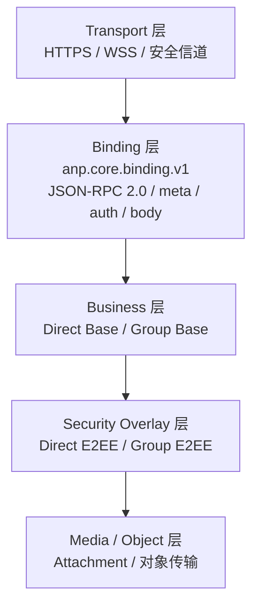
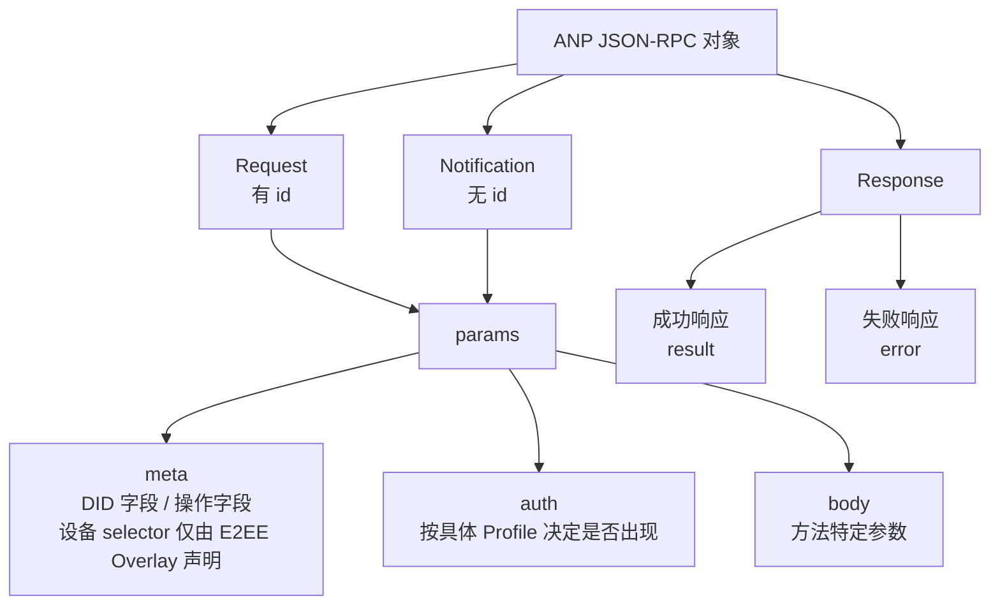
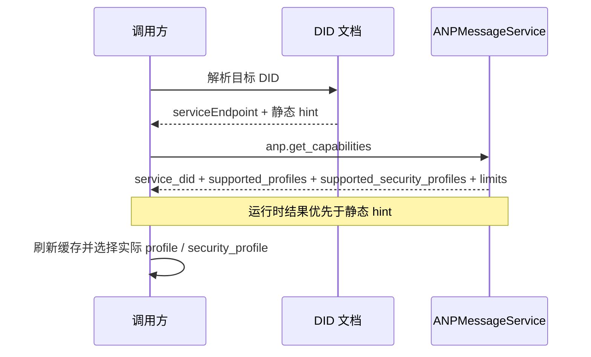

# ANP Profile 1：核心绑定

- 文档编号：ANP-P1-vNext
- 标题：核心绑定
- 状态：草案
- 规范集版本：ANP Messaging 1.2 草案
- 语言：中文
- Profile：`anp.core.binding.v1`
- 适用范围：本 Profile 适用于所有 ANP 基础 Profile 与安全 Overlay Profile。

---

## 1. 目的

本 Profile 定义 ANP 的统一外层消息绑定、通用字段、能力协商、错误模型以及互操作约束。

本 Profile 的目标是：

1. 为所有 ANP 方法提供统一的消息信封；
2. 避免不同业务 Profile 重复发明请求、响应、通知和错误格式；
3. 为 Direct Base、Group Base、Direct E2EE、Group E2EE、Attachment、Federation 等 Profile 提供共同基础；
4. 在保留 JSON-RPC 2.0 基本兼容性的前提下，收紧可选自由度，降低跨实现歧义；
5. 保持普通 Base 消息以 DID 定址，同时允许 P5/P6 类 E2EE Overlay 在需要端点级密码学绑定时声明设备 selector。

---

## 2. 术语与规范性约定

### 2.1 规范性关键字

本文中的 **MUST**、**MUST NOT**、**REQUIRED**、**SHALL**、**SHALL NOT**、**SHOULD**、**SHOULD NOT**、**RECOMMENDED**、**NOT RECOMMENDED**、**MAY**、**OPTIONAL** 按照其大写形式解释为规范性要求。

### 2.2 术语

- **ANP Endpoint**：实现 ANP 的协议端点，通常是 Agent 所在域的入口服务、群 Host 服务或其它经声明的服务端点。
- **Request**：具有 `id` 的 JSON-RPC 调用对象。
- **Notification**：不具有 `id` 的 JSON-RPC 调用对象。
- **Result**：成功响应对象中的 `result` 成员。
- **Error**：失败响应对象中的 `error` 成员。
- **Profile**：ANP 的协议能力单元，例如 `anp.direct.base.v1`。
- **Security Profile**：ANP 的安全语义单元，例如 `transport-protected`、`direct-e2ee`、`group-e2ee`。
- **Operation**：一次可被幂等识别的协议动作，例如发送消息、建群、加人、提交群状态变更。
- **Message-bearing Operation**：携带应用层消息负载的操作，例如 `direct.send`、`group.send`、`group.e2ee.send`。
- **Message-bearing Notification**：作为 Notification 承载应用层消息负载的推送方法，例如 `direct.incoming`、`group.incoming`、`group.e2ee.notice`。
- **Control Operation**：不携带应用层业务消息，而是改变协议或业务状态的操作，例如 `group.create`、`group.add`、`group.remove`。
- **Origin Proof**：由业务主体私钥生成、并通过 `auth.origin_proof` 承载的应用层原发者证明。
- **Object Proof**：通过对象内嵌 `proof` 对“移除 `proof` 后的整个对象”做出的可验证对象级断言。
- **Signed Request Object**：由 `method`、`meta`、`body` 组成、用于计算 `contentDigest` 的共享规范化业务对象。
- **Device Endpoint（设备端点）**：Agent DID 下的密码学端点；仅在 P5/P6 类设备定址 E2EE Overlay 要求时，由不透明设备标识选择。它不是 DID，也不是业务参与方。
- **Device Manifest（设备清单）**：P2 在 DID 文档中定义的结构，仅发布 P5/P6 类设备定址 E2EE Overlay 所需的最小公开密钥引用与 Profile 资格。Base 消息不使用它。

---

## 3. 设计原则

### 3.1 分层原则

ANP 采用如下分层：

1. **Transport 层**：HTTP(S)、WebSocket Secure 等安全传输；
2. **Binding 层**：本 Profile 定义的 JSON-RPC 2.0 绑定；
3. **Business 层**：Direct Base、Group Base 等业务语义；
4. **Security Overlay 层**：Direct E2EE、Group E2EE 等安全语义；
5. **Media/Object 层**：Attachment 等大对象扩展。


为了帮助读者快速建立对 ANP 分层边界的整体心智模型，下图给出从传输层到媒体 / 对象层的总览。后续各 Profile 都是在这一分层框架上继续收紧自己的对象、流程与约束。



*图 P1-1：ANP 分层总览（非规范性）。*

本图强调的是职责边界，而不是部署形态：某个实现可以把多层合并在同一服务中，但跨实现互通时仍应保持这些层的语义分离。
### 3.2 最小互通原则

不同实现只要满足本 Profile 约束，即可共享相同的：

- 请求 / 响应格式；
- 通知格式；
- 通用字段语义；
- 能力协商方式；
- 错误模型；
- 幂等处理原则。

### 3.3 非目标

本 Profile **不**定义以下能力：

- 历史拉取；
- 已读状态；
- 设备注册、命名、角色、同步或内部 fan-out；
- 在线状态；
- 内部副本一致性；
- 具体 E2EE 算法。

这些能力必须由其它 Profile 定义，或明确声明为超出 ANP 标准范围。

普通 Direct Base、Group Base 和 Attachment 操作保持 DID 定址，不要求也不携带设备 selector。只有 Direct E2EE、Group E2EE 或未来等价 E2EE Overlay 明确声明时，设备选择才进入线协议。

### 3.4 Profile 标识

本 Profile 的标准名称为：

`anp.core.binding.v1`

后续 Profile 在声明依赖关系时，**MUST** 使用该名称引用本 Profile。

---

## 4. 绑定基础

### 4.1 JSON-RPC 版本

ANP Core Binding **MUST** 使用 JSON-RPC 2.0。

每个请求对象和响应对象中的 `jsonrpc` 成员 **MUST** 精确等于字符串 `"2.0"`。

### 4.2 安全传输要求

所有 ANP 绑定 **MUST** 运行在经过认证的安全传输层之上，例如：

- HTTPS；
- WSS；
- 其它能够提供机密性、完整性与对端认证的安全信道。

本 Profile 不允许在未认证、未加密的裸传输上运行。

### 4.3 传输无关性

本 Profile 在逻辑上是传输无关的；HTTP(S) 与 WSS 是推荐绑定，但不是唯一允许的绑定。  
任意新绑定只要不改变本 Profile 的消息对象语义，即 **MAY** 被定义为补充绑定文档。

---

## 5. JSON-RPC 互操作约束

### 5.1 `params` 形式

JSON-RPC 原规范允许 `params` 采用按位置数组或按名称对象。  
ANP 中，`params` **MUST** 为对象；**MUST NOT** 使用数组形式。  
若收到数组形式 `params`，接收方 **MUST** 返回 `anp.invalid_params_shape` 错误。

### 5.2 `id` 类型

JSON-RPC 原规范允许 `id` 为字符串、数字或 `null`。  
ANP 中，Request 的 `id` **MUST** 为非空字符串。  
ANP Request **MUST NOT** 使用数字 `id`。  
ANP Request **MUST NOT** 使用 `null` 作为 `id`。  
若收到不符合要求的 `id`，接收方 **MUST** 返回 `anp.invalid_request_id`。

### 5.3 Notification 使用范围

ANP 中，Notification **仅**用于以下场景：

1. 对端主动推送的异步事件；
2. 不要求确认、也不应返回错误详情的单向提示。

以下操作 **MUST NOT** 使用 Notification：

- 改变持久状态的控制操作；
- 需要幂等确认的消息发送；
- 需要调用方感知成功或失败的任何操作。

### 5.4 Batch 禁止

JSON-RPC 的 batch 调用在 ANP 中 **MUST NOT** 使用。  
客户端 **MUST NOT** 发送 batch。  
服务端收到 batch 时 **MUST** 拒绝，并返回 `anp.batch_not_supported`。

### 5.5 方法名约束

方法名 **MUST** 为字符串，并遵循以下命名规则：

- 采用逻辑命名空间；
- 以小写字母开头；
- 段间使用 `.` 分隔；
- 方法名 **MUST NOT** 以 `rpc.` 开头；
- 业务方法 **SHOULD** 使用 `<domain>.<action>` 风格。

推荐示例：

- `anp.get_capabilities`
- `direct.send`
- `group.create`
- `group.add`
- `group.send`

### 5.6 响应约束

除 Notification 外，服务端 **MUST** 对每个 Request 返回一个 Response。  
成功响应 **MUST** 含有 `result`，且 **MUST NOT** 含有 `error`。  
失败响应 **MUST** 含有 `error`，且 **MUST NOT** 含有 `result`。  
Response 的 `id` **MUST** 与对应 Request 的 `id` 完全一致。

---

## 6. 通用 `params` 结构

### 6.1 顶层对象

除某些明确例外的方法外，ANP 的 `params` **MUST** 采用如下结构：

```json
{
  "meta": { "...": "..." },
  "auth": { "...": "..." },
  "body": { "...": "..." }
}
```

其中：

- `meta`：通用元数据，承载解释 Profile、目标、幂等、安全模式等；
- `auth`：可选的认证与证明对象；只有当具体 Profile 明确要求时才出现；
- `body`：方法特定参数。

若某具体 Profile 未定义 `auth`，则调用方 **MAY** 省略它。  
若某具体 Profile 明确要求 `auth`，则调用方 **MUST** 提供且接收方 **MUST** 验证。  
除 `meta`、`auth`、`body` 之外的顶层 `params` 成员，只有在对应 Profile 明确定义时才允许出现。


下面的图示把本 Profile 在文字中反复出现的外层 envelope 收敛成一个统一视图，便于读者理解 Request、Notification 与 Response 共享了哪些结构，以及 `meta`、`auth`、`body` 分别承载什么职责。



*图 P1-2：ANP JSON-RPC 信封结构（非规范性）。*

后续各业务 Profile 与安全 Overlay 都只应在 `body` 和必要的 `auth` 约束上扩展，而不应重新发明另一套与本图冲突的顶层绑定结构。
### 6.2 `meta` 对象

`meta` 对象字段定义如下：

#### 6.2.1 `anp_version`

- 类型：字符串
- 状态：**已废弃**
- 要求：既有发送方为兼容 **MAY** 携带；新发送方 **SHOULD NOT** 携带
- 语义：仅作为兼容或诊断提示
- 默认值：无
- 说明：
  - `meta.profile` 是解析、wire contract 选择与能力协商的唯一版本依据；
  - 接收方 **MUST NOT** 使用 `anp_version` 选择 Profile、推断支持某个 Profile 集或改变安全语义；
  - 接受该字段的接收方只可为兼容网关或诊断目的保留它；
  - 省略该字段不隐含默认 ANP 版本或 Messaging 规范集版本。

#### 6.2.2 `profile`

- 类型：字符串
- 要求：**MUST**
- 语义：本次请求的唯一解释 Profile
- 说明：
  - `profile` 用于声明“当前请求的 `body`、`result`、错误约束与方法语义由哪个 Profile 解释”；
  - `profile` **MUST NOT** 同时表达多个 Profile 的并集语义；
  - `security_profile` 只表达安全模式，不替代 `profile`。
- 示例：
  - `"anp.direct.base.v1"`
  - `"anp.group.base.v2"`
  - `"anp.direct.e2ee.v2"`
  - `"anp.group.e2ee.v2"`

#### 6.2.3 `security_profile`

- 类型：字符串
- 要求：**MUST**
- 语义：本次调用的安全模式
- 允许值：
  - `"transport-protected"`
  - `"direct-e2ee"`
  - `"group-e2ee"`
- 说明：
  - `security_profile` 表示当前请求要求采用的安全模式；
  - 它描述的是安全级别或安全语义，而不是 `body` 的解释语法；
  - 若某 `profile` 只允许某些 `security_profile` 组合，必须由对应 Profile 明确规定。

#### 6.2.4 `sender_did`

- 类型：字符串（DID）
- 要求：除匿名公共发现能力外，**MUST**
- 语义：本次请求在业务语义上的发送主体 DID（business origin DID / logical sender DID）
- 说明：
  - 对普通 Request，`sender_did` **SHOULD** 表示当前业务发起方；
  - 对服务端生成的 Notification，是否允许省略 `sender_did` 或改由其它字段表达逻辑签发者，由具体 Profile 定义；
  - `sender_did` **MUST NOT** 被自动等同于外层传输连接的一跳调用者身份。

#### 6.2.4.1 `sender_device_id`

- 类型：字符串
- 要求：条件式；除非所属 P5/P6 类 E2EE Overlay 明确声明设备定址操作，否则 **MUST NOT** 出现
- 语义：选择 `sender_did` 下的一个密码学 Device Endpoint
- 说明：
  - 所属 P5/P6 类 E2EE Overlay **MUST** 针对每个方法声明该字段是必需还是允许；
  - 出现时，它 **MUST** 标识 `sender_did` 的 P2 `deviceManifest` 中一个当前合格条目；
  - 它 **MUST NOT** 被视为发送方 DID、业务成员、角色、硬件标识或路由目标；
  - 普通 Direct Base、Group Base、Attachment 及其它非 E2EE 操作 **MUST NOT** 携带该字段。

#### 6.2.4.2 `recipient_device_id`

- 类型：字符串
- 要求：条件式；除非所属 P5/P6 类 E2EE Overlay 明确声明设备定址操作，否则 **MUST NOT** 出现
- 语义：选择所属 Overlay 所标识接收方 Agent DID 下的一个密码学 Device Endpoint
- 说明：
  - 对 agent-addressed 操作，接收方 Agent DID 仍位于 `meta.target.did`；
  - 所属 P5/P6 类 E2EE Overlay **MUST** 针对每个方法声明该字段是必需还是允许，以及它归属于哪个接收方 DID；
  - 出现时，它 **MUST** 标识该 DID 的 P2 `deviceManifest` 中一个当前合格条目；
  - 它不会引入 `target.kind = "device"`，普通非 E2EE 操作 **MUST NOT** 携带该字段。

设备 selector 是由 Profile 所有的安全字段，而不是通用消息元数据。Relay 转发由 P5/P6 类 E2EE Overlay 声明设备定址的操作时 **MUST** 保留这些字段，并且 **MUST NOT** 添加、删除、推断或改写它们。若附件清单承载于加密的 P5/P6 消息中，selector 属于外层安全 Overlay；普通 P7 附件语义仍为 DID 级。

#### 6.2.5 `target`

- 类型：对象
- 要求：当方法存在协议级目标时 **MUST**
- 结构：

```json
{
  "kind": "agent | group | service",
  "did": "did:example:..."
}
```

- 说明：
  - `kind = "agent"` 表示目标为单个 Agent；
  - `kind = "group"` 表示目标为单个群；
  - `kind = "service"` 表示目标为某个公开 `ANPMessageService.serviceDid`；
  - `target.did` **MUST NOT** 直接承载传输层 URL；
  - 即使安全 Overlay 选择了设备，`target.did` 仍是业务 DID；本 Profile 不定义 `target.kind = "device"`；
  - 任何方法 Profile **MUST** 明确声明自己是 `agent-addressed`、`group-addressed`、`service-scoped` 还是 `endpoint-local`；
  - 是否允许省略 `target`，**MUST** 由具体 Profile 显式声明，调用方与接收方 **MUST NOT** 自行猜测。
  - 若某方法要求 `auth.origin_proof`，则 `meta.target` **MUST** 存在，且 `meta.target.kind` **MUST** 为 `agent`、`group`、`service` 之一。

#### 6.2.5.1 目标建模模式声明规则

为消除不同 Profile 对 `target` 的解释分叉，具体 Profile **MUST** 明确声明其方法属于以下哪一种目标建模模式：

1. **agent-addressed**
   - `meta.target.kind = "agent"`
   - `meta.target.did` 指向目标 Agent DID

2. **group-addressed**
   - `meta.target.kind = "group"`
   - `meta.target.did` 指向目标 Group DID

3. **service-scoped**
   - `meta.target.kind = "service"`
   - `meta.target.did` 指向目标公开 `ANPMessageService.serviceDid`

4. **endpoint-local**
   - 仅当对应 Profile 明确声明时，才允许省略 `meta.target`

若某方法未被其 Profile 明确声明为 endpoint-local，则接收方 **MUST** 按“需要显式 `target`”处理。

若某请求的 `meta.target.kind` 与该方法声明的目标建模模式不一致，接收方 **MUST** 返回 `anp.invalid_target_binding`。


#### 6.2.6 `operation_id`

- 类型：字符串
- 要求：所有会改变状态的操作 **MUST**
- 语义：本次操作的幂等标识
- 规则：
  - 同一发起方在同一语义上下文中重试时，`operation_id` **MUST** 保持不变；
  - 幂等作用域 **MUST** 由具体 Profile 明确定义；
  - 服务端 **MUST** 先进行幂等命中检查，再进行乐观并发或版本前置条件检查；
  - 对消息类操作，发送方 **SHOULD** 直接令 `operation_id = message_id`，除非其确实需要区分“消息标识”和“操作重试标识”。

#### 6.2.7 `message_id`

- 类型：字符串
- 要求：Message-bearing Operation **MUST**
- 语义：应用层消息标识
- 说明：
  - `message_id` 用于消息级唯一识别或重复识别；
  - `message_id` 与 `operation_id` 可以相同，也可以不同；
  - 若实现没有独立的操作生命周期，**SHOULD** 直接复用 `message_id` 作为 `operation_id`；
  - `message_id` **MUST NOT** 隐式替代 `operation_id` 的通用幂等语义，除非对应 Profile 明确允许二者相同；
  - 当具体方法是 message-bearing Notification 时，本条约束同样适用。

#### 6.2.8 `created_at`

- 类型：字符串（RFC 3339 时间）
- 要求：**SHOULD**
- 语义：发起方创建该操作的时间戳
- 说明：除非后续 Profile 另有规定，`created_at` 不得作为唯一的防重放依据。

#### 6.2.9 `trace_id`

- 类型：字符串
- 要求：**不再作为标准互通字段**
- 语义：实现内部追踪标识
- 说明：
  - 若部署需要跨服务追踪，**SHOULD** 使用传输层元数据或私有扩展字段（例如 `x_trace_id`）；
  - 接收方 **MUST NOT** 将其纳入任何安全语义、授权判断或幂等判断。

#### 6.2.10 `content_type`

- 类型：字符串
- 要求：Message-bearing Operation **MUST**
- 语义：当前消息操作的主业务负载类型；若当前 Profile / Overlay 使用独立的外层 envelope，则表示该外层 envelope 的类型。

规则如下：

1. 在 Base Profile 中，若 `body` 只是结构化承载容器（例如 `text` / `payload` / `payload_b64u` 互斥结构），则 `meta.content_type` **MUST** 描述该容器中的主业务负载类型，而不是 JSON 容器对象本身的类型；
2. 在 Security Overlay 中，若 `body` 承载独立密文 envelope，则 `meta.content_type` **MUST** 表示该外层 envelope 的 wire object type；
3. 原始应用内容类型若与外层 envelope 类型不同，**MUST** 由对应 Overlay 在其内部字段（如 `application_content_type`）中表达；
4. 当具体方法是 message-bearing Notification 时，本条规则同样适用；
5. 对 `meta.content_type` 的基础解释权由本 Profile 唯一规定；其它业务 Profile 与安全 Overlay **MUST NOT** 重写其基础语义。

示例：

- Direct Base 文本消息：`text/plain`
- Group Base JSON 消息：`application/json`
- Direct E2EE 文本消息：外层 `meta.content_type = "application/anp-direct-cipher+json"`，内层 `application_content_type = "text/plain"`
- Group E2EE 附件消息：外层 `meta.content_type = "application/anp-group-cipher+json"`

当业务负载是普通结构化 JSON 时，内容类型 **MUST** 使用
`application/json`，JSON 对象 **MUST** 直接放在 `body.payload` 中，
或放在安全 Overlay 的内层 `payload` 中。Profile 和应用 **MUST NOT**
仅为了区分 command、status、task、result 等业务含义而定义额外
content type。这些含义属于 JSON 对象内部的应用层语义，不属于
Core Binding 层。

其中，若 Group E2EE 的内层原始业务类型是附件清单，则应在内层明文中写：

```json
{
  "application_content_type": "application/anp-attachment-manifest+json"
}
```

而 **不是** 在外层 `meta.content_type` 中继续写附件清单类型。

### 6.3 `body` 对象

`body` 对象为方法特定参数集合：

- 业务 Profile **MUST** 定义其字段；
- 安全 Overlay Profile **MUST** 定义其密码学字段；
- `body` 中未识别字段是否可被忽略，**MUST** 由对应 Profile 明确说明；
- 对影响安全、路由、权限、幂等或状态机语义的未知字段，接收方 **MUST** 拒绝。

---

## 7. 负载表示规则

### 7.1 JSON 对象优先

凡能够自然表达为 JSON 对象的业务对象，**SHOULD** 直接以 JSON 对象表示。  
ANP **MUST NOT** 采用“在 JSON 字符串中再嵌 JSON”的双重序列化作为默认做法。

### 7.2 二进制表示

需要传输二进制负载时，字段 **MUST** 采用无填充 base64url 文本表示。  
相关字段名 **SHOULD** 以 `_b64u` 结尾，例如：

- `ciphertext_b64u`
- `key_package_b64u`
- `welcome_b64u`

### 7.3 数值表示

为避免不同语言对大整数、计数器、序号的表示差异，以下字段 **MUST** 采用十进制字符串表示：

- 计数器；
- 序列号；
- 逻辑时钟；
- epoch；
- generation；
- 大整数长度；
- 任何可能超过 IEEE 754 双精度安全整数范围的数值。

如果后续 Profile 需要对 JSON 做规范化签名，必须明确定义签名输入的序列化规则。  
一旦某 Profile 定义了 Signed Payload 或等价的密码学绑定对象，该 Profile **MUST** 指定唯一的规范化算法；不同实现 **MUST NOT** 自行选择不同“稳定序列化”策略。

---

## 8. 能力协商

### 8.1 总则

ANP Endpoint **MUST** 暴露能力协商接口。  
能力协商的结果 **MUST** 至少包括：

- 支持的 ANP Profile 列表；
- 支持的 Security Profile 列表；
- 运行时服务身份；
- 实现约束（如最大负载、最大对象大小、节流策略等）。

实现方 **MAY** 返回更细粒度扩展字段（如支持的内容类型、方法级能力、Notification 能力、认证 scheme 能力），但这些扩展字段不影响本节定义的最小标准响应结构。

### 8.2 标准方法：`anp.get_capabilities`

#### 8.2.1 请求

```json
{
  "jsonrpc": "2.0",
  "id": "req-001",
  "method": "anp.get_capabilities",
  "params": {
    "meta": {
      "profile": "anp.core.binding.v1",
      "security_profile": "transport-protected",
      "operation_id": "op-cap-001",
      "created_at": "2026-03-29T12:00:00Z"
    },
    "body": {}
  }
}
```

说明：

- `anp.get_capabilities` **MAY** 作为匿名公共发现能力调用；
- 匿名调用时，`meta.sender_did` **MAY** 省略；
- 若服务端基于身份返回不同能力子集，则调用方 **MAY** 在已认证上下文中再次调用。

#### 8.2.2 成功响应

```json
{
  "jsonrpc": "2.0",
  "id": "req-001",
  "result": {
    "service_did": "did:example:service",
    "supported_profiles": [
      "anp.core.binding.v1",
      "anp.identity.discovery.v1",
      "anp.direct.base.v1",
      "anp.group.base.v2",
      "anp.attachment.v1",
      "anp.federation.relay.v1",
      "anp.direct.e2ee.v2",
      "anp.group.e2ee.v2"
    ],
    "supported_security_profiles": [
      "transport-protected",
      "direct-e2ee",
      "group-e2ee"
    ],
    "limits": {
      "max_request_bytes": "1048576",
      "max_message_bytes": "262144"
    },
    "supported_content_types": [
      "text/plain",
      "application/json",
      "application/anp-attachment-manifest+json"
    ]
  }
}
```

说明：

- `result.service_did` 表示当前运行时能力结果所对应的服务身份 DID；
- 静态 DID 文档只提供 hint，运行时能力以此结果为准；
- `supported_content_types` 属于推荐扩展，但非常常见，服务端 **SHOULD** 尽量返回。

### 8.3 协商规则

- DID 文档中的静态扩展字段仅表示可缓存的静态 hint；
- `anp.get_capabilities` 的返回结果表示运行时权威能力（runtime authority）；
- 若静态 hint 与运行时能力冲突，调用方 **MUST** 以运行时能力结果为准并刷新缓存；
- 调用方 **SHOULD** 在首次交互前，或在缓存过期后，获取目标服务能力；
- 如果请求中的 `profile` 或 `security_profile` 不被支持，服务端 **MUST** 返回明确错误；
- 调用方 **MUST NOT** 假定“对方支持 Base Profile 就一定支持 E2EE Overlay”。
- 对普通 Base 操作，能力协商保持 DID 级，不要求 `deviceManifest`，也不选择设备；
- 在发起设备定址 E2EE 操作前，调用方 **MUST** 依据当前 P2 `deviceManifest`，额外验证所属 Overlay 所要求的设备资格与 Profile 声明。

---


静态 DID 文档里的 hint 与运行时能力返回之间容易被实现者混淆。下图把推荐的协商顺序固定下来，突出“静态信息用于发现，运行时结果用于裁决”的原则。



*图 P1-3：能力协商与运行时权威（非规范性）。*

实现方在静态 hint 与运行时能力冲突时，应以本图中的运行时结果为准，并把冲突视为需要更新本地缓存的信号。
## 9. 幂等与重试

### 9.1 幂等原则

所有状态改变型操作 **MUST** 支持幂等。  
同一 `(sender_did, target_scope, method, operation_id)` 的重复请求：

- 若语义等价，服务端 **MUST** 返回同一结果或等价结果；
- 若语义冲突，服务端 **MUST** 返回 `anp.idempotency_conflict`。

其中：

- `target_scope` 的具体取值 **MUST** 由对应 Profile 定义；
- 对 Direct 类方法，`target_scope` 通常为 `target.did`；
- 对 Group 类方法，`target_scope` 通常为 `group_did`。

对 DID 定址的 Base 操作，设备标识不属于幂等作用域。设备定址 E2EE Overlay **MUST** 把其要求的每个设备 selector 加入幂等作用域，避免不同密码学端点的重试发生冲突。

当所属 Profile 支持 DID 迁移连续性时，接收方在以“DID 已被替代”为由拒绝请求前，**MUST** 先查找该旧 DID 下已经接受请求的精确幂等记录。若记录存在，接收方 **MUST** 返回原结果。由后继 DID 签名的请求不是旧 DID 请求的精确重放；只有在迁移已被接受且业务动作语义等价后，所属 Profile 才 **MAY** 定义额外的跨 DID 去重规则。

### 9.2 消息重试

对于消息发送类操作：

- 重试时 `message_id` **MUST** 保持不变；
- 重试时 `operation_id` **MUST** 保持不变；
- 若实现无独立操作语义，发送方 **SHOULD** 让两者直接相同；
- 服务端 **MUST** 先检查操作级幂等记录；
- 对消息级重复识别所使用的键（如是否包含 `message_id`），必须由对应消息 Profile 明确定义。

### 9.3 非幂等操作

如果某操作天生不可幂等，对应 Profile **MUST** 明确标注，并给出替代补救机制。  
未明确标注者，一律视为必须可幂等。

---

## 10. 错误模型

### 10.1 总则

ANP 使用 JSON-RPC 的 `error` 对象承载错误。  
ANP **保留** JSON-RPC 标准错误码原语义，同时定义 ANP 自身的应用错误编码。

对下列情形，服务端 **SHOULD** 优先使用 JSON-RPC 标准错误码：

| 场景 | 推荐 JSON-RPC 错误码 |
|---|---|
| 无法解析 JSON | `-32700 Parse error` |
| 非法 JSON-RPC 对象 | `-32600 Invalid Request` |
| 方法不存在 | `-32601 Method not found` |
| 参数形状不合法 | `-32602 Invalid params` |
| 服务端内部异常 | `-32603 Internal error` |

对 ANP 业务层错误，服务端 **SHOULD** 使用本文件定义的 1000+ 错误码，并同时在 `error.data.anp_code` 中提供机器可识别语义。

### 10.2 ANP 错误对象扩展

`error` 对象建议结构：

```json
{
  "code": 1001,
  "message": "Unsupported profile",
  "data": {
    "anp_code": "anp.unsupported_profile",
    "retryable": false,
    "details": {}
  }
}
```

当 `code` 属于 ANP 自定义错误范围时，`error.data.anp_code` **MUST** 存在。

### 10.3 ANP 公共错误码

| `code` | `anp_code` | 含义 |
|---|---|---|
| 1000 | `anp.invalid_request_id` | `id` 非法 |
| 1001 | `anp.unsupported_profile` | 不支持所请求的 Profile |
| 1002 | `anp.unsupported_security_profile` | 不支持所请求的安全模式 |
| 1003 | `anp.invalid_params_shape` | `params` 结构不符合要求 |
| 1004 | `anp.batch_not_supported` | 不支持 batch |
| 1005 | `anp.unauthorized` | 未通过认证 |
| 1006 | `anp.forbidden` | 已认证但无权限 |
| 1007 | `anp.target_not_found` | 目标 DID 不存在或不可达 |
| 1008 | `anp.idempotency_conflict` | 幂等键冲突 |
| 1009 | `anp.unsupported_content_type` | 不支持内容类型 |
| 1010 | `anp.delivery_rejected` | 目标服务拒绝接收 |
| 1011 | `anp.rate_limited` | 触发限流 |
| 1012 | `anp.temporarily_unavailable` | 服务暂时不可用 |
| 1013 | `anp.invalid_security_binding` | 安全模式与负载结构不匹配 |
| 1014 | `anp.invalid_target_binding` | 方法要求的目标建模模式与实际 `meta.target` 不匹配 |
| 1015 | `anp.device_binding_required` | 设备定址 E2EE Overlay 要求的设备 selector 缺失 |
| 1016 | `anp.device_binding_invalid` | 设备 selector 或其所需 DID / 密钥绑定无效 |
| 1017 | `anp.device_not_eligible` | 所选设备当前不具备所请求安全 Profile 的资格 |
| 1018 | `anp.device_state_changed` | 先前解析的设备资格或密钥状态已不再是当前状态 |
| 1019 | `anp.did_superseded` | 请求使用的 DID 已存在后继；调用方必须验证迁移、重建请求并重新签名 |
| 1020 | `anp.did_transition_invalid` | 迁移链、proof、绑定、稳定主体路径或迁移 Profile 无效或不受支持 |
| 1021 | `anp.did_transition_conflict` | 迁移存在分叉、循环、主体歧义、活动记录碰撞或并发更新冲突 |

1015 至 1018 仅适用于所属 P5/P6 类 E2EE Overlay 声明设备定址的操作。普通 Base、Group 或 Attachment 操作 **MUST NOT** 使用这些错误来要求设备 selector；若这类操作收到 selector，应按对应 Profile 的非法参数处理。

1019 至 1021 只适用于所属 Profile 处理 DID 迁移的场景。对于 `anp.did_superseded`，`error.data.details` **SHOULD** 包含 `requested_did` 与 `current_did`。后者只是未验证提示；调用方 **MUST** 从 `requested_did` 开始验证迁移，并在重试前重建所有绑定 DID 的签名、摘要或加密上下文。ANP 错误 **MUST NOT** 暴露内部稳定主体标识。

### 10.4 错误返回要求

- 对 ANP 自定义错误，服务端 **MUST** 返回可机器判定的 `anp_code`；
- `message` **SHOULD** 简短、可读；
- `data.retryable` **SHOULD** 明确可否重试；
- 任何错误 **MUST NOT** 泄露不必要的敏感内部状态。
- 对目标绑定错误、service-scoped / endpoint-local 误用等情况，**SHOULD** 返回 `anp.invalid_target_binding`。

---

## 11. 方法注册与命名空间

### 11.1 命名空间

建议使用如下一级命名空间：

- `anp.*`
- `direct.*`
- `group.*`
- `attachment.*`
- `federation.*`

### 11.2 版本管理

Profile 名称 **MUST** 显式带版本，例如：

- `anp.core.binding.v1`
- `anp.identity.discovery.v1`
- `anp.direct.base.v1`

每个 Profile 独立版本化。依赖一个新主版本 Profile，不会改变其 Core、Discovery、Base、Attachment、Federation 或扩展依赖的主版本。

ANP Messaging 规范集版本是文档/目录发布版本，不是 wire 标识。因此 ANP Messaging 1.2 可以同时包含 `anp.direct.base.v1` 与 `anp.direct.e2ee.v2`。Profile 标识 **MUST** 使用 `.v1`、`.v2` 这样的主版本，**MUST NOT** 使用 `.v1.1` 或 `.v1.2` 这样的规范集小版本。

### 11.3 扩展方法

实现方 **MAY** 定义私有扩展方法，但：

- **MUST NOT** 与标准方法同名；
- **SHOULD** 使用私有前缀；
- **MUST NOT** 假定其它实现理解这些方法。

---

## 12. 兼容性与版本演进

### 12.1 前向兼容

接收方对于未知扩展字段的处理规则如下：

- 对未知核心 `meta` 字段，接收方 **MUST** 拒绝；
- 对以 `x_` 开头的实现扩展 `meta` 字段，接收方 **MAY** 忽略；
- 对未知 `auth` 字段，接收方 **MUST** 拒绝，除非对应 Profile 显式声明可扩展；
- 对未知 `body` 字段，只有在对应 Profile 明确声明可忽略时，接收方才 **MAY** 忽略；
- 若未知字段影响安全、路由、权限、幂等或状态机语义，接收方 **MUST** 拒绝。

### 12.2 破坏性变更

以下变更视为破坏性变更，必须升级 Profile 主版本：

- 新增必填 wire 字段；
- 删除或重命名既有字段；
- 改变字段含义；
- 改变签名或 AAD 覆盖范围；
- 改变幂等键或状态机；
- 改变安全模式语义；
- 任何旧实现无法安全处理的变化。

### 12.3 非破坏性规范修订

以下变化不改变 Profile 主版本：

- 澄清既有语义，或增加明确既有边界的禁止性说明；
- 修复示例或文档内部不一致；
- 增加与新 Overlay 的组合说明；
- 增加不影响旧请求的可选扩展。

同一 Profile 的 v1 与 v2 标识是相互独立的互通契约。具体而言，实现 **MUST NOT** 为 v1 对端推断 P5/P6 v2 设备端点、合成默认设备、把 v1 E2EE 状态作为 v2 状态复用，或把失败的 v2 设备定址 E2EE 操作静默降级为 v1 或 transport-protected Base 操作。P1/P2 v1 只注册条件式扩展点；只有声明这些字段的 P5/P6 v2 Overlay 才拥有并启用 6.2.4 节的 selector。

---

## 13. 安全注意事项

### 13.1 安全模式固定

调用方与服务端 **MUST NOT** 在未明确协商的情况下，从高安全模式静默降级到低安全模式。  
若目标不支持请求的 `security_profile`，服务端 **MUST** 明确返回 `anp.unsupported_security_profile`。

### 13.2 时间戳不是主防重放机制

`created_at` **MUST NOT** 作为唯一防重放机制。  
防重放应由后续 Profile 在会话态、消息态或群态中定义。

### 13.3 追踪字段隔离

`trace_id`、日志标签、监控字段 **MUST NOT** 参与任何密码学绑定或业务授权判断。

### 13.4 负载互斥

若某 Profile 定义 `body.payload` 与 `body.payload_b64u` 为互斥字段，则发送方 **MUST NOT** 同时提供二者；接收方收到冲突输入时 **MUST** 拒绝。

当 `meta.content_type` 为 `application/json` 时，对应的 payload 承载字段
**MUST** 是 JSON 对象。发送方 **MUST NOT** 将序列化后的 JSON 字符串放入
`body.text`，也 **MUST NOT** 将对象二次序列化成 JSON 字符串后放入
`body.payload`。

### 13.5 设备 selector 完整性

所属 P5/P6 类 E2EE Overlay **MUST** 在其定义的认证上下文中保护每个设备 selector。若操作使用 `auth.origin_proof`，selector 通过 Signed Request Object 受到保护，且 proof key **MUST** 按附录 A 匹配所选 P2 Manifest 条目。若 Overlay 不使用 Origin Proof，则它 **MUST** 通过经认证会话、AAD 或等价密码学上下文绑定 selector。接收方 **MUST** 拒绝未受保护或绑定不匹配的 selector。

---

## 14. 隐私注意事项

### 14.1 最小元数据原则

发送方 **SHOULD** 仅在 `meta` 中放置跨实现互通所必需的最小元数据。

### 14.2 设备元数据最小化

业务身份和 Base 消息地址仍是 Agent DID 与 Group DID。设备 selector 仅保留给要求密码学端点的 P5/P6 类 E2EE Overlay，并非强制 Core 元数据。实现 **MUST NOT** 通过这些 selector 暴露设备名称、硬件标识、角色、在线状态、恢复状态或内部拓扑。

### 14.3 能力缓存

调用方 **SHOULD** 缓存能力协商结果，但 **MUST** 在能力变化、验证失败、服务端点切换或缓存失效时重新协商。

---

## 15. 最小互通要求

一个 ANP Core Binding 合规实现至少 **MUST** 支持：

1. JSON-RPC 2.0；
2. 对象形式 `params`；
3. 字符串 `id`；
4. `anp.get_capabilities`；
5. 公共错误码；
6. 幂等 `operation_id`；
7. `meta` / `body` 顶层结构；
8. 安全传输；
9. 对匿名或已认证的 `anp.get_capabilities` 处理；
10. 统一的 `content_type` 语义：外层永远表示当前 wire object type；
11. 对每个方法显式声明目标建模模式：`agent-addressed`、`group-addressed`、`service-scoped` 或 `endpoint-local`；
12. 对 `service-scoped` 方法强制校验 `meta.target.kind = "service"` 与 `target.did = serviceDid`；
13. 对 `endpoint-local` 方法显式声明可省略 `target`，并在未声明时拒绝模糊省略；
14. 在普通 Base 操作中拒绝设备 selector，仅在 P5/P6 类设备定址 E2EE Overlay 明确声明时校验这些字段。
15. 公共 DID 迁移错误码 1019 至 1021，以及在拒绝已被替代的旧 DID 前返回其精确幂等重放结果。

## 16. 示例

以下示例仅演示 Core Binding 外层 envelope；Overlay 方法（例如 `group.e2ee.send`、`group.e2ee.notice`）同样受本 Profile 的 Request / Notification、`meta`、目标建模与错误模型约束。

下面是普通 transport-protected Direct Base 消息，因此只包含发送方与接收方 DID，并有意省略 `sender_device_id` 与 `recipient_device_id`。

### 16.1 `direct.send` 请求示例

```json
{
  "jsonrpc": "2.0",
  "id": "req-10001",
  "method": "direct.send",
  "params": {
    "meta": {
      "profile": "anp.direct.base.v1",
      "security_profile": "transport-protected",
      "sender_did": "did:example:agent-a",
      "target": {
        "kind": "agent",
        "did": "did:example:agent-b"
      },
      "operation_id": "msg-10001",
      "message_id": "msg-10001",
      "created_at": "2026-03-29T12:00:00Z",
      "content_type": "text/plain"
    },
    "auth": {
      "scheme": "anp-rfc9421-origin-proof-v1",
      "origin_proof": {
        "contentDigest": "sha-256=:BASE64_SHA256_OF_SIGNED_DIRECT_PAYLOAD:",
        "signatureInput": "sig1=(\"@method\" \"@target-uri\" \"content-digest\");created=1774785600;expires=1774785660;nonce=\"n-10001\";keyid=\"did:example:agent-a#key-1\"",
        "signature": "sig1=:BASE64_SIGNATURE:"
      }
    },
    "body": {
      "text": "hello"
    }
  }
}
```

### 16.2 成功响应示例

```json
{
  "jsonrpc": "2.0",
  "id": "req-10001",
  "result": {
    "accepted": true,
    "message_id": "msg-10001",
    "operation_id": "msg-10001",
    "target_did": "did:example:agent-b",
    "accepted_at": "2026-03-29T12:00:01Z"
  }
}
```

---

## 17. IANA / 注册表占位

本标准后续版本 **SHOULD** 建立以下注册表：

1. ANP Profile 名称注册表；
2. Security Profile 注册表；
3. Content-Type 注册表；
4. ANP 错误码注册表。

---

## 18. 参考实现说明（非规范性）

实现方在落地本 Profile 时，宜采用如下原则：

- Core Binding 只保留真正跨实现必须一致的字段；
- DID 文档中的静态 hint 只做发现，不做运行时裁决；
- 业务层只关心业务语义，安全细节放在 Overlay 中；
- 追踪、路由和内部网关字段尽量放在私有扩展或传输层，不进入标准互通边界。

---
# 附录 A（规范性）：共享 Origin Proof 承载约定

本附录定义 P3、P4、P6 以及未来业务 Profile 共享的应用层原发者证明（Origin Proof）承载约定。

本附录**不重复定义**通用签名算法、Structured Field 序列化或 JSON 规范化算法；这些内容由下列标准直接提供：

* **RFC 8785**：JSON Canonicalization Scheme（JCS）
* **RFC 9530**：`Content-Digest` 字段值格式
* **RFC 9421**：`Signature-Input`、`Signature`、signature base 的构造与验证模型
* **RFC 3986**：URI 百分号编码规则
* [ANP-02](../02-ANP-基于DID的身份认证协议.md)：通用身份输入、认证密钥授权、签名参数安全、时间与重放要求；适用方法绑定拥有 Document 验证

ANP 在本附录中只定义以下自定义部分：

1. `auth.origin_proof` 的承载字段；
2. 统一的 **Signed Request Object**；
3. 应用层 `@method` / `@target-uri` / `content-digest` 组件映射；
4. 与 hop / service 认证、跨域转发之间的职责边界。

## A.1 统一 `auth.scheme` 与 `auth.origin_proof`

当某业务 Profile 使用应用层原发者证明时：

* `auth.scheme` **MUST** 等于 `anp-rfc9421-origin-proof-v1`
* `auth.origin_proof` **MUST** 存在
* `auth` 本身 **MUST NOT** 进入摘要输入

推荐结构如下：

```json
{
  "auth": {
    "scheme": "anp-rfc9421-origin-proof-v1",
    "origin_proof": {
      "contentDigest": "sha-256=:BASE64_SHA256_DIGEST:",
      "signatureInput": "sig1=(\"@method\" \"@target-uri\" \"content-digest\");created=1733402096;expires=1733402156;nonce=\"abc123\";keyid=\"did:wba:example.com:user:alice:e1_<fingerprint>#key-1\"",
      "signature": "sig1=:BASE64_SIGNATURE:"
    }
  }
}
```

说明：

* `contentDigest` 保存的是 RFC 9530 `Content-Digest` 的字段值
* `signatureInput` 保存的是 RFC 9421 `Signature-Input` 的字段值
* `signature` 保存的是 RFC 9421 `Signature` 的字段值

## A.2 共享 `origin_proof` 对象结构

`origin_proof` **MUST** 至少包含以下字段：

* `contentDigest`
* `signatureInput`
* `signature`

本 v1 Profile 统一约定如下：

* `contentDigest` **MUST** 使用 `sha-256`
* `signatureInput` **MUST** 使用标签 `sig1`
* `signature` **MUST** 使用标签 `sig1`
* 覆盖组件集合 **MUST** 固定为：

```text
("@method" "@target-uri" "content-digest")
```

关于这些字段值的具体语法、序列化与验证，发送方和验证方 **MUST** 直接遵循 RFC 9530 与 RFC 9421，而 **MUST NOT** 自行发明替代格式。

## A.3 共享 Signed Request Object

`contentDigest` **MUST** 绑定一个不包含 `auth` 的标准业务对象，称为 **Signed Request Object**。

通用结构如下：

```json
{
  "method": "<jsonrpc method>",
  "meta": {
    "...": "..."
  },
  "body": {
    "...": "..."
  }
}
```

规则如下：

* Signed Request Object **MUST** 只包含 `method`、`meta`、`body`
* 它 **MUST NOT** 包含 `jsonrpc`、`id`、`auth`
* 发送方 **MUST** 使用 RFC 8785 JCS 对其规范化序列化后再计算 `contentDigest`
* 缺省的可选字段 **MUST** 直接省略
* 上游服务路由信息、本地缓存字段、运维追踪字段 **MUST NOT** 纳入 Signed Request Object

说明：

* 业务 Profile **MAY** 继续约束 `meta` / `body` 中的必选字段
* 但只要某方法要求 `auth.origin_proof`，其摘要对象一律是本附录定义的 Signed Request Object，而不是各 Profile 再定义新的通用签名外壳

## A.4 全局组件映射

当通用 DID 认证绑定到 ANP JSON-RPC 原发者证明时，为保证签名在跨服务转发下保持稳定，`Signature-Input` 中的关键组件 **MUST** 使用以下全局应用层映射：

* `@method`：映射为 `Signed Request Object.method`
* `@target-uri`：映射为 `anp://{meta.target.kind}/{pct-encoded meta.target.did}`
* `content-digest`：映射为 Signed Request Object 的 `contentDigest` 值

其中：

* `pct-encoded` **MUST** 基于 `meta.target.did` 的 UTF-8 字节，并按 RFC 3986 百分号编码处理
* 当某方法要求 `auth.origin_proof` 时，`meta.target` **MUST** 存在
* `meta.target.kind` **MUST** 取 `agent`、`group`、`service` 之一
* endpoint-local 方法若未来需要引入 `auth.origin_proof`，**MUST** 由对应 Profile 显式定义其目标建模与重建规则

说明性要求：

`meta.target.kind` 已经通过 Signed Request Object 进入 `contentDigest`；`@target-uri` 继续显式携带 `kind`，是为了让目标类别在 signature base 中保持**可读、可审计、可独立检查**的稳定语义，而不是依赖验证者先展开整个摘要对象后才能知道目标类型。


P1 附录 A 是多个业务 Profile 共享的原发者证明基础。下图把 `Signed Request Object`、`contentDigest` 与 `@method / @target-uri / content-digest` 三者之间的关系压缩到一张图里，便于后续文档直接复用。

```mermaid
flowchart LR
M1[method]
M2[meta]
M3[body]

M1 --> SRO[Signed Request Object]
M2 --> SRO
M3 --> SRO

SRO --> JCS[RFC 8785 JCS]
JCS --> CD[contentDigest]

M1 --> HM[@method]
M2 --> TU[@target-uri<br/>anp://kind/pct-encoded-did]

HM --> SB[Signature Base]
TU --> SB
CD --> SB

SB --> SI[signatureInput]
SB --> SG[signature]

CD --> OP[auth.origin_proof]
SI --> OP
SG --> OP
```

*图 P1-4：Signed Request Object 与 Origin Proof 绑定（非规范性）。*

后续凡要求 `auth.origin_proof` 的业务方法，都应回到这张公共绑定图来理解摘要输入与签名组件来源，而不应在各自文档中再定义一套新的通用签名外壳。
## A.5 与标准签名模型的关系

除本附录定义的应用层组件映射外，发送方和验证方 **MUST** 直接复用 RFC 9421 的签名模型：

* `signatureInput` 的字段值构造
* `signature` 的字段值构造
* signature base 的生成
* 覆盖组件顺序解释
* `@signature-params` 的构造与校验

也就是说：

* 发送方 **MUST** 对 RFC 9421 语义下的 signature base 进行签名
* **MUST NOT** 直接对原始 JSON 请求文本签名
* **MUST NOT** 直接对 `signatureInput` 这个 JSON 字符串字段本身签名

本附录只替换“组件值从哪里来”这一层：
在标准 HTTP Message Signatures 中，组件通常来自 HTTP 消息；在 ANP 中，它们来自本附录定义的应用层映射。

## A.6 最小验证要求

验证方 **MUST** 至少执行以下步骤：

1. 读取 `auth.origin_proof`
2. 提取 `contentDigest`、`signatureInput`、`signature`
3. 使用当前请求的 `method`、`params.meta`、`params.body` 重建 Signed Request Object
4. 使用 RFC 8785 JCS 对其规范化序列化
5. 重算 `contentDigest`
6. 从 `method` 重建 `@method`
7. 从 `meta.target.kind` 与 `meta.target.did` 重建 `@target-uri`
8. 按 RFC 9421 模型重建并验证 signature base
9. 按 ANP-02 身份输入及适用方法绑定验证 `keyid` 对应的当前 DID Document，并检查精确验证方法存在且被主体的 `authentication` 关系授权
10. 按 ANP-02 通用认证要求及本附录的消息上下文验证签名、时间窗口与防重放策略

若任一步骤失败，验证方 **MUST** 拒绝该请求。

若所属 P5/P6 类 E2EE Overlay 声明了 `meta.sender_device_id` 并要求此 Origin Proof，则验证方还 **MUST** 要求 `keyid` 等于该字段所选当前合格 P2 Manifest 条目的 `signing_key_id`。普通 Base 请求不携带设备 selector，因此本要求不适用于它们。

## A.7 DID 与验证关系

* `keyid` **MUST** 指向一个可解析的 DID URL
* 验证方 **MUST** 解析 `keyid` 所属 DID 文档，并检查该验证方法是否被 `authentication` 关系授权
* `keyid` 所属 DID **MUST** 与业务 Profile 要求的业务主体 DID 一致
* 验证方 **MUST** 先按适用方法绑定验证 Document；方法验证不能替代本附录的认证用途、请求签名与消息上下文检查

说明：

* 在当前 P3、P4、P6 的请求语义中，业务主体 DID 通常是 `meta.sender_did`
* 若未来某个通知型或声明型 Profile 使用不同业务主体 DID，**MUST** 由该 Profile 单独说明

## A.8 与跳级认证的关系

`anp-rfc9421-origin-proof-v1` 证明的是业务原发者身份，而不是当前网络一跳调用方身份。

因此：

* 任意一跳的 hop / service 认证 **MAY** 变化
* 中间服务 **MUST NOT** 把自己的服务级身份重写成新的业务 Origin Proof
* 目标接收方 **MUST** 独立验证业务 Origin Proof，而 **MUST NOT** 仅凭上游服务身份推定其成立

## A.9 跨域转发

若原始业务请求携带 `auth.origin_proof`，则跨域发送方：

* **MUST** 保持其不变并随请求一起发送
* **MUST NOT** 重建新的业务 Origin Proof
* **MUST NOT** 用外层 HTTP `serviceDid` 签名替代 `auth.origin_proof`

说明：

* 外层跨域 HTTP 认证用于证明“当前是哪一个服务在调用下一跳”
* `auth.origin_proof` 用于证明“哪个业务主体发起了该动作”
* 两者职责不同，**MUST NOT** 互相替代

---
# 附录 B（规范性）：共享 Object Proof Profile

本附录定义 P4、P5、P6 以及未来对象型 Profile 共享的“对象证明（Object Proof）”配置。凡某对象章节声明其 `proof` 使用本附录时，该 `proof` **MUST** 遵循本附录。

## B.0 规范性参考与定位

本附录复用的是 **W3C Data Integrity** 证明框架及其相关密码套件，而**不是**整体采用 Verifiable Credentials 数据模型。

更具体地说：

- `DataIntegrityProof` 的通用 proof 框架，遵循 **[W3C Verifiable Credential Data Integrity 1.0](https://www.w3.org/TR/vc-data-integrity/)**；
- `eddsa-jcs-2022` cryptosuite 的生成与验证规则，遵循 **[W3C Data Integrity EdDSA Cryptosuites v1.0](https://www.w3.org/TR/vc-di-eddsa/)**；
- JSON 规范化算法，遵循 **[RFC 8785: JSON Canonicalization Scheme (JCS)](https://www.rfc-editor.org/rfc/rfc8785)**；
- 字节序列编码，遵循 **[RFC 3629: UTF-8, a transformation format of ISO 10646](https://www.rfc-editor.org/rfc/rfc3629)**；
- DID 文档模型、验证关系与 DID URL 基本语义，遵循 **[W3C DID Core 1.0](https://www.w3.org/TR/did-core/)**；
- 身份材料按 [P2 方法验证合同](02-身份与发现.md#method-validation)及适用方法绑定验证；WBA 的特有规则仍由 [ANP-03 方法条款](../03-did-wba方法规范.md#wba-method-rules)拥有，不复制到对象证明算法。

本附录**不重复定义** Data Integrity、`eddsa-jcs-2022`、JCS、UTF-8、DID Core 或 DID 方法本身。  
ANP 在本附录中只统一以下内容：

1. 对象级 `proof` 的固定承载形状；
2. 被保护文档（protected document）的确定规则；
3. UTF-8 + RFC 8785 JCS 的规范化序列化要求；
4. `proofPurpose = "assertionMethod"` 的默认统一语义；
5. 共享验证步骤与对象特定约束的分工边界。

DID 方法不要求文档级 proof 时，本附录规定的对象 proof 与 `assertionMethod` 授权仍然适用。

## B.1 适用范围

本 v1 Profile 中，以下对象 **MUST** 使用本附录：

- P4 的 `group_receipt.proof`
- P5 的 `prekey_bundle.proof`
- P6 的 `did_wba_binding.proof`

未来若其它 Profile 引入同类对象级 `proof`，且未显式定义不同 profile，则 **SHOULD** 复用本附录。

## B.2 统一 `proof` 结构

使用本附录的对象，其 `proof` **MUST** 至少包含：

- `type`
- `cryptosuite`
- `verificationMethod`
- `proofPurpose`
- `created`
- `proofValue`

推荐结构如下：

```json
{
  "proof": {
    "type": "DataIntegrityProof",
    "cryptosuite": "eddsa-jcs-2022",
    "verificationMethod": "did:example:issuer#key-1",
    "proofPurpose": "assertionMethod",
    "created": "2026-03-29T12:00:00Z",
    "proofValue": "z..."
  }
}
```

v1 统一要求如下：

* `proof.type` **MUST** 等于 `DataIntegrityProof`
* `proof.cryptosuite` **MUST** 等于 `eddsa-jcs-2022`
* `proof.proofPurpose` **MUST** 等于 `assertionMethod`
* `proof.verificationMethod` **MUST** 为完整 DID URL
* `proof.created` **MUST** 为 RFC 3339 时间字符串
* `proof.proofValue` **MUST** 使用 base58-btc multibase（`z...`）

除非对应对象 Profile 显式允许，否则实现 **MUST NOT** 为该共享 profile 重新解释这些公共字段的语义。

## B.3 被保护文档

对使用本附录的任一对象，生成与验证 `proof` 时的被保护文档 **MUST** 是：

> **移除该对象顶层 `proof` 成员后的整个对象**

这意味着：

* 保护范围 **MUST NOT** 缩小为若干局部字段
* 也 **MUST NOT** 扩大到外层 JSON-RPC envelope、HTTP 头、传输层元数据或本地缓存字段
* 缺省可选字段 **MUST** 直接省略
* **MUST NOT** 使用 `null`、空字符串、空对象占位或其它哑值代替“字段不存在”

若未来某对象需要嵌套 proof、分离子对象 proof 或其它特殊覆盖模型，**MUST** 由对应 Profile 显式定义；未显式定义时，一律按本节处理。

## B.4 规范化与序列化

使用本附录时，被保护文档 **MUST** 先进行：

1. RFC 8785 JSON Canonicalization Scheme（JCS）规范化
2. UTF-8 编码

随后再按 `eddsa-jcs-2022` 的要求生成或验证 `proof`。

除非对应对象 Profile 另有明确规定，验证方与生成方 **MUST NOT** 使用其它“稳定序列化”“实现自定义排序”“pretty-print JSON”或本地特定编码来替代本节要求。

## B.5 签发主体 DID 与验证方法授权

使用本附录的每一种对象，**MUST** 由对应对象 Profile 明确声明其**签发主体 DID（issuer DID）**。

对任一对象 proof：

* `proof.verificationMethod` 所属 DID **MUST** 等于该对象 Profile 规定的 issuer DID
* `proof.verificationMethod` **MUST** 存在于 issuer DID 文档中
* `proof.verificationMethod` **MUST** 被 issuer DID 文档的 `assertionMethod` 关系授权
* `proofPurpose` 固定为 `assertionMethod`，其默认语义是：**issuer DID 正在对该对象整体做出断言**

若对应 DID 方法还要求额外校验（例如 `did:wba` 路径型 `e1_` DID 的路径指纹绑定），验证方 **MUST** 同时执行该 DID 方法规定的额外检查。

## B.6 与对象特定业务约束的分工

本附录统一的是 **proof 框架**，不是对象语义。

因此：

* 共享部分统一规定 `proof` 的语法、被保护文档、规范化方式和默认授权关系
* 各对象 Profile **MUST** 单独规定：

  * 该对象的 issuer DID 是谁
  * 该对象至少必须有哪些安全关键字段
  * proof 验证通过后还需要做哪些业务一致性检查

换言之，验证方在 `proof` 通过后，**MUST** 继续校验对应对象 Profile 规定的字段完整性、对象语义与状态约束，而 **MUST NOT** 因为 `proof` 验证通过就跳过业务层检查。

## B.7 最小验证要求

对使用本附录的对象，验证方 **MUST** 至少执行以下步骤：

1. 读取对象 `proof`
2. 检查 `type`、`cryptosuite`、`verificationMethod`、`proofPurpose`、`created`、`proofValue` 是否存在且满足本附录要求
3. 按对应对象 Profile 确定 issuer DID
4. 重建“移除顶层 `proof` 后的整个对象”作为被保护文档
5. 使用 UTF-8 + RFC 8785 JCS 对被保护文档规范化序列化
6. 按 P2 身份输入合同及适用方法绑定解析并验证 issuer DID 当前文档
7. 检查 `proof.verificationMethod` 存在，且被 issuer DID 文档的 `assertionMethod` 授权
8. 按 `DataIntegrityProof + eddsa-jcs-2022` 验证 proof
9. 执行对象 Profile 规定的字段完整性、时间窗口、状态引用与其它业务检查

若任一步骤失败，验证方 **MUST** 拒绝该对象。
