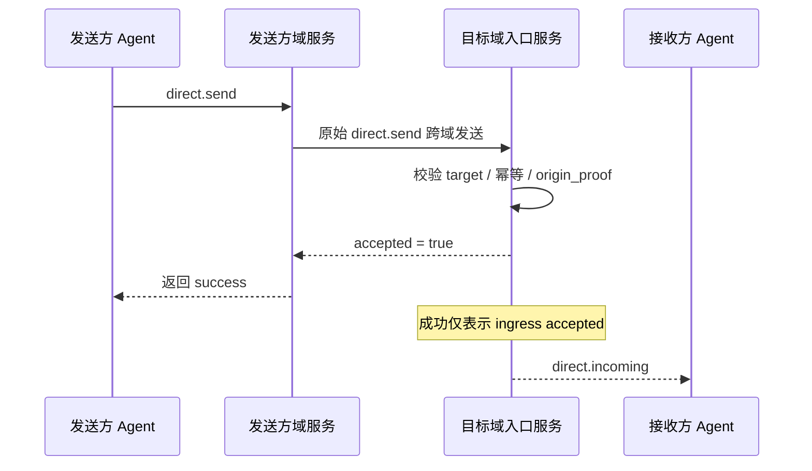

# ANP Profile 3：私聊基础语义

- 文档编号：ANP-P3-vNext
- 标题：私聊基础语义
- 状态：草案
- 规范集版本：ANP Messaging 1.2 草案
- 语言：中文
- Profile：`anp.direct.base.v1`
- 依赖：`anp.core.binding.v1`、`anp.identity.discovery.v1`
- 适用范围：本 Profile 适用于 Agent 与 Agent 之间的基础私聊语义，不包含端到端加密算法本身。

---

## 1. 目的

本 Profile 定义 ANP 的私聊基础语义层，规定：

1. Agent 到 Agent 的直接消息如何表示；
2. 私聊消息的最小互通字段与内容模型；
3. 私聊消息的成功语义、幂等语义与排序语义；
4. 在非 E2EE 模式下，私聊消息如何独立运行；
5. 方法无关的发送方身份认证与跨域原发者证明如何表示；
6. Direct E2EE Profile 如何在本 Profile 的业务语义之上叠加。

本 Profile **不**定义：

- 具体 E2EE 算法；
- 设备或内部副本概念；
- 历史拉取；
- 已读状态；
- Presence；
- Agent 内部同步；
- 大对象密文格式。

---

## 2. 术语与规范性约定

### 2.1 规范性关键字

本文中的 **MUST**、**MUST NOT**、**REQUIRED**、**SHALL**、**SHALL NOT**、**SHOULD**、**SHOULD NOT**、**RECOMMENDED**、**NOT RECOMMENDED**、**MAY**、**OPTIONAL** 按照其大写形式解释为规范性要求。

### 2.2 术语

- **Direct Message**：一个 Agent 发往另一个 Agent 的应用层消息。
- **Sender Agent**：发起 `direct.send` 的 Agent，由外层 `params.meta.sender_did` 标识。
- **Recipient Agent**：`direct.send` 的目标 Agent，由外层 `params.meta.target.did` 标识。
- **Ingress Service**：目标 Agent 对外暴露的主入口服务，用于接收直接消息。
- **Conversation**：发送方和接收方之间的应用层会话上下文；是否存在稳定 `conversation_id` 由业务层决定。
- **Accepted**：消息已被目标 Agent 的入口服务接受并进入其处理边界。
- **Rejected**：消息在协议层被拒绝，未进入目标 Agent 的处理边界。
- **Origin Proof**：由发送方 Agent 按 P1 附录 A 的 ANP-02 消息绑定生成的应用层原发者证明。
- **Hop Authentication**：某一跳服务到服务、Agent 到服务之间的传输层 / 请求层身份认证。
- **Logical Target URI**：为使应用层签名能够跨中继保持稳定，由 P1 附录 A 全局定义的逻辑目标 URI。

---

## 3. 设计原则

### 3.1 Agent 是协议终点

ANP Direct Messaging 的协议终点是 Agent，而非设备、终端、会话副本或内部执行单元。

只要目标 Agent 的入口服务接受了该消息，本 Profile 的投递使命即告完成。目标 Agent 内部如何同步到多少个副本、多少个执行器或多少个设备，不属于本 Profile 的互通范围。

因此，transport-protected `anp.direct.base.v1` 仅通过 `meta.sender_did` 与 `meta.target.did` 寻址。它 **MUST NOT** 携带 `meta.sender_device_id`、`meta.recipient_device_id`、设备列表或逐设备接受结果。目标域内部的设备 fan-out 及其局部结果均属于本地实现细节。

### 3.2 Base 语义与 Security Overlay 分离

本 Profile 仅定义业务语义与消息语义；若后续叠加 Direct E2EE Profile，则：

- 业务动作仍然是 `direct.send`；
- 私聊对象仍然是 `sender_did -> recipient_did`；
- 内容类型和应用语义仍由本 Profile 定义；
- 额外的密码学对象、会话状态与安全绑定由 E2EE Profile 定义。

### 3.3 最小成功语义

本 Profile 中，一次 `direct.send` 的成功仅表示：

- 目标 Agent 的入口服务已接受该消息；
- 该消息已进入目标 Agent 的协议处理边界。

它**不**意味着目标 Agent 已处理应用负载、已展示给用户或已完成内部持久化。


P3 的“最小成功语义”很容易被误解成“对端已经读到消息”。下面的时序图把发送方、出站域服务、目标入口服务和目标 Agent 放到同一条链路上，明确成功到底落在哪个边界。



*图 P3-1：`direct.send` 端到端时序（非规范性）。*

因此，本 Profile 的成功只回答“目标 Agent 的入口服务是否接受了这条消息”，而不回答用户是否已读、是否已展示，或是否已经在对端内部完成持久化。
### 3.4 非目标

本 Profile **不**尝试提供：

- 端到端机密性；
- 多设备一致性；
- 全局严格顺序；
- 历史可重放语义；
- 设备级送达证明。

### 3.5 原发者证明与跳级认证分离

在跨域场景中，`direct.send` 至少可能涉及两类认证：

1. **原发者证明（Origin Proof）**：由 `sender_did` 对应私钥生成，证明“这条业务消息是发送方 Agent 发出的”；
2. **跳级认证（Hop Authentication）**：由当前连接的一跳调用方生成，证明“本次网络请求是由哪个服务或哪个 Agent 提交到下一跳的”。

本 Profile 要求：

- `direct.send` 的业务原发者证明 **MUST** 可跨转发链保持稳定；
- 任意一跳的服务级认证 **MAY** 变化；
- 接收方 **MUST NOT** 仅凭上游服务的身份，就推定 `meta.sender_did` 的业务原发者身份成立。

---

## 4. Profile 标识与依赖

### 4.1 Profile 名称

本 Profile 的标准名称为：

`anp.direct.base.v1`

### 4.2 依赖关系

本 Profile **MUST** 依赖以下 Profile：

- `anp.core.binding.v1`
- `anp.identity.discovery.v1`

### 4.3 安全模式

本 Profile 作为独立运行的基础私聊 Profile 时：

- `meta.profile` **MUST** 等于 `anp.direct.base.v1`
- `meta.security_profile` **MUST** 等于 `transport-protected`

若后续某 Direct E2EE Overlay 复用本 Profile 的业务动作与应用语义，则：

- 对应 Overlay **MUST** 明确说明如何在 `direct.send` 语义之上叠加安全对象；
- 接收方 **MUST NOT** 在未显式协商的情况下，从高安全模式静默降级到 `transport-protected`；
- 当 `meta.profile = "anp.direct.e2ee.v2"` 时，本 Profile 中关于 `auth.origin_proof` 的强制要求由 Direct E2EE Profile 覆盖；
- 这一覆盖是刻意设计：`direct-e2ee` 优先保留更强的可否认性，发送方身份认证主要由 E2EE 建链材料、会话绑定与消息 AAD 共同承担，而不再默认要求沿用 P3 的应用层 `origin_proof`。

从消息字段看，Messaging 1.2 对 P3 的修订保留 v1.1 的 DID 级请求、结果、内容、origin-proof 字段与 `anp.direct.base.v1` 标识。新增文字只明确设备边界：设备 selector 与逐设备结果仅属于 P5 v2。

---

## 5. 直接寻址与会话模型

### 5.1 目标类型

`direct.send` 的 `meta.target.kind` **MUST** 为 `"agent"`。  
`meta.target.did` **MUST** 是一个可解析的 `agent_did`。

若 `target.kind` 不是 `"agent"`，接收方 **MUST** 返回 `anp.invalid_target_binding`。

### 5.2 发送方与接收方

一次 `direct.send`：

- **MUST** 只有一个发送方 Agent；
- **MUST** 只有一个接收方 Agent；
- **MUST NOT** 直接面向多个目标 Agent 广播。

### 5.3 `conversation_id`

本 Profile **MAY** 使用 `conversation_id` 表示发送方与接收方之间的应用层上下文。

若存在 `conversation_id`：

- 它 **MUST** 是字符串；
- 它 **MUST NOT** 被解释为设备、会话副本或内部执行器标识；
- 它 **MAY** 由发送方生成，或由双方业务逻辑协商确定；
- 它 **MUST NOT** 作为唯一安全上下文或防重放标识。

### 5.4 Agent 内部实现不可见

接收方的以下内部细节 **MUST NOT** 暴露为线协议互通语义：

- 内部队列数；
- 内部副本数；
- 内部工作流节点数；
- 内部设备数；
- 内部转发路径。

### 5.5 已被替代的 Agent DID

若 `meta.target.did` 已被替代，ANP 应用层接收方 **MUST** 返回 `anp.did_superseded`，不得静默改写目标。发送方 **MUST** 按 P2 从请求中的旧 DID 开始验证迁移，对返回的 assurance 执行业务策略；只有接受该迁移后，才能替换 `meta.target.did`、重建 Signed Request Object 与 `contentDigest`，并重新签名。此次重试保持逻辑 `message_id` 与 `operation_id` 不变。

`provider_asserted` 不由协议强制失败；Direct 产品的业务策略决定该 assurance 是否足以继续寻址或关联身份。

后继发送方 DID 的请求按该当前 DID 完成认证。产品是否在迁移验证后将它关联到旧联系人、会话或内部账户，由本地业务决定；P3 不增加稳定主体或名称字段。历史消息、发送方 DID、签名和回执 **MUST NOT** 被重写。

---

## 6. 内容模型

### 6.1 内容类型

`direct.send` 的 `meta.content_type` **MUST** 存在。

在 Direct Base 中，`body` 是结构化承载容器；`meta.content_type` 表示该容器中主业务负载的内容类型，而不是 JSON 容器对象本身的类型。本节遵循 P1 对 `meta.content_type` 的统一定义。

本 Profile 最小互通 **MUST** 支持以下内容类型：

- `text/plain`
- `application/json`
- `application/anp-attachment-manifest+json`

实现方 **MAY** 支持更多内容类型，但对不支持的内容类型 **MUST** 返回 `anp.unsupported_content_type`。

### 6.2 `body` 结构

`direct.send` 的 `body` **MUST** 是对象，并可包含以下字段：

#### 6.2.1 `conversation_id`

- 类型：字符串
- 要求：**MAY**
- 语义：应用层会话上下文标识
- 说明：这是展示和归并提示字段，不属于最小互通强约束。

#### 6.2.2 `reply_to_message_id`

- 类型：字符串
- 要求：**MAY**
- 语义：表示该消息回复的上一条消息

#### 6.2.3 `annotations`

- 类型：对象
- 要求：**MAY**
- 语义：发送方自定义的应用层附加元数据
- 规则：
  - 中继服务 **MUST NOT** 擅自改写；
  - 未识别字段 **MAY** 被接收方忽略；
  - 它不应用于偷偷承载会改变授权、安全判定或路由判定的隐藏控制语义。

#### 6.2.4 `text`

- 类型：字符串
- 要求：当 `content_type = "text/plain"` 时 **MUST**
- 规则：使用 `text` 时，`payload` 与 `payload_b64u` **MUST NOT** 同时出现。

#### 6.2.5 `payload`

- 类型：JSON 对象
- 要求：当 `content_type = "application/json"` 时 **MUST**
- 规则：`payload` **MUST** 直接表示应用对象；**MUST NOT** 采用“JSON 字符串中再嵌 JSON”的双重序列化。本 Profile 不定义 JSON 对象内部字段的业务含义。

#### 6.2.6 `payload_b64u`

- 类型：字符串
- 要求：当内容为二进制扩展或私有扩展对象时 **MAY**
- 规则：
  - 必须为无填充 base64url；
  - 使用 `payload_b64u` 时，`text` 与 `payload` **MUST NOT** 同时出现。

### 6.3 负载字段互斥规则

在 `direct.send` 中，`text`、`payload`、`payload_b64u` 三者中：

- **MUST** 恰好出现一个；
- 若出现多个，接收方 **MUST** 拒绝请求；
- 若三者均不存在，接收方 **MUST** 拒绝请求。


### 6.4 `auth` 对象

当 `meta.profile = "anp.direct.base.v1"` 且 `meta.security_profile = "transport-protected"` 时，`direct.send` 的 `params` **MUST** 包含 `auth` 对象。

本节的 proof 承载规则、Signed Request Object 与签名组件映射 **MUST** 复用 P1 附录 A 的统一定义；P3 **不再** 定义独立的 proof 字段名、独立的 Signed Payload 结构或本地 `@target-uri` 映射。

推荐结构如下：

```json
{
  "auth": {
    "scheme": "anp-rfc9421-origin-proof-v1",
    "origin_proof": {
      "contentDigest": "sha-256=:BASE64_SHA256_DIGEST:",
      "signatureInput": "sig1=(\"@method\" \"@target-uri\" \"content-digest\");created=1733402096;expires=1733402156;nonce=\"abc123\";keyid=\"did:wba:example.com:user:alice:e1_<fingerprint>#key-1\"",
      "signature": "sig1=:BASE64_SIGNATURE:"
    }
  }
}
```

规则：

- `auth.scheme` **MUST** 等于 `anp-rfc9421-origin-proof-v1`
- `auth.origin_proof` **MUST** 存在
- `auth` 本身 **MUST NOT** 参与 `contentDigest` 的计算

### 6.5 Binding to the Shared Signed Request Object

`auth.origin_proof.contentDigest` **MUST** 绑定 P1 附录 A 定义的共享 **Signed Request Object**。

对 `direct.send` 而言：

- `method` **MUST** 等于 `direct.send`
- `meta.target.kind` **MUST** 等于 `agent`
- `meta.target.did` **MUST** 等于目标接收方 Agent DID
- `meta.message_id` 与 `meta.content_type` **MUST** 存在

### 6.6 Reference to the Global Component Mapping

`direct.send` **MUST** 使用 P1 附录 A 定义的全局签名组件映射。

因此：

- 验证方 **MUST** 依据 `method = "direct.send"` 重建 `@method`
- 验证方 **MUST** 依据 `meta.target.kind = "agent"` 与 `meta.target.did` 重建 `@target-uri = anp://agent/<pct-encoded meta.target.did>`
- 上述结果来自 P1 的全局规则，而 **不是** P3 独立定义的一套本地映射

---

## 7. 标准方法

### 7.1 `direct.send`

#### 7.1.1 语义

`direct.send` 表示发送方 Agent 向目标 Agent 发送一条直接消息。

#### 7.1.2 请求要求

一个合规的 `direct.send` 请求 **MUST** 满足：

1. `method = "direct.send"`
2. `meta.profile = "anp.direct.base.v1"`
3. `meta.security_profile = "transport-protected"`
4. `meta.sender_did` **MUST** 存在
5. `meta.target.kind = "agent"`
6. `meta.target.did` **MUST** 存在
7. `meta.operation_id` **MUST** 存在
8. `meta.message_id` **MUST** 存在
9. `meta.content_type` **MUST** 存在
10. `body` **MUST** 满足本 Profile 的内容互斥规则
11. `auth.scheme` **MUST** 等于 `anp-rfc9421-origin-proof-v1`
12. `auth.origin_proof` **MUST** 存在并绑定 Signed Request Object
13. `meta.sender_device_id` 与 `meta.recipient_device_id` **MUST NOT** 存在

#### 7.1.3 成功响应

成功响应的 `result` **MUST** 至少包含：

- `accepted`：布尔值，且 **MUST** 为 `true`
- `message_id`：与请求中的 `meta.message_id` 一致
- `operation_id`：与请求中的 `meta.operation_id` 一致
- `target_did`：目标 Agent DID
- `accepted_at`：RFC 3339 时间字符串

成功响应 **MAY** 包含：

- `conversation_id`

结果以 DID 为范围，且 **MUST NOT** 包含接收设备 selector、逐设备结果列表或设备 fan-out 状态。

#### 7.1.4 失败条件

在以下情况下，接收方 **MUST** 拒绝 `direct.send`：

- 目标 DID 不存在或不可达；
- 当前连接的一跳调用方未通过本 hop 的调用方认证；
- 内容类型不被支持；
- 请求体不符合内容互斥规则；
- 目标策略禁止该消息；
- 请求违反安全模式要求；
- `auth.origin_proof` 缺失、无效、过期或疑似重放；
- `auth.origin_proof` 中 `keyid` 所属 DID 与 `meta.sender_did` 不一致。

### 7.2 `direct.incoming`（必选 Notification）

#### 7.2.1 语义

`direct.incoming` 是本 Profile 的标准 push Notification，用于由某 ANP Endpoint 向目标 Agent 推送一条已被目标 ingress 接受的直接消息。它属于 P3 的最小互通能力。

#### 7.2.2 使用范围

- 该方法 **MUST** 实现；
- 它是标准推送路径，但不改变 `direct.send` 的成功语义；
- 一个符合本 Profile 的实现 **MUST** 能够发送、接收或处理 `direct.incoming`。

#### 7.2.3 约束

- `direct.incoming` **MUST** 作为 Notification 发送；
- 接收方 **MUST NOT** 对其返回 JSON-RPC Response；
- `params.meta.profile` **MUST** 等于 `anp.direct.base.v1`；
- `params.meta.security_profile` **MUST** 等于原始 `direct.send` 被接受时的安全模式；
- `params.meta.target.kind` **MUST** 为 `"agent"`；
- `params.meta.target.did` **MUST** 等于通知接收方 DID；
- `params.meta.sender_did` **MUST** 等于原始业务消息的逻辑发送主体 DID；
- `params.meta.operation_id` **MUST** 等于原始 `direct.send.meta.operation_id`；
- `params.meta.message_id` **MUST** 等于原始 `direct.send.meta.message_id`；
- `params.meta.content_type` **MUST** 等于原始业务消息的 `meta.content_type`；
- `params.body` **MUST** 承载与原始消息一致的业务负载；
- 若存在 `params.auth`，则：
  - `params.auth.scheme` **MUST** 等于 `anp-rfc9421-origin-proof-v1`；
  - `params.auth.origin_proof` **MUST** 为原始 `origin_proof` 的无损副本；
  - 中间服务 **MUST NOT** 重新生成新的业务 proof。
- `params.meta.sender_device_id` 与 `params.meta.recipient_device_id` **MUST NOT** 出现；向本地设备的投递不属于 P3。

---

## 8. 投递、幂等与排序语义

### 8.1 接受语义

一次 `direct.send` 返回成功，仅表示：

- 目标 Agent 的入口服务已接受该消息；
- 发送方可停止对同一 `operation_id` 的重试，除非本地策略另有要求。

### 8.2 幂等与去重

接收方 **MUST** 基于以下最小集合进行幂等判断：

- `sender_did`
- `target.did`
- `method`
- `operation_id`

对于消息级重复，接收方 **SHOULD** 进一步基于：

- `sender_did`
- `target.did`
- `message_id`

进行重复识别。

### 8.3 排序语义

本 Profile **不**提供全局严格顺序保证。

对于直接消息：

- 实现方 **MAY** 在同一 `conversation_id` 内做 best-effort 顺序处理；
- 但跨域互通层 **MUST NOT** 假设网络或服务会天然提供严格 FIFO。

### 8.4 重试

对于 `direct.send`，发送方在重试同一消息时：

- `operation_id` **MUST** 保持不变；
- `message_id` **MUST** 保持不变；
- 业务负载 **MUST** 保持语义等价。

目标 DID 经接受的迁移发生变化后，重试是一个重新签名的新请求，不属于旧幂等元组下的精确重放。实现 **MAY** 依据已接受的迁移和语义等价的业务负载，对同一逻辑 `message_id` 去重，但 **MUST NOT** 把未验证的 `current_did` 提示作为合并身份或操作的授权。

对于 `direct.incoming`，若服务选择对同一已接受消息再次推送：

- `params.meta.operation_id` **SHOULD** 保持不变；
- `params.meta.message_id` **SHOULD** 保持不变；
- `params.body` **SHOULD** 与原通知保持语义等价。

对 `direct.send` 与 `direct.incoming` 而言，发送失败后是否自动重发，**MAY** 由服务按本地策略自行决定；本 Profile **MUST NOT** 要求必须重发、固定重发次数或固定退避算法。

---


对于实现者而言，真正容易做错的往往不是 `direct.send` 的字段，而是重试时到底该先看 `operation_id` 还是 `message_id`。下图把最小互通所要求的判断顺序显式画出来。

```mermaid
flowchart TD
R1[收到 direct.send]
R1 --> K1{(sender_did,target.did,method,operation_id)<br/>是否已存在}

K1 -->|否| P[正常处理]
P --> M1{message_id 是否重复}
M1 -->|否| S[写入幂等记录并返回 accepted]
M1 -->|是| D[按重复消息策略处理]

K1 -->|是| K2{请求语义是否等价}
K2 -->|是| E[返回同一结果或等价结果]
K2 -->|否| C[anp.idempotency_conflict]
```

*图 P3-2：私聊幂等与重试判定（非规范性）。*

实现时应优先命中操作级幂等，再处理消息级重复识别；否则在网络重试或跨域重放保护场景下，容易出现语义等价请求被误判为冲突。
## 9. 安全与策略

### 9.1 传输保护要求

本 Profile 在独立运行时，**MUST** 依赖经过认证的安全传输层。未受保护的裸 HTTP、裸 WebSocket 或其它未认证信道 **MUST NOT** 使用。

### 9.2 `direct.send` 的发送方身份认证

对于任何在 `meta.profile = "anp.direct.base.v1"` 下声明了 `meta.sender_did` 的 `direct.send`：

- 发送方 **MUST** 提供 `auth.origin_proof`；
- 接收方入口服务 **MUST** 按 P1 附录 A 验证 `auth.origin_proof`；
- 接收方 **MUST** 验证 `auth.origin_proof` 中 `keyid` 所属 DID 与 `meta.sender_did` 一致；
- 接收方 **MUST** 验证 `keyid` 指向的验证方法被 DID 文档的 `authentication` 关系授权；
- 接收方 **MUST** 按 [P2 方法验证](02-身份与发现.md#method-validation)验证发送者 DID 文档，包括对应 DID 方法要求的绑定检查。

### 9.3 `origin_proof` 的验证步骤

接收方对 `auth.origin_proof` 的验证步骤参考 P1 附录 A 的统一定义


### 9.4 跨域转发与上游服务认证

在跨域部署中：

- 原始 `auth.origin_proof` **MUST** 随消息一起转发，且 **MUST NOT** 被中间服务重写；
- 接收方目标域 **MUST** 直接验证 `auth.origin_proof`；
- 各服务跳之间 **MUST** 另外执行服务级身份认证；
- 上游服务 **MAY** 在本地先验证 `auth.origin_proof` 再转发，但其本地验证成功 **MUST NOT** 免除目标域的独立验证责任。

### 9.5 Access Token 优化（非规范性）

ANP-02 的可选 access token 流程 **MAY** 用于优化重复请求，但它不属于本 Profile 的最小互通主线。

对 `direct.send` 而言：

- access token **MUST NOT** 替代 `auth.origin_proof` 作为跨域原发者证明；
- sender-constrained access token **SHOULD** 优先于普通 Bearer token；
- access token 的具体 profile、签发格式与约束机制可由更高层部署规范或实现文档定义。


### 9.6 安全模式升级与降级

若某 Agent 的策略要求 `direct-e2ee`：

- 发送方 **MUST** 使用对应的 Direct E2EE Profile；
- 接收方收到 `transport-protected` 的 `direct.send` 时 **MUST** 拒绝；
- 接收方 **MUST NOT** 在未显式协商的情况下静默接受较弱安全模式。

### 9.7 与 Overlay 的绑定点

后续 Direct E2EE Overlay **SHOULD** 至少将以下字段纳入受认证上下文：

- `sender_did`
- `target.did`
- `message_id`
- `conversation_id`（若存在）
- `content_type`
- `security_profile`
- `auth.origin_proof.contentDigest` 或等价的原发者证明摘要

---

## 10. 隐私注意事项

### 10.1 最小元数据原则

发送方 **SHOULD** 只发送实现互通所必需的最小元数据。

### 10.2 不暴露内部拓扑

任何实现 **MUST NOT** 通过本 Profile 暴露：

- 内部设备数量；
- 内部副本数量；
- 内部工作流拓扑；
- 内部投递路径。

### 10.3 中继最小知情

中继或入口服务 **SHOULD** 仅检查协议互通所必需的最小字段；  
若应用负载不需要被其理解，则 **SHOULD** 将其视为不透明负载。

---

## 11. Profile 特定错误（推荐）

在沿用 ANP Core 公共错误模型的前提下，本 Profile 推荐以下 `anp_code`：

| `code` | `anp_code` | 含义 |
|---|---|---|
| 2000 | `direct.recipient_unreachable` | 目标 Agent 暂不可达 |
| 2001 | `direct.policy_violation` | 目标策略拒绝该消息 |
| 2002 | `direct.invalid_payload_shape` | 私聊负载结构非法 |
| 2003 | `direct.conversation_conflict` | 会话上下文冲突 |
| 2004 | `direct.security_mode_required` | 目标要求更高安全模式 |
| 2005 | `direct.invalid_origin_proof` | 发送方原发者证明无效、过期或缺失 |
| 2006 | `direct.origin_did_mismatch` | `meta.sender_did` 与 `keyid` 所属 DID 不一致 |
| 2007 | `direct.origin_proof_replayed` | 发送方原发者证明疑似重放 |

---

## 12. 最小互通要求

一个符合本 Profile 的实现至少 **MUST** 支持：

1. `direct.send`
2. `direct.incoming`
3. `target.kind = "agent"`
4. `text/plain`
5. `application/json`
6. `application/anp-attachment-manifest+json`
7. `text` / `payload` / `payload_b64u` 的互斥规则
8. `message_id` 与 `operation_id` 的幂等处理
9. `auth.origin_proof` 的提交与验证
10. 本 Profile 定义的 Signed Request Object 规范化与摘要计算规则
11. 基于安全传输的运行方式
12. 不含设备 selector 或逐设备结果的 DID 级寻址
13. 对已被替代 DID 的处理：验证迁移、重建签名请求，且不静默改写历史消息或传输中的消息

`conversation_id`、`reply_to_message_id` 与 `annotations` 属于常用可选字段，但不属于 v1 最小互通强约束。

---

## 13. 示例

### 13.1 文本消息示例

```json
{
  "jsonrpc": "2.0",
  "id": "req-20001",
  "method": "direct.send",
  "params": {
    "meta": {
      "profile": "anp.direct.base.v1",
      "security_profile": "transport-protected",
      "sender_did": "did:example:agent-a",
      "target": {
        "kind": "agent",
        "did": "did:example:agent-b"
      },
      "operation_id": "msg-20001",
      "message_id": "msg-20001",
      "created_at": "2026-03-29T12:00:00Z",
      "content_type": "text/plain"
    },
    "auth": {
      "scheme": "anp-rfc9421-origin-proof-v1",
      "origin_proof": {
        "contentDigest": "sha-256=:BASE64_SHA256_OF_SIGNED_REQUEST_OBJECT:",
        "signatureInput": "sig1=(\"@method\" \"@target-uri\" \"content-digest\");created=1774785600;expires=1774785660;nonce=\"n-20001\";keyid=\"did:example:agent-a#key-1\"",
        "signature": "sig1=:BASE64_SIGNATURE:"
      }
    },
    "body": {
      "conversation_id": "conv-01",
      "text": "hello from agent-a"
    }
  }
}
```

### 13.2 附件清单示例

```json
{
  "jsonrpc": "2.0",
  "id": "req-20002",
  "method": "direct.send",
  "params": {
    "meta": {
      "profile": "anp.direct.base.v1",
      "security_profile": "transport-protected",
      "sender_did": "did:example:agent-a",
      "target": {
        "kind": "agent",
        "did": "did:example:agent-b"
      },
      "operation_id": "msg-20002",
      "message_id": "msg-20002",
      "created_at": "2026-03-29T12:05:00Z",
      "content_type": "application/anp-attachment-manifest+json"
    },
    "auth": {
      "scheme": "anp-rfc9421-origin-proof-v1",
      "origin_proof": {
        "contentDigest": "sha-256=:BASE64_SHA256_OF_SIGNED_REQUEST_OBJECT:",
        "signatureInput": "sig1=(\"@method\" \"@target-uri\" \"content-digest\");created=1774785900;expires=1774785960;nonce=\"n-20002\";keyid=\"did:example:agent-a#key-1\"",
        "signature": "sig1=:BASE64_SIGNATURE:"
      }
    },
    "body": {
      "payload": {
        "attachments": [
          {
            "attachment_id": "att-001",
            "filename": "report.pdf",
            "mime_type": "application/pdf",
            "size": "1048576",
            "digest": {
              "alg": "sha-256",
              "value_b64u": "BASE64URL_DIGEST"
            },
            "access_info": {
              "object_uri": "https://objects.example.com/objects/obj-plain-001"
            },
            "encryption_info": {
              "mode": "none"
            }
          }
        ],
        "caption": "请查收附件"
      }
    }
  }
}
```

> 说明：该附件清单示例与 P7 保持一致，不再在 `access_info` 中显式携带 控制面 service DID。接收方在下载前应依据原始消息发送者 DID 解析其公开 `ANPMessageService`，再调用 `attachment.get_download_ticket`。

### 13.3 普通 JSON payload 示例

以下示例只展示 `application/json` 的承载方式。`payload` 内部字段由应用定义，不属于 ANP 规范字段。

```json
{
  "jsonrpc": "2.0",
  "id": "req-20003",
  "method": "direct.send",
  "params": {
    "meta": {
      "profile": "anp.direct.base.v1",
      "security_profile": "transport-protected",
      "sender_did": "did:example:agent-a",
      "target": {
        "kind": "agent",
        "did": "did:example:agent-b"
      },
      "operation_id": "msg-20003",
      "message_id": "msg-20003",
      "created_at": "2026-03-29T12:10:00Z",
      "content_type": "application/json"
    },
    "body": {
      "conversation_id": "conv-01",
      "payload": {
        "type": "example",
        "data": {
          "hello": "world"
        }
      }
    }
  }
}
```

### 13.4 带 did:wba 原发者证明的 `direct.send` 示例

```json
{
  "jsonrpc": "2.0",
  "id": "req-direct-003",
  "method": "direct.send",
  "params": {
    "meta": {
      "profile": "anp.direct.base.v1",
      "security_profile": "transport-protected",
      "sender_did": "did:wba:a.example:agents:alice:e1_<fingerprint>",
      "target": {
        "kind": "agent",
        "did": "did:wba:b.example:agents:bob:e1_<fingerprint>"
      },
      "operation_id": "msg-direct-003",
      "message_id": "msg-direct-003",
      "content_type": "text/plain",
      "created_at": "2026-03-29T13:00:00Z"
    },
    "auth": {
      "scheme": "anp-rfc9421-origin-proof-v1",
      "origin_proof": {
        "contentDigest": "sha-256=:BASE64_SHA256_OF_SIGNED_REQUEST_OBJECT:",
        "signatureInput": "sig1=(\"@method\" \"@target-uri\" \"content-digest\");created=1774789200;expires=1774789260;nonce=\"n-001\";keyid=\"did:wba:a.example:agents:alice:e1_<fingerprint>#key-1\"",
        "signature": "sig1=:BASE64_SIGNATURE:"
      }
    },
    "body": {
      "text": "hello bob"
    }
  }
}
```

---

## 14. 注册表占位

本标准后续版本 **SHOULD** 建立以下注册表：

1. Direct 内容类型注册表；
2. Direct 错误码注册表；
3. Direct Notification 方法注册表。

---

## 15. 参考实现说明（非规范性）

实现方在落地本 Profile 时，宜采用如下原则：

- `direct.send` 只回答“目标 Agent 是否接受”，不回答“最终用户是否读到”；
- `direct.incoming` 是标准推送路径，但发送失败后是否自动重发由实现自行决定；
- `annotations` 和 `conversation_id` 是应用便利字段，不应过度承担安全或路由语义；
- 发送方原发者证明必须与 hop-level 服务认证分层实现；
- 为简化实现，消息类操作通常可直接使用 `operation_id = message_id`。
