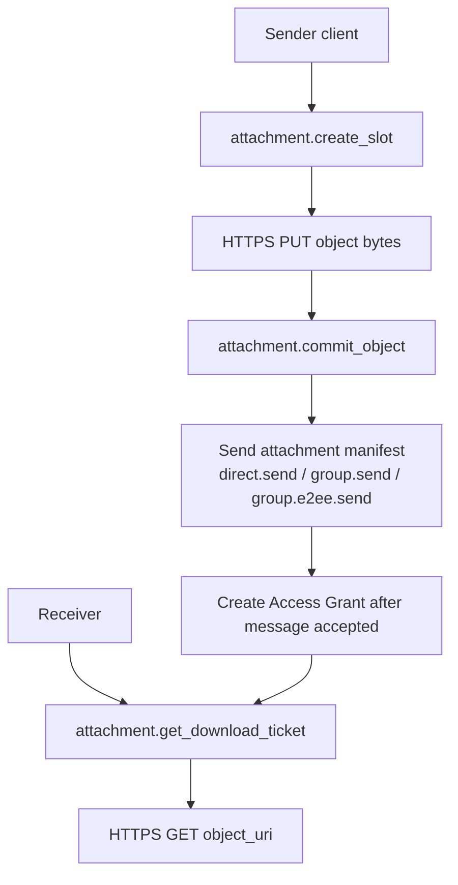
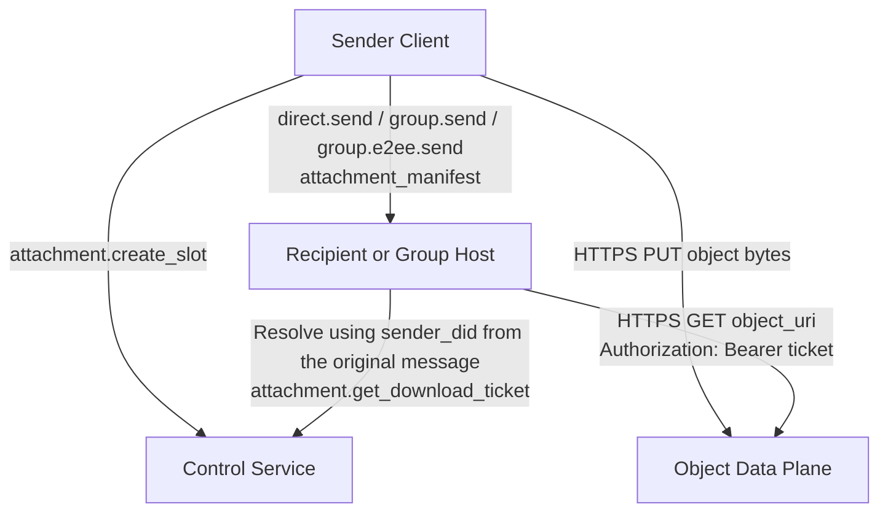
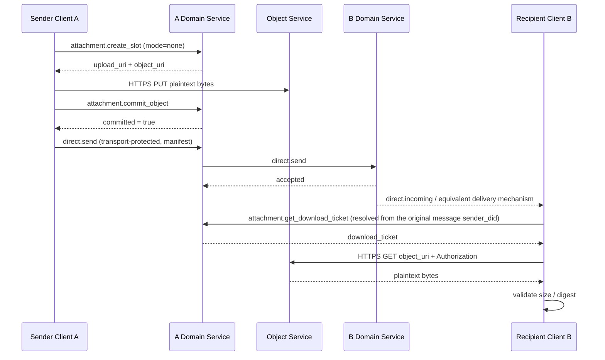
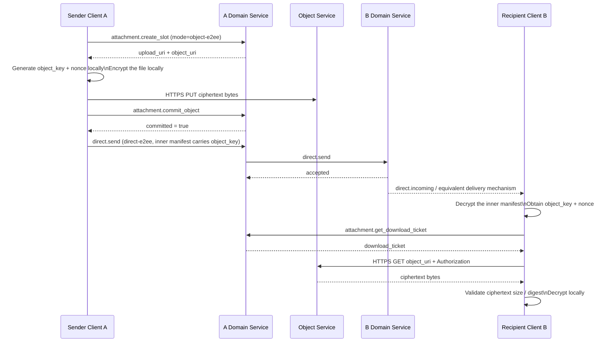
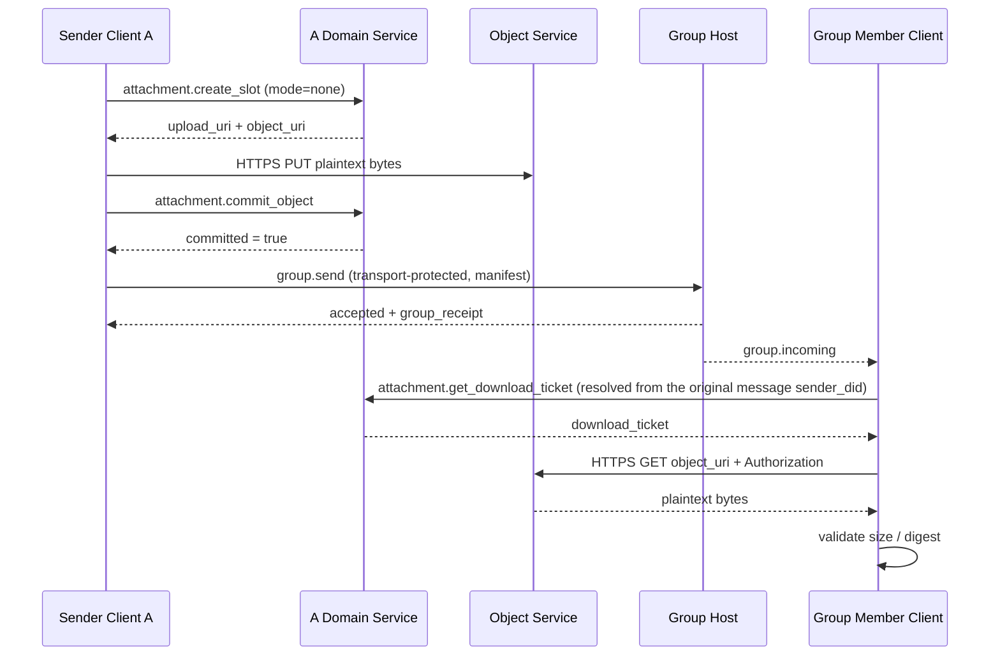
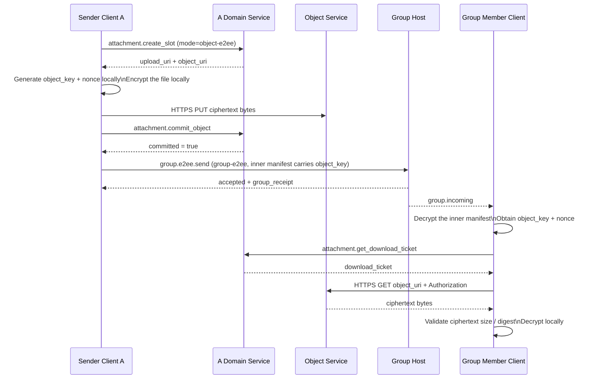
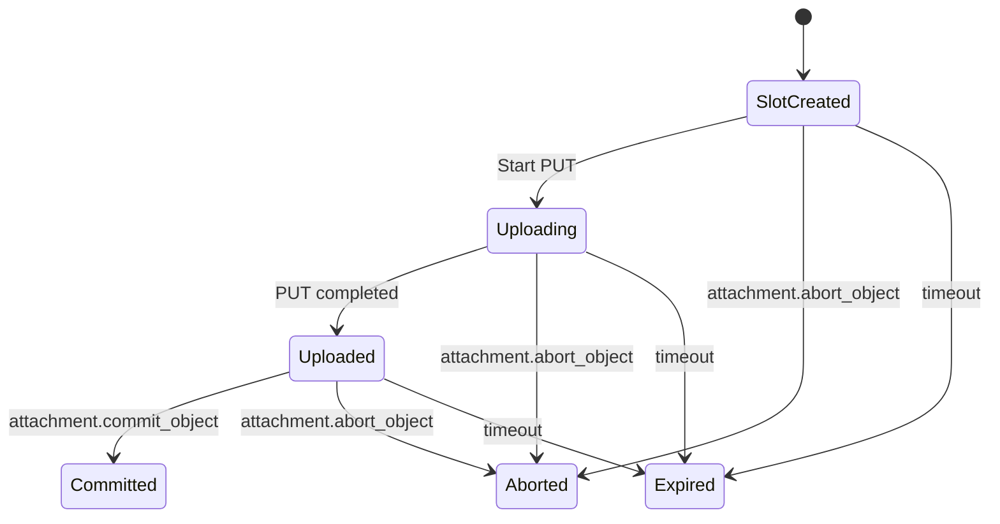

# ANP Profile 7: Attachments and Object Transfer (vNext Draft)

- Document ID: ANP-P7-vNext
- Title: Attachments and Object Transfer
- Status: Draft
- Specification Set: ANP Messaging 1.2 Draft
- Language: English
- Applicability: This draft preserves the v1.1 attachment and object lifecycle while defining its multi-device boundary: ordinary attachment operations remain DID-scoped, and device-bound encrypted delivery belongs to P5 or P6.

---

## 1. Purpose

This Profile defines the Attachments and Object Transfer semantics of ANP, stipulating:

1. How to express attachments in direct messaging and group messaging;
2. How to carry unified `attachment_manifest` in non-E2EE and E2EE messages;
3. How to split attachment transmission into three layers: message plane, control plane, and data plane;
4. How to upload and download object content through independent HTTPS channels;
5. How to reduce the risk of link leakage through object location URI, short-term Download Ticket and Object-Level Encryption;
6. How to perform integrity verification, access control and Object-Level Encryption on the object content;
7. How attachment objects and Download Tickets remain DID-scoped while P5 and P6 own device-bound encrypted delivery;
8. How to keep the v1 solution clear, simple, and implementable.

This Profile does not define:

- Internal implementation of object storage;
- Object review and risk control strategies;
- Specific cryptographic issuance format for object Download Ticket;
- object byte stream cross-domain call link forwarding through ANP;
- `service-managed` object encryption mode;
- `wrapped_object_key`, file-level key agreement protocol, direct link download, mirror URI, inline Download Ticket and other forked paths;
- Dedicated thumbnail sub-objects and dedicated chunked list objects.
- Device-specific attachment fields, per-device Download Tickets, or a per-device object lifecycle.

---

This Profile applies to `did:wba`, `did:web`, and other supported DID methods; identity resolution and validation follow [P2](02-identity-and-discovery.md#method-validation).

## 2. Terminology and Normative Keywords

In this article, **MUST**, **MUST NOT**, **REQUIRED**, **SHALL**, **SHALL NOT**, **SHOULD**, **SHOULD NOT**, **RECOMMENDED**, **NOT RECOMMENDED**, **MAY**, **OPTIONAL** are interpreted as normative requirements in their capitalized form.

Definition of terms:

- **Attachment**: External object referenced through ANP message, its content can be a file, image, audio, video or any byte stream.
- **Object**: The actual byte content corresponding to the attachment.
- **Attachment Message**: ANP message with one or more `attachment_manifest` as primary payload.
- **Attachment Manifest**: A structured object that describes the object's location, summary, size, media properties, and encryption properties.
- **Object Service**: Responsible for the service of attachment control plane and object data plane.
- **Control Plane**: The plane where `attachment.create_slot`, `attachment.commit_object`, `attachment.abort_object`, `attachment.get_download_ticket` and other protocol methods are located.
- **Data Plane**: The plane on which object bytes are transferred via independent HTTPS PUT/GET.
- **Message Plane**: `direct.send`, `group.send`, or `group.e2ee.send` carry the `attachment_manifest` plane.
- **Upload Slot**: The temporary upload capability and metadata place applied by the sender for uploading objects.
- **Committed Object**: An object that has been uploaded and can be referenced by messages.
- **Object URI**: Object location URI. In v1, it is a locator-style HTTPS resource address, which is not equivalent to a public direct link.
- **Download Ticket**: Temporary access ticket used when the object is downloaded.
- **Access Grant**: The download authorization record established by the sender service for an attachment after the attachment message is successfully sent.
- **Object-Level Encryption**: Encryption of object contents performed locally by the sender, rather than relying solely on transport-layer confidentiality.
- **Object Key**: A random symmetric key generated individually by the sender for an object.
- **Nonce**: Nonce used with object encryption; length fixed to 12 bytes in v1 MTI.

---

## 3. General Design Principles and v1 Consolidation Decisions

### 3.1 Three-layer separation

Attachment transfers **MUST** be understood as three planes:

1. **Message side**: only responsible for sending `attachment_manifest` to the recipient;
2. **control plane**: only responsible for applying for upload slots, submitting objects, discarding objects, and issuing Download Ticket;
3. **data plane**: Only responsible for PUT/GET object bytes.

These three levels of responsibilities **MUST NOT** be confused. Especially:

- Control-Plane Methods is not responsible for sending attachments to the recipient;
- The message plane is not responsible for relaying object bytes;
- data plane is not responsible for business message delivery.

### 3.2 v1 mainline path

The standard mainline path **MUST** for v1 is:

1. The sender calls `attachment.create_slot`;
2. If Object-Level Encryption is enabled, the sender first encrypts the file locally;
3. The sender uploads the object bytes through independent HTTPS `PUT`;
4. The sender calls `attachment.commit_object`;
5. The sender sends the attachment list through `direct.send`, `group.send`, or `group.e2ee.send`, as defined by the enclosing Profile;
6. The receiver parses the public `ANPMessageService` based on the original message sender's DID carrying the attachment list, and obtains Download Ticket through `attachment.get_download_ticket`;
7. The receiver downloads the object through independent HTTPS `GET object_uri` and carries ticket in the `Authorization` header;
8. The receiver verifies the digest; if the object has `object-e2ee` enabled, then perform decryption and post-decryption verification.

Before entering the concrete control-plane methods, the following overview connects the message plane, control plane, and data plane. It helps readers distinguish the three stages of "object exists", "message has been sent", and "download has been authorized" when reading the scenarios in Section 5.



*Figure P7-1: Overview of attachment three-plane flow and authorization chain (non-normative).*

This diagram emphasizes that `create_slot` / `commit_object` only create the object. What actually makes it downloadable to the receiver is the Access Grant established after the attachment message is accepted, followed by the download-ticket flow.

### 3.3 Only keep two object modes

In v1, `encryption_info.mode` **MUST** only allows the following two values:

- `none`
- `object-e2ee`

`service-managed` **MUST NOT** appear in the protocol field.

Server-side disk encryption, KMS, object warehouse static encryption, etc. are all implementation details, and **MUST NOT** be modeled as a protocol interoperability mode.

### 3.4 Separation of message security and object security

There are two levels of security for attachments:

1. **Message Security**: Determined by `transport-protected`, `direct-e2ee`, and `group-e2ee` that carry the list;
2. **Object Security**: Determined by `encryption_info.mode`.

The rules for v1 are:

- Attachment objects **MUST** use `mode = "none"` under `transport-protected` hosting;
- Attachment object **MAY** use `mode = "none"` or `mode = "object-e2ee"` under `direct-e2ee` or `group-e2ee` hosting.

### 3.5 Object Keys Are Delivered Only Through E2EE Manifests

When `mode = "object-e2ee"`:

- `object_key_b64u` and `nonce_b64u` **MUST** only appear in the list of attachments protected by `direct-e2ee` or `group-e2ee`;
- `object_key_b64u` and `nonce_b64u` **MUST NOT** appear in the control plane request of `attachment.create_slot` or `attachment.commit_object`;
- v1 **undefined** Separate file-level key agreement protocol.

### 3.6 v1 Explicitly removed forked paths

In order to keep v1 clear, simple, and implementable, the following paths are **not** allowed to enter this Profile:

- `service-managed`
- `wrapped_object_key_b64u`
- `key_wrap_alg`
- Inline Download Ticket
- Custom ticket transport header negotiation
- Permanent public direct link
- Mirror URI
- Specialized chunked list structure
- Dedicated thumbnail sub-object
- Relay object bytes through ANP business methods

### 3.7 Allowed Combination Matrix

| Bearing mode | `meta.security_profile` | Allowed `encryption_info.mode` | Can `object_key_b64u` appear in the list |
|---|---|---|---|
| Direct Base | `transport-protected` | `none` | No |
| Group Base | `transport-protected` | `none` | No |
| Direct E2EE | `direct-e2ee` | `none` / `object-e2ee` | Yes |
| Group E2EE | `group-e2ee` | `none` / `object-e2ee` | Yes |

### 3.8 Multi-device boundary

P7 retains the existing object and Ticket state machines and adds no device-addressing layer:

1. Ordinary attachment messages, control-plane requests, Access Grants, and Download Tickets are scoped by sender/requester DID plus the existing message, attachment, object, and Direct or Group context. They **MUST NOT** contain `sender_device_id`, `recipient_device_id`, `requester_device_id`, or another device selector.
2. One attachment object is uploaded once. Domain-local multi-device fan-out **MUST NOT** create a standard P7 object or Ticket per device.
3. P5 exclusively defines Direct E2EE device selection and per-device ciphertext delivery; P6 exclusively defines MLS device leaves and encrypted delivery. P7 defines only the inner attachment manifest and object-key fields, and devices **MUST NOT** share Ratchet or MLS private state to deliver them.
4. A deployment may use device context internally for authentication, routing, or authorization, but that context **MUST NOT** be serialized as a P7 wire field.

---

## 4. Profile identification and dependencies

### 4.1 Profile name

The standard name of this Profile is:

`anp.attachment.v1`

### 4.2 Dependencies

This Profile **MUST** depend on:

- `anp.core.binding.v1`
- `anp.identity.discovery.v1`

This Profile **MAY** be used in combination with the following Profiles:

- `anp.direct.base.v1`
- `anp.group.base.v2`
- `anp.direct.e2ee.v1`
- `anp.direct.e2ee.v2`
- `anp.group.e2ee.v1`
- `anp.group.e2ee.v2`

### 4.3 Security Profile

This Profile itself does not define new security profile, but reuses the business Profile that carries it:

- `transport-protected`
- `direct-e2ee`
- `group-e2ee`

---

## 5. Attachment Transfer Flow Diagrams

### 5.1 Overall hierarchical flow chart



### 5.2 Direct Messaging / Unencrypted Attachment



### 5.3 Direct Messaging / E2EE Attachments



### 5.4 Group Messaging / Unencrypted Attachment



### 5.5 Group Messaging / E2EE Attachments



---

## 6. Carriage Rules: Direct Messaging, Group Messaging, Encrypted, and Unencrypted

### 6.1 Carried in Direct Base

When the attachment list is sent in `anp.direct.base.v1` via `direct.send`:

- `meta.profile` **MUST** equal `anp.direct.base.v1`
- `meta.security_profile` **MUST** equal `transport-protected`
- `meta.content_type` **MUST** equal `application/anp-attachment-manifest+json`
- `body.payload` **MUST** be the Attachment Message object
- `auth.origin_proof` **MUST** exist and binds the entire Signed Direct Payload as required by P3
- where each `attachment_manifest.encryption_info.mode` **MUST** be equal to `none`

### 6.2 Carried in Group Base

When the attachment list is sent in `anp.group.base.v2` via `group.send`:

- `meta.profile` **MUST** equal `anp.group.base.v2`
- `meta.security_profile` **MUST** equal `transport-protected`
- `meta.content_type` **MUST** equal `application/anp-attachment-manifest+json`
- `body.payload` **MUST** be the Attachment Message object
- `auth.origin_proof` **MUST** exist and binds the entire Signed Group Payload as required by P4
- Successful Response **SHOULD** return `group_receipt`
- where each `attachment_manifest.encryption_info.mode` **MUST** be equal to `none`

### 6.3 Carried in Direct E2EE

When the attachment list is sent via `anp.direct.e2ee.v1` or `anp.direct.e2ee.v2`:

- Under the normal path after session establishment, the outer `meta.content_type` **MUST** be `application/anp-direct-cipher+json`
- If the first init carrying application message path allowed by P5 is used, the outer `meta.content_type` **MAY** be `application/anp-direct-init+json`
- Attachment list **MUST** appear as the inner business object of `Application Plaintext` before encryption
- Inner layer `application_content_type` **MUST** equal `application/anp-attachment-manifest+json`

### 6.4 Carried in Group E2EE

When the attachment list is sent via `group.e2ee.send` under `anp.group.e2ee.v1` or `anp.group.e2ee.v2`:

- Outer layer `meta.content_type` **MUST** fixed to `application/anp-group-cipher+json`
- Outer layer `body` **MUST NOT** directly appears the clear text attachment list
- Attachment list **MUST** appear as the inner business object of `Group Application Plaintext` before encryption
- Inner layer `application_content_type` **MUST** equal `application/anp-attachment-manifest+json`

### 6.5 Field ownership

- Direct Base and Group Base attachment messages use only the enclosing Profile's DID or Group DID addressing. P7 does not add a device selector.
- `attachment_message` and `attachment_manifest` contain no device identifier.
- A P5 v2 Direct E2EE envelope carries its required sender and recipient device fields; a P6 v2 MLS envelope carries its required device binding. Those outer fields are interpreted only by P5 or P6. A v1 E2EE envelope does not acquire device selectors through P7.
- `object_key_b64u` and `nonce_b64u` remain inside the encrypted attachment manifest. P7 does not introduce a separate per-device key-distribution request.

---

## 7. `attachment_message` and `attachment_manifest` objects

### 7.1 Attachment Message top-level structure

The recommended structure of Attachment Message is as follows:

```json
{
  "attachments": [
    {
      "attachment_id": "att-001",
      "filename": "report.pdf",
      "mime_type": "application/pdf",
      "size": "1048576",
      "digest": {
        "alg": "sha-256",
        "value_b64u": "BASE64URL_DIGEST"
      },
      "access_info": {
        "object_uri": "https://objects.example.com/objects/obj-001"
      },
      "encryption_info": {
        "mode": "none"
      }
    }
  ],
  "caption": "Attachment description",
  "primary_attachment_id": "att-001"
}
```

Rules:

- `attachments` **MUST** exist and is not empty
- `caption` **MAY** exist
- `primary_attachment_id` **MAY** exist; if it exists, **MUST** point to an existing `attachment_id` in `attachments`

### 7.2 `attachment_id` scope

- `attachment_id` **MUST** be unique within a single Attachment Message
- `attachment_id` **not guaranteed** to be globally unique across messages
- Any Download Ticket binding, authorization record, or audit record, **MUST** use `(message_id, attachment_id)` or `(object_uri, message_id, attachment_id)`, not just `attachment_id`

### 7.3 Single `attachment_manifest`

Each `attachment_manifest` **MUST** contain:

- `attachment_id`
- `mime_type`
- `size`
- `digest`
- `access_info`
- `encryption_info`

Each `attachment_manifest` **MAY** contain:

- `filename`
- `media_info`

Field description:

- `filename`: Display file name; **MAY**
- `mime_type`: MIME type of the original file; **MUST**
- `size`: Upload object byte size, decimal string; **MUST**
- `digest`: Upload object byte summary; **MUST**
- `access_info`: Object download positioning information; **MUST**
- `encryption_info`: Object-Level Encryption message; **MUST**
- `media_info`: Supplementary description of media objects such as pictures, audio and video; **MAY**

### 7.4 `digest`

`digest` **MUST** contain:

- `alg`
- `value_b64u`

Rules:

- `digest.alg` in v1 **MUST** fixed to `sha-256`
- `digest.value_b64u` **MUST** be the SHA-256 digest of the upload object bytes
- When `encryption_info.mode = "none"`, the digest corresponds to plaintext bytes
- When `encryption_info.mode = "object-e2ee"`, the digest corresponds to the ciphertext byte

### 7.5 `access_info`

The structure of `access_info` is as follows:

```json
{
  "object_uri": "https://objects.example.com/objects/obj-001"
}
```

Rules:

1. `object_uri` **MUST** be the `https://` URL
2. `object_uri` represents a locator-style object address in v1; it is not a permanent public direct link
3. The receiver **MUST** call `attachment.get_download_ticket` before downloading
4. The receiver **MUST** parse its public `ANPMessageService` based on the original message sender's DID carrying the attachment list.
5. In a group scenario, the above original message sender DID **MUST** be taken from the original group message sender carrying the attachment list (e.g. `group.incoming.meta.sender_did`)
6. `attachment.get_download_ticket` **MUST** be sent to the `serviceDid` corresponding to the sender’s public service.
7. When the receiver downloads, **MUST** initiate `GET` to `object_uri` and carries ticket in the `Authorization` header.
8. The caller **MUST NOT** only guesses the control plane service based on the URL domain name of `object_uri`

### 7.6 `media_info`

`media_info` is suitable for media objects such as pictures, audio, and video. Recommended fields:

- `width`
- `height`
- `duration_ms`
- `codec`

If numeric fields are present, **MUST** use decimal strings.

### 7.7 Thumbnails and chunking

v1 does not define a dedicated `thumbnail` field, nor does it define a dedicated `chunking_info` field.

If a thumbnail is required, the sender **SHOULD** send the thumbnail as a normal attachment.

If large files need to be uploaded in chunks, **SHOULD** be done internally within the HTTP upload implementation; this does not change the manifest structure of this Profile.

---

## 8. Object-Level Encryption

### 8.1 `encryption_info`

`encryption_info` **MUST** be one of the following two structures.

Unencrypted object:

```json
{
  "mode": "none"
}
```

Object-Level Encryption object:

```json
{
  "mode": "object-e2ee",
  "object_cipher": "chacha20-poly1305",
  "object_key_b64u": "BASE64URL_32_BYTES",
  "nonce_b64u": "BASE64URL_12_BYTES",
  "plaintext_size": "1048576"
}
```

Rules:

1. `mode` **MUST** take either `none` or `object-e2ee`
2. `mode = "none"` indicates that the sender did not locally encrypt the object content.
3. `mode = "object-e2ee"` means that the sender first encrypts the object locally and then uploads the encrypted text bytes.
4. Under `transport-protected` hosting, `mode` **MUST** be `none`
5. `object_key_b64u` and `nonce_b64u` **MUST NOT** appear in the list of attachments carried by `transport-protected`
6. `service-managed`, key wrapping algorithm, and file-level key agreement do not belong to this Profile

### 8.2 MTI algorithm of `object-e2ee`

The `object-e2ee` MTI algorithm **MUST** for v1 is:

- `object_cipher = "chacha20-poly1305"`
- `object_key_b64u`: 32-byte random symmetric key
- `nonce_b64u`: 12-byte random nonce
- `plaintext_size`: Original file length in bytes, decimal string

### 8.3 Sender encryption steps (normative)

When `encryption_info.mode = "object-e2ee"`, the sender **MUST** perform the following steps:

1. Read the original file bytes, recorded as `P`
2. Generate a new random 32-byte object key `K`
3. Generate a new random 12-byte nonce `N`
4. Let `AAD = empty byte string`
5. Calculate:

```text
C = ChaCha20-Poly1305-Encrypt(
      key = K,
      nonce = N,
      aad = "",
      plaintext = P
    )
```

6. The object bytes uploaded to the Object Service **MUST** be `C`
7. `attachment_manifest.size` **MUST** be a decimal string equal to `len(C)`
8. `attachment_manifest.digest` **MUST** equal `sha-256(C)`
9. `encryption_info.plaintext_size` **MUST** be a decimal string equal to `len(P)`
10. `mime_type` **MUST** continue to represent the MIME type of the original file, not the ciphertext object MIME type

Additional requirements:

- Each committed object **MUST** use a new random `K`
- Sender **MUST NOT** reuse the same `(K, N)` combination
- Even if the same file content is sent repeatedly, the sender **SHOULD** regenerate new `K` and `N`
- `object_key_b64u` **MUST NOT** taken directly from P5's ratchet key, also **MUST NOT** taken directly from P6's MLS epoch secret or other session key

### 8.4 `expected_size` and `plaintext_size`

Under `chacha20-poly1305` for v1 MTI:

- Upload object size = original file size + 16-byte authentication tag
- If the sender fills in `expected_size` in `attachment.create_slot`, the value **SHOULD** point to the upload object size, not the original file size
- If `mode = "object-e2ee"`, the sender **SHOULD** also saves the original file size locally so that `encryption_info.plaintext_size` can be written later

### 8.5 Receiver verification and decryption steps (normative)

When the receiver gets the object bytes:

1. **MUST** first verify that the downloaded byte length is equal to `attachment_manifest.size`
2. **MUST** calculate `sha-256(downloaded bytes)` and compare it with `attachment_manifest.digest`
3. If `encryption_info.mode = "none"`, it can be delivered to the upper layer after successful verification.
4. If `encryption_info.mode = "object-e2ee"`, the receiver **MUST** use:

```text
P = ChaCha20-Poly1305-Decrypt(
      key = object_key_b64u,
      nonce = nonce_b64u,
      aad = "",
      ciphertext = downloaded_bytes
    )
```

5. If decryption fails, the recipient **MUST** reject the attachment
6. If the decryption is successful, the receiver **MUST** verify whether `len(P)` is equal to `plaintext_size`
7. After passing the verification, the receiver can deliver the plaintext byte to the upper-layer business

### 8.6 Object key distribution rules

There is only one standard object key distribution path for v1:

- When the attachment message itself is protected by `direct-e2ee` or `group-e2ee`, the sender **MAY** directly puts `object_key_b64u` and `nonce_b64u` into the inner `attachment_manifest`
- After the receiver obtains the object key from the E2EE message, it then obtains ticket through control plane and downloads the ciphertext object through data plane.

This means:

- v1 **No need** to design a complex key agreement protocol separately for attachments
- In a group scenario, anyone who can decrypt the group messages can get the object key.
- v1 **Not Guaranteed** Retrospective withdrawal of rights; if members who are removed from the group have obtained the object key and object content before, this specification does not promise to erase the information they have obtained afterwards.

---

## 9. Access Authorization and Download Ticket

### 9.1 Ticket Targets

The goal of Download Ticket is not to absolutely prevent legitimate recipients from forwarding, but to:

1. Prevent third parties from directly downloading objects based only on the list
2. Prevent `object_uri` from becoming a long-term public link
3. Constrain download authorization to a clear requester and message context
4. Provide a starting point for implementing auditing, rate limiting and cancellation of object services

### 9.2 Access Grant semantics

`attachment.create_slot` and `attachment.commit_object` are **only** responsible for creating objects and do not grant download permission to any recipient.

When an object is available for download by the recipient of a message, **MUST** be determined by the Access Grant.

When the `direct.send`, `group.send`, or `group.e2ee.send` carrying the attachment is accepted by the sender service or Group Host, the sender-side system **MUST** create an Access Grant for each attachment.

Access Grant At least **MUST** bind:

- `message_id`
- `attachment_id`
- `object_uri`
- `message_security_profile`
- `message_target_did` in the context of direct messaging; or `group_did` in the context of group messaging

An Access Grant authorizes the target DID or Group context, not one local device. Domain-local device delivery remains an implementation detail.

### 9.3 Boundaries of `intended_target`

`attachment.create_slot.body.intended_target` is just a policy hint for the sender's upload phase.

`intended_target`:

- **MAY** be used for Object Service to make size, type or retention policy determinations in advance
- **MUST NOT** used solely as a basis for download authorization

The actual download authorization basis **MUST** come from the Access Grant sent successfully.

### 9.4 Ticket Binding

In v1, Download Ticket **MUST** bind at least the following context:

- `attachment_id`
- `object_uri`
- `requester_did`
- `message_id`
- `message_security_profile`
- `message_target_did` in the context of direct messaging; or `group_did` in the context of group messaging
- `expires_at`

The standard Ticket binding **MUST NOT** contain `requester_device_id` or another device selector. A deployment may use local device state before issuing a Ticket, but that state does not become a P7 wire or Ticket-binding field.

### 9.5 Ticket Lifetime and Usage

- Download Ticket **SHOULD** be short-term ticket
- The default validity period **SHOULD NOT** exceed 5 minutes
- For highly sensitive subjects **MAY** use disposable ticket
- Download Ticket **MUST** transmitted via HTTP `Authorization` header
- Download Ticket **MUST NOT** carried via URL query parameters

The fixed download method for v1 is:

```http
GET {object_uri}
Authorization: Bearer {download_ticket}
```

### 9.6 Ticket Issuance Validation

When the Object control service handles `attachment.get_download_ticket`, **MUST** check:

1. `meta.target.kind = "service"`
2. `meta.target.did` **MUST** be equal to the public `ANPMessageService.serviceDid` resolved from the sender DID of the original attachment message.
3. `requester_did = meta.sender_did`
4. The Access Grant corresponding to `(message_id, attachment_id, object_uri)` exists
5. `message_security_profile` is consistent with Access Grant
6. When direct messaging context is used, `message_target_did` exists and complies with the policy
7. When group messaging context is entered, `group_did` exists and `requester_did` currently still complies with the group access policy

P7 does not require a requester device selector for this validation. Any local device authentication remains outside the interoperable request.

### 9.7 Cross-service synchronization

v1 **Not separately standardized** Access Grant synchronization protocol between multiple internal services.

In the default v1 path, the Download Ticket is issued by the `ANPMessageService` exposed by the original sender of the attachment message. Whether that public service entry routes internally to an independent Object Service is an implementation detail. If the deployer separates the object-control component internally, the implementation **MUST** ensure that the externally exposed service can obtain the Access Grant required to issue the Download Ticket from local state or internal synchronization.

### 9.8 Access boundaries after member changes

v1 **Retroactive withdrawal is not guaranteed**.

This means:

- The Object Service **SHOULD** refuse to issue a new Download Ticket to a removed member based on the current group state
- However, if the object bytes, object key, or downloaded content has previously reached a legitimate member, this specification **does not promise** to subsequently revoke its acquired access capabilities

Another critical boundary in P7 is that object existence does not imply object downloadability. The following diagram connects object commitment, message acceptance, Access Grant creation, ticket issuance, and final download into one authorization chain so that implementers can correctly apply access control.

```mermaid
sequenceDiagram
participant S as Sender service
participant O as Object Service
participant M as Message plane
participant R as Receiver

S->>O: create_slot / commit_object
Note over S,O: Only creates the object; does not create download authorization

S->>M: direct.send / group.send / group.e2ee.send attachment manifest
M-->>S: message accepted
S->>S: Create Access Grant for each attachment

R->>S: attachment.get_download_ticket
S->>S: Validate requester_did + message_id + attachment_id + object_uri
S-->>R: download_ticket

R->>O: GET object_uri + Authorization
```

*Figure P7-2: Authorization chain for Access Grant and Download Ticket (non-normative).*

Therefore, authorization for `attachment.get_download_ticket` should depend on message context and Access Grants, rather than only on `object_uri` or only on `intended_target` left during the upload stage.

### 9.9 Historical Access Grants after an Agent DID transition

Historical `attachment_manifest` objects and Access Grants **MUST NOT** be rewritten when an Agent DID changes.

If a direct-message Access Grant names an earlier recipient DID and the current requester presents its successor DID, the Object Service **MAY** map the request to the same internal grant only after it verifies the P2 transition from the grant's DID to `requester_did` and the owning business policy accepts the returned assurance. Whether `provider_asserted` is sufficient to inherit historical attachment access is a business decision; P7 does not force acceptance or rejection.

The mapping is internal. P7 **MUST NOT** add a stable-subject field, name, transition chain, or device selector to the historical manifest, Access Grant, Ticket, or control-plane request. For a group attachment, authorization remains based on the current P4 v2 roster, group policy, and original message context.

---

## 10. Control-Plane Methods

### 10.1 General

The method in this section is used for object control plane. They **not** change `direct.send`, `group.send`, or `group.e2ee.send` Success Semantics.

These methods run by default on:

- `meta.profile = "anp.attachment.v1"`
- `meta.security_profile = "transport-protected"`

And adopts the following authentication model:

1. `attachment.create_slot`
2. `attachment.commit_object`
3. `attachment.abort_object`
4. `attachment.get_download_ticket`

All belong to **service-scoped** Control-Plane Methods.

Therefore:

- `meta.target.kind` **MUST** equal `service`
- `meta.target.did` **MUST** equal target public `ANPMessageService.serviceDid`
- Cross-domain outer-layer authentication is provided by P8 through `serviceDid + HTTP Message Signatures`
- v1 does **not** require the Object Service to re-verify the end recipient's `origin_proof`

These methods **MUST NOT** add `sender_device_id`, `recipient_device_id`, or `requester_device_id` to the P7 wire model. Internal device authentication and routing context remain private to the deployment.

A control-plane detail that implementers easily overlook is that Upload Slot and Committed Object are not the same state. The following diagram places creation, upload, commit, abort, and expiration on one lifecycle.



*Figure P7-3: Upload Slot / Object lifecycle (non-normative).*

Implementations should not interpret "obtaining an `object_uri`" as "the object can already be referenced by a message". Only after the object enters the `Committed` state does it become eligible for legal reference by an attachment manifest.

### 10.2 `attachment.create_slot`

#### 10.2.1 Semantics

Apply for an Upload Slot for the object to be uploaded.

#### 10.2.2 Request Requirements

This method **MUST** use:

- `meta.target.kind = "service"`
- `meta.target.did = target public ANPMessageService.serviceDid`

`body` **MUST** contain:

- `attachment_id`
- `intended_message_security_profile`
- `object_encryption_mode`

`body` **SHOULD** contain:

- `expected_size`
- `mime_type`

`body` **MAY** contain:

- `filename`
- `expected_digest`
- `intended_target`

Field rules:

- `attachment_id`: string
- `intended_message_security_profile`: `transport-protected` / `direct-e2ee` / `group-e2ee`
- `object_encryption_mode`: `none` / `object-e2ee`
- `expected_size`: Upload object size in bytes, decimal string
- `expected_digest`: Upload object byte summary
- `intended_target`: Object; the recommended structure is as follows:

```json
{
  "kind": "agent | group",
  "did": "did:example:..."
}
```

Constraints:

1. When `intended_message_security_profile = "transport-protected"`, `object_encryption_mode` **MUST** be `none`
2. When `object_encryption_mode = "object-e2ee"`, `expected_size` **SHOULD** correspond to the ciphertext byte size
3. `intended_target` is just a hint, **MUST NOT** alone constitutes authorization.

#### 10.2.3 Successful Response

A successful response **MUST** contain at least:

- `attachment_id`
- `slot_id`
- `upload_uri`
- `object_uri`
- `commit_token`
- `expires_at`

A successful response **MAY** contain:

- `upload_headers`

When the sender subsequently constructs `attachment_manifest.access_info`, `object_uri` **SHOULD** be directly taken from `attachment.create_slot` or `attachment.commit_object`'s Successful Response; before downloading, the receiver will follow the provisions of this Profile and discover the ticket service based on the DID of the original attachment message sender.

### 10.3 `attachment.commit_object`

#### 10.3.1 Semantics

Notify Object Service: The object has been uploaded and can be submitted as a referenceable object.

#### 10.3.2 Request Requirements

This method **MUST** use:

- `meta.target.kind = "service"`
- `meta.target.did = target public ANPMessageService.serviceDid`

`body` **MUST** contain at least:

- `attachment_id`
- `slot_id`
- `commit_token`
- `size`
- `digest`
- `object_encryption_mode`

`body` **MAY** contain:

- `plaintext_size`
- `media_info`

Rules:

1. `digest.alg` **MUST** equal `sha-256`
2. When `object_encryption_mode = "object-e2ee"`, `plaintext_size` **MUST** exist
3. `attachment.commit_object` **MUST NOT** transmit `object_key_b64u`
4. `attachment.commit_object` **MUST NOT** transmit `nonce_b64u`
5. `attachment.commit_object` success **not equal** The receiver has been authorized to download the object; the actual download authorization depends on the Access Grant after the subsequent message is successfully sent.

#### 10.3.3 Successful Response

A successful response **MUST** contain at least:

- `committed`
- `attachment_id`
- `object_uri`
- `committed_at`

Among them:

- `committed` **MUST** be `true`

### 10.4 `attachment.abort_object`

#### 10.4.1 Semantics

Terminate an upload slot that is incomplete or no longer needed.

#### 10.4.2 Request Requirements

This method **MUST** use:

- `meta.target.kind = "service"`
- `meta.target.did = target public ANPMessageService.serviceDid`

`body` **MUST** contain at least:

- `attachment_id`
- `slot_id`

#### 10.4.3 Successful Response

A successful response **MUST** contain at least:

- `aborted`
- `attachment_id`
- `aborted_at`

Among them:

- `aborted` **MUST** be `true`

### 10.5 `attachment.get_download_ticket`

#### 10.5.1 Semantics

When object access requires ticket, the receiver obtains temporary Download Ticket through this method.

#### 10.5.2 Request Requirements

This method **MUST** use:

- `meta.target.kind = "service"`
- `meta.target.did` **MUST** be equal to the public `ANPMessageService.serviceDid` resolved from the original attachment message sender DID

`body` **MUST** contain at least:

- `attachment_id`
- `object_uri`
- `requester_did`
- `message_security_profile`
- `message_id`

And add one according to the context:

- direct messaging Context: `message_target_did`
- group messaging Context: `group_did`

`body` **MAY** contain:

- `one_time`

This method defines no `requester_device_id` or equivalent device selector.

Field rules:

- `requester_did` **MUST** equal `meta.sender_did`
- `message_security_profile` refers to the message security profile that carries the attachment list, not the `meta.security_profile` called by control plane this time.
- `message_target_did` refers to the target Agent DID of the original direct messaging message
- `group_did` refers to the group DID to which the original group message belongs
- Before sending the ticket request, the caller **MUST** first parses its public `ANPMessageService` based on the original attachment message sender's DID; in the group scenario, the DID is taken from the original group message sender, not `group_did`

#### 10.5.3 Successful Response

A successful response **MUST** contain at least:

- `download_ticket_b64u`
- `expires_at`
- `ticket_binding`

`ticket_binding` **MUST** contain at least:

- `attachment_id`
- `object_uri`
- `requester_did`
- `message_id`
- `message_security_profile`

And add one according to the context:

- `message_target_did`
- `group_did`

`ticket_binding` **MUST NOT** add a device identifier.

---

## 11. Data-Plane Rules

### 11.1 Upload

The sender **MUST** initiate `PUT` to `upload_uri` using a separate HTTPS channel.

Rules:

- When `object_encryption_mode = "none"`, upload plain text stanza
- When `object_encryption_mode = "object-e2ee"`, upload ciphertext bytes
- Upload request **MAY** carry `upload_headers`
- Object bytes **MUST NOT** embedded in ANP's JSON-RPC business messages

### 11.2 Download

The receiver **MUST** initiate `GET` to `object_uri` using a separate HTTPS channel.

The fixed format is as follows:

```http
GET {object_uri}
Authorization: Bearer {download_ticket}
```

Object bytes **MUST NOT** be forwarded through ANP's cross-domain service invocation path as a regular forwarding channel.

The standard Bearer download request has no P7 device selector or device proof. Device-constrained ticket schemes, if any, require a separate Profile.

### 11.3 Verification after downloading

After the download completes, the receiver **MUST** perform at least the following checks:

1. Length verification
2. Digest verification
3. If `mode = "object-e2ee"`, perform decryption and `plaintext_size` verification

When any key check fails, the receiver:

- **MUST NOT** deliver the object to the higher-layer application as a valid attachment
- **SHOULD** log diagnostic information

---

## 12. Error Conditions and Recommended Error Codes

This Profile fixedly allocates the `6000-6013` code segment for the Attachments and Object Transfer error. When the server returns this error, `error.data.anp_code` **MUST** exist.

| `code` | `anp_code` | Meaning |
|---|---|---|
| 6000 | `anp.attachment.slot_not_found` | No available Upload Slot found, or `slot_id` does not match the current context |
| 6001 | `anp.attachment.slot_expired` | The Upload Slot has expired and cannot be uploaded, submitted or discarded |
| 6002 | `anp.attachment.commit_token_invalid` | The submission token is missing, illegal, failed to verify, or does not match the current object context |
| 6003 | `anp.attachment.object_too_large` | The object size exceeds the service limit, policy limit, or exceeds the allowed range |
| 6004 | `anp.attachment.unsupported_mime_type` | `mime_type` is not accepted by the current service or policy |
| 6005 | `anp.attachment.grant_not_found` | The corresponding Access Grant was not found, or the message was that the download authorization has not been established |
| 6006 | `anp.attachment.unauthorized_requester` | The current `requester_did` does not satisfy the download policy, target constraints, or group access constraints |
| 6007 | `anp.attachment.download_ticket_invalid` | Download Ticket is missing, illegal, failed to verify signature, cannot be parsed, or has been invalidated |
| 6008 | `anp.attachment.ticket_binding_mismatch` | Download Ticket The bound object, message, or requester context is inconsistent with the actual request |
| 6009 | `anp.attachment.ticket_expired` | Download Ticket has expired |
| 6010 | `anp.attachment.digest_mismatch` | The object digest after uploading or downloading is inconsistent with the expected digest |
| 6011 | `anp.attachment.decrypt_failed` | `object-e2ee` Object decryption failed |
| 6012 | `anp.attachment.object_unavailable` | The object has not been submitted, has been abandoned, has been cleaned, or is temporarily unavailable |
| 6013 | `anp.attachment.encryption_policy_violation` | The combination of object encryption mode and message security profile is illegal, or violates the constraints of this Profile |

Device-binding errors belong to P5 or P6 and **MUST NOT** be used to require a device selector on an ordinary P7 request.

Error response **SHOULD** be provided in `error.data`:

- `attachment_id`
- `slot_id`
- `object_uri`
- `message_id`
- `expected_digest`

## 13. Minimum Interoperability Requirements

An implementation conforming to this Profile MUST support at least:

1. `attachment.create_slot`
2. `attachment.commit_object`
3. `attachment.abort_object`
4. `attachment.get_download_ticket`
5. `application/anp-attachment-manifest+json`
6. `attachment_message.attachments`
7. `attachment_manifest`’s `attachment_id`, `mime_type`, `size`, `digest`, `access_info`, `encryption_info`
8. `access_info.object_uri`
9. Discover `attachment.get_download_ticket` target service based on original attachment message sender DID
10. `digest.alg = sha-256`
11. Standalone HTTPS `PUT upload_uri`
12. Standalone HTTPS `GET object_uri`
13. `Authorization: Bearer {download_ticket}` download mode
14. All `attachment.*` Control-Plane Methods uses `target.kind = "service"`
15. Object bytes are not forwarded through ANP business messages or cross-domain service invocation paths
16. `mode = "none"` under `transport-protected`
17. Ordinary P7 manifests, control-plane requests, Access Grants, and Download Tickets do not require or expose a device selector
18. Historical Access Grants may be mapped to a successor DID only after P2 transition verification and business-policy acceptance, without rewriting historical wire objects

If an implementation claims to support E2EE attachments, it MUST also:

19. Support `mode = "object-e2ee"`
20. Support the `chacha20-poly1305` object encryption process specified in this Profile
21. Distribute `object_key_b64u` and `nonce_b64u` inside the E2EE attachment manifest protected by P5 or P6; device selection remains owned by that overlay
22. Perform ciphertext digest verification and local decryption after object download
23. Clearly comply with the access boundaries of "v1 does not guarantee retroactive withdrawal of rights"

---

## 14. Example

### 14.1 `attachment.create_slot` request example

```json
{
  "jsonrpc": "2.0",
  "id": "req-70001",
  "method": "attachment.create_slot",
  "params": {
    "meta": {
      "profile": "anp.attachment.v1",
      "security_profile": "transport-protected",
      "sender_did": "did:example:agent-a",
      "target": {
        "kind": "service",
        "did": "did:example:domain-a"
      },
      "operation_id": "op-70001",
      "created_at": "2026-03-29T14:00:00Z"
    },
    "body": {
      "attachment_id": "att-001",
      "expected_size": "1048592",
      "mime_type": "application/pdf",
      "filename": "report.pdf",
      "intended_message_security_profile": "direct-e2ee",
      "intended_target": {
        "kind": "agent",
        "did": "did:example:agent-b"
      },
      "object_encryption_mode": "object-e2ee"
    }
  }
}
```

### 14.2 `attachment.create_slot` Successful Response Example

```json
{
  "jsonrpc": "2.0",
  "id": "req-70001",
  "result": {
    "attachment_id": "att-001",
    "slot_id": "slot-70001",
    "upload_uri": "https://objects.example.com/upload/slot-70001",
    "upload_headers": {
      "Content-Type": "application/octet-stream"
    },
    "object_uri": "https://objects.example.com/objects/obj-abc",
    "commit_token": "ct-abc-123",
    "expires_at": "2026-03-29T14:15:00Z"
  }
}
```

### 14.3 `attachment.commit_object` request example

```json
{
  "jsonrpc": "2.0",
  "id": "req-70002",
  "method": "attachment.commit_object",
  "params": {
    "meta": {
      "profile": "anp.attachment.v1",
      "security_profile": "transport-protected",
      "sender_did": "did:example:agent-a",
      "target": {
        "kind": "service",
        "did": "did:example:domain-a"
      },
      "operation_id": "op-70002",
      "created_at": "2026-03-29T14:03:00Z"
    },
    "body": {
      "attachment_id": "att-001",
      "slot_id": "slot-70001",
      "commit_token": "ct-abc-123",
      "size": "1048592",
      "digest": {
        "alg": "sha-256",
        "value_b64u": "BASE64URL_SHA256_OF_CIPHERTEXT"
      },
      "object_encryption_mode": "object-e2ee",
      "plaintext_size": "1048576"
    }
  }
}
```

### 14.4 `attachment.commit_object` Successful Response Example

```json
{
  "jsonrpc": "2.0",
  "id": "req-70002",
  "result": {
    "committed": true,
    "attachment_id": "att-001",
    "object_uri": "https://objects.example.com/objects/obj-abc",
    "committed_at": "2026-03-29T14:03:05Z"
  }
}
```

### 14.5 `attachment.abort_object` request example

```json
{
  "jsonrpc": "2.0",
  "id": "req-70003",
  "method": "attachment.abort_object",
  "params": {
    "meta": {
      "profile": "anp.attachment.v1",
      "security_profile": "transport-protected",
      "sender_did": "did:example:agent-a",
      "target": {
        "kind": "service",
        "did": "did:example:domain-a"
      },
      "operation_id": "op-70003",
      "created_at": "2026-03-29T14:04:00Z"
    },
    "body": {
      "attachment_id": "att-abort-001",
      "slot_id": "slot-abort-001"
    }
  }
}
```

### 14.6 `attachment.abort_object` Successful Response Example

```json
{
  "jsonrpc": "2.0",
  "id": "req-70003",
  "result": {
    "aborted": true,
    "attachment_id": "att-abort-001",
    "aborted_at": "2026-03-29T14:04:01Z"
  }
}
```

### 14.7 `attachment.get_download_ticket` request example (direct messaging/E2EE)

```json
{
  "jsonrpc": "2.0",
  "id": "req-70004",
  "method": "attachment.get_download_ticket",
  "params": {
    "meta": {
      "profile": "anp.attachment.v1",
      "security_profile": "transport-protected",
      "sender_did": "did:example:agent-b",
      "target": {
        "kind": "service",
        "did": "did:example:domain-a"
      },
      "operation_id": "op-70004",
      "created_at": "2026-03-29T14:10:00Z"
    },
    "body": {
      "attachment_id": "att-001",
      "object_uri": "https://objects.example.com/objects/obj-abc",
      "requester_did": "did:example:agent-b",
      "message_security_profile": "direct-e2ee",
      "message_id": "msg-70008",
      "message_target_did": "did:example:agent-b",
      "one_time": true
    }
  }
}
```

### 14.8 `attachment.get_download_ticket` Successful Response Example

```json
{
  "jsonrpc": "2.0",
  "id": "req-70004",
  "result": {
    "download_ticket_b64u": "BASE64URL_TICKET",
    "expires_at": "2026-03-29T14:15:00Z",
    "ticket_binding": {
      "attachment_id": "att-001",
      "object_uri": "https://objects.example.com/objects/obj-abc",
      "requester_did": "did:example:agent-b",
      "message_id": "msg-70008",
      "message_security_profile": "direct-e2ee",
      "message_target_did": "did:example:agent-b"
    }
  }
}
```

### 14.9 HTTPS upload example (data plane)

```http
PUT /upload/slot-70001 HTTP/1.1
Host: objects.example.com
Content-Type: application/octet-stream
Content-Length: 1048592

<encrypted object bytes>
```

### 14.10 `direct.send` Example of carrying non-encrypted attachment list (Direct Base)

```json
{
  "jsonrpc": "2.0",
  "id": "req-70005",
  "method": "direct.send",
  "params": {
    "meta": {
      "profile": "anp.direct.base.v1",
      "security_profile": "transport-protected",
      "sender_did": "did:example:agent-a",
      "target": {
        "kind": "agent",
        "did": "did:example:agent-b"
      },
      "operation_id": "msg-70005",
      "message_id": "msg-70005",
      "created_at": "2026-03-29T14:20:00Z",
      "content_type": "application/anp-attachment-manifest+json"
    },
    "auth": {
      "scheme": "anp-rfc9421-origin-proof-v1",
      "origin_proof": {
        "contentDigest": "sha-256=:BASE64_SHA256_OF_SIGNED_DIRECT_PAYLOAD:",
        "signatureInput": "sig1=(\"@method\" \"@target-uri\" \"content-digest\");created=1774794000;expires=1774794060;nonce=\"n-70005\";keyid=\"did:example:agent-a#key-1\"",
        "signature": "sig1=:BASE64_SIGNATURE:"
      }
    },
    "body": {
      "payload": {
        "attachments": [
          {
            "attachment_id": "att-plain-001",
            "filename": "report.pdf",
            "mime_type": "application/pdf",
            "size": "1048576",
            "digest": {
              "alg": "sha-256",
              "value_b64u": "BASE64URL_SHA256_OF_PLAINTEXT"
            },
            "access_info": {
              "object_uri": "https://objects.example.com/objects/obj-plain-001"
            },
            "encryption_info": {
              "mode": "none"
            }
          }
        ],
        "caption": "Please check the attachment",
        "primary_attachment_id": "att-plain-001"
      }
    }
  }
}
```

### 14.11 `group.send` Example of carrying non-encrypted attachment list (Group Base)

```json
{
  "jsonrpc": "2.0",
  "id": "req-70006",
  "method": "group.send",
  "params": {
    "meta": {
      "profile": "anp.group.base.v2",
      "security_profile": "transport-protected",
      "sender_did": "did:example:agent-a",
      "target": {
        "kind": "group",
        "did": "did:example:group-123"
      },
      "operation_id": "msg-70006",
      "message_id": "msg-70006",
      "created_at": "2026-03-29T14:25:00Z",
      "content_type": "application/anp-attachment-manifest+json"
    },
    "auth": {
      "scheme": "anp-rfc9421-origin-proof-v1",
      "origin_proof": {
        "contentDigest": "sha-256=:BASE64_SHA256_OF_SIGNED_GROUP_PAYLOAD:",
        "signatureInput": "sig1=(\"@method\" \"@target-uri\" \"content-digest\");created=1774794300;expires=1774794360;nonce=\"n-70006\";keyid=\"did:example:agent-a#key-1\"",
        "signature": "sig1=:BASE64_SIGNATURE:"
      }
    },
    "body": {
      "payload": {
        "attachments": [
          {
            "attachment_id": "att-group-plain-001",
            "filename": "team-plan.pdf",
            "mime_type": "application/pdf",
            "size": "204800",
            "digest": {
              "alg": "sha-256",
              "value_b64u": "BASE64URL_SHA256_OF_PLAINTEXT"
            },
            "access_info": {
              "object_uri": "https://objects.example.com/objects/obj-group-plain-001"
            },
            "encryption_info": {
              "mode": "none"
            }
          }
        ],
        "caption": "Group file",
        "primary_attachment_id": "att-group-plain-001"
      }
    }
  }
}
```

### 14.12 `direct.send` outer ciphertext example (Direct E2EE)

```json
{
  "jsonrpc": "2.0",
  "id": "req-70008",
  "method": "direct.send",
  "params": {
    "meta": {
      "profile": "anp.direct.e2ee.v2",
      "security_profile": "direct-e2ee",
      "sender_did": "did:example:agent-a",
      "sender_device_id": "dev-a-7N3KQ2",
      "recipient_device_id": "dev-b-4M8P1X",
      "target": {
        "kind": "agent",
        "did": "did:example:agent-b"
      },
      "operation_id": "msg-70008",
      "message_id": "msg-70008",
      "created_at": "2026-03-29T14:30:00Z",
      "content_type": "application/anp-direct-cipher+json"
    },
    "body": {
      "session_id": "BASE64URL_16_BYTES",
      "ratchet_header": {
        "dh_pub_b64u": "BASE64URL_DH_PUB",
        "pn": "12",
        "n": "3"
      },
      "ciphertext_b64u": "BASE64URL_DIRECT_CIPHERTEXT"
    }
  }
}
```

### 14.13 Direct E2EE inner `Application Plaintext` example (attachment object is encrypted)

```json
{
  "application_content_type": "application/anp-attachment-manifest+json",
  "payload": {
    "attachments": [
      {
        "attachment_id": "att-001",
        "filename": "report.pdf",
        "mime_type": "application/pdf",
        "size": "1048592",
        "digest": {
          "alg": "sha-256",
          "value_b64u": "BASE64URL_SHA256_OF_CIPHERTEXT"
        },
        "access_info": {
          "object_uri": "https://objects.example.com/objects/obj-abc"
        },
        "encryption_info": {
          "mode": "object-e2ee",
          "object_cipher": "chacha20-poly1305",
          "object_key_b64u": "BASE64URL_32_BYTES_OBJECT_KEY",
          "nonce_b64u": "BASE64URL_12_BYTES_NONCE",
          "plaintext_size": "1048576"
        }
      }
    ],
    "caption": "Please check the attachment",
    "primary_attachment_id": "att-001"
  }
}
```

### 14.14 `group.e2ee.send` outer ciphertext example (Group E2EE)

```json
{
  "jsonrpc": "2.0",
  "id": "req-70009",
  "method": "group.e2ee.send",
  "params": {
    "meta": {
      "profile": "anp.group.e2ee.v2",
      "security_profile": "group-e2ee",
      "sender_did": "did:example:agent-a",
      "sender_device_id": "dev-a-7N3KQ2",
      "target": {
        "kind": "group",
        "did": "did:example:group-123"
      },
      "operation_id": "msg-70009",
      "message_id": "msg-70009",
      "created_at": "2026-03-29T14:35:00Z",
      "content_type": "application/anp-group-cipher+json"
    },
    "auth": {
      "scheme": "anp-rfc9421-origin-proof-v1",
      "origin_proof": {
        "contentDigest": "sha-256=:BASE64_SHA256_OF_SIGNED_GROUP_PAYLOAD:",
        "signatureInput": "sig1=(\"@method\" \"@target-uri\" \"content-digest\");created=1774794900;expires=1774794960;nonce=\"n-70009\";keyid=\"did:example:agent-a#dev-a-sign\"",
        "signature": "sig1=:BASE64_SIGNATURE:"
      }
    },
    "body": {
      "crypto_group_id_b64u": "BASE64URL_GROUPID",
      "epoch": "8",
      "private_message_b64u": "BASE64URL_PRIVATE_MESSAGE",
      "group_state_ref": {
        "group_did": "did:example:group-123",
        "group_state_version": "43",
        "policy_hash": "sha-256:BASE64URL_POLICY_HASH"
      },
      "epoch_authenticator": "BASE64URL_EPOCH_AUTH"
    }
  }
}
```

### 14.15 Group E2EE inner `Group Application Plaintext` example (attachment object is encrypted)

```json
{
  "application_content_type": "application/anp-attachment-manifest+json",
  "payload": {
    "attachments": [
      {
        "attachment_id": "att-group-e2ee-001",
        "filename": "design.png",
        "mime_type": "image/png",
        "size": "524304",
        "digest": {
          "alg": "sha-256",
          "value_b64u": "BASE64URL_SHA256_OF_CIPHERTEXT"
        },
        "access_info": {
          "object_uri": "https://objects.example.com/objects/obj-group-e2ee-001"
        },
        "encryption_info": {
          "mode": "object-e2ee",
          "object_cipher": "chacha20-poly1305",
          "object_key_b64u": "BASE64URL_32_BYTES_OBJECT_KEY",
          "nonce_b64u": "BASE64URL_12_BYTES_NONCE",
          "plaintext_size": "524288"
        },
        "media_info": {
          "width": "1920",
          "height": "1080"
        }
      }
    ],
    "caption": "Design document",
    "primary_attachment_id": "att-group-e2ee-001"
  }
}
```

### 14.16 HTTPS download example (data plane)

```http
GET /objects/obj-abc HTTP/1.1
Host: objects.example.com
Authorization: Bearer BASE64URL_TICKET
```

---

## Appendix A (Informative): Implementation Recommendations

1. Default is `operation_id = message_id`
2. By default, each attachment runs `attachment.get_download_ticket`
3. Each object uses a new random object key by default
4. Treat thumbnails as independent attachments by default instead of inventing new sub-objects
5. If you really need more complex object capabilities, they should be defined separately in future versions instead of re-forking the v1 mainline path.
